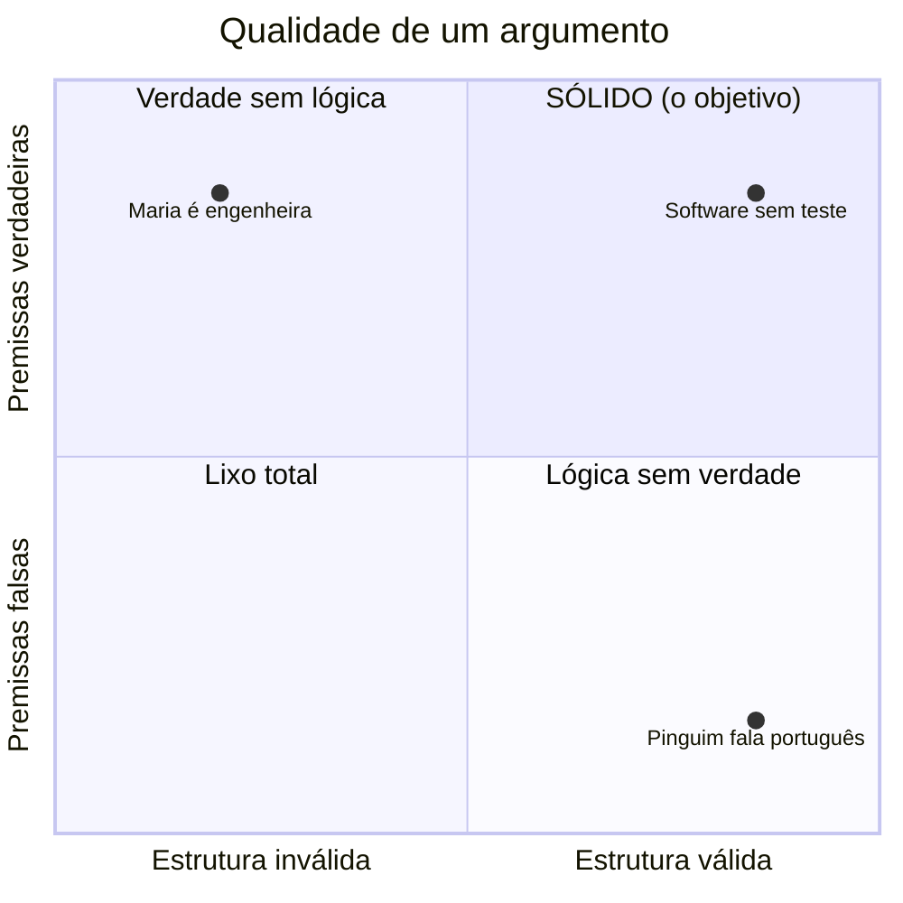
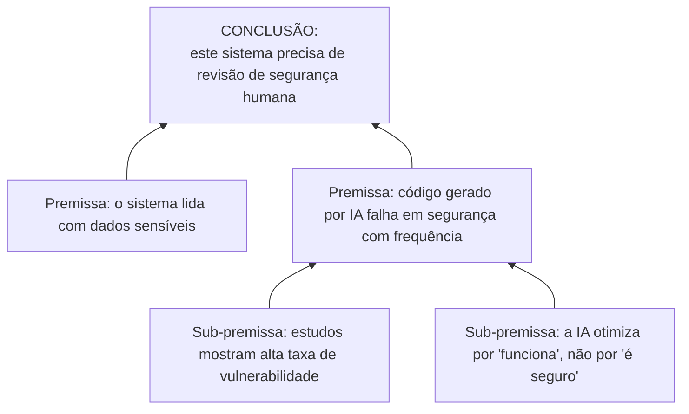

# Anatomia de um Argumento

> [!quote] Anthony Weston
> *"Dar um argumento não significa apenas afirmar certas opiniões, nem é só uma questão de discutir. Argumentos são tentativas de sustentar certas opiniões com razões."*

Argumentar, no sentido filosófico, **não é brigar**. É a habilidade de sustentar uma afirmação com razões e de avaliar se as razões dos outros se sustentam. Esta é, provavelmente, a competência mais transferível que você leva desta disciplina: serve para defender um projeto, escrever um TCC, negociar um salário, ler uma notícia e revisar o que uma IA te entregou.

---

## 1. O que é um argumento? 🧱

> [!INFO] Definição
> Um **argumento** é um conjunto de afirmações onde uma delas (a **conclusão**) é sustentada pelas outras (as **premissas**).

A estrutura mínima:

```
Premissa 1:  Todo software sem testes acumula dívida técnica.
Premissa 2:  Este sistema não tem testes.
─────────────────────────────────────────────────────────
Conclusão:   Logo, este sistema acumula dívida técnica.
```

> [!tip] Como achar a conclusão
> A conclusão é o ponto que a pessoa quer que você aceite. Palavras como **"logo", "portanto", "então", "conclui-se"** sinalizam a conclusão. Palavras como **"porque", "já que", "pois", "dado que"** sinalizam premissas. Treine o olho para isso e metade do trabalho está feito.

---

## 2. A distinção que separa amadores de profissionais: validade ≠ verdade ✅

Esta é a ideia mais importante da aula. Leia duas vezes.

> [!INFO] Três conceitos diferentes
> - **Verdade** é uma propriedade das **premissas** isoladas: a afirmação corresponde à realidade?
> - **Validade** é uma propriedade da **estrutura**: *se* as premissas fossem verdadeiras, a conclusão seria forçada?
> - **Solidez** é ter as duas coisas juntas: estrutura válida **e** premissas verdadeiras.

Um argumento pode ser **válido e falso ao mesmo tempo**:

> [!example] Válido, mas não sólido
> - Premissa 1: Todo pássaro fala português.
> - Premissa 2: O pinguim é um pássaro.
> - Conclusão: Logo, o pinguim fala português.
>
> A **estrutura é perfeita** (a conclusão segue logicamente). Mas a Premissa 1 é falsa, então o argumento não prova nada. Ele é **válido**, mas não é **sólido**.

E pode ser **inválido com premissas verdadeiras**:

> [!example] Tudo verdade, mas inválido
> - Premissa 1: Alguns engenheiros sabem programar. (verdade)
> - Premissa 2: Maria sabe programar. (verdade)
> - Conclusão: Logo, Maria é engenheira. (não segue!)
>
> Maria pode ser médica que aprendeu Python. As premissas são verdadeiras, mas a conclusão **não está garantida** por elas.



> [!warning] Por que isso importa na era da IA
> Um LLM é uma máquina de produzir texto **estruturalmente convincente**. Ele encadeia frases que *soam* como um bom argumento. Seu trabalho é checar as duas camadas separadamente: a estrutura fecha? E cada premissa é verdadeira? Fluência engana na primeira camada e esconde furos na segunda.

---

## 3. Dois tipos de argumento: dedução e indução 🔬

| | Dedução | Indução |
|--|---------|---------|
| **Promessa** | Se as premissas são verdadeiras, a conclusão é **garantida** | As premissas tornam a conclusão **provável** |
| **Exemplo** | Matemática, lógica formal | Ciência, estatística, "testei 100 casos e funcionou" |
| **Como falha** | Estrutura inválida | Amostra pequena ou enviesada |
| **Força** | Certeza | Alcance (fala do mundo real) |

> [!tip] IA é raciocínio indutivo turbinado
> Modelos de linguagem aprendem padrões de muitos exemplos e generalizam: isso é **indução** em escala industrial. Por isso eles são ótimos no provável e no típico, e perigosos no caso raro, no novo e na exceção. Reconhecer que a IA "pensa por indução" explica de imediato onde ela costuma errar.

---

## 4. Falácias: os erros que parecem certos ⚠️

![[Recursos/Filosofia da Mente e da Tecnologia/aristoteles.jpg|Aristóteles (384-322 a.C.) foi o primeiro a catalogar as falácias, nas "Refutações Sofísticas". Fonte: Wikimedia Commons]]

> [!INFO] Definição
> Uma **falácia** é um argumento que parece convincente mas tem um defeito lógico. Saber nomeá-las é como ter um detector de fumaça mental.

### As mais comuns (com exemplo atual)

| Falácia | O truque | Exemplo |
|---------|----------|---------|
| **Ad hominem** | Atacar a pessoa em vez do argumento | "Você não pode falar de IA, nem formado você é." |
| **Espantalho (straw man)** | Distorcer a posição do outro para derrubá-la fácil | "Quem pede ética na IA quer proibir todo computador." |
| **Falsa dicotomia** | Fingir que só há duas opções | "Ou você confia 100% na IA, ou é tecnofóbico." |
| **Apelo à autoridade** | "É verdade porque um famoso disse" | "Um CEO de tech disse que AGI chega em 2027, então chega." |
| **Apelo à popularidade** | "Todo mundo usa, então é bom" | "Milhões usam esse chatbot, logo as respostas são confiáveis." |
| **Petição de princípio** | Usar a conclusão como premissa | "A IA é confiável porque ela mesma diz que verificou." |
| **Correlação ≠ causa** | Confundir "veio junto" com "causou" | "Notas caíram quando liberaram o ChatGPT, logo o ChatGPT emburrece." |
| **Apelo à novidade** | "É novo, logo é melhor" | "Esse modelo é de 2026, então supera tudo de antes." |

> [!example] Falácia escondida num texto de IA
> Peça a um LLM para defender uma posição polêmica. Quase sempre aparece um **apelo à autoridade vago** ("especialistas concordam que...") sem dizer quais especialistas, ou uma **falsa dicotomia** que simplifica o problema. A IA reproduz as falácias que existem nos textos com que foi treinada.

---

## 5. Mapear um argumento (a técnica que destrava tudo) 🗺️

Quando um argumento é longo, desenhe. Separe a conclusão principal, as premissas que a sustentam e as sub-premissas que sustentam cada premissa.



> [!tip] O poder do mapa
> Ao desenhar, você descobre **onde o argumento é forte e onde é frágil**. Em vez de discordar de tudo ("não concordo"), você aponta o ponto exato: "aceito as premissas, mas elas não sustentam essa conclusão tão forte" ou "a estrutura fecha, mas a premissa 2 é duvidosa". É assim que se discorda com elegância e se vence um debate.

---

## 6. Por que isto é competência profissional 💼

- **Revisar IA:** você passa a ler o output de uma IA como leria um argumento: estrutura fecha? Premissas são verdadeiras? Tem falácia escondida?
- **Defender decisões:** "escolhi esta arquitetura" vira um argumento explícito com premissas, que convence chefe e banca.
- **Imunidade a manipulação:** propaganda, fake news e discurso de venda são feitos de falácias. Quem as nomeia não morde a isca.
- **Escrever melhor:** TCC, relatório e e-mail ficam mais fortes quando a conclusão é sustentada por razões claras, e não apenas afirmada.

---

## 7. Atividade Mão na Massa 🧪

> [!example] 🧪 Atividade 1: Disseca um argumento real
>
> 1. Pegue um texto curto de opinião (post, editorial, thread) sobre tecnologia ou IA.
> 2. Identifique e escreva separadamente: a **conclusão** principal e as **premissas**.
> 3. Avalie: a estrutura é **válida**? Cada premissa é **verdadeira**? O argumento é **sólido**?
> 4. Cace **pelo menos uma falácia** da tabela da Seção 4.
>
> **Resultado observável:** uma página com o argumento mapeado e o diagnóstico (válido/sólido, falácia encontrada).

> [!example] 🧪 Atividade 2: Vire o juiz da IA
>
> 1. Peça a um LLM um argumento a favor de algo (ex.: "argumente que toda escola deveria proibir celular").
> 2. Mapeie o argumento que a IA produziu (use o estilo da Seção 5).
> 3. Encontre o elo mais fraco: uma premissa duvidosa ou uma falácia.
> 4. Devolva à IA: "a premissa X é falsa porque..." e veja se ela conserta ou inventa uma defesa nova.
>
> **Conexão com o tema:** você está fazendo **revisão crítica de output**, a habilidade número um de quem trabalha com IA de forma profissional.

---

## 8. Síntese 🧭

> [!tip] As três perguntas que você leva pra vida
> Diante de qualquer afirmação, sua ou dos outros, pergunte:
> 1. **Qual é a conclusão e quais são as premissas?** (achar a estrutura)
> 2. **A conclusão segue das premissas?** (validade)
> 3. **As premissas são verdadeiras?** (verdade)
>
> Quem faz essas três perguntas com naturalidade pensa melhor que a maioria. E pensa melhor que muita IA.

---

➡️ **Próxima aula sugerida:** [[O Teste de Turing e o Quarto Chinês]], para aplicar o pensamento crítico à pergunta "máquinas pensam?".

---

> [!note] 📚 Fontes
>
> - **Weston, A.** *A Rulebook for Arguments* (em português: *A Arte de Argumentar*). Livro curto e direto, a base desta aula. (Tier S, canônico)
> - **Walton, D.** *Informal Logic: A Pragmatic Approach.* Cambridge University Press. Tratamento aprofundado de falácias. (Tier A)
> - **Hansen, H.** *Fallacies.* Stanford Encyclopedia of Philosophy: [plato.stanford.edu/entries/fallacies](https://plato.stanford.edu/entries/fallacies/) (Tier A, autoritativo)
> - **Aristóteles.** *Refutações Sofísticas* e *Retórica.* A origem do estudo das falácias e da argumentação. (Tier S, clássico)
