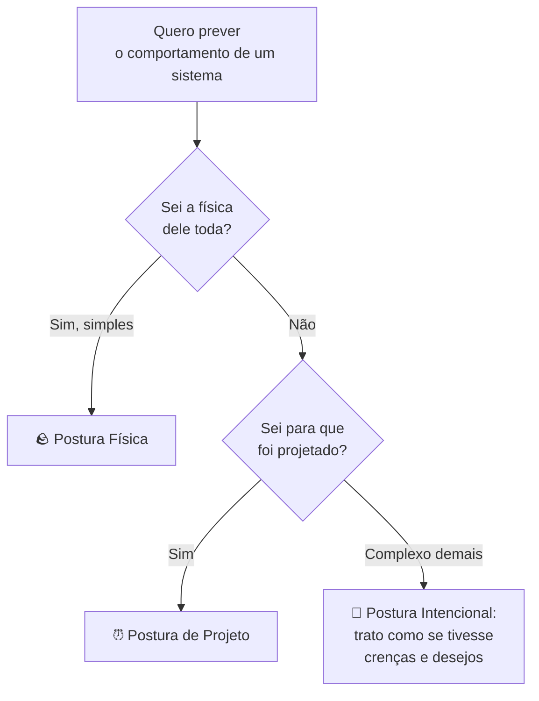
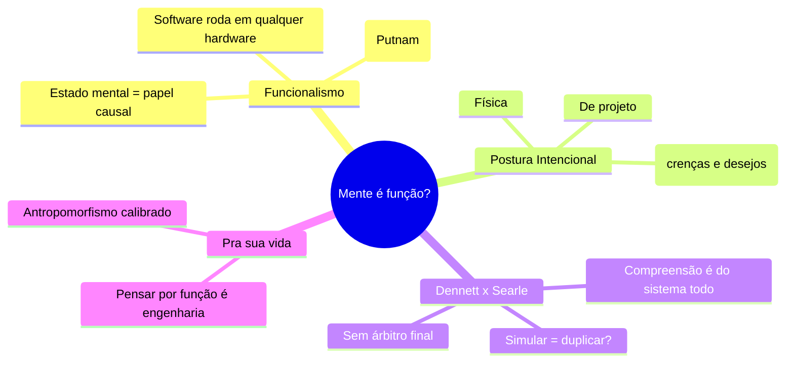

# Funcionalismo e a Postura Intencional

> [!quote] Daniel Dennett
> *"A questão não é se as máquinas podem ter mentes, mas se nós temos mentes no sentido que imaginamos ter."*

Na aula anterior, Searle trancou você num quarto manipulando símbolos chineses para provar que executar um programa **não é** entender. Agora conheça o adversário mais teimoso de Searle: **Daniel Dennett**, que responde mais ou menos assim: *"E se entender for justamente fazer o trabalho direito? E se não houver nada de mágico por trás além da função?"*

---

## 1. Recapitulando o desafio 🔁

Searle: **sintaxe não gera semântica**. Mexer símbolos pela forma nunca produz compreensão de verdade.

A pergunta funcionalista vira a mesa: *o que mais a compreensão poderia ser, além de uma forma muito sofisticada de mexer símbolos do jeito certo, conectada ao mundo do jeito certo?* Para o funcionalista, "entender" não é uma substância secreta, é um **conjunto de habilidades**.

---

## 2. Funcionalismo: a mente é o que a mente faz ⚙️

> [!INFO] Definição
> **Funcionalismo** é a tese de que estados mentais são definidos pelo seu **papel causal** (o que os causa, o que eles causam, como se relacionam com outros estados), e **não** pelo material de que são feitos.

A analogia que todo técnico entende na hora:

> [!tip] Mente está para cérebro como software está para hardware
> O mesmo programa roda num PC, num Mac, num celular. O que importa é a **função** que ele executa, não o silício específico. O funcionalista diz: estados mentais são como software. "Dor" é o estado que detecta dano, gera aversão e te faz recuar, seja num cérebro humano, num polvo ou (em princípio) num circuito.

### Realização múltipla

Essa ideia tem nome: **realização múltipla** (Hilary Putnam, anos 1960). O mesmo estado mental pode ser "realizado" em substratos físicos diferentes. Se isso é verdade, então a mente **não está presa à biologia**, e uma máquina poderia, em princípio, ter estados mentais ao rodar a organização funcional certa.

> [!warning] Onde Searle e o funcionalista batem de frente
> Searle: o cérebro tem **poderes causais** específicos (biológicos) que produzem a mente; imitar a função em silício não basta. Funcionalista: se você reproduz toda a organização funcional, reproduz a mente, porque não existe um "algo a mais" além da função. Esse é o ringue central da filosofia da mente.

---

## 3. A Postura Intencional de Dennett 🎯

Dennett dá uma ferramenta prática. Ele diz que, para **prever** o comportamento de um sistema, adotamos uma de três posturas:

| Postura | Como você prevê o sistema | Exemplo |
|---------|---------------------------|---------|
| **Física** | Pelas leis da física e seu estado material | Prever onde uma pedra cai |
| **De projeto** (design) | Pelo que ele foi projetado para fazer | "O despertador vai tocar às 7h porque foi configurado" |
| **Intencional** | Atribuindo a ele crenças, desejos e racionalidade | "O ChatGPT vai completar a frase porque quer dar a resposta mais provável" |

> [!INFO] A postura intencional
> Tratar um sistema **como se** ele tivesse crenças e desejos, porque isso **funciona** para prever o que ele faz. Você não está afirmando que ele realmente sente: está usando a estratégia mais eficiente de previsão.

> [!tip] Você já faz isso com IA
> Quando você diz *"a IA achou que eu queria código em Python"* ou *"o corretor quer me sugerir essa palavra"*, você adotou a postura intencional. É cômodo e prevê bem. A pergunta filosófica de Dennett: **existe algum fato a mais** que decida se a IA "realmente" tem crenças, ou ter o padrão previsível **já é** ter crenças?

---

## 4. Dennett responde a Searle ⚔️

Lembra da **Resposta dos Sistemas** (o quarto inteiro entende, não a pessoa)? Dennett a defende, e vai além:

- Searle pede que você procure a "compreensão" olhando dentro da pessoa na sala. Dennett diz que isso é como procurar a "vida" olhando uma molécula isolada de um ser vivo: a compreensão é uma **propriedade do sistema todo em operação**, não de uma peça.
- Para Dennett, a intuição de Searle ("eu sinto que só estou mexendo símbolos") é justamente o que **não** dá para confiar. Nossos neurônios também "só" disparam sinais sem entender nada; a compreensão emerge da organização, não de uma centelha mágica.

> [!note] A tréplica de Searle
> Searle rebate: você está confundindo **simular** com **duplicar**. Uma simulação perfeita de digestão não digere nada de verdade; por que uma simulação de mente teria mente de verdade? Dennett responde que mente, ao contrário de digestão, **é** organização funcional, então simular a organização certa não é imitar a mente, é tê-la. O debate não tem árbitro final, e é por isso que continua vivo.

| | Searle (Quarto Chinês) | Dennett (Funcionalismo) |
|--|------------------------|--------------------------|
| O que é entender | Ter semântica, ligada a poderes causais biológicos | Desempenhar o papel funcional certo |
| Máquina pode pensar? | Não, só simula | Em princípio sim, se replicar a função |
| A intuição "só mexo símbolos" | Prova que falta compreensão | Não prova nada: neurônios também "só" disparam |
| Risco do oposto | Chauvinismo biológico (só carbono pensa) | Liberalismo (atribuir mente demais) |

---

## 5. Por que isso importa pra você 💡

- **Antropomorfismo calibrado:** a postura intencional é útil (prever a IA), mas saber que é uma **estratégia**, não um diagnóstico, evita que você acredite que o chatbot "se importa" com você.
- **Design de sistemas:** pensar em termos de função (o que o sistema precisa fazer e como seus estados se relacionam) é exatamente engenharia. O funcionalismo é, no fundo, a filosofia implícita de quem programa.
- **O debate da IA forte:** quando alguém afirmar que tal IA "é consciente" ou "só finge", você saberá que isso reativa Searle vs Dennett, e que a resposta depende de uma escolha filosófica, não só de um benchmark.

---

## 6. Atividade Mão na Massa 🧪

> [!example] 🧪 Atividade 1: As três posturas num termostato e num LLM
>
> 1. Pegue um objeto simples com comportamento (um termostato, um despertador, a luz automática do corredor).
> 2. Escreva **uma previsão** do comportamento dele em **cada** postura: física, de projeto e intencional (ex.: intencional = "ele *quer* manter 22 °C").
> 3. Agora faça o mesmo com um LLM (ChatGPT/Claude): dê um prompt e preveja a resposta nas três posturas.
> 4. Anote: em qual objeto a postura intencional foi **necessária** (você não conseguiria prever sem ela) e em qual foi só um luxo?
>
> **Resultado observável:** uma tabela 2x3 (objetos x posturas) preenchida, com a sua conclusão sobre quando "atribuir desejos" deixa de ser opcional.

> [!example] 🧪 Atividade 2: Teste a realização múltipla
>
> 1. Escolha um algoritmo simples (ex.: ordenar 5 números do menor ao maior).
> 2. "Execute" o mesmo algoritmo em **três substratos**: (a) na sua cabeça, (b) com cartas de baralho na mesa, (c) pedindo a um LLM para rodar passo a passo.
> 3. Compare as saídas.
>
> **Conexão com o tema:** se o **mesmo** processo funcional rodou em cérebro, papel e silício com o mesmo resultado, você acabou de demonstrar realização múltipla na prática. A pergunta que sobra: se ordenar números é independente do substrato, por que *entender* não seria?

---

## 7. Síntese 🧭

> [!tip] A frase pra levar pra casa
> Searle pergunta o que a máquina **é** por dentro. Dennett pergunta se essa pergunta tem resposta além do que a máquina **faz**. Toda vez que você diz "a IA quer", você está, sem saber, do lado de Dennett. Toda vez que sente que "não é a mesma coisa", está do lado de Searle.

---

➡️ **Próxima aula sugerida:** [[O Problema Difícil da Consciência]], onde até quem aceita o funcionalismo trava num osso que parece impossível de roer.

---

> [!note] 📚 Fontes
>
> - **Dennett, D. (1987).** *The Intentional Stance.* MIT Press. A obra-âncora das três posturas. (Tier S, canônico)
> - **Dennett, D. (1991).** *Consciousness Explained.* Little, Brown. A visão funcionalista da consciência. (Tier S)
> - **Putnam, H. (1967).** *The Nature of Mental States.* Origem da realização múltipla e do funcionalismo. (Tier S, canônico)
> - **Levin, J.** *Functionalism.* Stanford Encyclopedia of Philosophy: [plato.stanford.edu/entries/functionalism](https://plato.stanford.edu/entries/functionalism/) (Tier A, autoritativo)
