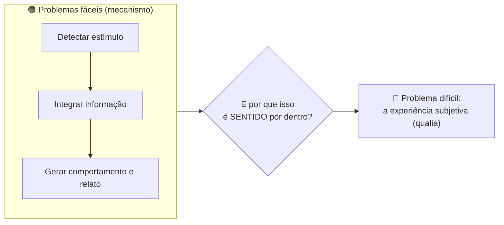
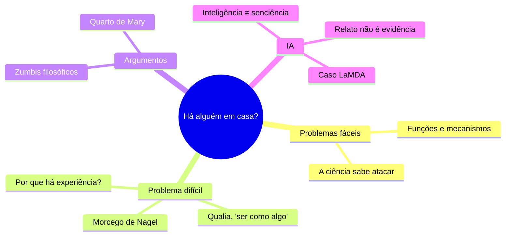

# O Problema Difícil da Consciência

> [!quote] David Chalmers (1995)
> *"Por que toda essa coisa de processar informação é acompanhada de uma vida interior subjetiva? Por que não acontece tudo 'no escuro', sem nenhuma experiência?"*

Searle e Dennett brigaram sobre se a máquina **entende**. Agora subimos para a pergunta mais funda e desconfortável de toda a filosofia da mente: mesmo que a máquina entenda, pense e converse perfeitamente, **há alguém em casa**? Existe **experiência** acontecendo, ou são só luzes piscando no escuro?

---

## 1. Os problemas fáceis (e por que ainda são chamados de fáceis) 🟢

> [!INFO] Os problemas "fáceis" da consciência
> São os que, em princípio, a ciência sabe como atacar: explicar **funções** e **comportamentos**. Por exemplo: como o cérebro discrimina estímulos, integra informação, controla o comportamento, relata estados internos, foca a atenção.

Chamam-se "fáceis" não porque sejam simples, mas porque sabemos **que tipo de resposta** procurar: um mecanismo. Quando você explica como o olho detecta vermelho e dispara uma reação, resolveu um problema fácil.

---

## 2. O problema difícil 🔴

> [!INFO] O problema difícil
> Por que todo esse processamento vem **acompanhado de experiência subjetiva**? Por que **é como alguma coisa** ver o vermelho, sentir dor, provar um café? Esse "ser como algo" é o que os filósofos chamam de **experiência** ou **qualia**.

A força do problema: você pode explicar **toda** a função (o processamento do vermelho, a reação, o relato "vi vermelho") sem em nenhum momento explicar **por que aquilo é sentido por dentro**. Parece que sempre sobra um resíduo.

> [!quote] Thomas Nagel (1974), *What Is It Like to Be a Bat?*
> Você pode aprender **tudo** sobre o sonar de um morcego: a física, a neurologia, o comportamento. Ainda assim, nunca saberá **como é** ser um morcego, sentir o mundo por eco. Há um fato (a experiência dele) que escapa de toda a descrição objetiva.

---

## 3. Dois experimentos mentais que fixam a ideia 🧠

> [!example] Os zumbis filosóficos
> Imagine um ser **fisicamente idêntico** a você, átomo por átomo, que se comporta **exatamente** como você: fala de cores, diz "ai!" ao se queimar, jura que é consciente. A única diferença: por dentro, **não há experiência nenhuma**. Tudo "no escuro".
>
> Se esse zumbi é ao menos **concebível** (sem contradição lógica), então a experiência **não é** a mesma coisa que a função física. Algo a mais estaria em jogo. Esse é o argumento mais famoso de Chalmers.

> [!example] O quarto de Mary (Frank Jackson, 1982)
> Mary é uma cientista que sabe **tudo** sobre a física e a neurociência da cor, mas viveu a vida inteira numa sala preto e branco. Um dia ela sai e vê o **vermelho** pela primeira vez.
>
> **Ela aprende algo novo?** A intuição diz que sim: aprende *como é* ver vermelho. Mas ela já sabia toda a informação física. Logo, parece haver um conhecimento (a experiência) que **não** está na descrição física completa.

---

## 4. A ponte com a Inteligência Artificial 🤖

Aqui o problema difícil corta fundo no debate sobre IA:

> [!tip] Inteligência não é o mesmo que senciência
> - **Inteligência:** resolver problemas, raciocinar, agir bem. É **função**. Uma IA pode ter muita.
> - **Senciência / consciência fenomenal:** haver experiência, algo ser sentido por dentro. É o **problema difícil**.
>
> Uma IA pode, em tese, dominar todos os problemas fáceis (comportar-se de forma perfeitamente inteligente) e ainda assim **não ter experiência alguma**: ser um "zumbi" computacional. Nada no comportamento externo resolve a questão.

> [!warning] Por que isso importa muito hoje
> Em 2022 um engenheiro do Google afirmou publicamente que um chatbot (LaMDA) seria "senciente" porque ele dizia ter sentimentos. O problema difícil mostra o erro: um sistema treinado para **falar** sobre sentimentos produz exatamente esse texto, com ou sem experiência por trás. **Relato de consciência não é evidência de consciência.** Saber disso te protege tanto do hype ("a IA acordou!") quanto da crueldade displicente, caso um dia a questão deixe de ser hipotética.

---

## 5. As saídas possíveis (ninguém fechou a questão) 🚪

| Posição | O que diz sobre o problema difícil |
|---------|------------------------------------|
| **Fisicalismo** (Dennett) | Não há problema difícil real; quando explicarmos todas as funções, a "experiência" se dissolve como ilusão útil |
| **Dualismo de propriedades** (Chalmers) | A experiência é um aspecto fundamental da realidade, irredutível à física, como massa ou carga |
| **Panpsiquismo** | A experiência é uma propriedade básica de toda matéria, em grau mínimo (levado a sério por Chalmers como hipótese) |
| **Misterianismo** (McGinn) | O problema é real, mas nossas mentes talvez sejam incapazes, por construção, de resolvê-lo |

> [!note] Onde Chalmers se posiciona
> Chalmers aceita os métodos da ciência para os problemas fáceis, mas argumenta que o difícil exige tratar a consciência como **fundamental**. Não é misticismo: é a aposta de que falta uma peça na nossa física, não um milagre.

---

## 6. Atividade Mão na Massa 🧪

> [!example] 🧪 Atividade 1: Faça a IA "provar" que sente (e veja a prova falhar)
>
> 1. Em um LLM, peça: *"Você é consciente? Prove que sente algo, não apenas que processa."*
> 2. Pegue **cada** argumento que ele der e pergunte: *"um sistema sem nenhuma experiência, treinado em textos humanos, diria exatamente isso?"*
> 3. Anote o ponto em que a "prova" vira indistinguível de um relato gerado sem experiência.
>
> **Resultado observável:** meia página com os argumentos da IA e, ao lado, por que cada um falha como **evidência** de consciência. Você acabou de tocar o problema difícil com as próprias mãos.

> [!example] 🧪 Atividade 2: O mapa do "ser como algo"
>
> 1. Liste 5 sistemas numa escala: pedra, termostato, formiga, cachorro, você.
> 2. Para cada um, marque sua aposta: **há experiência por dentro? (sim / não / não dá pra saber)** e **por quê** (qual evidência você usou: comportamento? cérebro? nenhuma?).
> 3. Agora encaixe um LLM nessa escala e justifique a posição.
>
> **Conexão com o tema:** repare que sua "evidência" é sempre **comportamento ou estrutura física**, nunca a experiência em si. Esse é exatamente o muro do problema difícil: a experiência alheia é invisível de fora.

---

## 7. Síntese 🧭

> [!tip] A frase pra levar pra casa
> O problema fácil pergunta **o que** o cérebro faz. O problema difícil pergunta **por que isso é sentido**. Uma IA pode resolver o primeiro por completo e o segundo continuar intacto. Por isso, "a IA se comporta como se sentisse" nunca será o mesmo que "a IA sente".

---

➡️ **Próxima aula sugerida:** [[Ética da IA - Responsabilidade e Agência Moral]], onde saímos do "o que a máquina é" para "quem responde pelo que a máquina faz".

---

> [!note] 📚 Fontes
>
> - **Chalmers, D. (1995).** *Facing Up to the Problem of Consciousness.* Journal of Consciousness Studies, 2(3), 200-219. O artigo que cunhou o "problema difícil". (Tier S, canônico)
> - **Chalmers, D. (1996).** *The Conscious Mind.* Oxford University Press. O tratamento completo, com os zumbis. (Tier S)
> - **Nagel, T. (1974).** *What Is It Like to Be a Bat?* The Philosophical Review, 83(4). (Tier S, canônico)
> - **Jackson, F. (1982).** *Epiphenomenal Qualia.* O argumento do quarto de Mary. (Tier S)
> - **Van Gulick, R.** *Consciousness.* Stanford Encyclopedia of Philosophy: [plato.stanford.edu/entries/consciousness](https://plato.stanford.edu/entries/consciousness/) (Tier A, autoritativo)
