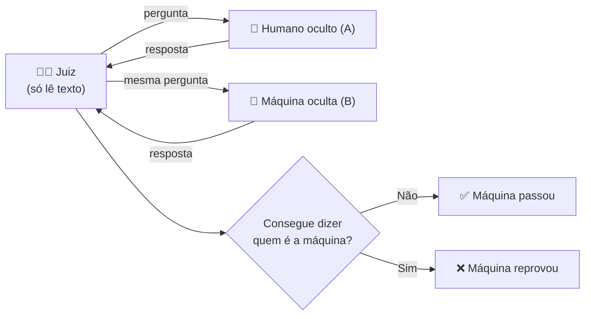
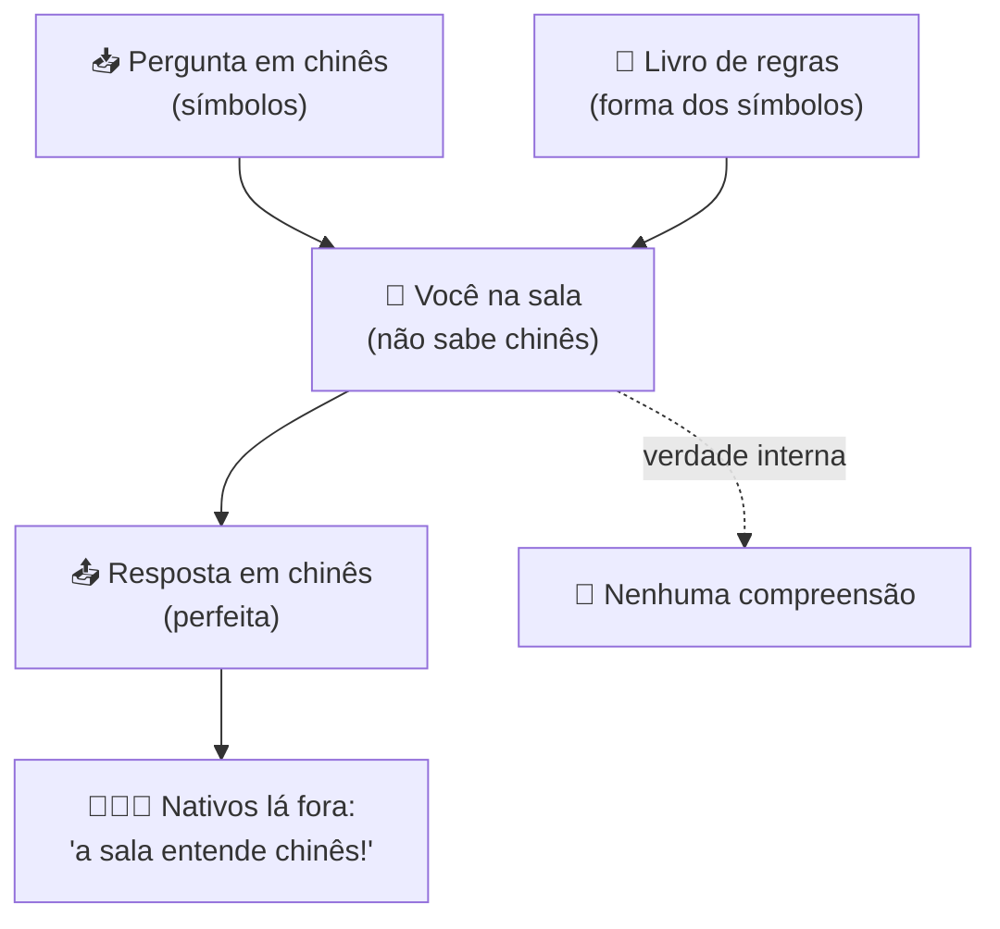
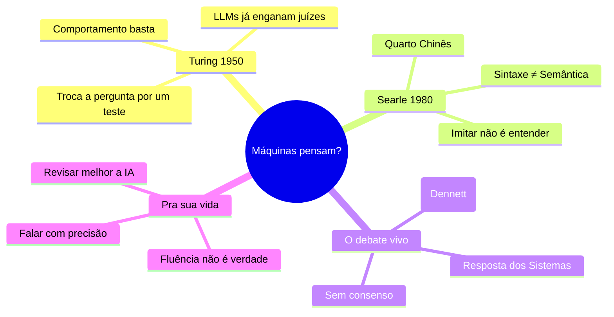

# O Teste de Turing e o Quarto Chinês

> [!quote] Alan Turing (1950)
> *"Proponho considerar a questão: 'Máquinas podem pensar?'"*

> [!quote] John Searle (1980)
> *"O programa de computador certo, com as entradas e saídas certas, teria por isso uma mente exatamente no sentido em que seres humanos têm mentes? Eu chamo essa afirmação de 'IA forte'."*

Duas frases, trinta anos de distância, e o debate mais importante da filosofia da inteligência artificial entre elas. Esta aula é sobre a pergunta que você faz toda vez que conversa com o ChatGPT e sente um arrepio: *isso aí entende mesmo o que eu disse, ou só parece que entende?*

---

## 1. O problema: como saber se uma máquina pensa? 🤔

![[Recursos/Filosofia da Mente e da Tecnologia/alan-turing.jpg|Alan Turing (1912-1954), matemático britânico que propôs o teste em 1950. Fonte: Wikimedia Commons]]

Em 1950, **Alan Turing** (o matemático que ajudou a quebrar a Enigma na Segunda Guerra e que praticamente fundou a ciência da computação) percebeu um problema. A pergunta "máquinas podem pensar?" é uma armadilha, porque ninguém concorda com o que "pensar" significa.

A solução de Turing foi genial: **trocar a pergunta**. Em vez de definir "pensar", ele propôs um teste comportamental. Se a máquina se comporta de modo indistinguível de um ser humano numa conversa, paramos de exigir mais que isso.

---

## 2. O Teste de Turing (o "Jogo da Imitação") 🎭

> [!INFO] Definição
> No **Teste de Turing**, um juiz humano conversa por texto (sem ver nem ouvir) com dois interlocutores escondidos: um humano e uma máquina. Se, depois de conversar bastante, o juiz não consegue dizer com segurança qual é qual, a máquina **passou no teste**.

A aposta de Turing era epistemológica: nós nem conseguimos provar que *outras pessoas* pensam, confiamos no comportamento delas. Por que exigir da máquina uma prova que não exigimos do colega de carteira?

![[Recursos/Filosofia da Mente e da Tecnologia/teste-de-turing-diagrama.png|O Jogo da Imitação: o interrogador (C) conversa só por texto com um humano e uma máquina (A e B) e tenta descobrir qual é qual. Fonte: Wikimedia Commons]]

### Os LLMs passam no Teste de Turing?

Em conversas curtas e casuais, modelos como ChatGPT, Claude e Gemini **já enganam juízes humanos com frequência**. Estudos de 2024 e 2025 mostraram juízes confundindo IA com pessoas em boa parte das rodadas. Antes deles, o chatbot "Eugene Goostman" (2014) alegou ter passado se passando por um adolescente ucraniano de 13 anos, justamente para que erros de gramática e fugas de assunto parecessem naturais.

> [!warning] Cuidado com o anúncio "a IA passou no Teste de Turing"
> Passar no teste prova que a máquina **imita bem a conversa humana**. Não prova que ela entende, sente ou tem consciência. O próprio truque do "adolescente ucraniano" mostra que o teste pode ser vencido pela trapaça, não pela inteligência. É aqui que entra Searle.

---

## 3. O Quarto Chinês: a grande objeção 📦

![[Recursos/Filosofia da Mente e da Tecnologia/john-searle.jpg|John Searle, filósofo que formulou o argumento do Quarto Chinês em 1980. Fonte: Wikimedia Commons]]

Em 1980, o filósofo **John Searle** publicou um experimento mental para mostrar que **passar no Teste de Turing não é entender**. É talvez o argumento mais discutido da filosofia da mente moderna.

> [!example] O experimento mental
> Imagine que **você** está trancado numa sala. Você não sabe **nada** de chinês: para você, os caracteres são rabiscos sem sentido.
>
> Dentro da sala há um **livro de regras gigante** (em português, que você lê) dizendo coisas como: *"se entrar o rabisco 你好, devolva o rabisco 您好"*. As regras são puramente sobre a **forma** dos símbolos, nunca sobre o significado.
>
> Pela fresta da porta, falantes nativos de chinês passam perguntas escritas em chinês. Você consulta o livro, copia os rabiscos de saída que o livro manda e devolve. As respostas saem **perfeitas**, indistinguíveis de um chinês nativo.
>
> **Do lado de fora, parece que a sala "fala chinês fluente".** Mas você, lá dentro, não entendeu **uma única palavra**. Você só manipulou símbolos seguindo regras.

A conclusão de Searle: **um computador executando um programa é exatamente como você nessa sala.** Ele manipula símbolos pela forma, sem nunca tocar no significado. Logo, executar o programa certo não basta para entender, por mais convincente que seja a saída.

---

## 4. O coração do argumento: sintaxe ≠ semântica 🔑

> [!INFO] As duas palavras que você precisa levar pra vida
> - **Sintaxe** é a **forma**: quais símbolos, em que ordem, segundo quais regras. Um computador é uma máquina sintática perfeita.
> - **Semântica** é o **significado**: aquilo a que os símbolos se referem no mundo. É entender que "água" é aquela coisa molhada que mata a sede.

O argumento de Searle, em três linhas:

1. Programas são definidos por **sintaxe** (manipulação de símbolos pela forma).
2. Mentes têm **semântica** (significados, conteúdo, referência ao mundo).
3. Sintaxe, sozinha, não produz semântica. **Logo, executar um programa não é, por si só, ter uma mente.**

> [!tip] A ponte com os LLMs de hoje
> Um modelo de linguagem prevê o próximo "token" com base em padrões estatísticos de bilhões de textos. Isso é manipulação sofisticadíssima de **forma**. A pergunta de Searle, aplicada a 2026: quando o ChatGPT escreve "eu entendo sua dor", ele está do lado da sintaxe (padrão aprendido) ou da semântica (compreensão real)? Você não precisa fechar a resposta hoje. Precisa saber que a pergunta é legítima e séria.

---

## 5. As respostas a Searle (e as tréplicas) ⚔️

Searle antecipou as objeções e respondeu a cada uma. Esta é a parte mais rica do debate.

| Resposta a Searle | A ideia | A tréplica de Searle |
|-------------------|---------|----------------------|
| **Resposta dos Sistemas** | Você não entende chinês, mas o *sistema inteiro* (você + livro + sala) entende. | "Então memorize o livro e saia da sala. Agora o sistema sou só eu, e eu continuo sem entender nada." |
| **Resposta do Robô** | Ponha o programa num robô com câmeras e braços, conectado ao mundo. Aí haveria significado. | "Trocar perguntas por sinais de sensores não muda nada: continuo manipulando símbolos sem saber o que representam." |
| **Resposta do Cérebro Simulado** | E se o programa simular neurônio por neurônio um cérebro chinês? | "Simular a forma do cérebro não é ter o que o cérebro tem, assim como simular uma tempestade não molha ninguém." |
| **Resposta das Outras Mentes** | Como você sabe que *qualquer um* entende? Só pelo comportamento. | "A pergunta não é como eu sei, é o que está de fato lá. Comportamento idêntico pode esconder vazio." |

> [!note] Quem está certo?
> Não há consenso, e essa é a beleza da coisa. Funcionalistas como **Daniel Dennett** acham que Searle se agarra a uma intuição enganosa e que "entender" é justamente fazer o trabalho certo (veremos isso na aula sobre a Postura Intencional). Searle responde que existe uma diferença real entre *parecer* e *ser*. Você vai precisar tomar partido com argumentos, não com torcida.

---

## 6. Por que isso importa pra você, que usa IA todo dia 💡

Isto não é abstração de filósofo. A distinção sintaxe/semântica muda como você trabalha:

- **Revisão de output:** se a IA não "entende", ela pode produzir um texto fluente e perfeito na forma e completamente falso no conteúdo. A fluência não é evidência de verdade. Quem internaliza Searle revisa melhor.
- **Limites de confiança:** sistemas que manipulam forma brilham em padrão e tropeçam em significado novo, em contexto do mundo real, em bom senso. Saber onde fica a fronteira é competência técnica.
- **Linguagem honesta:** dizer "a IA acha que" ou "a IA quer" é cômodo, mas embute uma tese filosófica forte. Falar com precisão sobre o que a máquina faz evita decisões erradas.

---

## 7. Atividade Mão na Massa 🧪

> [!example] 🧪 Atividade 1: Construa o seu Quarto Chinês
>
> **Sem computador, em dupla.**
> 1. A pessoa A inventa um "livro de regras" com 5 trocas de símbolos usando emojis ou figuras geométricas (ex.: "se receber 🔺🔵, responda 🟩🟩").
> 2. A pessoa B, sem ver o significado pretendido, recebe entradas e responde **só consultando a tabela**.
> 3. Depois, A revela que, na cabeça dela, "🔺🔵" significava "que horas são?".
> 4. **Discutam:** B respondeu certo? B *entendeu* a pergunta? Onde estava o significado, se é que estava em algum lugar?
>
> **Resultado observável:** meia página descrevendo o que a dupla concluiu sobre a diferença entre seguir regras e compreender.

> [!example] 🧪 Atividade 2: Caça à fluência sem verdade
>
> **Com um LLM (ChatGPT, Claude, Gemini).**
> 1. Peça à IA para explicar, com total confiança, um conceito **que você domina** (de uma matéria técnica sua).
> 2. Procure **um** ponto onde a resposta soa perfeita mas está errada, impreciosa ou inventada.
> 3. Documente: o trecho, por que está errado, e por que mesmo assim *parecia* convincente.
>
> **Conexão com o tema:** você acabou de flagrar a sintaxe (forma impecável) descolada da semântica (significado correto). Esse é o Quarto Chinês na sua tela.

---

## 8. Síntese 🧭

> [!tip] A frase pra levar pra casa
> Turing nos deu um teste para a **aparência** da inteligência. Searle nos lembrou que aparência pode não ser a coisa em si. Entre os dois mora todo o seu bom senso ao usar uma IA: leve a sério o que ela faz, sem confundir com o que ela é.

---

➡️ **Próxima aula sugerida:** [[O que a IA sabe - Informação, verdade e alucinação]], onde a pergunta deixa de ser "a IA entende?" e passa a ser "a IA sabe?".

---

> [!note] 📚 Fontes
>
> - **Turing, A. M. (1950).** *Computing Machinery and Intelligence.* Mind, 59(236), 433-460. O artigo original do Teste de Turing. (Tier S, canônico)
> - **Searle, J. (1980).** *Minds, Brains, and Programs.* Behavioral and Brain Sciences, 3(3), 417-457. O artigo original do Quarto Chinês. PDF aberto: [home.csulb.edu](https://home.csulb.edu/~cwallis/382/readings/482/searle.minds.brains.programs.bbs.1980.pdf) (Tier S, canônico)
> - **Searle, J. (2006).** *Mente: Uma Breve Introdução.* Civilização Brasileira. Versão acessível em português. (Tier S)
> - **Cole, D.** *The Chinese Room Argument.* Stanford Encyclopedia of Philosophy: [plato.stanford.edu/entries/chinese-room](https://plato.stanford.edu/entries/chinese-room/) (Tier A, autoritativo)
> - **Oppy, G. & Dowe, D.** *The Turing Test.* Stanford Encyclopedia of Philosophy: [plato.stanford.edu/entries/turing-test](https://plato.stanford.edu/entries/turing-test/) (Tier A, autoritativo)
