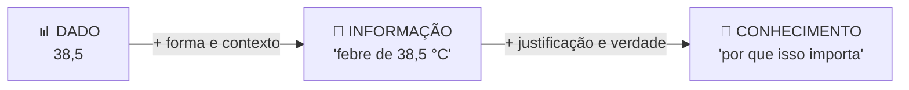
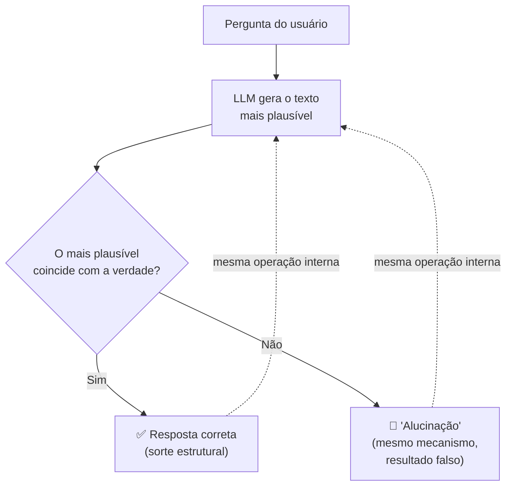
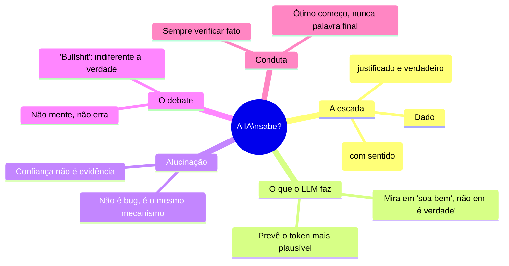

# O que a IA sabe? Informação, verdade e alucinação

> [!quote] Luciano Floridi
> *"Informação não é o mesmo que conhecimento, e dado não é o mesmo que informação. Confundi-los é a fonte de muitos enganos da era digital."*

Na aula sobre o Quarto Chinês perguntamos se a IA **entende**. Aqui a pergunta muda: a IA **sabe** alguma coisa? Quando o ChatGPT te dá uma resposta certa, isso é conhecimento, ou foi sorte estatística? E quando ele inventa um livro que não existe com total confiança, o que exatamente aconteceu?

---

## 1. A escada: dado → informação → conhecimento 🪜

> [!INFO] Três degraus que quase todo mundo confunde
> - **Dado** é uma diferença bruta, sem sentido ainda. O número `38,5` sozinho.
> - **Informação** é dado **bem-formado e com significado**. "A temperatura do paciente é 38,5 °C."
> - **Conhecimento** é informação **justificada, conectada e verdadeira**, que você sabe *por que* é verdadeira. "O paciente está com febre, porque 38,5 °C está acima da faixa normal, e febre indica possível infecção."

O filósofo **Luciano Floridi**, referência mundial em Filosofia da Informação, defende uma tese forte e polêmica: **informação genuína precisa ser verdadeira.** Dados falsos bem-formados não seriam informação, seriam "desinformação". Guarde essa tese, porque ela é a chave para entender o problema dos LLMs.

---

## 2. O que um LLM realmente faz 🤖

> [!INFO] Em uma frase
> Um modelo de linguagem prevê **qual token (pedaço de palavra) é mais provável vir a seguir**, dado tudo que veio antes, com base em padrões extraídos de um corpus gigante de texto.

Repare no que **não** está nessa descrição: nenhuma menção a "verdade", "fato" ou "mundo". O objetivo do modelo é **plausibilidade linguística**, não correção factual. Quando os dois coincidem (o mais provável também é o verdadeiro), a resposta sai certa. Quando divergem, sai um erro fluente e confiante.

> [!tip] A ideia que explica quase tudo
> O LLM otimiza por **"isto soa como uma boa resposta?"**, não por **"isto é verdade?"**. Boa parte do tempo essas duas coisas andam juntas, e por isso a ferramenta é útil. O perigo mora exatamente onde elas se separam.

---

## 3. O que é uma "alucinação", afinal? 👻

> [!INFO] Definição
> Chamamos de **alucinação** quando o modelo produz, com aparência de confiança, uma afirmação falsa, inventada ou sem fonte real: um artigo que não existe, uma data errada, uma citação fabricada, uma função de biblioteca que nunca foi criada.

O termo é **criticado pelos filósofos**, e vale entender por quê:

- "Alucinar" sugere que normalmente o modelo *percebe a realidade* e que, naquele momento, ele falhou. Mas o modelo **nunca** percebeu realidade nenhuma. Ele sempre fez a mesma coisa: prever texto plausível.
- A alucinação não é um **bug ocasional**, é o **mesmo mecanismo** de sempre operando num caso em que o plausível não coincide com o verdadeiro.

> [!warning] A consequência prática
> Não existe, dentro do modelo, um "alarme" que dispara quando ele está inventando. Para ele, a resposta certa e a alucinação têm a **mesma cara** por dentro. Por isso a confiança do tom **não é evidência** de correção. A verificação tem que vir de fora: de você, de uma fonte, de um teste.

---

## 4. O debate filosófico: IA mente, erra ou "produz bullshit"? 🗣️

Em 2024, três filósofos (Hicks, Humphries e Slater) publicaram um artigo provocador com o título *"ChatGPT is bullshit"*. A tese usa um conceito técnico do filósofo **Harry Frankfurt**.

> [!INFO] Mentira × Erro × Bullshit
> - **Mentir** exige saber a verdade e dizer o contrário **de propósito**. O LLM não sabe a verdade, então não pode mentir nesse sentido.
> - **Errar** é tentar acertar a verdade e falhar. Mas o LLM nem está mirando na verdade.
> - **Bullshit** (no sentido de Frankfurt) é falar **sem se importar** se é verdade ou não, focado só em soar convincente. Para esses autores, é a descrição mais exata do que um LLM faz.

> [!quote] Harry Frankfurt, *On Bullshit*
> *"É essa falta de conexão com a verdade, essa indiferença a como as coisas realmente são, que eu vejo como a essência do bullshit."*

> [!note] Por que essa distinção é útil, e não só polêmica
> Dizer que a IA "mente" ou "se engana" empresta a ela uma relação com a verdade que ela não tem. Descrever o mecanismo com precisão (gera o plausível, indiferente ao verdadeiro) leva você à conduta certa: **sempre verificar afirmações factuais**, ainda mais quando soam confiantes. Não é cinismo contra a ferramenta, é manual de uso.

---

## 5. Então a IA nunca "sabe"? Uma visão mais justa ⚖️

Nem todo filósofo é tão duro. Há uma posição intermediária que vale conhecer:

- O LLM **codifica regularidades reais** do mundo que aparecem na linguagem. Quando ele "diz" que a água ferve a 100 °C ao nível do mar, isso não é mero acaso: reflete um padrão verdadeiro presente em milhões de textos.
- Numa leitura **funcionalista** (a mesma da aula sobre Dennett), se o sistema usa informação de forma confiável para agir bem no mundo, faz sentido falar de uma forma fraca de "conhecimento", mesmo sem consciência.
- O ponto de discórdia continua sendo a **justificação**: o modelo não sabe *por que* o que diz é verdade, e não distingue, por dentro, o que sabe do que inventa.

> [!tip] A síntese honesta
> A IA é uma **excelente recuperadora e recombinadora de informação** e uma **péssima garantidora de verdade**. Usá-la bem é explorar a primeira metade sem esquecer a segunda. Trate a saída como a fala de um colega muito lido, muito rápido e que nunca admite que não sabe: ótimo ponto de partida, nunca a palavra final.

---

## 6. Atividade Mão na Massa 🧪

> [!example] 🧪 Atividade 1: Cace uma alucinação de propósito
>
> 1. Peça a um LLM referências bibliográficas sobre um tema bem específico (ex.: "5 artigos científicos sobre segurança em código gerado por IA, com autor, título e ano").
> 2. Tente **verificar cada uma** no Google Acadêmico ou no site do periódico.
> 3. Marque quais existem, quais têm dados trocados e quais são **pura invenção**.
>
> **Resultado observável:** uma tabela com as referências e o veredito de cada uma (real / parcialmente errada / inventada). Quase sempre haverá pelo menos uma fabricação.

> [!example] 🧪 Atividade 2: Dado, informação ou conhecimento?
>
> 1. Pegue três saídas diferentes de uma IA (um número solto, uma frase com contexto, uma explicação justificada).
> 2. Classifique cada uma como **dado**, **informação** ou **conhecimento**, segundo a escada da Seção 1.
> 3. Para a que você chamou de "conhecimento", pergunte: a IA forneceu a **justificação**, ou só afirmou? Isso muda sua classificação?
>
> **Conexão com o tema:** você está aplicando a epistemologia de Floridi para calibrar **quanto confiar** em cada tipo de saída.

---

## 7. Síntese 🧭

> [!tip] A frase pra levar pra casa
> A IA é boa em parecer que sabe e ruim em garantir que é verdade. Quem entende a diferença entre informação e conhecimento usa a ferramenta com a régua certa: aproveita a velocidade sem terceirizar o julgamento.

---

➡️ **Próxima aula sugerida:** [[Anatomia de um Argumento]], para ter as ferramentas de verificar afirmações que a IA (ou qualquer um) te entrega.

---

> [!note] 📚 Fontes
>
> - **Floridi, L. (2010).** *Information: A Very Short Introduction.* Oxford University Press. A escada dado-informação-conhecimento. (Tier S, canônico)
> - **Floridi, L. (2011).** *The Philosophy of Information.* Oxford University Press. Tratamento aprofundado. (Tier S)
> - **Hicks, M. T., Humphries, J. & Slater, J. (2024).** *ChatGPT is bullshit.* Ethics and Information Technology, 26(2). Artigo aberto: [link.springer.com](https://link.springer.com/article/10.1007/s10676-024-09775-5) (Tier A)
> - **Frankfurt, H. (2005).** *On Bullshit.* Princeton University Press. O conceito técnico de "bullshit". (Tier S, clássico)
> - **Steup, M. & Neta, R.** *Epistemology.* Stanford Encyclopedia of Philosophy: [plato.stanford.edu/entries/epistemology](https://plato.stanford.edu/entries/epistemology/) (Tier A, autoritativo)
