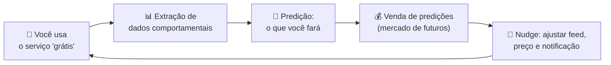
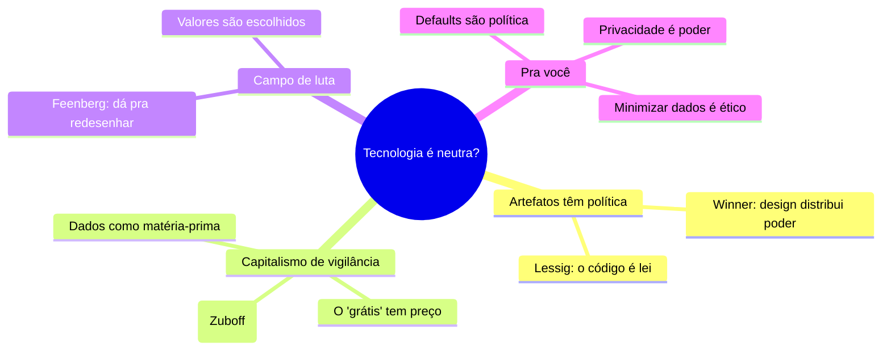

# Ética da IA: Poder, Vigilância e Automação

> [!quote] Shoshana Zuboff (2019)
> *"Se o produto é de graça, então você é o produto. Mas é pior: você é a carcaça abandonada. O 'produto' vem da extração do seu comportamento."*

Existe um mito confortável: o de que a tecnologia é apenas uma ferramenta neutra, e que só o uso é bom ou mau. Esta aula desmonta esse mito. Ferramentas embutem **valores**, **interesses** e **relações de poder**, muitas vezes invisíveis. Para quem constrói sistemas, enxergar isso é a diferença entre ser instrumento de um modelo de negócio e ser autor consciente das próprias escolhas.

---

## 1. Artefatos têm política 🏛️

> [!INFO] A tese de Langdon Winner (1980), *Do Artifacts Have Politics?*
> Objetos técnicos não são neutros: eles **incorporam formas de poder e autoridade**. Um sistema pode, pela própria estrutura, favorecer alguns e excluir outros, antes de qualquer uso.

> [!example] O exemplo clássico (e debatido): as pontes baixas
> Winner conta que as passarelas sobre as vias de Long Island foram construídas baixas demais para ônibus passarem. Efeito: quem dependia de ônibus (em geral, mais pobre) ficava barrado das praias. A política estava **no concreto**, não no uso. (Historiadores discutem se a intenção foi essa; mesmo assim, o caso ilustra como o design distribui acesso e poder.)

> [!tip] A versão digital: "o código é lei" (Lawrence Lessig, 1999)
> No mundo digital, a **arquitetura do software** regula o que você pode fazer tão fortemente quanto uma lei. O botão que não existe, o default que vem marcado, o dado que é obrigatório informar: cada escolha de design **permite e proíbe** comportamentos. Programar é, nesse sentido, legislar.

---

## 2. Capitalismo de vigilância 👁️

![[Recursos/Filosofia da Mente e da Tecnologia/cctv-vigilancia.jpg|As câmeras são a face visível da vigilância; o capitalismo de vigilância opera sobretudo de forma invisível, nos seus dados. Fonte: Wikimedia Commons]]

![[Recursos/Filosofia da Mente e da Tecnologia/shoshana-zuboff.jpg|Shoshana Zuboff, autora de "A Era do Capitalismo de Vigilância" (2019). Fonte: Wikimedia Commons]]

A grande tese da filósofa **Shoshana Zuboff** (2019) sobre o modelo de negócio que domina a internet:

> [!INFO] Capitalismo de vigilância
> Um modelo econômico que reivindica a **experiência humana** como matéria-prima gratuita. Seus dados de comportamento são extraídos, usados para **prever** o que você vai fazer, e essas predições são vendidas em mercados de "futuros comportamentais" (anunciantes, plataformas). O objetivo final não é só prever, é **modificar** seu comportamento em escala.

> [!warning] O ponto cego
> O serviço parece um presente (e-mail grátis, rede social grátis, busca grátis). O preço real é pago em **dados e em influência sobre suas escolhas**. A IA é o motor dessa máquina: é ela que transforma o rastro bruto em predição lucrativa. Quanto melhor o modelo, mais precisa a previsão e maior o poder de quem a possui.

---

## 3. A tecnologia é um campo de luta, não um destino ⚖️

> [!INFO] Teoria crítica da tecnologia (Andrew Feenberg, 1999)
> A tecnologia não é nem salvadora neutra nem maldição inevitável. Ela é **socialmente construída**: os valores de quem a projeta ficam embutidos no design, mas esse design **pode ser disputado e redesenhado** de forma mais democrática. Não estamos condenados ao que as plataformas escolheram para nós.

| Visão ingênua | Visão crítica (Winner, Zuboff, Feenberg) |
|---------------|-------------------------------------------|
| Tecnologia é neutra; só o uso conta | O design já embute valores e interesses |
| "É só uma ferramenta" | A ferramenta molda quem a usa e quem é excluído |
| Progresso tem um caminho único | Há sempre escolhas; outro design era possível |
| O usuário está no controle | Defaults e arquitetura guiam o comportamento |

---

## 4. Automação e poder 🤖

Automatizar nunca é só "fazer mais rápido". É **redistribuir poder**:

- **Quem decide o que automatizar** decide quais empregos somem e quais tarefas viram invisíveis.
- **Vieses viram escala:** uma regra injusta feita por uma pessoa afeta poucos; automatizada, afeta milhões em silêncio (ver o caso COMPAS em [[Ética da IA - Responsabilidade e Agência Moral]]).
- **Assimetria de informação:** a plataforma sabe quase tudo sobre você; você sabe quase nada sobre o algoritmo dela. Essa assimetria **é** poder.

> [!tip] Privacidade não é "ter o que esconder"
> Privacidade é **controle sobre a informação a seu respeito**, e portanto controle sobre o poder que os outros têm sobre você. Abrir mão dela não é inocente: é transferir poder. Por isso a defesa da privacidade é uma questão política, não só uma preferência pessoal.

---

## 5. Por que isso importa pra você 💼

- **Seus defaults são política.** O que vem marcado por padrão, o que é opcional, o que é obrigatório coletar: cada default decide o comportamento da maioria, que nunca mexe nas configurações.
- **Minimização de dados é uma postura ética.** Coletar só o necessário, e não "tudo que der", é uma escolha de design que limita o poder que o sistema acumula.
- **Você pode redesenhar.** A teoria crítica é otimista: se o design embute valores, então **bons** valores também podem ser projetados (transparência, consentimento real, controle do usuário). Isso está nas suas mãos quando você constrói.

---

## 6. Atividade Mão na Massa 🧪

> [!example] 🧪 Atividade 1: Veja quem te observa (Blacklight)
>
> **Ferramenta:** [Blacklight, do The Markup](https://themarkup.org/blacklight) (gratuito, no navegador)
> 1. Cole a URL de um site popular que você usa (um jornal, uma loja, uma rede social).
> 2. Rode o scan e leia o relatório: quantos **rastreadores de terceiros**, **cookies**, *key loggers* de sessão e *trackers* de anúncios o site carrega.
> 3. Repita com **2 ou 3 sites** e compare.
>
> **Resultado observável:** uma tabela com os sites e o número de rastreadores de cada um. Anote o que mais te surpreendeu. Você acabou de medir, em números, a extração da Seção 2.

> [!example] 🧪 Atividade 2: Abra a caixa-preta com o F12
>
> **Ferramenta:** as Ferramentas de Desenvolvedor do navegador (tecla **F12**).
> 1. Abra um site grátis, aperte F12 e vá na aba **Application → Cookies** (ou **Storage**).
> 2. Conte quantos cookies são do **próprio site** e quantos são de **domínios de terceiros** (Google, Facebook, redes de anúncio).
> 3. Vá na aba **Network**, recarregue a página e observe quantas requisições saem para domínios que você nunca digitou.
>
> **Resultado observável:** o número de cookies próprios x de terceiros + um print da aba Network. **Conexão:** cada terceiro ali é um ponto de extração de dados. O "grátis" tem um custo, e você acabou de vê-lo listado.

---

## 7. Síntese 🧭

> [!tip] A frase pra levar pra casa
> Nenhuma tecnologia cai do céu neutra: ela carrega as escolhas de quem a fez. A pergunta não é "a ferramenta é boa ou má?", mas "a serviço de quem ela foi desenhada, e eu, ao construir, a serviço de quem desenho a minha?".

---

➡️ **Voltar ao** [[Tópicos/Filosofia da Mente e da Tecnologia/index|índice da disciplina]] para revisar as quatro partes: Mente, Epistemologia, Pensar bem e Ética.

---

> [!note] 📚 Fontes
>
> - **Winner, L. (1980).** *Do Artifacts Have Politics?* Daedalus, 109(1). O clássico sobre política embutida em artefatos. (Tier S, canônico)
> - **Zuboff, S. (2019).** *The Age of Surveillance Capitalism.* PublicAffairs. A obra de referência sobre o tema. (Tier S)
> - **Lessig, L. (1999).** *Code and Other Laws of Cyberspace.* Basic Books. "O código é lei". (Tier S)
> - **Feenberg, A. (1999).** *Questioning Technology.* Routledge. Teoria crítica da tecnologia. (Tier A)
> - **Hagey, K. et al.** *Blacklight.* The Markup. Ferramenta de auditoria de rastreadores: [themarkup.org/blacklight](https://themarkup.org/blacklight) (Tier B, jornalismo de tecnologia)
