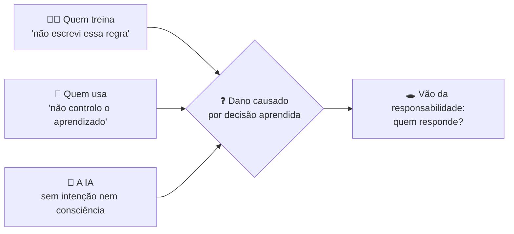
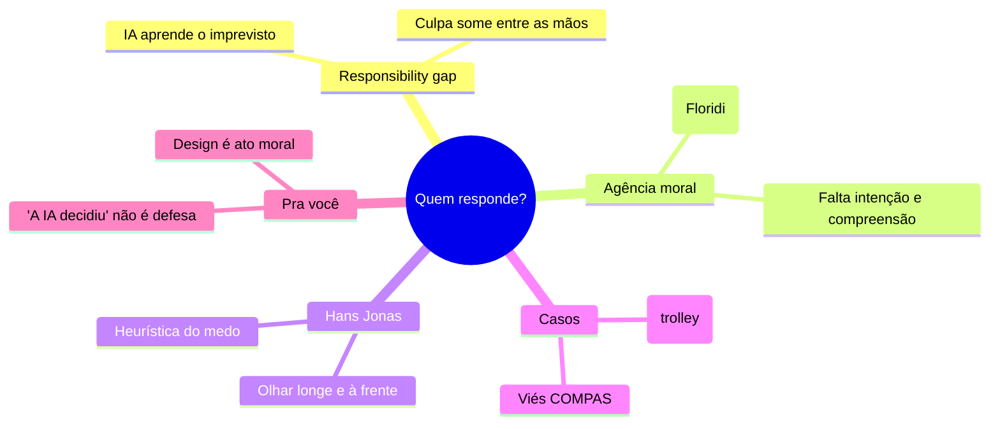

# Ética da IA: Responsabilidade e Agência Moral

> [!quote] Hans Jonas (1979)
> *"Aja de tal modo que os efeitos da tua ação sejam compatíveis com a permanência de uma vida humana autêntica sobre a Terra."*

As aulas anteriores perguntaram o que a máquina **é**. Esta pergunta muda o foco para a consequência prática mais urgente: quando um sistema de IA causa um dano, **de quem é a culpa**? Do programador? Do usuário? Da empresa? Da própria IA? Spoiler: a resposta fácil ("a IA decidiu") é uma cilada, e entender por quê é parte do seu ofício.

---

## 1. O vão da responsabilidade (responsibility gap) 🕳️

Sistemas tradicionais são previsíveis: o programador escreve a regra, a máquina obedece, a responsabilidade é clara. Sistemas que **aprendem** quebram essa cadeia.

> [!INFO] O responsibility gap (Andreas Matthias, 2004)
> Quando uma IA aprende dos dados e age de um jeito que **ninguém programou explicitamente nem conseguia prever**, surge um vão: o fabricante diz "não programei isso", o usuário diz "não controlo como ela aprende", e a máquina não é candidata a culpa. O dano existe, mas o responsável evaporou.

> [!warning] Por que o vão é perigoso
> Se ninguém é responsável, ninguém tem incentivo para prevenir. O objetivo da ética da IA não é achar um bode expiatório, é **fechar o vão**: garantir que sempre exista um humano ou organização que responda, por mais autônomo que o sistema pareça.

---

## 2. A IA pode ser um agente moral? 🤔

Para responsabilizar **alguém**, costumamos exigir certas condições. Veja se a IA as cumpre:

| Condição da agência moral plena | Humano | IA atual |
|----------------------------------|--------|----------|
| **Causalidade** (sua ação causou o efeito) | Sim | Sim |
| **Autonomia** (agiu sem ser totalmente determinada de fora) | Sim | Parcial |
| **Intenção** (quis o resultado, tem estados mentais) | Sim | Não (ver [[O Teste de Turing e o Quarto Chinês]]) |
| **Compreensão moral** (entende que é certo ou errado) | Sim | Não (ver [[O Problema Difícil da Consciência]]) |

> [!tip] Agente x paciente moral, e a saída de Floridi
> Sem intenção e sem compreensão, a IA não é um **agente moral pleno** (não merece culpa ou elogio como um humano). Luciano Floridi propõe uma distinção útil: a IA pode ser **fonte de ação moralmente relevante** (accountability) sem ser **moralmente responsável** (culpa). Ou seja: tratamos o sistema como algo a ser auditado e corrigido, mas a **responsabilidade** continua nas pessoas e organizações por trás dele.

---

## 3. Hans Jonas e a ética para a era tecnológica 🌍

A ética clássica pensava em ações próximas: não minta para o vizinho, não roube. A tecnologia mudou a **escala**: hoje uma decisão de design afeta milhões de pessoas e gerações futuras.

> [!INFO] O Princípio Responsabilidade (Jonas, 1979)
> Diante de um poder tecnológico sem precedentes, a responsabilidade tem que olhar para frente e para longe: incluir quem ainda não nasceu, o que ainda não aconteceu, o que pode ser irreversível. Na dúvida sobre um risco grave, Jonas defende a **heurística do medo**: dar mais peso à previsão pessimista quando o que está em jogo é irreparável.

> [!tip] Tradução para quem constrói IA
> Pergunte, antes de lançar: *qual o pior cenário plausível em escala?* Não "funciona no meu teste?", mas "o que acontece quando 10 milhões de pessoas usam isso, incluindo quem eu não imaginei?". Essa pergunta é Jonas aplicado.

---

## 4. Casos que tiram o problema do abstrato 📰

> [!example] Carro autônomo e o dilema do bonde
> Um carro autônomo vai bater. Ele pode seguir reto (atropela 3 pessoas) ou desviar (mata o passageiro). Quem decide a regra? O engenheiro, meses antes, escrevendo o código. O clássico **dilema do bonde** (Philippa Foot, 1967) deixou de ser exercício de classe e virou especificação de software.

> [!example] Viés algorítmico (caso COMPAS)
> Um sistema usado em tribunais dos EUA estimava o risco de reincidência de réus. Uma investigação (ProPublica, 2016) apontou que ele marcava réus negros como "alto risco" com mais frequência, mesmo sem reincidirem. Ninguém escreveu "discrimine"; o viés **veio nos dados históricos** e foi automatizado em escala. Vão da responsabilidade na veia.

> [!warning] A lição que junta os casos
> Em ambos, a decisão moral foi **deslocada no tempo e no espaço**: tomada por quem projetou, sentida por quem usou, escondida atrás de "o sistema calculou". O **problema das muitas mãos** (many hands): tanta gente participa que a culpa se dilui até sumir. Fechar o vão exige rastrear a decisão de volta a um responsável.

---

## 5. Por que isso importa pra você 💼

- **"A IA decidiu" não é defesa.** Quem escolhe usar, treinar ou lançar um sistema responde pelo que ele faz. O verniz de automação não dissolve a responsabilidade, só a esconde.
- **Design é ato moral.** Escolher quais dados usar, o que otimizar, onde exigir revisão humana: cada escolha distribui risco sobre pessoas reais.
- **Documentar é proteger.** Registrar decisões, limites e testes (o "porquê" de cada escolha) é o que permite rastrear a responsabilidade depois. É ética e é engenharia de qualidade ao mesmo tempo.

---

## 6. Atividade Mão na Massa 🧪

> [!example] 🧪 Atividade 1: Decida como um carro autônomo (Moral Machine do MIT)
>
> **Ferramenta:** [Moral Machine](https://www.moralmachine.net) (MIT, gratuito, no navegador)
> 1. Resolva os 13 cenários do julgamento moral (quem o carro deve salvar).
> 2. Ao final, veja o seu **perfil** comparado ao de milhares de pessoas (idade, número de vítimas, espécie, etc.).
> 3. Anote: qual fator pesou mais nas suas decisões? Você ficaria confortável se **esse critério** virasse código rodando em todos os carros?
>
> **Resultado observável:** o print do seu perfil moral + um parágrafo sobre qual regra você programaria, e quem deveria ter o direito de decidir isso.

> [!example] 🧪 Atividade 2: Cace o viés num gerador de imagens
>
> **Ferramenta:** qualquer gerador de imagens por IA gratuito.
> 1. Gere imagens com prompts **neutros de profissão**: "uma pessoa que é CEO", "uma pessoa que é faxineira", "um programador", "uma enfermeira".
> 2. Observe gênero, etnia e idade que a IA escolhe **por padrão** quando você não especifica.
> 3. Documente o padrão e pergunte: de onde veio esse viés, e quem é responsável por ele chegar até aqui?
>
> **Resultado observável:** uma grade com as imagens geradas + a descrição do viés encontrado. Você acabou de auditar um sistema, exatamente o tipo de accountability da Seção 2.

---

## 7. Síntese 🧭

> [!tip] A frase pra levar pra casa
> A máquina pode automatizar a ação, nunca a responsabilidade. Toda vez que um sistema decide algo que afeta gente, há uma pessoa, em algum ponto da cadeia, que escolheu deixá-lo decidir. Essa pessoa responde. Às vezes é você.

---

➡️ **Próxima aula sugerida:** [[Ética da IA - Poder, Vigilância e Automação]], onde vemos que a tecnologia, longe de neutra, já chega carregada de interesses.

---

> [!note] 📚 Fontes
>
> - **Jonas, H. (1979).** *O Princípio Responsabilidade* (Das Prinzip Verantwortung). Ética para a civilização tecnológica. (Tier S, canônico)
> - **Matthias, A. (2004).** *The Responsibility Gap.* Ethics and Information Technology, 6(3). O conceito central da aula. (Tier A)
> - **Floridi, L. & Sanders, J. (2004).** *On the Morality of Artificial Agents.* Minds and Machines, 14(3). Agência sem responsabilidade plena. (Tier A)
> - **Foot, P. (1967).** *The Problem of Abortion and the Doctrine of Double Effect.* Origem do dilema do bonde. (Tier S, clássico)
> - **Angwin, J. et al. (2016).** *Machine Bias.* ProPublica. A investigação do caso COMPAS: [propublica.org](https://www.propublica.org/article/machine-bias-risk-assessments-in-criminal-sentencing) (Tier B, jornalismo investigativo)
