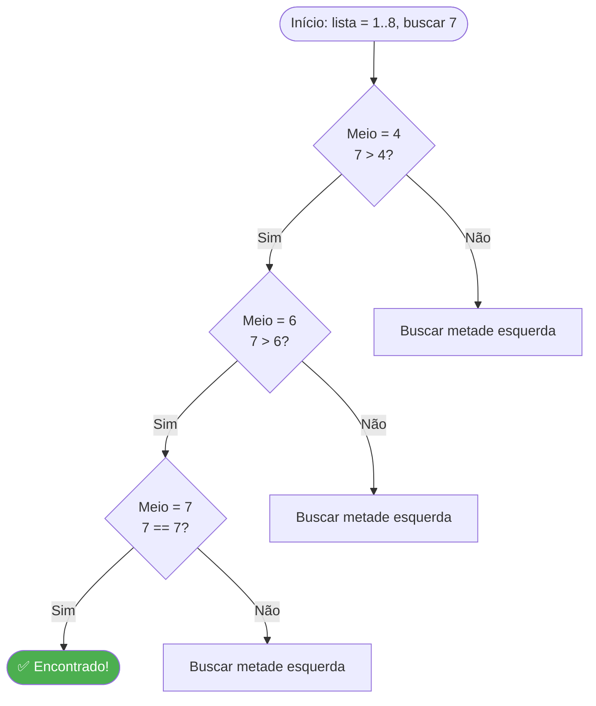
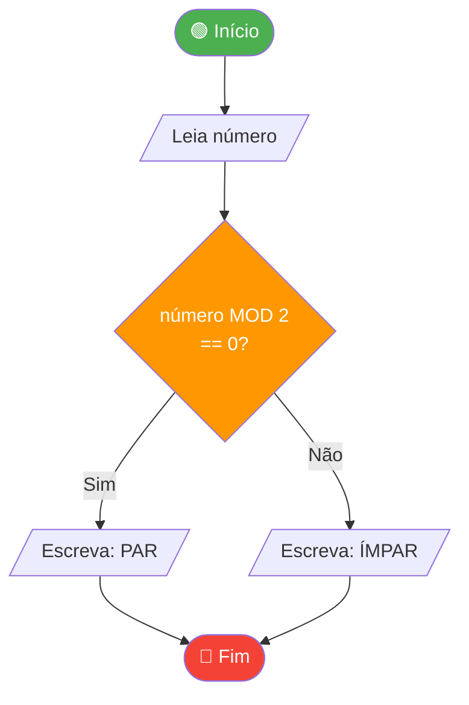

# Algoritmos

> [!quote] A Receita da Computação
> *Um algoritmo é como uma receita: uma sequência de passos que, se seguidos corretamente, levam ao resultado desejado.*

---

## 🤔 O que é um Algoritmo?

> [!info] Definição
> Um algoritmo é uma sequência finita de instruções bem definidas para resolver um problema ou realizar uma tarefa.

| Pergunta | Resposta |
|----------|----------|
| **O que é?** | Sequência de passos para resolver um problema |
| **Por que é importante?** | É a base de toda programação e computação |
| **Onde usamos?** | Em todo lugar: apps, jogos, buscas, redes sociais |

Todo algoritmo parte de três elementos fundamentais: uma **entrada** (os dados que ele recebe), um **processamento** (as operações que ele executa sobre esses dados) e uma **saída** (o resultado produzido). Essa estrutura é universal: vale tanto para um algoritmo de 5 linhas quanto para os sistemas de recomendação que o Netflix usa para sugerir séries.


> [!tip] Por que isso importa?
> Antes de escrever qualquer linha de código, o programador precisa ter o algoritmo claro na cabeça. Código sem algoritmo é como construir uma casa sem planta.

---

## ✅ Características de um Algoritmo

> [!tip] Todo Algoritmo Deve Ter

| Característica | Descrição |
|----------------|-----------|
| **Precisão** | Cada passo deve ser claro e não ambíguo |
| **Unicidade** | Cada passo produz um resultado único |
| **Finitude** | Deve terminar após um número finito de passos |
| **Entrada** | Pode receber dados de entrada |
| **Saída** | Deve produzir um resultado |

Além dessas cinco propriedades clássicas, alguns autores destacam duas características complementares importantes para o contexto prático:

| Característica Extra | Descrição |
|----------------------|-----------|
| **Eficiência** | Usa a menor quantidade possível de tempo e memória |
| **Corretude** | Produz o resultado correto para todas as entradas válidas |

> [!warning] Cuidado com loops infinitos
> Um algoritmo que nunca termina viola a característica de **finitude** e é considerado incorreto, mesmo que execute passos "certos". O clássico exemplo é um loop que incrementa um contador mas nunca verifica uma condição de parada.

---

## 🍳 Exemplos na Vida Cotidiana

> [!example] Algoritmos do Dia a Dia

| Exemplo | Descrição |
|---------|-----------|
| **Receita de bolo** | Ingredientes (entrada) → Passos → Bolo (saída) |
| **GPS/Google Maps** | Origem + Destino → Cálculo de rota → Direções |
| **Pesquisa no Google** | Termo buscado → Algoritmo de busca → Resultados |
| **Recomendações Netflix** | Histórico → Análise de padrões → Sugestões |

Perceba que em todos esses casos existe a mesma estrutura: **alguém (ou algo) recebe informação, processa seguindo regras, e entrega um resultado**. É exatamente isso que um computador faz ao executar um programa.

Outro exemplo cotidiano: ao procurar um nome em uma lista telefônica impressa, a maioria das pessoas abre o livro na metade e verifica se o nome que busca vem antes ou depois. Depois divide novamente ao meio, e assim por diante. Isso é a **busca binária** acontecendo de forma intuitiva, sem que a pessoa perceba que está executando um algoritmo clássico da computação.

---

## 🧩 Pensamento Computacional e Algoritmos

> [!info] Conexão com a BNCC Computação 2026
> A partir de 2026, o ensino de algoritmos e pensamento computacional passa a ser **obrigatório** na educação básica brasileira, conforme a Resolução CNE/CEB de março de 2025. Saber algoritmos não é mais diferencial: é base.

O **pensamento computacional** é a habilidade de resolver problemas usando as mesmas estratégias que os computadores usam. Ele tem quatro pilares:

| Pilar | O que significa | Exemplo prático |
|-------|-----------------|-----------------|
| **Decomposição** | Dividir o problema em partes menores | Separar "fazer login" em: digitar email, digitar senha, clicar em entrar |
| **Reconhecimento de padrões** | Identificar semelhanças entre problemas | Perceber que ordenar nomes e ordenar números seguem a mesma lógica |
| **Abstração** | Focar no essencial, ignorar detalhes irrelevantes | Modelar um carro como "placa + velocidade" num sistema de trânsito |
| **Algoritmo** | Criar a sequência de passos para resolver | Escrever o passo a passo da solução de forma precisa |

---

## 📚 Tipos de Algoritmos

### 🔍 Algoritmos de Busca

| Tipo | Como Funciona | Exemplo |
|------|---------------|---------|
| **Busca Linear** | Verifica item por item | Procurar nome em lista não ordenada |
| **Busca Binária** | Divide a lista ao meio repetidamente | Procurar palavra em dicionário |

A busca linear verifica cada elemento um por um, do início ao fim da lista. No pior caso, se o elemento não estiver na lista, ela percorre todos os N elementos: complexidade O(n). Já a busca binária exige que a lista esteja **ordenada** e, a cada etapa, elimina metade dos candidatos restantes: complexidade O(log n). Para uma lista de 1 milhão de elementos, a busca linear pode fazer até 1.000.000 comparações; a busca binária faz no máximo 20.



---

### 📊 Algoritmos de Ordenação

| Tipo | Como Funciona | Velocidade |
|------|---------------|------------|
| **Bubble Sort** | Compara pares adjacentes e troca | Lento |
| **Quick Sort** | Divide e conquista com pivô | Rápido |
| **Merge Sort** | Divide, ordena e mescla | Rápido |

O **Bubble Sort** é o algoritmo de ordenação mais didático: ele percorre a lista repetidamente, comparando dois elementos adjacentes e trocando-os se estiverem fora de ordem. O nome vem do comportamento visual: os valores maiores "borbulham" para o final da lista. Para uma lista de 5 elementos `[5, 3, 8, 1, 2]`, o processo seria:

| Passagem | Estado da Lista | Trocas |
|----------|----------------|--------|
| Início | `[5, 3, 8, 1, 2]` | 0 |
| Após 1ª | `[3, 5, 1, 2, 8]` | 3 |
| Após 2ª | `[3, 1, 2, 5, 8]` | 2 |
| Após 3ª | `[1, 2, 3, 5, 8]` | 1 |
| Após 4ª | `[1, 2, 3, 5, 8]` | 0 (lista ordenada) |

> [!example] 🧪 Atividade 1: Visualize o Bubble Sort no VisuAlgo
>
> **Site:** [visualgo.net/en/sorting](https://visualgo.net/en/sorting)
>
> **Passos:**
> 1. Acesse o site e clique em **"Bubble Sort"** no menu de algoritmos.
> 2. Clique em **"Randomize"** para gerar uma lista aleatória de 10 elementos.
> 3. Clique em **"Sort"** e observe a animação em velocidade normal (Speed: 1x).
> 4. Clique em **"Randomize"** novamente e desta vez use **"Step"** (passo a passo).
> 5. A cada passo, **anote no caderno**: quais dois elementos foram comparados e se houve troca.
>
> **Resultado observável:** Ao final, você terá uma tabela com o total de comparações e o total de trocas realizadas. Repita com uma lista já quase ordenada e compare os números. Você deve observar que o número de trocas muda, mas o de comparações permanece similar.

---

## 📝 Representação de Algoritmos

### Pseudocódigo

> [!info] O que é?
> Uma forma de escrever algoritmos usando linguagem natural estruturada, sem se preocupar com sintaxe de programação.

O pseudocódigo é uma linguagem intermediária: mais precisa que o português corrido, mas mais legível que o código de uma linguagem real. Ele permite que você comunique a lógica do algoritmo a qualquer programador, independentemente da linguagem que ele usa. As palavras-chave mais comuns no pseudocódigo em PT-BR são: `INÍCIO`, `FIM`, `LEIA`, `ESCREVA`, `SE...ENTÃO...SENÃO`, `ENQUANTO...FAÇA`, `PARA...ATÉ`.

```
INÍCIO
    LEIA numero1
    LEIA numero2
    soma = numero1 + numero2
    ESCREVA "A soma é: ", soma
FIM
```

Aqui está um exemplo um pouco mais elaborado: um algoritmo que verifica se um número é par ou ímpar.

```
INÍCIO
    LEIA numero
    SE numero MOD 2 == 0 ENTÃO
        ESCREVA "O número é PAR"
    SENÃO
        ESCREVA "O número é ÍMPAR"
    FIM_SE
FIM
```

> [!note] MOD (módulo)
> O operador MOD retorna o **resto da divisão**. Se `numero MOD 2` resulta em 0, o número é divisível por 2 e, portanto, par. Esse operador aparece em praticamente todas as linguagens de programação (em Python é `%`, em Java também `%`).

---

### Diagrama de Fluxo (Fluxograma)

> [!info] O que é?
> Representação gráfica do algoritmo usando símbolos padronizados.

| Símbolo | Significado |
|---------|-------------|
| **Oval** | Início/Fim |
| **Retângulo** | Processo/Ação |
| **Losango** | Decisão (Sim/Não) |
| **Paralelogramo** | Entrada/Saída |
| **Seta** | Fluxo de execução |

O fluxograma é especialmente útil quando o algoritmo tem muitas **decisões** (bifurcações), pois permite visualizar todos os caminhos possíveis de uma vez. Já o pseudocódigo é preferido quando o algoritmo tem muitas **repetições** (loops), pois é mais compacto para expressar iterações.

Abaixo, o fluxograma do algoritmo par/ímpar apresentado na seção anterior:



> [!example] 🧪 Atividade 2: Desenhe um Fluxograma no draw.io
>
> **Site:** [app.diagrams.net](https://app.diagrams.net) (draw.io, gratuito, sem cadastro)
>
> **Desafio:** Crie o fluxograma do seguinte algoritmo:
>
> *"Peça ao usuário que informe sua nota (0 a 10). Se a nota for maior ou igual a 6, exiba 'Aprovado'. Se a nota for menor que 6 mas maior ou igual a 4, exiba 'Recuperação'. Se a nota for menor que 4, exiba 'Reprovado'."*
>
> **Passos:**
> 1. Abra o site e clique em **"Start"** (escolha "Device" para salvar localmente).
> 2. Insira um oval de Início. Use a barra lateral esquerda para arrastar os símbolos.
> 3. Adicione um paralelogramo para a entrada da nota.
> 4. Adicione os **dois losangos** de decisão (um para ≥ 6 e outro para ≥ 4).
> 5. Conecte todos os blocos com setas rotuladas (Sim/Não).
> 6. Adicione o oval de Fim.
>
> **Resultado observável:** Um fluxograma com 3 caminhos de saída distintos (Aprovado, Recuperação, Reprovado). Exporte como PNG (File → Export As → PNG) e salve no seu computador.

---

## ⏱️ Análise de Algoritmos

> [!warning] Por que Analisar?
> Nem todo algoritmo que funciona é eficiente. A análise ajuda a escolher o melhor algoritmo para cada situação.

### Complexidade de Tempo

| Notação | Nome | Descrição |
|---------|------|-----------|
| **O(1)** | Constante | Sempre leva o mesmo tempo |
| **O(log n)** | Logarítmica | Cresce lentamente |
| **O(n)** | Linear | Cresce proporcionalmente |
| **O(n²)** | Quadrática | Cresce rapidamente |

Para tornar a comparação concreta, considere o que acontece quando o tamanho da entrada (n) cresce:

| n (tamanho da entrada) | O(1) | O(log n) | O(n) | O(n²) |
|------------------------|------|----------|------|-------|
| 10 | 1 op | 3 ops | 10 ops | 100 ops |
| 100 | 1 op | 7 ops | 100 ops | 10.000 ops |
| 1.000 | 1 op | 10 ops | 1.000 ops | 1.000.000 ops |
| 1.000.000 | 1 op | 20 ops | 1.000.000 ops | 10¹² ops |

Perceba que O(n²) cresce de forma explosiva: para 1 milhão de elementos, seria necessário realizar 1 trilhão de operações. É por isso que o Bubble Sort (O(n²)) é impraticável para grandes volumes de dados, enquanto o Merge Sort (O(n log n)) é muito mais adequado.

### Complexidade de Espaço

| Aspecto | Descrição |
|---------|-----------|
| **O que mede** | Quantidade de memória usada |
| **Por que importa** | Recursos são limitados |

Além do tempo, todo algoritmo também consome **memória**. Um algoritmo pode ser rápido mas exigir uma quantidade enorme de RAM, o que pode inviabilizá-lo em dispositivos com recursos limitados (smartphones, microcontroladores, sistemas embarcados). A escolha do algoritmo ideal sempre considera os dois recursos: tempo e espaço.

---

## 🏃 Algoritmos na Prática: Escrevendo Código

Conhecer a teoria é fundamental, mas algoritmos ganham vida quando são implementados. Vejamos o mesmo algoritmo de soma em três representações:

**Pseudocódigo:**
```
INÍCIO
    LEIA a
    LEIA b
    resultado = a + b
    ESCREVA resultado
FIM
```

**Python (linguagem de programação real):**
```python
a = int(input("Digite o primeiro número: "))
b = int(input("Digite o segundo número: "))
resultado = a + b
print("A soma é:", resultado)
```

**JavaScript (outra linguagem real):**
```javascript
let a = parseInt(prompt("Digite o primeiro número:"));
let b = parseInt(prompt("Digite o segundo número:"));
let resultado = a + b;
alert("A soma é: " + resultado);
```

Repare que a **lógica é idêntica** nas três versões. O que muda é apenas a sintaxe, ou seja, a "gramática" de cada linguagem. Isso reforça por que aprender algoritmos é mais importante do que decorar a sintaxe de uma linguagem: quem domina o pensamento algorítmico aprende qualquer linguagem com facilidade.

> [!example] 🧪 Atividade 3: Escreva e Rode um Algoritmo no Programiz
>
> **Site:** [programiz.com/python-programming/online-compiler](https://www.programiz.com/python-programming/online-compiler/)
>
> **Desafio:** Implemente um algoritmo de 5 passos que calcule a média de três notas e diga se o aluno foi aprovado (média ≥ 6) ou reprovado.
>
> **Código para digitar (não copie, digite linha a linha):**
> ```python
> nota1 = float(input("Digite a nota 1: "))
> nota2 = float(input("Digite a nota 2: "))
> nota3 = float(input("Digite a nota 3: "))
> media = (nota1 + nota2 + nota3) / 3
> if media >= 6:
>     print("Aprovado! Média:", media)
> else:
>     print("Reprovado. Média:", media)
> ```
>
> **Teste com duas entradas diferentes:**
> - Entrada 1: notas 7, 8, 9 (esperado: Aprovado, média 8.0)
> - Entrada 2: notas 4, 3, 5 (esperado: Reprovado, média 4.0)
>
> **Resultado observável:** O programa exibe a mensagem correta para cada entrada. Modifique o limite de aprovação para 7 e teste novamente. Observe como uma única mudança no código altera o comportamento do algoritmo para todas as entradas.

---

## 📝 Conclusão

> [!success] Pontos Principais

- Algoritmos são a **base da computação** e programação
- Devem ser **precisos, únicos e finitos**
- Podem ser representados por **pseudocódigo** ou **fluxogramas**
- A **análise de complexidade** ajuda a escolher o algoritmo mais eficiente
- O **pensamento computacional** (decompor, abstrair, identificar padrões, algoritmizar) é a habilidade que sustenta tudo isso

> [!tip] Próximos Passos
> Para aprofundar, estude estruturas de dados e algoritmos mais complexos como grafos, árvores e programação dinâmica.

---

> [!note] 📚 Fontes (2026)
> - [VisuAlgo: Visualização de Algoritmos de Ordenação](https://visualgo.net/en/sorting): ferramenta interativa para animação de Bubble Sort, Merge Sort, Quick Sort e outros
> - [BNCC Computação 2026: O que todo professor precisa saber (Cyano Edu)](https://cyanoedu.com.br/blog/bncc-computacao-2026-guia-professor.html): contexto curricular obrigatório
> - [Resolução de Problemas com Algoritmos (Lab do Educador, jan/2025)](https://blog.labdeeducador.com.br/2025/01/resolucao-de-problemas-com-algoritmos.html): fluxogramas e pseudocódigo no ensino
> - [Atividades de Pensamento Computacional para Professores (MakerZine)](https://www.makerzine.com.br/educacao/atividades-praticas-de-pensamento-computacional-para-professores-do-ensino-basico/): metodologias ativas
> - [Introdução à Computação para o Ensino Médio (PUC-Rio)](https://www.inf.puc-rio.br/~iue1002/material/basico/02_algoritmos.pdf): material acadêmico de referência
> - [Programiz Online Python Compiler](https://www.programiz.com/python-programming/online-compiler/): ambiente para rodar código sem instalar nada
> - [draw.io (app.diagrams.net)](https://app.diagrams.net): editor gratuito de fluxogramas online
