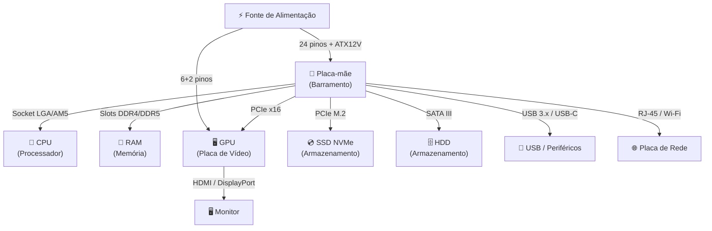
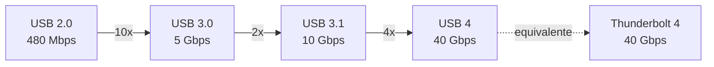
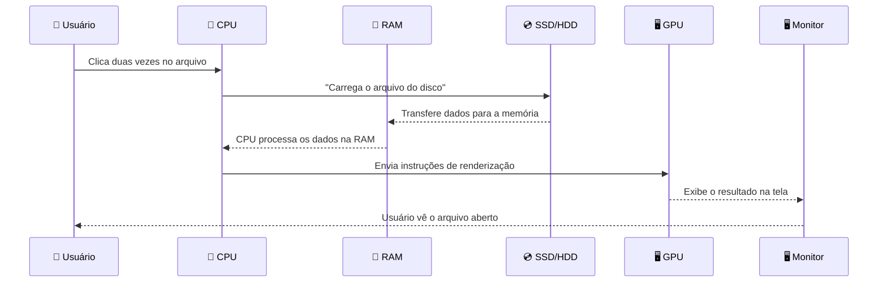

# Hardware

> [!quote] O Corpo do Computador
> *Hardware é tudo aquilo que você pode tocar no computador. É a parte física que dá vida às instruções do software.*

---

## 🤔 O que é Hardware?

> [!info] Definição
> Hardware refere-se a todos os componentes físicos de um sistema computacional, as peças que você pode ver e tocar.

| Aspecto | Hardware | Software |
|---------|----------|----------|
| **Natureza** | Físico, tangível | Lógico, intangível |
| **Exemplos** | CPU, teclado, monitor | Windows, Chrome, Word |
| **Desgaste** | Sofre desgaste físico | Não sofre desgaste físico |

> [!tip] Por que isso importa?
> Entender hardware é o primeiro passo para saber **por que** um computador é lento, como escolher o melhor custo-benefício e o que significa aquela especificação na etiqueta da loja.

---

## 💻 Tipos de Computadores

| Tipo | Características | Uso Principal |
|------|-----------------|---------------|
| **Desktop** | Maior poder de processamento, expansível | Trabalho, jogos, produção |
| **Laptop** | Portátil, bateria integrada | Mobilidade, trabalho remoto |
| **Tablets** | Tela touch, leve | Consumo de mídia, leitura |
| **Smartphones** | Sempre conectado, compacto | Comunicação, apps móveis |
| **Servidores** | Alta disponibilidade, robusto | Hospedagem, processamento em massa |

> [!note] Contexto 2026
> Em 2026 os smartphones já superam laptops de entrada em poder de processamento bruto. Um iPhone 16 ou Samsung Galaxy S25 carregam chips comparáveis a processadores de notebook lançados há 3 anos.

---

## 🔧 Componentes Internos

> [!tip] O Coração do Computador
> Cada componente tem uma função específica no funcionamento do sistema.

| Componente | Função | Analogia |
|------------|--------|----------|
| **CPU** | Processa instruções e cálculos | Cérebro |
| **Memória RAM** | Armazena dados temporariamente | Memória de curto prazo |
| **HD (HDD)** | Armazena dados permanentemente (magnético) | Arquivo/gaveta |
| **SSD** | Armazena dados permanentemente (flash) | Arquivo rápido |
| **Placa-mãe** | Conecta todos os componentes | Sistema nervoso |
| **Placa de vídeo** | Processa gráficos | Olhos/visão |
| **Fonte de alimentação** | Fornece energia | Coração |
| **Cooler** | Refrigera os componentes | Sistema de refrigeração |

### 🏎️ CPU em detalhes: Intel vs AMD (2026)

Os dois grandes fabricantes de processadores para desktop e notebook são Intel e AMD. Cada um tem pontos fortes diferentes:

| Critério | Intel (Core Ultra) | AMD (Ryzen) |
|----------|--------------------|-------------|
| **Arquitetura** | Híbrida: P-cores (desempenho) + E-cores (eficiência) | Precision Boost + 3D V-Cache em topo de linha |
| **Ponto forte** | Melhor performance single-thread, excelente para edição de vídeo (Quick Sync) | Multitarefa, eficiência energética, política de soquete mais duradoura |
| **Troca de placa-mãe em upgrade** | Mais frequente (muda soquete a cada geração) | Menos frequente (compatibilidade AMD AM5 ainda vigente em 2026) |
| **Melhor custo-benefício mid-range 2026** | Core i5-13/14ª geração ainda com ótimo preço | Ryzen 5 7600 / Ryzen 7 7700X |

> [!note] Núcleos (cores) importam
> Um processador com 8 núcleos consegue executar 8 tarefas ao mesmo tempo. Por isso um Ryzen 7 roda jogos **e** uma live ao mesmo tempo sem travar.

### 💾 Armazenamento: velocidades comparadas (2025/2026)

Não é só "SSD é mais rápido que HD": existem **três** tecnologias com diferenças enormes:

| Tipo | Velocidade de Leitura | Fator de Forma | Preço relativo |
|------|-----------------------|----------------|----------------|
| **HDD** | 80 a 160 MB/s | 3,5" ou 2,5" | Mais barato por GB |
| **SSD SATA** | até 550 MB/s | 2,5" ou M.2 | Médio |
| **SSD NVMe M.2** | 3.000 a 7.000+ MB/s | M.2 (encaixe direto na placa-mãe) | Mais caro por GB |

> [!warning] Impacto real
> Instalar o Windows num SSD NVMe faz o computador **ligar em 10 segundos**. No HDD, o mesmo processo leva 45 a 90 segundos. Para trabalho diário, a diferença é imediata.

### 🧠 RAM: quantidade mínima recomendada (2026)

| Quantidade | Uso adequado |
|------------|-------------|
| **8 GB** | Tarefas leves: navegador com poucas abas, office |
| **16 GB** | Mínimo recomendado para jogos e trabalho em 2026 |
| **32 GB** | Ideal: edição de vídeo, desenvolvimento, streaming simultâneo |
| **64 GB+** | Workstations: modelagem 3D, machine learning |

---

## 🗺️ Como os Componentes se Conectam

O diagrama abaixo mostra como os componentes trocam dados dentro de um computador desktop moderno:

> [!info] Como ler o diagrama
> Cada seta mostra um barramento físico (cabo ou encaixe direto). O nome em itálico é o padrão de conexão. A **Placa-mãe** é o hub central: todos os componentes se ligam a ela, e ela coordena quem fala com quem.

---

## 🔍 Anatomia da Placa-Mãe

A placa-mãe é o componente mais complexo do computador. Conhecer suas partes é essencial para montar, fazer upgrade ou diagnosticar problemas:

| Região | Componente | O que faz |
|--------|-----------|-----------|
| Centro | **Socket da CPU** (LGA1700 / AM5) | Encaixe físico do processador. Não é universal: AMD e Intel usam soquetes diferentes |
| Lateral | **Slots de RAM** (DDR4 ou DDR5) | Encaixam os pentes de memória. Cor diferente indica pares para dual-channel |
| Inferior | **Slots PCIe x16** | Encaixam a placa de vídeo. O maior slot é reservado para a GPU |
| Centro/inferior | **Slot M.2** | Encaixe direto do SSD NVMe sem cabo. Fica escondido sob a GPU |
| Lateral | **Conectores SATA** | Cabos para HDD e SSD SATA antigos |
| Superior direito | **Conector ATX 24 pinos** | Cabo principal de energia da fonte |
| Superior esquerdo | **Conector ATX12V** | Energia exclusiva para a CPU |
| Painel traseiro | **I/O Shield** | Portas USB, HDMI, áudio, Ethernet que ficam na parte de trás do gabinete |
| Chip pequeno | **Chipset** | Coordena a comunicação entre CPU, RAM, armazenamento e periféricos |

> [!example] 🧪 Atividade 1: Descubra as Specs Reais do Seu PC
>
> **Ferramenta:** CPU-Z (download gratuito em [cpuid.com/softwares/cpu-z.html](https://cpuid.com/softwares/cpu-z.html)) **ou** Gerenciador de Tarefas do Windows (atalho: `Ctrl + Shift + Esc`)
>
> **Passo a passo:**
> 1. Baixe e abra o CPU-Z (não precisa instalar: use a versão ZIP portátil)
> 2. Aba **CPU**: anote o nome do processador, número de núcleos (Cores), velocidade em MHz e arquitetura
> 3. Aba **Memory**: anote a capacidade total (em MB) e o tipo (DDR3, DDR4 ou DDR5)
> 4. Aba **SPD**: veja a frequência real dos módulos de RAM
> 5. No **Gerenciador de Tarefas**, aba "Desempenho": veja uso de CPU, RAM e armazenamento em tempo real
>
> **Resultado observável:** você vai saber exatamente o hardware do seu computador, não apenas "é um i5" mas sim "é um Intel Core i5-12400 com 6 núcleos a 2,5 GHz e 8 GB DDR4 a 3200 MHz". Essa informação é o que você passa para um técnico ou pesquisa na hora de comprar um upgrade.
>
> **Alternativa sem instalar nada (Windows):** `Iniciar` > `Sobre o computador` > veja Processador e RAM instalada.

---

## 🖥️ Periféricos

> [!info] Dispositivos Externos
> Periféricos são dispositivos que se conectam ao computador para entrada ou saída de dados.

### Periféricos de Entrada

| Dispositivo | Função |
|-------------|--------|
| **Teclado** | Entrada de texto e comandos |
| **Mouse** | Controle do cursor |
| **Scanner** | Digitalização de documentos |
| **Webcam** | Captura de vídeo |
| **Microfone** | Captura de áudio |

### Periféricos de Saída

| Dispositivo | Função |
|-------------|--------|
| **Monitor** | Exibição de imagens |
| **Impressora** | Impressão de documentos |
| **Caixas de som** | Saída de áudio |
| **Projetor** | Projeção de imagens |

### Periféricos de Entrada E Saída (mistos)

| Dispositivo | Função |
|-------------|--------|
| **Pendrive / HD externo** | Lê e grava dados |
| **Headset** | Saída de áudio + entrada de microfone |
| **Touchscreen** | Exibe imagem e recebe toque |
| **Impressora multifuncional** | Imprime, escaneia e copia |

---

## 🔌 Portas e Conectores

| Porta | Nome Completo | Uso Principal |
|-------|---------------|---------------|
| **USB** | Universal Serial Bus | Dispositivos diversos |
| **HDMI** | High-Definition Multimedia Interface | Vídeo e áudio digital |
| **VGA** | Video Graphics Array | Vídeo analógico (legado) |
| **Áudio** | Jack 3.5mm | Fones e caixas de som |
| **Ethernet** | RJ-45 | Conexão de rede cabeada |
| **USB-C** | Universal Serial Bus Type-C | Dados, vídeo e energia |

### Gerações do USB: velocidades comparadas

| Versão | Nome Comercial | Velocidade máxima |
|--------|---------------|-------------------|
| USB 2.0 | Hi-Speed | 480 Mbps |
| USB 3.0 | USB 3.2 Gen 1 | 5 Gbps |
| USB 3.1 | USB 3.2 Gen 2 | 10 Gbps |
| USB 3.2 Gen 2x2 | SuperSpeed+ | 20 Gbps |
| USB 4 / Thunderbolt 4 | USB4 | 40 Gbps |

> [!warning] Confusão de nomes
> A nomenclatura do USB foi renomeada várias vezes e é propositalmente confusa. O que importa na prática: USB-A azul = pelo menos USB 3.0 (10x mais rápido que o preto). USB-C não garante velocidade alta sozinho; depende do protocolo suportado.

---

## 🛠️ Montagem de Computadores

> [!warning] Cuidados Importantes
> A montagem de computadores requer atenção à compatibilidade e segurança.

### Considerações

| Aspecto | Descrição |
|---------|-----------|
| **Compatibilidade** | Verificar se os componentes são compatíveis entre si |
| **Encaixe** | Cada componente tem local específico na placa-mãe |
| **Eletricidade estática** | Usar pulseira antiestática para evitar danos |
| **Manuseio** | Segurar componentes pelas bordas |

### Checklist de compatibilidade antes de comprar

Montar um PC sem verificar compatibilidade é o erro mais comum de quem está começando. Use este checklist:

- [ ] **CPU + Placa-mãe:** o soquete é o mesmo? (ex.: Ryzen 7000 exige AM5; Core i5-13ª exige LGA1700)
- [ ] **RAM + Placa-mãe:** a placa-mãe suporta DDR4 **ou** DDR5? Não são intercambiáveis
- [ ] **Fonte + Componentes:** a fonte tem potência suficiente? GPU de alto desempenho exige 650 W ou mais
- [ ] **Gabinete + Placa-mãe:** o form factor combina? (ATX, Micro-ATX, Mini-ITX)
- [ ] **SSD NVMe + Placa-mãe:** a placa-mãe tem slot M.2? Qual geração PCIe suporta?

> [!example] 🧪 Atividade 2: Monte um PC Virtual e Calcule o Custo
>
> **Ferramenta:** Configurador de PC da Pichau em [pichau.com.br/monte-seu-pc](https://www.pichau.com.br/monte-seu-pc) ou KaBuM em [kabum.com.br/monte-seu-pc](https://www.kabum.com.br/monte-seu-pc)
>
> **Desafio:** Monte uma configuração para **cada perfil abaixo** e anote o custo total:
>
> | Perfil | CPU | RAM | Armazenamento | GPU | Meta de preço |
> |--------|-----|-----|---------------|-----|---------------|
> | **Escritório** | Qualquer | 8 GB | SSD 240 GB | Integrada | até R$ 1.500 |
> | **Estudante** | Qualquer | 16 GB | SSD 480 GB | Entrada | até R$ 3.000 |
> | **Gamer** | Qualquer | 16 GB | SSD NVMe 1 TB | RTX ou RX dedicada | até R$ 5.000 |
>
> **Resultado observável:** você vai ver na prática quais componentes pesam mais no orçamento (normalmente GPU e CPU respondem por 60 a 70% do total) e entender por que "upgradar" só um componente às vezes exige trocar vários outros por compatibilidade.
>
> **Dica:** o site mostra alerta automático quando dois componentes são incompatíveis, como CPU AM5 com placa-mãe LGA1700.

---

## 🔄 Manutenção do Hardware

> [!tip] Mantendo o Computador Saudável

| Tarefa | Frequência | Benefício |
|--------|------------|-----------|
| **Limpeza de poeira** | Mensal | Previne superaquecimento |
| **Verificar temperaturas** | Regular | Detectar problemas de refrigeração |
| **Atualizar drivers** | Quando disponível | Melhor desempenho |
| **Verificar cabos** | Semestral | Garantir conexões estáveis |
| **Backup** | Regular | Prevenir perda de dados |

### Temperatura segura por componente

| Componente | Temperatura normal | Temperatura de alerta |
|------------|-------------------|-----------------------|
| **CPU (carga)** | 60 a 80°C | acima de 90°C |
| **GPU (carga)** | 65 a 85°C | acima de 95°C |
| **SSD NVMe** | 40 a 60°C | acima de 70°C |
| **HDD** | 35 a 50°C | acima de 60°C |

> [!warning] Poeira é inimigo número 1
> Um cooler entupido de poeira pode fazer a CPU passar de 70°C para 100°C, ativando o "thermal throttle": o próprio processador reduz a velocidade para não queimar. Resultado: computador "mais lento" sem nenhum problema de software.

---

## 🧩 Fluxo Completo: Do Clique ao Resultado

Este diagrama mostra o que acontece dentro do computador quando você abre um arquivo:

> [!info] Por que isso importa?
> Cada seta nesse diagrama é um possível gargalo. Se o SSD for um HDD lento, a etapa 2 demora 10x mais. Se a RAM for pouca, o sistema usa o disco como "RAM temporária" (swap), deixando tudo mais lento. Se a GPU for fraca, a etapa 5 trava em jogos ou vídeos 4K.

---

> [!note] 📚 Fontes (2026)
>
> - [4Gamers: Qual melhor processador custo-benefício 2026 Intel vs AMD](https://www.4gamers.com.br/qual-melhor-processador-custo-beneficio-para-gamers-em-2026-intel-vs-amd)
> - [Hardware.com.br: Intel e AMD confirmam desempenho nos novos processadores 2026](https://www.hardware.com.br/noticias/novos-processadores-2026/)
> - [Tecnoblog: SSD SATA ou NVMe, qual a diferença](https://tecnoblog.net/responde/ssd-sata-ou-nvme-qual-a-diferenca/)
> - [GammaTech: SSD vs NVMe qual é o melhor para armazenamento em 2025](https://blog.gammatechti.com.br/index.php/2025/05/18/ssd-vs-nvme-qual-e-o-melhor-para-armazenamento-em-2025/)
> - [CPUID: CPU-Z download oficial](https://cpuid.com/softwares/cpu-z.html)
> - [KaBuM: Configurador de PC](https://www.kabum.com.br/monte-seu-pc)
> - [Pichau: Monte seu PC](https://www.pichau.com.br/monte-seu-pc)
> - [Tom's Hardware: CPU Benchmarks and Hierarchy 2026](https://www.tomshardware.com/reviews/cpu-hierarchy,4312.html)
> - [Didática Tech: Placa-mãe como funciona](https://didatica.tech/placa-mae-como-funciona-como-escolher-uma/)
