# História da Computação

> [!quote] O Passado Ilumina o Futuro
> *Compreender a história da computação nos ajuda a apreciar a evolução tecnológica e a vislumbrar o futuro.*

---

## 📜 Linha do Tempo

> [!info] Marcos Históricos
> Os principais eventos que moldaram a computação moderna.

### Era Pré-Computação (1801-1936)

| Ano | Evento | Inventor |
|-----|--------|----------|
| **1801** | Tear Programável | Joseph Marie Jacquard |
| **1837** | Máquina Analítica (primeiro conceito de computador) | Charles Babbage |
| **1890** | Tabuladora para Censo dos EUA | Herman Hollerith |
| **1936** | Máquina de Turing (fundamento da computação moderna) | Alan Turing |

---

### Primeiros Computadores (1943-1958)

| Ano | Evento | Descrição |
|-----|--------|-----------|
| **1943-1944** | Colossus e Harvard Mark I | Primeiros computadores programáveis |
| **1946** | ENIAC | Primeiro computador eletrônico de propósito geral |
| **1948** | Manchester Baby | Primeiro programa armazenado e executado digitalmente (21 jun) |
| **1950** | Teste de Turing | Alan Turing propõe o "Jogo da Imitação" em *Computing Machinery and Intelligence* |
| **1951** | UNIVAC I | Primeiro computador comercial |
| **1958** | Circuito Integrado | Criado por Jack Kilby e Robert Noyce |

---

### Ascensão dos Microcomputadores (1969-1981)

| Ano | Evento | Descrição |
|-----|--------|-----------|
| **1969** | ARPANET | Precursora da Internet: UCLA, Stanford, UCSB e Utah conectados |
| **1971** | Microprocessador 4004 | Lançado pela Intel |
| **1975** | Microsoft | Fundada por Bill Gates e Paul Allen |
| **1976** | Apple | Fundada por Steve Jobs e Steve Wozniak |
| **1981** | IBM PC | Primeiro PC da IBM |

---

### Era da Internet (1989-1998)

| Ano | Evento | Descrição |
|-----|--------|-----------|
| **1989** | World Wide Web | Inventada por Tim Berners-Lee no CERN |
| **1991** | Linux | Primeira versão lançada por Linus Torvalds |
| **1993** | Mosaic | Primeiro navegador gráfico popular, precursor do Netscape |
| **1998** | Google | Fundado por Larry Page e Sergey Brin |

---

### Era da Mobilidade e IA (2007-presente)

| Ano | Evento | Impacto |
|-----|--------|---------|
| **2007** | iPhone | Popularização dos smartphones |
| **2010** | iPad | Início da era dos tablets |
| **2017** | *Attention Is All You Need* | Paper que criou a arquitetura Transformer, base de toda IA generativa moderna |
| **2022** | ChatGPT (nov.) | 1 milhão de usuários em 5 dias, 100 milhões em 2 meses: crescimento mais rápido da história da internet |
| **2023** | GPT-4, Claude, Bard/Gemini | Corrida entre OpenAI, Anthropic e Google; IA multimodal (texto, imagem, código) |
| **2024** | GPT-4o, Sora, Apple Intelligence | Raciocínio em tempo real sobre áudio, visão e texto; geração de vídeo por texto |
| **2025-2026** | Consolidação da IA | Modelos integrados ao cotidiano: 365 Copilot, Google Workspace AI, iOS IA nativa |

---

## 🧬 Gerações dos Computadores

> [!abstract] Cinco Gerações, Cinco Tecnologias
> Cada geração foi definida pela tecnologia de processamento dominante. A mudança de geração significou saltos enormes de desempenho, tamanho e custo.

| Geração | Período | Tecnologia Base | Característica Principal | Exemplos |
|---------|---------|-----------------|--------------------------|---------|
| **1ª** | 1940-1956 | Válvulas termiônicas (tubos de vácuo) | Enormes, lentos, caros, alto consumo de energia | ENIAC, UNIVAC I, IBM 701 |
| **2ª** | 1956-1963 | Transistores | Menores, mais rápidos, menos calor, primeiros usos comerciais | IBM 7090, UNIVAC II |
| **3ª** | 1964-1971 | Circuitos Integrados | Compactos, velocidade em microsegundos, linguagens de alto nível | IBM System/360, PDP-8 |
| **4ª** | 1971-1980 | Microprocessadores | PCs acessíveis, interfaces gráficas, uso pessoal | Intel 4004, Apple II, IBM PC |
| **5ª** | 1980-hoje | IA, Computação Quântica, Nanotecnologia | Sistemas inteligentes, conexão em nuvem, modelos de linguagem | Smartphones, LLMs, GPUs modernas |

---

## ⚖️ ENIAC vs. Seu Celular

> [!warning] Números reais para reflexão
> O ENIAC foi um marco da engenharia de 1946. Compare com o celular no seu bolso.

| Característica | ENIAC (1946) | Smartphone Moderno |
|----------------|--------------|-------------------|
| **Peso** | 27 toneladas | ~170-220 gramas |
| **Tamanho** | 30 m de comprimento, 280 m² | Cabe no bolso |
| **Consumo** | ~150 kW (hora) | ~5 W (carregando) |
| **Velocidade** | 5.000 adições por segundo | Bilhões por segundo (GHz) |
| **Multiplicações** | 385 por segundo | Trilhões por segundo |
| **Memória** | Sem memória persistente (programação manual por fios) | 256 GB ou mais |
| **Componentes** | 18.000 válvulas, 70.000 resistores | Bilhões de transistores num chip do tamanho de uma unha |
| **Confiabilidade** | Máximo de 116 horas sem falha (válvula queimando) | Anos de uso contínuo |
| **Custo** | ~US\$ 7 milhões (1946) | ~R\$ 2.000-8.000 |

> [!tip] Perspectiva
> Um smartphone moderno tem poder de processamento equivalente a **mais de 1.000 ENIACs**. E cabe no bolso, custa infinitamente menos e dura anos sem precisar trocar uma válvula.

---

## 🗂️ Diagrama: Linha do Tempo Visual

```mermaid
timeline
    title Marcos da Computação
    section Pré-digital
        1801 : Tear de Jacquard
             : Programação por cartões perfurados
        1837 : Máquina Analítica de Babbage
             : Primeiro conceito de computador
        1890 : Tabuladora de Hollerith
             : Base da futura IBM
        1936 : Máquina de Turing
             : Fundamento teórico da computação
    section Primeiros Computadores
        1946 : ENIAC
             : Primeiro computador eletrônico de propósito geral
        1948 : Manchester Baby
             : Primeiro programa armazenado executado
        1950 : Teste de Turing
             : "Pode uma máquina pensar?"
        1951 : UNIVAC I
             : Primeiro computador comercial
    section Era dos PCs
        1969 : ARPANET
             : Precursora da Internet
        1971 : Intel 4004
             : Primeiro microprocessador
        1976 : Apple
             : Jobs e Wozniak na garagem
        1981 : IBM PC
             : PC entra no escritório
    section Era da Internet
        1989 : World Wide Web
             : Tim Berners-Lee no CERN
        1991 : Linux
             : Linus Torvalds
        1998 : Google
             : Buscas em escala global
    section Era da IA
        2007 : iPhone
             : Computação móvel massificada
        2017 : Transformer
             : Attention Is All You Need
        2022 : ChatGPT
             : IA generativa para todos
        2024 : GPT-4o e Sora
             : Multimodal e vídeo por texto
        2026 : IA integrada ao cotidiano
             : Copilot, Gemini, Apple Intelligence
```

---

## 🔄 Resumo das Eras

> [!tip] Evolução em Cinco Eras

1. **Era pré-computação** (1801-1936): Tear de Jacquard, Máquina de Babbage, Tabuladora de Hollerith, Máquina de Turing.
2. **Primeiros computadores** (1943-1958): Colossus, ENIAC, Manchester Baby, UNIVAC I, Circuito Integrado.
3. **Ascensão dos microcomputadores** (1969-1981): Intel 4004, Microsoft, Apple, IBM PC.
4. **Era da Internet** (1989-1998): ARPANET, World Wide Web, Linux, Google.
5. **Era da mobilidade e IA** (2007-presente): Smartphones, Transformers, ChatGPT, IA multimodal integrada ao dia a dia.

---

## 🧪 Atividades Práticas

> [!example] 🧪 Atividade 1: Monte sua linha do tempo com 10 marcos
> **Ferramenta:** [Canva Timeline Maker](https://www.canva.com/graphs/timeline/) (gratuito, sem instalação) ou [Sutori](https://www.sutori.com/) (gratuito com conta)
>
> **O que fazer:**
> 1. Acesse o Canva ou o Sutori e crie uma conta gratuita.
> 2. Escolha o template "Timeline" ou "Linha do Tempo".
> 3. Selecione **exatamente 10 marcos** da história da computação que você considere mais importantes, incluindo ao menos **1 marco posterior a 2020**.
> 4. Para cada marco, escreva: ano, nome do evento e por que você escolheu (1 frase).
> 5. Exporte como imagem (PNG ou JPG) e envie no sistema de entrega da disciplina.
>
> **Resultado esperado:** Uma imagem exportada com 10 marcos, anos corretos, nome dos eventos e justificativa de escolha visível.

---

> [!example] 🧪 Atividade 2: Explore o acervo do Computer History Museum
> **Ferramenta:** [Computer History Museum Timeline](https://www.computerhistory.org/timeline/) (gratuito, online)
>
> **O que fazer:**
> 1. Acesse o site [computerhistory.org/timeline](https://www.computerhistory.org/timeline/).
> 2. Navegue pela linha do tempo usando os filtros de década e categoria (Computers, Software, AI, etc.).
> 3. Encontre **1 fato ou objeto que você genuinamente não conhecia** antes de entrar no site.
> 4. Anote: o nome do artefato ou evento, o ano, e escreva 2 frases explicando o que te surpreendeu.
> 5. Traga a anotação para a próxima aula para compartilhar com a turma.
>
> **Resultado esperado:** Um texto curto (2-3 frases) com o fato descoberto e o porquê da surpresa, pronto para apresentar oralmente.

---

> [!example] 🧪 Atividade 3: Compare o ENIAC com o seu celular
> **Ferramenta:** Especificações do seu próprio celular (Ajustes > Sobre o telefone) e a tabela desta aula
>
> **O que fazer:**
> 1. Abra as configurações do seu celular e anote: modelo, processador (se disponível), armazenamento total e RAM.
> 2. Use a tabela "ENIAC vs. Seu Celular" desta aula como referência.
> 3. Calcule (ou estime) quantas vezes o seu celular é mais rápido que o ENIAC em adições por segundo. O ENIAC fazia 5.000 adições/segundo; processadores modernos operam em GHz (1 GHz = 1 bilhão de operações simples por segundo).
> 4. Pesquise quanto pesa o seu celular (está na caixa ou no site do fabricante) e calcule quantas vezes o ENIAC é mais pesado (ENIAC pesava 27.000 kg).
> 5. Monte uma mini-tabela comparativa com pelo menos 3 características e traga para a próxima aula.
>
> **Resultado esperado:** Uma tabela com 3 ou mais linhas comparando ENIAC vs. seu celular, com os números reais do seu aparelho.

---

## 🎬 Documentários, Filmes e Séries

### 📹 Documentários

| Título | Ano | Descrição |
|--------|-----|-----------|
| **Triumph of the Nerds** | 1996 | História dos computadores pessoais (3 partes) |
| **The Code** | 2011 | História do Linux e software de código aberto (BBC) |
| **The Internet's Own Boy** | 2014 | Vida de Aaron Swartz, ativista de internet |
| **Lo and Behold** | 2016 | Impacto da internet no mundo (Werner Herzog) |

---

### 🎥 Filmes

| Título | Ano | Tema |
|--------|-----|------|
| **WarGames** | 1983 | Adolescente invade supercomputador do Departamento de Defesa |
| **Pirates of Silicon Valley** | 1999 | Steve Jobs, Bill Gates e a rivalidade Apple vs Microsoft |
| **The Social Network** | 2010 | Ascensão do Facebook e Mark Zuckerberg |
| **The Imitation Game** | 2014 | Vida de Alan Turing e a quebra do código Enigma na Segunda Guerra |
| **Steve Jobs** | 2015 | Vida de Steve Jobs em três momentos cruciais |

---

### 📺 Séries

| Título | Período | Descrição |
|--------|---------|-----------|
| **Halt and Catch Fire** | 2014-2017 | Drama sobre o boom dos PCs nos anos 80 |
| **Silicon Valley** | 2014-2019 | Comédia satirizando startups do Vale do Silício |
| **Devs** | 2020 | Thriller sobre computação quântica e determinismo |
| **The IT Crowd** | 2006-2013 | Comédia britânica sobre departamento de TI |

---

> [!note] 📚 Fontes (2026)
> - [Computer History Museum: Timeline of Computer History](https://www.computerhistory.org/timeline/)
> - [Artificial Intelligence Timeline 1950-2025 (AIny)](https://ainy.no/en/artificial-intelligence-timeline-1950-2025/)
> - [Generative AI Timeline: 9 Decades of Milestones (CMSWire)](https://www.cmswire.com/digital-experience/generative-ai-timeline-9-decades-of-notable-milestones/)
> - [Navigate the AI Revolution: Key Milestones 2023-2024 (AI Pro)](https://ai-pro.org/learn-ai/articles/navigating-the-ai-revolution-timeline-of-2023-2024)
> - [ENIAC vs. The Cell Phone (AntiqueTech)](http://www.antiquetech.com/?page_id=1438)
> - [ENIAC: Wikipedia](https://en.wikipedia.org/wiki/ENIAC)
> - [The World's First Computer vs. iPhone (All That's Interesting)](https://allthatsinteresting.com/first-computer)
> - [Gerações dos Computadores (IME-USP)](https://www.ime.usp.br/~macmulti/historico/histcomp1_12.html)
> - [ChatGPT: Wikipedia](https://en.wikipedia.org/wiki/ChatGPT)
> - [Turing Test at 75 (Medium)](https://medium.com/@generativeai.saif/the-turing-test-at-75-alan-turings-visionary-framework-for-machine-intelligence-3b39ec6b656e)
