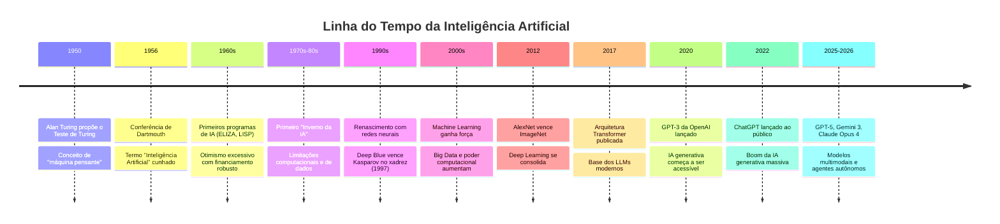
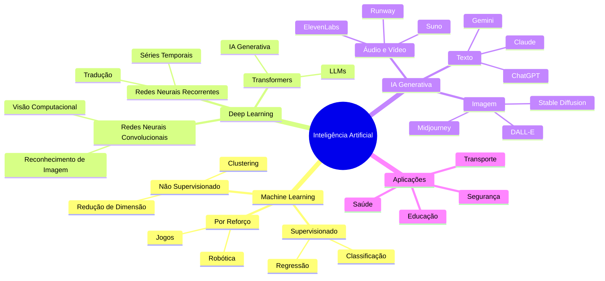

# Inteligência Artificial

## 🧠 Introdução à Inteligência Artificial

### Definições básicas

> [!INFO] Definição
> Inteligência Artificial (IA) é a capacidade de sistemas computacionais realizarem tarefas que normalmente requerem inteligência humana, como reconhecimento de padrões, tomada de decisões e processamento de linguagem natural.

### História e evolução da IA

A IA teve seus primeiros conceitos na década de 1950, com o trabalho de Alan Turing e a proposta do "Teste de Turing". Desde então, passou por períodos de otimismo (anos 50-60), inverno da IA (anos 70-80) e renascimento com o deep learning (anos 2000 em diante).

---

### Tipos de Inteligência Artificial

- **IA Fraca (Narrow AI):** Especializada em tarefas específicas (ex: assistentes virtuais, reconhecimento facial, jogos)
- **IA Forte (General AI):** Capacidade teórica de realizar qualquer tarefa intelectual que um humano pode fazer
- **IA Geral (AGI, Artificial General Intelligence):** Nível teórico de IA com consciência e capacidade de raciocínio abstrato (ainda não alcançado)

> [!warning] AGI ainda é teórica
> Em 2026, nenhum sistema atingiu AGI real. Os modelos mais avançados (GPT-5, Claude Opus, Gemini 3) são ainda IA Fraca, porém com capacidades impressionantes em linguagem, código e raciocínio.

---

## 🤖 Algoritmos e Técnicas Básicas

### Aprendizado de Máquina (Machine Learning)

- **Aprendizado Supervisionado:** Modelo aprende com dados rotulados (ex: classificação de imagens)
- **Aprendizado Não Supervisionado:** Modelo encontra padrões em dados sem rótulos (ex: agrupamento)
- **Aprendizado por Reforço:** Modelo aprende através de tentativa e erro com recompensas (ex: jogos, robótica)

---

### Redes Neurais

- **O que são:** Sistemas inspirados no cérebro humano, compostos por neurônios artificiais conectados
- **Estrutura básica:** Camadas de entrada, camadas ocultas e camada de saída
- **Perceptrons:** Unidade básica de uma rede neural
- **Multilayer Perceptrons (MLP):** Redes com múltiplas camadas ocultas

| Componente | Analogia Biológica | Função na Rede |
|---|---|---|
| Neurônio artificial | Neurônio do cérebro | Processa e transmite sinal |
| Peso (weight) | Força da sinapse | Determina importância da conexão |
| Função de ativação | Limiar de disparo | Decide se o neurônio "ativa" |
| Camada de entrada | Órgãos dos sentidos | Recebe os dados brutos |
| Camadas ocultas | Processamento interno | Aprende representações |
| Camada de saída | Resposta/ação | Produz o resultado final |

### Deep Learning (Aprendizado Profundo)

Redes neurais com muitas camadas que podem aprender representações complexas dos dados.

> [!info] Por que "profundo"?
> "Profundo" (deep) refere-se ao número de camadas da rede. Redes com dezenas ou centenas de camadas conseguem aprender padrões muito mais complexos do que redes rasas. O GPT-4 usa uma arquitetura Transformer com 96 camadas de atenção.

### Arquitetura Transformer (2017, base dos LLMs)

A arquitetura Transformer foi publicada pelo Google em 2017 no artigo "Attention is All You Need" e revolucionou o processamento de linguagem natural. Hoje é a base de praticamente todos os grandes modelos de linguagem (LLMs), como GPT, Claude e Gemini.

**Conceito central:** mecanismo de "atenção" que permite ao modelo relacionar palavras distantes no texto, entendendo contexto de forma muito superior às redes anteriores.

---

## 🛠️ Ferramentas e Bibliotecas de IA

### Bibliotecas Principais

- **TensorFlow** (Google): Framework popular para deep learning
- **PyTorch** (Meta): Framework flexível e intuitivo, preferido na pesquisa acadêmica
- **Scikit-learn:** Biblioteca para machine learning tradicional, ideal para iniciantes
- **Keras:** Interface de alto nível para TensorFlow

### Ferramentas de IA Generativa (2026)

#### Ferramentas de Texto e Conversação

- **ChatGPT** (OpenAI): Assistente conversacional versátil
- **Claude** (Anthropic): Foco em segurança e análise de documentos longos
- **Gemini** (Google): Experiência multimodal integrada ao ecossistema Google
- **Perplexity AI:** Especializada em pesquisa com fontes confiáveis
- **DeepSeek:** Alternativa open source com precisão técnica

#### Ferramentas de Geração de Imagens

- **Midjourney:** Geração de imagens artísticas de alta qualidade
- **DALL-E 3** (OpenAI): Geração de imagens realistas e artísticas
- **Stable Diffusion:** Modelo open source para geração de imagens
- **Adobe Firefly:** Integrado ao ecossistema Adobe

#### Ferramentas de Áudio e Vídeo

- **Suno AI / Udio:** Geração de música e áudio
- **ElevenLabs:** Síntese de voz natural
- **Runway ML:** Edição e geração de vídeo com IA

#### Ferramentas para Programação

- **Claude Code:** Versão especializada do Claude para programação
- **GitHub Copilot:** Assistente de código integrado
- **Cursor:** Editor de código com IA integrada

> [!TIP] Escolha da Ferramenta
> Cada ferramenta se especializa em aspectos diferentes. Para iniciantes, recomenda-se começar com ChatGPT ou Gemini pela facilidade de uso.

---

### Hugging Face: o repositório aberto da IA 🤗

O [Hugging Face](https://huggingface.co) é a principal plataforma colaborativa da comunidade de IA. Em 2025, contava com:

| Recurso | Quantidade |
|---|---|
| Modelos pré-treinados disponíveis | +400.000 |
| Aplicações interativas (Spaces) | +150.000 |
| Datasets públicos | +100.000 |

- É gratuita para acesso básico
- Permite testar modelos direto no navegador, sem instalar nada
- Cobre tarefas: texto, imagem, áudio, vídeo, código e muito mais
- Usada por pesquisadores, empresas e estudantes do mundo todo

---

## 🧪 Mão na Massa: Atividades Práticas

> [!example] 🧪 Atividade 1: Treine seu próprio modelo de IA no navegador
>
> **Ferramenta:** [Teachable Machine (Google)](https://teachablemachine.withgoogle.com/)
>
> **O que fazer:**
> 1. Acesse o site e clique em "Get Started"
> 2. Escolha o projeto "Image Project" (classificação de imagens pela webcam)
> 3. Crie 2 ou 3 classes (ex: "polegar para cima", "polegar para baixo", "mão aberta")
> 4. Para cada classe, clique em "Webcam" e grave pelo menos 50 amostras com sua webcam
> 5. Clique em "Train Model" e aguarde o treinamento (segundos)
> 6. Teste o modelo ao vivo: mova a mão e veja a IA classificar em tempo real
>
> **Resultado observável:** A IA reconhece gestos que você ensinou com sua própria webcam, sem escrever uma linha de código. O painel de confiança mostra a porcentagem de certeza para cada classe. Experimente gestos que você NÃO treinou e observe o comportamento da IA.
>
> **Para refletir depois:** O que acontece quando você treina com poucas amostras? E com iluminação diferente da do treinamento?

> [!example] 🧪 Atividade 2: Avalie uma IA generativa na prática
>
> **Ferramenta:** [ChatGPT](https://chat.openai.com), [Claude](https://claude.ai) ou [Gemini](https://gemini.google.com) (qualquer um, gratuito)
>
> **O que fazer:**
> 1. Acesse a ferramenta escolhida e inicie uma conversa
> 2. Faça a seguinte pergunta: *"Explique como funciona uma rede neural usando uma analogia com algo do cotidiano. Use no máximo 5 frases."*
> 3. Leia a resposta e avalie: ela é precisa? Usa boa analogia? É didática?
> 4. Agora peça a mesma coisa mas com uma restrição diferente: *"Agora explique para uma criança de 10 anos, usando o exemplo de aprender a andar de bicicleta."*
> 5. Compare as duas respostas e anote as diferenças
>
> **Resultado observável:** Você observa como o mesmo modelo adapta linguagem e profundidade conforme o prompt. Identifique pelo menos 3 diferenças concretas entre as duas respostas (vocabulário, exemplos usados, comprimento).
>
> **Atenção:** Verifique se a IA cometeu algum erro factual. Isso se chama "alucinação" e é um problema real dos LLMs atuais.

> [!example] 🧪 Atividade 3: Explore modelos no Hugging Face
>
> **Ferramenta:** [Hugging Face Spaces](https://huggingface.co/spaces)
>
> **O que fazer:**
> 1. Acesse o link e explore a seção "Trending Spaces"
> 2. Encontre um modelo de geração de imagem (ex: busque "text to image" na barra de pesquisa)
> 3. Digite uma descrição em inglês de algo que queira ver (ex: *"a futuristic classroom in Brazil with students using holographic computers"*)
> 4. Gere a imagem e salve o resultado
> 5. Tente variar a descrição (adicione estilo: *"in watercolor style"*, ou período: *"in the year 2100"*)
>
> **Resultado observável:** Compare as imagens geradas com descrições diferentes. O que muda quando você adiciona detalhes de estilo ou ambiente? Qual descrição gerou o resultado mais próximo do que você imaginava?

---

## ⚖️ Ética e Impacto da IA

### Considerações Éticas

- **Viés algorítmico:** Sistemas podem perpetuar preconceitos presentes nos dados de treinamento
- **Privacidade:** Coleta e uso de dados pessoais
- **Transparência:** Necessidade de explicar decisões tomadas por IA
- **Responsabilidade:** Quem é responsável por erros da IA?

> [!warning] Caso real: viés em sistemas de reconhecimento facial
> Estudos documentaram que sistemas de reconhecimento facial apresentam taxas de erro significativamente maiores para pessoas negras e mulheres do que para homens brancos. Isso ocorre porque os datasets de treinamento eram majoritariamente compostos por rostos de homens brancos. O problema não está na tecnologia em si, mas nos dados e nas escolhas de quem desenvolve o sistema.

### Impacto na Sociedade

- **Mercado de trabalho:** Automação de tarefas, criação de novos empregos
- **Educação:** Ferramentas de aprendizado personalizado
- **Saúde:** Diagnóstico assistido, descoberta de medicamentos
- **Transporte:** Veículos autônomos

| Setor | Aplicação Real (2025-2026) | Impacto |
|---|---|---|
| Saúde | Detecção de câncer por imagem (FDA aprovado) | Redução de falsos negativos em até 30% |
| Educação | Tutores adaptativos com IA | Personalização do ritmo de aprendizagem |
| Jurídico | Análise de contratos e jurisprudência | Redução de horas de pesquisa |
| Transporte | Piloto automático avançado (Tesla, Waymo) | Mais de 1 bilhão de km rodados autonomamente |
| Agricultura | Detecção de pragas por drone + IA | Redução de uso de pesticida |
| Segurança | Detecção de deepfakes e fraudes | Proteção contra desinformação |

### Deepfakes e Desinformação

Um dos maiores riscos da IA generativa atual é a criação de conteúdo falso convincente: vídeos de pessoas dizendo coisas que nunca disseram, áudios clonados e imagens fabricadas. Isso levanta questões sobre:

- Confiabilidade de evidências em processos judiciais
- Desinformação em períodos eleitorais
- Clonagem de voz para golpes financeiros

> [!danger] Regra de ouro para conteúdo suspeito
> Antes de compartilhar qualquer vídeo ou imagem chocante, verifique a fonte original. Ferramentas como o Google Reverse Image Search e o InVID ajudam a detectar conteúdo manipulado. A IA que cria deepfakes também pode ajudar a detectá-los, mas a corrida entre criação e detecção é constante.

---

## 🔭 Tendências e Panorama Atual (2025-2026)

### Panorama dos Principais Modelos em 2026

Os três grandes ecossistemas de IA competem de perto em capacidade:

| Modelo | Empresa | Destaque em 2026 |
|---|---|---|
| GPT-5 / GPT-5.2 | OpenAI | Liderança em raciocínio matemático (100% AIME 2026) |
| Claude Opus 4 | Anthropic | Melhor em raciocínio científico (94,6% GPQA Diamond) |
| Gemini 3 Pro | Google | Janela de contexto de 1 milhão de tokens, multimodal nativo |
| DeepSeek-R1 | DeepSeek | Treinado por 300x menos custo que o GPT-4, open source |
| Llama 3 / 4 | Meta | Principal modelo open source, rodável localmente |

### Tendências Atuais

- **IA Explicável (Explainable AI):** Tornar decisões de IA compreensíveis para humanos
- **Agentes autônomos:** IAs que planejam e executam tarefas de vários passos sem intervenção humana
- **Modelos multimodais:** Sistemas que processam texto, imagem, áudio e vídeo simultaneamente
- **IA no edge:** Modelos pequenos rodando em dispositivos locais (celulares, wearables) sem conexão com nuvem
- **IA Quântica:** Combinação de IA com computação quântica (ainda em pesquisa inicial)
- **Desenvolvimentos em AGI:** Pesquisa em inteligência artificial geral segue acelerada

### O que é um LLM (Large Language Model)?

Um Modelo de Linguagem Grande (LLM, sigla em inglês) é um tipo de IA treinada em quantidades enormes de texto para prever e gerar linguagem de forma coerente. ChatGPT, Claude e Gemini são todos LLMs.

**Como funciona (simplificado):**
1. O modelo lê bilhões de textos da internet durante o treinamento
2. Aprende padrões estatísticos: quais palavras costumam vir depois de outras
3. Quando você faz uma pergunta, ele gera a resposta palavra por palavra, escolhendo a próxima com base no que aprendeu
4. Não "sabe" coisas como um humano sabe, mas é muito bom em imitar o padrão do conhecimento humano escrito

> [!info] "Alucinação" em LLMs
> Quando um LLM inventa informações com confiança (datas erradas, pessoas fictícias, leis inexistentes), chamamos de "alucinação". Isso acontece porque o modelo gera texto provável, não necessariamente verdadeiro. Sempre verifique informações críticas fornecidas por IAs.

---

## 📱 Aplicações Práticas

### No Dia a Dia

- Assistentes virtuais (Siri, Alexa, Google Assistant)
- Recomendações personalizadas (Netflix, Spotify)
- Tradução automática
- Reconhecimento de voz e imagem

### Na Computação

- Otimização de código
- Detecção de bugs
- Geração de documentação
- Testes automatizados

### Casos de Uso Novos (2025-2026)

- **Copilots em ferramentas de escritório:** Microsoft 365 Copilot e Google Workspace com IA integrada ao Word, Excel, Slides e Gmail
- **Agentes de IA:** Sistemas que navegam na web, preenchem formulários e executam tarefas em nome do usuário
- **IA em dispositivos locais:** Modelos como Llama 3 rodando no celular, sem enviar dados para a nuvem
- **IA para ciência:** AlphaFold (DeepMind) resolveu o problema do dobramento de proteínas, acelerando descobertas de medicamentos

> [!TIP] Aprendizado Contínuo
> O campo da IA evolui rapidamente. É importante acompanhar as novidades e experimentar diferentes ferramentas para entender suas capacidades e limitações.

---

## 📊 Comparativo Rápido: Ferramentas para Iniciantes

| Ferramenta | Acesso | Para que serve | Precisa de conta? |
|---|---|---|---|
| [Teachable Machine](https://teachablemachine.withgoogle.com) | Gratuito, no navegador | Treinar classificador de imagem/áudio | Não |
| [ChatGPT](https://chat.openai.com) | Gratuito (plano básico) | Conversar, escrever, explicar | Sim |
| [Claude](https://claude.ai) | Gratuito (plano básico) | Análise de textos, código, raciocínio | Sim |
| [Gemini](https://gemini.google.com) | Gratuito | Pesquisa, imagens, integrado ao Google | Sim (conta Google) |
| [Hugging Face Spaces](https://huggingface.co/spaces) | Gratuito | Testar modelos variados no navegador | Não (maioria) |
| [Canva AI](https://canva.com) | Gratuito (limitado) | Geração de imagens, design | Sim |

---

> [!note] 📚 Fontes (2026)
> - [Teachable Machine (Google)](https://teachablemachine.withgoogle.com/): Ferramenta gratuita para treinar modelos de ML no navegador
> - [Hugging Face](https://huggingface.co/): Repositório colaborativo com +400.000 modelos de IA
> - [Qual a melhor IA em 2026? (Mindtek)](https://www.mindtek.com.br/2026/05/qual-a-melhor-ia-2026/): Comparativo atualizado de LLMs
> - [Evolução dos LLMs de 2023 a 2025 (CodeCortex)](https://codecortex.com.br/artigos/evolucao-dos-llms-2025/): Histórico de avanços técnicos
> - [Benchmark de IA 2026 (SWEN.AI)](https://swen.ia.br/benchmark): Comparativo de +600 LLMs em português
> - [GPT-5, Gemini 3 e mais: modelos de 2025 (Canaltech)](https://canaltech.com.br/inteligencia-artificial/gpt-5-gemini-3-e-mais-5-modelos-de-ias-que-chegaram-em-2025/): Lançamentos recentes
> - [Como usar Hugging Face em 2025 (BlogDaTec)](https://blogdatec.com.br/como-usar-huggingface-2025/): Tutorial prático
