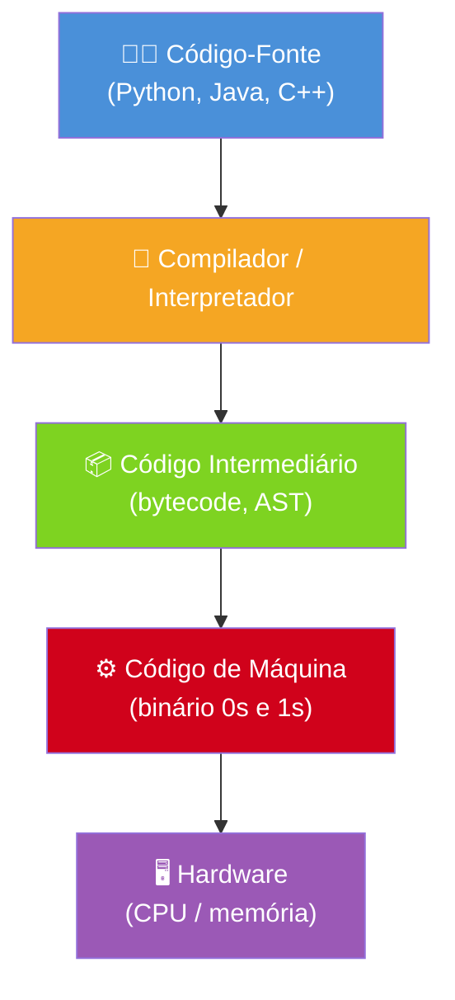
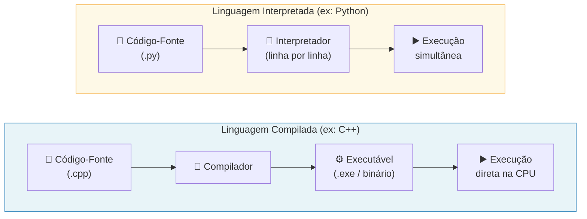
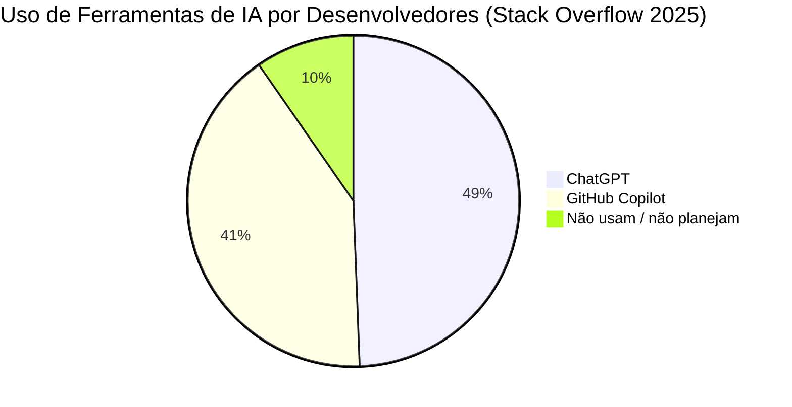
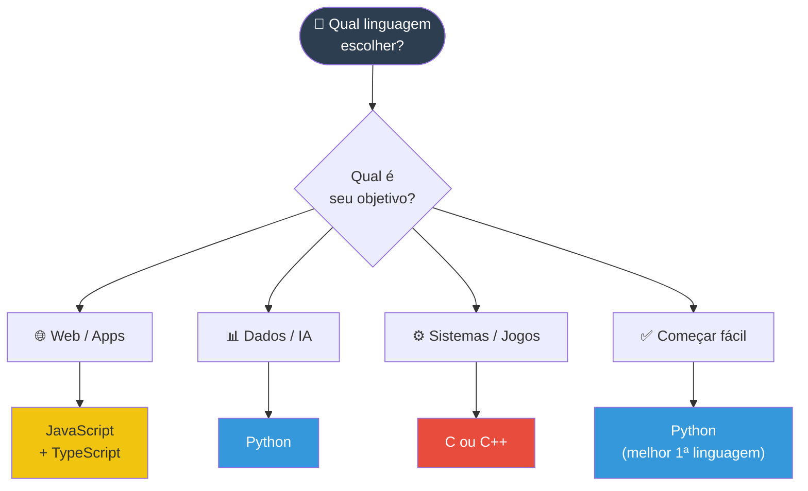

# Linguagens de Programação

> [!quote] A Ponte Entre Humanos e Máquinas
> *Linguagens de programação são idiomas que permitem aos humanos comunicar instruções aos computadores de forma estruturada.*

---

## 🤔 O que são Linguagens de Programação?

> [!info] Definição
> São conjuntos de regras e símbolos que permitem escrever instruções que um computador pode entender e executar.

| Pergunta | Resposta |
|----------|----------|
| **O que são?** | Idiomas para comunicar com computadores |
| **Por que precisamos?** | Computadores só entendem 0s e 1s |
| **O que fazem?** | Traduzem nossa lógica para linguagem de máquina |

> [!tip] Analogia do Dia a Dia
> Imagine que você quer pedir uma pizza. Em **linguagem de máquina**, você diria exatamente quais neurônios do atendente devem disparar, em que ordem, com qual intensidade. Impossível, não? Em **Python**, você simplesmente diz `pedir_pizza("mussarela")` e o computador cuida do resto. Quanto mais alto o nível da linguagem, mais próxima ela está do modo humano de pensar.

---

## 📊 Tipos de Linguagens

### 🔧 Linguagens de Baixo Nível

> [!info] Próximas da Máquina
> Mais difíceis para humanos, mais eficientes para máquinas.

| Tipo | Descrição | Exemplo |
|------|-----------|---------|
| **Linguagem de Máquina** | Código binário (0s e 1s) | `10110000 01100001` |
| **Assembly** | Mnemônicos para instruções | `MOV AX, 61h` |

> [!warning] Por que ainda existe Assembly?
> Sistemas embarcados (como o microcontrolador de um carro ou um marcapasso cardíaco) precisam de código extremamente eficiente e previsível. Nesses contextos, cada microssegundo importa, e um compilador de alto nível pode gerar instruções "desnecessárias". Por isso, engenheiros de sistemas críticos ainda escrevem Assembly até hoje.

---

### 🎨 Linguagens de Alto Nível

> [!tip] Mais Próximas dos Humanos
> Mais fáceis de aprender e usar.

| Linguagem | Uso Principal | Dificuldade |
|-----------|---------------|-------------|
| **Python** | IA, automação, ciência de dados | Fácil |
| **JavaScript** | Web, aplicativos | Média |
| **Java** | Empresarial, Android | Média |
| **C++** | Jogos, sistemas | Difícil |

---

### ⚖️ Comparação

| Aspecto | Baixo Nível | Alto Nível |
|---------|-------------|------------|
| **Facilidade** | Difícil | Fácil |
| **Velocidade** | Muito rápido | Mais lento |
| **Controle** | Total sobre hardware | Abstração do hardware |
| **Portabilidade** | Específico para máquina | Multi-plataforma |

---

### 🏗️ Níveis de Abstração: Do Código ao Hardware

O diagrama abaixo mostra como uma instrução em Python percorre camadas até virar eletricidade num chip:



> [!note] Leitura do Diagrama
> Cada seta representa uma **transformação**: seu código Python (legível para humanos) é processado pelo interpretador, que o converte em instruções binárias que a CPU consegue executar diretamente. Linguagens compiladas (C, C++) pulam da camada de bytecode direto para código de máquina.

---

## 🎯 Paradigmas de Programação

> [!info] Diferentes Formas de Pensar
> Paradigmas são estilos ou abordagens para resolver problemas.

| Paradigma | Descrição | Exemplo |
|-----------|-----------|---------|
| **Imperativo** | Sequência de comandos passo a passo | C, Pascal |
| **Orientado a Objetos** | Organiza código em "objetos" | Java, Python |
| **Funcional** | Baseado em funções matemáticas | Haskell, Lisp |
| **Declarativo** | Descreve "o quê" em vez de "como" | SQL, HTML |

> [!example] Comparando Paradigmas: Soma de uma Lista
> O mesmo problema resolvido de três formas diferentes:
>
> **Imperativo (C):** você diz exatamente *como* fazer, passo a passo.
> ```c
> int soma = 0;
> for (int i = 0; i < 5; i++) {
>     soma += numeros[i];
> }
> ```
>
> **Orientado a Objetos (Python):** você usa um objeto com métodos prontos.
> ```python
> numeros = [1, 2, 3, 4, 5]
> soma = sum(numeros)
> ```
>
> **Declarativo (SQL):** você descreve *o que* quer, sem dizer como calcular.
> ```sql
> SELECT SUM(valor) FROM vendas;
> ```
>
> Perceba: o resultado é o mesmo, mas a forma de pensar o problema é completamente diferente.

> [!tip] A maioria das linguagens modernas é multiparadigma
> Python, por exemplo, permite programação imperativa, orientada a objetos e funcional no mesmo arquivo. Java, historicamente imperativo/OO, ganhou suporte funcional a partir da versão 8 com lambdas e streams. Isso significa que o programador escolhe o estilo que melhor se adapta ao problema.

---

## 💻 Linguagens Populares

### 🐍 Python

| Aspecto | Descrição |
|---------|-----------|
| **Uso** | IA, ciência de dados, automação, web |
| **Por que aprender** | Sintaxe simples, ideal para iniciantes |
| **Sintaxe** | `print("Olá, mundo!")` |

> [!success] Python em 2026
> Python ocupa o **1º lugar no TIOBE Index de junho de 2026** e registrou um crescimento de 7 pontos percentuais no Stack Overflow Developer Survey 2025, consolidando-se como a linguagem dominante em Inteligência Artificial e ciência de dados. Praticamente todas as grandes bibliotecas de IA (TensorFlow, PyTorch, scikit-learn) são escritas ou têm interface em Python.

---

### ☕ Java

| Aspecto | Descrição |
|---------|-----------|
| **Uso** | Aplicações empresariais, Android |
| **Característica** | "Escreva uma vez, rode em qualquer lugar" |
| **Sintaxe** | `System.out.println("Olá, mundo!");` |

> [!info] Java e a JVM
> O segredo da portabilidade do Java é a **JVM (Java Virtual Machine)**: o compilador não gera código de máquina diretamente, mas sim um **bytecode** intermediário que a JVM interpreta em qualquer sistema operacional. É por isso que o mesmo `.jar` roda no Windows, Linux e macOS sem recompilação.

---

### ⚡ C++

| Aspecto | Descrição |
|---------|-----------|
| **Uso** | Jogos, sistemas operacionais, embarcados |
| **Característica** | Alto desempenho, controle de memória |
| **Sintaxe** | `cout << "Olá, mundo!" << endl;` |

> [!warning] Poder com Responsabilidade
> C++ dá ao programador controle total sobre a memória do computador. Isso significa velocidade máxima, mas também significa que um erro pode causar falhas graves (como o famoso "segfault", ou segmentation fault). Grandes jogos como **Unreal Engine** e sistemas como o **kernel do Windows** são escritos em C ou C++.

---

### 🌐 JavaScript

| Aspecto | Descrição |
|---------|-----------|
| **Uso** | Web (front e back-end), aplicativos |
| **Característica** | Roda no navegador, essencial para web |
| **Sintaxe** | `console.log("Olá, mundo!");` |

> [!info] JavaScript está em todo lugar
> Originalmente criado para rodar só no navegador, o JavaScript conquistou o back-end com o **Node.js** e hoje também gera aplicativos mobile (React Native) e desktop (Electron). É a linguagem mais usada no Stack Overflow Developer Survey 2025, com 66% dos desenvolvedores utilizando-a regularmente.

---

## ⚙️ Compiladores e Interpretadores

> [!info] Traduzindo para a Máquina
> Todo código precisa ser traduzido para linguagem de máquina.

| Tipo | Como Funciona | Exemplo |
|------|---------------|---------|
| **Compilador** | Traduz todo código antes de executar | C, C++, Java |
| **Interpretador** | Traduz e executa linha por linha | Python, JavaScript |

### Comparação

| Aspecto | Compilador | Interpretador |
|---------|------------|---------------|
| **Velocidade de execução** | Rápido | Mais lento |
| **Detecção de erros** | Antes de rodar | Durante execução |
| **Desenvolvimento** | Mais lento (recompila) | Mais ágil |

---

### 🔄 Fluxo Compilada vs. Interpretada



> [!note] E o Java?
> Java é um caso especial: o compilador gera **bytecode** (não executável nativo), e a JVM interpreta esse bytecode em tempo de execução. Esse modelo híbrido combina a verificação de erros em tempo de compilação com a portabilidade de um interpretador.

---

## 📈 Linguagens em Alta: Dados de 2025-2026

> [!info] O Cenário Atual do Mercado
> O mundo das linguagens de programação muda a cada ano. Veja os dados mais recentes:

### TIOBE Index: Junho de 2026

| Posição | Linguagem | Tendência |
|---------|-----------|-----------|
| 1° | Python | Estável no topo |
| 2° | C | Estável |
| 3° | C++ | Subiu (era 4°) |
| 4° | Java | Caiu (era 3°) |
| 5° | C# | Estável |
| 6° | JavaScript | Estável |
| 7° | Visual Basic | Estável |
| 8° | SQL | Subiu |
| 9° | R | Estável |
| 12° | Rust | Recorde histórico |

> [!note] Rust em Ascensão
> Rust atingiu a **12ª posição no TIOBE em junho de 2026**, seu maior ranking histórico. No Stack Overflow Developer Survey 2025, Rust é pela décima vez consecutiva a linguagem **mais admirada** pelos desenvolvedores (72% de aprovação), graças à sua segurança de memória sem coletor de lixo.

### Stack Overflow Developer Survey 2025: Uso Real

| Linguagem | % Desenvolvedores que Usam |
|-----------|---------------------------|
| JavaScript | 66% |
| HTML/CSS | ~63% |
| SQL | ~57% |
| Python | crescimento de 7 p.p. (2024 para 2025) |
| TypeScript | em forte crescimento |

---

## 🤖 IA e o Futuro da Programação

> [!warning] O Cenário que Você Precisa Conhecer
> Em 2025-2026, a Inteligência Artificial mudou radicalmente a forma como o código é escrito. Esses dados não são ficção científica: são estatísticas de hoje.

| Dado | Valor | Fonte |
|------|-------|-------|
| % de código gerado por IA (GitHub Copilot) | 46% em média | GitHub, 2025 |
| Aceleração de tarefas com Copilot | 55% mais rápido | GitHub Research, 4.800 devs |
| Desenvolvedores que usam ou planejam usar IA | 84% | Stack Overflow 2025 |
| Usuários do GitHub Copilot (jul/2025) | 20 milhões | GitHub |
| Fortune 100 que adotou Copilot | 90% | GitHub, 2026 |

> [!important] O que isso significa para você?
> Saber programar continua sendo essencial: a IA gera código, mas **você precisa entender o que ela gerou** para revisar, corrigir e integrar. O programador que usa IA como ferramenta supera em produtividade quem ignora essas tecnologias. Dominar os conceitos desta aula (paradigmas, tipos de linguagem, compilação) é exatamente o que permite usar a IA com inteligência.



---

## 🛠️ IDEs (Ambientes de Desenvolvimento Integrado)

> [!tip] Ferramentas para Programar
> IDEs facilitam a escrita, teste e depuração de código.

| IDE | Linguagens | Destaque |
|-----|------------|----------|
| **VS Code** | Múltiplas | Leve, extensível, gratuito |
| **PyCharm** | Python | Específico para Python |
| **Eclipse** | Java | Tradicional para Java |
| **IntelliJ IDEA** | Java, Kotlin | Poderoso, JetBrains |

> [!tip] VS Code domina o mercado
> O **Visual Studio Code** é o editor mais popular no Stack Overflow Developer Survey há vários anos consecutivos, com mais de 70% dos desenvolvedores usando-o. É gratuito, open source e tem extensões para praticamente qualquer linguagem. Para iniciantes, é a escolha padrão.

---

## 🎯 Como Escolher uma Linguagem?

> [!tip] Fatores a Considerar

| Fator | Pergunta a Fazer |
|-------|------------------|
| **Objetivo** | O que você quer criar? (web, jogos, dados) |
| **Facilidade** | Você é iniciante ou experiente? |
| **Mercado** | Quais linguagens têm mais vagas? |
| **Comunidade** | Há bastante material de estudo? |

> [!success] Recomendação para Iniciantes
> **Python** é uma excelente primeira linguagem: sintaxe simples, versátil e muito usada no mercado.

### 🗺️ Mapa de Decisão: Qual Linguagem Aprender?



---

## 🧪 Atividades Práticas

> [!example] 🧪 Atividade 1: Hello World em 3 Linguagens
> **Ferramenta:** [Programiz Online Compiler](https://www.programiz.com/python-programming/online-compiler/) (Python), [Programiz Java](https://www.programiz.com/java-programming/online-compiler/) (Java), [Programiz C++](https://www.programiz.com/cpp-programming/online-compiler/) (C++)
>
> **O que fazer:**
> 1. Acesse cada um dos três compiladores online acima.
> 2. Escreva o "Hello World" em cada linguagem (o código já está pronto na aula, copie e execute):
>    - Python: `print("Olá, mundo!")`
>    - Java: `System.out.println("Olá, mundo!");` (dentro de `main`)
>    - C++: `cout << "Olá, mundo!" << endl;` (dentro de `main`)
> 3. Preencha a tabela abaixo com suas observações:
>
> | Linguagem | Linhas de código necessárias | Funcionou de primeira? | O que achou mais estranho na sintaxe? |
> |-----------|------------------------------|----------------------|---------------------------------------|
> | Python | ? | ? | ? |
> | Java | ? | ? | ? |
> | C++ | ? | ? | ? |
>
> **Resultado esperado:** perceber que Python exige muito menos código para fazer a mesma coisa. Entender na prática o que "nível de abstração" significa.

---

> [!example] 🧪 Atividade 2: Ranking TIOBE ao Vivo
> **Ferramenta:** [tiobe.com/tiobe-index/](https://www.tiobe.com/tiobe-index/) (acesso direto, sem login)
>
> **O que fazer:**
> 1. Acesse o site do TIOBE agora mesmo.
> 2. Anote o top 5 do mês atual na tabela abaixo:
>
> | Posição | Linguagem | % de popularidade |
> |---------|-----------|-------------------|
> | 1° | ? | ?% |
> | 2° | ? | ?% |
> | 3° | ? | ?% |
> | 4° | ?  | ?% |
> | 5° | ? | ?% |
>
> 3. Compare com o top 5 visto nesta aula (dados de junho de 2026). Alguma linguagem trocou de posição?
> 4. Procure na tabela completa onde estão **Rust** e **TypeScript**. Em que posições estão hoje?
>
> **Resultado esperado:** entender que o ranking muda todo mês e que acompanhar tendências faz parte da vida de um programador.

---

> [!example] 🧪 Atividade 3: Classificar Linguagens numa Tabela
> **Ferramenta:** papel e caneta (ou editor de texto de sua escolha)
>
> **O que fazer:**
> Escolha 3 linguagens desta lista: Python, Java, C, JavaScript, C++, Rust.
> Para cada uma, classifique nos três eixos abaixo. Use os conceitos aprendidos nesta aula (não precisa pesquisar: use o que viu até aqui).
>
> | Linguagem | Compilada / Interpretada / Híbrida | Paradigma principal | Tipagem (Estática / Dinâmica) |
> |-----------|-------------------------------------|--------------------|-----------------------------|
> | ? | ? | ? | ? |
> | ? | ? | ? | ? |
> | ? | ? | ? | ? |
>
> **Depois:** troque sua tabela com um colega. Vocês chegaram às mesmas respostas? Onde divergiram? Discutam por 5 minutos.
>
> **Resultado esperado:** fixar os conceitos de compilação, paradigma e tipagem aplicando-os a linguagens concretas que já apareceram na aula.

---

## 📝 Conclusão

> [!success] Pontos Principais

- Linguagens de programação permitem **comunicar com computadores**
- Existem linguagens de **baixo nível** (Assembly) e **alto nível** (Python, Java)
- **Paradigmas** são diferentes formas de estruturar o código
- **Compiladores** e **interpretadores** traduzem código para linguagem de máquina
- **IDEs** são ferramentas que facilitam o desenvolvimento
- Em 2026, **Python** lidera o TIOBE Index e domina a área de IA
- Ferramentas de IA como o GitHub Copilot já geram **46% do código** escrito por desenvolvedores, tornando indispensável entender os fundamentos para supervisionar esse código

---

> [!note] 📚 Fontes (2026)
> - [TIOBE Index June 2026: Top 10 Most Popular Programming Languages](https://www.techrepublic.com/article/news-tiobe-index-language-rankings/) (TechRepublic, jun/2026)
> - [TIOBE Index: tiobe.com](https://www.tiobe.com/tiobe-index/) (consulta direta, jun/2026)
> - [Stack Overflow Developer Survey 2025: Technology](https://survey.stackoverflow.co/2025/technology) (Stack Overflow, 2025)
> - [Stack Overflow Developer Survey 2025: AI](https://survey.stackoverflow.co/2025/ai) (Stack Overflow, 2025)
> - [GitHub Copilot: AI is writing 46% of all code](https://medium.com/@reliabledataengineering/ai-is-writing-46-of-all-code-github-copilots-real-impact-on-15-million-developers-787d789fcfdc) (Medium/Reliable Data Engineering, 2025)
> - [GitHub Copilot Statistics 2026](https://www.getpanto.ai/blog/github-copilot-statistics) (GetPanto, 2026)
> - [Top 100 AI Pair Programming Statistics 2026](https://www.index.dev/blog/ai-pair-programming-statistics) (Index.dev, 2026)
