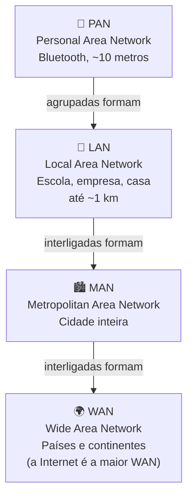
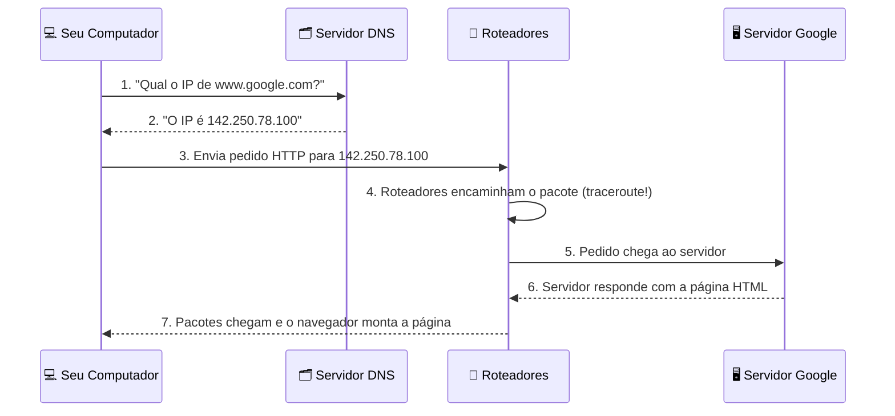

# Redes de Computadores

> [!quote] O Mundo Conectado
> *Redes de computadores são a espinha dorsal da comunicação moderna, conectando bilhões de dispositivos ao redor do mundo.*

---

## 🤔 O que são Redes de Computadores?

> [!info] Definição
> Uma rede de computadores é um conjunto de dispositivos interconectados que podem trocar dados e compartilhar recursos entre si.

| Pergunta | Resposta |
|----------|----------|
| **O que é?** | Conexão entre dois ou mais dispositivos |
| **Por que precisamos?** | Compartilhar recursos, comunicar, colaborar |
| **Exemplos** | Internet, rede da empresa, Wi-Fi de casa |

Pense numa rede de computadores como uma teia de aranha gigante: cada fio representa um canal de comunicação e cada nó representa um dispositivo (computador, celular, impressora, servidor). Quando você envia uma mensagem pelo WhatsApp, os dados saem do seu celular, passam por vários fios e roteadores, e chegam ao celular do destinatário em frações de segundo. Toda essa jornada acontece graças a redes de computadores.

A internet que você usa todos os dias é simplesmente a maior rede de computadores do mundo, formada pela interconexão de milhões de redes menores espalhadas pelo planeta.

---

## ✨ Benefícios das Redes

| Benefício | Descrição |
|-----------|-----------|
| **Compartilhamento de recursos** | Impressoras, arquivos, internet |
| **Comunicação** | E-mail, mensagens, videoconferência |
| **Colaboração** | Trabalho em equipe, documentos compartilhados |
| **Economia** | Menos equipamentos, custos reduzidos |
| **Centralização** | Backup centralizado, gerenciamento facilitado |

Antes das redes, para transferir um arquivo de um computador para outro era preciso copiar num disquete (ou CD) e entregar fisicamente para outra pessoa. Hoje, arquivos de gigabytes são transferidos em segundos entre continentes. Isso só é possível porque os computadores estão em rede.

---

## 🌐 Tipos de Redes

> [!info] Classificação por Abrangência Geográfica
> As redes são classificadas principalmente pelo tamanho da área geográfica que cobrem.

| Tipo | Nome | Abrangência | Exemplo |
|------|------|-------------|---------|
| **PAN** | Personal Area Network | Poucos metros | Bluetooth do celular |
| **LAN** | Local Area Network | Casa, escritório | Rede da escola |
| **MAN** | Metropolitan Area Network | Cidade | Rede de bibliotecas públicas |
| **WAN** | Wide Area Network | País, mundo | Internet |



> [!tip] Como diferenciar na prática?
> Pergunte: "Onde estão os dispositivos que esta rede conecta?"
> - Mesmo quarto/bolso: **PAN**
> - Mesmo prédio/campus: **LAN**
> - Mesma cidade: **MAN**
> - Países ou continentes: **WAN**

---

## 🔧 Componentes de uma Rede

### Dispositivos Finais

| Componente | Função |
|------------|--------|
| **Servidores** | Fornecem recursos e serviços |
| **Clientes** | Solicitam e usam recursos |
| **Estações de trabalho** | Computadores dos usuários |

### Dispositivos de Rede

| Componente | Função |
|------------|--------|
| **Roteador** | Conecta redes diferentes, direciona tráfego |
| **Switch** | Conecta dispositivos na mesma rede |
| **Hub** | Conecta dispositivos (menos inteligente que switch) |
| **Access Point** | Fornece conexão sem fio |

> [!info] Roteador vs. Switch: qual a diferença?
> O **switch** liga dispositivos dentro da mesma rede local (ex.: os computadores do laboratório entre si). O **roteador** liga redes diferentes (ex.: a sua rede local com a internet). Em casa, o aparelho que o provedor instala faz as duas funções ao mesmo tempo e por isso é chamado de "roteador Wi-Fi".

### Meios de Transmissão

| Tipo | Descrição | Velocidade típica |
|------|-----------|-------------------|
| **Cabo par trançado (UTP/Cat6)** | O mais comum em redes locais | até 10 Gbps |
| **Fibra óptica** | Alta velocidade, usa pulsos de luz | até 100 Gbps+ |
| **Sem fio (Wi-Fi 802.11ax)** | Ondas de rádio | até ~9,6 Gbps teórico |
| **Cabo coaxial** | Mais antigo, usado em TV a cabo | até ~1 Gbps |

---

## 📚 Modelo OSI

> [!info] As 7 Camadas da Comunicação
> O modelo OSI (Open Systems Interconnection) organiza a comunicação em rede em 7 camadas. Cada camada tem uma responsabilidade específica e só conversa com as camadas imediatamente acima e abaixo.

| Camada | Nome | Função | Exemplo |
|--------|------|--------|---------|
| **7** | Aplicação | Interface com usuário | HTTP, FTP, DNS |
| **6** | Apresentação | Formatação, criptografia | SSL/TLS, JPEG |
| **5** | Sessão | Gerencia conexões | NetBIOS |
| **4** | Transporte | Entrega confiável | TCP, UDP |
| **3** | Rede | Roteamento | IP, ICMP |
| **2** | Enlace | Comunicação local | Ethernet, Wi-Fi |
| **1** | Física | Bits pelo meio físico | Cabos, sinais elétricos |

> [!tip] Dica para Memorizar
> "**A**lgumas **P**essoas **S**implesmente **T**êm **R**eceio **E**norme de **F**ísica" (de cima para baixo)

> [!info] Como as camadas funcionam na prática?
> Quando você envia um e-mail, a mensagem começa na Camada 7 (Aplicação) e vai "descendo" pelas camadas, cada uma adicionando informações de controle. Do outro lado, o processo é inverso: os dados sobem pelas camadas até chegar ao destinatário. Esse conceito é chamado de **encapsulamento**.

---

## 🌍 Como a Internet Funciona: a Jornada de um Pedido Web

Quando você digita `www.google.com` no navegador, uma série de eventos acontece em milissegundos. Veja o passo a passo:



### O que é DNS?

O **DNS (Domain Name System)** funciona como a agenda telefônica da internet. Você conhece as pessoas pelo nome, mas o telefone precisa do número para ligar. Da mesma forma, você conhece os sites pelo nome (`google.com`), mas os computadores precisam do endereço IP numérico para se conectar.

| Conceito | Analogia |
|----------|----------|
| Nome de domínio (`google.com`) | Nome da pessoa na agenda |
| Endereço IP (`142.250.78.100`) | Número de telefone |
| Servidor DNS | A própria agenda telefônica |

### O que são Pacotes?

Os dados na internet não viajam como um bloco único. Eles são divididos em pequenos pedaços chamados **pacotes**, cada um com:

- Um cabeçalho (origem, destino, número de sequência)
- Uma carga de dados (o conteúdo real)

Os pacotes podem seguir rotas diferentes e são remontados no destino. É como se você desmontasse um quebra-cabeça, enviasse cada peça por um caminho diferente e remontasse tudo na chegada.

---

## 📡 Protocolos de Redes

> [!info] Regras de Comunicação
> Protocolos são conjuntos de regras que definem como os dados são transmitidos. Sem protocolos comuns, dois computadores não conseguiriam se entender, como se falassem idiomas diferentes.

| Protocolo | Significado | Uso |
|-----------|-------------|-----|
| **HTTP/HTTPS** | HyperText Transfer Protocol (Secure) | Páginas web |
| **FTP** | File Transfer Protocol | Transferência de arquivos |
| **TCP** | Transmission Control Protocol | Entrega confiável (verifica se chegou) |
| **UDP** | User Datagram Protocol | Entrega rápida sem verificação (streaming) |
| **IP** | Internet Protocol | Endereçamento e roteamento |
| **DNS** | Domain Name System | Tradução de nomes para IPs |
| **DHCP** | Dynamic Host Configuration Protocol | Atribuição automática de IPs |

> [!info] TCP vs. UDP: quando usar cada um?
> Use **TCP** quando a precisão importa: e-mail, download de arquivo, acesso a um site. Se um pacote se perder, o TCP pede para reenviar.
> Use **UDP** quando a velocidade importa mais: vídeo ao vivo, chamada de voz, jogos online. Perder um pacote é melhor do que travar a transmissão esperando o reenvio.

---

## 🔢 Endereçamento IP

> [!info] O "Endereço" do Dispositivo
> Cada dispositivo em uma rede precisa de um endereço IP único para ser identificado, assim como uma casa precisa de um endereço postal para receber correspondências.

### IPv4 vs IPv6

| Aspecto | IPv4 | IPv6 |
|---------|------|------|
| **Formato** | 4 números (0-255) separados por pontos | 8 grupos hexadecimais separados por dois-pontos |
| **Exemplo** | `192.168.1.1` | `2001:0db8:85a3::8a2e:0370:7334` |
| **Quantidade** | ~4,3 bilhões de endereços | ~340 undecilhões de endereços |
| **Status** | Ainda dominante, mas esgotado | Em adoção crescente |

> [!warning] Por que IPv6?
> O IPv4 está "acabando": todos os blocos de endereços disponíveis já foram alocados. O IPv6 foi criado para resolver esse problema e suportar os bilhões de dispositivos conectados à internet (celulares, geladeiras inteligentes, câmeras, carros, etc.).

### IPs Privados vs. Públicos

Existe uma divisão importante que você vai encontrar na prática:

| Tipo | Faixa de Endereço | Onde é Usado |
|------|-------------------|--------------|
| **IP Privado** | `192.168.x.x`, `10.x.x.x`, `172.16.x.x` | Dentro da rede local (casa, escola) |
| **IP Público** | Todos os outros | Identificação na internet |

> [!tip] Por que isso importa?
> O IP que seu computador mostra (ex.: `192.168.1.105`) é o endereço **privado**, visível apenas dentro da sua rede. O IP com que você aparece na internet é o IP **público** do seu roteador, compartilhado por todos na sua rede. É por isso que o site `meuip.com.br` mostra um IP diferente do `ipconfig`.

---

## 🖥️ Atividades Práticas

> [!example] 🧪 Atividade 1: Descobrindo o Seu IP Local
> **Objetivo:** Ver o endereço IP do seu próprio computador na rede local.
>
> **No Windows (Prompt de Comando):**
> ```
> ipconfig
> ```
> **No Linux ou Mac (Terminal):**
> ```
> ip a
> ```
> ou
> ```
> ifconfig
> ```
>
> **O que observar:**
> - Procure a linha `Endereço IPv4` (Windows) ou `inet` (Linux/Mac)
> - Anote o número. Ele provavelmente começa com `192.168.` ou `10.` (IP privado)
> - Procure também a linha `Máscara de Sub-rede` (Windows) ou `netmask` (Linux): ela define o tamanho da rede
> - Anote o `Gateway Padrão`: esse é o IP do seu roteador, a "porta de saída" para a internet
>
> **Resultado esperado (exemplo):**
> ```
> Endereço IPv4. . . : 192.168.1.105
> Máscara de Sub-rede: 255.255.255.0
> Gateway Padrão . . : 192.168.1.1
> ```

---

> [!example] 🧪 Atividade 2: Testando Conectividade com Ping
> **Objetivo:** Verificar se seu computador consegue alcançar outro dispositivo e medir o tempo de resposta.
>
> **No Windows (Prompt de Comando) ou Linux/Mac (Terminal):**
> ```
> ping google.com
> ```
>
> **O que observar:**
> - Cada linha mostra o tempo que o pacote levou para ir e voltar (em milissegundos, `ms`)
> - Valores abaixo de 30 ms: excelente conexão
> - Valores entre 30-100 ms: boa conexão
> - Valores acima de 200 ms: conexão lenta (pode causar lag em jogos)
> - Se aparecer "Tempo limite esgotado" ou "Request timeout": algo está bloqueando
>
> **Resultado esperado (exemplo):**
> ```
> Resposta de 142.250.78.100: bytes=32 tempo=15ms TTL=118
> Resposta de 142.250.78.100: bytes=32 tempo=14ms TTL=118
> ```
>
> **Bônus:** Tente pingar o seu gateway (roteador) e compare o tempo com o ping para o Google. O roteador deve responder em menos de 5 ms.

---

> [!example] 🧪 Atividade 3: Rastreando a Rota dos Seus Dados com Traceroute
> **Objetivo:** Ver por quantos equipamentos (saltos) seus dados passam até chegar ao servidor do Google.
>
> **No Windows (Prompt de Comando):**
> ```
> tracert google.com
> ```
> **No Linux ou Mac (Terminal):**
> ```
> traceroute google.com
> ```
>
> **O que observar:**
> - Cada linha numerada é um **salto** (um roteador pelo qual seus dados passaram)
> - O primeiro salto geralmente é o seu roteador doméstico (`192.168.x.x`)
> - Os seguintes são roteadores do seu provedor de internet
> - Os últimos são da infraestrutura do Google
> - Algumas linhas mostram `* * *`: esses roteadores estão configurados para não responder (por segurança)
>
> **Resultado esperado (exemplo, Windows):**
> ```
>  1    1 ms    1 ms    1 ms  192.168.1.1        [seu roteador]
>  2    8 ms    7 ms    8 ms  177.x.x.x          [roteador do provedor]
>  3   12 ms   11 ms   12 ms  ...                [mais roteadores]
> 15   15 ms   14 ms   15 ms  142.250.78.100     [Google!]
> ```
>
> **Pergunta para refletir:** Quantos saltos seus dados percorreram? Cada salto é um roteador físico em algum lugar do mundo.

---

## 🔐 Segurança Básica em Redes

Agora que você sabe como os dados trafegam, é importante entender que toda essa comunicação pode ser interceptada se não houver proteção adequada.

> [!warning] Cuidados Básicos de Segurança
> - **HTTPS** (cadeado no navegador): os dados são criptografados entre você e o servidor
> - **HTTP** (sem cadeado): os dados trafegam em texto aberto e podem ser lidos por terceiros
> - **Wi-Fi público sem senha**: qualquer pessoa na mesma rede pode tentar interceptar seu tráfego
> - **Firewall**: programa/hardware que filtra o tráfego, bloqueando conexões não autorizadas

| Situação | Risco | Boa Prática |
|----------|-------|-------------|
| Wi-Fi público (shopping, café) | Alto: alguém pode interceptar | Não acesse banco ou senhas |
| Site com `http://` | Médio: dados em aberto | Prefira sempre `https://` |
| Senha de Wi-Fi fraca | Alto: invasores na sua rede | Use senha longa e complexa |
| Rede da escola/empresa | Baixo: gerenciada por TI | Siga as políticas de uso |

---

## 📝 Conclusão

> [!success] Pontos Principais

- Redes conectam dispositivos para **compartilhar recursos e comunicar**
- Existem diferentes tipos: **PAN, LAN, MAN, WAN**, classificados pela abrangência geográfica
- O **modelo OSI** organiza a comunicação em 7 camadas
- **Protocolos** são regras que permitem a comunicação entre dispositivos diferentes
- **Endereços IP** identificam cada dispositivo na rede (privado na LAN, público na internet)
- O **DNS** traduz nomes de domínio (como `google.com`) em endereços IP numéricos
- Os dados viajam em **pacotes** que podem seguir rotas diferentes e são remontados no destino
- Ferramentas como `ping`, `traceroute` e `ipconfig` permitem **diagnosticar e entender a rede** diretamente no seu computador

---

> [!note] 📚 Fontes (2026)
> - [Livro Redes de Computadores, eduCAPES/CAPES](https://educapes.capes.gov.br/bitstream/capes/432642/2/Livro%20%20Redes%20de%20Computadores.pdf)
> - [O que é TCP/IP? Tecnoblog](https://tecnoblog.net/responde/o-que-e-tcp-ip/)
> - [O que é DNS? Tecnoblog](https://tecnoblog.net/responde/o-que-e-dns/)
> - [Rede de Computadores: guia completo, Alura](https://www.alura.com.br/artigos/rede-de-computadores)
> - [Ping, traceroute e netstat: a tríade do diagnóstico de redes, Red Hat](https://www.redhat.com/en/blog/ping-traceroute-netstat)
> - [Protocolos de Rede: tipos, camadas OSI e como funcionam, OPServices](https://www.opservices.com.br/protocolos-de-rede/)
> - [Como funciona o DNS: o sistema que traduz nomes em IPs, Qual Meu IP](https://qual-meu-ip.com/blog/como-funciona-o-dns)
> - [Fundamentos de Redes, UECE](https://www.uece.br/cct/wp-content/uploads/sites/28/2021/07/Redes_Computadores.pdf)
