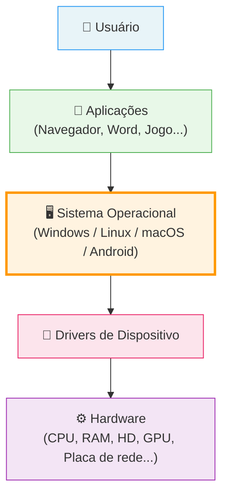
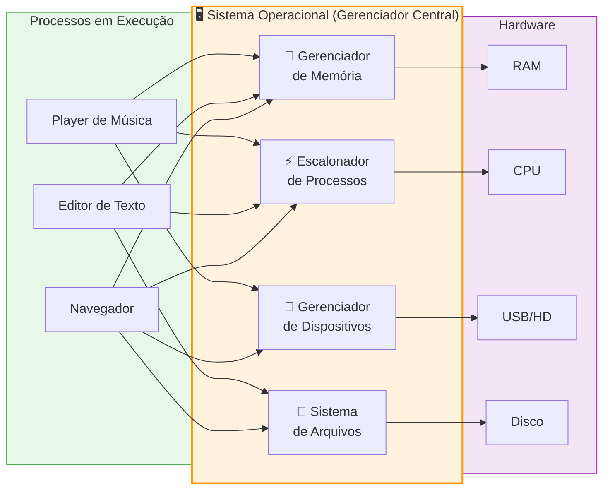
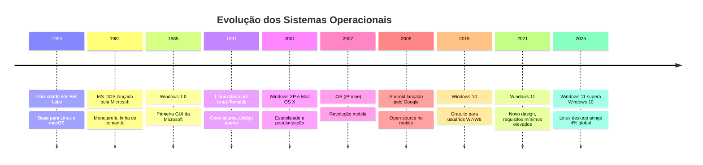

# Sistemas Operacionais

> [!quote] O Maestro do Computador
> *O Sistema Operacional é como um maestro que coordena todos os componentes do computador para que trabalhem em harmonia.*

---

## 🤔 O que são Sistemas Operacionais?

> [!info] Definição
> Sistema Operacional (SO) é um software que gerencia o hardware do computador e fornece uma interface entre o usuário e a máquina.

| Função | Descrição |
|--------|-----------|
| **Intermediário** | Faz a ponte entre usuário e hardware |
| **Gerenciador** | Controla todos os recursos do computador |
| **Plataforma** | Permite que outros programas funcionem |

---

## 🧱 Como o SO se posiciona na pilha de software

O Sistema Operacional ocupa uma camada fundamental entre o hardware físico e as aplicações que o usuário utiliza. Sem ele, cada programa precisaria "falar" diretamente com cada peça de hardware, o que tornaria o desenvolvimento de software praticamente impossível.



> [!tip] Analogia do condomínio
> Pense no SO como o síndico de um condomínio: ele não mora em nenhum apartamento (aplicação), não é a estrutura do prédio (hardware), mas organiza o uso de todos os recursos compartilhados: elevadores, luz, água e estacionamento.

---

## ⚙️ Funções Básicas

> [!tip] Os Quatro Pilares

| Função | O que Faz | Exemplo |
|--------|-----------|---------|
| **Gerenciamento de Memória** | Controla o uso da RAM | Aloca memória para cada programa |
| **Gerenciamento de Processos** | Controla programas em execução | Permite multitarefa |
| **Gerenciamento de Dispositivos** | Comunica com periféricos | Reconhece impressora conectada |
| **Gerenciamento de Arquivos** | Organiza dados no disco | Sistema de pastas e arquivos |

### Como o SO gerencia recursos em tempo real

O diagrama abaixo ilustra como o Sistema Operacional distribui os quatro recursos principais entre múltiplos processos rodando ao mesmo tempo:



---

## 📋 Tipos de Sistemas Operacionais

### Por Tarefas

| Tipo | Descrição | Exemplo |
|------|-----------|---------|
| **Monotarefa** | Executa um programa por vez | MS-DOS |
| **Multitarefa** | Executa vários programas simultaneamente | Windows, Linux, macOS |

### Por Usuários

| Tipo | Descrição | Exemplo |
|------|-----------|---------|
| **Usuário Único** | Um usuário por vez | Windows doméstico |
| **Multiusuário** | Vários usuários simultaneamente | Linux servidor |

### Por Aplicação

| Tipo | Descrição | Exemplo |
|------|-----------|---------|
| **Tempo Real** | Resposta imediata garantida | Sistemas de aviação, médicos |
| **Embarcado** | Para dispositivos específicos | Roteadores, eletrodomésticos |

> [!info] Sistemas embarcados ao seu redor
> O seu micro-ondas, smart TV, caixa eletrônico do banco e até o painel do carro rodam sistemas operacionais embarcados. O Android Auto e o CarPlay são sistemas operacionais especializados para veículos.

---

## 💻 Exemplos de Sistemas Operacionais

### 🪟 Windows

| Aspecto | Descrição |
|---------|-----------|
| **Desenvolvedor** | Microsoft |
| **Uso** | Mais popular em desktops |
| **Características** | Interface amigável, ampla compatibilidade de software |

### 🍎 macOS

| Aspecto | Descrição |
|---------|-----------|
| **Desenvolvedor** | Apple |
| **Uso** | Exclusivo para computadores Mac |
| **Características** | Integração com ecossistema Apple, estabilidade |

### 🐧 Linux

| Aspecto | Descrição |
|---------|-----------|
| **Desenvolvedor** | Comunidade (código aberto) |
| **Uso** | Servidores, desenvolvedores, entusiastas |
| **Características** | Gratuito, personalizável, várias distribuições (Ubuntu, Fedora, Debian) |

### 📱 Sistemas Móveis

| Sistema | Desenvolvedor | Dispositivos |
|---------|---------------|--------------|
| **Android** | Google | Samsung, Xiaomi, Motorola |
| **iOS** | Apple | iPhone, iPad |

---

## 📊 Market Share: quem usa o quê no mundo (2025-2026)

Os dados abaixo mostram a realidade atual do mercado de sistemas operacionais. Esses números mudam o tempo todo, refletindo novos lançamentos, adoções corporativas e mudanças de hábito dos usuários.

### Desktop e notebooks (junho 2026)

| Sistema Operacional | Market Share | Tendência |
|---------------------|:------------:|-----------|
| **Windows** | 72% | Dominante, Windows 11 ultrapassou o 10 em jul/2025 |
| **macOS** | 15% | Crescimento lento e constante |
| **Linux** (desktop) | 4% | Crescimento de 70% vs 2022, projeção de 6% em 2026 |
| **Chrome OS** | 2% | Estável |

> [!warning] Por que o Linux aparece tão pouco no desktop mas tanto nos servidores?
> No desktop, o Linux ainda enfrenta barreiras de usabilidade para o público geral. Já em servidores, o cenário é radicalmente diferente: o Linux detém **90% de toda a infraestrutura de nuvem pública** (AWS, Azure e Google Cloud), e **59% de todos os sites do mundo** rodam em servidores Linux (dados de dez/2025).

### Dispositivos móveis (2026)

| Sistema | Market Share Global | Destaque regional |
|---------|:------------------:|-------------------|
| **Android** | 70% | 92% na Índia |
| **iOS** | 29% | 60% nos EUA |

> [!info] Paradoxo de receita mobile
> Android tem o dobro de usuários do iOS, mas o iOS captura **64% de toda a receita de apps** no mundo. Usuários de iPhone tendem a gastar mais em aplicativos.

### Comparativo completo: Desktop vs Mobile vs Servidor

| Contexto | Líder | Segundo | Observação |
|----------|-------|---------|------------|
| **Desktop/Notebook** | Windows (72%) | macOS (15%) | Linux cresce em desenv. |
| **Smartphone/Tablet** | Android (70%) | iOS (29%) | Duopólio absoluto |
| **Servidores web** | Linux (59%) | Windows Server | Open source domina |
| **Nuvem pública** | Linux (90%) | Windows Server | AWS/Azure/GCP |

---

## 🖥️ CLI vs GUI

> [!info] Duas Formas de Interagir

| Aspecto | CLI (Linha de Comando) | GUI (Interface Gráfica) |
|---------|------------------------|-------------------------|
| **Interação** | Comandos de texto | Cliques e gestos |
| **Curva de aprendizado** | Maior | Menor |
| **Eficiência** | Alta para usuários avançados | Intuitiva para iniciantes |
| **Exemplos** | Terminal, PowerShell, Bash | Windows Explorer, Finder |

> [!example] Exemplos Práticos
> - **CLI:** `mkdir nova_pasta` (cria uma pasta)
> - **GUI:** Clique direito → Nova Pasta

> [!tip] Por que profissionais de TI preferem a CLI?
> Velocidade, automação e acesso remoto. Com um único script de 10 linhas na CLI é possível criar 500 pastas, renomear 10.000 arquivos ou configurar 20 servidores ao mesmo tempo. Uma interface gráfica tornaria isso impossível.

---

## 🛡️ Segurança em Sistemas Operacionais

> [!warning] Ameaças Comuns

| Ameaça | Descrição | Proteção |
|--------|-----------|----------|
| **Vírus** | Programa malicioso que se replica | Antivírus atualizado |
| **Malware** | Software malicioso em geral | Cuidado com downloads |
| **Ransomware** | Sequestra dados e pede resgate | Backup regular |
| **Phishing** | Engana para roubar dados | Atenção a links suspeitos |

### Mecanismos de Proteção

| Ferramenta | Função |
|------------|--------|
| **Firewall** | Controla tráfego de rede |
| **Antivírus** | Detecta e remove malware |
| **Atualizações** | Corrigem vulnerabilidades |
| **Controle de acesso** | Limita permissões de usuários |

> [!warning] Atualizações: por que são tão importantes?
> Em maio de 2017, o ransomware WannaCry infectou mais de 200.000 computadores em 150 países, causando prejuízos de bilhões de dólares. Todos os sistemas afetados rodavam Windows sem uma atualização de segurança que a Microsoft havia lançado dois meses antes. Atualizar o sistema operacional não é opcional: é a principal linha de defesa.

---

## 🔄 Linha do Tempo: a evolução dos Sistemas Operacionais



---

## ⚖️ Comparativo entre os principais SOs

| Critério | Windows | macOS | Linux (Ubuntu) | Android |
|----------|:-------:|:-----:|:--------------:|:-------:|
| **Custo** | Pago | Pago (embutido no Mac) | Gratuito | Gratuito |
| **Código aberto** | Não | Parcialmente | Sim (kernel) | Parcialmente |
| **Facilidade de uso** | Alta | Alta | Média | Alta |
| **Customização** | Média | Baixa | Muito alta | Alta |
| **Segurança** | Média | Alta | Muito alta | Média |
| **Suporte a jogos** | Excelente | Fraco | Melhorando | Bom (mobile) |
| **Uso em servidores** | Baixo | Raro | Dominante | Raro |
| **Market share desktop** | 72% | 15% | 4% | 0% |
| **Market share mobile** | 0% | 0% | 0% | 70% |

---

## 🧪 Atividades Mão na Massa

> [!example] 🧪 Atividade 1: Espião de Processos
> **Objetivo:** Descobrir o que o seu computador faz enquanto você "não usa" nada.
>
> **No Windows:**
> 1. Pressione `Ctrl + Shift + Esc` para abrir o Gerenciador de Tarefas.
> 2. Clique na aba **Desempenho** e depois em **CPU**.
> 3. Volte para a aba **Processos** e clique na coluna **CPU** para ordenar do maior para o menor.
>
> **No macOS:**
> 1. Abra o **Monitor de Atividade** (Spotlight: `Cmd + Space`, depois digitar "Monitor de Atividade").
> 2. Clique na aba **CPU** e ordene por uso decrescente.
>
> **No Linux:**
> 1. Abra o **Monitor do Sistema** (ou pressione `Ctrl + Alt + T` e digite `htop`).
>
> **Resultado observável:** Identifique os 3 processos que mais consomem CPU e os 3 que mais consomem RAM. Anote os nomes. Pesquise o que cada um desses processos faz (busque pelo nome exato no Google). Responda: algum processo te surpreendeu? Havia algo rodando que você não sabia?

> [!example] 🧪 Atividade 2: Linux no Navegador (sem instalar nada)
> **Objetivo:** Explorar um sistema operacional Linux real diretamente pelo navegador, sem precisar instalar nada.
>
> **Ferramenta:** Acesse [distrosea.com](https://distrosea.com) ou [webminal.org](https://webminal.org) no seu navegador.
>
> **Passos:**
> 1. No Distrosea, escolha uma distribuição (sugestão: **Ubuntu 22.04** ou **Fedora 38**) e clique em "Try Online".
> 2. Aguarde o sistema carregar (pode demorar 1 a 2 minutos).
> 3. Abra o Terminal dentro da distro (geralmente disponível na barra de tarefas ou no menu de aplicativos).
> 4. Execute os dois comandos abaixo e observe o resultado:
>
> ```bash
> uname -a
> ```
> Mostra o nome completo do sistema operacional e a versão do kernel Linux.
>
> ```bash
> ls /
> ```
> Lista os diretórios raiz do sistema de arquivos Linux.
>
> **Resultado observável:** Compare a estrutura de pastas do Linux com o que você conhece do Windows (C:\, Documentos, etc.). Quais pastas existem no Linux que não existem no Windows? O que você acha que cada uma guarda? Escreva pelo menos 3 diferenças que você observou.

> [!example] 🧪 Atividade 3: Meu Histórico de Sistemas
> **Objetivo:** Conectar o conteúdo da aula com a sua própria experiência de vida.
>
> **Tarefa:** Preencha a tabela abaixo com 3 sistemas operacionais que você já usou (computador, celular, tablet, videogame, smart TV, etc.). Inclua pelo menos um SO que você usa hoje e pelo menos um que você usou no passado.
>
> | Sistema Operacional | Dispositivo | Período de uso | Ponto positivo | Ponto negativo |
> |---------------------|-------------|----------------|----------------|----------------|
> | (ex: Android 13) | (ex: Meu celular) | (ex: 2023 até hoje) | (ex: muitos apps) | (ex: bateria) |
> | | | | | |
> | | | | | |
>
> Após preencher: com base no que você aprendeu nesta aula, tente identificar qual **tipo** de SO cada um deles é (multitarefa? multiusuário? embarcado?). Traga sua tabela para discussão.

---

## 📝 Conclusão

> [!success] Pontos Principais

- O Sistema Operacional é **essencial** para o funcionamento do computador
- Gerencia **recursos** como memória, processos, dispositivos e arquivos
- Existem opções para **diferentes necessidades**: desktop, servidor, móvel
- A **segurança** é uma responsabilidade contínua do SO e do usuário
- No mercado atual (2026), **Windows domina o desktop** (72%), **Android domina o mobile** (70%) e **Linux domina os servidores** (90% da nuvem pública)

---

> [!note] 📚 Fontes (2026)
> - [StatCounter: Desktop OS Market Share Worldwide](https://gs.statcounter.com/os-market-share/desktop/worldwide/) - dados de desktop, jun/2026
> - [StatCounter: Mobile OS Market Share Worldwide](https://gs.statcounter.com/os-market-share/mobile/worldwide/) - dados mobile, 2026
> - [SafeITExperts: 2025 Desktop Operating System Market Share](https://safeitexperts.com/en/2025-desktop-operating-system-market-share.html)
> - [commandlinux.com: Linux Server Market Share (2026)](https://commandlinux.com/statistics/linux-server-market-share/)
> - [fosspost.org: Linux Server Market Share Statistics 2026](https://fosspost.org/linux-server-market-share-statistics/)
> - [mobiloud.com: Android vs iOS Market Share 2026](https://www.mobiloud.com/blog/android-vs-ios-market-share)
> - [xtendedview.com: Operating System Statistics 2026](https://xtendedview.com/operating-system-statistics/)
> - [Wikipedia: Usage share of operating systems](https://en.wikipedia.org/wiki/Usage_share_of_operating_systems)
