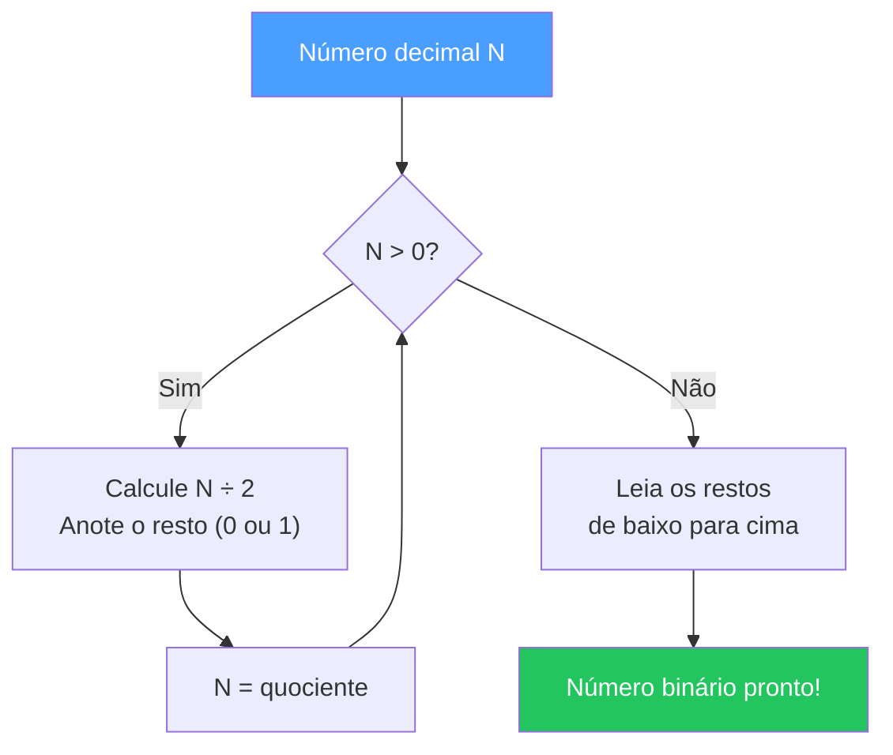
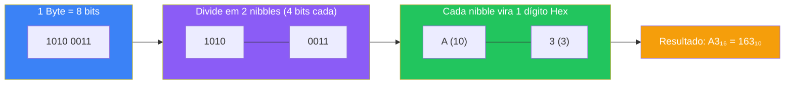
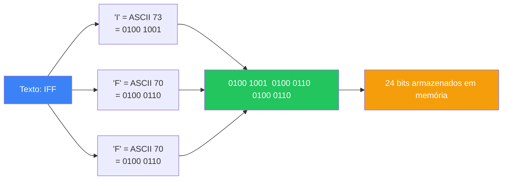
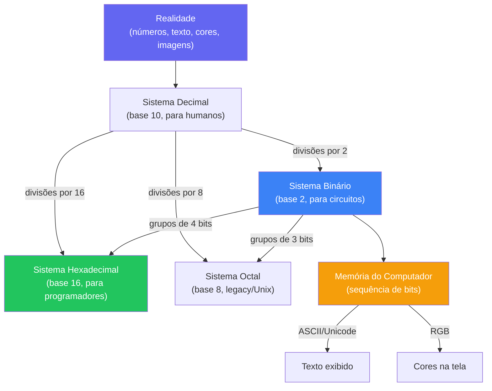

# Sistemas de Numeração e Representação de Dados

> [!quote] A Linguagem dos Computadores
> *Computadores entendem apenas 0s e 1s. Entender sistemas de numeração é entender como eles "pensam".*

---

## 🎮 Recurso Interativo

> [!tip] Aprenda Jogando!
> 🔗 [Binary Game](https://learningcontent.cisco.com/games/binary/index.html) - Jogo interativo da Cisco para aprender sistema binário

---

## 📚 Tópicos da Aula

| Tópico | Descrição |
|--------|-----------|
| Sistema Decimal | Base 10, usado no dia a dia |
| Sistema Binário | Base 2, usado pelos computadores |
| Sistema Octal | Base 8, histórico na computação |
| Sistema Hexadecimal | Base 16, usado em cores e memória |
| Aritmética Binária | Operações com números binários |
| Representação de Dados | Como texto, números e cores são armazenados |

---

## 🔢 Sistema Decimal (Base 10)

> [!info] O Sistema do Dia a Dia
> O sistema decimal usa 10 símbolos: **0, 1, 2, 3, 4, 5, 6, 7, 8, 9**

### Estrutura Posicional

| Posição | Nome | Valor |
|---------|------|-------|
| 0 | Unidades | 10⁰ = 1 |
| 1 | Dezenas | 10¹ = 10 |
| 2 | Centenas | 10² = 100 |
| 3 | Milhares | 10³ = 1000 |

### Exemplo

O número **352** em decimal:
```
3 × 10² + 5 × 10¹ + 2 × 10⁰
= 300 + 50 + 2
= 352
```

> [!tip] Princípio posicional
> Todo sistema de numeração posicional funciona assim: cada dígito tem um peso que depende da sua **posição** e da **base** do sistema. Somar os produtos dígito × peso dá o valor total. Isso vale para decimal, binário, octal e hexadecimal sem exceção.

---

## 💻 Sistema Binário (Base 2)

> [!info] A Linguagem dos Computadores
> O sistema binário usa apenas 2 símbolos: **0 e 1** (ligado/desligado)

### Estrutura Posicional

| Posição | Valor | Decimal |
|---------|-------|---------|
| 0 | 2⁰ | 1 |
| 1 | 2¹ | 2 |
| 2 | 2² | 4 |
| 3 | 2³ | 8 |
| 4 | 2⁴ | 16 |
| 5 | 2⁵ | 32 |
| 6 | 2⁶ | 64 |
| 7 | 2⁷ | 128 |

### Exemplo: Binário para Decimal

O número **1011** em binário:
```
1 × 2³ + 0 × 2² + 1 × 2¹ + 1 × 2⁰
= 8 + 0 + 2 + 1
= 11 (decimal)
```

> [!tip] Por que Binário?
> Computadores usam circuitos elétricos com dois estados: ligado (1) e desligado (0). O sistema binário representa perfeitamente essa realidade física.

### Conversão: Decimal para Binário (Divisões Sucessivas)

O método das divisões sucessivas consiste em dividir o número decimal por 2 repetidamente, anotando o resto a cada passo. Os restos lidos **de baixo para cima** formam o número binário.

**Exemplo: converter 13 para binário**

```
13 ÷ 2 = 6  resto 1  ←
 6 ÷ 2 = 3  resto 0  |
 3 ÷ 2 = 1  resto 1  |  leia de baixo para cima
 1 ÷ 2 = 0  resto 1  ↑

Resultado: 1101₂
```

**Verificação:** 1×2³ + 1×2² + 0×2¹ + 1×2⁰ = 8 + 4 + 0 + 1 = **13** ✓

### Diagrama de conversão Decimal para Binário



---

## 8️⃣ Sistema Octal (Base 8)

> [!info] Sistema Histórico
> O sistema octal usa 8 símbolos: **0, 1, 2, 3, 4, 5, 6, 7**

### Estrutura Posicional

| Posição | Valor | Decimal |
|---------|-------|---------|
| 0 | 8⁰ | 1 |
| 1 | 8¹ | 8 |
| 2 | 8² | 64 |

### Exemplo

O número **547** em octal:
```
5 × 8² + 4 × 8¹ + 7 × 8⁰
= 320 + 32 + 7
= 359 (decimal)
```

> [!info] Atalho: Octal e Binário
> Como 8 = 2³, cada dígito octal corresponde exatamente a **3 bits** binários. Por isso o octal foi muito usado em sistemas antigos como Unix, onde permissões de arquivos ainda são expressas em octal (ex.: `chmod 755`).

| Octal | Binário |
|-------|---------|
| 0 | 000 |
| 1 | 001 |
| 2 | 010 |
| 3 | 011 |
| 4 | 100 |
| 5 | 101 |
| 6 | 110 |
| 7 | 111 |

---

## 🔷 Sistema Hexadecimal (Base 16)

> [!info] Sistema Compacto
> O sistema hexadecimal usa 16 símbolos: **0-9** e **A-F**

### Tabela de Conversão

| Hex | Decimal | Binário | Hex | Decimal | Binário |
|-----|---------|---------|-----|---------|---------|
| 0 | 0 | 0000 | 8 | 8 | 1000 |
| 1 | 1 | 0001 | 9 | 9 | 1001 |
| 2 | 2 | 0010 | A | 10 | 1010 |
| 3 | 3 | 0011 | B | 11 | 1011 |
| 4 | 4 | 0100 | C | 12 | 1100 |
| 5 | 5 | 0101 | D | 13 | 1101 |
| 6 | 6 | 0110 | E | 14 | 1110 |
| 7 | 7 | 0111 | F | 15 | 1111 |

### Exemplo

O número **2A3** em hexadecimal:
```
2 × 16² + A × 16¹ + 3 × 16⁰
= 2 × 256 + 10 × 16 + 3 × 1
= 512 + 160 + 3
= 675 (decimal)
```

> [!tip] Uso Prático
> Hexadecimal é muito usado para representar cores (#FF5733), endereços de memória e valores de bytes de forma compacta.

### Por que Hex é tão popular na computação?

Como 16 = 2⁴, cada dígito hexadecimal corresponde exatamente a **4 bits** (1 nibble). Isso torna a conversão entre binário e hexadecimal direta, sem necessidade de passar pelo decimal:

```
Binário:  1111 0010 1010 0011
          │    │    │    │
Hex:       F    2    A    3
```

### Diagrama: como um byte (8 bits) se transforma em dois dígitos Hex



---

## ➕ Aritmética Binária

### Adição

| Operação | Resultado |
|----------|-----------|
| 0 + 0 | 0 |
| 0 + 1 | 1 |
| 1 + 0 | 1 |
| 1 + 1 | 10 (0 e "vai um") |

### Exemplo de Soma

```
    1011  (11 em decimal)
  + 0110  (6 em decimal)
  ------
   10001  (17 em decimal)
```

### Subtração Binária

A subtração segue regras complementares à adição:

| Operação | Resultado |
|----------|-----------|
| 0 - 0 | 0 |
| 1 - 0 | 1 |
| 1 - 1 | 0 |
| 0 - 1 | 1 (e "pede emprestado") |

**Exemplo:**
```
    1101  (13 em decimal)
  - 0101  (5  em decimal)
  ------
    1000  (8  em decimal)
```

### Complemento a 2: representando números negativos

> [!info] Como o computador representa negativos?
> Computadores não têm sinal de menos nos circuitos. A solução usada universalmente é o **Complemento a 2**, que permite subtrair usando o mesmo circuito de adição.

**Passo a passo para encontrar o complemento a 2 de um número:**

1. Escreva o número em binário com N bits.
2. **Inverta todos os bits** (0 vira 1, 1 vira 0). Isso é o Complemento a 1.
3. **Some 1** ao resultado. Pronto: esse é o Complemento a 2.

**Exemplo: representar -5 em 8 bits**
```
Passo 1: +5 em 8 bits    =  0000 0101
Passo 2: Inverte os bits  =  1111 1010  (complemento a 1)
Passo 3: Soma 1           =  1111 1011  (complemento a 2 = -5)
```

> [!warning] Bit de sinal
> Em representação com complemento a 2, o bit mais à esquerda (MSB) indica o sinal: **0 = positivo**, **1 = negativo**. Nunca interprete um número assinado sem saber quantos bits ele usa!

### Overflow: quando o resultado não cabe!

> [!warning] Cuidado com Overflow
> **Overflow** ocorre quando o resultado de uma operação ultrapassa a capacidade de representação do sistema. Com 8 bits sem sinal, o máximo é 255. Somar 200 + 100 = 300, mas 300 não cabe em 8 bits: o resultado seria incorreto (44). Isso é overflow.

**Exemplo prático:**
```
  1100 1000  (200)
+ 0110 0100  (100)
-----------
1 0010 1100  (300 em decimal, mas o 9º bit se perde!)
  0010 1100  (44  é o que fica nos 8 bits)
```

Os processadores detectam overflow via um **flag de carry** (vai-um além do último bit) e interrompem ou sinalizam o erro.

---

## 📊 Representação de Dados

### Bits e Bytes

| Unidade | Valor |
|---------|-------|
| **1 bit** | 0 ou 1 |
| **1 byte** | 8 bits |
| **1 nibble** | 4 bits (meio byte) |

> [!info] Quantas combinações?
> Com N bits é possível representar **2ᴺ** combinações distintas. Com 1 bit: 2 valores (0 e 1). Com 8 bits: 256 valores (0 a 255). Com 32 bits: mais de 4 bilhões de valores.

### Tabela de unidades de armazenamento

| Unidade | Equivalência | Exemplo real |
|---------|-------------|--------------|
| 1 byte | 8 bits | Um caractere ASCII |
| 1 KB (kibibyte) | 1.024 bytes | Um e-mail curto |
| 1 MB (mebibyte) | 1.024 KB | Uma música MP3 |
| 1 GB (gibibyte) | 1.024 MB | Um filme em HD |
| 1 TB (tebibyte) | 1.024 GB | Centenas de filmes |

---

### Representação de Texto

| Padrão | Descrição | Exemplo |
|--------|-----------|---------|
| **ASCII** | 128 caracteres (7 bits) | 'A' = 65 = 01000001 |
| **Unicode** | Milhões de caracteres | Suporta emojis, idiomas |
| **UTF-8** | Unicode variável (1-4 bytes) | Padrão da web |

### Tabela ASCII: caracteres essenciais

| Decimal | Hex | Binário | Caractere | Descrição |
|---------|-----|---------|-----------|-----------|
| 32 | 20 | 0010 0000 | (espaço) | Espaço em branco |
| 48 | 30 | 0011 0000 | 0 | Dígito zero |
| 57 | 39 | 0011 1001 | 9 | Dígito nove |
| 65 | 41 | 0100 0001 | A | Letra maiúscula A |
| 90 | 5A | 0101 1010 | Z | Letra maiúscula Z |
| 97 | 61 | 0110 0001 | a | Letra minúscula a |
| 122 | 7A | 0111 1010 | z | Letra minúscula z |
| 87 | 57 | 0101 0111 | W | Letra maiúscula W |
| 101 | 65 | 0110 0101 | e | Letra minúscula e |
| 115 | 73 | 0111 0011 | s | Letra minúscula s |

> [!info] De onde vem o padrão ASCII?
> ASCII (American Standard Code for Information Interchange) foi criado em 1963 para padronizar a troca de informações entre sistemas de telecomunicações e computadores diferentes. Usava 7 bits, suficientes para cobrir o alfabeto inglês, dígitos, pontuação e caracteres de controle. Para línguas com acentos (como o português), o ASCII de 7 bits não basta: surgiram extensões de 8 bits e, depois, o Unicode.

### Como o texto "IFF" vira bits



### Unicode e UTF-8: texto para o mundo inteiro

> [!info] Além do inglês
> O ASCII original só cobria 128 caracteres, todos do inglês. O **Unicode** resolve isso: atribui um número único (code point) a cada caractere de todos os idiomas do mundo, incluindo emojis. O **UTF-8** é a codificação mais usada: representa os 128 caracteres ASCII em 1 byte (compatível) e caracteres mais raros em 2, 3 ou 4 bytes.

| Caractere | Unicode (code point) | UTF-8 (bytes) |
|-----------|---------------------|---------------|
| A | U+0041 | 0x41 (1 byte) |
| é | U+00E9 | 0xC3 0xA9 (2 bytes) |
| 中 | U+4E2D | 0xE4 0xB8 0xAD (3 bytes) |
| 😀 | U+1F600 | 0xF0 0x9F 0x98 0x80 (4 bytes) |

---

### Representação de Cores (RGB)

> [!info] Sistema RGB
> Cores são representadas por três valores: **R**ed, **G**reen, **B**lue (0-255 cada)

| Cor | RGB | Hexadecimal |
|-----|-----|-------------|
| Vermelho | (255, 0, 0) | #FF0000 |
| Verde | (0, 255, 0) | #00FF00 |
| Azul | (0, 0, 255) | #0000FF |
| Branco | (255, 255, 255) | #FFFFFF |
| Preto | (0, 0, 0) | #000000 |
| Amarelo | (255, 255, 0) | #FFFF00 |
| Laranja IFF | (255, 87, 51) | #FF5733 |

> [!info] Quantas cores cabem em 3 bytes?
> Cada canal (R, G, B) usa 8 bits (1 byte), com valores de 0 a 255. São 256 × 256 × 256 = **16.777.216 cores** possíveis (cerca de 16,7 milhões). É por isso que monitores comuns são chamados de "True Color" ou "24 bits".

---

### Representação de Imagens: pixels e resolução

> [!info] Uma imagem é uma grade de pixels
> Cada **pixel** (picture element) é o menor ponto de uma imagem digital. A resolução 1920×1080 significa 1.920 colunas e 1.080 linhas, totalizando 2.073.600 pixels. Com RGB de 24 bits (3 bytes por pixel), uma única foto em resolução Full HD ocupa cerca de **6 MB** sem compressão.

```
Resolução 1920×1080 × 3 bytes/pixel = 6.220.800 bytes ≈ 5,93 MB
```

---

## 🔄 Tabela de Conversão Rápida

| Decimal | Binário | Octal | Hexadecimal |
|---------|---------|-------|-------------|
| 0 | 0000 | 0 | 0 |
| 1 | 0001 | 1 | 1 |
| 5 | 0101 | 5 | 5 |
| 10 | 1010 | 12 | A |
| 15 | 1111 | 17 | F |
| 16 | 10000 | 20 | 10 |
| 255 | 11111111 | 377 | FF |

---

## 🗺️ Mapa Geral: como os dados trafegam entre sistemas



---

## 🧪 Atividades Práticas

> [!example] 🧪 Atividade 1: Converter entre bases no RapidTables
> **Ferramenta:** [rapidtables.com/convert/number](https://www.rapidtables.com/convert/number/index.html)
>
> **O que fazer:**
> 1. Abra o conversor de bases do RapidTables.
> 2. Converta os três valores abaixo, preenchendo a tabela:
>
> | Valor original | Base de origem | Decimal | Binário | Hexadecimal |
> |----------------|----------------|---------|---------|-------------|
> | 42 | Decimal | 42 | ? | ? |
> | 1010 1100 | Binário | ? | 10101100 | ? |
> | 3F | Hexadecimal | ? | ? | 3F |
>
> 3. Calcule manualmente o decimal de `1010 1100` (soma de potências de 2) **antes** de conferir no site.
> 4. Verifique se sua conta manual bateu com o resultado do conversor.
>
> **Resultado observável:** tabela preenchida com 9 valores confirmados; a conta manual e o site concordam.

---

> [!example] 🧪 Atividade 2: Codificar seu nome em ASCII e binário
> **Ferramenta:** [rapidtables.com/convert/number/ascii-to-binary](https://www.rapidtables.com/convert/number/ascii-to-binary.html) e a **Tabela ASCII** desta aula.
>
> **O que fazer:**
> 1. Consulte a tabela ASCII desta aula (ou a tabela completa em [asciitable.com](https://www.asciitable.com/)) e anote o código decimal de cada letra do seu **primeiro nome** (use só maiúsculas).
> 2. Converta cada código decimal para binário de 8 bits (se necessário, use as divisões sucessivas ou confira no RapidTables).
> 3. Cole seu nome (em maiúsculas) no campo de texto do conversor ASCII para Binário no RapidTables e compare com o que você calculou manualmente.
>
> **Exemplo para "ANA":**
>
> | Letra | Decimal ASCII | Binário (8 bits) |
> |-------|--------------|-----------------|
> | A | 65 | 0100 0001 |
> | N | 78 | 0100 1110 |
> | A | 65 | 0100 0001 |
>
> **Resultado observável:** os binários que você calculou na mão coincidem com o que o site gerou automaticamente; seu nome tem N letras = N × 8 bits de espaço na memória.

---

> [!example] 🧪 Atividade 3: Soma binária na mão e conferência na calculadora de programador
> **Ferramenta:** Calculadora do Windows no modo **Programador** (tecle Win, escreva "Calculadora", mude para "Programador") ou [calc.onl/calculadora-hex](https://calc.onl/calculadora-hex/).
>
> **O que fazer:**
> 1. Calcule na mão a soma binária dos pares abaixo, aplicando as regras (0+0=0, 0+1=1, 1+1=10):
>
> | Par A | Par B | Soma (sua conta) | Decimal equivalente |
> |-------|-------|-----------------|---------------------|
> | 0011 (3) | 0101 (5) | ? | ? |
> | 0110 (6) | 0111 (7) | ? | ? |
> | 1011 (11) | 0110 (6) | ? | ? |
>
> 2. Abra a Calculadora de Programador, selecione "BIN", digite cada valor binário e some.
> 3. Mude a exibição para "DEC" e confirme o decimal.
>
> **Resultado observável:** suas somas manuais batem com a calculadora; o último par (11 + 6 = 17) produz um resultado com mais bits que os operandos, illustrando o "carry" (vai-um) além dos 4 bits originais.

---

## 📝 Resumo dos Métodos de Conversão

> [!summary] Guia rápido de conversão
>
> | De | Para | Método |
> |----|------|--------|
> | Decimal | Binário | Divisões sucessivas por 2; ler restos de baixo para cima |
> | Decimal | Hexadecimal | Divisões sucessivas por 16; ler restos de baixo para cima |
> | Binário | Decimal | Soma de potências de 2 para cada bit 1 |
> | Binário | Hexadecimal | Agrupar em nibbles (4 bits) da direita para a esquerda; converter cada grupo |
> | Hexadecimal | Binário | Converter cada dígito Hex em 4 bits diretamente |
> | Hexadecimal | Decimal | Multiplicar cada dígito pela potência de 16 correspondente |

---

> [!note] 📚 Fontes (2026)
> - [Sistemas de numeração: Decimal, Binário, Octal e Hexadecimal (Pplware)](https://pplware.sapo.pt/high-tech/sistemas-de-numerao-decimal-binrio-octal-e-hexadecimal/)
> - [Sistemas Numéricos na Computação: Binário (DEV Community)](https://dev.to/robertheory/sistemas-numericos-na-computacao-introducao-e-binario-3mo7)
> - [Representação de Dados: Bits que Significam Algo (Ciência Programada, abr/2026)](https://cienciaprogramada.com.br/2026/04/representacao-dados/)
> - [ASCII e suas representações diante do binário (Skill.dev)](https://blog.skill.dev/ascii-e-suas-representacoes-diante-do-binario/)
> - [Os padrões ASCII, Unicode e UTF-8 (Cadernos CiComp)](https://cadernoscicomp.com.br/o-que-sao-os-padroes-ascii-unicode-e-utf-8/)
> - [O que é Unicode? O que é o código UTF-8? (IME USP)](https://www.ime.usp.br/~pf/algoritmos/apend/unicode.html)
> - [Conversão entre sistemas de numeração (Embarcados)](https://embarcados.com.br/conversao-entre-sistemas-de-numeracao/)
> - [Complemento de dois: funcionamento e exemplos (MakerHero)](https://www.makerhero.com/blog/complemento-de-dois/)
> - [Padrão IEEE 754 para Aritmética Binária de Ponto Flutuante (UFC)](https://www.lia.ufc.br/~valdisio/download/ieee.pdf)
