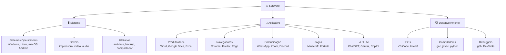
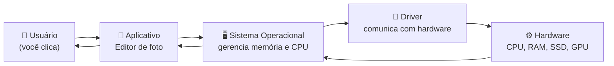
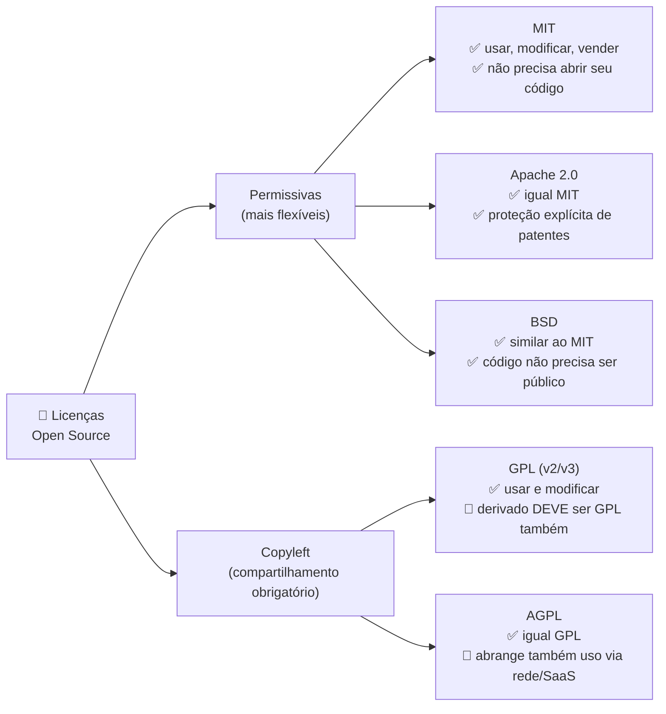
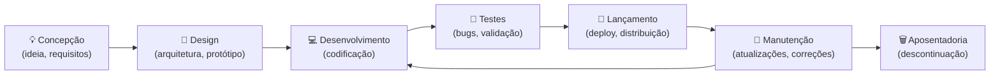

# Software

> [!quote] A Alma do Computador
> *Se o hardware é o corpo, o software é a alma que dá propósito e inteligência à máquina.*

---

## 🤔 O que é Software?

> [!info] Definição
> Software é o conjunto de instruções, programas e dados que dizem ao hardware o que fazer. É a parte lógica e intangível do computador.

| Aspecto | Software | Hardware |
|---------|----------|----------|
| **Natureza** | Lógico, intangível | Físico, tangível |
| **Modificação** | Pode ser atualizado facilmente | Requer troca física |
| **Exemplos** | Windows, Chrome, jogos | CPU, teclado, monitor |

> [!tip] Analogia do dia a dia
> Pense em um smartphone: o aparelho físico (tela, processador, bateria) é o [[Hardware]]. Já o WhatsApp, o sistema Android e o teclado virtual são software. Sem um, o outro não funciona sozinho.

---

## 📦 Tipos de Software

O software pode ser organizado em três grandes categorias, conforme o diagrama abaixo:

---

### 🖥️ Software de Sistema

> [!info] Base do Funcionamento
> Gerencia o hardware e fornece uma plataforma para outros softwares.

| Tipo | Exemplos | Função |
|------|----------|--------|
| **Sistemas Operacionais** | Windows, macOS, Linux | Gerenciar recursos do computador |
| **Drivers** | Driver de impressora, placa de vídeo | Comunicar hardware com SO |
| **Utilitários** | Antivírus, desfragmentador | Manutenção do sistema |

> [!note] Dado atual (2026)
> Em desktops e notebooks, o Windows lidera com aproximadamente **62% de market share** global (jun/2026), seguido por macOS (14,6%) e Linux desktop (3,1%). Já em todos os dispositivos (incluindo celulares e tablets), o **Android lidera com 44%** do total mundial, pois roda em bilhões de smartphones. Fonte: StatCounter, jun/2026.

---

### 📱 Software de Aplicativo

> [!tip] Ferramentas do Dia a Dia
> Programas que ajudam os usuários a realizar tarefas específicas.

| Categoria | Exemplos |
|-----------|----------|
| **Produtividade** | Word, Excel, Google Docs |
| **Navegadores** | Chrome, Firefox, Edge |
| **Edição de imagem** | Photoshop, GIMP, Canva |
| **Comunicação** | WhatsApp, Discord, Zoom |
| **Jogos** | Minecraft, Fortnite, Steam |
| **Inteligência Artificial** | ChatGPT, Google Gemini, Copilot |

> [!note] Aplicativos mais baixados no mundo em 2025
> O **ChatGPT** foi o aplicativo mais baixado globalmente em 2025, com 770 milhões de downloads, superando TikTok e Instagram pela primeira vez. O Google Gemini cresceu 383% em downloads no mesmo período. O **WhatsApp** atingiu 3 bilhões de usuários ativos, consolidando-se como o app de mensagens mais popular do planeta.

---

### 💻 Software de Desenvolvimento

> [!info] Ferramentas para Criar Software
> Programas usados por desenvolvedores para criar outros programas.

| Ferramenta | Função |
|------------|--------|
| **Compiladores** | Convertem código em programa executável |
| **IDEs** | Ambientes integrados para escrever código |
| **Debuggers** | Encontram e corrigem erros no código |
| **Editores de código** | VS Code, Sublime Text |

> [!tip] VS Code é o editor mais popular
> O Visual Studio Code (VS Code), da Microsoft, é gratuito, open source (licença MIT) e usado por mais de 70% dos desenvolvedores segundo a pesquisa Stack Overflow Developer Survey 2024. É um ótimo ponto de partida para quem quer aprender programação.

---

## ⚡ Como Software e Hardware Interagem

> [!example] Exemplo Prático
> Quando você edita uma foto:

| Etapa | Componente | Ação |
|-------|------------|------|
| 1 | **Software** (editor) | Recebe seus comandos |
| 2 | **CPU** | Processa as instruções |
| 3 | **RAM** | Mantém a imagem em memória |
| 4 | **Placa de vídeo** | Renderiza as alterações |
| 5 | **HD/SSD** | Salva o arquivo final |

O fluxo completo entre camadas pode ser representado assim:

> [!warning] Por que isso importa?
> Quando um programa "trava", pode ser falha no aplicativo, conflito de driver ou falta de memória RAM. Entender essas camadas ajuda a diagnosticar e resolver problemas do dia a dia.

---

## 🔓 Código Aberto vs. Proprietário

| Aspecto | Código Aberto | Proprietário |
|---------|---------------|--------------|
| **Código fonte** | Disponível publicamente | Fechado e protegido |
| **Custo** | Geralmente gratuito | Geralmente pago |
| **Modificação** | Permitida e incentivada | Proibida |
| **Exemplos** | Linux, Firefox, LibreOffice | Windows, Photoshop, Office |
| **Suporte** | Comunidade | Empresa desenvolvedora |

> [!tip] Vantagens de Cada Modelo

**Código Aberto:**
- Transparência e segurança auditável
- Comunidade ativa de desenvolvedores
- Personalização ilimitada

**Proprietário:**
- Suporte profissional garantido
- Interface geralmente mais polida
- Integração entre produtos

### 📜 Tipos de Licença de Software

Quando um software é distribuído, ele sempre vem com uma **licença**: um conjunto de regras que define o que você pode ou não fazer com ele. As licenças de código aberto mais comuns em 2025 são:

| Licença | Pode usar comercialmente? | Pode fechar o código? | Proteção de patentes? |
|---------|--------------------------|----------------------|----------------------|
| **MIT** | Sim | Sim | Não explícita |
| **Apache 2.0** | Sim | Sim | Sim |
| **BSD** | Sim | Sim | Não explícita |
| **GPL v3** | Sim | Não (derivado deve ser GPL) | Sim |
| **AGPL** | Sim | Não (inclui uso via rede) | Sim |

> [!note] Tendência 2025
> MIT e Apache 2.0 dominam o ecossistema open source em 2025, juntas representando mais de 60% dos projetos ativos no GitHub. A permissividade ganhou terreno sobre o copyleft por facilitar integração com produtos comerciais.

> [!example] 🧪 Atividade: Achar a licença de um software real
>
> **Objetivo:** descobrir sob qual licença um software open source famoso é distribuído.
>
> **Passos:**
> 1. Acesse [vlc.videolan.org](https://www.videolan.org/) e baixe o VLC (ou já tenha instalado).
> 2. Abra o VLC, vá em **Ajuda > Sobre o VLC** (ou menu "Sobre" no macOS/Linux).
> 3. Leia a seção de licença que aparece na tela.
> 4. Agora acesse o repositório oficial: [github.com/videolan/vlc](https://github.com/videolan/vlc) e localize o arquivo `COPYING` na raiz.
>
> **Resultado esperado:** você verá que o VLC usa a **GPL v2**. Isso significa que qualquer programa que incorpore código do VLC também precisa ser GPL. Compare com o VS Code, que usa MIT: por isso grandes empresas podem integrá-lo livremente.

---

## 🆚 Software Proprietário vs. Livre: Comparativo Real

| Categoria | Software Proprietário | Software Livre / Open Source |
|-----------|-----------------------|------------------------------|
| **Escritório** | Microsoft Office (pago) | LibreOffice (grátis, MPL 2.0) |
| **Edição de imagem** | Adobe Photoshop (assinatura) | GIMP (grátis, GPL) |
| **Edição de vídeo** | Adobe Premiere (assinatura) | Kdenlive / DaVinci Resolve Free (grátis) |
| **Navegador** | Safari (exclusivo Apple) | Firefox (grátis, MPL 2.0) |
| **Sistema Operacional** | Windows 11 (pago por licença OEM) | Ubuntu Linux (grátis, GPL) |
| **Banco de Dados** | Oracle Database (licença cara) | PostgreSQL (grátis, PostgreSQL License) |
| **Editor de Código** | Sublime Text (pago) | VS Code (grátis, MIT) |

> [!example] 🧪 Atividade: Classificar o software do seu computador
>
> **Objetivo:** identificar quais programas rodando no seu PC são de sistema e quais são de aplicativo, e descobrir se são proprietários ou livres.
>
> **Passos:**
> 1. No Windows: pressione **Ctrl + Shift + Esc** para abrir o Gerenciador de Tarefas. Vá na aba **Processos**.
>    No Linux: abra o **Monitor do Sistema** (ou rode `ps aux` no terminal).
>    No macOS: abra o **Monitor de Atividade** (Spotlight: "Activity Monitor").
> 2. Liste pelo menos **10 processos** que você vê rodando agora.
> 3. Para cada um, classifique na tabela abaixo:
>
> | Nome do Processo | Sistema ou Aplicativo? | Proprietário ou Open Source? |
> |------------------|----------------------|------------------------------|
> | (preencher) | | |
>
> **Dica:** processos com nomes como `svchost.exe`, `kernel`, `systemd`, `WindowsServer` costumam ser de sistema. `chrome.exe`, `discord.exe`, `spotify.exe` são aplicativos.
>
> **Resultado esperado:** ao menos 3 processos de sistema e 3 de aplicativo identificados corretamente, com justificativa de por que cada um se encaixa nessa categoria.

---

## 🚀 Introdução ao Desenvolvimento

> [!info] O que é Programação?
> Programação é a arte de escrever instruções que o computador pode entender e executar.

### Linguagens de Programação Populares

| Linguagem | Uso Principal |
|-----------|---------------|
| **Python** | IA, ciência de dados, automação |
| **JavaScript** | Web, aplicativos |
| **Java** | Aplicações empresariais, Android |
| **C/C++** | Sistemas, jogos, embarcados |
| **C#** | Jogos (Unity), aplicações Windows |

> [!tip] Quer saber mais?
> Veja a aula [[Linguagens de programação]] para entender como cada linguagem funciona, como são compiladas ou interpretadas, e qual escolher para cada tipo de projeto.

---

## 🔄 O Ciclo de Vida do Software

Todo software passa por fases desde a ideia até ser aposentado. Conhecer esse ciclo é fundamental para quem quer trabalhar na área:

> [!warning] Software nunca para de evoluir
> O Windows 11 lançado em 2021 já recebeu dezenas de atualizações cumulativas até 2026. O Linux tem commits (contribuições) de código todos os dias. Manutenção contínua é parte do trabalho de quem desenvolve software profissionalmente.

---

## 📝 Conclusão

> [!success] Pontos Principais

O software é essencial porque:
- Transforma hardware em ferramenta útil
- Permite realizar tarefas complexas de forma simples
- Está presente em praticamente todos os dispositivos modernos
- Evolui constantemente para atender novas necessidades

> [!summary] Mapa Mental Rápido
>
> **Software** pode ser:
> - **De Sistema:** SO (Windows, Linux, Android) + Drivers + Utilitários
> - **De Aplicativo:** Produtividade, Comunicação, Jogos, IA (ChatGPT, Gemini)
> - **De Desenvolvimento:** IDEs, Compiladores, Debuggers
>
> Quanto à licença, pode ser:
> - **Proprietário:** código fechado, uso restrito (Windows, Photoshop)
> - **Open Source Permissivo:** MIT, Apache 2.0 (VS Code, VLC)
> - **Open Source Copyleft:** GPL, AGPL (Linux, GIMP)
>
> Para aprofundar: [[Sistemas Operacionais]] e [[Linguagens de programação]].

---

> [!note] 📚 Fontes (2026)
> - [StatCounter: Market Share de Sistemas Operacionais, jun/2026](https://gs.statcounter.com/os-market-share)
> - [Accio: Operating System Market Share 2026: Android 44%, Windows 27%](https://www.accio.com/business/operating_system_market_share_trend)
> - [Procurri: Global OS Market Share 2025](https://www.procurri.com/knowledge-hub/global-os-market-share-2025-key-stats-trends-and-insights-for-mobile-and-desktop/)
> - [Diolinux: Licenças MIT e Apache 2.0 dominaram o open source em 2025](https://diolinux.com.br/noticias/licencas-mit-apache-2-0-open-source.html)
> - [Código Sintético: Licenças de software, como escolher entre MIT, Apache, GPL](https://codigosintetico.com.br/posts/licencas-de-software-como-escolher)
> - [MobileTime: Os 20 apps mais baixados no mundo em 2025](https://www.mobiletime.com.br/noticias/08/01/2026/apps-mais-baixados-25/)
> - [Snyk: Open Source Licenses, Types and Comparison](https://snyk.io/articles/open-source-licenses/)
