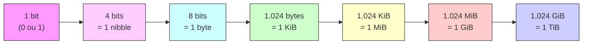
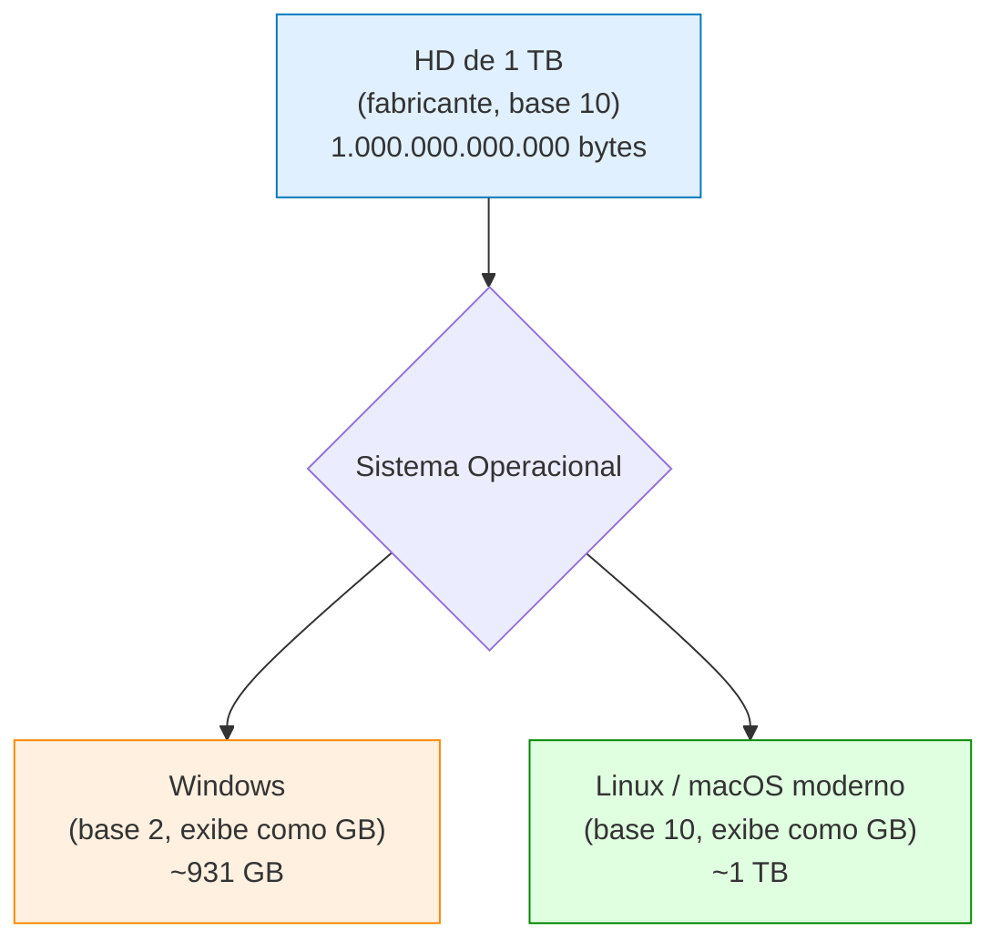
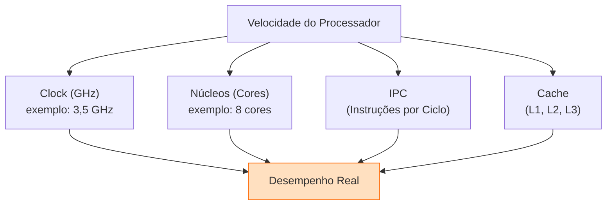

# Unidades de Medida

> [!quote] Quantificando a Informação
> *Entender as unidades de medida é essencial para compreender capacidade de armazenamento, velocidade de internet e desempenho do computador.*

---

## 🤔 Por que Estudar Unidades de Medida?

> [!info] Importância
> As unidades de medida ajudam a quantificar armazenamento, velocidade de transmissão e poder de processamento dos computadores.

Você já se perguntou por que seu pendrive de "32 GB" parece ter menos espaço do que esperava? Ou por que sua internet de "200 Mbps" não baixa arquivos a 200 MB/s? Tudo isso tem a ver com unidades de medida. Saber interpretá-las corretamente evita confusão na hora de comprar um HD, contratar um plano de internet ou entender a especificação de um processador.

---

## 💾 Bit e Byte

> [!info] A Base de Tudo

| Unidade | Descrição | Valor |
|---------|-----------|-------|
| **Bit** | Menor unidade de informação | 0 ou 1 |
| **Byte** | Conjunto de 8 bits | Representa um caractere |

> [!example] Exemplo
> A letra "A" em binário: `01000001` (8 bits = 1 byte)

### Como o bit surgiu?

O nome **bit** vem do inglês *binary digit* (dígito binário). Um bit é o estado mais simples possível em eletrônica: ligado (1) ou desligado (0). Tudo que um computador processa, armazena ou transmite é uma sequência gigantesca de zeros e uns.

O **byte** foi padronizado como 8 bits nos anos 1960. Por que 8? Porque 8 bits permitem representar 256 combinações diferentes (2⁸ = 256), o que é suficiente para cobrir todos os caracteres do alfabeto latino, algarismos e símbolos básicos. Essa codificação ficou conhecida como **ASCII** (American Standard Code for Information Interchange).

> [!tip] 💡 Curiosidade
> Antes do padrão de 8 bits, alguns computadores usavam bytes de 6 ou 7 bits. A padronização em 8 bits foi essencial para a compatibilidade entre máquinas diferentes.

### De bits para bytes: a escada de representação

> [!note] Nibble
> O **nibble** (4 bits) é menos famoso, mas aparece bastante em endereçamento hexadecimal. Um dígito hexadecimal representa exatamente 1 nibble.

---

## 📦 Unidades de Armazenamento

### Progressão (Base 10, Comercial)

> [!info] Usado por Fabricantes
> Fabricantes de HD/SSD usam base 10 (multiplicação por 1000).

| Unidade | Abreviação | Valor | Potência |
|---------|------------|-------|---------|
| **Kilobyte** | KB | 1.000 bytes | 10³ |
| **Megabyte** | MB | 1.000.000 bytes | 10⁶ |
| **Gigabyte** | GB | 1.000.000.000 bytes | 10⁹ |
| **Terabyte** | TB | 1.000.000.000.000 bytes | 10¹² |
| **Petabyte** | PB | 1.000.000.000.000.000 bytes | 10¹⁵ |
| **Exabyte** | EB | 1.000.000.000.000.000.000 bytes | 10¹⁸ |
| **Zettabyte** | ZB | 1.000.000.000.000.000.000.000 bytes | 10²¹ |

> [!tip] 🌍 Escala mundial
> Em 2025, a humanidade gerou cerca de 120 Zettabytes de dados. Para ter ideia, 1 ZB equivale a 1 bilhão de TBs.

---

### Progressão (Base 2, Técnica)

> [!tip] Usado em Memória RAM e Sistemas Operacionais
> O sistema binário usa base 2 (multiplicação por 1024). O padrão foi formalizado pela IEC em 1998 (norma IEC 80000-13).

| Unidade | Abreviação | Valor | Potência |
|---------|------------|-------|---------|
| **Kibibyte** | KiB | 1.024 bytes | 2¹⁰ |
| **Mebibyte** | MiB | 1.048.576 bytes | 2²⁰ |
| **Gibibyte** | GiB | 1.073.741.824 bytes | 2³⁰ |
| **Tebibyte** | TiB | 1.099.511.627.776 bytes | 2⁴⁰ |
| **Pebibyte** | PiB | 1.125.899.906.842.624 bytes | 2⁵⁰ |

> [!warning] Por que a Diferença?
> Um HD de "500 GB" (base 10) aparece como ~465 GiB (base 2) no sistema operacional. Você não perdeu espaço! O fabricante mediu corretamente em base 10; o sistema operacional exibiu em base 2, mas ainda usou a sigla "GB" por convenção. Por isso a IEC criou o KiB, MiB e GiB: para deixar claro qual base está sendo usada.

---

### KB vs KiB: a tabela do conflito histórico

| Sigla | Nome | Base | Valor exato | Quem usa |
|-------|------|------|-------------|---------|
| **KB** | Kilobyte | 10 | 1.000 bytes | Fabricantes de HD/SSD, planos de internet |
| **KiB** | Kibibyte | 2 | 1.024 bytes | Sistemas operacionais, programadores, norma IEC |
| **MB** | Megabyte | 10 | 1.000.000 bytes | Fabricantes, provedores |
| **MiB** | Mebibyte | 2 | 1.048.576 bytes | Linux, Windows internamente, kernels |
| **GB** | Gigabyte | 10 | 1.000.000.000 bytes | Embalagens de HD, pendrive, SD card |
| **GiB** | Gibibyte | 2 | 1.073.741.824 bytes | Windows (exibe como "GB" mas calcula em GiB) |

> [!warning] ⚠️ Atenção: Windows vs Linux
> O **Windows** historicamente exibia o espaço do disco em GiB mas chamava de "GB", causando confusão. O **Linux** e o **macOS** modernos passaram a usar GB (base 10) igual ao fabricante, tornando os números compatíveis. Ao comprar um HD de 1 TB, o Windows pode exibir ~931 GB por calcular em GiB, enquanto o macOS exibirá ~1 TB.

---

## 🚀 Unidades de Velocidade de Dados

> [!info] Internet e Transferências
> Velocidade de internet é medida em **bits por segundo** (não bytes!).

| Unidade | Abreviação | Valor |
|---------|------------|-------|
| **Kilobit/s** | Kbps | 1.000 bits/segundo |
| **Megabit/s** | Mbps | 1.000.000 bits/segundo |
| **Gigabit/s** | Gbps | 1.000.000.000 bits/segundo |

> [!tip] Conversão Importante
> Para converter Mbps para MB/s, divida por 8.
> - Internet de **100 Mbps** = **12,5 MB/s** de download máximo

### Por que a internet usa bits e não bytes?

A velocidade de rede foi padronizada em bits por segundo ainda nos primeiros sistemas de telecomunicações (como o modem de 56 kbps). A tradição se manteve. Operadoras de internet anunciam em Mbps por serem números maiores, o que faz o plano parecer mais rápido. Um plano de 100 **Mbps** soa melhor do que 12,5 **MB/s**, embora seja exatamente a mesma coisa.

### Tabela de conversão Mbps para MB/s

| Plano de internet | Velocidade (Mbps) | Download teórico (MB/s) | Tempo para baixar 1 GB |
|------------------|-------------------|------------------------|------------------------|
| DSL básico | 10 Mbps | 1,25 MB/s | ~13 min |
| Banda larga comum | 50 Mbps | 6,25 MB/s | ~2,7 min |
| Fibra entrada | 100 Mbps | 12,5 MB/s | ~1,3 min |
| Fibra padrão | 200 Mbps | 25 MB/s | ~40 seg |
| Fibra avançada | 500 Mbps | 62,5 MB/s | ~16 seg |
| Fibra 1 Giga | 1.000 Mbps | 125 MB/s | ~8 seg |

> [!warning] Velocidade anunciada vs. real
> A velocidade anunciada é sempre o máximo teórico. Na prática, fatores como distância do roteador, qualidade do cabo, número de usuários na rede e congestionamento do provedor reduzem esse valor. Uma conexão de 100 Mbps raramente entrega 12,5 MB/s de forma consistente.

---

## ⚡ Unidades de Processamento

> [!info] Velocidade do Processador (CPU)
> Medida em Hertz (Hz), ou ciclos por segundo.

| Unidade | Abreviação | Valor |
|---------|------------|-------|
| **Hertz** | Hz | 1 ciclo/segundo |
| **Kilohertz** | KHz | 1.000 ciclos/segundo |
| **Megahertz** | MHz | 1.000.000 ciclos/segundo |
| **Gigahertz** | GHz | 1.000.000.000 ciclos/segundo |

> [!example] Exemplo Prático
> Um processador de **3,5 GHz** executa 3,5 bilhões de ciclos por segundo!

### Frequência não é tudo

> [!info] Velocidade real de um processador
> O clock (frequência) mede quantas vezes o processador pode executar uma operação por segundo. Mas a velocidade real depende também do número de núcleos (cores), arquitetura do chip e quantidade de instruções por ciclo (IPC). Um processador moderno de 3 GHz pode ser muito mais rápido do que um antigo de 4 GHz por ter melhor IPC e mais núcleos.

### Evolução histórica das CPUs

| Época | Processador | Clock |
|-------|-------------|-------|
| 1971 | Intel 4004 | 740 KHz |
| 1981 | Intel 8088 (PC IBM original) | 4,77 MHz |
| 1993 | Intel Pentium | 60 MHz |
| 2000 | Intel Pentium 4 | 1,5 GHz |
| 2010 | Intel Core i7-980 | 3,33 GHz |
| 2025 | Intel Core Ultra 9 285K | 5,7 GHz (boost) |

---

## 🔄 Conversões Úteis

### Armazenamento (base 10, comercial)

| De | Para | Fórmula | Exemplo |
|----|------|---------|---------|
| GB para MB | Multiplicar | × 1.000 | 2 GB = 2.000 MB |
| MB para KB | Multiplicar | × 1.000 | 5 MB = 5.000 KB |
| KB para bytes | Multiplicar | × 1.000 | 3 KB = 3.000 bytes |
| bytes para KB | Dividir | ÷ 1.000 | 50.000 bytes = 50 KB |
| TB para GB | Multiplicar | × 1.000 | 4 TB = 4.000 GB |

### Armazenamento (base 2, técnico)

| De | Para | Fórmula | Exemplo |
|----|------|---------|---------|
| GiB para MiB | Multiplicar | × 1.024 | 2 GiB = 2.048 MiB |
| MiB para KiB | Multiplicar | × 1.024 | 5 MiB = 5.120 KiB |
| KiB para bytes | Multiplicar | × 1.024 | 3 KiB = 3.072 bytes |

### Velocidade de Internet

| Velocidade | Download Teórico |
|------------|------------------|
| 10 Mbps | 1,25 MB/s |
| 50 Mbps | 6,25 MB/s |
| 100 Mbps | 12,5 MB/s |
| 500 Mbps | 62,5 MB/s |
| 1 Gbps | 125 MB/s |

---

## 📊 Referências Práticas

> [!tip] Para Ter uma Ideia

| Item | Tamanho Aproximado | Observação |
|------|-------------------|------------|
| Uma página de texto | ~2 KB | Sem formatação |
| Uma foto (JPEG smartphone) | ~3 a 25 MB | Depende do megapixel; fotos de 108 MP chegam a 25 MB |
| Uma foto (JPEG comprimida) | ~2 a 5 MB | Qualidade padrão |
| Uma música (MP3) | ~3 a 5 MB | Qualidade 128 kbps a 320 kbps |
| Uma música (FLAC, sem perda) | ~20 a 50 MB | Qualidade lossless |
| Um filme (Full HD, 1080p) | ~4 a 8 GB | Codec H.264 |
| Um vídeo 4K (1 minuto) | ~400 a 600 MB | A 60 fps |
| Um jogo mobile (ex: PUBG Mobile) | ~15 a 20 GB | Após atualizações |
| Um jogo de console/PC | ~50 a 100 GB | Títulos AAA modernos |
| Sistema operacional Windows 11 | ~27 GB | Instalação básica |
| Toda a Wikipedia em inglês (texto) | ~22 GB | Sem imagens |

---

## 🧮 Quanto Cabe? Cálculos do Dia a Dia

> [!example] Quantas fotos cabem num cartão de 64 GB?
> - Foto média de smartphone atual: **~8 MB** (qualidade padrão)
> - Capacidade do cartão: 64 GB = 64.000 MB (base 10)
> - Cálculo: 64.000 ÷ 8 = **8.000 fotos**
>
> Porém, o sistema operacional exibe o cartão como ~59,6 GiB (base 2), equivalente a 61.035 MiB. O número real fica em torno de **7.630 fotos** por essa divergência.

> [!example] Quanto tempo para baixar um jogo de 50 GB com 100 Mbps?
> - Velocidade de 100 Mbps = 12,5 MB/s (÷ 8)
> - Tamanho: 50 GB = 50.000 MB
> - Tempo: 50.000 ÷ 12,5 = 4.000 segundos = **~67 minutos**
>
> Na prática, com rede oscilando, pode levar de 80 a 100 minutos.

---

## 🧪 Atividades Mão na Massa

> [!example] 🧪 Atividade 1: Descubra o tamanho real de um arquivo em bits
>
> **O que fazer:**
> 1. Escolha qualquer arquivo do seu computador (uma foto, um documento, uma música).
> 2. Clique com o botão direito no arquivo e acesse **Propriedades** (Windows) ou **Obter informações** (macOS).
> 3. Anote o tamanho exato em bytes que o sistema exibe (ex: "3.245.678 bytes").
> 4. Converta para KB (÷ 1.000), para MB (÷ 1.000.000) e para bits (× 8).
> 5. Compare o tamanho em bytes exato com o valor arredondado que aparece em KB/MB.
>
> **Resultado observável:** Você verá a diferença entre o tamanho "em bytes" (preciso) e o tamanho "em MB" (arredondado), e vai perceber que o Windows pode exibir MB usando cálculo em base 2. Use a **Calculadora** do seu sistema para fazer as contas.
>
> **Exemplo:** um arquivo de 3.245.678 bytes = 3.245,678 KB = 3,245 MB = 25.965.424 bits.

---

> [!example] 🧪 Atividade 2: Quantas fotos cabem no seu pendrive?
>
> **O que fazer:**
> 1. Conecte um pendrive ou verifique o cartão de memória do celular.
> 2. Anote a capacidade total declarada (ex: "32 GB").
> 3. Escolha uma pasta de fotos do celular. Clique em 3 fotos quaisquer, veja o tamanho de cada uma em Propriedades e calcule a **média** dos três tamanhos.
> 4. Divida a capacidade do pendrive (em MB) pelo tamanho médio de uma foto (em MB).
> 5. Compare seu resultado com o número que aparece nas especificações do fabricante do cartão (se disponível).
>
> **Resultado observável:** Você verá que a capacidade real disponível é ligeiramente menor do que os "32 GB" da embalagem (por conta da diferença base 10 vs base 2 e do espaço do sistema de arquivos). Você vai calcular quantas fotos cabem e perceber como essa divergência afeta o resultado.
>
> **Ferramenta:** qualquer calculadora. Dados de entrada: capacidade em MB, tamanho médio de foto em MB.

---

> [!example] 🧪 Atividade 3: Meça sua internet e converta Mbps para MB/s
>
> **O que fazer:**
> 1. Acesse **[fast.com](https://fast.com)** ou **[speedtest.net](https://www.speedtest.net)** em qualquer dispositivo conectado à rede.
> 2. Aguarde o teste concluir. Anote o valor de **download em Mbps** e o de **upload em Mbps**.
> 3. Divida ambos por 8 para obter o valor em **MB/s**.
> 4. Use a tabela da seção "Velocidade de Internet" para estimar quanto tempo levaria para baixar: um filme de 4 GB, um jogo de 50 GB e um álbum de música de 100 MB.
> 5. Compare o resultado teórico com a experiência real que você tem ao baixar arquivos no dia a dia.
>
> **Resultado observável:** A velocidade teórica calculada raramente coincide com a velocidade real de download de um arquivo grande. Você vai identificar a diferença e conseguirá explicar por que isso acontece (overhead de protocolo, oscilações de rede, limitação do servidor de destino).

---

## 📏 Comparativo: por que bits para rede e bytes para armazenamento?

> [!info] A origem da divisão
> A divisão histórica entre "bits para velocidade de rede" e "bytes para armazenamento" tem raízes nos anos 1960:
>
> - **Armazenamento** sempre foi medido pelo hardware em bytes (grupos de 8 bits processados juntos pelos chips de memória).
> - **Telecomunicações** transmitiam 1 bit por vez por um fio (linha serial), então a medida natural era bits por segundo.
>
> Essa herança persiste até hoje: fabricantes de HD vendem em GB (bytes), provedores de internet anunciam em Mbps (bits). O consumidor precisa saber converter para não se confundir.

| Contexto | Unidade padrão | Exemplo real |
|----------|---------------|--------------|
| Capacidade de HD/SSD | GB (bytes) | "HD de 2 TB" |
| Capacidade de RAM | GiB (bytes, base 2) | "8 GiB de RAM" |
| Velocidade de internet | Mbps (bits) | "Plano de 200 Mbps" |
| Velocidade de transferência USB | MB/s (bytes) | "USB 3.0: até 625 MB/s" |
| Velocidade de leitura SSD | MB/s (bytes) | "SSD: 3.500 MB/s leitura" |
| Frequência de CPU | GHz | "Processador 3,5 GHz" |

---

## 📝 Conclusão

> [!success] Pontos Principais

- **Bit** é a menor unidade (0 ou 1); **byte** = 8 bits.
- **Armazenamento comercial**: KB, MB, GB, TB, PB (base 10, fabricantes).
- **Armazenamento técnico**: KiB, MiB, GiB, TiB (base 2, norma IEC, sistemas operacionais).
- **Velocidade de internet**: Kbps, Mbps, Gbps (bits, não bytes!). Para converter para MB/s, divida por 8.
- **Processamento**: Hz, MHz, GHz (ciclos por segundo). Clock alto não é o único fator de desempenho.
- A diferença entre GB (base 10) e GiB (base 2) explica por que um HD "500 GB" aparece como ~465 GB no Windows.
- Saber converter unidades é habilidade prática: ajuda a escolher planos de internet, comparar HDs e entender especificações técnicas.

---

> [!note] 📚 Fontes (2026)
> - [Bit ou byte? Diferenças entre as unidades de medida de dados (Tecnoblog)](https://tecnoblog.net/responde/bit-ou-byte/)
> - [Bits, bytes e unidades de medida (TreinaWeb)](https://www.treinaweb.com.br/blog/bits-bytes-e-unidades-de-medida)
> - [Unidades de medidas na computação: bit, byte, KB, MB, GB... (Wagner Gaspar)](https://wagnergaspar.com/unidades-de-medidas-na-computacao-bit-byte-kb-mb-gb-tb-pb-eb-zb-yb/)
> - [What the Hell is a Kibibyte? (LogicMonitor)](https://www.logicmonitor.com/blog/what-the-hell-is-a-kibibyte)
> - [Binary prefix, norma IEC 80000-13 (Wikipedia)](https://en.wikipedia.org/wiki/Binary_prefix)
> - [Planos de Internet: Guia 2026 (Age Fibra)](https://www.agefibra.com.br/blog/como-escolher-melhor-plano-internet-residencial)
> - [Celular de 128 GB é bom? (TechTudo, 2025)](https://www.techtudo.com.br/guia/2025/10/celular-de-128-gb-e-bom-veja-se-espaco-e-suficiente-em-2025-edmobile.ghtml)
> - [Diferenças entre Giga, Mega, Kbps e Mbps (Minha Conexão)](https://www.minhaconexao.com.br/planos/internet-banda-larga/giga-mega-kbps-mbps)
> - [Conversão de dados digitais: bytes, KB, MB, GB, TB (ConversorMedidas)](https://conversormedidas.com.br/blog/conversao-dados-digitais-bytes-kilobytes-gigabytes)
