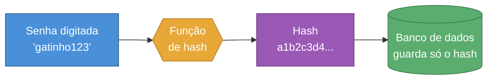
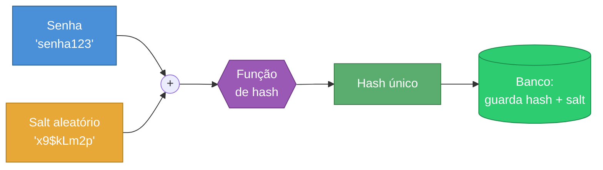
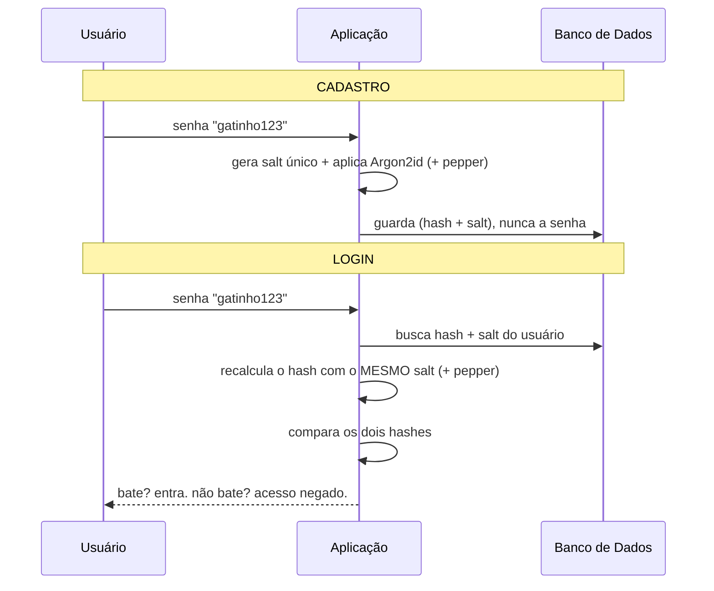

# Armazenamento de Senhas

> [!quote] A regra de ouro do desenvolvedor
> *Você nunca deve ser capaz de descobrir a senha de um usuário, nem mesmo olhando direto no seu banco de dados. Se você consegue ler a senha, um invasor também consegue.*

Esta aula é sobre **segurança no código**: como um(a) programador(a) deve guardar as senhas dos usuários de um sistema. O ângulo aqui não é "como eu escolho uma boa senha" (isso vem no fim), e sim **"como eu, desenvolvedor, protejo as senhas que os usuários me confiam"**.

---

## 🚫 Por que NUNCA salvar senha em texto puro

Imagine um sistema que guarda no banco de dados, literalmente:

| usuário | senha |
|---------|-------|
| ana@email.com | `gatinho123` |
| bruno@email.com | `senha123` |

Isso se chama **texto puro** (ou *plaintext*). É o pior erro de segurança que existe nesse tema.

> [!danger] O efeito dominó de um vazamento em texto puro
> - Bancos de dados **vazam** o tempo todo (SQL injection, backup exposto, funcionário mal-intencionado).
> - Se as senhas estão em texto puro, no instante do vazamento o invasor tem **todas** elas prontas para usar.
> - Pior: as pessoas **reutilizam senhas**. A senha do seu sisteminha pode ser a mesma do e-mail e do banco da pessoa. Você vazou muito mais do que imaginava.

> [!info] Analogia do cofre
> Guardar senha em texto puro é como anotar a senha do cofre num post-it colado na porta do cofre. O cofre (banco de dados) até pode ser difícil de arrombar, mas se alguém entrar, está tudo escrito ali.

A solução não é "esconder melhor" a senha. A solução é **nunca guardar a senha**, e sim guardar uma **prova matemática** dela. É aí que entra o hashing.

---

## 🔗 O que é Hashing

Uma **função de hash** é uma função matemática que transforma qualquer texto numa sequência de tamanho fixo (o *hash* ou *digest*), de forma **só de ida**: é fácil ir do texto para o hash, e inviável voltar do hash para o texto.

![[Recursos/Programação/Armazenamento de senhas/hash-function.png|Pequenas mudanças na entrada geram um digest completamente diferente (efeito avalanche)]]

Repare na imagem: trocar uma única letra (`over` -> `ouer`) gera um digest **completamente** diferente. Isso é o **efeito avalanche**.

> [!info] Propriedades de uma boa função de hash
> - **Determinística:** a mesma entrada gera sempre o mesmo hash. (É isso que permite conferir a senha depois.)
> - **Mão única:** dado o hash, não dá para calcular a entrada de volta.
> - **Efeito avalanche:** mudar 1 caractere muda o hash inteiro.
> - **Resistente a colisão:** é inviável achar duas entradas com o mesmo hash.

> [!success] A ideia central
> No cadastro, eu guardo o **hash** da senha, não a senha. No login, eu calculo o hash do que a pessoa digitou e **comparo os dois hashes**. Se baterem, a senha está certa, e eu nunca precisei guardar a senha original.



---

## ⚠️ Por que hash simples (MD5/SHA-256 sozinho) NÃO basta

Beleza, então é só usar SHA-256 e pronto? **Não.** Hashes "clássicos" como MD5 e SHA-256 foram projetados para serem **rápidos**, e velocidade é exatamente o que você **não** quer ao guardar senha.

> [!warning] Três problemas de usar SHA-256 (ou MD5) puro em senha
> 1. **É rápido demais.** Uma GPU moderna calcula **bilhões** de hashes SHA-256 por segundo. O atacante testa um dicionário inteiro de senhas em minutos.
> 2. **Mesma senha, mesmo hash.** Como a função é determinística, dois usuários com a senha `senha123` terão **o mesmo hash** no banco. O atacante vê isso de relance.
> 3. **Rainbow tables.** Existem tabelas gigantes pré-calculadas (`hash -> senha`) para senhas comuns. Se o seu hash está nessa tabela, a senha é descoberta por **consulta**, sem nem precisar calcular.

> [!info] Analogia da fechadura barata
> SHA-256 puro em senha é como uma fechadura que abre em 1 segundo com qualquer chave testada. O ladrão tem um molho com bilhões de chaves e testa todas num piscar de olhos. Você quer uma fechadura **propositalmente lenta** de testar.

A correção vem em duas camadas: primeiro o **salt** (resolve os problemas 2 e 3), depois **algoritmos lentos e modernos** (resolve o problema 1).

---

## 🧂 Salt: um tempero único por senha

Um **salt** é um valor aleatório, **único para cada usuário**, que você gera no cadastro e **mistura na senha antes de aplicar o hash**.



> [!success] O que o salt resolve
> - **Mesma senha, hashes diferentes:** Ana e Bruno usam `senha123`, mas cada um tem um salt diferente, então os hashes no banco ficam **diferentes**. O atacante não enxerga senhas repetidas.
> - **Mata as rainbow tables:** a tabela pré-calculada não serve, porque o salt muda a entrada. O atacante teria que gerar uma rainbow table **nova para cada usuário**, o que é inviável.

> [!info] O salt é segredo?
> **Não.** O salt fica guardado junto com o hash no banco, ele não precisa ser secreto. A função dele não é esconder, é **diferenciar**: garantir que cada senha seja "temperada" de um jeito único. (Quem precisa ser secreto é o *pepper*, mais adiante.)

> [!tip] Boa notícia para o desenvolvedor
> Os algoritmos modernos (bcrypt, Argon2, scrypt) **geram e gerenciam o salt automaticamente** e ainda o embutem dentro do hash final. Na prática, você quase nunca cria salt na mão, basta usar a biblioteca certa.

---

## 🔐 Algoritmos modernos: bcrypt, scrypt e Argon2

Estes algoritmos foram feitos **especificamente para senha**. Eles são **lentos de propósito** (e ajustáveis), e já cuidam do salt para você.

| Algoritmo | Ano | Recurso de custo | Status em 2026 |
|-----------|-----|------------------|----------------|
| **Argon2id** | 2015 | Tempo **+ memória** + paralelismo | ✅ Recomendação nº 1 da OWASP |
| **scrypt** | 2009 | Tempo **+ memória** | ✅ Bom (se não houver Argon2) |
| **bcrypt** | 1999 | Tempo (work factor) | ✅ Aceitável (sistemas legados) |
| **PBKDF2** | 2000 | Tempo (iterações) | 🟡 Só quando exigem FIPS-140 |
| **SHA-256 / MD5 puros** | - | nenhum | ❌ NUNCA para senha |

> [!info] Por que "custo de memória" importa (Argon2 e scrypt)
> bcrypt só é lento em CPU. Já Argon2 e scrypt também consomem **muita memória RAM** para calcular cada hash. Isso é genial: GPUs e chips especializados (ASICs) de ataque têm muito poder de cálculo, mas **pouca memória por núcleo**. Exigir memória "trava" justamente o hardware que o atacante usa para quebrar senhas em massa.

> [!tip] Parâmetros recomendados pela OWASP (2026)
> - **Argon2id:** memória `m = 19 MiB` (19456 KiB), iterações `t = 2`, paralelismo `p = 1` (mínimo). Pode subir a memória se o servidor aguentar.
> - **scrypt:** `N = 2^17`, `r = 8`, `p = 1`.
> - **bcrypt:** *work factor* (custo) `>= 10`. Atenção: bcrypt **ignora tudo depois de 72 bytes** da senha.
> - **PBKDF2-HMAC-SHA256:** `>= 600.000` iterações.

> [!warning] Cuidado com o limite de 72 bytes do bcrypt
> O bcrypt corta a senha em 72 bytes. Senhas muito longas (ou frases-senha) podem ter o final ignorado, o que enfraquece a proteção. É um dos motivos de o Argon2id ser preferido em projetos novos.

A regra prática para 2026: **projeto novo usa Argon2id.** Se não der, scrypt. bcrypt segue ok em sistemas que já existem.

---

## 🌶️ Pepper: um segredo a mais, fora do banco

O **pepper** é mais uma camada, por cima do salt. É um valor secreto **único do sistema inteiro** (não muda por usuário) que você mistura na senha, mas que **NÃO** fica guardado no banco de dados.

> [!info] Salt vs Pepper (a diferença que cai em prova)
> | | Salt | Pepper |
> |---|------|--------|
> | É secreto? | Não | **Sim** |
> | Onde fica? | No banco, junto do hash | **Fora do banco** (variável de ambiente, cofre de segredos) |
> | Único por... | usuário | sistema inteiro |
> | Protege contra | hashes repetidos, rainbow tables | vazamento **só** do banco de dados |

> [!success] A jogada do pepper
> Se só o **banco de dados** vazar (o caso mais comum), o atacante tem os hashes e os salts, mas **não tem o pepper** (ele está no servidor de aplicação, não no banco). Sem o pepper, os hashes ficam praticamente inquebráveis. É **defesa em profundidade**: você não confia que uma única barreira nunca vai cair.

> [!warning] Pepper é opcional e exige cuidado
> O pepper é um extra, não substitui salt nem algoritmo lento. E precisa de um plano operacional: se você perder o pepper, **ninguém** consegue mais logar. Por isso a OWASP trata pepper como "adote só com um plano claro de gestão do segredo".

---

## 🧬 Juntando tudo: cadastro vs login

Os dois fluxos completos de um sistema que faz tudo certo:



> [!info] O detalhe que fecha o raciocínio
> No login, o sistema **recalcula** o hash usando o mesmo salt guardado e compara. Em nenhum momento a senha original foi armazenada, e mesmo assim dá para conferir se está certa. Esse é o coração do armazenamento seguro de senhas.

---

## 🗝️ Onde guardar as credenciais DA APLICAÇÃO

Cuidado para não confundir dois problemas diferentes:

> [!info] Dois tipos de "senha" no desenvolvimento
> - **Senha do usuário** (tudo acima): você guarda o **hash**, nunca o valor. Você não precisa recuperar.
> - **Credencial da aplicação** (senha do banco de dados, chave de API, token): o programa **precisa** do valor original para se conectar. Aqui não dá para usar hash, então a regra é **não deixar no código** e nunca commitar no Git.

A pior prática (e a mais comum em iniciantes) é o **hardcode**:

```python
# ERRADO: credencial escrita direto no código, vai parar no Git
senha_banco = "MinhaSenhaSuperSecreta123"
```

A forma correta é manter segredos **fora do código**, em **variáveis de ambiente**, geralmente carregadas de um arquivo `.env` que **nunca** entra no repositório:

```bash
# arquivo .env  (este arquivo entra no .gitignore!)
DB_PASSWORD=MinhaSenhaSuperSecreta123
API_KEY=sk-abc123xyz
```

```python
# CORRETO: lê do ambiente, nada secreto no código
import os
from dotenv import load_dotenv   # pip install python-dotenv

load_dotenv()
senha_banco = os.environ.get("DB_PASSWORD")
api_key = os.environ.get("API_KEY")
```

> [!danger] A regra de ouro do .gitignore
> Sempre adicione `.env` ao arquivo `.gitignore`. Segredo commitado no Git **fica no histórico para sempre**, mesmo que você apague depois. Já houve vazamentos enormes de chaves de AWS por causa disso.

> [!tip] Escala de soluções para credenciais de app
> | Método | Quando usar |
> |--------|-------------|
> | Variável de ambiente + `.env` | Projetos pequenos, desenvolvimento |
> | **Secrets** do GitHub Actions / CI | Pipelines de deploy automático |
> | Cofres: AWS Secrets Manager, HashiCorp **Vault** | Produção séria, rotação de segredos |
> | Biblioteca `keyring` | Apps desktop (usa o cofre do sistema operacional) |

---

## 👤 Gerenciadores de senha (para o usuário final)

Tudo acima é o seu papel **como desenvolvedor**. Mas você também é **usuário** de centenas de sistemas. Para esse lado, a ferramenta certa é um **gerenciador de senhas**.

> [!info] O que um gerenciador de senhas faz
> Ele guarda todas as suas senhas num cofre criptografado, protegido por **uma única senha-mestra**. Assim você pode ter uma senha **longa, aleatória e diferente** em cada site, sem precisar decorar nenhuma.

| Ferramenta | Tipo | Destaque |
|-----------|------|----------|
| **Bitwarden** | Nuvem (open source) | Gratuito, sincroniza entre dispositivos |
| **KeePass / KeePassXC** | Local (open source) | Cofre é um arquivo seu, controle total |
| **1Password** | Nuvem (pago) | Muito usado em empresas |

> [!tip] Por que isso conversa com a aula
> Os gerenciadores existem justamente porque **reutilizar senha é perigoso** (lembra do efeito dominó do começo?). Eles são o complemento do lado do usuário para o trabalho que você, desenvolvedor, faz do lado do servidor. As duas pontas precisam estar seguras.

---

## 🧪 Atividades Mão na Massa

> [!example] 🧪 Atividade 1: O problema do hash determinístico (SHA-256)
>
> **Ferramenta:** [Google Colab](https://colab.research.google.com) (novo notebook, nada para instalar).
>
> **O que fazer:** Cole e rode o código. A biblioteca `hashlib` já vem no Python.
>
> ```python
> import hashlib
>
> def sha256(texto):
>     return hashlib.sha256(texto.encode()).hexdigest()
>
> print("Ana   :", sha256("senha123"))
> print("Bruno :", sha256("senha123"))
> print("Carla :", sha256("Senha123"))  # só o S maiúsculo
> ```
>
> **Resultado observável:**
> - Os hashes de Ana e Bruno são **idênticos** (mesma senha = mesmo hash). Esse é o problema!
> - O hash de Carla é **totalmente diferente** dos outros, mesmo mudando só 1 letra (efeito avalanche).
>
> **Anote:** Por que dois usuários com hashes iguais no banco é um problema de segurança?

---

> [!example] 🧪 Atividade 2: bcrypt resolve com salt automático
>
> **Ferramenta:** [Google Colab](https://colab.research.google.com).
>
> **O que fazer:** Rode a célula abaixo. A primeira linha instala a biblioteca.
>
> ```python
> !pip install bcrypt
> import bcrypt
>
> senha = "senha123".encode()
>
> # Gera dois hashes da MESMA senha
> hash1 = bcrypt.hashpw(senha, bcrypt.gensalt())
> hash2 = bcrypt.hashpw(senha, bcrypt.gensalt())
>
> print("Hash 1:", hash1)
> print("Hash 2:", hash2)
> print("Hashes iguais?", hash1 == hash2)
>
> # Conferindo a senha no "login"
> print("Login com senha certa :", bcrypt.checkpw("senha123".encode(), hash1))
> print("Login com senha errada:", bcrypt.checkpw("errada".encode(), hash1))
> ```
>
> **Resultado observável:**
> - `hash1` e `hash2` são **diferentes**, mesmo sendo a mesma senha! (O bcrypt gerou um salt aleatório para cada um.)
> - `Hashes iguais? False`
> - O `checkpw` retorna `True` para a senha certa e `False` para a errada, sem nunca guardar a senha.
>
> **Anote:** Compare com a Atividade 1. O que o salt do bcrypt mudou em relação ao SHA-256 puro?

---

> [!example] 🧪 Atividade 3: Argon2id, a recomendação de 2026
>
> **Ferramenta:** [Google Colab](https://colab.research.google.com).
>
> **O que fazer:** Use a biblioteca oficial do vencedor da Password Hashing Competition.
>
> ```python
> !pip install argon2-cffi
> from argon2 import PasswordHasher
>
> ph = PasswordHasher()  # já usa parâmetros seguros por padrão
>
> hash_senha = ph.hash("senha123")
> print("Hash Argon2id:", hash_senha)
>
> # Verificação no login (lança exceção se a senha estiver errada)
> print("Senha certa :", ph.verify(hash_senha, "senha123"))
> try:
>     ph.verify(hash_senha, "errada")
> except Exception as e:
>     print("Senha errada:", type(e).__name__)
> ```
>
> **Resultado observável:**
> - O hash começa com `$argon2id$` e **embute os parâmetros e o salt** dentro dele.
> - `verify` retorna `True` para a senha certa e **lança `VerifyMismatchError`** para a errada.
>
> **Anote:** Procure no hash gerado os valores `m=`, `t=` e `p=`. O que cada um significa (memória, tempo, paralelismo)?

---

> [!example] 🧪 Atividade 4: Sua senha já vazou? (Have I Been Pwned)
>
> **Ferramenta:** [haveibeenpwned.com/Passwords](https://haveibeenpwned.com/Passwords) (site real, seguro).
>
> **O que fazer:**
> 1. Acesse o site e digite uma senha **fraca e famosa** (ex.: `senha123` ou `123456`). Veja quantas vezes ela apareceu em vazamentos.
> 2. (Opcional, com cuidado) Teste o **padrão** de uma senha sua para ter noção. O site usa **k-anonimato**: ele só envia os 5 primeiros caracteres do hash, sua senha nunca trafega inteira.
>
> **Resultado observável:** Senhas comuns aparecem **milhões** de vezes ("Oh no, pwned!"). É exatamente por isso que rainbow tables funcionam contra hash sem salt.
>
> **Anote:** Quantas vezes `123456` apareceu? Isso te convence a usar um gerenciador de senhas?

---

> [!example] 🧪 Atividade 5: Carregando segredo de um .env
>
> **Ferramenta:** [Replit](https://replit.com/languages/python3) ou Google Colab.
>
> **O que fazer:** Simule a forma correta de carregar uma credencial de aplicação sem hardcode.
>
> ```python
> !pip install python-dotenv
>
> # Cria um arquivo .env de exemplo (no projeto real, ele NÃO vai pro Git)
> with open(".env", "w") as f:
>     f.write("DB_PASSWORD=MinhaSenhaSecreta\n")
>     f.write("API_KEY=sk-teste-123\n")
>
> import os
> from dotenv import load_dotenv
> load_dotenv()
>
> print("Senha do banco:", os.environ.get("DB_PASSWORD"))
> print("Chave de API  :", os.environ.get("API_KEY"))
> ```
>
> **Resultado observável:** O programa imprime os valores **lidos do arquivo `.env`**, sem que eles apareçam no código-fonte.
>
> **Anote:** Por que `.env` deve estar no `.gitignore`? O que aconteceria se você commitasse esse arquivo num repositório público?

---

## 🧠 Quiz Conceitual

> [!question] Teste seu entendimento (responda antes de abrir o gabarito)
> 1. Por que guardar senha em texto puro é perigoso, mesmo num banco de dados "seguro"?
> 2. Por que SHA-256 puro é uma má escolha para senhas, sendo um hash forte?
> 3. Qual a diferença entre **salt** e **pepper** quanto a *ser secreto* e *onde é guardado*?
> 4. Qual algoritmo a OWASP recomenda em 1º lugar em 2026, e por que a "memória" dele atrapalha o atacante?
> 5. Por que um hash **não** serve para guardar a senha do banco de dados que a sua aplicação usa?

> [!success]- Gabarito (clique para abrir)
> 1. Bancos vazam, e em texto puro o atacante recebe as senhas prontas, ainda por cima reutilizadas em outros serviços (efeito dominó).
> 2. Porque é **rápido demais**: GPUs testam bilhões por segundo, e sem salt sofre com hashes repetidos e rainbow tables.
> 3. **Salt:** não é secreto, fica no banco junto do hash, único por usuário. **Pepper:** é secreto, fica **fora** do banco (variável de ambiente/cofre), único do sistema.
> 4. **Argon2id.** O custo de **memória** trava GPUs e ASICs, que têm muito poder de cálculo mas pouca RAM por núcleo.
> 5. Porque hash é **mão única**: a aplicação **precisa** do valor original da senha do banco para se conectar. Credencial de app vai em variável de ambiente/cofre, nunca como hash e nunca no código.

---

> [!note] 📚 Fontes (2026)
> - [OWASP Password Storage Cheat Sheet](https://cheatsheetseries.owasp.org/cheatsheets/Password_Storage_Cheat_Sheet.html)
> - [Password Hashing in 2026: bcrypt, Argon2, scrypt, PBKDF2 (Decision Framework)](https://guptadeepak.com/bcrypt-vs-argon2-vs-scrypt-vs-pbkdf2-password-hashing-decision-framework-2026/)
> - [bcrypt vs Argon2 vs scrypt vs PBKDF2: A 2026 Decision Framework (Security Boulevard)](https://securityboulevard.com/2026/06/bcrypt-vs-argon2-vs-scrypt-vs-pbkdf2-a-2026-decision-framework/)
> - [Argon2: The Best Password Hashing Algorithm in 2026 (PeakLab)](https://peaklab.fr/en/glossaire/argon2)
> - [What is a password pepper? (NordPass)](https://nordpass.com/blog/pepper-password/)
> - [Have I Been Pwned: Pwned Passwords](https://haveibeenpwned.com/Passwords)
> - [Troy Hunt: Understanding HIBP's Use of SHA-1 and k-Anonymity](https://www.troyhunt.com/understanding-have-i-been-pwneds-use-of-sha-1-and-k-anonymity/)
> - [Salt (cryptography), Wikipedia](https://en.wikipedia.org/wiki/Salt_(cryptography))
> - [argon2-cffi: Argon2 for Python (documentação)](https://argon2-cffi.readthedocs.io/)
> - [python-dotenv: gestão de variáveis de ambiente](https://pypi.org/project/python-dotenv/)
