# Banco de Códigos e Bibliotecas

> [!quote] Reutilização de Código
> *Bibliotecas permitem usar código pronto, testado e mantido pela comunidade, acelerando o desenvolvimento.*

---

## 📦 O que são Bibliotecas?

> [!info] Definição
> Bibliotecas são conjuntos de funções e módulos prontos para uso que estendem as capacidades do Python.

> [!warning] Cuidado
> Algumas bibliotecas são **oficiais** (mantidas pelo Python), mas outras são da comunidade. Sempre verifique a procedência e popularidade antes de usar.

---

## 🔧 Instalação de Bibliotecas

### Usando o pip

```bash
pip install nome-do-pacote
```

**Exemplo:**

```bash
pip install numpy
```

> [!tip] Onde executar?
> Na linha de comando (Terminal, CMD do Windows, ou terminal integrado do VS Code).

---

## 📚 Bibliotecas Populares

| Biblioteca | Função | Instalação |
|------------|--------|------------|
| **NumPy** | Computação numérica | `pip install numpy` |
| **Pandas** | Análise de dados | `pip install pandas` |
| **Requests** | Requisições HTTP | `pip install requests` |
| **BeautifulSoup** | Web scraping (HTML/XML) | `pip install beautifulsoup4` |
| **Matplotlib** | Gráficos e visualização | `pip install matplotlib` |

---

## 🔍 Bibliotecas em Destaque

### urllib (Manipulação de URL)

> [!info] Biblioteca Padrão
> Módulo para manipulação de URLs. Usa a função `urlopen` para buscar URLs usando diversos protocolos.

### re (Expressões Regulares)

> [!info] Biblioteca Padrão
> Regular expression operations - para busca e manipulação de padrões em texto.

### BeautifulSoup (Web Scraping)

> [!info] Biblioteca Externa
> Extração de dados de arquivos HTML e XML. Ideal para web scraping.

---

## 💬 Comentários em Python

```python
# Adicione um '#' na frente de cada linha que desejar comentar
```

---

## 🗺️ Ecossistema de Bibliotecas por Área

O diagrama abaixo mostra como as principais bibliotecas Python se organizam por área de aplicação:

```mermaid
flowchart TD
    Python["🐍 Python"]

    Python --> WEB["🌐 Web & HTTP"]
    Python --> DADOS["📊 Dados & Análise"]
    Python --> VIZ["📈 Visualização"]
    Python --> AUTO["🤖 Automação & Scraping"]
    Python --> IA["🧠 IA & Machine Learning"]
    Python --> UTIL["🛠️ Utilitários Gerais"]

    WEB --> requests["requests\n(HTTP simples)"]
    WEB --> httpx["httpx\n(HTTP async / HTTP2)"]
    WEB --> fastapi["fastapi\n(APIs REST rápidas)"]

    DADOS --> numpy["numpy\n(arrays numéricos)"]
    DADOS --> pandas["pandas\n(tabelas / DataFrames)"]
    DADOS --> polars["polars\n(alternativa ultra-rápida)"]

    VIZ --> matplotlib["matplotlib\n(gráficos clássicos)"]
    VIZ --> seaborn["seaborn\n(estatística visual)"]
    VIZ --> plotly["plotly\n(gráficos interativos)"]

    AUTO --> bs4["beautifulsoup4\n(HTML/XML)"]
    AUTO --> scrapy["scrapy\n(crawlers escaláveis)"]
    AUTO --> playwright["playwright\n(browser real)"]

    IA --> sklearn["scikit-learn\n(ML clássico)"]
    IA --> pydantic["pydantic\n(validação de dados)"]
    IA --> pydanticai["pydantic-ai\n(agentes de IA)"]

    UTIL --> pathlib["pathlib\n(arquivos/diretórios)"]
    UTIL --> re["re\n(expressões regulares)"]
    UTIL --> datetime["datetime\n(datas e horas)"]
```



> [!tip] Como ler o diagrama
> Cada ramo representa uma área de uso. Dentro de cada área há bibliotecas que resolvem problemas específicos. Uma mesma biblioteca pode aparecer em mais de uma área (por exemplo, `pydantic` é usada tanto em APIs quanto em IA).

---

## 🧩 Tabela Expandida de Bibliotecas (2025-2026)

Esta tabela reúne bibliotecas amplamente usadas, organizadas por área, com informações de instalação e a versão recente conhecida.

| Área | Biblioteca | Para que serve | Instalação |
|------|------------|----------------|-----------|
| HTTP / Web | **requests** | Fazer requisições HTTP de forma simples | `pip install requests` |
| HTTP / Web | **httpx** | HTTP assíncrono e suporte a HTTP/2 | `pip install httpx` |
| HTTP / Web | **fastapi** | Criar APIs REST modernas e rápidas | `pip install fastapi` |
| Dados | **numpy** | Operações matemáticas com arrays | `pip install numpy` |
| Dados | **pandas** | Manipular tabelas (DataFrames) | `pip install pandas` |
| Dados | **polars** | Alternativa ao pandas, muito mais rápida | `pip install polars` |
| Visualização | **matplotlib** | Gráficos estáticos clássicos | `pip install matplotlib` |
| Visualização | **seaborn** | Gráficos estatísticos sobre matplotlib | `pip install seaborn` |
| Visualização | **plotly** | Gráficos interativos no navegador | `pip install plotly` |
| Scraping | **beautifulsoup4** | Parsear HTML e XML | `pip install beautifulsoup4` |
| Scraping | **scrapy** | Crawlers escaláveis (v2.14, jan/2026) | `pip install scrapy` |
| Scraping | **playwright** | Controlar navegador real (Chrome/Firefox) | `pip install playwright` |
| IA / ML | **scikit-learn** | Algoritmos de machine learning clássico | `pip install scikit-learn` |
| IA / ML | **pydantic** | Validação de dados com tipos Python | `pip install pydantic` |
| IA / ML | **pydantic-ai** | Criação de agentes de IA (estável desde 2025) | `pip install pydantic-ai` |
| Padrão | **re** | Expressões regulares | nativa (sem pip) |
| Padrão | **pathlib** | Trabalhar com arquivos e pastas | nativa (sem pip) |
| Padrão | **datetime** | Datas, horas e fusos horários | nativa (sem pip) |
| Padrão | **urllib** | Abrir URLs com diversos protocolos | nativa (sem pip) |

> [!info] Bibliotecas "nativas"
> Bibliotecas da **Biblioteca Padrão** do Python já vêm instaladas: não precisam de `pip install`. Só importe com `import nome`.

---

## 🏗️ Como Escolher uma Biblioteca

Antes de instalar qualquer biblioteca, faça estas perguntas:

1. **Qual problema quero resolver?** (HTTP, dados, gráficos, IA...)
2. **A biblioteca está ativa?** Verifique a data do último release no PyPI ou GitHub.
3. **Quantas pessoas usam?** Downloads no PyPI e estrelas no GitHub são bons indicadores.
4. **A documentação é boa?** Uma lib com doc ruim consome muito tempo.

> [!tip] Atalho: PyPI Stats
> Acesse [pypistats.org/top](https://pypistats.org/top) para ver em tempo real as bibliotecas mais baixadas do PyPI. Útil para comparar duas opções antes de escolher.

---

## 🔗 Como Importar Bibliotecas no Código

Depois de instalar com `pip`, você precisa **importar** no script:

```python
import numpy              # importa tudo com prefixo: numpy.array(...)
import numpy as np        # atalho comum: np.array(...)
from math import sqrt     # importa só o que precisa: sqrt(16)
from datetime import date # importa só a classe date
```

> [!warning] Instalar não é suficiente
> Instalar com `pip` deixa a biblioteca disponível no sistema. Mas você ainda precisa escrever `import` no início do arquivo Python para usá-la no código.

---

## 🧪 Atividades Mão na Massa

> [!example] 🧪 Atividade 1: Instalar e usar uma biblioteca real no Google Colab
>
> **Objetivo:** instalar uma biblioteca do PyPI direto no Colab e ver ela funcionando.
>
> **Ferramenta:** [Google Colab](https://colab.research.google.com) (sem instalar nada no seu computador).
>
> **Passos:**
>
> 1. Abra o Colab e crie um novo notebook.
> 2. Na primeira célula, instale a biblioteca `rich` (formatação colorida no terminal):
>    ```python
>    !pip install rich
>    ```
> 3. Na célula seguinte, importe e use:
>    ```python
>    from rich import print
>    print("[bold green]Funcionou![/bold green] A biblioteca [yellow]rich[/yellow] está instalada.")
>    ```
> 4. Execute a célula (Shift+Enter).
>
> **Resultado observável:** o texto aparece colorido e formatado na saída da célula, provando que a biblioteca foi instalada e importada corretamente.
>
> **Variação:** troque `rich` por `httpx` e teste:
> ```python
> import httpx
> r = httpx.get("https://httpbin.org/get")
> print(r.status_code)  # deve imprimir 200
> ```

---

> [!example] 🧪 Atividade 2: Explorar a documentação do `requests` e usar uma função nova
>
> **Objetivo:** navegar pela documentação oficial de uma biblioteca e aplicar uma função que você não conhecia antes.
>
> **Ferramenta:** Navegador + Google Colab (ou VS Code).
>
> **Passos:**
>
> 1. Acesse a documentação oficial: [docs.python-requests.org](https://docs.python-requests.org)
> 2. Encontre a seção **"Quickstart"** e leia como funciona `requests.get()`.
> 3. No Colab, instale (se necessário) e execute:
>    ```python
>    !pip install requests
>    import requests
>
>    resposta = requests.get("https://httpbin.org/json")
>    dados = resposta.json()         # converte JSON para dicionário Python
>    print(type(dados))              # <class 'dict'>
>    print(dados)                    # mostra o conteúdo retornado
>    ```
> 4. Agora explore: na documentação, encontre como passar **parâmetros de URL** com `params=`. Teste com:
>    ```python
>    r = requests.get("https://httpbin.org/get", params={"nome": "Maria", "turma": "2TI"})
>    print(r.url)   # veja a URL montada automaticamente
>    ```
>
> **Resultado observável:** você vê a URL com os parâmetros já codificados (`?nome=Maria&turma=2TI`) e o JSON retornado pelo servidor de teste.
>
> **Desafio extra:** tente descobrir na documentação como enviar um **cabeçalho HTTP** (header) customizado e adicione `headers={"User-Agent": "MeuScript/1.0"}` na requisição.

---

> [!example] 🧪 Atividade 3: Encontrar um pacote no PyPI e avaliar se vale instalar
>
> **Objetivo:** praticar a busca no repositório oficial de pacotes Python e avaliar a qualidade/manutenção antes de instalar.
>
> **Ferramenta:** Navegador em [pypi.org](https://pypi.org) + [pypistats.org](https://pypistats.org).
>
> **Passos:**
>
> 1. Acesse [pypi.org](https://pypi.org) e pesquise por: `qrcode`.
> 2. Clique no pacote **qrcode** (primeiro resultado). Observe:
>    - Data do último release (está sendo mantido?)
>    - Número de versão atual
>    - Dependências listadas
>    - Link para o repositório GitHub
> 3. Acesse [pypistats.org/packages/qrcode](https://pypistats.org/packages/qrcode) e veja o gráfico de downloads mensais.
> 4. Instale e gere um QR Code real:
>    ```python
>    !pip install qrcode[pil]
>    import qrcode
>    img = qrcode.make("https://iff.edu.br")
>    img.save("meu_qrcode.png")
>    print("Arquivo meu_qrcode.png gerado!")
>    ```
> 5. No Colab, exiba a imagem:
>    ```python
>    from IPython.display import Image
>    Image("meu_qrcode.png")
>    ```
>
> **Resultado observável:** um QR Code real é gerado e exibido no notebook. Aponte o celular e veja que leva ao site do IFF.
>
> **Pergunta para reflexão:** o pacote foi atualizado nos últimos 12 meses? Os downloads mensais são maiores que 10 mil? Se sim, é um pacote saudável para usar em projetos.

---

## 📂 Banco de Código Reutilizável

Abaixo, trechos prontos para copiar e adaptar nos seus projetos.

### Baixar uma página da web

```python
import requests

url = "https://example.com"
resposta = requests.get(url)

if resposta.status_code == 200:
    print("Página baixada com sucesso!")
    print(resposta.text[:200])  # mostra os primeiros 200 caracteres
else:
    print(f"Erro: código {resposta.status_code}")
```

### Ler e manipular uma tabela com pandas

```python
import pandas as pd

# Cria um DataFrame diretamente
dados = {
    "Nome": ["Ana", "Bruno", "Carla"],
    "Nota": [8.5, 7.0, 9.2]
}
df = pd.DataFrame(dados)

print(df)
print(f"\nMédia da turma: {df['Nota'].mean():.2f}")
print(f"Aluno com maior nota: {df.loc[df['Nota'].idxmax(), 'Nome']}")
```

### Gerar um gráfico com matplotlib

```python
import matplotlib.pyplot as plt

nomes = ["Ana", "Bruno", "Carla"]
notas = [8.5, 7.0, 9.2]

plt.bar(nomes, notas, color="steelblue")
plt.title("Notas da Turma")
plt.ylabel("Nota")
plt.ylim(0, 10)
plt.savefig("notas.png")
plt.show()
```

### Usar expressão regular para validar e-mail

```python
import re

def valida_email(email):
    padrao = r"^[\w\.-]+@[\w\.-]+\.\w{2,}$"
    return bool(re.match(padrao, email))

print(valida_email("aluno@iff.edu.br"))  # True
print(valida_email("email-invalido"))    # False
```

---

## 🌟 Novidades do Ecossistema Python (2025-2026)

O ecossistema Python evolui rapidamente. Algumas bibliotecas que ganharam destaque recentemente:

| Biblioteca | Novidade | Por que importa |
|------------|----------|-----------------|
| **scrapy** | v2.14 (jan/2026): APIs baseadas em corrotinas | Scraping mais eficiente e moderno |
| **pydantic-ai** | API estável (2025), 16 mil estrelas no GitHub | Criação de agentes de IA com Python puro |
| **polars** | Alternativa ao pandas muito mais rápida | Ideal para conjuntos grandes de dados |
| **httpx** | HTTP/2 e requisições assíncronas nativas | Substituto moderno do requests em projetos avançados |
| **beautifoulsoup4** | v4.14.3 (2025): mantida ativamente | Continua sendo a opção mais acessível para scraping |

> [!warning] Atenção ao usar libs de IA
> Bibliotecas como `pydantic-ai` evoluem rápido. Sempre fixe a versão no seu projeto com `pip install pydantic-ai==X.Y.Z` para evitar quebras futuras.

---

> [!note] 📚 Fontes (2026)
>
> - [The 48 Best Open-Source Python Libraries (Anaconda, 2026)](https://www.anaconda.com/guides/open-source-python-libraries)
> - [Top Python Libraries of 2025 (Tryolabs)](https://tryolabs.com/blog/top-python-libraries-2025)
> - [Most Popular Python Frameworks and Libraries in 2025 (JetBrains/PyCharm Blog)](https://blog.jetbrains.com/pycharm/2025/09/the-most-popular-python-frameworks-and-libraries-in-2025-2/)
> - [12 Python Libraries You Need to Try in 2026 (KDnuggets)](https://www.kdnuggets.com/12-python-libraries-you-need-to-try-in-2026)
> - [Top PyPI Packages: monthly dump (Hugo van Kemenade)](https://hugovk.dev/top-pypi-packages/)
> - [Most Downloaded PyPI Packages (pypistats.org)](https://pypistats.org/top)
> - [Best Python Web Scraping Libraries in 2026 (ProxyRack)](https://www.proxyrack.com/blog/best-python-web-scraping-libraries-in-2026/)
> - [5 Game-Changing Python Libraries Released in 2026 (Medium / The Pythonworld)](https://medium.com/the-pythonworld/5-game-changing-python-libraries-released-in-2026-that-you-should-already-be-using-426aa69e1dc8)
