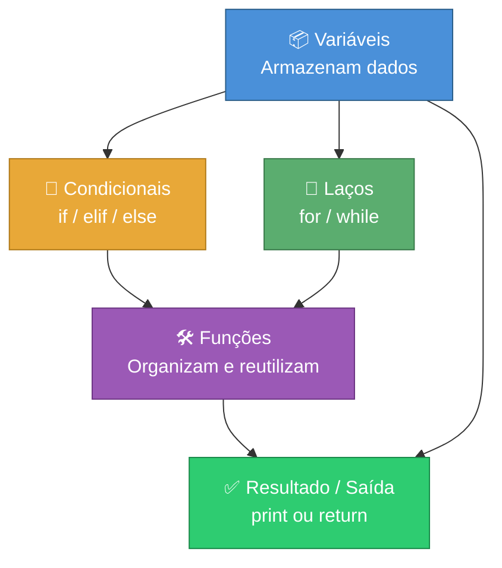

# Conceitos Gerais de Programação

> [!quote] Base para Todo Programador
> *Compreender os fundamentos é essencial antes de mergulhar em qualquer linguagem de programação.*

---

## 🗣️ Linguagens Naturais vs Linguagens de Programação

![[Recursos/Programação/Conceitos gerais de programação/linguagem-natural-vs-programacao.png|Linguagem Natural vs Programação]]

> [!info] Comparativo

| Aspecto | Linguagem Natural | Linguagem de Programação |
|---------|-------------------|--------------------------|
| **Usuário** | Humanos | Máquinas |
| **Exemplo** | Português, Inglês | Python, Java |
| **Característica** | Ambígua, flexível | Precisa, formal |
| **Função** | Comunicação | Instruções para computador |

---

## ⚙️ Compilação vs Interpretação

> [!info] Duas Formas de Tradução
> Existem duas formas diferentes de **transformar um programa de uma linguagem de alto nível em linguagem de máquina**.

---

### 🔨 Compilação

![[Recursos/Programação/Conceitos gerais de programação/compilador-processo.png|Processo de Compilação]]

> [!tip] Características

| Aspecto | Descrição |
|---------|-----------|
| **Processo** | Código fonte traduzido uma vez |
| **Resultado** | Gera executável específico para plataforma |
| **Responsável** | Compilador ou tradutor |
| **Exemplos** | C, C++, Go, Rust |

---

### 🔄 Interpretação

> [!tip] Características

| Aspecto | Descrição |
|---------|-----------|
| **Processo** | Código fonte usado a cada execução |
| **Resultado** | Não gera executável separado |
| **Responsável** | Interpretador |
| **Exemplos** | Python, JavaScript, Ruby |

> [!success] Python
> O Python é uma linguagem **interpretada**. Linguagens interpretadas também são chamadas de **linguagens de scripting** e os códigos são geralmente chamados de **scripts**.

---

### 📊 Comparativo

![[Recursos/Programação/Conceitos gerais de programação/compilador-vs-interpretador-tabela.png|Vantagens e Desvantagens]]

> [!warning] Qual é melhor?
> Não existe melhor. Se existisse, o outro deixaria de ser utilizado. É uma questão de **objetivo do projeto**. Ambos têm vantagens e desvantagens.

📺 [Linguagem Compilada vs Interpretada | Qual é melhor?](https://www.youtube.com/watch?v=SNyh-cubxaU)

---

## 🧪 Exemplo Prático: Compilação vs Interpretação

### Linguagem Compilada (C)

**1. Criar arquivo C** (`hello.c`):

```c
#include <stdio.h>

int main() {
    printf("Hello, World!\n");
    return 0;
}
```

**2. Compilar:**

```bash
gcc hello.c -o hello
```

**3. Executar:**

```bash
./hello
```

---

### Linguagem Interpretada (Python)

**1. Criar arquivo Python** (`hello.py`):

```python
print("Olá, mundo!")
```

**2. Executar:**

```bash
python hello.py
```

> [!tip] Criando arquivo no Windows (PowerShell)
> 1. Abrir o PowerShell
> 2. Escolher uma pasta
> 3. `type nul > arquivo.py`
> 4. `notepad arquivo.py`
> 5. `python3 arquivo.py`
> 6. `Measure-Command {python3 arquivo.py}` (mede tempo de execução)

---

## 📖 Termos Importantes

> [!info] Biblioteca
> É um conjunto de subprogramas e funções que podem ser reutilizados em programas.

> [!info] API (Application Programming Interface)
> "Interface de Programação de Aplicativos" - parecido com biblioteca, mas focada na **integração entre sistemas**. Permite utilizar funcionalidades de outros sistemas no seu programa, chamando funções remotas.

---

## 📦 Variáveis e Tipos de Dados 🆕

Uma **variável** é um espaço na memória do computador reservado para guardar um valor. Pense nela como uma caixa com um nome escrito na etiqueta: você guarda algo dentro, pode olhar o que está lá, e pode trocar o conteúdo quando quiser.

```python
nome = "Ana"       # string: texto
idade = 17         # int: número inteiro
altura = 1.65      # float: número decimal
aprovado = True    # bool: verdadeiro ou falso
```

> [!tip] Regras para nomear variáveis
> - Use nomes descritivos: `preco_produto` é melhor que `x`
> - Sem espaços: use `_` no lugar (estilo snake_case em Python)
> - Não comece com número: `2turma` é inválido; `turma2` é válido
> - Sem acentos em nomes de variáveis (boa prática universal)

### Tipos de Dados Básicos em Python

| Tipo | Nome técnico | Exemplo | Uso comum |
|------|-------------|---------|-----------|
| Inteiro | `int` | `42` | Contadores, idades, quantidades |
| Decimal | `float` | `3.14` | Preços, medidas, porcentagens |
| Texto | `str` | `"Olá"` | Nomes, mensagens, código postal |
| Lógico | `bool` | `True` / `False` | Ligar/desligar, sim/não |

> [!info] Tipagem dinâmica no Python
> Em Python, você **não precisa declarar o tipo** da variável. O interpretador descobre sozinho pelo valor atribuído. Isso é chamado de **tipagem dinâmica** e é uma das razões pelas quais Python é tão popular para iniciantes.

---

## 🔀 Estruturas Condicionais ✅

Condicionais permitem que o programa **tome decisões** com base em condições. É o mecanismo que dá ao código a capacidade de se comportar de maneiras diferentes dependendo dos dados.

```python
nota = 7.5

if nota >= 7:
    print("Aprovado!")
elif nota >= 5:
    print("Recuperação")
else:
    print("Reprovado")
```

> [!warning] Atenção à indentação
> Em Python, o recuo (indentação) não é estético: ele é obrigatório e define quais linhas pertencem ao bloco `if`, `elif` ou `else`. Use **4 espaços** (ou 1 Tab). Uma indentação errada causa erro de execução.

### Operadores de Comparação

| Operador | Significado | Exemplo | Resultado |
|----------|-------------|---------|-----------|
| `==` | igual a | `5 == 5` | `True` |
| `!=` | diferente de | `3 != 4` | `True` |
| `>` | maior que | `7 > 3` | `True` |
| `<` | menor que | `2 < 1` | `False` |
| `>=` | maior ou igual | `5 >= 5` | `True` |
| `<=` | menor ou igual | `4 <= 3` | `False` |

### Operadores Lógicos

| Operador | Significado | Exemplo | Resultado |
|----------|-------------|---------|-----------|
| `and` | E (ambos verdadeiros) | `True and False` | `False` |
| `or` | OU (pelo menos um) | `True or False` | `True` |
| `not` | NÃO (inverte) | `not True` | `False` |

---

## 🔁 Laços de Repetição (Loops) ♻️

Laços permitem **repetir um bloco de código** várias vezes sem reescrever as mesmas linhas. São essenciais para processar listas, contar, acumular resultados e automatizar tarefas repetitivas.

### Laço `for`: quando sabemos quantas vezes repetir

```python
for i in range(5):
    print(f"Iteração número {i}")
```

Saída:
```
Iteração número 0
Iteração número 1
Iteração número 2
Iteração número 3
Iteração número 4
```

### Laço `while`: enquanto uma condição for verdadeira

```python
contador = 0
while contador < 3:
    print(f"Contador: {contador}")
    contador += 1
```

> [!danger] Cuidado com loops infinitos
> Se a condição do `while` nunca se tornar falsa, o programa trava. Sempre garanta que o valor testado muda a cada iteração. Pressione `Ctrl+C` para interromper um programa travado no terminal.

### Comparativo `for` vs `while`

| Critério | `for` | `while` |
|----------|-------|---------|
| Quando usar | Quantidade de repetições conhecida | Condição de parada variável |
| Risco de loop infinito | Baixo | Alto se mal programado |
| Percorrer lista | Natural (`for item in lista`) | Possível, mas mais verboso |
| Exemplo de uso | Processar 10 alunos | Ler até o usuário digitar "sair" |

---

## 🛠️ Funções ⚙️

Uma **função** é um bloco de código com nome próprio que realiza uma tarefa específica. Você a escreve uma vez e pode chamá-la quantas vezes quiser, de qualquer ponto do programa.

```python
def calcular_media(nota1, nota2, nota3):
    soma = nota1 + nota2 + nota3
    media = soma / 3
    return media

resultado = calcular_media(8.0, 7.5, 9.0)
print(f"Média: {resultado:.1f}")
```

> [!info] Anatomia de uma função Python
> - `def`: palavra-chave que inicia a definição
> - `calcular_media`: nome da função (descritivo, snake_case)
> - `nota1, nota2, nota3`: parâmetros (entradas)
> - `return`: valor que a função devolve ao chamador

### Por que usar funções?

| Benefício | Explicação |
|-----------|-----------|
| **Reutilização** | Escreva uma vez, use em vários lugares |
| **Legibilidade** | Código com funções bem nomeadas lê como um texto |
| **Manutenção** | Corrija em um lugar, o efeito se propaga |
| **Testabilidade** | Funções isoladas são mais fáceis de testar |

> [!tip] Boas práticas ao criar funções
> - Cada função deve fazer **uma única coisa** (princípio da responsabilidade única)
> - O nome deve descrever o que ela faz: prefira verbos (`calcular_media`, `exibir_resultado`)
> - Funções curtas (até ~20 linhas) são mais fáceis de entender e manter

---

## 🗺️ Mapa Conceitual: Do Dado ao Resultado

O diagrama abaixo mostra como os quatro blocos fundamentais se conectam num programa real:



> [!info] Lendo o diagrama
> Variáveis são a base: alimentam condicionais e laços. Condicionais e laços organizam o fluxo. Funções encapsulam esse fluxo para reuso. O resultado final é sempre uma saída: texto, cálculo ou ação.

---

## 🔗 Juntando Tudo: Exemplo Completo

O programa abaixo usa variáveis, condicional, laço e função em conjunto:

```python
def classificar_nota(nota):
    if nota >= 7:
        return "Aprovado"
    elif nota >= 5:
        return "Recuperação"
    else:
        return "Reprovado"

notas = [8.5, 4.0, 6.0, 9.5, 3.0]

for i, nota in enumerate(notas, start=1):
    situacao = classificar_nota(nota)
    print(f"Aluno {i}: nota {nota:.1f} -> {situacao}")
```

Saída esperada:
```
Aluno 1: nota 8.5 -> Aprovado
Aluno 2: nota 4.0 -> Reprovado
Aluno 3: nota 6.0 -> Recuperação
Aluno 4: nota 9.5 -> Aprovado
Aluno 5: nota 3.0 -> Reprovado
```

> [!success] O que este código demonstra
> - **Variável** `notas`: lista com os dados de entrada
> - **Função** `classificar_nota`: lógica encapsulada e reutilizável
> - **Condicional** `if/elif/else`: tomada de decisão dentro da função
> - **Laço** `for`: percorre cada nota sem repetir código

---

## 🧠 Atividades Mão na Massa

> [!example] 🧪 Atividade 1: Raio-X de um Programa no Python Tutor
>
> **Ferramenta:** [pythontutor.com](https://pythontutor.com/visualize.html)
>
> **O que fazer:**
> 1. Acesse [pythontutor.com](https://pythontutor.com/visualize.html) e cole o código abaixo no editor.
> 2. Clique em **"Visualize Execution"**.
> 3. Clique em **"Next"** passo a passo e observe o painel direito.
>
> ```python
> def dobrar(x):
>     resultado = x * 2
>     return resultado
>
> numeros = [3, 7, 10]
> saida = []
>
> for n in numeros:
>     saida.append(dobrar(n))
>
> print(saida)
> ```
>
> **Resultado observável (o que anotar):**
> - Qual o valor de `resultado` quando `n = 7`?
> - Em que momento a lista `saida` recebe seu segundo elemento?
> - O que acontece com a variável `x` após o `return`?
>
> **Entregável:** Print da tela do Python Tutor no passo em que `n = 10` está em execução, com a pilha de chamadas (call stack) visível.

---

> [!example] 🧪 Atividade 2: Função com Laço e Condicional no Replit
>
> **Ferramenta:** [replit.com/languages/python3](https://replit.com/languages/python3)
>
> **O que fazer:**
> 1. Acesse o Replit e crie um novo projeto Python (sem instalar nada).
> 2. Implemente a função `contar_aprovados` exatamente como especificado abaixo.
> 3. Teste com as duas chamadas fornecidas e confirme que as saídas batem.
>
> ```python
> def contar_aprovados(lista_notas):
>     aprovados = 0
>     for nota in lista_notas:
>         if nota >= 7:
>             aprovados += 1
>     return aprovados
>
> # Teste 1
> turma_a = [8.0, 5.5, 9.0, 3.0, 7.0]
> print(contar_aprovados(turma_a))   # deve imprimir: 3
>
> # Teste 2
> turma_b = [4.0, 4.5, 3.5]
> print(contar_aprovados(turma_b))   # deve imprimir: 0
> ```
>
> **Resultado observável:** Os dois `print` produzem exatamente `3` e `0`. Se algum valor for diferente, há um bug na lógica da condicional ou do contador.
>
> **Desafio extra:** Modifique a função para retornar também a **porcentagem** de aprovados (ex.: `3 de 5 = 60.0%`).

---

> [!example] 🧪 Atividade 3: Caça ao Bug
>
> **Ferramenta:** [pythontutor.com](https://pythontutor.com/visualize.html) ou [replit.com](https://replit.com/languages/python3)
>
> **O que fazer:**
> O código abaixo tem **dois bugs**. Execute-o, leia a mensagem de erro e corrija cada problema.
>
> ```python
> def somar_pares(lista):
>     total = 0
>     for numero in lista
>         if numero % 2 = 0:
>             total += numero
>     return total
>
> print(somar_pares([1, 2, 3, 4, 5, 6]))
> ```
>
> **Pistas:**
> - Bug 1: erro de **sintaxe** na linha do `for` (algo está faltando).
> - Bug 2: erro de **operador** na linha do `if` (confusão entre atribuição e comparação).
>
> **Resultado observável após a correção:** O programa imprime `12` (soma de 2 + 4 + 6).
>
> **Entregável:** Mostre o código corrigido e explique em uma frase por que cada operador/símbolo estava errado.

---

## 📖 Termos Complementares

> [!info] Escopo de Variável
> O **escopo** define onde uma variável pode ser acessada. Uma variável criada dentro de uma função (escopo local) não existe fora dela. Uma variável criada fora de qualquer função (escopo global) pode ser lida em todo o arquivo, mas modificá-la dentro de uma função exige cuidado.

```python
mensagem = "Olá do escopo global"

def exibir():
    mensagem_local = "Olá do escopo local"
    print(mensagem)        # OK: acessa variável global
    print(mensagem_local)  # OK: variável local existe aqui

exibir()
# print(mensagem_local)  # ERRO: variável local não existe aqui
```

> [!info] Parâmetro vs Argumento
> **Parâmetro** é o nome definido na assinatura da função (`def soma(a, b)`). **Argumento** é o valor passado na chamada (`soma(3, 5)`). A confusão entre os dois termos é comum, mas a distinção importa ao ler documentação técnica.

> [!info] Algoritmo
> Antes de escrever qualquer código, existe o **algoritmo**: uma sequência finita e ordenada de passos para resolver um problema. Todo programa é a implementação de um algoritmo numa linguagem específica. Você pode descrever um algoritmo em português (pseudocódigo) antes de traduzi-lo para Python.

---

## 🏆 Boas Práticas de Programação

> [!tip] Hábitos que fazem diferença desde o início
> - **Nomes descritivos:** `calcular_imc` diz mais que `ci` ou `x`
> - **Comentários nos pontos não óbvios:** explique o "por quê", não o "o quê"
> - **Uma função, uma responsabilidade:** se precisar de "e" para descrever o que a função faz, considere dividir
> - **Teste com casos extremos:** zero, lista vazia, nota 10, nota 0
> - **Indentação consistente:** 4 espaços em Python (configure seu editor)

```python
# Ruim: nome sem significado, sem comentário
def f(x, y):
    return x / y

# Bom: nome claro, trata divisão por zero
def calcular_media_turma(soma_notas, total_alunos):
    if total_alunos == 0:
        return 0  # evita divisão por zero em turmas sem alunos
    return soma_notas / total_alunos
```

---

> [!note] 📚 Fontes (2026)
> - [Documentação oficial do Python em português](https://docs.python.org/pt-br/3/tutorial/index.html)
> - [Python Tutor: visualizador de execução passo a passo](https://pythontutor.com/)
> - [Python para Iniciantes: Guia Completo 2026 | Universo Python](https://universopython.com/blog/python-para-iniciantes-guia-completo)
> - [Replit: IDE online para Python sem instalação](https://replit.com/languages/python3)
> - [FreeCodeCamp: Exemplos de código em Python para iniciantes](https://www.freecodecamp.org/portuguese/news/exemplos-de-codigo-em-python-tutorial-de-programacao-com-scripts-de-exemplo-para-iniciantes/)
> - [Python para Estatísticos: Condições e Laços](https://tmfilho.github.io/pyestbook/guide/06_cond.html)
> - [Boas práticas de programação | DEV Community](https://dev.to/stanley/boas-praticas-de-programacao-3hl9)
> - [IUP: Introdução ao Universo da Programação com Python (FACOM/UFU)](https://www.facom.ufu.br/~wendelmelo/meu_material/introducao_programacao_python_wendel_melo.pdf)
