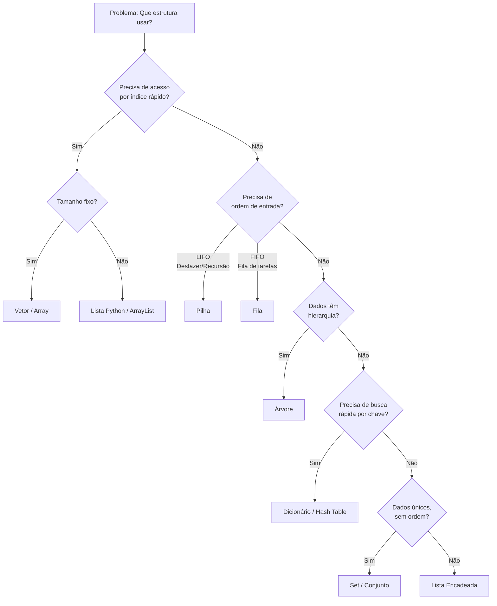
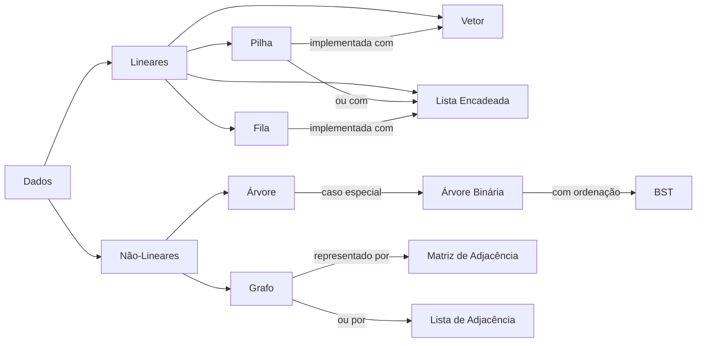
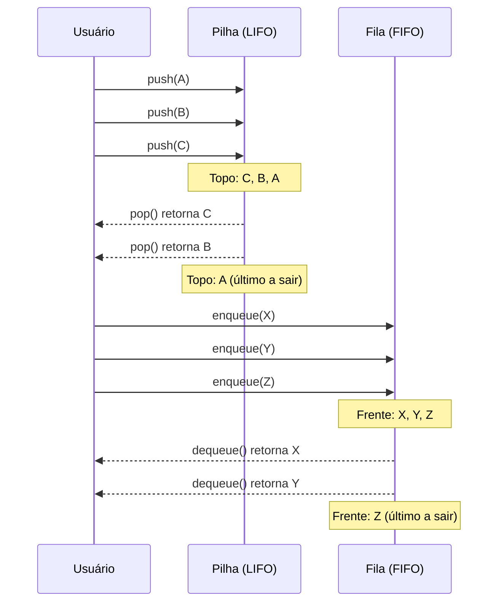
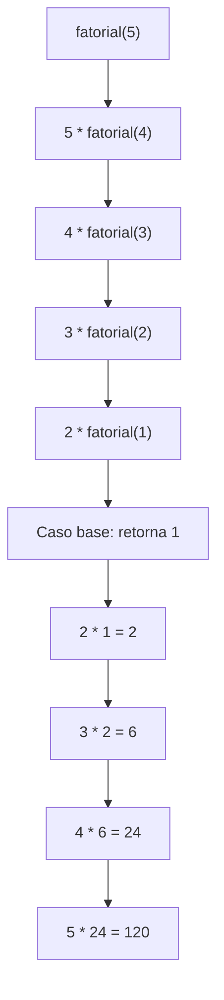

# Estrutura de Dados

> [!quote] Organização de Dados
> *Estruturas de dados são formas de organizar **conjuntos** de dados na programação, assim como as **operações** nesses conjuntos.*

---

## 📚 Roteiro de Estudo

1. Aprender o que são estruturas de dados
2. Aprender as principais estruturas de dados independente de linguagem
3. Como usar estruturas de dados em Python
4. Como usar estruturas de dados em C
5. Projeto prático e real de programação usando estruturas de dados
6. Conceitos avançados: Estruturas Homogêneas/Heterogêneas, Ponteiros, Recursividade, Algoritmos de Pesquisa/Ordenação, Grafos

> [!info] Avaliação
> Prova escrita valendo 6 pontos e trabalho valendo 4 pontos

---

## 🗂️ Principais Estruturas de Dados

> [!tip] Por que estudar estruturas de dados?
> A escolha certa de estrutura de dados pode fazer a diferença entre um programa que processa milhões de registros em segundos e um que trava com apenas mil registros. Grandes empresas de tecnologia (Google, Amazon, Meta) cobram esse conhecimento nas entrevistas técnicas porque ele impacta diretamente a qualidade do software produzido.

---

### 1. Vetor 📦

> [!info] Conceito
> Um vetor é uma coleção de elementos armazenados de forma contínua, onde todos os elementos são do mesmo tipo e cada posição tem um "endereço" que permite acesso direto.

**Exemplo do Mundo Real:** Imagine uma prateleira com uma fileira de livros. Cada espaço representa uma posição, e para pegar um livro específico, basta saber o número da posição.

**Quando usar vetores:**
- Quando o tamanho da coleção é conhecido e fixo
- Quando o acesso por índice é a operação mais frequente
- Quando os dados são todos do mesmo tipo
- Exemplos práticos: tabela de notas de uma turma, pixels de uma imagem, amostras de áudio

**Quando NÃO usar vetores:**
- Quando o tamanho da coleção muda com frequência
- Quando inserções e remoções no meio são frequentes (exigem deslocar todos os elementos à frente)

---

### 2. Lista (ou Lista Encadeada) 🔗

> [!info] Conceito
> Uma lista encadeada é uma sequência de elementos conectados, onde cada elemento "aponta" para o próximo. Os elementos não precisam estar próximos na memória.

**Exemplo do Mundo Real:** Pense em um trem com vários vagões. Cada vagão está ligado ao próximo por um engate. Para acessar um vagão no meio, você precisa começar pelo primeiro.

**Tipos de lista encadeada:**
- **Simples:** cada nó aponta apenas para o próximo
- **Dupla:** cada nó aponta para o próximo e para o anterior (facilita a navegação em ambas as direções)
- **Circular:** o último nó aponta de volta para o primeiro (útil em sistemas de rodízio)

**Quando usar listas encadeadas:**
- Quando inserções e remoções no início ou no meio são frequentes
- Quando o tamanho da coleção é imprevisível
- Exemplos práticos: histórico de navegação, lista de músicas em reprodução, gerenciamento de memória no sistema operacional

---

### 3. Pilha 📚

> [!info] Conceito
> Uma pilha funciona no modelo **LIFO** (Last In, First Out), ou seja, o último elemento que entra é o primeiro a sair.

**Exemplo do Mundo Real:** Uma pilha de livros. Quando você coloca um livro em cima, ele é o primeiro a sair.

**Operações fundamentais da pilha:**

| Operação | Descrição | Exemplo |
|----------|-----------|---------|
| `push` | Empilha um elemento no topo | Colocar um livro na pilha |
| `pop` | Remove e retorna o elemento do topo | Pegar o livro do topo |
| `peek` / `top` | Consulta o topo sem remover | Ver qual livro está por cima |
| `is_empty` | Verifica se a pilha está vazia | Pilha tem livros? |

**Quando usar pilhas:**
- Quando você precisa "desfazer" ações (Ctrl+Z nos editores de texto)
- Quando há chamadas de funções aninhadas (a pilha de execução do próprio computador é uma pilha)
- Para avaliar expressões matemáticas com parênteses
- Para implementar navegação "voltar" em browsers
- Para o algoritmo de busca em profundidade (DFS) em grafos

---

### 4. Fila 🎟️

> [!info] Conceito
> Uma fila segue o modelo **FIFO** (First In, First Out), ou seja, o primeiro elemento que entra é o primeiro a sair.

**Exemplo do Mundo Real:** Fila para entrar no cinema. A primeira pessoa é a primeira a entrar.

**Operações fundamentais da fila:**

| Operação | Descrição | Exemplo |
|----------|-----------|---------|
| `enqueue` | Adiciona ao final da fila | Nova pessoa entra no final |
| `dequeue` | Remove do início da fila | Primeira pessoa é atendida |
| `front` | Consulta o início sem remover | Ver quem é o próximo |
| `is_empty` | Verifica se a fila está vazia | Tem alguém esperando? |

**Quando usar filas:**
- Quando a ordem de chegada deve ser respeitada
- Para processamento de tarefas em ordem (impressão, uploads, downloads)
- Para o algoritmo de busca em largura (BFS) em grafos
- Sistemas de mensageria (RabbitMQ, Kafka) usam filas como conceito central

---

### 5. Árvore 🌳

> [!info] Conceito
> Uma árvore é uma estrutura hierárquica onde cada elemento (nó) pode ter vários "filhos". Começa com um nó raiz e se ramifica.

**Exemplos do Mundo Real:**
- Árvore Genealógica
- Sistema de Arquivos
- Hierarquia Organizacional

**Terminologia essencial das árvores:**

| Termo | Definição |
|-------|-----------|
| **Raiz** | Nó inicial, sem pai |
| **Nó folha** | Nó sem filhos |
| **Nó interno** | Nó com pelo menos um filho |
| **Altura** | Distância da raiz até a folha mais profunda |
| **Subárvore** | Qualquer nó e todos os seus descendentes |

**Tipos de árvore:**
- **Árvore Binária:** cada nó tem no máximo 2 filhos
- **Árvore Binária de Busca (BST):** filhos à esquerda são menores, à direita são maiores (facilita busca eficiente)
- **Árvore AVL:** BST auto-balanceada (garante performance mesmo com muitas inserções)
- **Árvore B:** usada em bancos de dados e sistemas de arquivos

**Quando usar árvores:**
- Quando os dados têm hierarquia natural (pastas, categorias, estrutura organizacional)
- Quando buscas eficientes são necessárias em grandes volumes de dados
- Bancos de dados usam árvores B internamente para indexar registros

---

## ⚡ Complexidade Big-O: Comparativo Geral

> [!warning] Por que Big-O importa?
> Big-O descreve como o tempo de execução ou o uso de memória cresce conforme o tamanho da entrada aumenta. Saber Big-O é a diferença entre um código que funciona com 100 itens e trava com 1 milhão.

**Hierarquia das complexidades (do melhor para o pior):**

| Notação | Nome | Exemplo |
|---------|------|---------|
| O(1) | Constante | Acessar um elemento por índice |
| O(log n) | Logarítmica | Busca binária |
| O(n) | Linear | Percorrer uma lista |
| O(n log n) | Log-linear | Merge Sort, Quick Sort médio |
| O(n²) | Quadrática | Bubble Sort, Selection Sort |
| O(2ⁿ) | Exponencial | Subconjuntos de um conjunto |

**Complexidade das operações por estrutura:**

| Estrutura | Acesso | Busca | Inserção | Remoção |
|-----------|--------|-------|----------|---------|
| Vetor (Array) | O(1) | O(n) | O(n) | O(n) |
| Lista Encadeada | O(n) | O(n) | O(1)* | O(1)* |
| Pilha | O(n) | O(n) | O(1) | O(1) |
| Fila | O(n) | O(n) | O(1) | O(1) |
| Árvore BST (média) | O(log n) | O(log n) | O(log n) | O(log n) |
| Árvore BST (pior) | O(n) | O(n) | O(n) | O(n) |
| Hash Table (média) | O(1) | O(1) | O(1) | O(1) |

> *Inserção e remoção O(1) em listas encadeadas valem quando você já tem o ponteiro para o nó. Se precisar encontrar o nó primeiro, a busca custa O(n).

---

## 🗺️ Quando Usar Cada Estrutura: Guia de Decisão



---

## 🔗 Relação entre as Estruturas



---

## 🐍 Estruturas de Dados em Python

🔗 [Principais Estruturas de Dados no Python](https://www.treinaweb.com.br/blog/principais-estruturas-de-dados-no-python)

> [!info] Python e Estruturas de Dados
> Python oferece estruturas de dados nativas de alto nível que já implementam internamente as estruturas clássicas. Entender a correspondência entre as duas camadas é essencial para escrever código eficiente.

---

### 1. Listas 📋

> [!tip] Características
> Coleções ordenadas e **mutáveis** que permitem armazenar diferentes tipos de dados. Internamente, Python implementa listas como arrays dinâmicos (realocam memória conforme crescem).

| Método | Descrição | Complexidade |
|--------|-----------|-------------|
| `append()` | Adiciona item ao final | O(1) amortizado |
| `insert(i, x)` | Insere em posição específica | O(n) |
| `remove()` | Remove primeiro item igual | O(n) |
| `pop()` | Remove e retorna o último | O(1) |
| `pop(i)` | Remove e retorna posição i | O(n) |
| `sort()` | Ordena a lista | O(n log n) |
| `index()` | Busca por valor | O(n) |
| `in` | Verifica presença | O(n) |

```python
frutas = ["maçã", "banana", "laranja"]
frutas.append("uva")
frutas.remove("banana")
frutas.sort()
print(frutas)  # Output: ['laranja', 'maçã', 'uva']
```

---

### 2. Tupla 🔒

> [!tip] Características
> Coleções ordenadas e **imutáveis**. Definidas com parênteses `()`. São mais eficientes que listas quando os dados não mudam.

**Casos de uso típicos:**
- Coordenadas geográficas: `(latitude, longitude)`
- Retorno de múltiplos valores de uma função
- Chaves compostas em dicionários
- Registros que não devem ser alterados

```python
cores = ("vermelho", "verde", "azul")
print(cores[1])  # Output: verde
# cores[1] = "amarelo"  # Erro: Tuplas são imutáveis

# Desempacotamento de tupla
r, g, b = cores
print(r)  # Output: vermelho

# Tupla como chave de dicionário
coordenadas = {(23.5, 46.6): "São Paulo", (22.9, 43.1): "Rio de Janeiro"}
```

---

### 3. Sets (Conjuntos) 🔵

> [!tip] Características
> Coleções **desordenadas** e **sem duplicatas**. Úteis para operações de conjuntos e verificação de pertencimento em O(1).

| Método | Descrição |
|--------|-----------|
| `add()` | Adiciona item |
| `remove()` | Remove item (erro se não existir) |
| `discard()` | Remove item (sem erro se não existir) |
| `union()` | União de sets |
| `intersection()` | Interseção de sets |
| `difference()` | Diferença entre sets |

```python
linguagens = {"Python", "Java", "C++"}
linguagens.add("Ruby")
linguagens.add("Python")  # Não será adicionado novamente
print(linguagens)  # Output: {'Python', 'Ruby', 'Java', 'C++'}

# Verificar pertencimento: O(1), muito mais rápido que lista
if "Python" in linguagens:
    print("Python está no conjunto")

# Operações de conjunto
aprovados = {"Ana", "Bruno", "Carla"}
presentes = {"Bruno", "Carla", "Diego"}
aprovados_presentes = aprovados & presentes  # Interseção
print(aprovados_presentes)  # {'Bruno', 'Carla'}
```

---

### 4. Dicionário 🗝️

> [!tip] Características
> Coleções de pares **chave-valor**. Úteis para dados identificados por chave. Internamente implementados como tabelas hash, com acesso O(1) em média.

| Método | Descrição | Complexidade |
|--------|-----------|-------------|
| `get()` | Retorna valor da chave | O(1) |
| `pop()` | Remove e retorna item | O(1) |
| `keys()` | Retorna todas as chaves | O(1) |
| `values()` | Retorna todos os valores | O(1) |
| `items()` | Retorna pares chave-valor | O(1) |
| `in` | Verifica chave presente | O(1) |
| `update()` | Atualiza com outro dicionário | O(n) |

```python
aluno = {"nome": "Ana", "idade": 20, "curso": "Engenharia"}
print(aluno["nome"])  # Output: Ana
aluno["idade"] = 21
aluno.pop("curso")
print(aluno)  # Output: {'nome': 'Ana', 'idade': 21}

# Uso prático: contador de frequência
texto = "banana"
contagem = {}
for letra in texto:
    contagem[letra] = contagem.get(letra, 0) + 1
print(contagem)  # {'b': 1, 'a': 3, 'n': 2}
```

---

## 🔗 Relação: Python vs Estruturas Clássicas

| Estrutura Clássica | Equivalente em Python | Observação |
|--------------------|----------------------|------------|
| Vetor | `list` (array dinâmico) | Tamanho cresce automaticamente |
| Lista Encadeada | Classes personalizadas | `collections.deque` internamente é lista dupla |
| Pilha | `list` com `append()`/`pop()` ou `deque` | `list` é suficiente na maioria dos casos |
| Fila | `collections.deque` | Evite `list` para fila (popleft é O(n) em list) |
| Árvore | Classes personalizadas ou `binarytree` | Não há built-in nativo |
| Hash Table | `dict` | Implementação nativa eficiente |
| Conjunto | `set` | Baseado em hash, sem duplicatas |

---

### Implementação de Pilha em Python

```python
pilha = []
pilha.append(1)  # Empilha 1
pilha.append(2)  # Empilha 2
pilha.pop()      # Remove 2 (topo)
print(pilha)     # Output: [1]

# Uso real: verificar parênteses balanceados
def parenteses_balanceados(expressao):
    pilha = []
    for char in expressao:
        if char == '(':
            pilha.append(char)
        elif char == ')':
            if not pilha:
                return False
            pilha.pop()
    return len(pilha) == 0

print(parenteses_balanceados("(a + b) * (c - d)"))  # True
print(parenteses_balanceados("(a + b * (c - d)"))   # False
```

---

### Implementação de Fila em Python

```python
from collections import deque

fila = deque()
fila.append(1)   # Adiciona na fila
fila.append(2)
fila.popleft()   # Remove o primeiro (1)
print(fila)      # Output: deque([2])

# Por que deque e não list para fila?
# list.pop(0) é O(n): desloca todos os elementos
# deque.popleft() é O(1): operação otimizada para os dois extremos
```

---

### Implementação de Lista Encadeada em Python

```python
class Node:
    def __init__(self, data):
        self.data = data
        self.next = None

class LinkedList:
    def __init__(self):
        self.head = None

    def add(self, data):
        new_node = Node(data)
        new_node.next = self.head
        self.head = new_node

    def display(self):
        current = self.head
        elementos = []
        while current:
            elementos.append(str(current.data))
            current = current.next
        print(" -> ".join(elementos))

lista_encadeada = LinkedList()
lista_encadeada.add(1)
lista_encadeada.add(2)
lista_encadeada.add(3)
lista_encadeada.display()  # Output: 3 -> 2 -> 1
```

---

### Implementação de Árvore em Python

```python
class Node:
    def __init__(self, data):
        self.data = data
        self.left = None
        self.right = None

root = Node(10)
root.left = Node(5)
root.right = Node(15)

# Percurso in-order (esquerda, raiz, direita): resultado em ordem crescente para BST
def inorder(node):
    if node:
        inorder(node.left)
        print(node.data, end=" ")
        inorder(node.right)

inorder(root)  # Output: 5 10 15
```

---

## 🎯 Diagrama: Ciclo de Vida de uma Pilha e de uma Fila



---

## 🏋️ Atividades Mão na Massa

> [!example] 🧪 Atividade 1: Visualize pilha, fila e árvore no VisuAlgo
>
> **Ferramenta:** [visualgo.net](https://visualgo.net/en)
>
> **O que fazer:**
> 1. Acesse [visualgo.net/en/list](https://visualgo.net/en/list) e selecione o modo "Stack"
> 2. Use os botões "Push" para inserir os valores: 10, 20, 30, 40, 50
> 3. Observe como cada valor ocupa o topo e clique em "Pop" 2 vezes
> 4. Anote: qual valor saiu primeiro? Por que?
> 5. Agora selecione o modo "Queue" no mesmo site
> 6. Insira os mesmos valores (Enqueue: 10, 20, 30, 40, 50)
> 7. Execute Dequeue 2 vezes e anote: qual valor saiu? Por que é diferente da pilha?
> 8. Acesse [visualgo.net/en/bst](https://visualgo.net/en/bst) e insira os valores: 50, 30, 70, 20, 40
> 9. Observe a estrutura formada e use a busca para encontrar o valor 40, anotando quantos nós foram visitados
>
> **Resultado observável:** Ao final, você terá visto com seus próprios olhos a diferença de comportamento LIFO vs FIFO, e entendido visualmente por que busca em BST é mais rápida que busca linear.

---

> [!example] 🧪 Atividade 2: Liste, dicionário e operações no Google Colab
>
> **Ferramenta:** [colab.research.google.com](https://colab.research.google.com) (gratuito, sem instalar nada)
>
> **O que fazer:**
> 1. Abra um novo notebook no Google Colab
> 2. Na primeira célula, copie e rode o código abaixo:
>
> ```python
> # Parte A: Lista como pilha manual
> historico_navegacao = []
> for pagina in ["Google", "YouTube", "GitHub", "StackOverflow"]:
>     historico_navegacao.append(pagina)
>     print(f"Visitou: {pagina} | Histórico: {historico_navegacao}")
>
> print("\n-- Clicando em Voltar --")
> while historico_navegacao:
>     print(f"Voltando para: {historico_navegacao.pop()}")
> ```
>
> 3. Na segunda célula, rode:
>
> ```python
> # Parte B: Dicionário para inventário de loja
> estoque = {"arroz": 50, "feijão": 30, "macarrão": 20}
>
> # Adicionar produto
> estoque["azeite"] = 10
>
> # Venda: reduzir estoque
> produto_vendido = "feijão"
> estoque[produto_vendido] -= 5
>
> # Verificar produto em falta (abaixo de 15 unidades)
> print("Produtos com estoque baixo:")
> for produto, qtd in estoque.items():
>     if qtd < 25:
>         print(f"  {produto}: {qtd} unidades")
>
> print(f"\nEstoque atual: {estoque}")
> ```
>
> 4. Modifique o código para adicionar mais 3 produtos ao estoque e simular 2 vendas diferentes
>
> **Resultado observável:** Você verá como lista e dicionário são usados em um problema real de negócio, e entenderá na prática a diferença entre acesso por índice (lista) e acesso por chave (dicionário).

---

> [!example] 🧪 Atividade 3: Escolha a estrutura certa e justifique com Big-O
>
> **Ferramenta:** papel e caneta + [colab.research.google.com](https://colab.research.google.com) para testar
>
> **Cenários para analisar:**
>
> Para cada cenário abaixo, escreva no papel: (a) qual estrutura você usaria, (b) por que, (c) qual a complexidade da operação principal
>
> | Cenário | Operação principal |
> |---------|-------------------|
> | Sistema de atendimento de chamados de suporte (ordem de chegada) | Retirar o próximo chamado |
> | Verificar se uma palavra é palíndromo (ex: "arara") | Comparar letras das extremidades |
> | Banco de dados de alunos onde você busca por matrícula | Buscar aluno por matrícula |
> | Histórico de ações de um editor de texto (Ctrl+Z) | Desfazer última ação |
> | Lista de convidados de uma festa (sem repetição) | Verificar se alguém já foi convidado |
>
> Depois, implemente no Colab pelo menos 2 dos cenários e meça o tempo com:
>
> ```python
> import time
>
> # Exemplo de medição de tempo
> inicio = time.time()
> # ... seu código aqui ...
> fim = time.time()
> print(f"Tempo: {fim - inicio:.6f} segundos")
> ```
>
> **Resultado observável:** Você comparará na prática o tempo de busca em uma lista vs em um dicionário para 10.000 elementos, confirmando experimentalmente a diferença entre O(n) e O(1).

---

## 📘 Conceitos Avançados

---

### 1. Estruturas de Dados Homogêneas 🧱

> [!info] Conceito
> Armazenam elementos do **mesmo tipo de dado**. Ideais quando todos os dados seguem o mesmo formato.

**Exemplos:** Vetores (arrays), Matrizes

**Aplicações:** Listas de números, Tabelas de notas

```c
#include <stdio.h>

int main() {
    int numeros[5] = {1, 2, 3, 4, 5};
    for (int i = 0; i < 5; i++) {
        printf("Elemento %d: %d\n", i, numeros[i]);
    }
    return 0;
}
```

---

### 2. Estruturas de Dados Heterogêneas 🗃️

> [!info] Conceito
> Armazenam **diferentes tipos de dados**. Úteis para representar entidades com múltiplas características.

**Exemplo:** `struct` em C

**Aplicações:** Cadastro de alunos (nome, idade, nota)

```c
#include <stdio.h>

struct Aluno {
    char nome[50];
    int idade;
    float nota;
};

int main() {
    struct Aluno a1 = {"Maria", 17, 8.5};
    printf("Nome: %s\nIdade: %d\nNota: %.2f\n", a1.nome, a1.idade, a1.nota);
    return 0;
}
```

---

### 3. Ponteiros 👉

> [!info] Conceito
> Variáveis que armazenam o **endereço de memória** de outra variável.

**Aplicações:**
- Acesso eficiente a arrays
- Alocação dinâmica de memória
- Estruturas ligadas (listas, árvores)

> [!tip] Analogia para fixar
> Pense no ponteiro como o endereço de uma casa. A casa é a variável com o valor; o endereço é o ponteiro. Você pode dizer "vá até o endereço X e pegue o que está lá" em vez de carregar a casa inteira.

```c
#include <stdio.h>

int main() {
    int x = 10;
    int *p = &x;
    printf("Valor de x: %d\n", x);
    printf("Endereco de x: %p\n", p);
    printf("Valor apontado por p: %d\n", *p);
    return 0;
}
```

**Operadores de ponteiro:**

| Operador | Nome | Função |
|----------|------|--------|
| `&` | Endereço-de | Obtém o endereço de uma variável |
| `*` | Derreferência | Acessa o valor no endereço apontado |

---

### 4. Recursividade 🔄

> [!info] Conceito
> Ocorre quando uma função **chama a si mesma** para resolver subproblemas menores.

**Aplicações:** Fatorial, Fibonacci, Árvores, Busca em profundidade

> [!warning] Cuidado com recursão infinita
> Toda função recursiva precisa de um **caso base** (condição de parada). Sem ele, a função chama a si mesma indefinidamente até estourar a memória (stack overflow).



```c
#include <stdio.h>

int fatorial(int n) {
    if (n <= 1) return 1;
    return n * fatorial(n - 1);
}

int main() {
    int resultado = fatorial(5);
    printf("Fatorial de 5: %d\n", resultado);
    return 0;
}
```

**Recursividade vs Iteração:**

| Aspecto | Recursão | Iteração |
|---------|----------|----------|
| Legibilidade | Alta (para problemas naturalmente recursivos) | Variável |
| Uso de memória | Maior (pilha de chamadas) | Menor |
| Risco de overflow | Sim (profundidade excessiva) | Não |
| Quando preferir | Árvores, grafos, divide and conquer | Laços simples |

---

### 5. Algoritmos de Pesquisa e Ordenação 🔍

> [!info] Tipos de Pesquisa

| Algoritmo | Descrição | Complexidade |
|-----------|-----------|-------------|
| **Pesquisa Linear** | Percorre todos os elementos | O(n) |
| **Pesquisa Binária** | Requer vetor ordenado, divide pela metade | O(log n) |

> [!info] Tipos de Ordenação

| Algoritmo | Descrição | Melhor caso | Caso médio | Pior caso |
|-----------|-----------|-------------|------------|-----------|
| **Bubble Sort** | Troca elementos vizinhos fora de ordem | O(n) | O(n²) | O(n²) |
| **Selection Sort** | Encontra o menor e coloca no início | O(n²) | O(n²) | O(n²) |
| **Insertion Sort** | Insere cada elemento na posição correta | O(n) | O(n²) | O(n²) |
| **Merge Sort** | Divide, ordena recursivamente, mescla | O(n log n) | O(n log n) | O(n log n) |
| **Quick Sort** | Divide pelo pivô | O(n log n) | O(n log n) | O(n²) |

> [!tip] Dica Prática
> Em Python, o método `sort()` usa o algoritmo **Timsort** (híbrido de Merge Sort e Insertion Sort), que é O(n log n) no pior caso. Em C, você raramente precisará implementar um algoritmo de ordenação do zero, pois a biblioteca padrão oferece `qsort()`.

#### Pesquisa Linear

```c
int buscaLinear(int v[], int tamanho, int chave) {
    for (int i = 0; i < tamanho; i++) {
        if (v[i] == chave) return i;
    }
    return -1;
}
```

#### Pesquisa Binária

```c
int buscaBinaria(int v[], int inicio, int fim, int chave) {
    while (inicio <= fim) {
        int meio = (inicio + fim) / 2;
        if (v[meio] == chave) return meio;
        else if (chave < v[meio]) fim = meio - 1;
        else inicio = meio + 1;
    }
    return -1;
}
```

#### Bubble Sort

```c
void bubbleSort(int v[], int n) {
    for (int i = 0; i < n - 1; i++) {
        for (int j = 0; j < n - i - 1; j++) {
            if (v[j] > v[j + 1]) {
                int temp = v[j];
                v[j] = v[j + 1];
                v[j + 1] = temp;
            }
        }
    }
}
```

---

### 6. Grafos 🕸️

> [!info] Conceito
> Um **grafo** é um conjunto de **vértices (nós)** conectados por **arestas (ligações)**.

| Tipo | Descrição | Exemplo de Uso |
|------|-----------|---------------|
| **Dirigido** | Com direção (setas) | Seguidores no Twitter/X |
| **Não-dirigido** | Sem direção | Amizades no Facebook |
| **Ponderado** | Com peso nas arestas | Distâncias entre cidades |
| **Cíclico** | Tem ao menos um ciclo | Rotas com retorno |
| **Acíclico** | Sem ciclos | Dependências de tarefas |

**Aplicações:** Mapas de cidades, Redes sociais, Roteamento na internet, Recomendações de produtos

**Formas de representação:**

| Representação | Espaço | Verificar aresta | Listar vizinhos |
|---------------|--------|-----------------|-----------------|
| Matriz de Adjacência | O(V²) | O(1) | O(V) |
| Lista de Adjacência | O(V + E) | O(grau) | O(grau) |

> *V = número de vértices, E = número de arestas*

**Algoritmos de busca em grafos:**

| Algoritmo | Estratégia | Estrutura usada | Uso típico |
|-----------|-----------|-----------------|-----------|
| BFS (Busca em Largura) | Visita vizinhos antes de ir fundo | Fila | Menor caminho (sem pesos) |
| DFS (Busca em Profundidade) | Vai o mais fundo possível antes de voltar | Pilha | Detectar ciclos, componentes |

#### Matriz de Adjacência

```c
#include <stdio.h>

#define V 4

void printGrafo(int grafo[V][V]) {
    for (int i = 0; i < V; i++) {
        for (int j = 0; j < V; j++) {
            printf("%d ", grafo[i][j]);
        }
        printf("\n");
    }
}

int main() {
    int grafo[V][V] = {
        {0, 1, 0, 0},
        {1, 0, 1, 1},
        {0, 1, 0, 1},
        {0, 1, 1, 0}
    };

    printGrafo(grafo);
    return 0;
}
```

---

## ✅ Sugestões de Estudo

> [!success] Dicas
> - Refaça os códigos manualmente
> - Tente implementar usando alocação dinâmica
> - Crie pequenos projetos aplicando múltiplos conceitos
> - Resolva exercícios de lógica com ponteiros e recursão
> - Use IA para criar questões e testar seu conhecimento
> - Visualize algoritmos no VisuAlgo antes de implementar: ver o comportamento visual acelera muito o entendimento
> - Para cada nova estrutura que aprender, pergunte: "Em qual problema real eu usaria isso?"
> - Pratique explicar para alguém (ou para o espelho): se você consegue ensinar, você entendeu

---

## 📝 Lista de Exercícios

### Questões 1-10

**1. (Vetor)** Em relação a vetores, assinale a alternativa correta:

a) Permitem armazenar elementos de tipos diferentes.
b) Os elementos são armazenados de forma não contígua na memória.
c) Permitem acesso direto aos elementos por índice.
d) Não possuem tamanho fixo em linguagens como C.
e) Sempre funcionam como listas encadeadas.

---

**2. (Lista Encadeada)** Qual das alternativas descreve corretamente uma lista encadeada?

a) Estrutura homogênea que exige alocação contígua na memória.
b) Cada elemento aponta para o próximo, sem necessidade de estarem lado a lado na memória.
c) Estrutura LIFO utilizada para empilhar dados.
d) Organização hierárquica com um nó raiz e nós filhos.
e) Armazena sempre dados do mesmo tipo.

---

**3. (Pilha)** Sobre o funcionamento de uma pilha, é correto afirmar que:

a) O primeiro elemento inserido é o primeiro a ser retirado.
b) O último elemento inserido é o primeiro a ser retirado.
c) Não é possível remover elementos de uma pilha.
d) Pilhas são usadas apenas em cálculos matemáticos.
e) É uma estrutura exclusiva de linguagens orientadas a objetos.

---

**4. (Fila)** Uma fila segue qual política de acesso?

a) LIFO - Last In, First Out.
b) FIFO - First In, First Out.
c) FILO - First In, Last Out.
d) ALEATÓRIA - Ordem de prioridade definida pelo programador.
e) BINÁRIA - Ordem determinada por comparação de valores.

---

**5. (Árvore)** Na estrutura de dados árvore, o elemento que não possui pai é chamado de:

a) Nó folha.
b) Nó interno.
c) Raiz.
d) Subnó.
e) Galho.

---

**6. (Python - Lista)** No Python, qual método é usado para adicionar um elemento ao final de uma lista?

a) add()
b) insert()
c) append()
d) push()
e) extend()

---

**7. (Python - Tupla)** Sobre tuplas no Python, assinale a alternativa correta:

a) São mutáveis e permitem adição de novos elementos.
b) São imutáveis e definidas com parênteses.
c) São semelhantes a listas, mas armazenam apenas strings.
d) São coleções desordenadas sem elementos duplicados.
e) Podem ser alteradas usando o método update().

---

**8. (Conceitos - Ponteiros)** Em C, um ponteiro armazena:

a) Um tipo de dado inteiro que representa um índice.
b) O endereço de memória de outra variável.
c) Apenas endereços de variáveis inteiras.
d) Sempre um valor fixo definido em tempo de compilação.
e) Um vetor de valores contínuos.

---

**9. (Pesquisa Binária)** Para aplicar a pesquisa binária em um vetor, é necessário que:

a) O vetor esteja ordenado.
b) O vetor tenha elementos únicos.
c) O vetor seja armazenado em forma de árvore.
d) Seja utilizada recursividade obrigatoriamente.
e) O vetor tenha apenas números inteiros.

---

**10. (Grafos)** Um grafo ponderado é aquele em que:

a) Todos os nós possuem o mesmo grau.
b) Cada aresta possui um peso associado.
c) Não existe direção nas arestas.
d) Os vértices estão organizados em níveis hierárquicos.
e) Cada nó está conectado a todos os outros.

> [!success] Gabarito 1-10
> 1. c | 2. b | 3. b | 4. b | 5. c | 6. c | 7. b | 8. b | 9. a | 10. b

---

### Questões 11-15

**11. (Vetor x Lista Encadeada)** Qual é a principal vantagem de uma lista encadeada em relação a um vetor em C?

a) Permite acesso direto a qualquer elemento pelo índice.
b) Utiliza menos memória em todos os casos.
c) Inserções e remoções no início não exigem deslocamento de elementos.
d) Sempre armazena elementos do mesmo tipo.
e) Ordena os elementos automaticamente.

---

**12. (Fila de Prioridade)** Uma fila de prioridade difere de uma fila comum porque:

a) Os elementos são atendidos pela ordem de chegada.
b) Cada elemento é atendido de acordo com um peso ou prioridade.
c) Apenas números inteiros podem ser armazenados.
d) Utiliza sempre uma estrutura de pilha.
e) Não permite remoção de elementos.

---

**13. (Python - Sets)** Considere o código:

```python
dados = {1, 2, 3}
dados.add(2)
print(dados)
```

O que será impresso?

a) {1, 2, 3, 2}
b) {1, 2, 3}
c) [1, 2, 3]
d) {2, 3}
e) Erro de execução.

---

**14. (Recursividade)** Sobre recursividade, assinale a alternativa correta:

a) Toda função recursiva deve ter um caso base para evitar chamadas infinitas.
b) Recursividade não pode ser usada em árvores.
c) Funções recursivas não utilizam a pilha de execução.
d) Sempre é mais eficiente que a solução iterativa.
e) Só pode ser usada com números inteiros.

---

**15. (Grafos - Matriz de Adjacência)** Na representação de um grafo não direcionado por matriz de adjacência:

a) A matriz é sempre simétrica em relação à diagonal principal.
b) O número de linhas é sempre diferente do número de colunas.
c) Não é possível representar grafos completos.
d) Apenas arestas ponderadas podem ser representadas.
e) O valor 0 sempre indica que existe aresta entre dois vértices.

> [!success] Gabarito 11-15
> 11. c | 12. b | 13. b | 14. a | 15. a

---

## 🚀 Projeto Prático: Agente de FAQ com IA

> [!tip] Dica Importante
> Este trabalho foi planejado para que você use IA em todo o processo. Use IAs para te guiar na solução de problemas e na programação. Documente todo o processo, incluindo problemas e soluções.

---

### Visão Geral

Construir um **agente inteligente** que responda perguntas usando **documentos reais** (PDFs, textos, links) como base de conhecimento, utilizando o **framework Agno** e aplicando **estruturas de dados**.

O sistema deve:
1. **Receber documentos** (manuais, editais, apostilas)
2. **Ler e organizar** conteúdo usando estruturas de dados
3. **Armazenar** informações em vector store
4. **Responder perguntas** usando IA
5. **Demonstrar** via API ou página web

---

### 🎯 Objetivo

- Aprender na prática como estruturas de dados são usadas em projetos reais
- Desenvolver um agente de IA com busca inteligente (RAG)
- Treinar raciocínio lógico criando fluxos de decisão
- Documentar o projeto explicando cada estrutura aplicada

---

### 📦 Entregáveis

| Item | Descrição |
|------|-----------|
| **Código-fonte** | Repositório com README |
| **Vídeo** | Até 5 min mostrando funcionamento |
| **Relatório** | 1 página explicando estruturas usadas |
| **Demonstração** | Ao vivo |

---

### 📋 Passo a Passo

#### Etapa 1: Coleta e Preparação

- Escolha documentos para a base do FAQ
- **Lista:** todos os arquivos a processar
- **Set:** remover duplicados
- **Fila:** ordem de processamento

#### Etapa 2: Chunking e Indexação

- Divida documentos em blocos de texto (chunks)
- Armazene em **vetor** para acesso rápido
- Gere **embeddings** e salve em vector store
- Use **dicionário:** `{id_chunk: {"texto": "...", "fonte": "arquivo.pdf"}}`

#### Etapa 3: Criando o Agente

- Configure agente no Agno com:
  - Ferramenta de busca no vector store
  - Memória para perguntas anteriores
  - **Árvore de decisão** para classificar perguntas
- Perguntas em **fila** processadas na ordem
- Use **pilha** para busca em profundidade (DFS)

#### Etapa 4: Fluxo de Raciocínio

| Estrutura | Uso |
|-----------|-----|
| **Árvore** | Classificar perguntas em categorias |
| **Pilha** | Seguir links/relações entre conteúdos |
| **Grafo** | Mapear relações entre tópicos |
| **Lista** | Histórico de respostas |

#### Etapa 5: API e Demonstração

- Crie API com FastAPI (endpoint `/ask`)
- Opcionalmente, página web básica
- Demonstre com 3 perguntas reais

---

### 🗂️ Onde Cada Estrutura Aparece

| Estrutura | Aplicação no Projeto |
|-----------|---------------------|
| **Vetor** | Lista de chunks de texto |
| **Lista encadeada** | Pipeline de processamento |
| **Pilha** | Busca em profundidade (DFS) |
| **Fila** | Gerenciar perguntas e documentos |
| **Árvore** | Roteamento de perguntas |
| **Dicionário** | Índice {id para dados} |
| **Set** | Remover duplicatas |
| **Grafo** | Conexões entre tópicos |

---

### 📊 Critérios de Avaliação (6 pontos)

| Critério | Pontos |
|----------|--------|
| Funcionalidade do agente | 2 pts |
| Uso correto das estruturas | 2 pts |
| Relatório | 1 pt |
| Demonstração/vídeo | 1 pt |

---

### ⭐ Extras (Opcional)

- Criar **vários agentes** com funções diferentes
- Adicionar **feedback** do usuário
- Fazer **análise de métricas**

---

### 📅 Cronograma

| Data | Atividade |
|------|-----------|
| 08/08/2025 | Início: Ler conceitos e começar trabalho |
| 09/10/2025 | **Entrega do trabalho** |
| 21/11/2025 | **Prova** (conteúdo: esta página + trabalho) |

> [!warning] Avaliação
> - Trabalho: 6 pontos
> - Prova: 4 pontos
> - Individual

---

> [!note] 📚 Fontes (2026)
> - [VisuAlgo: visualização animada de estruturas de dados e algoritmos](https://visualgo.net/en) - ferramenta gratuita usada por 2M+ estudantes globalmente
> - [Python Data Structures: Types, Use Cases, and Complexity - Anaconda](https://www.anaconda.com/blog/python-data-structures-types-use-cases-complexity)
> - [Documentação oficial Python 3: Estruturas de Dados](https://docs.python.org/pt-br/3/tutorial/datastructures.html)
> - [Estruturas de Dados em Python: Guia Completo - Python Brasil](https://python.dev.br/blog/estruturas-de-dados-python/)
> - [Principais Estruturas de Dados no Python - TreinaWeb](https://www.treinaweb.com.br/blog/principais-estruturas-de-dados-no-python)
> - [Notação Big-O: complexidade de algoritmos - Dionisio Developer](https://dionisio.dev/blog/bigo/index.html)
> - [Top Algorithm Visualization Tools 2026 - Codewave](https://codewave.com/insights/algorithm-visualization-tools-techniques/)
