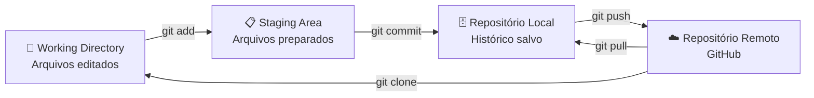
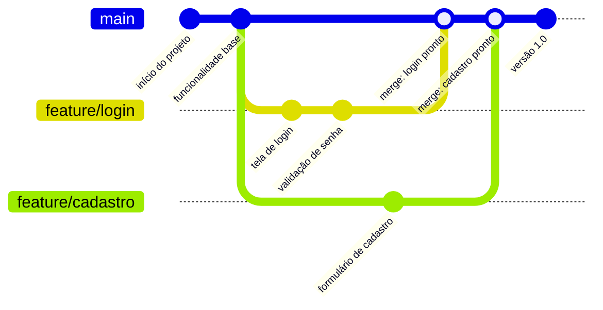
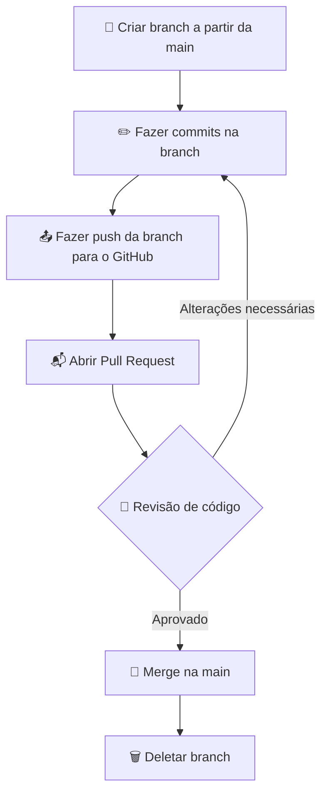

# GitHub e Controle de Versão

> [!quote] Histórico de Código
> *Git permite rastrear todas as mudanças do seu código, facilitando colaboração e recuperação de versões anteriores.*

---

## 🔄 O que é Git?

> [!info] Definição
> Sistema de controle de versões distribuído, usado principalmente no desenvolvimento de software, mas pode ser usado para registrar o histórico de edições de qualquer tipo de arquivo.

| Característica | Descrição |
|----------------|-----------|
| **Criador** | Linus Torvalds (para o kernel Linux) |
| **Tipo** | Distribuído |
| **Repositório** | Histórico completo em cada diretório de trabalho |
| **Independência** | Não depende de acesso a rede ou servidor central |

### Por que usar controle de versão?

Imagine que você está desenvolvendo um sistema e, na sexta-feira, o código funciona perfeitamente. Na segunda-feira, após algumas alterações, tudo para de funcionar. Sem controle de versão, você tentaria lembrar o que mudou. Com Git, basta consultar o histórico e reverter.

> [!tip] Analogia
> O Git funciona como um "Ctrl+Z infinito" para o seu projeto inteiro, incluindo todos os arquivos e toda a equipe ao mesmo tempo.

---

## 🌐 O que é GitHub?

> [!success] Plataforma Web
> Sistema web que provê a hospedagem de repositórios Git. Assim não é preciso configurar nem manter um servidor.

O GitHub não é o mesmo que o Git. O Git é a ferramenta local de controle de versão. O GitHub é um serviço na nuvem que armazena repositórios Git e adiciona funcionalidades de colaboração: Pull Requests, Issues, Actions (CI/CD), Wikis e revisão de código.

| Conceito | O que é |
|----------|---------|
| **Repositório (repo)** | Pasta do projeto com todo o histórico Git |
| **Clone** | Cópia local de um repositório remoto |
| **Fork** | Cópia independente de um repo na sua conta GitHub |
| **Pull Request (PR)** | Proposta de mesclagem de uma branch para outra |
| **Issue** | Registro de bug, tarefa ou sugestão de melhoria |
| **Branch** | Linha de desenvolvimento paralela dentro do mesmo repo |

> [!info] Plataformas alternativas
> Além do GitHub, existem o **GitLab** e o **Bitbucket**, que seguem o mesmo modelo. O GitHub é o mais popular, com mais de 100 milhões de desenvolvedores cadastrados (2026).

---

## 📥 Instalação

🔗 [Downloads do Git](https://git-scm.com/downloads)

**Verificar instalação:**

```bash
git --version
```

---

## ⚙️ Configuração Inicial

> [!tip] Identificação
> Antes de fazer commits, precisamos nos identificar:

```bash
git config --global user.email "fulano@gmail.com"
git config --global user.name "Fulano da Silva"
```

> [!warning] Atenção
> Cuidado ao copiar e colar: não deixe espaços vazios no início do comando.

Você pode verificar as configurações salvas com:

```bash
git config --list
```

---

## 🗺️ Como o Git Funciona por Dentro

O Git organiza o trabalho em três áreas distintas na sua máquina local, mais o repositório remoto:



| Área | Descrição |
|------|-----------|
| **Working Directory** | Onde você edita os arquivos normalmente |
| **Staging Area (Index)** | Área de preparação: escolha o que vai entrar no próximo commit |
| **Repositório Local** | Banco de dados local com todo o histórico de commits |
| **Repositório Remoto** | Cópia no GitHub, acessível por toda a equipe |

> [!info] Por que existe a Staging Area?
> Ela permite que você faça várias alterações em vários arquivos, mas escolha exatamente o que vai em cada commit. Commits precisos facilitam a leitura do histórico e a reversão de mudanças específicas.

---

## 🚀 Comandos Básicos

### Inicialização

| Comando | Descrição |
|---------|-----------|
| `git init` | Inicializa um repositório Git vazio |
| `git branch -M main` | Modifica nome da branch principal para main |
| `git remote add origin URL` | Cria conexão com repositório remoto |
| `git remote -v` | Lista as conexões remotas configuradas |

### Fluxo de Trabalho

| Comando | Descrição |
|---------|-----------|
| `git add arquivo` | Adiciona arquivo ao staging |
| `git add .` | Adiciona todos os arquivos modificados ao staging |
| `git status` | Visualiza o que está preparado para commit |
| `git commit -m "mensagem"` | Salva alterações no repositório |
| `git push -u origin main` | Envia alterações para repositório remoto |
| `git pull` | Baixa e mescla alterações do remoto |

### Histórico e Inspeção

| Comando | Descrição |
|---------|-----------|
| `git log` | Lista todos os commits com autor, data e mensagem |
| `git log --oneline` | Lista commits em formato compacto (uma linha cada) |
| `git log --oneline --graph` | Exibe histórico com representação gráfica de branches |
| `git diff` | Mostra diferenças entre o working directory e o staging |
| `git diff --staged` | Mostra diferenças entre o staging e o último commit |
| `git show <hash>` | Exibe detalhes e diff de um commit específico |

### Desfazendo Alterações

| Comando | Descrição |
|---------|-----------|
| `git restore arquivo` | Descarta alterações não commitadas em um arquivo |
| `git restore --staged arquivo` | Remove arquivo do staging (sem perder alterações) |
| `git revert <hash>` | Cria um novo commit que desfaz um commit anterior (seguro) |

> [!warning] Cuidado com `git reset --hard`
> Esse comando descarta commits E alterações locais de forma permanente. Para iniciantes, prefira sempre `git revert`, que é seguro e mantém o histórico intacto.

---

## 📋 Exemplo de Fluxo Completo

```bash
# 1. Navegar até a pasta do projeto
cd meu-projeto

# 2. Inicializar repositório
git init

# 3. Definir branch principal
git branch -M main

# 4. Conectar ao repositório remoto
git remote add origin https://github.com/usuario/repo.git

# 5. Adicionar arquivos
git add arquivo.py

# 6. Fazer commit
git commit -m "primeiro commit"

# 7. Enviar para o GitHub
git push -u origin main
```

---

## 🌿 Branches: Desenvolvimento em Paralelo

Branches (ramificações) permitem que você desenvolva funcionalidades novas sem afetar o código principal. A ideia é simples: crie uma branch, trabalhe nela com segurança e, quando estiver pronto, mescle de volta para a branch principal.



### Comandos de Branch

| Comando | Descrição |
|---------|-----------|
| `git branch` | Lista todas as branches locais |
| `git branch nome-da-branch` | Cria uma nova branch |
| `git checkout nome-da-branch` | Muda para a branch indicada |
| `git checkout -b nome-da-branch` | Cria e já muda para a nova branch |
| `git merge nome-da-branch` | Mescla a branch indicada na branch atual |
| `git branch -d nome-da-branch` | Deleta a branch local (após merge) |
| `git push origin nome-da-branch` | Envia a branch para o repositório remoto |

> [!tip] Boas práticas para nomes de branch (2025-2026)
> Use prefixos descritivos para facilitar a leitura:
> - `feature/nome-da-funcionalidade` - nova funcionalidade
> - `fix/descricao-do-bug` - correção de bug
> - `chore/atualizar-dependencias` - tarefas de manutenção

---

## 🔁 GitHub Flow: O Fluxo Mais Usado

O **GitHub Flow** é o modelo de trabalho mais adotado em equipes que fazem entregas contínuas. Ele é simples e eficiente:



**Regra de ouro:** a branch `main` sempre contém código funcional e pronto para ser usado.

---

## 📬 Pull Requests: Colaboração com Qualidade

Um Pull Request (PR) é um pedido formal para que suas alterações sejam revisadas e mescladas na branch principal. É a principal ferramenta de colaboração no GitHub.

**Boas práticas para PRs (2025-2026):**

- Mantenha o PR pequeno e focado em uma única tarefa
- Escreva uma descrição clara do que foi feito e por que
- Referencie a Issue relacionada usando `Fixes #123` na descrição
- Revise o próprio diff antes de abrir o PR
- Responda aos comentários de revisão com objetividade

> [!info] CI/CD integrado
> Em projetos modernos, ao abrir um PR, testes automáticos são executados pelo GitHub Actions. O botão de merge só fica disponível se todos os testes passarem. Isso garante que nenhum código quebrado entre na branch principal.

---

## 🔍 Explorando o Histórico de um Projeto Real

Uma das melhores formas de aprender Git é explorando repositórios open source reais. Você pode navegar pelo histórico diretamente no GitHub (aba "Commits") ou pelo terminal após clonar o projeto.

```bash
# Clonar um repositório open source
git clone https://github.com/torvalds/linux.git

# Ver histórico resumido
git log --oneline -20

# Ver o diff de um commit específico
git show abc1234

# Buscar commits por mensagem
git log --oneline --grep="fix bug"

# Ver quem alterou cada linha de um arquivo
git blame nome-do-arquivo.py
```

> [!tip] Projetos bons para explorar
> - **freeCodeCamp/freeCodeCamp** (plataforma educacional em JavaScript)
> - **public-apis/public-apis** (lista de APIs públicas, muitos commits simples e legíveis)
> - **torvalds/linux** (o próprio Linux, para ver commits de alto impacto)

---

> [!example] 🧪 Atividade 1: Criar repositório e publicar no GitHub

**Objetivo:** publicar seu primeiro código no GitHub do zero.

**Passos:**

1. Crie uma conta no GitHub em [github.com](https://github.com) (se ainda não tiver).
2. Crie um novo repositório clicando em "New repository". Dê um nome, marque "Public" e clique em "Create repository".
3. No seu computador, crie uma pasta e um arquivo de texto:

```bash
mkdir meu-primeiro-repo
cd meu-primeiro-repo
echo "print('Olá, GitHub!')" > hello.py
```

4. Inicialize o Git, conecte ao GitHub e envie:

```bash
git init
git add hello.py
git commit -m "primeiro commit: hello world"
git branch -M main
git remote add origin https://github.com/SEU_USUARIO/meu-primeiro-repo.git
git push -u origin main
```

**Resultado observável:** acesse `https://github.com/SEU_USUARIO/meu-primeiro-repo` no navegador e veja o arquivo `hello.py` publicado com a mensagem do commit exibida ao lado do arquivo.

---

> [!example] 🧪 Atividade 2: Criar uma branch e abrir um Pull Request

**Objetivo:** trabalhar em uma funcionalidade isolada e propor a integração via Pull Request.

**Passos:**

1. Dentro do repositório da Atividade 1, crie uma nova branch:

```bash
git checkout -b feature/mensagem-personalizada
```

2. Edite o arquivo `hello.py` para receber o nome do usuário:

```python
nome = input("Qual é o seu nome? ")
print(f"Olá, {nome}! Bem-vindo ao GitHub.")
```

3. Faça o commit e envie a branch para o GitHub:

```bash
git add hello.py
git commit -m "feature: mensagem de boas-vindas personalizada"
git push origin feature/mensagem-personalizada
```

4. Acesse o repositório no GitHub. Uma faixa amarela aparecerá sugerindo "Compare & pull request". Clique nela, escreva uma descrição do que foi feito e clique em "Create pull request".

5. Na aba "Files changed" do PR, observe as linhas verdes (adicionadas) e vermelhas (removidas).

6. Clique em "Merge pull request" e depois "Confirm merge".

**Resultado observável:** a branch `main` agora contém a versão atualizada do arquivo. A branch `feature/mensagem-personalizada` pode ser deletada com segurança. Você acaba de simular o fluxo de trabalho real de um desenvolvedor profissional.

---

> [!example] 🧪 Atividade 3: Explorar o histórico de um projeto open source real

**Objetivo:** ler o histórico de commits e entender um diff de um projeto real.

**Passos:**

1. Clone o repositório de APIs públicas (pequeno e didático):

```bash
git clone https://github.com/public-apis/public-apis.git
cd public-apis
```

2. Veja os últimos 15 commits em formato compacto:

```bash
git log --oneline -15
```

3. Copie o hash de um commit que pareça interessante pela mensagem. Veja o diff completo desse commit:

```bash
git show <hash-do-commit>
```

4. Leia o diff: linhas com `+` foram adicionadas, linhas com `-` foram removidas. Tente identificar o que o contribuidor alterou e por que, baseando-se na mensagem do commit.

5. Volte ao GitHub e localize o mesmo commit na aba "Commits" do repositório. Compare a visualização do terminal com a visualização web.

**Resultado observável:** você consegue navegar pelo histórico completo de um projeto com milhares de commits, ler diffs reais e entender o que cada contribuidor fez. Essa habilidade é essencial em qualquer ambiente profissional de desenvolvimento.

---

## 📋 Tabela Resumo: Comandos por Fase do Trabalho

| Fase | Comando | O que faz |
|------|---------|-----------|
| **Configurar** | `git config --global user.name "..."` | Define seu nome |
| **Configurar** | `git config --global user.email "..."` | Define seu email |
| **Iniciar** | `git init` | Cria repositório local |
| **Iniciar** | `git clone URL` | Copia repositório remoto |
| **Trabalhar** | `git status` | Mostra estado atual |
| **Trabalhar** | `git add .` | Prepara todos os arquivos |
| **Trabalhar** | `git commit -m "msg"` | Salva snapshot |
| **Colaborar** | `git push` | Envia para o remoto |
| **Colaborar** | `git pull` | Baixa do remoto |
| **Branches** | `git checkout -b nome` | Cria e muda de branch |
| **Branches** | `git merge nome` | Mescla branch |
| **Histórico** | `git log --oneline` | Vê commits resumidos |
| **Histórico** | `git diff` | Vê o que mudou |
| **Histórico** | `git show <hash>` | Inspeciona um commit |

---

## 📚 Materiais e Referências

📺 [Como usar Git e Github na prática: Guia para iniciantes | Mayk Brito](https://www.youtube.com/watch?v=2alg7MQ6_sI)

📺 [O QUE É GIT E GITHUB? - definição e conceitos importantes 1/2](https://www.youtube.com/watch?v=DqTITcMq68k)

📺 [COMO USAR GIT E GITHUB NA PRÁTICA! - desde o primeiro commit até o pull request! 2/2](https://www.youtube.com/watch?v=UBAX-13g8OM)

---

> [!note] 📚 Fontes (2026)
> Material desta aula embasado nas seguintes referências atualizadas:
> - [GitHub Branches and Pull Requests: A Complete Guide (2025): githubeducation.com](https://githubeducation.com/github-branches-and-pull-requests/)
> - [Pull Request Best Practices: A Complete Guide (2026): deployhq.com](https://www.deployhq.com/blog/the-perfect-pull-request-best-practices-for-collaborative-development)
> - [47 Git Best Practices to follow (2025): aCompiler](https://acompiler.com/git-best-practices/)
> - [Git Workflow Best Practices 2025: DEV Community](https://dev.to/_d7eb1c1703182e3ce1782/git-workflow-best-practices-2025-team-proven-strategies-1eg6)
> - [Git Cheat Sheet (2025): GeeksforGeeks](https://www.geeksforgeeks.org/git/git-cheat-sheet/)
> - [Git, Vendo o histórico de Commits: git-scm.com (pt-BR)](https://git-scm.com/book/pt-br/v2/Fundamentos-de-Git-Vendo-o-hist%C3%B3rico-de-Commits)
> - [Git na prática, comandos essenciais: Rocketseat (2025)](https://www.rocketseat.com.br/blog/artigos/post/guia-git-comandos-2025)
> - [GitHub Flow: GitHub Docs](https://guides.github.com/introduction/flow/)
> - [Git Flow vs GitHub Flow: GeeksforGeeks](https://www.geeksforgeeks.org/git/git-flow-vs-github-flow/)
> - [GIT CHEAT SHEET: GitHub Education (PDF oficial)](https://education.github.com/git-cheat-sheet-education.pdf)
