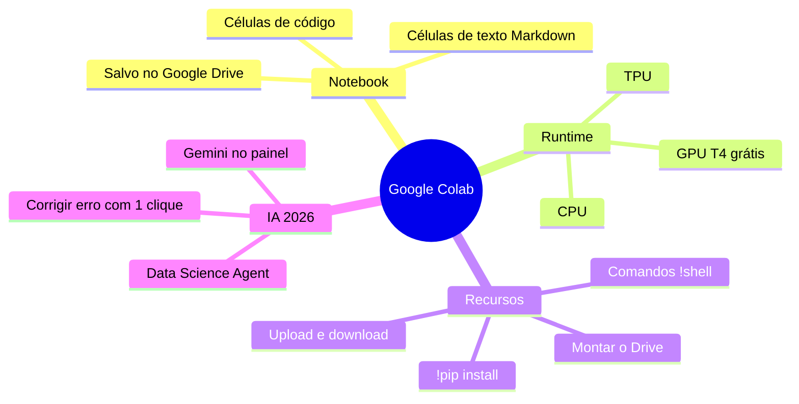

# Google Colaboratory

> [!quote] Seu laboratório de Python na nuvem
> *Colab é como um Google Docs para código: você abre o navegador, escreve Python, aperta um botão e ele roda em um computador do Google, com GPU de graça e zero instalação.*

![[colab-logo.png|220]]

---

## 🚀 O que é (e por que isso muda tudo)

> [!info] Definição
> O **Google Colaboratory** (Colab) é um serviço gratuito do Google que roda **notebooks Jupyter** dentro do navegador. Você escreve e executa código Python em uma máquina virtual hospedada na nuvem, sem instalar nada no seu computador.

A analogia mais honesta: instalar Python, pip, CUDA e drivers de GPU na sua máquina é como montar uma cozinha profissional só para fritar um ovo. O Colab é o restaurante já montado: você chega, senta e cozinha. A conta (a infraestrutura) é do Google.

> [!tip] Por que professores e pesquisadores adoram
> - **Zero instalação:** funciona no Chrome do laboratório, no notebook de casa, até no tablet.
> - **Mesmo ambiente para todos:** ninguém trava com "na minha máquina não roda".
> - **GPU/TPU de graça:** treinar uma rede neural sem ter placa de vídeo cara.
> - **Salva no Drive:** o notebook fica na sua conta Google, igual a um documento.

### Anatomia do Colab



---

## 🧩 Interface e Células

O Colab é organizado em **células**, blocos que você executa um a um e na ordem que quiser. Existem dois tipos:

| Tipo de célula | Para quê serve | Como rodar |
|----------------|----------------|------------|
| **Código** 🐍 | Escrever e executar Python | `Shift + Enter` ou botão ▶️ à esquerda |
| **Texto** 📝 | Explicações em Markdown (títulos, listas, fórmulas) | Apenas renderiza, não "executa" |

A imagem abaixo mostra um notebook real: à esquerda as células de código com a saída logo abaixo (um gráfico gerado), no topo o menu **Runtime** e o botão **Gemini**, e à direita um terminal.

![[colab-screenshot.png|Interface do Google Colab com células, saída e menu de Runtime]]

> [!info] A ordem importa, não a posição
> Uma variável criada na célula de cima continua existindo na de baixo, porque tudo compartilha a **mesma sessão**. Mas você pode rodar as células fora de ordem, e isso é a causa nº 1 de confusão para iniciantes: a célula 3 pode usar algo que só existe se você rodou a célula 5 antes. Quando der erro estranho, use **Runtime > Restart and run all** para começar do zero.

### Fluxo básico de uso


---

> [!example] 🧪 Atividade 1: Seu primeiro notebook
>
> **Onde:** [colab.research.google.com](https://colab.research.google.com/)
>
> **Passo a passo:**
> 1. Acesse o site e clique em **Novo notebook** (faça login com sua conta Google se pedir).
> 2. Na primeira célula de código, digite exatamente:
>
> ```python
> nome = "IFF"
> print(f"Olá, {nome}! Estou rodando na nuvem do Google.")
> print(2026 * 2)
> ```
>
> 3. Aperte **Shift + Enter** (ou clique no ▶️ à esquerda da célula).
>
> **Resultado observável:** logo abaixo da célula deve aparecer:
> ```
> Olá, IFF! Estou rodando na nuvem do Google.
> 4052
> ```
>
> **Entregável:** print da tela com a saída visível embaixo da célula.

---

## 💻 Runtimes e Aceleradores (GPU/TPU)

O **runtime** é a máquina virtual que executa seu código. Por padrão você ganha uma CPU, mas pode trocar por um acelerador de graça.

> [!tip] Como trocar de hardware
> Menu **Runtime > Change runtime type** (em português: **Ambiente de execução > Alterar o tipo de ambiente de execução**), escolha o acelerador e clique em **Save**.

| Acelerador | Para quê | Disponível no grátis? |
|-----------|----------|----------------------|
| **CPU** | Programação geral, dados pequenos | Sempre |
| **GPU (NVIDIA T4, 16 GB)** | Deep learning, treinar redes neurais, PyTorch/TensorFlow | Sim, sujeito a fila |
| **TPU** | Cargas grandes otimizadas para TensorFlow/JAX | Sim, sujeito a fila |

> [!warning] A GPU não é infinita
> No plano grátis a GPU é **emprestada**, não reservada. Em horários de pico você pode ouvir "não foi possível conectar a uma GPU". É normal: o Google prioriza quem paga. Para aprender, sobra de boa.

A imagem mental certa: trocar de runtime é como pedir para sentar numa mesa diferente do restaurante. A mesa "GPU" tem ferramentas melhores, mas tem menos cadeiras, então às vezes você espera.

---

> [!example] 🧪 Atividade 2: Ligar a GPU e provar que ela existe
>
> **Onde:** seu notebook do Colab.
>
> **Passo a passo:**
> 1. Vá em **Runtime > Change runtime type**, selecione **T4 GPU** e clique em **Save** (o ambiente reinicia).
> 2. Em uma célula, rode:
>
> ```python
> import torch
> print("PyTorch enxerga a GPU?", torch.cuda.is_available())
> if torch.cuda.is_available():
>     print("Modelo da GPU:", torch.cuda.get_device_name(0))
> ```
>
> **Resultado observável:** deve imprimir algo como:
> ```
> PyTorch enxerga a GPU? True
> Modelo da GPU: Tesla T4
> ```
>
> Se aparecer `False`, você não trocou o runtime para GPU (volte ao passo 1).
>
> **Entregável:** print mostrando `True` e o nome `Tesla T4`.

---

## 🔧 Comandos de Shell com `!` e o `!pip install`

Dentro de uma célula de código, qualquer linha que começa com **`!`** é executada como comando de **terminal Linux**, não como Python. É como ter um terminal embutido no caderno.

> [!info] Por que isso é poderoso
> A máquina do Colab é um Linux completo. Com `!` você instala bibliotecas, baixa arquivos, lista pastas, tudo sem sair do notebook.

```python
!pip install yfinance        # instala uma biblioteca
!ls                          # lista os arquivos da pasta atual
!pwd                         # mostra o diretório atual
!nvidia-smi                  # mostra detalhes da GPU alocada
```

> [!tip] `!pip` x bibliotecas já prontas
> O Colab já vem com NumPy, Pandas, Matplotlib, scikit-learn, PyTorch e TensorFlow **pré-instalados**. Você só usa `!pip install` para o que **não** vem de fábrica (ex.: `yfinance`, `transformers` em versão específica). Depois de instalar, é só `import` normal.

> [!warning] Instalação some quando a sessão morre
> Tudo que você instala com `!pip` vive só naquela sessão. Se o runtime reiniciar (ou você ficar inativo tempo demais), some, e você roda a célula de `!pip` de novo. Por isso o costume de deixar os `!pip install` na **primeira célula** do notebook.

---

> [!example] 🧪 Atividade 3: Instalar uma lib e usar o terminal embutido
>
> **Onde:** seu notebook do Colab.
>
> **Passo a passo:**
> 1. Rode, em uma célula só:
>
> ```python
> !pip install cowsay
> ```
>
> 2. Em outra célula, use a lib recém-instalada:
>
> ```python
> import cowsay
> cowsay.cow("Instalei isso na nuvem!")
> ```
>
> 3. Por fim, prove que `!` fala com o Linux:
>
> ```python
> !echo "Estou em:" && pwd && ls
> ```
>
> **Resultado observável:** uma vaquinha em ASCII com seu texto no balão, e depois o caminho `/content` com a lista de arquivos da sessão.
>
> **Entregável:** print da vaquinha + a saída do `pwd` mostrando `/content`.

---

## 📂 Montar o Google Drive

Por padrão, os arquivos que você cria no Colab ficam em `/content` e **somem quando a sessão acaba**. Para ter arquivos permanentes (datasets, modelos salvos, planilhas), você **monta o seu Google Drive** dentro do notebook.

> [!info] O que "montar" significa
> Montar é conectar uma pasta do seu Drive como se fosse uma pasta local do notebook. Depois disso, ler um arquivo do Drive é igual a ler um arquivo local: ele aparece em `/content/drive/MyDrive/`.

```python
from google.colab import drive
drive.mount('/content/drive')
```

Ao rodar, o Colab pede **autorização** (uma janela do Google para você liberar o acesso à sua própria conta). Depois de autorizar, seus arquivos ficam acessíveis:

```python
!ls "/content/drive/MyDrive"        # lista a raiz do seu Drive
```

> [!warning] Segurança
> Só monte o Drive em notebooks **seus** ou de confiança. Um notebook compartilhado por terceiros, com o Drive montado, teria acesso aos seus arquivos. Na dúvida, não monte.

---

> [!example] 🧪 Atividade 4: Montar o Drive e gravar um arquivo que sobrevive
>
> **Onde:** seu notebook do Colab.
>
> **Passo a passo:**
> 1. Monte o Drive e autorize na janela que abrir:
>
> ```python
> from google.colab import drive
> drive.mount('/content/drive')
> ```
>
> 2. Crie um arquivo de teste dentro do seu Drive:
>
> ```python
> caminho = "/content/drive/MyDrive/teste_colab.txt"
> with open(caminho, "w") as f:
>     f.write("Esse arquivo foi criado pelo Colab e está no meu Drive!")
> print("Arquivo salvo em:", caminho)
> ```
>
> 3. Confirme que ele existe no Drive:
>
> ```python
> !ls "/content/drive/MyDrive" | grep teste_colab
> ```
>
> **Resultado observável:** a mensagem `Arquivo salvo em: ...` e, no `ls`, a linha `teste_colab.txt`. Abra o [Google Drive](https://drive.google.com) no navegador: o arquivo está lá de verdade.
>
> **Entregável:** print do `ls` mostrando o `teste_colab.txt` + print do arquivo aparecendo no seu Drive web.

---

## ⬆️⬇️ Upload e Download de Arquivos

Além do Drive, dá para subir e baixar arquivos direto do seu computador, útil para um CSV avulso ou para baixar um resultado.

> [!tip] Dois jeitos de subir um arquivo
> 1. **Pela barra lateral:** clique no ícone de 📁 (Files) à esquerda e arraste o arquivo (vai para `/content`).
> 2. **Por código** (abre um seletor de arquivos):
>
> ```python
> from google.colab import files
> enviados = files.upload()      # abre janela para escolher do seu PC
> ```

Para **baixar** um arquivo gerado no Colab de volta para o seu computador:

```python
from google.colab import files
files.download("resultado.csv")
```

---

> [!example] 🧪 Atividade 5: Gerar um arquivo e baixar para o seu PC
>
> **Onde:** seu notebook do Colab.
>
> **Passo a passo:**
> 1. Gere um arquivo CSV simples com Pandas (já vem instalado):
>
> ```python
> import pandas as pd
> df = pd.DataFrame({"aluno": ["Ana", "Bruno", "Carla"], "nota": [8.5, 6.0, 9.0]})
> df.to_csv("notas.csv", index=False)
> print("CSV criado!")
> ```
>
> 2. Baixe o arquivo para o seu computador:
>
> ```python
> from google.colab import files
> files.download("notas.csv")
> ```
>
> **Resultado observável:** o navegador baixa `notas.csv`. Abra-o (Excel, bloco de notas) e confira as 3 linhas de alunos e notas.
>
> **Entregável:** print do arquivo `notas.csv` aberto no seu computador com os dados corretos.

---

## 🤖 IA dentro do Colab (Gemini, 2026)

Desde 2026 o Colab vem com um colaborador de IA **integrado**, baseado no **Gemini**, direto no notebook.

| Recurso de IA | O que faz |
|---------------|-----------|
| **Painel do Gemini** | Conversa em linguagem natural para gerar/explicar/transformar código |
| **Corrigir erro** | Quando uma célula dá erro, surge um botão que sugere a correção |
| **Data Science Agent** | Recebe um dataset e um objetivo ("visualize tendências", "treine um modelo") e gera o notebook inteiro de análise sozinho |

> [!warning] A IA é ajudante, não muleta
> Numa disciplina, o objetivo é **você** entender o que o código faz. Use o Gemini para destravar e aprender mais rápido, mas leia e teste o que ele gera. Código que você não entende é dívida técnica esperando para te atrapalhar na prova. O acesso aos recursos de IA exige conta Google com idade **18+**.

---

## ⏱️ Atalhos Úteis

> [!tip] Os que valem decorar
> | Atalho | Ação |
> |--------|------|
> | `Shift + Enter` | Roda a célula e vai para a próxima |
> | `Ctrl + Enter` | Roda a célula e fica nela |
> | `Alt + Enter` | Roda a célula e cria uma nova abaixo |
> | `Ctrl + M` depois `B` | Insere célula **abaixo** |
> | `Ctrl + M` depois `A` | Insere célula **acima** |
> | `Ctrl + M` depois `D` | Apaga a célula atual |
> | `Ctrl + M` depois `M` | Vira célula de **texto** (Markdown) |
> | `Ctrl + M` depois `Y` | Vira célula de **código** |

---

## 🚧 Limites do Plano Grátis (2026)

O Colab grátis é generoso, mas tem cercas. Conhecê-las evita perder trabalho.

| Limite | Valor aproximado (2026) | Implicação prática |
|--------|-------------------------|--------------------|
| **GPU** | NVIDIA T4 (16 GB), por fila | Pode não conectar em horário de pico |
| **Horas de GPU** | ~15 a 30 h por semana (dinâmico) | Estourou, volta pra CPU ou espera |
| **Sessão máxima** | até ~12 h contínuas | Treinos muito longos são cortados |
| **Inatividade** | desconecta após ociosidade | Deixar a aba parada derruba a sessão |
| **Arquivos em `/content`** | apagados ao encerrar | Salve o importante no Drive |

> [!success] E o Colab Pro?
> Para quem precisa de mais, há planos pagos (Pro / Pro+) com GPUs melhores e sessões mais longas, cobrados por **compute units**. Em 2026, o Google passou a oferecer **Colab Pro gratuito para estudantes e docentes** de instituições de ensino superior: vale conferir se a sua conta institucional dá direito.

> [!danger] Regra de ouro: salve sempre no Drive
> A causa nº 1 de "perdi tudo" no Colab é confiar que `/content` é permanente. Não é. Modelo treinado, dataset baixado, resultado gerado: mande para o Drive (Atividade 4) ou baixe para o PC (Atividade 5) **antes** de fechar.

---

## ⚖️ Colab x Jupyter Local

O Colab **é** um Jupyter, só que rodando no Google em vez de na sua máquina. Quando usar cada um?

| Critério | Google Colab ☁️ | Jupyter Local 💻 |
|----------|-----------------|------------------|
| **Instalação** | Nenhuma | Precisa instalar Python + Jupyter |
| **Hardware** | GPU/TPU grátis do Google | Só o do seu PC |
| **Internet** | Obrigatória | Funciona offline |
| **Persistência** | `/content` some; Drive permanece | Tudo fica no seu HD |
| **Privacidade dos dados** | Dados sobem para a nuvem | Ficam só na sua máquina |
| **Compartilhar** | Link, igual ao Google Docs | Manda o arquivo `.ipynb` |
| **Bibliotecas** | Maioria já vem pronta | Você instala cada uma |

> [!info] Regra prática
> **Colab** para aprender, prototipar, treinar modelos pesados sem ter GPU e colaborar. **Jupyter local** para trabalho offline, dados sensíveis que não podem sair da máquina, ou projetos longos que não cabem nos limites do grátis. O arquivo é o mesmo (`.ipynb`): dá para começar no Colab e baixar para rodar local depois.

---

## 🧠 Quiz Conceitual (opcional)

> [!question] Teste seu entendimento
> 1. Por que uma linha começada com `!` se comporta diferente do resto do código Python na célula?
> 2. Você instalou `transformers` com `!pip`, fechou o Colab e voltou no dia seguinte: precisa instalar de novo? Por quê?
> 3. Qual a diferença entre salvar um arquivo em `/content` e em `/content/drive/MyDrive`?
> 4. Em que situação o Jupyter local é preferível ao Colab, mesmo o Colab tendo GPU grátis?
> 5. Você trocou o runtime para GPU mas `torch.cuda.is_available()` retorna `False`. O que provavelmente aconteceu?

> [!success] Gabarito resumido
> 1. O `!` envia a linha para o **shell Linux** da máquina virtual, não para o interpretador Python.
> 2. **Sim**: instalações via `!pip` vivem só na sessão; ao reiniciar, somem.
> 3. `/content` é **temporário** (apaga ao encerrar); o Drive é **permanente** (fica na sua conta Google).
> 4. Quando os **dados são sensíveis** e não podem subir para a nuvem, ou quando se precisa trabalhar **offline** / por mais tempo que os limites do grátis.
> 5. O runtime provavelmente **não foi salvo como GPU** (ou a sessão reiniciou sem GPU): refazer **Runtime > Change runtime type > T4 GPU**.

---

## 📚 Veja também

- [[Jupyter Notebook]]
- [[JupyterLab]]
- [[Conceitos gerais de programação]]

---

> [!note] 📚 Fontes (2026)
> - [Google Colab: FAQ oficial](https://research.google.com/colaboratory/faq.html)
> - [Data Science Agent in Colab with Gemini (Google Developers Blog)](https://developers.googleblog.com/en/data-science-agent-in-colab-with-gemini/)
> - [Google launches free Gemini-powered Data Science Agent on Colab (VentureBeat)](https://venturebeat.com/ai/google-launches-free-gemini-powered-data-science-agent-on-its-colab-python-platform)
> - [The Complete Guide to Google Colab for Free AI Development (AI Fire)](https://www.aifire.co/p/the-complete-guide-to-google-colab-for-free-ai-development)
> - [Google Colab GPU: free access, limits, and alternatives (Hivenet)](https://www.hivenet.com/post/google-colaboratory-gpu-complete-guide-to-free-cloud-gpu-access-and-limitations)
> - [Google Colab Free Tier: T4 GPU Access Guide 2026 (AICreditMart)](https://aicreditmart.com/ai-credits-providers/google-colab-free-tier-t4-gpu-access-guide-2026/)
> - [Kaggle vs Google Colab in 2026 (Medium)](https://lalatenduswain.medium.com/kaggle-vs-google-colab-which-cloud-notebook-platform-should-you-choose-in-2026-da053a02fcb7)
> - [How to Mount Google Drive in Google Colab (Medium)](https://medium.com/@wl8380/how-to-mount-google-drive-in-google-colab-c688ec8eccb7)
