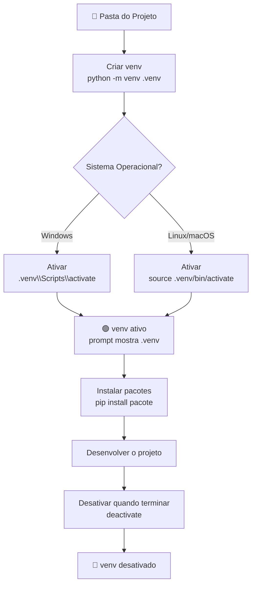

# Instalação e Configurações

> [!quote] Preparando o Ambiente
> *Antes de programar, precisamos preparar as ferramentas certas.*

---

## 🛠️ Requisitos

> [!info] O que você precisa

| Ferramenta | Obrigatório | Descrição |
|------------|-------------|-----------|
| **Python 3** | ✅ | Linguagem de programação principal |
| **VS Code** | ✅ | Editor de código moderno e gratuito |
| **Python Extension** | ✅ | Extensão oficial da Microsoft para VS Code |
| **IPython** | ❌ | Prompt interativo melhorado (opcional) |
| **Jupyter Notebook** | ❌ | Ambiente para notebooks interativos (opcional) |

> [!tip] Alternativa Online
> Ao invés do VS Code, também é possível utilizar IDEs online como o [Replit](https://replit.com/). Útil quando não é possível instalar programas no computador.

> [!warning] Versão mínima recomendada
> Use sempre **Python 3.10 ou superior**. A versão mais recente estável em 2026 é a **Python 3.13.x**. Versões antigas podem não ter suporte a bibliotecas modernas.

---

## 🐍 Instalando Python no Windows

🔗 [Python Brasil: Instalando o Python 3 no Windows](https://python.org.br/instalacao-windows/)
🔗 [Download oficial Python.org](https://www.python.org/downloads/)

### Passo a passo detalhado

1. Acesse [python.org/downloads](https://www.python.org/downloads/) e clique em **Download Python 3.13.x**.
2. Execute o instalador baixado (`.exe`).
3. **IMPORTANTE:** marque a opção **"Add Python to PATH"** antes de clicar em Install Now.
4. Clique em **Install Now** e aguarde a instalação terminar.
5. Clique em **Close** ao finalizar.

> [!danger] Não esqueça o PATH!
> Se você não marcar "Add Python to PATH" durante a instalação, o terminal não vai reconhecer o comando `python`. Se isso acontecer, reinstale o Python marcando essa opção.

**Verificar a versão instalada no terminal:**

```bash
python --version
```

Resultado esperado (pode variar conforme a versão):

```
Python 3.13.3
```

> [!example] 🧪 Atividade 1: Instalar o Python e confirmar a versão
>
> **O que fazer:**
> 1. Baixe e instale o Python 3.13.x em [python.org/downloads](https://www.python.org/downloads/), marcando "Add Python to PATH".
> 2. Abra o **Prompt de Comando** (tecle `Win + R`, digite `cmd`, Enter).
> 3. Digite o comando abaixo e pressione Enter:
>
> ```bash
> python --version
> ```
>
> 4. Agora execute o Python interativo e escreva um Hello World:
>
> ```bash
> python
> ```
>
> Dentro do interpretador, digite:
>
> ```python
> print("Olá, mundo!")
> ```
>
> **Resultado esperado:** o terminal exibe `Olá, mundo!` na próxima linha.
> Para sair do interpretador, digite `exit()` e pressione Enter.

---

## 📦 Gerenciador de Pacotes (PIP)

> [!info] O que é PIP?
> O **pip** é o gerenciador de pacotes oficial do Python. Ele já vem instalado automaticamente junto com o Python 3. Com o pip você instala bibliotecas de terceiros, como **NumPy**, **Pandas**, **Requests** e milhares de outras disponíveis no [PyPI](https://pypi.org/).

🔗 [pip: gerenciador de pacotes Python](https://pt.wikipedia.org/wiki/Pip_(gerenciador_de_pacotes))
🔗 [Guia oficial de instalação de pacotes](https://packaging.python.org/tutorials/installing-packages/)

**Verificar a versão do pip:**

```bash
pip --version
```

**Instalar um pacote:**

```bash
pip install nome-do-pacote
```

**Instalar uma versão específica:**

```bash
pip install requests==2.31.0
```

**Listar pacotes instalados:**

```bash
pip list
```

**Desinstalar um pacote:**

```bash
pip uninstall nome-do-pacote
```

| Comando pip | O que faz |
|-------------|-----------|
| `pip install pacote` | Instala o pacote mais recente |
| `pip install pacote==x.y` | Instala versão específica |
| `pip list` | Lista todos os pacotes instalados |
| `pip show pacote` | Mostra detalhes de um pacote |
| `pip uninstall pacote` | Remove o pacote |
| `pip freeze > requirements.txt` | Salva lista de dependências em arquivo |

---

## 🧪 Ambientes Virtuais (venv)

> [!info] Por que usar ambientes virtuais?
> Imagine dois projetos: um precisa da versão 1.0 de uma biblioteca e outro precisa da versão 2.0. Se instalarmos tudo no Python global, os dois vão entrar em conflito. O **venv** cria um Python isolado para cada projeto, resolvendo esse problema. É uma boa prática desde o início.

🔗 [Documentação oficial: venv](https://docs.python.org/3/library/venv.html)
🔗 [Guia prático: pip e venv](https://packaging.python.org/guides/installing-using-pip-and-virtual-environments/)

### Fluxo do ambiente virtual



### Comandos passo a passo

**1. Criar o ambiente virtual (dentro da pasta do projeto):**

```bash
python -m venv .venv
```

> O nome `.venv` é uma convenção, mas você pode usar qualquer nome.

**2. Ativar o ambiente virtual:**

No Windows (Prompt de Comando):
```bash
.venv\Scripts\activate
```

No Linux/macOS:
```bash
source .venv/bin/activate
```

**3. Confirmar que o venv está ativo:**

O prompt do terminal vai mostrar `(.venv)` no início, assim:
```
(.venv) C:\Projetos\meu-projeto>
```

**4. Instalar pacotes dentro do ambiente:**

```bash
pip install requests
```

**5. Desativar o ambiente quando terminar:**

```bash
deactivate
```

> [!example] 🧪 Atividade 3: Criar um ambiente virtual e instalar um pacote
>
> **O que fazer:**
> 1. Crie uma pasta chamada `meu-projeto` na sua área de trabalho.
> 2. Abra o terminal e navegue até ela:
>
> ```bash
> cd Desktop\meu-projeto
> ```
>
> 3. Crie o ambiente virtual:
>
> ```bash
> python -m venv .venv
> ```
>
> 4. Ative o ambiente:
>
> Windows: `.venv\Scripts\activate`
> Linux/macOS: `source .venv/bin/activate`
>
> 5. Instale o pacote `requests`:
>
> ```bash
> pip install requests
> ```
>
> 6. Confirme que foi instalado:
>
> ```bash
> pip list
> ```
>
> **Resultado esperado:** a lista mostra `requests` e suas dependências (`certifi`, `charset-normalizer`, `urllib3`).
>
> 7. Desative o venv:
>
> ```bash
> deactivate
> ```

---

## 💻 IPython (Opcional)

> [!tip] Prompt Interativo Melhorado
> O **IPython** acrescenta recursos ao interpretador padrão do Python: realce de sintaxe colorido, autocompletar com Tab, histórico de comandos persistente entre sessões e exibição formatada de dados. Muito útil para explorar código e testar ideias rapidamente.

🔗 [Instalando o IPython](https://ipython.org/install.html)

**Instalar o IPython:**

```bash
pip install ipython
```

**Iniciar o IPython:**

```bash
ipython
```

---

## 🌐 IDE Online

> [!info] Programar no Navegador
> Se você não puder instalar nada no computador, use uma IDE online. O **Replit** permite criar projetos Python, escrever código e executar direto no navegador, sem instalar nada.

🔗 [Replit: IDE colaborativa no navegador](http://replit.com)

| IDE Online | Vantagem principal |
|------------|-------------------|
| [Replit](https://replit.com) | Simples, colaborativo, suporta Python |
| [Google Colab](https://colab.research.google.com) | Ótimo para ciência de dados e notebooks |
| [Programiz](https://www.programiz.com/python-programming/online-compiler/) | Minimalista, ideal para iniciantes |

---

## 📥 VS Code

🔗 [Download Visual Studio Code: Mac, Linux, Windows](https://code.visualstudio.com/download)

### Por que usar o VS Code?

O **Visual Studio Code** (VS Code) é um editor de código gratuito, leve e extremamente popular. Ele funciona em Windows, Linux e macOS. Com extensões, vira uma IDE completa para Python com realce de sintaxe, autocompletar inteligente, depurador integrado e suporte a Git.

### Passo a passo de instalação

1. Acesse [code.visualstudio.com/download](https://code.visualstudio.com/download).
2. Clique em **Windows** (ou no seu sistema operacional).
3. Execute o instalador baixado.
4. Aceite o contrato de licença e clique em **Próximo**.
5. Na etapa "Tarefas Adicionais", marque **"Adicionar ao PATH"** e **"Abrir com Code"** (facilita abrir pastas pelo Explorer).
6. Clique em **Instalar** e depois em **Concluir**.

### Extensão obrigatória: Python (Microsoft)

Após instalar o VS Code, instale a extensão oficial do Python:

1. Abra o VS Code.
2. Clique no ícone de extensões na barra lateral (ou pressione `Ctrl+Shift+X`).
3. Na barra de busca, digite `Python`.
4. Clique em **Install** na extensão **Python** da Microsoft (ícone azul oficial).

> [!success] Extensões recomendadas para Python
> | Extensão | Publisher | Para que serve |
> |----------|-----------|----------------|
> | Python | Microsoft | Suporte completo a Python (obrigatória) |
> | Pylance | Microsoft | Autocompletar avançado e verificação de tipos |
> | Jupyter | Microsoft | Suporte a notebooks `.ipynb` no VS Code |
> | Python Environments | Microsoft | Gerenciamento visual de venvs (2025+) |

> [!example] 🧪 Atividade 2: Instalar o VS Code e a extensão Python, depois rodar um Hello World
>
> **O que fazer:**
> 1. Instale o VS Code seguindo os passos acima.
> 2. Abra o VS Code e instale a extensão **Python** da Microsoft (`Ctrl+Shift+X`, buscar "Python", instalar).
> 3. Crie um arquivo novo: `Arquivo > Novo Arquivo` e salve como `hello.py`.
> 4. Digite o código abaixo no arquivo:
>
> ```python
> print("Olá, mundo! Estou programando no VS Code.")
> ```
>
> 5. Execute o arquivo clicando no botão de play (triângulo) no canto superior direito, ou pressione `Ctrl+F5`.
>
> **Resultado esperado:** o terminal integrado do VS Code abre na parte inferior e exibe:
> ```
> Olá, mundo! Estou programando no VS Code.
> ```

---

## 🗺️ Visão Geral do Fluxo de Setup

```mermaid
flowchart LR
    A[🖥️ Computador\nsem configuração] --> B[1. Instalar Python 3.13\npython.org/downloads]
    B --> C[2. Verificar instalação\npython --version]
    C --> D[3. Instalar VS Code\ncode.visualstudio.com]
    D --> E[4. Instalar extensão Python\nCtrl+Shift+X]
    E --> F[5. Criar projeto\nnova pasta]
    F --> G[6. Criar venv\npython -m venv .venv]
    G --> H[7. Ativar venv\nactivate]
    H --> I[✅ Ambiente pronto\npara programar!]
```



---

> [!note] 📚 Fontes (2026)
> - [Python 3.13: versão mais recente e releases (python.org)](https://www.python.org/downloads/)
> - [Python Releases for Windows (python.org)](https://www.python.org/downloads/windows/)
> - [Python environments in VS Code (code.visualstudio.com)](https://code.visualstudio.com/docs/python/environments)
> - [Python Environments Extension para VS Code (marketplace)](https://marketplace.visualstudio.com/items?itemName=ms-python.vscode-python-envs)
> - [Install packages in a virtual environment using pip and venv (packaging.python.org)](https://packaging.python.org/guides/installing-using-pip-and-virtual-environments/)
> - [venv: criação de ambientes virtuais (docs.python.org)](https://docs.python.org/3/library/venv.html)
> - [pip e venv: guia prático (python.land)](https://python.land/virtual-environments/virtualenv)
> - [IPython: instalação e uso (ipython.org)](https://ipython.org/install.html)
