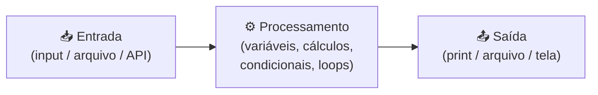
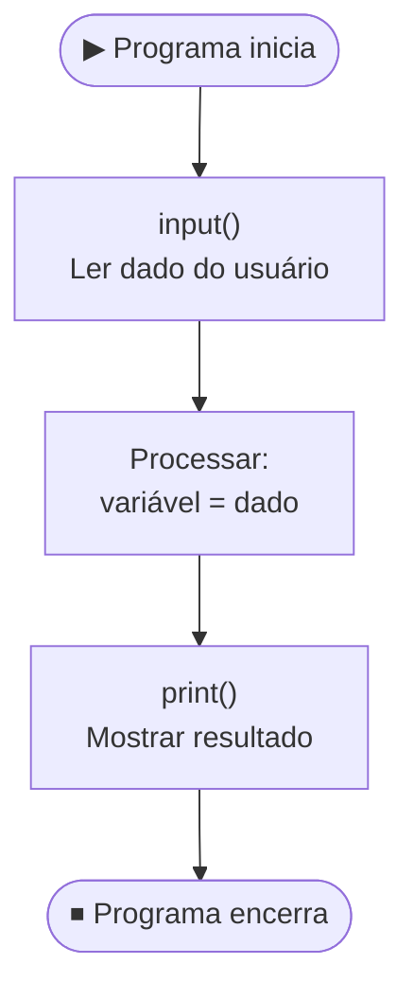
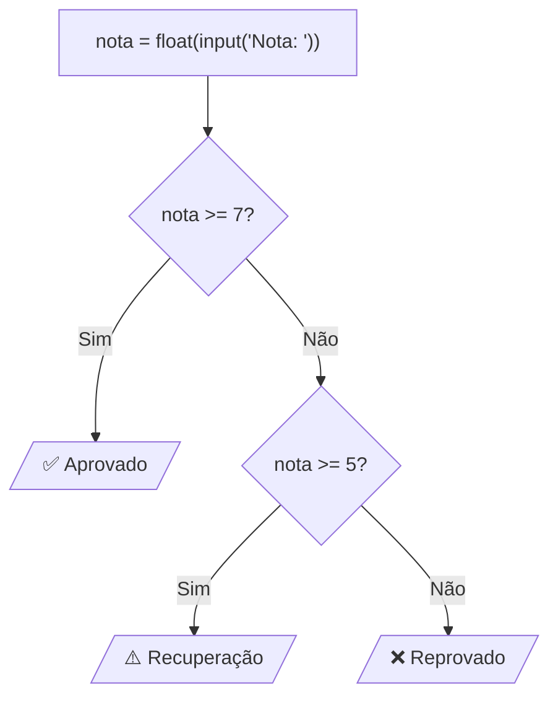
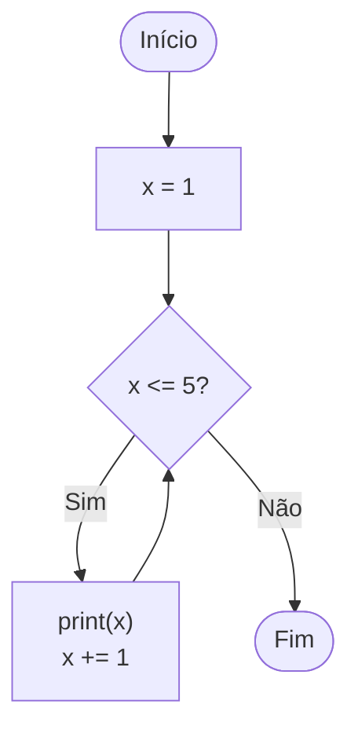
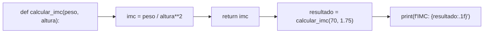

# Introdução à Programação com Python

> [!quote] Fundamentos Essenciais
> *Programar é criar instruções que o computador executa. Python é simples, moderno e ideal para iniciantes.*

---

## 🐍 01: Introdução

Python permite construir soluções de forma clara e rápida.

```python
print("Olá, mundo!")
```

### Por que Python em 2026?

Python é, em 2026, a linguagem de programação mais popular do mundo. Não é apenas um dado curioso: é o resultado de uma combinação de simplicidade, versatilidade e demanda de mercado que nenhuma outra linguagem conseguiu superar.

**Dados que comprovam:**

| Índice / Ranking | Posição do Python | Dado atual |
|---|---|---|
| TIOBE Index (jun/2026) | 🥇 1º lugar | 21,81% de participação |
| IEEE Spectrum (2025) | 🥇 1º em Geral, Tendências e Empregos | Primeira vez na história |
| PYPL Index (out/2025) | 🥇 1º lugar | 29,4% de participação |
| Stack Overflow Survey 2025 | 🥇 34% dos devs têm Python como idioma primário | maior alta anual (+7 pp) |

Python está presente em inteligência artificial, ciência de dados, automação, desenvolvimento web, bioinformática, finanças e muito mais. Aprender Python não é apenas aprender a programar: é ter acesso a um dos ecossistemas de tecnologia mais ricos da história.

### Versões atuais (2025-2026)

```
Python 3.13  →  lançado outubro 2024  (versão estável mais usada)
Python 3.14  →  lançado outubro 2025  (mais recente, com melhorias de erro e t-strings)
```

**Destaques do Python 3.13 e 3.14 para iniciantes:**

- Mensagens de erro muito mais claras e úteis: quando você erra, o Python 3.13+ explica em português técnico simples o que deu errado e sugere uma correção
- REPL com destaque de sintaxe em cores e edição multi-linha: o terminal interativo ficou moderno
- Modo sem GIL (experimental): Python pode agora aproveitar melhor processadores multi-núcleo
- t-strings (3.14): uma forma mais controlada de interpolar texto, além das f-strings já conhecidas

> [!tip] 💡 Versão recomendada
> Use Python 3.13 ou 3.14 para novos projetos em 2026. Ambas têm suporte ativo e são as versões mais instaladas pelos gestores de pacotes modernos (pip, uv, conda).

---

## 🗺️ Como funciona um programa Python?

Todo programa, por mais complexo que seja, segue o mesmo fluxo básico: recebe dados, processa e entrega um resultado.



Esse diagrama se aplica desde o exemplo mais simples (pedir um nome e exibir uma saudação) até os sistemas mais sofisticados (receber dados de sensores, processar com IA e enviar alertas).



---

> [!example] 🧪 Atividade 1: Seu primeiro programa no Replit ou Google Colab
>
> **Ferramenta:** [replit.com](https://replit.com) (crie conta gratuita) **ou** [colab.research.google.com](https://colab.research.google.com) (usa conta Google)
>
> **O que fazer:**
> 1. Abra o Replit ou o Colab no navegador (sem instalar nada)
> 2. Crie um novo arquivo Python
> 3. Digite e execute o código abaixo:
>
> ```python
> nome = input("Qual é o seu nome? ")
> idade = int(input("Quantos anos você tem? "))
> ano_nascimento = 2026 - idade
>
> print(f"Olá, {nome}!")
> print(f"Você nasceu por volta de {ano_nascimento}.")
>
> # Calculadora simples
> a = float(input("Digite o primeiro número: "))
> b = float(input("Digite o segundo número: "))
>
> print(f"\nSoma:       {a + b}")
> print(f"Subtração:  {a - b}")
> print(f"Produto:    {a * b}")
>
> if b != 0:
>     print(f"Divisão:    {a / b:.2f}")
> else:
>     print("Divisão:    impossível (divisão por zero)")
> ```
>
> **Resultado observável:** O programa pergunta seu nome, sua idade e dois números. Ele exibe uma saudação personalizada com o ano de nascimento calculado e os quatro resultados matemáticos. Você vê na tela que o Python leu seus dados, calculou e respondeu, completando o ciclo entrada → processamento → saída.

---

## 📥 02: Entrada e Saída, Variáveis e Tipos 🔢

> [!info] Conceito
> Entrada e saída permitem conversar com o usuário. Variáveis guardam dados e os tipos definem como o Python entende esses valores.

```python
nome = input("Seu nome: ")
idade = int(input("Sua idade: "))
print(f"{nome} tem {idade} anos.")
```

### Tipos de dados fundamentais

| Tipo | Exemplo | Para que serve |
|---|---|---|
| `int` | `42` | Números inteiros: contagem, idades, índices |
| `float` | `3.14` | Números decimais: medidas, notas, preços |
| `str` | `"Python"` | Texto: nomes, mensagens, comandos |
| `bool` | `True` / `False` | Verdadeiro/Falso: condições e lógica |

### Como o Python converte tipos

```python
# Sem conversão: tudo que vem do input() é str
valor = input("Digite um número: ")
print(type(valor))   # <class 'str'>

# Com conversão explícita
numero = int(valor)
print(type(numero))  # <class 'int'>
```

> [!warning] ⚠️ Erro comum de iniciante
> Esquecer de converter o tipo é o erro mais frequente nos primeiros programas. Se você tentar somar `"5"` com `3`, o Python vai reclamar. Sempre use `int()`, `float()` ou `str()` para converter conforme necessário.

### f-strings: a forma moderna de formatar texto

```python
produto = "notebook"
preco = 3499.90
desconto = 0.10

preco_final = preco * (1 - desconto)

print(f"Produto: {produto.upper()}")
print(f"Preço com {desconto*100:.0f}% de desconto: R$ {preco_final:.2f}")
```

> [!tip] 💡 F-strings desde Python 3.6
> O prefixo `f` antes das aspas permite inserir expressões Python diretamente no texto usando chaves `{}`. É a forma mais legível e moderna de formatar saída, e funciona com qualquer expressão válida em Python.

---

> [!example] 🧪 Atividade 2: Ficha pessoal interativa
>
> **Ferramenta:** Replit, Google Colab ou terminal local com Python 3.13+
>
> **O que fazer:** escreva e execute o programa abaixo completo, digitando seus dados reais quando solicitado.
>
> ```python
> print("=== Ficha Pessoal ===\n")
>
> nome  = input("Nome completo: ")
> idade = int(input("Idade: "))
> curso = input("Curso: ")
> nota  = float(input("Sua nota favorita (0 a 10): "))
>
> print("\n--- Resultado ---")
> print(f"Aluno(a): {nome}")
> print(f"Idade:    {idade} anos")
> print(f"Curso:    {curso}")
> print(f"Nota:     {nota:.1f}")
>
> if nota >= 7.0:
>     situacao = "Aprovado(a) com folga!"
> elif nota >= 5.0:
>     situacao = "Em recuperação."
> else:
>     situacao = "Precisa estudar mais."
>
> print(f"Situação: {situacao}")
> ```
>
> **Resultado observável:** O terminal exibe uma ficha formatada com todos os dados que você digitou, incluindo uma mensagem de situação que muda conforme a nota informada. Você vê em ação: `input()`, conversão de tipos, `f-string`, condicional e impressão formatada, tudo junto.

---

## 🔀 03: Estrutura Condicional 🔀

> [!info] Conceito
> Condições decidem caminhos diferentes com `if`, `elif` e `else`. Essencial para regras, permissões e validações.

```python
nota = float(input("Nota: "))

if nota >= 7:
    print("Aprovado")
elif nota >= 5:
    print("Recuperação")
else:
    print("Reprovado")
```

### Fluxo visual de uma condicional



### Operadores de comparação

| Operador | Significado | Exemplo |
|---|---|---|
| `==` | Igual a | `nota == 10` |
| `!=` | Diferente de | `status != "ativo"` |
| `>` | Maior que | `idade > 18` |
| `<` | Menor que | `preco < 100` |
| `>=` | Maior ou igual | `nota >= 7` |
| `<=` | Menor ou igual | `saldo <= 0` |

---

## 🔗 04: Operadores Lógicos 🧩

> [!info] Conceito
> Operadores `and`, `or`, `not` criam regras mais complexas. Muito usados em login e filtros.

```python
email = "admin"
senha = "123"

if email == "admin" and senha == "123":
    print("Acesso liberado")
```

### Tabela verdade simplificada

| Expressão | Resultado |
|---|---|
| `True and True` | `True` |
| `True and False` | `False` |
| `False or True` | `True` |
| `False or False` | `False` |
| `not True` | `False` |
| `not False` | `True` |

```python
# Exemplo prático: validação de faixa de temperatura
temperatura = float(input("Temperatura (°C): "))

if temperatura >= 36.0 and temperatura <= 37.5:
    print("Temperatura normal.")
elif temperatura > 37.5:
    print("Febre detectada!")
else:
    print("Hipotermia: busque assistência médica.")
```

---

## 🔄 05: Estruturas de Repetição (While) ♻️

> [!info] Conceito
> O `while` repete enquanto uma condição é verdadeira. Ótimo para menus e rotinas contínuas.

```python
x = 1
while x <= 5:
    print(x)
    x += 1
```

### Fluxo do while



### While com menu interativo

```python
opcao = ""
while opcao != "0":
    print("\n=== Menu Principal ===")
    print("1 - Saudação")
    print("2 - Somar dois números")
    print("0 - Sair")

    opcao = input("Escolha: ")

    if opcao == "1":
        print("Olá! Bem-vindo ao programa.")
    elif opcao == "2":
        a = float(input("Primeiro número: "))
        b = float(input("Segundo número: "))
        print(f"Soma: {a + b}")
    elif opcao != "0":
        print("Opção inválida. Tente novamente.")

print("Até logo!")
```

> [!warning] ⚠️ Cuidado com laço infinito
> Se a condição do `while` nunca se tornar `False`, o programa nunca para. Sempre garanta que algo dentro do laço altera a condição de saída.

---

## 📋 06: Listas e For 📝

> [!info] Conceito
> Listas guardam vários dados e o `for` percorre esses valores.

```python
nomes = ["Ana", "João", "Pedro"]

for nome in nomes:
    print(nome)
```

### Operações comuns com listas

```python
notas = [8.5, 7.0, 9.2, 6.3, 5.5]

# Percorrer com índice
for i, nota in enumerate(notas):
    print(f"Aluno {i+1}: {nota}")

# Filtrar valores
aprovados = [n for n in notas if n >= 7]
print(f"Aprovados: {aprovados}")

# Calcular média
media = sum(notas) / len(notas)
print(f"Média da turma: {media:.2f}")
```

### `range()`: gerar sequências numéricas

```python
# De 0 a 4
for i in range(5):
    print(i)

# De 1 a 10
for i in range(1, 11):
    print(i)

# Tabuada do 7
for i in range(1, 11):
    print(f"7 x {i} = {7 * i}")
```

| Função | O que faz |
|---|---|
| `len(lista)` | Retorna o tamanho da lista |
| `append(item)` | Adiciona item ao final |
| `remove(item)` | Remove primeira ocorrência |
| `sort()` | Ordena a lista |
| `sum(lista)` | Soma todos os valores numéricos |

---

## 📖 07: Dicionários 🗂️

> [!info] Conceito
> Dicionários funcionam como um "mini banco de dados": cada valor tem uma chave.

```python
aluno = {
    "nome": "Maria",
    "idade": 17,
    "nota": 9
}

print(aluno["nome"])
```

### Quando usar dicionário vs lista?

| Situação | Usar |
|---|---|
| Sequência de itens iguais (notas, nomes) | Lista `[]` |
| Dados com atributos diferentes (produto, aluno, config) | Dicionário `{}` |

```python
# Cadastro com múltiplos dicionários
produtos = [
    {"nome": "Notebook", "preco": 3499.90, "estoque": 5},
    {"nome": "Mouse",    "preco":   89.90, "estoque": 23},
    {"nome": "Teclado",  "preco":  149.90, "estoque": 12},
]

for p in produtos:
    disponivel = "Disponível" if p["estoque"] > 0 else "Esgotado"
    print(f"{p['nome']:10s} R$ {p['preco']:7.2f}  {disponivel}")
```

---

## ⚙️ 08: Funções 🛠️

> [!info] Conceito
> Funções organizam o código, evitam repetição e deixam tudo mais limpo.

```python
def soma(a, b):
    return a + b

print(soma(5, 3))
```

### Anatomia de uma função



### Funções com valor padrão e múltiplos retornos

```python
def avaliar_nota(nota, turma="TI"):
    """Recebe uma nota e retorna a situação do aluno."""
    if nota >= 7.0:
        situacao = "Aprovado"
    elif nota >= 5.0:
        situacao = "Recuperação"
    else:
        situacao = "Reprovado"

    return situacao, turma   # Retorna uma tupla

sit, t = avaliar_nota(8.5)
print(f"Turma {t}: {sit}")
```

> [!tip] 💡 Boas práticas de funções
> - Nome em minúsculas com underscore: `calcular_media()`, `buscar_aluno()`
> - Cada função faz **uma coisa só**
> - Docstring (comentário entre `"""`) descreve o propósito
> - Use `return` para devolver o resultado, nunca apenas `print()` dentro da função se o valor precisar ser reutilizado

---

## 🌐 09: Biblioteca `random`, seu primeiro pacote 📦

> [!info] Conceito
> Python vem com dezenas de bibliotecas embutidas. A `random` permite sortear valores, simular dados e criar jogos. É um excelente primeiro contato com o ecossistema de bibliotecas da linguagem.

```python
import random

# Número inteiro aleatório entre 1 e 100
numero = random.randint(1, 100)
print(f"Número sorteado: {numero}")

# Escolher item aleatório de uma lista
frutas = ["maçã", "banana", "laranja", "uva", "manga"]
fruta_do_dia = random.choice(frutas)
print(f"Fruta do dia: {fruta_do_dia}")

# Embaralhar uma lista
deck = ["A", "K", "Q", "J", "10", "9", "8", "7"]
random.shuffle(deck)
print(f"Baralho embaralhado: {deck}")
```

### Jogo de adivinhação completo

```python
import random

segredo = random.randint(1, 20)
tentativas = 0
acertou = False

print("Adivinhe o número entre 1 e 20!")

while not acertou:
    palpite = int(input("Seu palpite: "))
    tentativas += 1

    if palpite < segredo:
        print("Muito baixo! Tente maior.")
    elif palpite > segredo:
        print("Muito alto! Tente menor.")
    else:
        acertou = True
        print(f"Parabéns! Você acertou em {tentativas} tentativa(s)!")
```

---

> [!example] 🧪 Atividade 3: Usando uma biblioteca real (random ou requests)
>
> **Ferramenta:** Replit ou Google Colab (ambos têm `random` embutido e `requests` disponível)
>
> **Opção A (random, sem instalar nada):** Execute o jogo de adivinhação acima. Depois modifique para:
> - Limitar a 5 tentativas (use um contador e adicione um `if tentativas >= 5: break`)
> - Ao final, mostrar quantas tentativas foram usadas e se o jogador ganhou ou perdeu
>
> **Opção B (requests, para quem quer ir além):** Execute no Replit ou Colab:
>
> ```python
> import requests
>
> resposta = requests.get("https://yesno.wtf/api")
> dados = resposta.json()
>
> print(f"Pergunta ao universo... Resposta: {dados['answer'].upper()}")
> print(f"GIF ilustrativo: {dados['image']}")
> ```
>
> **Resultado observável (Opção A):** O programa sorteia um número secreto e você interage em tempo real, vendo as dicas "muito alto" e "muito baixo" até acertar ou esgotar as tentativas. Você verifica que a biblioteca `random` gera valores diferentes a cada execução.
>
> **Resultado observável (Opção B):** O programa acessa uma API real na internet e exibe "YES" ou "NO" com um link de GIF. Você confirma que Python pode consumir dados da web com apenas 3 linhas de código.

---

## 🗄️ 10: Python + MySQL 💾

> [!info] Conceito
> Python pode se conectar a bancos de dados e executar comandos SQL.

```python
import mysql.connector

con = mysql.connector.connect(
    host="localhost",
    user="root",
    password="1234"
)

print("Conectado ao MySQL!")
```

> [!tip] 💡 Antes de rodar este exemplo
> Você precisa ter o MySQL instalado localmente e a biblioteca `mysql-connector-python` instalada via `pip install mysql-connector-python`. Em aula, usaremos um servidor de banco de dados configurado pelo professor ou um ambiente em nuvem.

---

## 📁 11: Manipulação de Arquivos 🗃️

> [!info] Conceito
> Salvar informações em arquivos permite persistência dos dados.

```python
with open("dados.txt", "w") as arq:
    arq.write("Primeira linha!")
```

### Modos de abertura de arquivos

| Modo | Descrição |
|---|---|
| `"r"` | Leitura (padrão): o arquivo deve existir |
| `"w"` | Escrita: cria ou sobrescreve o arquivo |
| `"a"` | Append: adiciona ao final sem apagar |
| `"r+"` | Leitura e escrita |

```python
# Escrever múltiplas linhas
nomes = ["Ana", "João", "Pedro", "Maria"]

with open("turma.txt", "w", encoding="utf-8") as f:
    for nome in nomes:
        f.write(nome + "\n")

# Ler e exibir o arquivo
with open("turma.txt", "r", encoding="utf-8") as f:
    conteudo = f.read()

print("Conteúdo do arquivo:")
print(conteudo)
```

---

## 🌐 12: Acesso a APIs 🔗

> [!info] Conceito
> APIs permitem trazer dados da internet para o programa.

```python
import requests

res = requests.get("https://api.github.com")
print(res.json())
```

### Consumindo uma API de CEP

```python
import requests

cep = input("Digite um CEP (somente números): ")
url = f"https://viacep.com.br/ws/{cep}/json/"

resposta = requests.get(url)

if resposta.status_code == 200:
    dados = resposta.json()

    if "erro" not in dados:
        print(f"\nLogradouro: {dados['logradouro']}")
        print(f"Bairro:     {dados['bairro']}")
        print(f"Cidade:     {dados['localidade']}")
        print(f"Estado:     {dados['uf']}")
    else:
        print("CEP não encontrado.")
else:
    print(f"Erro na requisição: status {resposta.status_code}")
```

> [!tip] 💡 O que é uma API?
> API (Application Programming Interface) é como um garçom entre você e a cozinha de um restaurante. Você faz um pedido (requisição HTTP), o servidor processa e devolve um prato (resposta JSON). A biblioteca `requests` é o garçom do Python, e praticamente todo serviço moderno da internet oferece uma API.

---

## 📝 Lista de Exercícios 📚

### 1. Variáveis e Entrada

Crie um programa que pergunta **nome**, **idade** e **profissão** e exibe tudo organizado.

### 2. Condicionais

Receba a velocidade de um carro e exiba: "Dentro do limite", "Acima do limite" ou "Multa grave".

### 3. Operadores Lógicos

Simule login com **usuário**, **senha** e validação de idade (>=18).

### 4. While

Crie um menu: 1 para mostrar "Olá", 2 para somar dois números, 0 para sair.

### 5. Listas

Peça 5 números, coloque numa lista e exiba apenas os maiores que 100.

### 6. Dicionários

Crie um dicionário de produto com nome, preço, estoque e imprima tudo.

### 7. Funções

Crie uma função que recebe um número e retorna se é **par** ou **ímpar**.

### 8. Arquivos

Crie um programa que recebe um texto e salva em `anotacao.txt`.

### 9. API

Consuma a API `https://yesno.wtf/api` e mostre a resposta na tela.

### 10. Projeto Final

Monte um mini sistema que: recebe dados do usuário, armazena em lista, salva em arquivo e exibe um relatório final.

---

> [!note] 📚 Fontes (2026)
>
> - [Python.org: What's New in Python 3.13](https://docs.python.org/3/whatsnew/3.13.html)
> - [Python.org: What's New in Python 3.14](https://docs.python.org/3/whatsnew/3.14.html)
> - [Real Python: Python 3.13 New Features](https://realpython.com/python313-new-features/)
> - [Real Python: Python 3.14 Better Error Messages](https://realpython.com/python314-error-messages/)
> - [TIOBE Index for June 2026, TechRepublic](https://www.techrepublic.com/article/news-tiobe-index-language-rankings/)
> - [Python Stays #1, Slashdot/TIOBE (mai/2026)](https://developers.slashdot.org/story/26/05/17/0252216/python-stays-1-r-rises-in-popularity-says-tiobe)
> - [Python statistics 2026, Pynions](https://pynions.com/python-statistics)
> - [Stack Overflow Developer Survey 2025](https://survey.stackoverflow.co/2025/technology)
> - [Why Python Is Still the Best First Language in 2026, Medium](https://medium.com/@mohitphogat/why-python-is-still-the-best-first-language-to-learn-in-2026-1be2b418a5a2)
> - [Python's Reign Continues in 2026, Oreate AI](https://www.oreateai.com/blog/pythons-reign-continues-navigating-the-top-programming-languages-in-2026/a7e06369f553c3b60320ca4d97e3db47)
