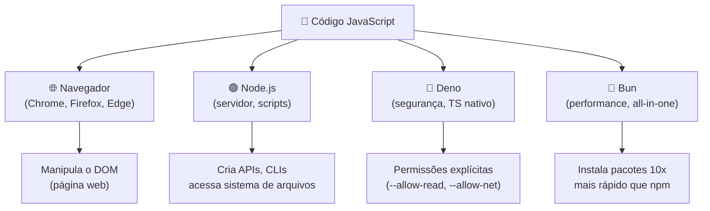
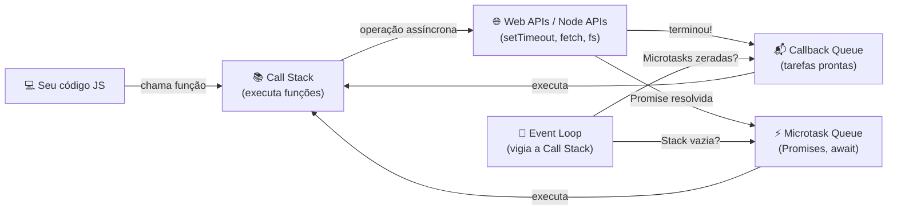

# JavaScript

> [!quote] Linguagem da Web
> *JavaScript é a linguagem que dá vida às páginas web, permitindo interatividade e dinamismo.*

---

## 🤔 O que é JavaScript?

> [!info] Conceito
> Linguagem de programação interpretada, orientada a objetos, usada principalmente para criar interatividade em páginas web.

JavaScript nasceu em 1995, criado por Brendan Eich em apenas 10 dias para o navegador Netscape. Hoje é a única linguagem de programação que roda nativamente em todos os navegadores, e também fora deles, graças a runtimes como Node.js, Deno e Bun.

**Características principais:**
- Interpretada: o código é lido e executado linha a linha, sem compilação prévia obrigatória
- Dinamicamente tipada: o tipo de uma variável é definido em tempo de execução
- Multiparadigma: suporta programação procedural, orientada a objetos e funcional
- Single-threaded: executa uma instrução por vez (mas usa o Event Loop para não travar, como veremos abaixo)

### 📝 Sintaxe Básica

```js
// Declaração de variáveis
const nome = "Alice";       // constante: não pode ser reatribuída
let idade = 20;             // variável: pode mudar de valor
var legado = "evite usar";  // forma antiga, escopos problemáticos

// Tipos primitivos
const texto = "olá, mundo";     // string
const numero = 42;               // number
const decimal = 3.14;            // number (float e int são o mesmo tipo)
const verdade = true;            // boolean
const vazio = null;              // null
let indefinido;                  // undefined
const simbolo = Symbol("id");   // symbol (ES2015)

// Template literals (interpolação de strings)
const mensagem = `Olá, ${nome}! Você tem ${idade} anos.`;
console.log(mensagem); // Olá, Alice! Você tem 20 anos.
```

```js
// Funções
function somar(a, b) {
  return a + b;
}

// Arrow function (ES2015)
const multiplicar = (a, b) => a * b;

console.log(somar(3, 4));       // 7
console.log(multiplicar(3, 4)); // 12
```

```js
// Arrays e objetos
const frutas = ["maçã", "banana", "laranja"];
const aluno = {
  nome: "João",
  nota: 9.5,
  aprovado: true
};

console.log(frutas[0]);       // maçã
console.log(aluno.nome);      // João
console.log(aluno["nota"]);   // 9.5
```

---

> [!example] 🧪 Atividade 1: Primeiros passos no Console do DevTools
> **Ferramenta:** Qualquer navegador moderno (Chrome, Firefox, Edge)
>
> **Passos:**
> 1. Abra qualquer página web (pode ser https://google.com ou https://example.com)
> 2. Pressione **F12** para abrir o DevTools e clique na aba **Console**
> 3. Digite cada trecho abaixo, pressione **Enter** e observe o resultado:
>
> **Trecho 1: variável**
> ```js
> let nome = "seu nome aqui";
> console.log("Olá, " + nome + "!");
> ```
>
> **Trecho 2: função**
> ```js
> function dobrar(n) { return n * 2; }
> dobrar(7);
> ```
>
> **Trecho 3: manipular elemento da página**
> ```js
> document.title = "IFF Programação";
> document.body.style.backgroundColor = "#e0f7fa";
> ```
>
> **Resultado observável:** o título da aba muda para "IFF Programação" e o fundo da página fica azul claro em tempo real, sem recarregar.

---

## 🟢 O que é Node.js?

> [!info] Conceito
> Runtime JavaScript que permite executar código JS fora do navegador, no lado do servidor.

Node.js foi criado em 2009 por Ryan Dahl, usando o motor V8 do Chrome. Ele transformou o JavaScript em linguagem full-stack: o mesmo desenvolvedor e a mesma linguagem podem criar tanto o front-end quanto o back-end de uma aplicação.

**Por que Node.js foi revolucionário:**
- Antes dele, o back-end era dominado por Java, PHP, Python e Ruby
- Introduziu o modelo de I/O não bloqueante (assíncrono): o servidor consegue atender milhares de conexões simultâneas sem criar uma thread por requisição
- Popularizou o npm (Node Package Manager), hoje o maior repositório de bibliotecas do mundo

> [!tip] Node.js em 2026
> A versão Node.js 22+ passou a suportar **TypeScript nativamente** sem precisar de ferramentas adicionais (sem flag `--experimental-strip-types`). Isso aproximou muito o Node.js do Deno e do Bun.

---

## 🚀 Onde o JavaScript roda? (Runtimes)

Em 2026, existem três grandes ambientes de execução (runtimes) para JavaScript fora do navegador:

| Runtime | Criado por | Ponto forte | Instalação |
|---------|-----------|-------------|------------|
| **Node.js** | Ryan Dahl (2009) | Estabilidade, ecossistema npm maduro | `node.org` |
| **Deno** | Ryan Dahl (2018) | Segurança nativa, TypeScript embutido | `deno.land` |
| **Bun** | Jarred Sumner (2022) | Performance: instalação de pacotes 10x mais rápida | `bun.sh` |

> [!quote] Resumo da escolha em 2026
> "Node.js: estabilidade em primeiro lugar. Bun: performance em primeiro lugar. Deno: segurança em primeiro lugar."



---

## ⚙️ Como o JavaScript não trava? O Event Loop 🔄

JavaScript é **single-threaded**: só executa uma coisa por vez. Então como ele consegue buscar dados de uma API, tocar música, animar elementos e responder cliques, tudo ao mesmo tempo?

A resposta é o **Event Loop**, junto com a **Call Stack** e a **fila de callbacks**.



**Como funciona na prática:**

1. Seu código cai na **Call Stack** e é executado linha a linha
2. Quando encontra algo assíncrono (como `setTimeout` ou `fetch`), entrega para as **Web APIs** e continua executando o restante do código
3. Quando a operação assíncrona termina, o callback vai para a **fila**
4. O **Event Loop** fica de olho: quando a Call Stack está vazia, pega o próximo callback da fila e executa

**Microtasks vs. Macrotasks:**

| Tipo | Exemplos | Prioridade |
|------|----------|-----------|
| **Microtask** | `.then()`, `.catch()`, `await`, `queueMicrotask()` | Alta: executa antes de qualquer macrotask |
| **Macrotask** | `setTimeout`, `setInterval`, eventos de clique, I/O | Normal: executa após esvaziar microtasks |

```js
console.log("1: início");

setTimeout(() => console.log("2: setTimeout"), 0);

Promise.resolve().then(() => console.log("3: promise"));

console.log("4: fim");

// Saída:
// 1: início
// 4: fim
// 3: promise   (microtask, prioridade alta)
// 2: setTimeout (macrotask, mesmo com delay 0)
```

> [!warning] Armadilha comum
> `setTimeout(fn, 0)` NÃO executa imediatamente: é uma macrotask e espera a stack esvaziar e todas as microtasks rodarem. Por isso o resultado acima pode surpreender quem ainda não conhece o Event Loop.

---

## ⚛️ O que é React.js?

> [!info] Conceito
> Biblioteca JavaScript para construção de interfaces de usuário, criada pelo Facebook.

React introduziu o conceito de **componentes reutilizáveis** e o **Virtual DOM**: em vez de manipular o DOM diretamente (o que é lento), React mantém uma cópia virtual em memória e só atualiza o que realmente mudou na tela.

**Conceitos centrais:**
- **Componente:** função que retorna uma interface (como um `<button>` ou uma lista inteira)
- **Props:** dados passados de um componente pai para um filho (somente leitura)
- **State:** dados internos do componente que, ao mudar, causam atualização da tela
- **JSX:** sintaxe que mistura HTML com JavaScript no mesmo arquivo

```jsx
// Componente React simples
function Saudacao({ nome }) {
  return <h1>Olá, {nome}!</h1>;
}

// Uso:
<Saudacao nome="Maria" />
```

---

## 📘 O que é TypeScript?

> [!info] Conceito
> Superset do JavaScript que adiciona tipagem estática, tornando o código mais seguro e previsível.

TypeScript é desenvolvido e mantido pela Microsoft. Todo código JavaScript válido é também TypeScript válido: você pode adotar TypeScript gradualmente em projetos existentes.

**Vantagens na prática:**

| Situação | JavaScript | TypeScript |
|----------|-----------|-----------|
| Passar string onde se espera número | Só descobre no runtime | Erro em tempo de edição |
| Autocompletar em funções | Limitado | Completo: lista todos os campos disponíveis |
| Refatorar nomes de variáveis | Trabalhoso, pode quebrar | Renomeação automática segura |
| Documentação das funções | Precisa de JSDoc manual | Tipos já documentam a interface |

```ts
// TypeScript: tipo explícito nos parâmetros
function somar(a: number, b: number): number {
  return a + b;
}

somar("3", 4); // Erro em tempo de compilação!
```

> [!tip] TypeScript em 2026
> Com Node.js 22+ suportando TypeScript nativamente (sem transpilação manual), a adoção aumentou ainda mais. Deno e Bun também rodam `.ts` diretamente.

---

## 🔥 O que é Svelte?

> [!info] Conceito
> Framework JavaScript que compila componentes em tempo de build, gerando código altamente otimizado.

A diferença fundamental do Svelte para React e Vue: ele **não tem runtime no navegador**. O Svelte compila seus componentes durante o build e gera JavaScript puro e enxuto. Resultado: carregamento mais rápido e menos consumo de memória.

```svelte
<!-- Componente Svelte: HTML, CSS e JS no mesmo arquivo -->
<script>
  let contagem = 0;
</script>

<button on:click={() => contagem++}>
  Clicado {contagem} {contagem === 1 ? 'vez' : 'vezes'}
</button>
```

---

## 📱 O que é React Native?

> [!info] Conceito
> Framework para desenvolvimento de aplicativos móveis nativos usando JavaScript e React.

Com React Native, o mesmo código base pode gerar apps para iOS e Android. Em vez de rodar no navegador, ele se comunica com componentes nativos reais do sistema operacional, resultando em performance próxima de apps nativos puros.

**Diferença de outras abordagens:**

| Abordagem | Exemplo | Como funciona |
|-----------|---------|--------------|
| **Nativo puro** | Swift, Kotlin | Código diferente pra cada plataforma |
| **React Native** | Facebook, Instagram | Um código, componentes nativos reais |
| **WebView híbrido** | Ionic (antigo) | App nativo que exibe página web |
| **Cross-platform compilado** | Flutter | Compila para código nativo de cada plataforma |

---

## 🚀 O que podemos fazer com JavaScript?

| Área | Tecnologia |
|------|------------|
| **Aplicações Web** | React, Vue, Angular |
| **Aplicativos Mobile** | React Native |
| **Aplicações Desktop** | Electron |
| **Backend/APIs** | Node.js, Express |
| **Automação e scripts** | Node.js, Bun, Deno |
| **Machine Learning (browser)** | TensorFlow.js, Brain.js |
| **Jogos 2D/3D** | Phaser, Three.js, Babylon.js |
| **Internet das Coisas (IoT)** | Johnny-Five (com Node.js) |

---

## 🌐 Manipulação do DOM

O **DOM (Document Object Model)** é a representação em árvore de todos os elementos de uma página HTML. JavaScript consegue ler e modificar qualquer parte dessa árvore em tempo real.

```js
// Selecionar elementos
const titulo = document.querySelector("h1");
const botoes = document.querySelectorAll("button");
const porId = document.getElementById("meu-id");

// Modificar conteúdo e estilo
titulo.textContent = "Novo título!";
titulo.style.color = "crimson";
titulo.classList.add("destaque");

// Criar e inserir novo elemento
const paragrafo = document.createElement("p");
paragrafo.textContent = "Sou um parágrafo criado via JS!";
document.body.appendChild(paragrafo);

// Reagir a eventos
const btn = document.querySelector("#meu-botao");
btn.addEventListener("click", function () {
  alert("Botão clicado!");
});
```

**Eventos mais usados:**

| Evento | Quando dispara |
|--------|---------------|
| `click` | Usuário clica no elemento |
| `mouseover` | Mouse passa por cima |
| `keydown` | Tecla é pressionada |
| `submit` | Formulário é enviado |
| `DOMContentLoaded` | HTML foi carregado e analisado |
| `input` | Valor de campo muda |

---

> [!example] 🧪 Atividade 2: Página interativa no CodePen
> **Ferramenta:** [CodePen](https://codepen.io) (sem instalar nada, só criar conta gratuita ou usar "anônimo")
>
> **O que fazer:** Criar uma página que muda de cor ao clicar num botão.
>
> **Cole no painel HTML:**
> ```html
> <h2 id="titulo">Clique no botão abaixo!</h2>
> <button id="btn">Mudar cor</button>
> ```
>
> **Cole no painel CSS:**
> ```css
> body { font-family: sans-serif; text-align: center; padding: 40px; }
> button { padding: 10px 20px; font-size: 1rem; cursor: pointer; }
> ```
>
> **Cole no painel JS:**
> ```js
> const btn = document.getElementById("btn");
> const titulo = document.getElementById("titulo");
> const cores = ["#e74c3c", "#2ecc71", "#3498db", "#f39c12", "#9b59b6"];
> let i = 0;
>
> btn.addEventListener("click", function () {
>   document.body.style.backgroundColor = cores[i % cores.length];
>   titulo.textContent = "Cor: " + cores[i % cores.length];
>   i++;
> });
> ```
>
> **Resultado observável:** cada clique no botão muda a cor de fundo da página e exibe o código hex da cor no título. Sem recarregar, sem instalar, funciona direto no navegador.

---

> [!example] 🧪 Atividade 3: Manipular o DOM ao clicar num botão (HTML local)
> **Ferramenta:** Qualquer editor de texto (VS Code, Notepad, Nano) e um navegador
>
> **O que fazer:** Criar o arquivo `interativo.html` com o código abaixo, abrir no navegador e clicar nos botões.
>
> ```html
> <!DOCTYPE html>
> <html lang="pt-BR">
> <head>
>   <meta charset="UTF-8">
>   <title>JS Interativo</title>
>   <style>
>     body { font-family: sans-serif; max-width: 500px; margin: 40px auto; }
>     button { margin: 5px; padding: 8px 16px; cursor: pointer; }
>     #caixa { padding: 20px; border: 2px solid #333; border-radius: 8px; margin-top: 20px; }
>   </style>
> </head>
> <body>
>   <h1 id="titulo">Olá, JavaScript!</h1>
>   <div id="caixa">Clique nos botões abaixo para ver o DOM mudar.</div>
>
>   <button id="btn-texto">Mudar texto</button>
>   <button id="btn-cor">Mudar cor da caixa</button>
>   <button id="btn-tamanho">Aumentar fonte</button>
>
>   <script>
>     document.getElementById("btn-texto").addEventListener("click", function () {
>       document.getElementById("titulo").textContent = "Texto alterado pelo JS!";
>     });
>
>     document.getElementById("btn-cor").addEventListener("click", function () {
>       const caixa = document.getElementById("caixa");
>       caixa.style.backgroundColor = "#f0e68c";
>       caixa.style.borderColor = "#e67e22";
>       caixa.textContent = "A cor foi alterada via JavaScript!";
>     });
>
>     let tamanho = 16;
>     document.getElementById("btn-tamanho").addEventListener("click", function () {
>       tamanho += 4;
>       document.getElementById("titulo").style.fontSize = tamanho + "px";
>     });
>   </script>
> </body>
> </html>
> ```
>
> **Resultado observável:**
> - Botão "Mudar texto": o `<h1>` muda de "Olá, JavaScript!" para "Texto alterado pelo JS!"
> - Botão "Mudar cor": a caixa fica amarela e o texto interno muda
> - Botão "Aumentar fonte": cada clique cresce 4px na fonte do título
>
> **Desafio extra:** adicione um quarto botão que conta quantas vezes foi clicado e exibe no título.

---

## 🆕 ES2025 e ES2026: o que há de novo?

A linguagem JavaScript é padronizada pelo **ECMAScript** (abreviado ES), publicado anualmente pelo comitê TC39. Em 2025 e 2026 chegaram recursos interessantes:

| Recurso | Versão | O que faz |
|---------|--------|----------|
| **Temporal API** | ES2025/2026 | Manipulação de datas e horas de forma robusta, sem precisar de bibliotecas como Moment.js |
| **Array.fromAsync()** | ES2026 | Cria array a partir de iteradores assíncronos, aguardando cada valor |
| **Float16Array** | ES2025 | Array de ponto flutuante de 16 bits: usa metade da memória de Float32Array |
| **Iterator helpers** | ES2025 | Métodos como `.map()`, `.filter()`, `.take()` diretamente em qualquer iterador |
| **TypeScript nativo no Node** | Node 22.18+ | Executa `.ts` sem compilar manualmente |

```js
// Temporal API: datas sem dor de cabeça
const hoje = Temporal.PlainDate.today("America/Sao_Paulo");
const dataFutura = hoje.add({ days: 30 });
console.log(`Daqui 30 dias: ${dataFutura}`);

// Array.fromAsync: coletar resultados de iterador assíncrono
async function* gerarIds() {
  yield 1;
  yield 2;
  yield 3;
}
const ids = await Array.fromAsync(gerarIds());
console.log(ids); // [1, 2, 3]
```

---

## 📚 Materiais e Cursos

### Primeiros Passos

📺 [Curso de Javascript - #3 VS Code e Olá mundo](https://www.youtube.com/watch?v=08X9gf3mdKY&t=46s)

---

### Cursos Completos

🔗 [O Guia Estelar de JavaScript - Rocketseat](https://app.rocketseat.com.br/node/o-guia-estelar-de-java-script)

🔗 [Rocketseat](https://rocketseat.com.br/)

📺 [Curso de Javascript - Playlist Completa](https://www.youtube.com/playlist?list=PLwXQLZ3FdTVF9Y0RbsuN54XYP7D0dZIlR)

---

### Conteúdos Avançados

📺 [Extraindo dados de outros sites com Puppeteer JS | Code/Drops #46](https://www.youtube.com/watch?v=K5yYBJhix5A)

📺 [Node.js: carreira, mercado e dicas na prática | #PR 27](https://www.youtube.com/watch?v=W-SOgt7O1hc)

📺 [Ferramentas, linguagens e tecnologias para ficar de olho em 2021 | PR #26](https://www.youtube.com/watch?v=Szv-gA5Aejg)

---

> [!note] 📚 Fontes (2026)
> Materiais consultados para enriquecer esta aula com conteúdo atualizado:
> - [What To Know in JavaScript (2026 Edition) - Frontend Masters Blog](https://frontendmasters.com/blog/what-to-know-in-javascript-2026-edition/)
> - [Node.js, Bun, and Deno: The 2026 Backend Runtime Selection Guide - DEV Community](https://dev.to/james_miller_8dc58a89cb9e/nodejs-bun-and-deno-the-2026-backend-runtime-selection-guide-54a9)
> - [Bun vs Deno vs Node.js: Choosing a JavaScript Runtime in 2026 - Codefinity](https://codefinity.com/blog/Bun-vs-Deno-vs-Node.js:-Choosing-a-JavaScript-Runtime-in-2026)
> - [Bun vs Node.js in 2026: Benchmarks and Migration Guide - Strapi](https://strapi.io/blog/bun-vs-nodejs-performance-comparison-guide)
> - [Event Loop: como o JavaScript executa código assíncrono - DEV Community](https://dev.to/rohyer/event-loop-como-o-javascript-executa-codigo-assincrono-59jd)
> - [Modelo de concorrência e loop de eventos - MDN](https://developer.mozilla.org/es/docs/Web/JavaScript/Reference/Execution_model)
> - [DOM Manipulation and Events - The Odin Project](https://www.theodinproject.com/lessons/foundations-dom-manipulation-and-events)
> - [addEventListener() - MDN Web Docs](https://developer.mozilla.org/en-US/docs/Web/API/EventTarget/addEventListener)
> - [Developer Console - javascript.info](https://javascript.info/devtools)
> - [Como executar JavaScript: console, Node.js e HTML - Coddy.tech](https://coddy.tech/docs/javascript/running-javascript)
