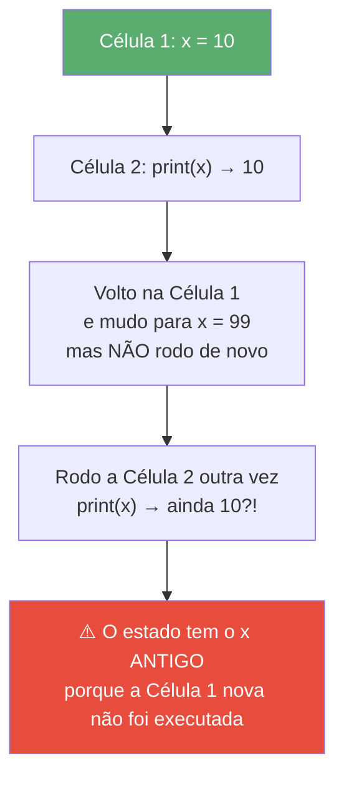
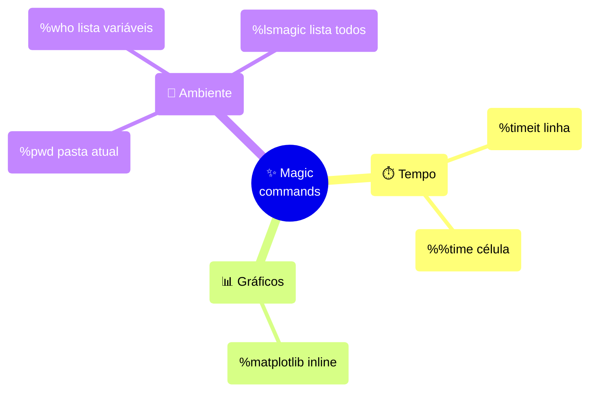

# Jupyter Notebook

> [!quote] Um caderno que pensa junto com você
> *Imagine um caderno de laboratório em que cada experimento (o código) roda na hora, mostra o resultado logo abaixo, e ainda cabe a sua explicação ao lado. Esse caderno é o Jupyter Notebook.*

![[Recursos/Programação/Jupyter Notebook/jupyter-logo.png|O logo do Jupyter: os três círculos são uma homenagem a Júpiter e suas luas observadas por Galileu]]

---

## 📓 O que é e por que existe

> [!info] Conceito central
> O **Jupyter Notebook** é um ambiente de **computação interativa** que roda no navegador. Em vez de escrever todo o programa num arquivo `.py` e rodar de uma vez, você quebra o trabalho em **células** que executa uma a uma, vendo o resultado de cada pedaço imediatamente.

O nome **Jupyter** vem das três linguagens que ele suportava no início: **Ju**lia, **Py**thon e **R**. Hoje suporta dezenas de linguagens, mas o uso mais comum (e o nosso) é com **Python**.

Por que isso importa? Em ciência de dados e IA, você raramente sabe o resultado de antemão: carrega dados, olha, ajusta, testa de novo. O notebook foi feito para esse ciclo de **explorar, experimentar e narrar**. É hoje a plataforma padrão de análise interativa para dados e IA.

> [!tip] Analogia: receita vs. cozinhar ao vivo
> Um script `.py` é como uma **receita impressa**: você lê tudo e executa do começo ao fim. Um notebook é como um **programa de culinária ao vivo**: você prova cada etapa, corrige o sal na hora e comenta o que está fazendo enquanto cozinha.

---

## 📄 O formato `.ipynb`

> [!info] O arquivo por dentro
> O notebook é salvo num arquivo com extensão **`.ipynb`** (de **IPy**thon **N**ote**b**ook). Apesar de parecer mágico no navegador, por dentro ele é apenas um **arquivo de texto no formato JSON**.

Esse JSON guarda, em um só lugar:

| O que o `.ipynb` armazena | Para quê |
|---------------------------|----------|
| O **código** de cada célula | Reexecutar depois |
| A **saída** (texto, tabelas, gráficos) | Ver o resultado sem rodar de novo |
| O **texto em Markdown** | Explicações, títulos, fórmulas |
| **Metadados** (linguagem, versão do kernel) | Saber como abrir corretamente |

> [!warning] Cuidado ao versionar com Git
> Como a saída fica salva dentro do JSON, dois notebooks que produzem o mesmo resultado podem gerar `diffs` enormes e ilegíveis no Git. É boa prática **limpar as saídas antes de commitar** (menu Kernel, ou ferramentas como `nbstripout`).

---

## ⚙️ Arquitetura: frontend e kernel

> [!info] Duas peças que conversam
> O Jupyter é dividido em duas partes que rodam separadas: o **frontend** (a página no navegador, onde você digita) e o **kernel** (o processo que de fato executa o código).


> [!tip] Analogia: garçom e cozinha
> O **frontend** é o garçom que anota o pedido; o **kernel** é a cozinha que prepara o prato. Você fala com o garçom, mas quem cozinha (executa o Python) é a cozinha, num cômodo separado. Por isso, quando o código trava, você "reinicia a cozinha" (restart do kernel), não o navegador.

**Kernel** é o componente que mantém vivas as suas variáveis e executa cada célula. Existe um kernel por linguagem: o de Python se chama **ipykernel**. Se um dia o notebook ficar "preso" (uma célula roda eternamente, ou as variáveis estão bagunçadas), a solução quase sempre é **reiniciar o kernel**.

---

## 💻 Instalação e primeiro uso

> [!info] Dois caminhos comuns
> Você precisa do Python instalado. A partir dele, há duas formas principais de obter o Jupyter.

| Método | Comando / Como | Quando usar |
|--------|----------------|-------------|
| **pip** | `pip install notebook` | Já tem Python e quer instalação enxuta |
| **Anaconda** | Instalar o pacote Anaconda (já vem com Jupyter) | Quer tudo pronto (Python + bibliotecas de dados) |
| **Online (sem instalar)** | [jupyter.org/try](https://jupyter.org/try) | Testar rápido, ou máquina sem permissão de instalar |

Depois de instalar via `pip`, você inicia o ambiente com **um comando no terminal**:

```bash
jupyter notebook
```

Isso liga o servidor local e **abre o navegador** automaticamente num endereço como `http://localhost:8888`. Você navega pelas pastas, cria um notebook novo (botão **New**) e começa a trabalhar.

> [!tip] Versão atual (2026)
> O **Jupyter Notebook 7** é a versão moderna em uso. Diferente do antigo Notebook 6, ele é **construído sobre os componentes do JupyterLab**, ganhando recursos como **modo escuro**, **sumário lateral**, **depurador (debugger)** e melhor acessibilidade, mantendo a experiência clássica de "um notebook por aba".

> [!example] 🧪 Atividade 1: instalar e abrir o seu primeiro notebook
>
> **O que fazer (com Python local):**
> 1. Abra o terminal e rode: `pip install notebook`
> 2. Em seguida, rode: `jupyter notebook`
> 3. No navegador que abriu, clique em **New** → **Python 3 (ipykernel)**.
> 4. Na primeira célula, digite `print("Meu primeiro notebook!")` e pressione **Shift + Enter**.
>
> **Sem poder instalar?** Acesse [jupyter.org/try](https://jupyter.org/try), escolha "JupyterLab" ou "Notebook" e faça os passos 3 e 4.
>
> **Resultado observável:** logo abaixo da célula aparece o texto `Meu primeiro notebook!`. O `In [ ]:` à esquerda muda para `In [1]:`, indicando que essa foi a primeira célula executada.
>
> **Entregável:** print da tela com a saída visível e o `In [1]:`.

---

## 🧱 Células: código e Markdown

> [!info] Os dois tipos essenciais
> Todo notebook é uma pilha de **células**. Cada célula é de um de dois tipos principais.

| Tipo de célula | O que contém | O que acontece ao rodar |
|----------------|--------------|--------------------------|
| **Code** (código) | Python | Executa e mostra a saída abaixo |
| **Markdown** (texto) | Texto formatado, títulos, listas, fórmulas | Renderiza como texto bonito |

Uma célula **Markdown** usa a mesma linguagem de formatação destas notas: `#` para título, `-` para lista, `**negrito**`, e `$E = mc^2$` para fórmulas. É assim que você **narra a história** entre os blocos de código.

> [!tip] Dois modos de teclado
> O notebook tem **modo de comando** (borda azul, atalhos no teclado todo) e **modo de edição** (borda verde, você digita dentro da célula). Pressione `Enter` para editar, `Esc` para sair. No modo de comando, `M` transforma a célula em Markdown e `Y` de volta em código.

> [!example] 🧪 Atividade 2: célula Markdown com título e lista
>
> **O que fazer:**
> 1. Crie uma célula nova, pressione `Esc` e depois `M` (vira Markdown).
> 2. Digite exatamente:
>    ```markdown
>    ## Minha lista de tarefas
>    - Estudar Jupyter
>    - Treinar Python
>    - **Revisar** antes da prova
>    ```
> 3. Pressione **Shift + Enter** para renderizar.
>
> **Resultado observável:** o texto bruto some e aparece um **título** grande "Minha lista de tarefas" seguido de uma lista com marcadores, e a palavra "Revisar" em negrito.
>
> **Entregável:** print da célula já renderizada.

---

## 🔢 Ordem de execução e estado

> [!danger] O conceito que mais confunde iniciantes
> O notebook **não roda de cima para baixo sozinho**. Você executa as células na ordem que quiser, e o kernel **guarda o estado** (as variáveis) na ordem em que você apertou Shift+Enter, não na ordem em que as células aparecem na tela.

O número entre colchetes, `In [3]:`, mostra a **ordem real de execução**. Se você vê `In [7]:` numa célula acima de `In [2]:`, o kernel está num estado que **não corresponde** ao que está escrito de cima para baixo. Isso gera bugs traiçoeiros: um notebook que "funciona" na sua tela pode quebrar quando outra pessoa roda do início.



> [!success] A regra de ouro
> Antes de confiar num notebook (ou entregar para alguém), use o menu **Kernel → Restart Kernel and Run All Cells**. Isso apaga o estado, reinicia o kernel e roda tudo de cima para baixo. Se rodar sem erro, o notebook é **reprodutível**.

> [!example] 🧪 Atividade 3: provoque o "estado fantasma"
>
> **O que fazer:**
> 1. Célula 1: `x = 10` → Shift+Enter.
> 2. Célula 2: `print(x)` → Shift+Enter. (Aparece `10`.)
> 3. **Volte** na Célula 1, troque para `x = 99`, mas **NÃO** a execute.
> 4. Rode **só** a Célula 2 de novo.
> 5. Agora vá em **Kernel → Restart and Run All** e observe a Célula 2.
>
> **Resultado observável:** no passo 4, a Célula 2 ainda imprime `10` (estado antigo). Depois do Restart and Run All (passo 5), ela passa a imprimir `99`. Repare também que os números `In [n]:` se reordenam de 1 em diante.
>
> **Entregável:** dois prints, um mostrando o `10` "fantasma" e outro mostrando o `99` após o restart.

---

## ✨ Magic commands

> [!info] Comandos especiais do IPython
> **Magic commands** são atalhos do kernel IPython que começam com `%` (afetam **uma linha**) ou `%%` (afetam a **célula inteira**). Eles fazem coisas que o Python puro não faz, como medir tempo ou configurar gráficos.



| Magic | Tipo | O que faz |
|-------|------|-----------|
| `%timeit` | linha (`%`) | Roda o comando **várias vezes** e dá a média de tempo (medida confiável) |
| `%%time` | célula (`%%`) | Mede o tempo de **uma execução** da célula inteira |
| `%matplotlib inline` | linha (`%`) | Faz os gráficos aparecerem **dentro** do notebook |
| `%lsmagic` | linha (`%`) | Lista todos os magic commands disponíveis |

> [!warning] `%timeit` vs `%%time`
> Use `%timeit` para **comparar** trechos pequenos (ele repete e tira a média, removendo o ruído). Use `%%time` para uma **medição única** de uma célula grande (carregar um arquivo, treinar um modelo).

> [!example] 🧪 Atividade 4: meça o tempo de um loop com %timeit
>
> **O que fazer:**
> 1. Numa célula de código, digite e rode:
>    ```python
>    %timeit soma = sum(range(1_000_000))
>    ```
> 2. Em outra célula, compare com uma soma "na mão":
>    ```python
>    %%time
>    soma = 0
>    for i in range(1_000_000):
>        soma += i
>    ```
>
> **Resultado observável:** o `%timeit` imprime algo como `10.2 ms ± 0.3 ms per loop`. O `%%time` mostra `Wall time:` com um valor **maior** (o loop manual é mais lento que o `sum` interno). Você verá, com número, por que usar funções nativas do Python compensa.
>
> **Entregável:** print das duas saídas, lado a lado, com os tempos visíveis.

---

## 📤 Exportar com nbconvert

> [!info] Tirando o notebook do navegador
> A ferramenta **`jupyter nbconvert`** converte um `.ipynb` em outros formatos: **HTML**, **PDF**, Markdown, slides ou até um script `.py`. Útil para entregar um relatório que abre em qualquer navegador, sem precisar do Jupyter instalado.

| Formato | Comando | Observação |
|---------|---------|------------|
| **HTML** | `jupyter nbconvert --to html aula.ipynb` | Abre em qualquer navegador, mantém gráficos |
| **PDF** | `jupyter nbconvert --to pdf aula.ipynb` | Precisa de LaTeX (xelatex) instalado |
| **Script** | `jupyter nbconvert --to script aula.ipynb` | Vira um `.py` limpo, só com o código |

> [!tip] O caminho fácil para PDF
> Gerar PDF direto exige instalar LaTeX, o que é pesado. Um truque comum: exporte para **HTML** primeiro e use **Imprimir → Salvar como PDF** do próprio navegador.

> [!example] 🧪 Atividade 5: exporte seu notebook para HTML
>
> **O que fazer:**
> 1. Salve seu notebook (Ctrl+S) com um nome, por exemplo `minha_aula.ipynb`.
> 2. **Sem fechar** o Jupyter, abra um **terminal** na mesma pasta do arquivo.
> 3. Rode:
>    ```bash
>    jupyter nbconvert --to html minha_aula.ipynb
>    ```
> 4. Procure o arquivo `minha_aula.html` que apareceu na pasta e abra-o com **duplo clique**.
>
> **Resultado observável:** o terminal imprime algo como `Writing 287456 bytes to minha_aula.html`, e surge um **arquivo `.html`** na pasta. Ao abri-lo, você vê o notebook completo (texto + código + saídas) renderizado como uma página web normal, sem o Jupyter rodando.
>
> **Entregável:** print do arquivo `.html` aberto no navegador.

---

## 🏆 Boas práticas

> [!tip] Hábitos que separam o notebook bagunçado do profissional
> - **Conte uma história:** alterne células Markdown (o "porquê") com células de código (o "como"). Comece com um título e uma introdução.
> - **Uma ideia por célula:** células curtas são fáceis de reexecutar e depurar. Evite uma célula gigante com 200 linhas.
> - **Rode do zero antes de entregar:** sempre faça **Restart and Run All**. Se quebra, não é reprodutível.
> - **Imports no topo:** concentre os `import` na primeira célula de código, como num script.
> - **Limpe as saídas antes do Git:** evita `diffs` ilegíveis.
> - **Notebook é para explorar, não para produção:** quando o código amadurecer e for reutilizado, mova-o para arquivos `.py` e funções.

---

## 🔀 Jupyter Notebook vs JupyterLab vs Colab

> [!info] Três sabores do mesmo conceito
> Todos os três usam o **mesmo formato `.ipynb`** e a **mesma ideia de células + kernel**. A diferença está na interface e em onde rodam.

| Aspecto | Jupyter Notebook | JupyterLab | Google Colab |
|---------|------------------|------------|--------------|
| **Interface** | Simples, um notebook por aba | Completa (abas, terminal, arquivos lado a lado) | Web, parecida com Colab/Google Docs |
| **Onde roda** | Seu computador (local) | Seu computador (local) | **Na nuvem** do Google |
| **Instalação** | `pip install notebook` | `pip install jupyterlab` | **Nenhuma** (só o navegador) |
| **GPU grátis** | Não (usa seu hardware) | Não (usa seu hardware) | **Sim** (com limites) |
| **Melhor para** | Aprender, prototipar rápido | Projetos maiores e complexos | Compartilhar, IA sem instalar nada |

> [!success] Qual escolher?
> - **Começando ou prototipando rápido?** Jupyter Notebook.
> - **Projeto grande, quer terminal + arquivos + abas juntos?** JupyterLab.
> - **Sem instalar nada, ou precisa de GPU para IA?** Google Colab.
>
> Aprendendo um, você sabe os três: o conceito de células, kernel e `.ipynb` é o mesmo.

> [!example] 🧪 Atividade 6 (desafio): mesmo notebook, dois ambientes
>
> **O que fazer:**
> 1. No seu Jupyter Notebook local, crie um notebook com uma célula que rode:
>    ```python
>    import sys
>    print("Rodando em:", sys.version)
>    print("Resultado:", 6 * 7)
>    ```
> 2. Salve, baixe o `.ipynb` (menu File → Download).
> 3. Acesse [colab.research.google.com](https://colab.research.google.com/), faça **File → Upload notebook** e envie o mesmo arquivo.
> 4. Rode a célula lá também.
>
> **Resultado observável:** o mesmo `Resultado: 42` aparece nos dois ambientes, mas a linha `Rodando em:` mostra **versões diferentes do Python** (o seu local vs. o da nuvem do Google). Prova prática de que o `.ipynb` é portátil e o kernel é que muda.
>
> **Entregável:** dois prints, um do notebook local e um do Colab, com as versões de Python diferentes destacadas.

---

## 🧠 Quiz conceitual (opcional)

> [!question] Teste seu entendimento
> 1. Por que um notebook pode "funcionar na sua tela" mas quebrar quando outra pessoa roda do início?
> 2. Qual a diferença prática entre `%timeit` e `%%time`?
> 3. O que o número em `In [5]:` representa, e por que ele importa?
> 4. Qual comando transforma um `.ipynb` em uma página HTML?
> 5. Os três ambientes (Notebook, JupyterLab, Colab) compartilham qual formato de arquivo?

> [!success] Respostas
> 1. Porque o **estado** do kernel depende da **ordem em que as células foram executadas**, não da ordem na tela. Solução: Restart and Run All.
> 2. `%timeit` repete várias vezes e dá a **média** (bom para comparar trechos curtos); `%%time` mede **uma** execução da célula inteira.
> 3. A **ordem real de execução** daquela célula. Números fora de sequência indicam estado inconsistente.
> 4. `jupyter nbconvert --to html arquivo.ipynb`.
> 5. O formato **`.ipynb`** (JSON).

---

## 📎 Veja também

- [[Google colaboratory]]
- [[JupyterLab]]
- [[Conceitos gerais de programação]]

---

> [!note] 📚 Fontes (2026)
> - [Jupyter Notebook 7: New features (documentação oficial)](https://jupyter-notebook.readthedocs.io/en/stable/notebook_7_features.html)
> - [Notebook Basics: Jupyter Notebook 7.5 (documentação oficial)](https://jupyter-notebook.readthedocs.io/en/stable/examples/Notebook/Notebook%20Basics.html)
> - [Architecture: Jupyter Documentation (documentação oficial)](https://docs.jupyter.org/en/stable/projects/architecture/content-architecture.html)
> - [What is the Jupyter kernel, and how does it work? | Hex](https://hex.tech/blog/jupyter-kernel-overview/)
> - [Jupyter Notebook vs JupyterLab: comparação 2026 | Deepnote](https://deepnote.com/compare/jupyter-notebook-vs-jupyterlab)
> - [JupyterLab vs Jupyter Notebook: Which Should You Use in 2026? | Techietory](https://techietory.com/data-science/jupyterlab-vs-jupyter-notebook-which-should-you-use/)
> - [An Introduction to Colab and Jupyter for Beginners | Louis Bouchard](https://www.louisbouchard.ai/colab-vs-jupyter/)
> - [Jupyter Magic Commands úteis | CoderzColumn](https://coderzcolumn.com/tutorials/python/list-of-useful-magic-commands-in-jupyter-notebook-lab)
> - [Jupyter Notebook to PDF/HTML com nbconvert | CU Denver](https://cse.ucdenver.edu/~biswasa/posts/2024/01/biswas/blog-jupyter-nbconvert)
> - [Fly through Jupyter with keyboard shortcuts | Data School](https://www.dataschool.io/jupyter-notebook-keyboard-shortcuts/)
