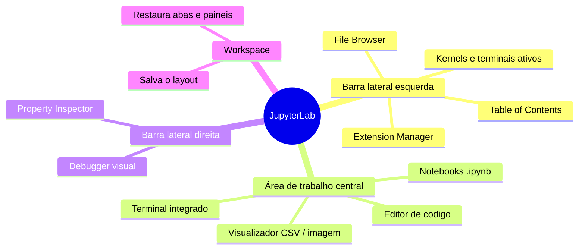
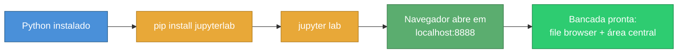
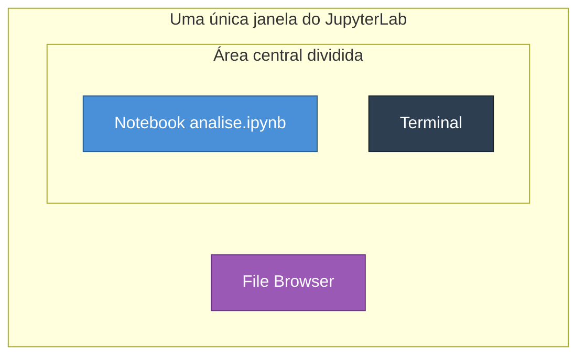
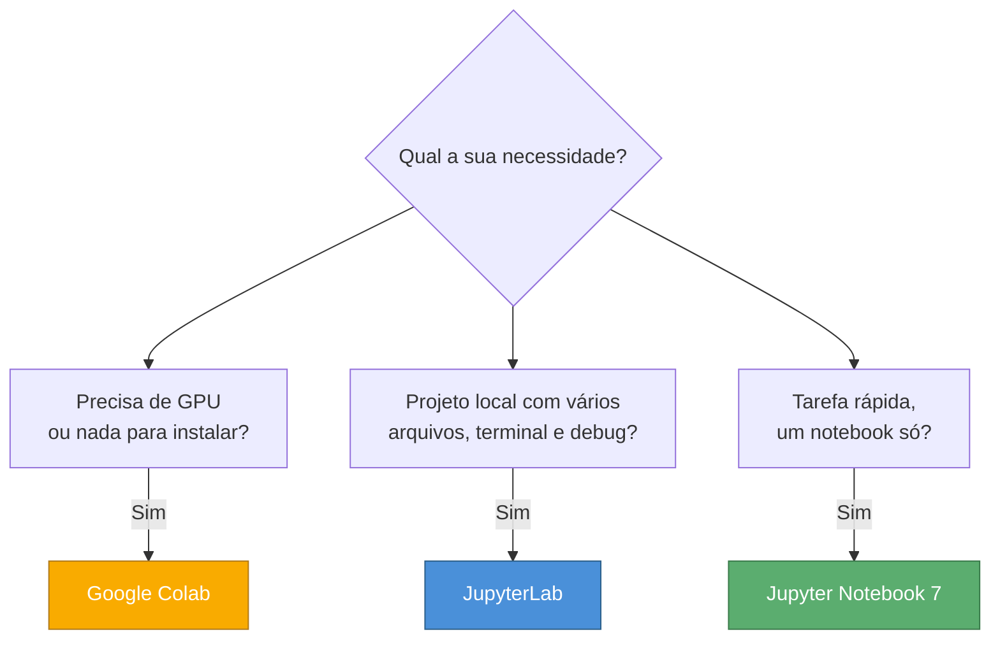

# JupyterLab

> [!quote] A bancada de trabalho do cientista de dados
> *Se o Notebook clássico é uma folha de papel, o JupyterLab é a mesa inteira: notebooks, terminal, editor e explorador de arquivos lado a lado, na mesma janela.*

![[Recursos/Programação/JupyterLab/jupyter-logo.png|Logo oficial do Projeto Jupyter|260]]

---

## 🚀 O que é o JupyterLab?

> [!info] Conceito
> **JupyterLab** é a interface web de próxima geração do Projeto Jupyter. É um ambiente de desenvolvimento completo (um IDE no navegador) que reúne, numa única tela, notebooks, consoles, terminais, editor de código, visualizador de dados e explorador de arquivos.

Pense na diferença assim: o **Jupyter Notebook clássico** abre **um documento por aba do navegador**, de cima para baixo. O **JupyterLab** abre **uma estação de trabalho** onde você organiza vários documentos como janelas dentro de uma janela, do jeito que preferir.

> [!success] Versão atual (2026)
> A versão estável é a **JupyterLab 4.6**. A linha 4.x trouxe carregamento mais rápido, busca-e-substitui melhorada nos notebooks, modo de espaço de trabalho e um sistema de extensões muito mais simples de instalar. O Notebook clássico (v6 e anteriores) está em modo de manutenção (só correções de segurança via `nbclassic`).

---

## 🆚 JupyterLab vs Notebook clássico

A maior mudança não é estética: é o **modelo de janela única com vários painéis**.

| Recurso | Notebook clássico | JupyterLab 4 |
|---------|-------------------|--------------|
| Documentos abertos | 1 por aba do navegador | Vários, em abas e painéis lado a lado |
| Explorador de arquivos | Página separada | Barra lateral sempre visível |
| Terminal | Não integrado | Integrado, na mesma tela |
| Editor de texto/código | Limitado | Editor completo (`.py`, `.csv`, `.md`, JSON) |
| Debugger visual | Não | Sim, embutido (sem instalar nada) |
| Arrastar células entre notebooks | Não | Sim |
| Extensões | Frágeis (precisavam de Node) | Gerenciador com 1 clique |



> [!tip] Boa notícia: você não precisa reaprender nada
> O **Notebook 7** (a versão moderna do Notebook clássico) é construído **por cima do JupyterLab**. Ou seja, célula, kernel, atalhos e o arquivo `.ipynb` são os mesmos nos dois. Aprender JupyterLab é aprender o ecossistema inteiro.

---

## 📦 Instalação e primeiro `jupyter lab`

> [!info] Pré-requisito
> Você precisa do **Python** já instalado (veja [[Conceitos gerais de programação]] e [[Python]]). O JupyterLab é apenas um pacote Python.



**Instalar:**

```bash
pip install jupyterlab
```

**Iniciar:**

```bash
jupyter lab
```

O comando sobe um servidor local e abre o navegador automaticamente em `http://localhost:8888`.

> [!warning] Se o comando `jupyter` não for encontrado
> - Tente: `python -m jupyter lab` (chama o módulo direto, ignora problemas de PATH).
> - No Linux/macOS, se instalou com `pip install --user`, talvez precise: `export PATH="$HOME/.local/bin:$PATH"`.
> - Para parar o servidor, volte ao terminal onde rodou e pressione `Ctrl+C`.

> [!example] 🧪 Atividade 1: Instalar e abrir o JupyterLab
>
> **O que fazer:**
> 1. Abra o terminal (PowerShell no Windows, Terminal no Linux/macOS).
> 2. Rode `pip install jupyterlab` e aguarde terminar.
> 3. Rode `jupyter lab`.
>
> **Resultado observável:** o navegador abre no endereço `http://localhost:8888/lab` mostrando o **Launcher** (a tela inicial com botões "Python 3", "Terminal", "Text File"). No terminal, aparece um log de servidor rodando.
>
> **Sem instalação local?** Acesse [jupyter.org/try-jupyter/lab](https://jupyter.org/try-jupyter/lab/) e use o JupyterLab inteiro **dentro do navegador**, sem instalar nada. Todas as atividades seguintes funcionam lá.
>
> **Entregável:** print da tela do **Launcher** logo após abrir.

---

## 🖥️ Conhecendo a interface

> [!info] As três regiões
> 1. **Barra de menu** (topo): File, Edit, View, Run, Kernel, Tabs, Settings, Help.
> 2. **Barra lateral esquerda**: file browser, kernels/terminais ativos, índice (Table of Contents) e gerenciador de extensões.
> 3. **Área de trabalho central**: onde os documentos abrem, em abas que podem ser divididas em painéis.
>
> Há também uma **barra lateral direita** com o *Property Inspector* e o **Debugger**.

> [!example] 🧪 Atividade 2: Mapear a sua bancada
>
> **O que fazer (na sua janela do JupyterLab):**
> 1. Clique no ícone de **pasta** (canto superior esquerdo): abre o **File Browser**.
> 2. Clique no ícone de **círculos/parada** logo abaixo: lista **kernels e terminais ativos**.
> 3. No menu superior, abra **View > Show Left Sidebar** e ligue/desligue para ver a barra sumir e voltar.
> 4. Passe o mouse sobre os ícones da barra lateral e descubra o que cada um faz.
>
> **Resultado observável:** você consegue mostrar e esconder a barra lateral, e identificar pelo menos 3 ícones (arquivos, kernels ativos, extensões).
>
> **Entregável:** print com o File Browser aberto mostrando a pasta atual.

---

## 🗂️ File Browser: criar pastas e arquivos sem sair da tela

No Notebook clássico, gerenciar arquivos é uma página à parte. No JupyterLab, está sempre ao lado, como o explorador de um sistema operacional.

> [!example] 🧪 Atividade 3: Organizar um projeto pelo File Browser
>
> **O que fazer:**
> 1. No File Browser, clique no ícone de **nova pasta** e crie uma pasta chamada `aula_jupyter`.
> 2. Entre na pasta (duplo clique).
> 3. Clique no **"+"** (Launcher) e crie um **Notebook (Python 3)**; renomeie para `analise.ipynb` (botão direito > Rename).
> 4. Crie também um **Text File** e salve como `notas.txt`.
>
> **Resultado observável:** dentro de `aula_jupyter` existem dois arquivos: `analise.ipynb` e `notas.txt`, ambos visíveis na barra lateral.
>
> **Entregável:** print da barra lateral mostrando a pasta `aula_jupyter` aberta com os dois arquivos.

---

## 🪟 Workspace e layout: vários painéis lado a lado

> [!info] O segredo do JupyterLab
> A área central é dividida em **painéis**. Você arrasta a **aba** de um documento para a borda (esquerda, direita, topo, base) e o JupyterLab **divide a tela**, colocando os dois lado a lado. Documentação oficial: *"arraste uma aba para a borda do painel para subdividi-lo"*.

> [!tip] O que é um *workspace*?
> Toda sessão do JupyterLab vive dentro de um **workspace**, que **memoriza o seu layout**: quais arquivos estão abertos e como os painéis estão arranjados. Ao fechar e reabrir, ele tenta restaurar a mesma disposição. Dá para ter workspaces nomeados (via URL) para projetos diferentes.



> [!example] 🧪 Atividade 4: Notebook e terminal lado a lado
>
> **O que fazer:**
> 1. Abra o notebook `analise.ipynb` (da Atividade 3).
> 2. No **Launcher** (ou menu **File > New > Terminal**), abra um **Terminal**.
> 3. **Arraste a aba do terminal** para a borda **direita** da área central. A tela se divide: notebook à esquerda, terminal à direita.
> 4. No terminal, rode `python --version` e `ls` (ou `dir` no Windows).
> 5. No notebook, em uma célula, rode `print("rodando ao lado do terminal")`.
>
> **Resultado observável:** numa única tela, você vê a saída do `python --version` no terminal **e** o resultado da célula no notebook, simultaneamente.
>
> **Entregável:** print da tela dividida com notebook e terminal visíveis ao mesmo tempo.

---

## 🔀 Trabalhando com vários notebooks (arrastar células)

> [!info] Mover trabalho entre notebooks
> Com dois notebooks abertos em painéis lado a lado, você pode **selecionar uma célula e arrastá-la** de um notebook para o outro. Isso é impossível no Notebook clássico.

> [!example] 🧪 Atividade 5: Arrastar uma célula entre dois notebooks
>
> **O que fazer:**
> 1. Crie um segundo notebook chamado `destino.ipynb`.
> 2. Arraste a aba dele para o lado, deixando `analise.ipynb` e `destino.ipynb` lado a lado.
> 3. Em `analise.ipynb`, crie uma célula com:
>    ```python
>    def saudacao(nome):
>        return f"Olá, {nome}!"
>    print(saudacao("turma"))
>    ```
> 4. Clique **à esquerda** da célula (na "calha" cinza, fora do texto) para selecioná-la inteira, então **arraste-a** para dentro de `destino.ipynb`.
> 5. Execute a célula no notebook de destino.
>
> **Resultado observável:** a função aparece em `destino.ipynb` e, ao executar, imprime `Olá, turma!`. A mesma célula passou de um notebook para o outro sem copiar e colar texto.
>
> **Entregável:** print dos dois notebooks lado a lado, com a célula já presente no de destino.

---

## 🐞 Debugger visual: ver o código por dentro

> [!info] Depuração sem `print`
> O JupyterLab traz um **debugger embutido** (não precisa instalar nada). Ele permite **colocar breakpoints** (pontos de parada), executar o código **passo a passo**, inspecionar o **valor das variáveis** e navegar pela **pilha de chamadas**, tudo numa barra lateral. É o fim do "debug por `print`".

> [!example] 🧪 Atividade 6: Caçar um valor com o debugger
>
> **O que fazer:**
> 1. Em um notebook, ative o **debugger**: clique no ícone de **inseto (bug)** no canto **superior direito** da barra do notebook (ele fica destacado quando ligado).
> 2. Crie uma célula com:
>    ```python
>    def media(notas):
>        soma = 0
>        for n in notas:
>            soma += n
>        return soma / len(notas)
>
>    resultado = media([8, 6, 10, 7])
>    print(resultado)
>    ```
> 3. Clique no **número da linha** do `soma += n` para colocar um **breakpoint** (aparece um ponto vermelho).
> 4. Execute a célula. A execução **pausa** no breakpoint.
> 5. Na barra lateral direita (aba **Debugger**), observe a seção **Variables** e clique nos botões de **passo a passo** (Continue / Next) para avançar.
>
> **Resultado observável:** a cada passo, o valor de `soma` e de `n` muda na aba **Variables**. Você vê a soma crescer (0 → 8 → 14 → 24 → 31) antes da divisão final. O `print` no fim mostra `7.75`.
>
> **Entregável:** print da aba **Variables** do debugger mostrando o valor de `soma` no meio do laço.

---

## 🧩 Extensões: turbinando o JupyterLab

> [!info] Gerenciador de extensões
> O JupyterLab tem um **Extension Manager** (ícone de peça de quebra-cabeça na barra lateral) que instala plugins com **um clique**. Exemplos populares em 2026:

| Extensão | Para que serve |
|----------|----------------|
| `jupyterlab-git` | Usar Git (commit, branch, diff) dentro do JupyterLab |
| `jupyterlab-lsp` | Autocompletar e documentação ao passar o mouse (Language Server) |
| `jupyterlab-execute-time` | Mostra quanto tempo cada célula levou para rodar |
| `jupyterlab-spreadsheet` | Abrir e visualizar planilhas |

> [!warning] Habilitar o gerenciador
> Por segurança, instalar extensões pela interface pode exigir habilitar a opção em **Settings > Enable Extension Manager**. Também dá para instalar pelo terminal, por exemplo: `pip install jupyterlab-git`.

> [!example] 🧪 Atividade 7: Instalar e usar uma extensão
>
> **O que fazer (escolha um caminho):**
> - **Pela interface:** abra o **Extension Manager** (peça de quebra-cabeça), busque `execute-time` e clique em **Install**; recarregue a página quando pedir.
> - **Pelo terminal integrado** (do JupyterLab): rode `pip install jupyterlab-execute-time` e depois recarregue a aba do navegador.
>
> Depois de instalada, abra um notebook e rode qualquer célula (ex.: `sum(range(1000000))`).
>
> **Resultado observável:** abaixo da célula executada aparece o **tempo de execução** ("Executed in ... seconds") que antes não existia. A extensão entrou em ação.
>
> **Entregável:** print de uma célula com o tempo de execução exibido pela extensão.

---

## 🤔 Quando usar JupyterLab, Notebook ou Colab?

Não existe vencedor absoluto: depende do **objetivo**. (Mesma lógica de compilado vs interpretado em [[Conceitos gerais de programação]].)



| Critério | [[Jupyter Notebook]] (clássico/7) | **JupyterLab** | [[Google colaboratory]] |
|----------|-----------------------------------|----------------|-------------------------|
| Onde roda | Local | Local | Nuvem (Google) |
| Instalação | `pip install notebook` | `pip install jupyterlab` | Nenhuma (só navegador) |
| Vários documentos lado a lado | Não | **Sim** | Não |
| Terminal e editor integrados | Não | **Sim** | Limitado |
| Debugger visual | Não | **Sim** | Básico |
| GPU/TPU grátis | Não | Não | **Sim** |
| Dados ficam na sua máquina | **Sim** | **Sim** | Não (na nuvem) |
| Melhor para | Tarefa rápida, 1 notebook | Projetos sérios, multi-arquivo | Curso, GPU, colaboração |

> [!tip] Regra prática
> - **Rascunho rápido de uma ideia?** Notebook 7.
> - **Projeto real, com vários notebooks, scripts, terminal e debug?** JupyterLab.
> - **Precisa de GPU, está sem instalar nada ou quer colaborar em tempo real?** Colab.

---

## 🧠 Quiz Conceitual (opcional)

> [!question] Teste seu entendimento
> 1. Qual a diferença central entre o Notebook clássico e o JupyterLab quanto a documentos abertos?
> 2. Que comando instala e qual comando inicia o JupyterLab?
> 3. O que um **workspace** memoriza?
> 4. Cite duas coisas que o **debugger visual** permite fazer.
> 5. Em qual cenário o **Colab** vence o JupyterLab?

> [!success] Respostas
> 1. O clássico abre **um documento por aba**; o JupyterLab abre **vários em painéis lado a lado**, na mesma janela.
> 2. Instalar: `pip install jupyterlab`. Iniciar: `jupyter lab`.
> 3. O **layout**: arquivos abertos e o arranjo dos painéis/abas.
> 4. Colocar **breakpoints**, executar **passo a passo** e **inspecionar variáveis** (qualquer dois).
> 5. Quando precisa de **GPU/TPU grátis**, não quer instalar nada ou quer **colaborar em tempo real**.

---

## 📎 Veja também

- [[Jupyter Notebook]]
- [[Google colaboratory]]
- [[Conceitos gerais de programação]]

---

> [!note] 📚 Fontes (2026)
> - [JupyterLab Documentation: Installation (4.6, stable)](https://jupyterlab.readthedocs.io/en/stable/getting_started/installation.html)
> - [JupyterLab Documentation: The JupyterLab Interface](https://jupyterlab.readthedocs.io/en/stable/user/interface.html)
> - [JupyterLab Documentation: Debugger](https://jupyterlab.readthedocs.io/en/stable/user/debugger.html)
> - [Try Jupyter: JupyterLab no navegador, sem instalar](https://jupyter.org/try-jupyter/lab/)
> - [Hex: Jupyter Notebook vs. JupyterLab (comparação completa)](https://hex.tech/blog/jupyter-lab-vs-jupyter-notebook/)
> - [Deepnote: Jupyter Notebook vs JupyterLab, comparação 2026](https://deepnote.com/compare/jupyter-notebook-vs-jupyterlab)
> - [Deepnote: Google Colab vs Jupyter Notebook, comparação 2026](https://deepnote.com/compare/colab-vs-jupyter-notebook)
> - [DataCamp: Getting Started with JupyterLab (instalação e extensões)](https://www.datacamp.com/tutorial/installing-jupyter-notebook)
