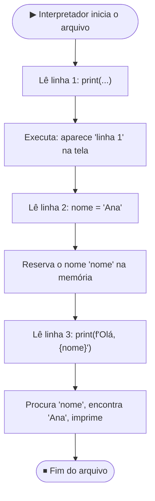
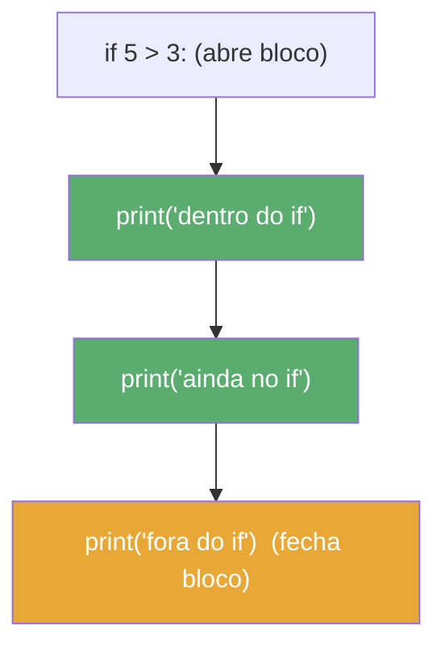
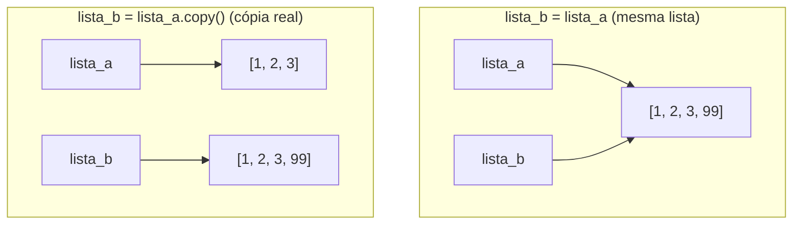

# Materiais e Conceitos Básicos

> [!quote] Ler antes de escrever
> *Programar bem começa por enxergar o código como o interpretador enxerga: linha por linha, símbolo por símbolo. Quem entende o que cada caractere faz, comete menos erros e conserta os que aparecem em segundos.*

![[Recursos/Programação/Materiais e conceitos básicos/python-logo.png|O logo do Python: duas cobras entrelaçadas, azul e amarela]]

> [!info] O foco desta aula
> Esta aula é **complementar** às aulas [[Introdução à programação com python]] e [[Conceitos gerais de programação]]. Lá você viu o panorama (o que é programar, por que Python, para que serve cada estrutura). Aqui a gente desce ao **nível da sintaxe**: como o Python lê seu código, por que a indentação importa, como uma expressão é avaliada, o que cada método de string/lista/dicionário faz e como **ler a mensagem de erro** quando algo quebra. Cada exemplo é comentado linha a linha, e cada conceito tem uma atividade pra você rodar e ver acontecer.

---

## 📋 Tópicos Abordados

- Como o Python lê e executa um arquivo
- Indentação: a regra que define os blocos
- Variáveis como etiquetas (não como caixas)
- Expressões, operadores e ordem de avaliação
- `truthiness`: o que conta como verdadeiro
- Métodos de strings, listas e dicionários
- Mutabilidade: a pegadinha mais comum de iniciante
- Funções comentadas por dentro
- O idioma `with` para arquivos
- Ler e consertar tracebacks (Python 3.14)

> [!tip] 🛠️ Ferramentas desta aula (zero instalação)
> - **Google Colab** ([colab.research.google.com](https://colab.research.google.com)): roda Python no navegador, com sua conta Google. Cada bloco de código é uma "célula": escreva, aperte `Shift + Enter`, veja a saída embaixo.
> - **Python Tutor** ([pythontutor.com/visualize.html](https://pythontutor.com/visualize.html)): executa o código **passo a passo** e desenha a memória. Perfeito pra *ver* o que cada linha faz.

---

## 🧠 Como o Python lê o seu programa

> [!info] Conceito
> Python é uma linguagem **interpretada**: não existe uma etapa de compilação separada. O interpretador lê o arquivo **de cima para baixo, uma instrução por vez**, e executa cada uma na hora. Entender essa ordem explica 90% dos comportamentos que parecem "mágicos" no começo.

```python
print("linha 1")        # 1º: executa, imprime "linha 1"
nome = "Ana"            # 2º: cria a variável nome
print(f"Olá, {nome}")   # 3º: usa nome, imprime "Olá, Ana"
```

O diagrama abaixo mostra esse fluxo de leitura. Note que o interpretador só conhece `nome` **depois** de passar pela linha que a cria: usar a variável antes disso é erro.



> [!warning] ⚠️ Ordem importa
> Inverter as linhas 2 e 3 quebra o programa: o Python tentaria usar `nome` antes de ela existir e levantaria `NameError: name 'nome' is not defined`. A leitura é sempre top-down.

---

> [!example] 🧪 Atividade 1: Veja o interpretador trabalhar passo a passo
>
> **Ferramenta:** [pythontutor.com/visualize.html](https://pythontutor.com/visualize.html)
>
> **O que fazer:**
> 1. Cole o código abaixo no editor do Python Tutor.
> 2. Clique em **"Visualize Execution"**.
> 3. Clique em **"Next"** repetidamente e observe a seta vermelha (linha atual) e o painel **Frames** (variáveis na memória).
>
> ```python
> a = 10
> b = 3
> soma = a + b
> resto = a % b
> print("Soma:", soma)
> print("Resto:", resto)
> ```
>
> **Resultado observável:** a cada clique em "Next", a seta avança uma linha e uma variável nova aparece no painel direito. Você vê `soma` valer `13` e `resto` valer `1` surgirem **na ordem exata** em que o interpretador executa. Anote em que passo `resto` ganha valor: prova de que nada existe antes da linha que cria.

---

## 📏 Indentação: a sintaxe que outras linguagens escondem

> [!danger] Em Python, o espaço é código
> Na maioria das linguagens, blocos são marcados por chaves `{ }`. Em Python, o **recuo (indentação)** é que define o que está "dentro" de um `if`, `for`, `while` ou função. Não é estética: indentação errada é **erro de execução**. O padrão oficial ([PEP 8](https://peps.python.org/pep-0008/)) é **4 espaços** por nível, nunca misturar espaços com Tab.

```python
if 5 > 3:
    print("dentro do if")   # 4 espaços: pertence ao if
    print("ainda no if")    # mesmo nível: ainda dentro
print("fora do if")         # sem recuo: fora, sempre executa
```

O `:` no fim da linha de `if` **abre** um bloco; as linhas recuadas abaixo são o corpo dele. A primeira linha sem recuo **fecha** o bloco.



> [!tip] 💡 Configure o editor
> No Colab e na maioria dos editores, a tecla `Tab` já insere 4 espaços automaticamente. Isso evita o erro clássico `IndentationError: unexpected indent` (recuo onde não devia) e `expected an indented block` (faltou recuar o corpo de um bloco).

---

> [!example] 🧪 Atividade 2: Quebre e conserte a indentação
>
> **Ferramenta:** [Google Colab](https://colab.research.google.com)
>
> **O que fazer:** cole o código abaixo numa célula e rode com `Shift + Enter`. Ele está **propositalmente quebrado**.
>
> ```python
> nota = 8
> if nota >= 7:
> print("Aprovado")
> ```
>
> 1. Leia a mensagem de erro que aparece em vermelho (vai citar `IndentationError`).
> 2. Corrija recuando a linha do `print` com 4 espaços (ou Tab) e rode de novo.
>
> **Resultado observável:** antes da correção, o Colab mostra `IndentationError: expected an indented block after 'if' statement`. Depois de recuar, a célula imprime `Aprovado` sem erro. Você comprovou na prática que o recuo **é** a estrutura do bloco.

---

## 🏷️ Variáveis são etiquetas, não caixas

> [!info] Mude a metáfora
> Muitos cursos dizem "variável é uma caixa que guarda um valor". Funciona no começo, mas leva a erros. Em Python, a variável é mais como uma **etiqueta colada num objeto** que vive na memória. `x = 10` significa: "cole a etiqueta `x` no objeto `10`". Reatribuir (`x = 20`) **descola** a etiqueta de `10` e cola em `20`.

```python
x = 10        # etiqueta x -> objeto 10
y = x         # etiqueta y -> mesmo objeto 10
x = 20        # etiqueta x -> objeto 20 (y continua em 10)
print(x, y)   # 20 10
```

> [!tip] Regras de nomes (PEP 8)
> - **snake_case** para variáveis e funções: `preco_total`, `calcular_media`
> - Sem espaços e sem acentos no nome
> - Não começa com número: `2x` é inválido, `x2` é válido
> - **UPPER_CASE** para constantes: `PI = 3.14159`
> - Nome descritivo vence nome curto: `quantidade_alunos` é melhor que `q`

Para números (`int`, `float`), strings e booleanos, essa diferença caixa-vs-etiqueta quase não aparece, porque eles são **imutáveis** (não dá pra alterar o objeto por dentro). A diferença fica gritante com **listas e dicionários**, que veremos na seção de mutabilidade.

---

## ➗ Expressões, operadores e ordem de avaliação

> [!info] Conceito
> Uma **expressão** é qualquer trecho que o Python consegue calcular até virar um valor. `3 + 4`, `nota >= 7`, `nome.upper()` são todas expressões. O interpretador resolve a expressão **antes** de usar o resultado.

### Operadores aritméticos (note os dois de divisão)

| Operador | Operação | Exemplo | Resultado |
|---|---|---|---|
| `+` `-` `*` | soma, subtração, produto | `7 * 3` | `21` |
| `/` | divisão **real** (sempre float) | `7 / 2` | `3.5` |
| `//` | divisão **inteira** (descarta o resto) | `7 // 2` | `3` |
| `%` | resto da divisão (módulo) | `7 % 2` | `1` |
| `**` | potência | `2 ** 10` | `1024` |

> [!tip] 💡 `//` e `%` andam juntos
> `7 // 2` dá o quociente (`3`) e `7 % 2` dá o resto (`1`). Juntos eles "desmontam" uma divisão. O `%` é o operador que diz se um número é par: `n % 2 == 0` é `True` para pares.

### Ordem de avaliação (precedência)

Python segue a matemática: **potência** primeiro, depois **multiplicação/divisão**, por último **soma/subtração**. Use parênteses quando quiser mudar a ordem (e pela clareza, mesmo quando não precisa).

```python
resultado = 2 + 3 * 4        # 14, não 20 (multiplica antes de somar)
com_parenteses = (2 + 3) * 4 # 20 (parênteses primeiro)
potencia = 2 ** 3 ** 2       # 512 (** avalia da direita p/ esquerda: 2**(3**2))
print(resultado, com_parenteses, potencia)
```

```mermaid
mindmap
  root((Precedência))
    1_Parênteses
      "( )"
    2_Potência
      "**"
    3_Mult_e_Div
      "*"
      "/"
      "// e %"
    4_Soma_e_Sub
      "+"
      "-"
    5_Comparação
      "== != < >"
    6_Lógicos
      "not"
      "and"
      "or"
```

---

> [!example] 🧪 Atividade 3: Calculadora de precedência
>
> **Ferramenta:** [Google Colab](https://colab.research.google.com)
>
> **O que fazer:** rode cada linha e **anote o número** que cada `print` mostra. Antes de rodar, tente adivinhar; depois confira.
>
> ```python
> print(10 + 2 * 5)        # ?
> print((10 + 2) * 5)      # ?
> print(17 // 5)           # ?
> print(17 % 5)            # ?
> print(2 ** 3 ** 2)       # ?
> print(100 / 4 / 5)       # ?
> ```
>
> **Resultado observável:** você verá, em ordem, `20`, `60`, `3`, `2`, `512` e `5.0`. Se algum palpite seu errou, releia a tabela de precedência: o erro mais comum é achar que a soma vem antes da multiplicação. Note que `/` sempre devolve float (`5.0`), enquanto `//` devolve inteiro (`3`).

---

## ✅ Truthiness: o que o Python considera verdadeiro

> [!info] Conceito
> Dentro de um `if` ou `while`, o Python não exige um `True`/`False` literal. Ele converte qualquer valor para "verdadeiro" ou "falso". Isso se chama **truthiness** (veracidade) e é muito usado em código real.

> [!tip] 💡 A regra dos "vazios"
> É **falso** (`False`): o número `0`, a string vazia `""`, a lista vazia `[]`, o dicionário vazio `{}` e o `None`. **Todo o resto é verdadeiro.**

```python
nome = input("Seu nome: ")

if nome:                       # verdadeiro se o usuário digitou algo
    print(f"Olá, {nome}!")
else:                          # cai aqui se a string ficou vazia
    print("Você não digitou nada.")

itens = []
if not itens:                  # 'not []' é True (lista vazia é falsa)
    print("O carrinho está vazio.")
```

| Valor | É verdadeiro? |
|---|---|
| `0`, `0.0` | ❌ Falso |
| `""` (string vazia) | ❌ Falso |
| `[]`, `{}`, `()` (vazios) | ❌ Falso |
| `None` | ❌ Falso |
| Qualquer número diferente de zero | ✅ Verdadeiro |
| Qualquer texto não vazio | ✅ Verdadeiro |
| Lista/dicionário com itens | ✅ Verdadeiro |

---

> [!example] 🧪 Atividade 4: Descubra a veracidade de cada valor
>
> **Ferramenta:** [Google Colab](https://colab.research.google.com)
>
> **O que fazer:** rode o código. A função `bool()` mostra como o Python interpreta cada valor.
>
> ```python
> valores = [0, 1, -5, "", "oi", [], [1, 2], {}, None, 0.0, 3.14]
>
> for v in valores:
>     print(f"{repr(v):10}  ->  {bool(v)}")
> ```
>
> **Resultado observável:** a saída lista cada valor ao lado de `True` ou `False`. Você verá `0`, `''`, `[]`, `{}`, `None` e `0.0` darem `False`, e todos os outros darem `True`. Memorize: **vazio ou zero = falso**. Esse padrão aparece o tempo todo em validações.

---

## 🔤 Strings por dentro: índices e métodos

> [!info] Conceito
> Uma string é uma **sequência de caracteres** numerados a partir de `0`. Você acessa pedaços por índice e transforma o texto com **métodos** (funções coladas no objeto, chamadas com ponto: `texto.metodo()`).

```python
texto = "Python"
#        012345        <- índices
print(texto[0])    # 'P'  (primeiro caractere)
print(texto[-1])   # 'n'  (índice negativo conta do fim)
print(texto[0:3])  # 'Pyt' (fatia: do 0 ao 2, o 3 fica de fora)
print(len(texto))  # 6   (quantidade de caracteres)
```

> [!warning] ⚠️ Strings são imutáveis
> Você **não pode** mudar um caractere no lugar: `texto[0] = "J"` dá `TypeError`. Os métodos não alteram a string original, eles **devolvem uma nova**. Por isso é preciso guardar o retorno: `texto = texto.upper()`.

### Métodos de string mais usados

| Método | O que faz | Exemplo | Resultado |
|---|---|---|---|
| `.upper()` | tudo maiúsculo | `"oi".upper()` | `"OI"` |
| `.lower()` | tudo minúsculo | `"OI".lower()` | `"oi"` |
| `.strip()` | tira espaços das pontas | `"  ana  ".strip()` | `"ana"` |
| `.replace(a, b)` | troca a por b | `"casa".replace("a", "o")` | `"coso"` |
| `.split(sep)` | quebra em lista | `"a,b,c".split(",")` | `["a","b","c"]` |
| `.startswith(x)` | começa com x? | `"arquivo.pdf".startswith("arq")` | `True` |
| `.count(x)` | conta ocorrências | `"banana".count("a")` | `3` |

---

> [!example] 🧪 Atividade 5: Tratador de texto
>
> **Ferramenta:** [Google Colab](https://colab.research.google.com)
>
> **O que fazer:** rode o programa, digite uma frase qualquer com espaços extras nas pontas e veja cada transformação.
>
> ```python
> frase = input("Digite uma frase: ")
>
> print("Original:        ", repr(frase))
> print("Sem espaços:     ", repr(frase.strip()))
> print("MAIÚSCULAS:      ", frase.strip().upper())
> print("Nº de palavras:  ", len(frase.split()))
> print("Tem 'a'?         ", "a" in frase.lower())
> ```
>
> **Resultado observável:** o programa mostra a frase limpa, em maiúsculas, conta quantas palavras você digitou (via `split()`) e responde se existe a letra "a". O `repr()` revela os espaços que `strip()` removeu. Note o **encadeamento** `frase.strip().upper()`: um método é aplicado sobre o resultado do outro.

---

## 📋 Listas: a coleção que você pode mudar

> [!info] Conceito
> Lista é uma sequência **ordenada e mutável** de itens, escrita entre colchetes `[ ]`. Diferente da string, você **pode** alterar, adicionar e remover itens depois de criada.

```python
notas = [8.5, 7.0, 9.2]
notas.append(6.0)      # adiciona no fim   -> [8.5, 7.0, 9.2, 6.0]
notas[0] = 10.0        # troca o 1º item   -> [10.0, 7.0, 9.2, 6.0]
notas.remove(7.0)      # remove o valor    -> [10.0, 9.2, 6.0]
print(notas)
print("Maior:", max(notas), "| Média:", sum(notas) / len(notas))
```

> [!warning] ⚠️ `.append()` devolve `None`
> Métodos que alteram a lista **no lugar** (`append`, `remove`, `sort`) **não retornam a lista nova**, retornam `None`. O erro clássico é escrever `notas = notas.append(6.0)`: isso joga `None` em `notas` e você perde a lista. O certo é só `notas.append(6.0)` (sem o `notas =`).

| Método/função | O que faz |
|---|---|
| `lista.append(x)` | adiciona `x` ao final |
| `lista.remove(x)` | remove a 1ª ocorrência de `x` |
| `lista.sort()` | ordena a lista no lugar |
| `len(lista)` | quantidade de itens |
| `sum(lista)` | soma os números |
| `x in lista` | `True` se `x` está na lista |

---

## 🗂️ Dicionários: pares chave → valor

> [!info] Conceito
> Dicionário guarda dados por **chave**, não por posição. Use quando cada dado tem um "nome" (atributo). Escrito com chaves `{ }` e pares `chave: valor`.

```python
aluno = {"nome": "Maria", "idade": 17, "nota": 9.0}

print(aluno["nome"])          # 'Maria' (acesso pela chave)
aluno["nota"] = 9.5           # atualiza um valor existente
aluno["turma"] = "1TI"        # cria uma chave nova
print(aluno.get("falta", 0))  # 0 (get evita erro se a chave não existir)
```

> [!tip] 💡 Use `.get()` para não quebrar
> Acessar uma chave inexistente com `aluno["xpto"]` levanta `KeyError`. O método `.get("xpto", valor_padrao)` devolve o padrão em vez de quebrar. É a forma segura de ler dicionários cujas chaves você não controla (ex.: respostas de API).

### Lista de dicionários: o padrão "tabela"

```python
produtos = [
    {"nome": "Notebook", "preco": 3499.90, "estoque": 5},
    {"nome": "Mouse",    "preco":   89.90, "estoque": 0},
]

for p in produtos:
    status = "Disponível" if p["estoque"] > 0 else "Esgotado"
    print(f"{p['nome']:10} R$ {p['preco']:8.2f}  {status}")
```

---

> [!example] 🧪 Atividade 6: Mini cadastro com lista + dicionário
>
> **Ferramenta:** [Google Colab](https://colab.research.google.com)
>
> **O que fazer:** rode o programa, digite 3 produtos com seus preços. Ele monta uma lista de dicionários e calcula o total.
>
> ```python
> carrinho = []
>
> for i in range(3):
>     nome = input(f"Produto {i+1}: ")
>     preco = float(input(f"Preço de {nome}: R$ "))
>     carrinho.append({"nome": nome, "preco": preco})
>
> print("\n=== Carrinho ===")
> total = 0
> for item in carrinho:
>     print(f"- {item['nome']:15} R$ {item['preco']:.2f}")
>     total += item["preco"]
>
> print(f"\nTotal: R$ {total:.2f}")
> ```
>
> **Resultado observável:** após digitar os 3 produtos, o programa imprime o carrinho formatado e o **total somado**. Você combinou `append`, dicionários, `for`, f-strings e acumulador (`total += ...`) num único programa funcional, exatamente o esqueleto de um sistema real.

---

## 🔁 Mutabilidade: a pegadinha número 1 de iniciante

> [!danger] O bug que confunde todo mundo
> Como variável é **etiqueta**, fazer `lista_b = lista_a` **não copia** a lista: cola uma segunda etiqueta no **mesmo objeto**. Mexer numa "afeta" a outra, porque são a mesma lista. Isso vale para listas e dicionários (mutáveis), não para números e strings (imutáveis).

```python
lista_a = [1, 2, 3]
lista_b = lista_a        # NÃO copia: b é a MESMA lista de a
lista_b.append(99)

print(lista_a)           # [1, 2, 3, 99]  <- a mudou também!
print(lista_b)           # [1, 2, 3, 99]
```

A forma correta de **copiar de verdade** é `lista_b = lista_a.copy()` (ou `list(lista_a)`). Aí são dois objetos independentes.



---

> [!example] 🧪 Atividade 7: Veja a etiqueta dupla na memória
>
> **Ferramenta:** [pythontutor.com/visualize.html](https://pythontutor.com/visualize.html)
>
> **O que fazer:** cole o código no Python Tutor e clique "Visualize Execution" → "Next" até o fim. Observe as **setas** que saem de `a` e `b`.
>
> ```python
> a = [1, 2, 3]
> b = a
> b.append(99)
>
> c = a.copy()
> c.append(0)
>
> print("a:", a)
> print("b:", b)
> print("c:", c)
> ```
>
> **Resultado observável:** no diagrama, `a` e `b` apontam com setas para a **mesma** lista, enquanto `c` aponta para uma lista **separada**. A saída final é: `a` = `[1, 2, 3, 99]`, `b` = `[1, 2, 3, 99]` e `c` = `[1, 2, 3, 99, 0]`. Acompanhe a ordem: o `append(99)` mexeu em `a` e `b` juntos (mesmo objeto); depois `c = a.copy()` tirou uma cópia independente, então o `append(0)` só afetou `c`. As setas no painel provam quem compartilha o objeto e quem não compartilha.

---

## ⚙️ Funções comentadas por dentro

> [!info] Conceito
> Função é um bloco de código com nome, que recebe **entradas** (parâmetros), faz algo e devolve uma **saída** (`return`). Escreve uma vez, usa quantas vezes quiser.

```python
def calcular_imc(peso, altura):          # def + nome + parâmetros + :
    """Calcula o IMC a partir de peso (kg) e altura (m)."""  # docstring
    imc = peso / altura ** 2             # corpo: cálculo (recuado)
    return round(imc, 1)                 # devolve o valor ao chamador

resultado = calcular_imc(70, 1.75)       # chamada com argumentos reais
print(f"Seu IMC é {resultado}")          # usa o que voltou
```

Linha a linha: `def` inicia a definição; `calcular_imc` é o nome (snake_case); `peso` e `altura` são **parâmetros**; o `:` abre o corpo; a docstring entre `"""` documenta; `return` entrega o resultado. Na chamada, `70` e `1.75` são os **argumentos**.

> [!warning] ⚠️ `return` ≠ `print`
> `print` só **mostra** na tela; `return` **devolve** o valor pra ser reutilizado. Se a função só faz `print` e você tenta `x = funcao()`, `x` recebe `None`. Quando o valor vai ser usado depois, a função precisa de `return`.

### Parâmetro com valor padrão

```python
def saudacao(nome, idioma="pt"):         # idioma tem valor padrão
    if idioma == "en":
        return f"Hello, {nome}!"
    return f"Olá, {nome}!"               # padrão quando idioma == 'pt'

print(saudacao("Ana"))           # Olá, Ana!   (usa o padrão)
print(saudacao("Ana", "en"))     # Hello, Ana! (sobrescreve o padrão)
```

---

> [!example] 🧪 Atividade 8: Função classificadora testada
>
> **Ferramenta:** [Google Colab](https://colab.research.google.com)
>
> **O que fazer:** implemente a função abaixo exatamente como está e rode. Os comentários dizem o que **deve** sair: confirme que bate.
>
> ```python
> def classificar(nota):
>     if nota >= 7.0:
>         return "Aprovado"
>     elif nota >= 5.0:
>         return "Recuperação"
>     else:
>         return "Reprovado"
>
> print(classificar(9.0))   # deve imprimir: Aprovado
> print(classificar(6.0))   # deve imprimir: Recuperação
> print(classificar(3.0))   # deve imprimir: Reprovado
> ```
>
> **Resultado observável:** as três chamadas imprimem `Aprovado`, `Recuperação` e `Reprovado`, nessa ordem. Se algo divergir, há um bug na ordem dos `if/elif`. **Desafio:** adicione uma 4ª chamada com `classificar(7.0)` e descubra (rodando) em qual faixa ela cai, e por quê o `>=` decide isso.

---

## 📁 Arquivos com o idioma `with`

> [!info] Conceito
> Para gravar e ler arquivos, a forma moderna e segura é o bloco `with open(...)`. Ele **fecha o arquivo automaticamente** ao final, mesmo se ocorrer um erro no meio. Você não precisa chamar `.close()` manualmente.

```python
# Escrever (modo "w" cria ou sobrescreve)
with open("turma.txt", "w", encoding="utf-8") as arquivo:
    arquivo.write("Ana\n")        # \n quebra a linha
    arquivo.write("João\n")

# Ler (modo "r" lê; o arquivo precisa existir)
with open("turma.txt", "r", encoding="utf-8") as arquivo:
    conteudo = arquivo.read()

print(conteudo)
```

| Modo | O que faz |
|---|---|
| `"r"` | leitura (padrão); erro se o arquivo não existe |
| `"w"` | escrita: **cria ou apaga** o conteúdo anterior |
| `"a"` | append: adiciona ao fim sem apagar |

> [!tip] 💡 Sempre `encoding="utf-8"`
> Em português usamos acentos e cedilha. Sem `encoding="utf-8"`, gravar "ção" pode dar erro ou salvar caracteres estranhos. Use sempre, é o padrão da web e do Brasil.

---

> [!example] 🧪 Atividade 9: Bloco de anotações persistente no Colab
>
> **Ferramenta:** [Google Colab](https://colab.research.google.com)
>
> **O que fazer:** rode a **célula 1** (grava), depois rode a **célula 2** (lê de volta). No Colab o arquivo fica salvo na sessão.
>
> ```python
> # Célula 1: grava 3 anotações digitadas por você
> with open("anotacoes.txt", "w", encoding="utf-8") as f:
>     for i in range(3):
>         linha = input(f"Anotação {i+1}: ")
>         f.write(linha + "\n")
> print("Salvo!")
> ```
>
> ```python
> # Célula 2: lê e mostra o que foi salvo
> with open("anotacoes.txt", "r", encoding="utf-8") as f:
>     print(f.read())
> ```
>
> **Resultado observável:** a célula 1 pede 3 anotações e confirma "Salvo!". A célula 2, rodada depois, exibe exatamente o que você digitou, **vindo do arquivo** (não da memória). Você comprovou persistência: o dado sobreviveu fora das variáveis. Bônus: no painel de arquivos do Colab (ícone de pasta à esquerda) você vê o `anotacoes.txt` listado.

---

## 🩺 Ler e consertar tracebacks (Python 3.14)

> [!info] Erro não é fracasso, é informação
> Quando o código quebra, o Python imprime um **traceback**: a trilha do erro. A partir do **Python 3.14** (out/2025), as mensagens ficaram muito mais claras, com **sugestões de correção**. Ler a última linha do traceback resolve a maioria dos problemas em segundos.

### Os erros mais comuns e o que o Python 3.14 diz

| Você escreveu | Erro (3.14) | Conserto |
|---|---|---|
| `if x > 3` (sem `:`) | `SyntaxError: expected ':'` | adicione `:` no fim |
| `whille True:` | `SyntaxError: invalid syntax. Did you mean 'while'?` | corrija a palavra-chave |
| `if x = 5:` | `SyntaxError` apontando o `=` | use `==` (comparação) |
| `print(nome)` antes de criar | `NameError: name 'nome' is not defined` | crie a variável antes |
| `int("abc")` | `ValueError: invalid literal for int()` | converta só texto numérico |
| `lista[10]` (só tem 3) | `IndexError: list index out of range` | índice dentro do tamanho |
| `dic["xpto"]` (não existe) | `KeyError: 'xpto'` | use `.get()` ou crie a chave |

> [!success] ✅ A novidade do 3.14: "Did you mean...?"
> Digitou `whille` em vez de `while`? O Python 3.14 mede a "distância" entre o que você escreveu e as palavras que conhece e sugere: `Did you mean 'while'?`. O mesmo vale para colocar `elif` depois de `else` (agora diz claramente `'elif' block follows an 'else' block`) e para aspas trocadas dentro de uma string (`Is this intended to be part of the string?`).

---

> [!example] 🧪 Atividade 10: Caça aos 3 bugs
>
> **Ferramenta:** [Google Colab](https://colab.research.google.com) (use Python 3.13+; o Colab já roda versão recente)
>
> **O que fazer:** o código abaixo tem **três erros**. Rode, leia a mensagem, conserte UM erro, rode de novo, e repita até funcionar.
>
> ```python
> def media(numeros)
>     total = 0
>     for n in numeros:
>         total += n
>     if len(numeros) = 0:
>         return 0
>     return total / len(numeros)
>
> print(media([8, 6, 10))
> ```
>
> **Pistas:**
> - Bug 1: falta um símbolo no fim da linha do `def`.
> - Bug 2: a linha do `if` confunde atribuição (`=`) com comparação (`==`).
> - Bug 3: a chamada `print(media([8, 6, 10))` tem parênteses/colchetes desbalanceados.
>
> **Resultado observável após corrigir os três:** o programa imprime `8.0` (média de 8, 6 e 10). A cada conserto, a mensagem de erro **muda** e aponta o próximo problema: prova de que o traceback é um guia, não um castigo.

---

## 🧩 Quiz conceitual (gabarito ao final)

> [!question] Teste o que você entendeu
> 1. Qual a diferença entre `7 / 2` e `7 // 2` em Python?
> 2. Por que `nome = nome.upper()` precisa do `nome =`, mas `lista.append(5)` não precisa de `lista =`?
> 3. O que `bool([])` retorna e por quê?
> 4. Depois de `b = a` (com `a` sendo uma lista), por que mexer em `b` altera `a`?
> 5. Qual a diferença prática entre `return` e `print` dentro de uma função?

> [!success] ✅ Gabarito
> 1. `7 / 2` faz divisão real e dá `3.5` (float); `7 // 2` faz divisão inteira e dá `3` (descarta o resto).
> 2. Strings são **imutáveis**: `.upper()` cria uma string nova, então você precisa guardar o retorno. Listas são **mutáveis**: `.append()` altera a lista no lugar e retorna `None`, então não se reatribui.
> 3. Retorna `False`: lista vazia é "falsa" pela regra de truthiness (vazio = falso).
> 4. Porque `b = a` não copia, só cola uma segunda etiqueta no **mesmo objeto** lista. Para copiar de verdade, use `a.copy()`.
> 5. `print` apenas **exibe** texto na tela; `return` **devolve** um valor que pode ser guardado em variável e reutilizado. Sem `return`, a função entrega `None`.

---

## 🏆 Boas práticas que ficam

> [!tip] Hábitos desde o primeiro dia
> - **Indente com 4 espaços**, sempre. Deixe o editor fazer isso por você.
> - **Nomes descritivos** em snake_case: `calcular_total`, não `ct`.
> - **Leia a última linha do traceback** antes de qualquer coisa: ela diz o tipo do erro e onde.
> - **Teste casos extremos**: lista vazia, divisão por zero, string sem números.
> - **`.get()` em dicionários** quando a chave pode não existir.
> - **`with open(...)`** para arquivos: nunca esqueça de fechar porque ele fecha sozinho.
> - **Cuidado com cópia de listas**: `b = a` compartilha; `b = a.copy()` separa.

**Veja também:** [[Introdução à programação com python]] · [[Conceitos gerais de programação]] · [[Armazenamento de senhas]]

---

> [!note] 📚 Fontes (2026)
>
> - [Python.org: What's New in Python 3.14 (documentação oficial)](https://docs.python.org/3/whatsnew/3.14.html)
> - [Real Python: Python 3.14 Better Error Messages](https://realpython.com/python314-error-messages/)
> - [Real Python: Python 3.14 New Features](https://realpython.com/python314-new-features/)
> - [Python Morsels: Python 3.14's best new features](https://www.pythonmorsels.com/python314/)
> - [Heise: Easier debugging, Python 3.14 eliminates unclear error messages](https://www.heise.de/en/news/Easier-debugging-Python-3-14-eliminates-unclear-error-messages-10725855.html)
> - [PEP 8: Style Guide for Python Code (indentação, snake_case)](https://peps.python.org/pep-0008/)
> - [Real Python: How to Write Beautiful Python Code With PEP 8](https://realpython.com/python-pep8/)
> - [Medium: Common Mistakes Beginners Make with Python Lists, Dictionaries, and Sets (fev/2026)](https://medium.com/@adityagadiwan51/common-mistakes-beginners-make-with-python-lists-dictionaries-and-sets-ec56cef2edd7)
> - [Guvi: Mutable and Immutable in Python, a Beginner's Clear Guide](https://www.guvi.in/blog/what-is-mutable-and-immutable-in-python/)
> - [Python Tutor: visualizador de execução passo a passo](https://pythontutor.com/)
> - [Google Colab](https://colab.research.google.com)
