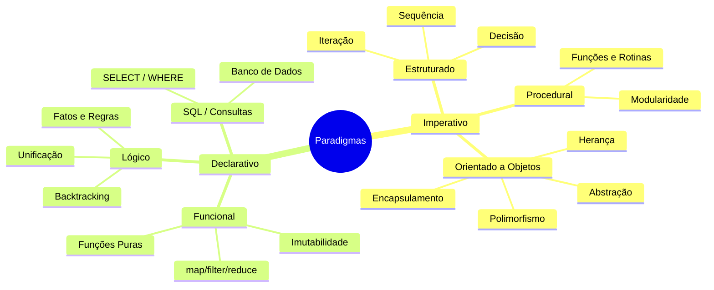
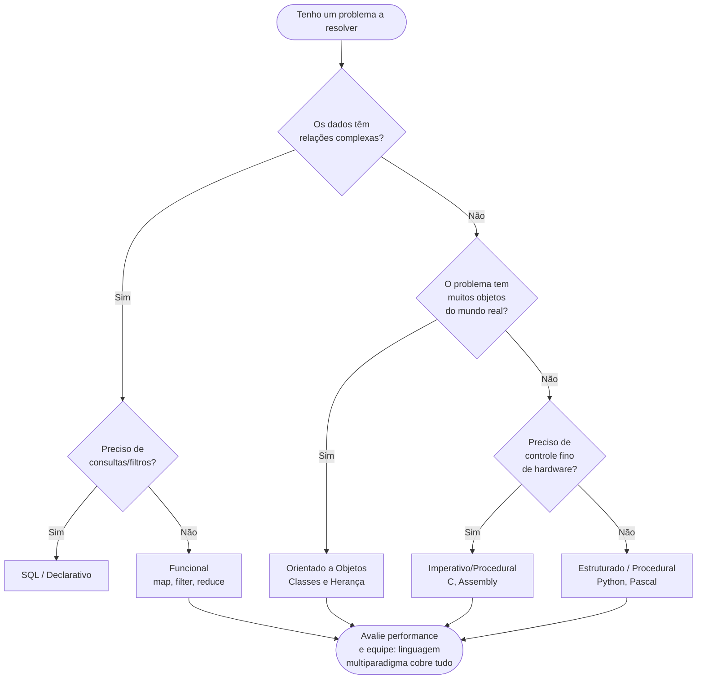

# Paradigmas de Programação

> [!abstract] 🔗 Disciplina integrada com Engenharia de Software
> Esta disciplina caminha junto com **Engenharia de Software**: aqui você aprende *com qual molde* resolver cada problema; lá, *como* transformar isso em produto. Comece pela ponte entre as duas: [[Integração - Engenharia de Software e Paradigmas|Integração: Engenharia de Software e Paradigmas]].

> [!quote] Modelos de Resolução
> *Paradigma de programação é um meio de se **classificar** as linguagens de programação baseado em suas funcionalidades.*

---

## 🎯 O que são Paradigmas?

> [!success] Definição Simples
> **Um paradigma é um molde ou modelo para se resolver um problema.**

📺 [Os Paradigmas da Programação | Explicados](https://www.youtube.com/watch?v=7R6CIDND87Y)

---

## 🌳 Os Dois Grandes Grupos

![[Recursos/Programação/Paradigmas de programação/arvore-paradigmas-programacao.png|Árvore de Paradigmas]]

> [!tip] Multiparadigma
> Uma linguagem pode se encaixar em **um ou mais** paradigmas. A maior parte das linguagens que usamos no dia a dia são multiparadigma.

> [!warning] Importante
> Alguns paradigmas são **modificações** ou **evoluções** de outros, ou seja, não são coisas completamente separadas.

---

## ⚖️ Imperativa vs Declarativa: Diferença Prática

### Programação Imperativa

Você diz **como** algo deve ser feito, passo a passo.

```python
numeros = [1, 2, 3, 4, 5]
soma = 0
for numero in numeros:
    soma += numero
print(soma)
```

### Programação Declarativa

Você diz **o que** quer, e o sistema cuida de **como** fazer.

```python
numeros = [1, 2, 3, 4, 5]
soma = sum(numeros)
print(soma)
```

| Aspecto | Imperativa | Declarativa |
|---------|------------|-------------|
| **Foco** | Como fazer | O que fazer |
| **Controle** | Detalhado | Abstrato |

---

# 1. Programação Imperativa

> [!success] Conceito
> Programas imperativos são uma sequência de comandos para o computador executar.

O nome paradigma **Imperativo** está ligado ao tempo verbal imperativo, onde o programador diz ao computador: faça isso, depois isso, depois aquilo...

Este paradigma se destaca pela simplicidade, uma vez que todo ser humano, ao se programar, o faz imperativamente, baseado na ideia de ações e estados.

---

## 📋 Elementos da Programação Imperativa

- Definição de tipos de dados
- Expressões e atribuições
- Estruturas de controle de fluxo (programação estruturada)
- Definição de sub-rotinas (programação procedimental)

---

## ✅ Vantagens

| Vantagem | Descrição |
|----------|-----------|
| **Eficiência** | Embute o modelo Von Neumann |
| **Dominante** | Paradigma bem estabelecido |
| **Natural** | Modelagem natural de aplicações do mundo real |
| **Flexibilidade** | Tipagem fraca e muito flexível |
| **Acessível** | Fácil de entender, usada em cursos introdutórios |

---

### 🖥️ Arquitetura de Von Neumann

📺 [O gênio que revolucionou a COMPUTAÇÃO](https://www.youtube.com/watch?v=DhodsmIm3LE)

> [!info] Ideia Central
> Von Neumann pensou o computador como uma máquina que **guarda dados e instruções no mesmo lugar (memória)**.

**Componentes principais:**

1. **Memória** → onde ficam guardados tanto os dados quanto o programa
2. **CPU** dividida em:
   - **ULA** (Unidade Lógica e Aritmética) → faz cálculos e comparações
   - **UC** (Unidade de Controle) → interpreta as instruções
3. **Dispositivos de Entrada e Saída** → teclado, mouse, monitor, etc.

![[Recursos/Programação/Paradigmas de programação/arquitetura-von-neumann-harvard.png|Arquitetura Von Neumann vs Harvard]]

> [!tip] Analogia
> A arquitetura de von Neumann é como uma cozinha onde **a receita (programa)** e **os ingredientes (dados)** ficam guardados no mesmo armário (memória), e o **chefe (CPU)** busca, interpreta e executa passo a passo.

---

### 📝 Tipagem Fraca

> [!info] O que é?
> Tipagem fraca permite que operações sejam realizadas em variáveis de tipos diferentes sem conversão explícita.

| Aspecto | Descrição |
|---------|-----------|
| **Flexibilidade** | Mais fácil de escrever código |
| **Exemplo** | Em JavaScript, `"5" + 3` resulta em `"53"` |
| **Riscos** | Problemas de depuração, comportamento imprevisível |
| **Linguagens** | JavaScript, PHP, Python |

---

## ❌ Desvantagens

- Difícil legibilidade
- Focaliza o "como" e não o "quê"
- Relacionamento indireto com E/S (indução a erros/estados)
- Tende a gerar códigos confusos quando a "gambiarra" toma conta

---

## 💻 Linguagens Imperativas

Ada, ALGOL, Basic, C, PHP, Java, Cobol, Fortran, Pascal, Python, Lua, Mathematica

---

# 1.1 Programação Estruturada

A programação estruturada surge como forma de dar maior controle sobre o fluxo de execução.

> [!info] História
> Desenvolvida por Michael A. Jackson em "Principles of Program Design" de **1975**.

---

## 🔄 As 3 Estruturas Fundamentais

![[Recursos/Programação/Paradigmas de programação/fluxograma-sequencia-decisao-repeticao.png|Sequência, Decisão e Repetição]]

| Estrutura | Descrição |
|-----------|-----------|
| **Sequência** | Tarefas executadas linearmente |
| **Decisão** | Teste lógico determina execução |
| **Iteração** | Trecho repetido por número finito de vezes |

---

### Exemplo Prático

```python
import requests

# Sequência: requisita a cotação
url = "https://api.exchangerate-api.com/v4/latest/USD"
response = requests.get(url)

# Seleção: verifica se a resposta foi bem-sucedida
if response.status_code == 200:
    data = response.json()
    # Sequência: pega a cotação do dólar em relação ao Real
    dolar_brl = data["rates"]["BRL"]
    print("Cotação do dólar em reais:", dolar_brl)
else:
    print("Erro ao acessar a API.")
```

---

# 1.2 Programação Procedural (ou Modular)

A Programação Procedural é um dos paradigmas mais antigos e fundamentais.

> [!success] Conceito
> Procedimentos (funções/rotinas) são blocos de códigos que realizam tarefas específicas, permitindo decompor tarefas complexas em sub-tarefas menores.

---

## 📋 Características Principais

| Característica | Descrição |
|----------------|-----------|
| **Procedimentos** | Blocos de código para tarefas específicas |
| **Fluxo Sequencial** | Execução de cima para baixo |
| **Escopo** | Variáveis com visibilidade limitada |
| **Modularidade** | Divisão em partes menores e testáveis |

---

### Vantagens e Desvantagens

| Vantagens | Desvantagens |
|-----------|--------------|
| Simplicidade para aplicações menos complexas | Escalabilidade difícil para sistemas maiores |
| Eficiência em memória e tempo | Reutilização desafiadora |
| Facilidade de depuração | Efeitos colaterais possíveis |

---

### Exemplo Prático

```python
import requests

def buscar_cotacoes(base="USD"):
    """Busca as cotações a partir de uma moeda base"""
    url = f"https://api.exchangerate-api.com/v4/latest/{base}"
    response = requests.get(url)
    if response.status_code == 200:
        return response.json()
    else:
        return None

def pegar_cotacao(data, moeda="BRL"):
    """Extrai a cotação de uma moeda específica"""
    if data and "rates" in data:
        return data["rates"].get(moeda, None)
    return None

def exibir_cotacao(valor, moeda="BRL"):
    """Mostra a cotação formatada"""
    if valor:
        print(f"Cotação do dólar em {moeda}: {valor}")
    else:
        print("Não foi possível obter a cotação.")

# Programa principal (procedural)
dados = buscar_cotacoes("USD")
cotacao_brl = pegar_cotacao(dados, "BRL")
exibir_cotacao(cotacao_brl, "BRL")
```

---

# 1.3 Programação Orientada a Objetos (POO)

📺 [Programação Orientada a Objetos | Explicação Simples](https://www.youtube.com/watch?v=pbb0jzXt_xA)

> [!success] Conceito
> Paradigma baseado em "objetos" que representam entidades do mundo real, contendo dados (atributos) e comportamentos (métodos).

---

## 🧱 Objetos e Classes

| Conceito | Descrição |
|----------|-----------|
| **Objeto** | Instância de uma classe com estado e comportamento |
| **Classe** | Blueprint/definição a partir da qual objetos são criados |

---

### Exemplos de Classes

**Classe Carro:**
- **Objetos**: Toyota Corolla, Volkswagen Golf, Ford Mustang
- **Atributos**: Cor, Modelo, Ano, Velocidade máxima
- **Métodos**: Acelerar, Frear, Ligar faróis, Buzinar

**Classe ContaBancaria:**
- **Objetos**: Conta de João, Conta de Maria
- **Atributos**: Número da conta, Titular, Saldo
- **Métodos**: Depositar, Sacar, Transferir, Ver saldo

---

## 🔑 Pilares da POO

| Pilar | Descrição |
|-------|-----------|
| **Encapsulamento** | Dados privados, acessados por métodos |
| **Herança** | Classe filha herda da classe mãe |
| **Polimorfismo** | Objetos diferentes com interface comum |
| **Abstração** | Foco nas características essenciais |

---

### Vantagens e Desvantagens

| Vantagens | Desvantagens |
|-----------|--------------|
| Reusabilidade via herança e polimorfismo | Complexidade adicional |
| Manutenção facilitada pelo encapsulamento | Pode ser menos eficiente |
| Modelagem intuitiva do mundo real | Programas podem ficar extensos |

---

### Exemplo Prático

```python
import requests

class Cambio:
    def __init__(self, base="USD"):
        self.base = base
        self.rates = {}

    def atualizar(self):
        url = f"https://api.exchangerate-api.com/v4/latest/{self.base}"
        self.rates = requests.get(url).json()["rates"]

    def cotacao(self, moeda="BRL"):
        return self.rates.get(moeda)

# Uso
c = Cambio()
c.atualizar()
print("Cotação do dólar em reais:", c.cotacao("BRL"))
```

---

# 2. Programação Declarativa

> [!success] Conceito
> No paradigma declarativo o programador não diz COMO o programa deve agir e sim O QUE ele deve retornar.

SQL é um exemplo clássico: você passa o que quer, e o banco de dados decide a melhor forma de trazer os dados.

> [!tip] Dica
> É possível escrever de forma declarativa usando linguagens imperativas, utilizando encapsulamento para esconder detalhes de implementação.

---

# 2.1 Programação Funcional

> [!success] Conceito
> Trata a computação como avaliação de **funções matemáticas**, evitando estados ou dados **mutáveis**.

**Exemplo matemático:**

$$f(x) = x^2 + 2$$

---

## 💻 Linguagens Funcionais

Erlang, Haskell, Lisp, Clojure, JavaScript (multiparadigma), Python (multiparadigma)

> [!info] Característica
> Em programação estritamente funcional, não há alocação explícita de **memória** nem **declaração explícita de variáveis**.

📺 [Programação Funcional | Dicionário do Programador](https://www.youtube.com/watch?v=BxbHGPivjdc)

---

## 🔧 Funções de Ordem Superior em Python

A programação funcional em Python se apoia em três ferramentas centrais: `map`, `filter` e `reduce`. Elas transformam listas sem usar laços explícitos.

```python
from functools import reduce

numeros = [1, 2, 3, 4, 5]

# map: aplica uma função a cada elemento
dobros = list(map(lambda x: x * 2, numeros))
# [2, 4, 6, 8, 10]

# filter: mantém apenas os que passam no teste
pares = list(filter(lambda x: x % 2 == 0, numeros))
# [2, 4]

# reduce: combina todos os elementos em um único valor
soma = reduce(lambda acc, x: acc + x, numeros)
# 15

print(dobros, pares, soma)
```

> [!tip] Funções Puras
> Uma função pura sempre retorna o mesmo resultado para os mesmos argumentos e **não produz efeitos colaterais** (não altera variáveis externas, não imprime, não grava em disco). Isso facilita testes e depuração.

---

## 📊 Comparação: Laço vs Funcional (somar uma lista)

| Abordagem | Código | Linhas | Efeito colateral? |
|-----------|--------|--------|-------------------|
| Imperativa (laço `for`) | `soma = 0; for n in nums: soma += n` | 2 | Sim (modifica `soma`) |
| Declarativa (`sum`) | `soma = sum(nums)` | 1 | Não |
| Funcional (`reduce`) | `reduce(lambda a, b: a+b, nums)` | 1 | Não |

---

# 2.2 Programação Lógica

> [!success] Conceito
> Paradigma baseado em formalismos da lógica matemática, onde programas são escritos em termos de **relações** e **regras**.

---

## 📋 Características Principais

| Característica | Descrição |
|----------------|-----------|
| **Declaratividade** | Declara conhecimento e consultas |
| **Backtracking** | Busca automática de soluções |
| **Recursão** | Conceito fundamental |
| **Unificação** | Correspondência automática de variáveis |

---

### Exemplo em Prolog

```prolog
% Fatos representando relações parentais
parent(ana, bruno).
parent(paulo, bruno).
parent(bruno, carlos).
parent(bruno, diana).

% Regra para determinar avô/avó
grandparent(X, Y) :-
    parent(X, Z),
    parent(Z, Y).

% Regra para determinar irmãos
sibling(X, Y) :-
    parent(Z, X),
    parent(Z, Y),
    X \= Y.

% Consulta: Quem é o avô/avó de Carlos?
% ?- grandparent(X, carlos).
```

**Linguagens lógicas:** Prolog, Mercury

---

## 📝 Observações Finais

### Diferença entre Procedimento e Função

| Tipo | Descrição |
|------|-----------|
| **Procedimento** | **Não retorna** valor |
| **Função** | **Gera um resultado** que pode ser utilizado pelo programa |

---

## 🗺️ Taxonomia Completa dos Paradigmas



---

## 🧭 Como Escolher um Paradigma?



---

## 🌍 Cenário Atual: Paradigmas em Alta (2025-2026)

> [!info] Panorama da Indústria (Stack Overflow Developer Survey 2025)
> - **JavaScript** lidera uso geral (66% dos desenvolvedores)
> - **Python** cresceu 7 pontos percentuais de 2024 para 2025, impulsionado por IA e ciência de dados
> - **Rust** é a linguagem mais admirada (72%), com forte suporte a paradigmas funcionais
> - Linguagens multiparadigma dominam: Python, Kotlin, TypeScript, Scala

### Por que a Programação Funcional está crescendo?

| Domínio | Razão do Crescimento Funcional |
|---------|-------------------------------|
| Inteligência Artificial e ML | Transformações de dados sem efeitos colaterais |
| Sistemas Distribuídos | Imutabilidade facilita concorrência |
| Cloud/Serverless | Funções puras mapeiam direto para lambdas |
| Engenharia de Dados | Pipelines como `map/filter/reduce` em escala |

> [!tip] Multiparadigma é a norma, não a exceção
> Segundo o IEEE Spectrum (2025), pouquíssimas empresas escolhem um único paradigma. O padrão moderno é **combinar** OOP com funcional: classes organizam o domínio; funções puras processam dados sem efeitos colaterais. Python, Kotlin, TypeScript e Scala fazem isso nativamente.

---

## 🧪 Atividades Mão na Massa

> [!example] 🧪 Atividade 1: O Mesmo Problema em 3 Paradigmas no Python Tutor
>
> **Objetivo:** ver com seus próprios olhos como cada paradigma executa a soma de uma lista.
>
> **Ferramenta:** [pythontutor.com](https://pythontutor.com) (sem instalação, roda no navegador)
>
> **Passo 1:** Acesse pythontutor.com, clique em **"Start visualizing your code now"** e selecione **Python 3**.
>
> **Passo 2:** Cole o código abaixo e clique em **"Visualize Execution"**:
>
> ```python
> numeros = [1, 2, 3, 4, 5]
>
> # --- Imperativo (laço for) ---
> soma_imp = 0
> for n in numeros:
>     soma_imp += n
>
> # --- Declarativo (built-in) ---
> soma_dec = sum(numeros)
>
> # --- Funcional (reduce) ---
> from functools import reduce
> soma_fun = reduce(lambda acc, x: acc + x, numeros)
>
> print(soma_imp, soma_dec, soma_fun)
> ```
>
> **Passo 3:** Use os botões **"Next"** para avançar linha por linha.
>
> **O que observar:**
> - No laço `for`: a variável `soma_imp` muda de valor a cada passo (estado mutável).
> - No `sum`: o Python Tutor mostra uma única seta, sem estado intermediário visível.
> - No `reduce`: observe a cadeia de chamadas de `lambda` acumulando o resultado.
>
> **Resultado esperado:** as três variáveis imprimem `15 15 15`, mas os caminhos de execução são completamente diferentes.
>
> **Registre:** qual abordagem usou mais "passos" no visualizador? O que isso diz sobre legibilidade vs. controle?

---

> [!example] 🧪 Atividade 2: Programação Lógica no SWISH Online
>
> **Objetivo:** escrever e consultar relações familiares em Prolog sem instalar nada.
>
> **Ferramenta:** [swish.swi-prolog.org](https://swish.swi-prolog.org) (REPL Prolog no navegador)
>
> **Passo 1:** Acesse o SWISH. Na área de código (esquerda), apague o conteúdo e cole:
>
> ```prolog
> % Fatos: pai(Pai, Filho)
> pai(carlos, ana).
> pai(carlos, bruno).
> pai(ana, diana).
> pai(ana, eduardo).
>
> % Regra: avo(Avo, Neto)
> avo(X, Z) :- pai(X, Y), pai(Y, Z).
>
> % Regra: irmao(A, B)
> irmao(A, B) :- pai(P, A), pai(P, B), A \= B.
> ```
>
> **Passo 2:** No campo de consulta (direita, prefixo `?-`), execute uma consulta por vez e anote os resultados:
>
> ```prolog
> ?- avo(carlos, X).
> ?- irmao(diana, X).
> ?- pai(carlos, X).
> ```
>
> **O que observar:**
> - O Prolog faz **backtracking**: ele testa todas as combinações possíveis de fatos automaticamente.
> - Você não escreveu nenhum laço: declarou **o que é verdade** e pediu ao motor lógico para inferir o resto.
> - Clique em **"Next"** quando o SWISH oferecer mais de uma resposta.
>
> **Resultado esperado:** `avo(carlos, X)` retorna `X = diana` e `X = eduardo`. `irmao(diana, X)` retorna `X = eduardo`.
>
> **Desafio:** adicione o fato `pai(bruno, felipe).` e consulte `avo(carlos, X)` novamente. O que muda?

---

> [!example] 🧪 Atividade 3: Funcional vs Laço em Python
>
> **Objetivo:** reescrever um trecho imperativo na forma funcional e comparar as duas versões lado a lado.
>
> **Ferramenta:** [pythontutor.com](https://pythontutor.com) ou qualquer terminal Python local.
>
> **Problema:** dada a lista `[3, 7, 2, 9, 4, 6, 1, 8, 5]`, calcule a soma dos quadrados dos números pares.
>
> **Versão imperativa (com laço):**
> ```python
> numeros = [3, 7, 2, 9, 4, 6, 1, 8, 5]
> resultado = 0
> for n in numeros:
>     if n % 2 == 0:
>         resultado += n ** 2
> print(resultado)  # esperado: 4 + 36 + 64 = 104
> ```
>
> **Versão funcional (sem laço):**
> ```python
> from functools import reduce
> numeros = [3, 7, 2, 9, 4, 6, 1, 8, 5]
> resultado = reduce(
>     lambda acc, x: acc + x,
>     map(lambda x: x ** 2, filter(lambda x: x % 2 == 0, numeros))
> )
> print(resultado)  # mesmo resultado: 104
> ```
>
> **Ou com list comprehension (estilo declarativo-funcional do Python):**
> ```python
> numeros = [3, 7, 2, 9, 4, 6, 1, 8, 5]
> resultado = sum(x ** 2 for x in numeros if x % 2 == 0)
> print(resultado)  # 104
> ```
>
> **O que observar no Python Tutor:**
> - A versão imperativa modifica `resultado` a cada iteração (estado mutável).
> - A versão funcional cria pipelines de transformação sem variável intermediária.
> - A list comprehension é a "ponte": sintaxe declarativa dentro de uma linguagem imperativa.
>
> **Registre:** qual versão foi mais fácil de ler? Qual foi mais fácil de escrever? Isso depende do contexto ou da experiência?

---

## 📝 Resumo Comparativo Final

| Paradigma | Foco | Mutabilidade | Efeito Colateral | Linguagens Típicas |
|-----------|------|-------------|------------------|-------------------|
| Imperativo | Como fazer | Alta | Possível | C, Pascal, Python |
| Estruturado | Fluxo controlado | Alta | Possível | C, Python, Java |
| Procedural | Sub-rotinas | Alta | Possível | C, Pascal, Fortran |
| Orientado a Objetos | Objetos e mensagens | Encapsulada | Controlado | Java, Python, C++ |
| Funcional | Transformações | Baixa (imutável) | Evitado | Haskell, Erlang, Python |
| Lógico | Relações e regras | Não aplica | Não aplica | Prolog, Mercury |

---

## 📚 Materiais Complementares

📺 [Paradigmas de Linguagem de Programação](https://www.youtube.com/playlist?list=PL8lS5-l2_3cfYaFDK_zBCZQo70h4orszf)

---

> [!note] 📚 Fontes (2026)
> Material atualizado com base em fontes de 2025-2026:
> - [Functional Programming 2025: Immutability, Reactivity, and Reliable Code](https://blog.madrigan.com/en/blog/202604110953/)
> - [Stack Overflow Developer Survey 2025 Technology](https://survey.stackoverflow.co/2025/technology)
> - [Exploring Functional Programming Paradigms in 2026](https://medium.com/@annxsa/exploring-functional-programming-paradigms-in-2026-benefits-and-practical-applications-0ca926c03af0)
> - [Programming Paradigms: A 2025 Strategic Guide](https://ardura.consulting/our-blog/programming-paradigms-how-hidden-philosophies-of-code-determine-the-architecture-and-future-of-your-software/)
> - [The Evolution of Programming Paradigms: Functional vs. OOP in 2025](https://medium.com/@asierr/the-evolution-of-programming-paradigms-functional-vs-object-oriented-in-2025-e78c6483caa8)
> - [Paradigmas de Programação: Guia dev](https://guia.dev/pt/pillars/languages-and-tools/programming-paradigms.html)
> - [Rocketseat: Paradigmas de programação](https://www.rocketseat.com.br/blog/artigos/post/paradigmas-de-programacao-qual-o-melhor)
