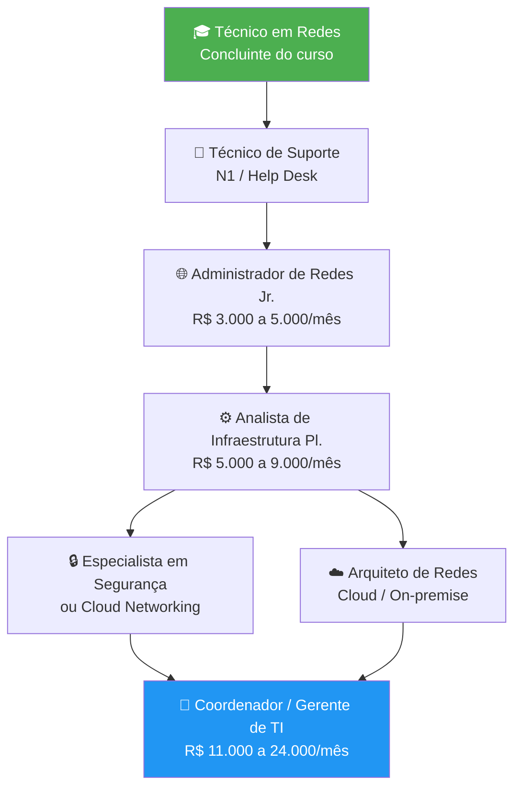
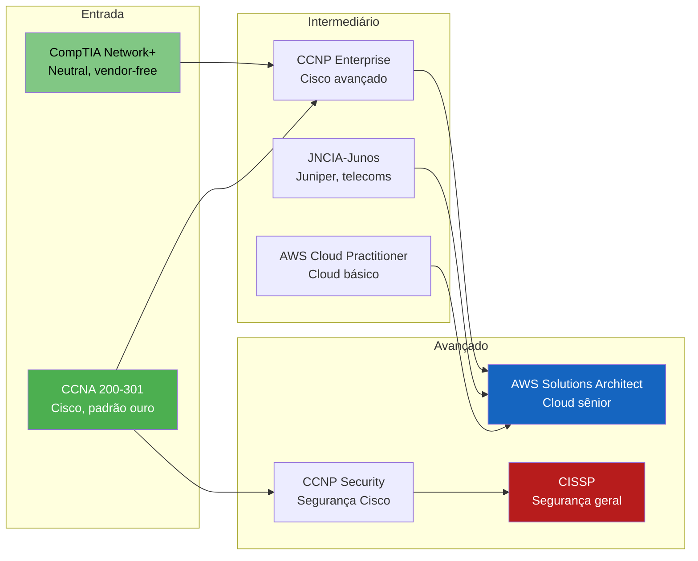
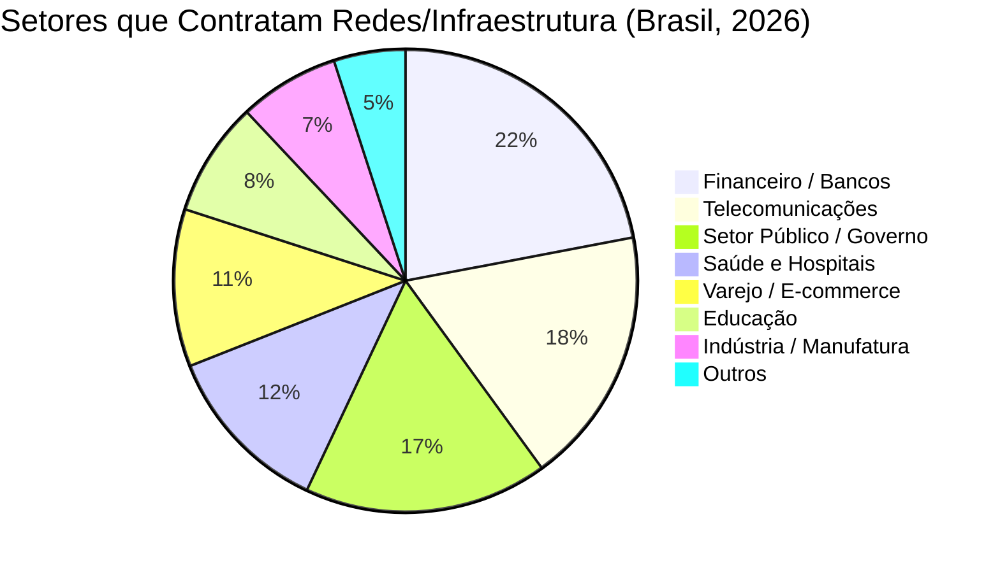

# Análise de Mercado

> [!quote] Conectando-se ao Mercado
> *Estar antenado com o mercado e suas necessidades é fundamental para direcionar seus estudos e carreira em TI.*

---

## 🎯 Objetivo

> [!info] Por que analisar o mercado?
> Entender quais conhecimentos e habilidades são mais demandados pelas empresas e concursos para direcionar seus estudos de forma estratégica.

---

## 🔍 Técnica Utilizada

> [!tip] Como Fazer

1. **Análise de vagas** abertas no LinkedIn
2. **Análise de editais** de concursos públicos
3. **Identificação de tendências** e tecnologias em alta

---

## ❓ Perguntas Orientadoras

> [!success] O que descobrir?

- Quais são os **assuntos mais atuais** de redes?
- Quais **certificações** são mais valorizadas?
- Quais **ferramentas** aparecem com frequência?
- Quais **habilidades** são exigidas?

---

## 📊 Panorama do Mercado de TI em 2026

> [!info] Dados Gerais do Setor (Brasil, 2025-2026)
> - **44%** das empresas brasileiras planejam ampliar suas equipes de Tecnologia em 2026.
> - Mais de **629 mil vagas** abertas em TI no Brasil entre 2025 e 2026 (crescimento de ~9,5%).
> - Salário médio em TI no Brasil: aproximadamente **R$ 7.666/mês** nos primeiros meses de 2026.
> - **48%** dos gestores de TI oferecem salários maiores a candidatos com certificações reconhecidas.

As três áreas de TI com **maior demanda** em 2026, segundo o Guia Salarial Robert Half, são:

1. **Segurança da Informação**
2. **Redes e Infraestrutura**
3. **Desenvolvimento de Software e Aplicações**

Redes e Infraestrutura aparece como área prioritária: as empresas dependem de conectividade estável para operar cloud, IoT, sistemas críticos e trabalho remoto. Sem rede, nada funciona.

---

## 💰 Faixas Salariais por Cargo (Glassdoor Brasil, jun/2026)

> [!warning] Atenção
> Salários variam muito por região, porte da empresa e certificações. Os valores abaixo são médias nacionais do Glassdoor com base em dados autodeclarados pelos profissionais.

| Cargo | Salário Mínimo | Salário Médio | Salário Máximo |
|-------|---------------|---------------|----------------|
| Técnico de Redes (entrada) | R$ 2.500 | R$ 3.500 | R$ 5.000 |
| Administrador de Redes | R$ 3.046 | R$ 4.733 | R$ 8.564 |
| Analista de Infraestrutura de TI | R$ 3.158 | R$ 4.300 | R$ 7.365 |
| Analista de Infraestrutura e Redes (sr.) | R$ 6.000 | R$ 8.500 | R$ 14.000 |
| Coordenador de Infraestrutura de TI | R$ 7.750 | R$ 11.733 | R$ 15.542 |
| Gerente de Infraestrutura de TI | R$ 11.260 | R$ 18.333 | R$ 24.375 |

> [!example] 🧪 Atividade 1: Pesquisa de Vagas Reais no LinkedIn
> **Plataforma:** [LinkedIn Jobs](https://www.linkedin.com/jobs/)
>
> **Passo a passo:**
> 1. Acesse o LinkedIn e vá em "Empregos" (você pode criar conta gratuita se não tiver).
> 2. Pesquise cada um desses termos, um por vez: `"administrador de redes"`, `"analista de infraestrutura"`, `"engenheiro de redes"`.
> 3. Filtre por: **País:** Brasil | **Nível:** Associado ou Pleno | **Data:** Último mês.
> 4. Abra **5 vagas diferentes** para cada termo e preencha a tabela abaixo.
>
> **Tabela para preencher:**
>
> | Cargo | Empresa | Localidade | Salário (se informado) | 3 Habilidades Exigidas |
> |-------|---------|------------|----------------------|----------------------|
> | | | | | |
> | | | | | |
>
> **Resultado observável:** Ao final, cada grupo terá um mapa real de quais habilidades aparecem em pelo menos 3 vagas diferentes. Essas são as habilidades com maior prioridade para estudar agora.

---

## 🗺️ Trilha de Carreira em Redes

O diagrama abaixo mostra o caminho típico de crescimento profissional na área de redes, do nível técnico ao estratégico:

> [!tip] Diferencial competitivo
> Profissionais que combinam **redes tradicionais + cloud networking + automação com Python** saem na frente em 2026. O mercado não quer mais apenas "quem configura switch": quer quem entende o todo da infraestrutura.

---

## 🏆 Certificações Mais Valorizadas em 2026

As certificações abaixo aparecem com frequência em vagas de emprego e editais de concurso. Elas funcionam como prova objetiva de competência para recrutadores.

| Certificação | Fornecedor | Nível | Foco Principal | Peso no Mercado BR |
|--------------|-----------|-------|----------------|--------------------|
| CompTIA Network+ | Neutro | Entrada | Fundamentos de rede | Alto (base) |
| CCNA 200-301 | Cisco | Entrada/Intermediário | Roteamento, switching, segurança básica | Muito alto |
| CCNP Enterprise | Cisco | Intermediário | SD-WAN, wireless, automação | Alto |
| JNCIA-Junos | Juniper | Entrada | Redes de telecoms e data centers | Médio (operadoras) |
| AWS Cloud Practitioner | Amazon | Entrada | Cloud e redes na nuvem | Alto (crescendo) |

> [!tip] Estratégia para iniciantes
> Comece pela **CompTIA Network+** para solidificar os fundamentos, depois parta para o **CCNA**. Com CCNA em mãos, o salário médio sobe cerca de 20 a 30% em comparação a profissionais sem certificação, segundo o relatório Robert Half 2026.

Veja mais detalhes em [[Certificações de redes]].

---

## 📋 Concursos Públicos: Redes e Infraestrutura (2025-2026)

> [!info] Por que acompanhar concursos?
> Editais de concurso público revelam exatamente quais tecnologias e conhecimentos o mercado formal exige. Mesmo que você não vá prestar concurso, os editais são um **mapa gratuito** do que estudar.

Exemplos de concursos recentes ou previstos para 2026 com cargos na área de redes:

| Órgão | Cargo | Vagas | Salário Inicial | Status (2026) |
|-------|-------|-------|-----------------|---------------|
| TJRJ | Analista de Infraestrutura | Múltiplas | Até R$ 9.363 | Provas realizadas fev/2026 |
| BACEN | Analista de TI (geral) | 560 previstas | Até R$ 20.000 | Aguardando edital |
| IBGE | Analista de Infraestrutura e Suporte | A confirmar | A confirmar | Previsão 2026 |
| IBGE | Analista de Redes e Telecomunicações | A confirmar | A confirmar | Previsão 2026 |
| TCE-PE | Auditor de Controle Externo (TI) | 55 + CR | R$ 15.553 | Edital publicado |

> [!warning] Como usar editais na sua preparação
> Pegue um edital de um concurso público de TI (links abaixo na seção de fontes) e leia a seção "Conteúdo Programático". Você verá temas como: Modelo OSI, TCP/IP, roteamento, switching, VPN, firewall, protocolos de segurança. Esses são os tópicos que o mercado formal considera essenciais.

---

## 🔥 Habilidades Técnicas em Alta: Redes + Contexto Atual (LinkedIn, 2026)

Segundo o LinkedIn Jobs Report 2026, as habilidades com maior crescimento de demanda para profissionais de infraestrutura e redes no Brasil incluem:

- **Cloud Networking** (AWS VPC, Azure Virtual Network, GCP Networking)
- **Automação de redes com Python** e ferramentas como Ansible e Terraform
- **Segurança em redes**: firewalls de próxima geração (NGFW), zero trust, microsegmentação
- **SD-WAN** (Software-Defined Wide Area Network): substituindo MPLS em empresas médias e grandes
- **Monitoramento e observabilidade**: Zabbix, Grafana, Prometheus, Elastic Stack
- **IPv6**: migrações em andamento no setor público e em ISPs
- **Virtualização de redes** (NFV, VMware NSX, SD-LAN)

> [!info] Conexão com o que você já estuda
> Tópicos como [[Modelos OSI e TCP IP]], [[Endereçamento IPv4]], [[Endereçamento IPv6]], [[Segurança de Redes]] e [[Computação em nuvem]] aparecem diretamente nessas habilidades em alta. Estudar bem os fundamentos é o atalho mais rápido para o mercado.

---

> [!example] 🧪 Atividade 2: Mapa de Salários e Certificações no Glassdoor
> **Plataforma:** [Glassdoor Brasil](https://www.glassdoor.com.br)
>
> **Passo a passo:**
> 1. Acesse o Glassdoor (conta gratuita ou login com Google).
> 2. Clique em "Salários" e pesquise cada cargo a seguir: `Administrador de Redes`, `Analista de Infraestrutura`, `Engenheiro de Redes`.
> 3. Filtre por: **Localidade:** sua cidade ou a capital mais próxima.
> 4. Anote o salário médio, o mínimo e o máximo para cada cargo.
> 5. Volte ao LinkedIn e localize uma vaga que pague acima da média: quais certificações ou habilidades extras essa vaga exige que as demais não exigem?
>
> **Resultado observável:** Você terá uma tabela com os valores reais do mercado local e identificará o "salto" de competência que diferencia os profissionais bem remunerados dos demais. Esse "salto" é o seu próximo objetivo de estudo.

---

## 🏢 Setores que Mais Contratam Profissionais de Redes

Não é só em empresas de tecnologia que há vagas. A demanda por profissionais de redes é transversal:

> [!tip] Oportunidade regional
> No interior e cidades médias (como Bom Jesus do Itabapoana e região), as oportunidades se concentram em: prefeituras e órgãos públicos, hospitais regionais, cooperativas, telecomunicações locais (provedores de internet) e empresas do agronegócio que estão se digitalizando. O profissional de redes com certificação tem alta empregabilidade regional, inclusive como prestador de serviços autônomo (MEI).

---

## 📚 Recursos Relacionados

> [!info] Veja Também

- [[Trabalhos e Projetos de Redes de Computadores]]
- [[Certificações de redes]]
- [[Tópicos/Redes de Computadores/Cursos online|Cursos online]]
- [[Ferramentas de rede]]
- [[Computação em nuvem]]
- [[Segurança de Redes]]
- [[Python para redes de computadores]]

---

> [!note] 📚 Fontes (2026)
> - [Guia Salarial 2026 Robert Half: Tecnologia](https://www.roberthalf.com/br/pt/insights/guia-salarial/tecnologia)
> - [Mercado de TI: áreas mais demandadas 2026 (FIAP)](https://www.fiap.com.br/2025/12/02/mercado-de-ti-guia-salarial-revela-areas-mais-demandadas-e-tendencias-para-2026/)
> - [Mercado de trabalho em TI no Brasil: tendências 2026 (InvGate)](https://blog.invgate.com/pt/mercado-para-ti)
> - [Guia Salarial TI 2026: áreas com mais vagas (Sindpd)](https://sindpd.org.br/2025/11/12/guia-salarial-areas-ti-vagas-2026/)
> - [Salário Administrador de Redes (Glassdoor, jun/2026)](https://www.glassdoor.com.br/Salários/administrador-de-redes-salário-SRCH_KO0,22.htm)
> - [Salário Analista de Infraestrutura e Redes (Glassdoor, abr/2026)](https://www.glassdoor.com.br/Salários/analista-de-infraestrutura-e-redes-salário-SRCH_KO0,34.htm)
> - [As 5 melhores certificações de redes para 2026 (GabrielDevs)](https://www.gabrieldevs.com.br/2026/04/as-5-melhores-certificacoes-de-redes.html)
> - [Certificações de Redes: CCNA, CompTIA ou JNCIA? (GabrielDevs)](https://www.gabrieldevs.com.br/2026/05/certificacoes-de-redes-ccna-comptia.html)
> - [10 habilidades em alta em TI 2026 segundo o LinkedIn (Canaltech)](https://canaltech.com.br/mercado/10-habilidades-que-estao-em-alta-na-area-de-ti-em-2026-segundo-o-linkedin/)
> - [Concursos TI 2026: editais publicados e previstos (Estratégia Concursos)](https://www.estrategiaconcursos.com.br/blog/concursos-ti/)
> - [Concursos TI 2026: salários de até R$ 22 mil (ConcursosEmAe)](https://concursosemae.com.br/concursos-ti-editais-abertos-previstos-brasil/)
> - [Tabela de cargos e salários TI 2026 (Nerdin)](https://www.nerdin.com.br/plano_de_cargos_e_salarios_ti.php)
