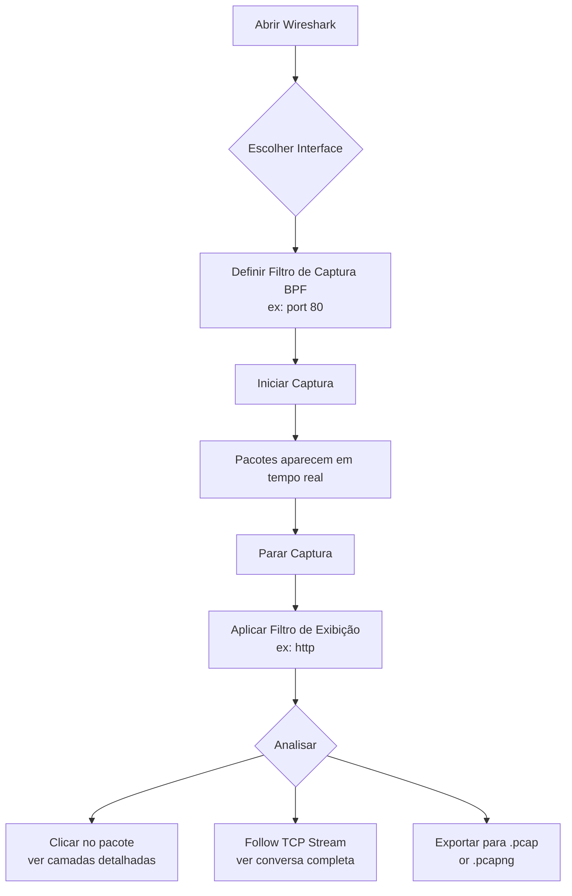
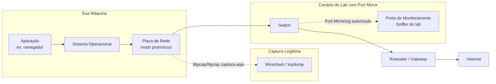

# Análise de Tráfego

> [!quote] Observando a Rede em Ação
> *A análise de tráfego permite entender o que está acontecendo na rede, identificar problemas de desempenho, detectar ameaças e solucionar falhas de conectividade.*

---

## 🔍 O que é Análise de Tráfego?

> [!info] Definição
> É o processo de capturar, inspecionar e interpretar os dados que trafegam pela rede para diagnóstico, segurança e otimização.

Cada vez que você abre um site, envia um e-mail ou faz uma videochamada, pacotes de dados percorrem a rede em frações de segundo. A análise de tráfego é a capacidade de "ver" esses pacotes: ler seus cabeçalhos, entender qual protocolo está sendo usado, identificar endereços de origem e destino, e detectar anomalias ou falhas.

Em termos práticos, um pacote capturado contém:

- **Cabeçalho de camada 2** (Ethernet): endereços MAC de origem e destino.
- **Cabeçalho de camada 3** (IP): endereços IP, TTL, protocolo encapsulado.
- **Cabeçalho de camada 4** (TCP/UDP): portas de origem e destino, flags, número de sequência.
- **Payload** (carga útil): os dados propriamente ditos, que podem estar em texto claro ou cifrados.

---

## ⚖️ Ética, Legalidade e Limites

> [!warning] Atenção: Captura de tráfego de terceiros é crime no Brasil
> O **artigo 154-A do Código Penal** (inserido pela Lei 12.737/2012, conhecida como "Lei Carolina Dieckmann", e agravado pela Lei 14.155/2021) criminaliza a invasão de dispositivo informático alheio, com pena de **1 a 4 anos de reclusão e multa**. Interceptar tráfego de rede sem autorização expressa configura infração grave.
>
> **Regra de ouro:** só capture pacotes no **seu próprio tráfego**, na **sua própria rede** ou em um **laboratório controlado** com autorização documentada de todos os envolvidos.

### O que é permitido sem autorização de terceiros

- Capturar o tráfego gerado pela **sua própria máquina** (loopback `lo` ou interface de rede local).
- Monitorar tráfego em **redes de laboratório** criadas especificamente para fins didáticos (VMs isoladas, redes virtuais).
- Capturar em **redes corporativas ou institucionais** quando há autorização escrita do responsável.
- Analisar arquivos `.pcap` públicos disponibilizados para fins de estudo (ex.: Wireshark Sample Captures).

### O que é proibido

- Capturar tráfego de outros usuários em uma rede Wi-Fi pública ou privada sem autorização.
- Usar modo promíscuo em switch corporativo para interceptar tráfego alheio.
- Armazenar ou redistribuir capturas que contenham dados pessoais de terceiros (LGPD).

> [!danger] Modo promíscuo vs. modo normal
> Em modo normal, a placa de rede descarta pacotes não destinados a ela. Em **modo promíscuo**, ela aceita todos os pacotes que chegam ao segmento. Ferramentas como Wireshark e tcpdump ativam esse modo automaticamente ao iniciar uma captura. Em redes comutadas (switch), isso só captura o tráfego do próprio host (mais o broadcast/multicast) a menos que haja ARP spoofing ou port mirroring autorizado.

---

## 🛠️ Ferramentas Principais

| Ferramenta | Tipo | Uso Principal | Versão Estável (2026) |
|------------|------|---------------|----------------------|
| **Wireshark** | GUI | Análise detalhada e visual de pacotes | 4.6.6 |
| **tcpdump** | CLI | Captura rápida em linha de comando, servidores sem GUI | 4.99.x |
| **tshark** | CLI | Versão terminal do Wireshark, filtragem e exportação automatizadas | 4.6.6 |
| **NetworkMiner** | GUI | Análise forense, reconstrução de sessões e arquivos | 2.9 |

> [!tip] Quando usar cada ferramenta
> Use **Wireshark** para análise interativa e visual. Use **tcpdump** para captura rápida em servidores Linux remotos sem interface gráfica. Use **tshark** quando quiser combinar a potência dos filtros do Wireshark com scripts de automação em bash ou Python. Use **NetworkMiner** para reconstruir arquivos (imagens, documentos) transferidos por HTTP capturados numa sessão.

---

## 📦 Como Funciona a Captura de Pacotes

### A pilha libpcap/Npcap

Tanto o Wireshark quanto o tcpdump usam uma biblioteca de captura de baixo nível:

- **libpcap** (Linux/macOS): intercepta pacotes diretamente no driver de rede, antes de chegarem ao socket da aplicação.
- **Npcap** (Windows): equivalente Windows do libpcap, mantido pelo time do Nmap. A versão 1.83 vem com o Wireshark 4.6.

```
Pacote na rede
      |
   Driver de rede (kernel)
      |
   libpcap / Npcap  <-- ponto de captura
      |
   Wireshark / tcpdump (espaço do usuário)
      |
   Arquivo .pcap / exibição na tela
```

### O que é um arquivo .pcap?

O formato `.pcap` (Packet Capture) é o padrão para armazenar capturas de rede. O Wireshark salva por padrão em `.pcapng` (pcap Next Generation), que suporta metadados adicionais, múltiplas interfaces e comentários por pacote. Ambos os formatos são interoperáveis: um arquivo capturado pelo tcpdump pode ser aberto no Wireshark e vice-versa.

---

## 🔎 Dois Tipos de Filtro: Captura vs. Exibição

Esta é uma das distinções mais importantes ao usar Wireshark e tcpdump. Confundi-los causa frustração desnecessária.

### Filtros de Captura (Berkeley Packet Filter, BPF)

Aplicados **antes** de os pacotes serem gravados. Funcionam no nível do kernel: pacotes que não correspondem ao filtro são **descartados pelo driver** e nunca chegam à aplicação. São mais eficientes em termos de desempenho, mas usam uma sintaxe mais limitada.

Exemplos de filtros BPF:

```
host 192.168.1.10          # só tráfego de ou para esse IP
port 80                    # só tráfego na porta 80
tcp port 443               # só TCP na porta 443 (HTTPS)
icmp                       # só pacotes ICMP (ping)
not port 22                # tudo exceto SSH
net 192.168.1.0/24         # toda a sub-rede
src host 10.0.0.5          # só pacotes originados de 10.0.0.5
dst port 53                # só pacotes destinados à porta 53 (DNS)
```

No Wireshark, o filtro de captura é inserido antes de iniciar a captura (campo "Capture Filter"). No tcpdump, o filtro BPF é passado diretamente na linha de comando.

### Filtros de Exibição (Display Filters)

Aplicados **depois** que os pacotes já foram capturados. Não eliminam pacotes do arquivo, apenas controlam o que é mostrado na tela. Usam uma sintaxe mais rica e expressiva, própria do Wireshark/tshark.

Exemplos de filtros de exibição:

```
http                          # só pacotes HTTP
tls                           # só pacotes TLS/SSL
dns                           # só consultas e respostas DNS
tcp.flags.syn == 1            # pacotes com flag SYN ativo
ip.addr == 192.168.1.10       # tráfego de ou para um IP
tcp.port == 8080              # TCP na porta 8080
http.request.method == "GET"  # só requisições HTTP GET
http.request.method == "POST" # só requisições HTTP POST (útil pra ver dados enviados)
tcp.analysis.retransmission   # retransmissões TCP (indica perda de pacote)
arp                           # protocolo ARP
icmp                          # protocolo ICMP
frame contains "password"     # frames que contêm a string "password"
tls.handshake.type == 1       # ClientHello do TLS (início de handshake)
```

---

## 📊 Tabela de Filtros Úteis por Cenário

| Cenário | Filtro de Captura (BPF) | Filtro de Exibição |
|---------|------------------------|--------------------|
| Ver tráfego HTTP em claro | `port 80` | `http` |
| Ver tráfego HTTPS cifrado | `tcp port 443` | `tls` |
| Analisar resoluções DNS | `port 53` | `dns` |
| Verificar ping/ICMP | `icmp` | `icmp` |
| Ver apenas tráfego de um host | `host 192.168.1.5` | `ip.addr == 192.168.1.5` |
| Detectar retransmissões TCP | `tcp` | `tcp.analysis.retransmission` |
| Ver handshake TCP (SYN) | `tcp` | `tcp.flags.syn == 1 && tcp.flags.ack == 0` |
| Filtrar tráfego SSH | `not port 22` | `not tcp.port == 22` |
| Capturar só loopback | `host 127.0.0.1` | `ip.addr == 127.0.0.1` |
| Ver dados ARP (quem é quem) | `arp` | `arp` |
| Buscar string no payload | (não suportado em BPF simples) | `frame contains "login"` |

---

## 🖥️ Wireshark: Interface e Fluxo de Trabalho



### Painéis do Wireshark

O Wireshark divide a tela em três painéis principais:

1. **Lista de Pacotes** (painel superior): cada linha é um pacote, com timestamp, endereços, protocolo e resumo. Pacotes podem ser coloridos automaticamente por protocolo (vermelho para erros, verde para HTTP, etc.).
2. **Detalhes do Pacote** (painel do meio): árvore expansível com todas as camadas do pacote (Ethernet, IP, TCP, HTTP etc.). Clicar em um campo o destaca no painel de bytes.
3. **Bytes do Pacote** (painel inferior): representação hexadecimal e ASCII dos bytes brutos do pacote. Fundamental para entender o que está em texto claro.

### Follow TCP Stream

Uma das funcionalidades mais poderosas do Wireshark: selecionar um pacote TCP e clicar em **Analyze > Follow > TCP Stream** reconstrói a conversa completa entre cliente e servidor, mostrando os dados em texto legível. Em conexões HTTP sem TLS, é possível ver o conteúdo das páginas, cookies, credenciais e qualquer dado enviado em claro.

---

> [!example] 🧪 Atividade 1: HTTP em claro vs. TLS cifrado no Wireshark
>
> **Objetivo:** observar a diferença entre uma requisição HTTP (texto claro) e uma HTTPS/TLS (cifrada) capturadas no seu próprio tráfego.
>
> **Pré-requisito:** Wireshark instalado. Nenhuma permissão especial de rede necessária.
>
> **Passos:**
>
> 1. Abra o Wireshark e selecione sua interface de rede ativa (ex.: `eth0`, `wlan0`).
> 2. No campo **Capture Filter**, deixe em branco (captura tudo) ou coloque `port 80 or port 443`.
> 3. Clique em **Start** (botão azul de tubarão).
> 4. Abra o navegador e acesse um site em HTTP puro: `http://neverssl.com` (site criado exatamente para testes sem TLS).
> 5. Volte ao Wireshark e pare a captura.
> 6. No campo **Display Filter**, digite `http` e pressione Enter.
> 7. **Resultado esperado:** você verá as requisições `GET /` e as respostas `HTTP/1.1 200 OK`. Clique em um pacote de resposta e expanda o painel "Hypertext Transfer Protocol". O corpo HTML da página aparece em texto claro no painel de bytes.
> 8. Agora limpe o filtro, reinicie a captura e acesse `https://www.example.com`.
> 9. Pare a captura e aplique o filtro `tls`.
> 10. **Resultado esperado:** você verá pacotes `TLSv1.3 Application Data`. Clique em um pacote: o payload (carga útil) aparece como bytes cifrados, sem nenhuma informação legível. O handshake TLS é visível (`ClientHello`, `ServerHello`, `Certificate`), mas o conteúdo das requisições HTTP está completamente protegido.
>
> **Pergunta para reflexão:** o que um atacante capturando o tráfego de rede veria em cada cenário?

---

## 💻 tcpdump: Linha de Comando

O tcpdump é o padrão em servidores Linux sem interface gráfica. Sua sintaxe é direta e seus filtros BPF são idênticos aos usados no Wireshark em modo de captura.

### Comandos Fundamentais

```bash
# Listar interfaces disponíveis
tcpdump -D

# Capturar na interface padrão (verbose, sem resolver nomes)
tcpdump -i any -n

# Capturar 10 pacotes e parar
tcpdump -i any -n -c 10

# Capturar com mais verbosidade (ver TTL, tamanho, flags)
tcpdump -i eth0 -v

# Capturar só pacotes ICMP (ping)
tcpdump -i any icmp

# Capturar só tráfego HTTP (porta 80)
tcpdump -i any port 80

# Capturar e salvar em arquivo para análise no Wireshark
tcpdump -i any -w captura.pcap

# Ler um arquivo .pcap salvo
tcpdump -r captura.pcap

# Capturar e mostrar o conteúdo em ASCII (útil para HTTP em claro)
tcpdump -i any -A port 80

# Capturar e mostrar em hexadecimal e ASCII
tcpdump -i any -X port 80

# Filtrar por host de destino e porta
tcpdump -i any dst host 8.8.8.8 and port 53
```

### Entendendo a Saída do tcpdump

Uma linha típica de saída do tcpdump tem este formato:

```
14:23:07.419881 IP 192.168.1.5.52341 > 142.250.79.78.443: Flags [S], seq 1234567890, win 64240, length 0
```

- `14:23:07.419881`: timestamp com microssegundos.
- `IP`: protocolo de camada 3 (IPv4). Pode ser `IP6` para IPv6, `ARP` para ARP.
- `192.168.1.5.52341`: IP de origem e porta de origem.
- `142.250.79.78.443`: IP de destino e porta de destino.
- `Flags [S]`: flags TCP. `S` = SYN, `A` = ACK, `F` = FIN, `R` = RST, `P` = PSH.
- `seq`: número de sequência TCP.
- `win`: tamanho da janela TCP (flow control).
- `length 0`: tamanho do payload (0 no caso de um SYN puro).

---

> [!example] 🧪 Atividade 2: Captura com tcpdump e leitura dos primeiros pacotes
>
> **Objetivo:** usar o tcpdump diretamente no terminal para capturar e ler pacotes do seu próprio tráfego.
>
> **Pré-requisito:** Linux com tcpdump instalado (`sudo apt install tcpdump`). Executar com `sudo` ou como root.
>
> **Passos:**
>
> 1. Abra um terminal e execute:
>    ```bash
>    sudo tcpdump -i any -n -c 10
>    ```
>    O `-c 10` faz o tcpdump parar automaticamente após capturar 10 pacotes.
>
> 2. Em outro terminal (ou em seguida), gere tráfego: abra um site no navegador ou execute:
>    ```bash
>    curl -s https://example.com > /dev/null
>    ```
>
> 3. **Resultado esperado:** o tcpdump exibe 10 linhas, cada uma representando um pacote. Identifique:
>    - O seu próprio IP (`ip addr show` para descobrir qual é).
>    - Pacotes TCP com `Flags [S]` (SYN, início de conexão) e `Flags [SA]` (SYN-ACK, resposta do servidor).
>    - Pacotes UDP para porta 53 (consultas DNS), se houver resolução de nome.
>
> 4. Agora tente com um filtro mais específico:
>    ```bash
>    sudo tcpdump -i any -n -c 10 port 53
>    ```
>    Abra um site ou execute `nslookup google.com` em outro terminal.
>
> 5. **Resultado esperado:** só pacotes DNS aparecem. Você verá as consultas (`A? google.com`) e as respostas com os endereços IP retornados.
>
> **Variação:** experimente `-A port 80` em vez de `-n -c 10 port 53` para ver o conteúdo ASCII de uma resposta HTTP.

---

> [!example] 🧪 Atividade 3: Capturar um ping e identificar ICMP request/reply
>
> **Objetivo:** observar o par de pacotes ICMP Echo Request e Echo Reply gerados pelo comando `ping`, tanto no tcpdump quanto no Wireshark.
>
> **Parte A: com tcpdump**
>
> 1. Em um terminal, execute:
>    ```bash
>    sudo tcpdump -i any -n icmp
>    ```
> 2. Em outro terminal, execute:
>    ```bash
>    ping -c 4 8.8.8.8
>    ```
> 3. **Resultado esperado:** para cada `ping`, o tcpdump mostra dois pacotes:
>    - `> 8.8.8.8: ICMP echo request` (saindo da sua máquina).
>    - `8.8.8.8 >`: `ICMP echo reply` (resposta do servidor DNS do Google).
> 4. Note o campo `id` (identificador) e `seq` (sequência) nos pacotes. Request e reply têm o mesmo `id` e `seq`, comprovando que são o par correspondente.
>
> **Parte B: com Wireshark**
>
> 1. Abra o Wireshark, selecione sua interface e inicie a captura (sem filtro de captura ou com `icmp`).
> 2. Execute `ping -c 4 8.8.8.8` no terminal.
> 3. Pare a captura e aplique o filtro de exibição: `icmp`
> 4. **Resultado esperado:** você verá pares de linhas coloridas: uma com `Echo (ping) request` e outra com `Echo (ping) reply`. Clique em um pacote `Echo request` e expanda o painel "Internet Control Message Protocol" para ver o tipo (8 = request), código (0) e o payload do ping.
> 5. Clique na linha de request e depois em `Edit > Mark/Unmark Packet`. Em seguida, use **Analyze > Follow > ICMP Stream** (se disponível na sua versão) para ver o par request/reply lado a lado.

---

## 📡 Onde o Sniffer Fica na Rede



> [!info] Por que o switch dificulta o sniffing em rede comutada
> Em redes com **hub** (obsoleto), todos os pacotes chegam a todas as portas, facilitando a captura. Em redes com **switch** modernos, o switch encaminha pacotes apenas para a porta de destino correta. Isso limita a captura aos pacotes destinados à sua própria máquina (mais broadcasts). Para monitorar tráfego de outros hosts em um switch, é necessário:
> 1. **Port Mirroring** (SPAN): configurado pelo administrador, replica o tráfego de uma porta para a porta de monitoramento.
> 2. **ARP Spoofing**: técnica ofensiva que envenena tabelas ARP para redirecionar tráfego. Ilegal sem autorização.

---

## 🕵️ Perspectiva Ofensiva: Sniffing e Análise de Protocolos em Claro

> [!warning] Este conteúdo é para fins educacionais em ambiente de laboratório próprio
> As técnicas abaixo ilustram por que protocolos sem criptografia são perigosos. Aplique APENAS no seu próprio tráfego ou em um lab isolado com autorização. Capturar tráfego alheio é crime (art. 154-A CP).

### O que um atacante com acesso à rede pode ver

Em protocolos que não usam criptografia, o payload do pacote está em texto claro. Um atacante na mesma rede (ou com acesso a um ponto de captura) pode ver:

| Protocolo | Porta | O que vaza em texto claro |
|-----------|-------|--------------------------|
| HTTP | 80 | URLs visitadas, cookies, formulários, credenciais |
| FTP | 21 | Usuário, senha, lista de arquivos, conteúdo transferido |
| Telnet | 23 | Tudo: comandos, saídas, senha de login |
| SMTP (sem STARTTLS) | 25 | Remetente, destinatário, corpo do e-mail |
| POP3 (sem SSL) | 110 | Usuário, senha, e-mails baixados |
| DNS | 53 | Todos os domínios que você resolve (mesmo com HTTPS, DNS revela destinos) |

### Como o TLS protege o tráfego

O TLS (Transport Layer Security, versão atual: 1.3) criptografa o payload a partir do handshake. No Wireshark, um pacote TLS 1.3 mostra:

- **ClientHello** e **ServerHello**: negociação de cipher suite (visível, necessário para estabelecer conexão).
- **Certificate**: certificado do servidor (visível, público por definição).
- **Application Data**: payload completamente cifrado. Sem a chave de sessão, é impossível decifrar.

> [!tip] Decifrar TLS no Wireshark com SSLKEYLOGFILE
> Em ambiente de laboratório (nunca em produção), é possível decifrar o tráfego TLS do seu próprio navegador. Configure a variável de ambiente `SSLKEYLOGFILE=/tmp/tls-keys.log` antes de abrir o Chrome ou Firefox, faça suas requisições, e aponte o Wireshark para esse arquivo em **Edit > Preferences > Protocols > TLS > (Pre)-Master-Secret log filename**. O Wireshark descriptografa os pacotes TLS capturados em tempo real. Isso funciona apenas para o tráfego do seu próprio navegador.

### Análise de handshake TCP (three-way handshake)

O handshake de três vias do TCP é visível em qualquer captura. Para filtrar:

```
tcp.flags.syn == 1 && tcp.flags.ack == 0    # SYN (início de conexão)
tcp.flags.syn == 1 && tcp.flags.ack == 1    # SYN-ACK (servidor aceitou)
tcp.flags.fin == 1                           # FIN (encerrando conexão)
tcp.flags.reset == 1                         # RST (conexão recusada/abortada)
```

Um RST inesperado geralmente indica uma porta fechada (o servidor rejeitou a conexão) ou um firewall bloqueando o tráfego.

---

## 🔬 tshark: Wireshark na Linha de Comando

O tshark combina a potência dos filtros de exibição do Wireshark com a conveniência do terminal. É ideal para automatizar análises e extrair campos específicos de capturas.

```bash
# Capturar 20 pacotes e exibir na tela
tshark -i eth0 -c 20

# Usar filtro de exibição na captura ao vivo
tshark -i any -Y "http"

# Ler um .pcap e aplicar filtro
tshark -r captura.pcap -Y "dns"

# Extrair campos específicos (IP de origem, porta, protocolo)
tshark -r captura.pcap -T fields -e ip.src -e tcp.dstport -e _ws.col.Protocol

# Contar pacotes por protocolo
tshark -r captura.pcap -q -z io,phs

# Exportar objetos HTTP (arquivos baixados via HTTP)
tshark -r captura.pcap --export-objects http,/tmp/objetos-http/
```

---

## 📡 Wireshark 4.6: Novidades Relevantes (out/2025 a mai/2026)

A série 4.6 do Wireshark trouxe melhorias importantes para quem faz análise de tráfego:

- **Novo diálogo "Plots"**: substitui o antigo I/O Graphs com gráficos de dispersão, múltiplas visualizações simultâneas e rolagem automática em capturas ao vivo.
- **Compressão durante captura ao vivo**: agora é possível comprimir o arquivo `.pcap` enquanto a captura acontece (antes, a compressão só funcionava ao rotacionar arquivos).
- **Timestamps em ISO 8601 UTC**: saídas em JSON e outros formatos legíveis por máquina agora usam timestamp padronizado, facilitando integração com SIEMs e scripts.
- **Suporte a BPF extensions no Linux**: filtros de captura podem usar `inbound`, `outbound` e `ifindex` em kernels modernos.
- **Npcap 1.83 no Windows**: melhoria de estabilidade na captura em interfaces de alta velocidade.
- **Versão atual (jun/2026)**: 4.6.6, com correções em dissectors de Kafka, SIP e PFCP.

---

## 🎯 Casos de Uso

> [!success] Aplicações Práticas

- **Diagnóstico de problemas** de conectividade: identificar se pacotes chegam ao destino, detectar retransmissões e timeouts.
- **Análise de segurança** e detecção de intrusões: identificar tráfego anômalo, varreduras de porta, beaconing de malware.
- **Verificação de protocolos** e configurações: confirmar que um serviço está respondendo corretamente, validar headers HTTP, verificar handshakes TLS.
- **Otimização de desempenho**: detectar retransmissões TCP excessivas, janelas pequenas, latência por DNS.
- **Forense digital** e investigações: reconstruir sessões, extrair arquivos transferidos, mapear comunicações.
- **Educação e aprendizado**: entender na prática como os protocolos funcionam camada por camada.

---

## 💡 Dicas de Uso Avançado

> [!tip] Coloração Personalizada no Wireshark
> O Wireshark já vem com regras de coloração padrão (HTTP em verde, TCP com erros em vermelho). Em **View > Coloring Rules**, você pode adicionar suas próprias regras. Por exemplo: colora em amarelo todos os pacotes com `tcp.analysis.retransmission` para identificar problemas de desempenho instantaneamente.

> [!tip] Estatísticas Rápidas
> Em **Statistics > Conversations**, você vê um resumo de todas as conversas TCP e UDP capturadas, com volume de dados transferido por par de IPs. Útil para identificar qual host está gerando mais tráfego. Em **Statistics > Protocol Hierarchy**, vê a distribuição de protocolos em porcentagem.

> [!tip] Arquivos .pcap de Prática
> O projeto Wireshark disponibiliza capturas de exemplo para estudo em `https://wiki.wireshark.org/SampleCaptures`. São arquivos com tráfego real de protocolos variados (FTP com credenciais em claro, HTTP, DNS, etc.), ideais para praticar filtros sem precisar gerar tráfego.

---

## 📚 Recursos Relacionados

> [!tip] Veja Também

- [[Ferramentas de rede]]
- [[Modelos OSI e TCP IP]]
- **Segurança de Redes**

---

> [!note] 📚 Fontes (2025-2026)
>
> - [Wireshark: Análise de Pacotes em 12 Passos (2026)](https://shattered.io/pt/2026/06/13/wireshark-analise-pacotes-12-passos/)
> - [Filtros Wireshark Avançados: HomeServer.pt (2026)](https://homeserver.pt/artigos/filtros-wireshark-avancados-analisar-rede/)
> - [Wireshark além do básico: filtros que todo analista deveria saber (2026)](https://www.gabrieldevs.com.br/2026/06/wireshark-alem-do-basico-filtros-que.html)
> - [Wireshark e tcpdump: uma dupla poderosa: alexconnect.io](https://alexconnect.io/wireshark-e-tcpdump-uma-dupla-poderosa/)
> - [The Complete Wireshark Cheat Sheet 2025: Medium](https://medium.com/@rajbhatia21.21/the-complete-wireshark-cheat-sheet-master-network-analysis-in-2025-856ca807a9c8)
> - [Wireshark Cheat Sheet: StationX](https://www.stationx.net/wireshark-cheat-sheet/)
> - [tcpdump Cheat Sheet 2026: StationX](https://www.stationx.net/tcpdump-cheat-sheet/)
> - [tcpdump Examples: GeeksforGeeks](https://www.geeksforgeeks.org/linux-unix/tcpdump-command-in-linux-with-examples/)
> - [Capture Packets with tcpdump: OneUptime (2026)](https://oneuptime.com/blog/post/2026-03-04-capture-analyze-network-packets-tcpdump-rhel-9/view)
> - [Wireshark 4.6.0: Novidades (out/2025)](https://www.wireshark.org/blog/2025-10-08-whats-new-in-wireshark-46)
> - [Wireshark 4.6.0: Release Notes oficiais](https://www.wireshark.org/docs/relnotes/wireshark-4.6.0.html)
> - [tshark Tutorial e Filtros: HackerTarget](https://hackertarget.com/tshark-tutorial-and-filter-examples/)
> - [Art. 154-A do Código Penal: Jusbrasil](https://www.jusbrasil.com.br/artigos/crime-de-invasao-de-dispositivo-informatico-artigo-154-a-cp/153070617)
> - [Lei 14.155/2021: Planalto](https://www.planalto.gov.br/ccivil_03/_ato2019-2022/2021/lei/l14155.htm)
