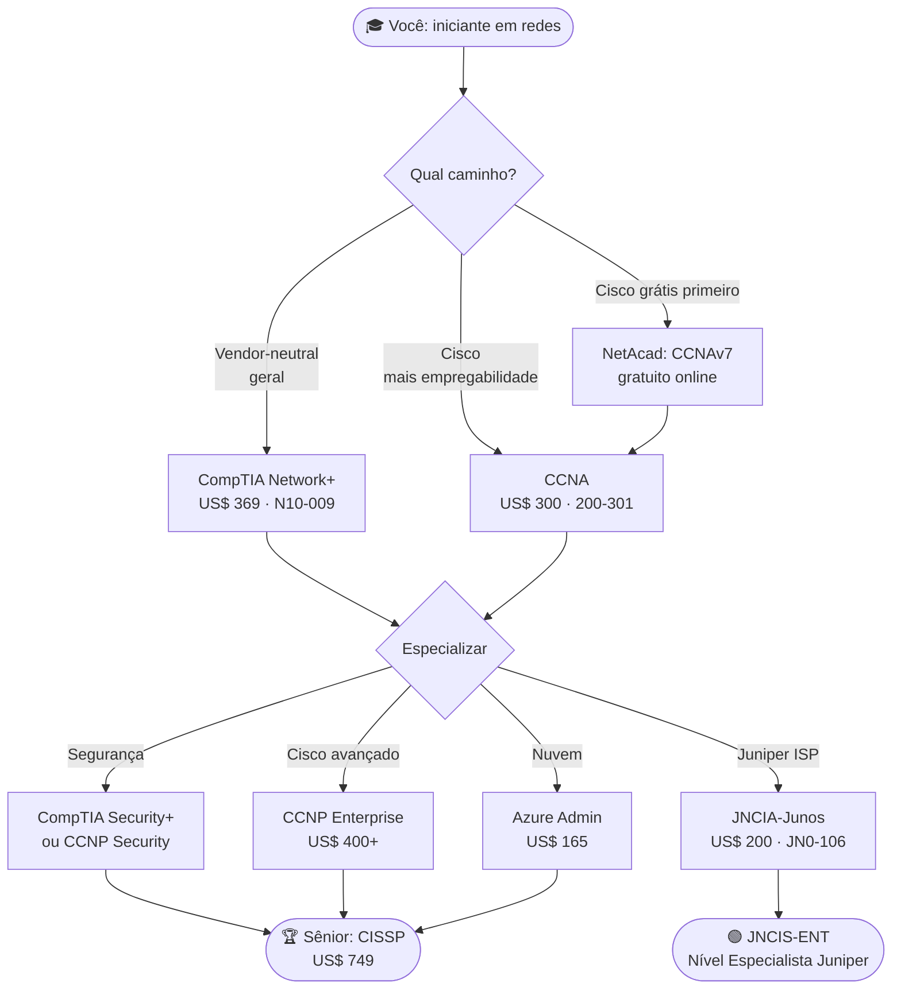

# Certificações de Redes

> [!quote] Validando seu Conhecimento
> *Certificações são uma forma reconhecida de comprovar suas habilidades e impulsionar sua carreira em TI.*

---

## 🏆 Certificações Cisco

> [!info] A Referência do Mercado
> As certificações Cisco são as mais reconhecidas e respeitadas globalmente na área de redes. A empresa mantém um programa estruturado em três grandes níveis, permitindo que o profissional avance progressivamente do nível associado até o especialista.

### CCNA: Cisco Certified Network Associate

| Característica | Descrição |
|----------------|-----------|
| **Nível** | Associado (Entrada) |
| **Código do exame** | 200-301 |
| **Foco** | Redes de tamanho médio |
| **Habilidades** | Instalar, configurar, operar e solucionar problemas |
| **Reconhecimento** | Global |
| **Duração do exame** | 120 minutos |
| **Validade** | 3 anos |
| **Preço (2026)** | US$ 300 (via Pearson VUE) |
| **Desconto NetAcad** | Até 50% para alunos da Cisco Networking Academy |

#### Domínios do exame CCNA 200-301 (2026)

| Domínio | Peso |
|---------|------|
| Network Fundamentals | 20% |
| Network Access | 20% |
| IP Connectivity | 25% |
| IP Services | 10% |
| Security Fundamentals | 15% |
| Automation and Programmability | 10% |

> [!tip] 💡 Novidade no CCNA (2026)
> O currículo atual incorpora tópicos de IA Generativa, Cloud Management e Machine Learning, além dos tradicionais roteamento, switching e redes sem fio. Automação e programabilidade (Python, APIs REST, Ansible) já valem 10% da prova.

### CCNP: Cisco Certified Network Professional

| Característica | Descrição |
|----------------|-----------|
| **Nível** | Profissional (Avançado) |
| **Pré-requisito** | CCNA ou experiência equivalente |
| **Foco** | Aprofundamento em redes corporativas |
| **Trilhas disponíveis** | Enterprise, Security, Data Center, Collaboration, Service Provider |
| **Formato** | 1 exame core + 1 exame de concentração (escolha do candidato) |
| **Validade** | 3 anos |

---

## 🎯 CompTIA Network+

> [!tip] Certificação Vendor-Neutral
> A Network+ é a principal certificação de redes independente de fabricante, reconhecida por empregadores que buscam profissionais com conhecimento abrangente, sem dependência de um único ecossistema tecnológico (como Cisco ou Juniper).

| Característica | Descrição |
|----------------|-----------|
| **Nível** | Entrada |
| **Código do exame** | N10-009 (versão atual, lançada em junho de 2024) |
| **Diferencial** | Não vinculada a fabricante específico |
| **Habilidades** | Projetar, configurar, gerenciar e solucionar problemas |
| **Abrangência** | Redes com fio e sem fio |
| **Duração do exame** | 90 minutos |
| **Questões** | Até 90 (múltipla escolha e performance-based) |
| **Nota de aprovação** | 720 de 900 |
| **Validade** | 3 anos |
| **Preço (2026)** | US$ 369 (tabela cheia); cerca de US$ 219 com voucher acadêmico |
| **Previsão de aposentadoria** | 2027 |

#### Principais mudanças no N10-009 em relação ao N10-008

- Maior peso em **troubleshooting e operações** no dia a dia
- Cobertura expandida de **SDN** (Software-Defined Networking) e **SD-WAN**
- Layout físico de data centers: planejamento de MDF e IDF
- **Automação** de provisionamento e manutenção de redes
- Redução leve na cobertura de segurança (que migrou para a Security+)

---

## 🌿 Juniper JNCIA-Junos

> [!info] Alternativa à Cisco
> A Juniper Networks é a segunda maior fabricante de equipamentos de rede corporativa e é muito utilizada em provedores de internet (ISPs), ambientes financeiros e grandes infraestruturas de telecomunicações.

| Característica | Descrição |
|----------------|-----------|
| **Nível** | Associado |
| **Código do exame** | JN0-106 (versão atual, ativa desde abril de 2026) |
| **Foco** | Produtos e soluções Juniper Networks com JunOS |
| **Para quem** | Profissionais com conhecimento básico de redes |
| **Duração** | 90 minutos |
| **Questões** | 65 múltipla escolha |
| **Resultado** | Imediato após o exame |
| **Validade** | 3 anos |
| **Preço (2026)** | US$ 200 (via Pearson VUE) |

> [!warning] ⚠️ Versão atualizada em 2026
> O exame JN0-105 foi descontinuado em abril de 2026. A versão atual é o **JN0-106**, com conteúdo atualizado sobre JunOS e tecnologias de nuvem da Juniper.

---

## 🔐 CISSP

> [!warning] Segurança da Informação

| Característica | Descrição |
|----------------|-----------|
| **Nível** | Avançado |
| **Foco** | Segurança da informação (inclui redes) |
| **Reconhecimento** | Altamente valorizado |
| **Abrangência** | Ampla gama de tópicos de segurança |
| **Experiência exigida** | 5 anos na área |

---

## ☁️ Microsoft Azure Administrator

> [!info] Redes na Nuvem

| Característica | Descrição |
|----------------|-----------|
| **Foco** | Redes na plataforma Azure |
| **Habilidades** | Balanceadores de carga, VPNs, gateways |
| **Tendência** | Cloud computing em alta demanda |

---

## 📊 Comparativo Atualizado (2026) 🆕

> [!success] Qual Escolher?
> Use a tabela abaixo para comparar as três principais opções para quem está começando. Preços em dólares americanos (US$), cotados em 2026 nos sites oficiais.

| Certificação | Nível | Fabricante | Preço do exame (US$) | Validade | Questões | Foco principal |
|--------------|-------|------------|----------------------|----------|----------|----------------|
| **CCNA 200-301** | Associado | Cisco | US$ 300 | 3 anos | 120 min | Roteamento, switching, automação |
| **Network+ N10-009** | Entrada | CompTIA (vendor-neutral) | US$ 369 | 3 anos | Até 90 | Fundamentos gerais de redes |
| **JNCIA-Junos JN0-106** | Associado | Juniper | US$ 200 | 3 anos | 65 | JunOS, redes ISP |
| **CCNP Enterprise** | Profissional | Cisco | US$ 400+ | 3 anos | Variável | Redes corporativas avançadas |
| **CISSP** | Avançado | ISC2 | US$ 749 | 3 anos | 100-150 | Segurança ampla |
| **Azure Administrator** | Associado | Microsoft | US$ 165 | 1 ano | 40-60 | Redes em nuvem Azure |

> [!tip] 💡 Dica de custo
> Para estudantes universitários ou de cursos técnicos, a **CompTIA oferece vouchers acadêmicos** com desconto de cerca de 40%. A **Cisco Networking Academy** (NetAcad) oferece desconto de até 50% no CCNA para quem conclui os cursos gratuitos da plataforma.

---

## 🗺️ Trilha de Certificações: do Iniciante ao Avançado

---

## 🎯 Trilha Recomendada

> [!tip] Por Onde Começar?

1. **CompTIA Network+** (base teórica sólida, vendor-neutral, ideal para quem quer entender conceitos antes de se prender a um fabricante)
2. **CCNA** (habilidades práticas em redes Cisco, exigido na maioria das vagas de administrador de redes no Brasil)
3. **CCNP** ou **Especialização** (aprofundamento na área desejada: segurança, nuvem, data center, etc.)

---

## 🔬 Atividades Práticas

> [!example] 🧪 Atividade 1: Comparar CCNA, Network+ e JNCIA nos sites oficiais
>
> **Objetivo:** levantar preço atual, tópicos cobrados e validade das três certificações diretamente na fonte.
>
> **Passos:**
> 1. Acesse os três sites abaixo em abas separadas:
>    - CCNA: https://learningnetwork.cisco.com/s/ccna-exam-topics
>    - Network+: https://www.comptia.org/certifications/network
>    - JNCIA-Junos: https://www.juniper.net/us/en/training/certification/tracks/junos/jncia-junos.html
> 2. Para cada certificação, preencha a tabela abaixo no seu caderno ou numa planilha:
>
> | Campo | CCNA | Network+ | JNCIA-Junos |
> |-------|------|----------|-------------|
> | Código do exame | | | |
> | Preço atual (US$) | | | |
> | Validade | | | |
> | Quantidade de domínios | | | |
> | Domínio com maior peso (%) | | | |
> | Exige experiência prévia? | | | |
>
> 3. Compare os resultados com a tabela desta aula e identifique qualquer diferença de preço ou atualização de conteúdo.
>
> **Resultado observável:** tabela preenchida com dados verificados nos sites oficiais, com anotação da data de consulta.

---

> [!example] 🧪 Atividade 2: Criar conta na Cisco Networking Academy e explorar o curso de redes gratuito
>
> **Objetivo:** acessar o ambiente oficial de estudos da Cisco, completar pelo menos um módulo gratuito e entender como a plataforma suporta a preparação para o CCNA.
>
> **Passos:**
> 1. Acesse https://www.netacad.com e clique em **"Get Started"** ou **"Sign Up"**.
> 2. Crie uma conta gratuita com seu e-mail institucional (ou pessoal).
> 3. No catálogo (https://www.netacad.com/catalogs/learn), localize o curso **"Networking Basics"** (gratuito).
> 4. Complete o **Módulo 1** (introdução à rede) e anote:
>    - Quantas atividades interativas o módulo tem?
>    - Qual foi o conceito que você ainda não conhecia?
>    - A plataforma usa simulador de rede (Packet Tracer)? Sim ou não?
> 5. Verifique se o curso emite certificado digital de conclusão.
>
> **Resultado observável:** print da tela de conclusão do Módulo 1, com nome do aluno visível, e resposta às quatro perguntas acima.

---

> [!example] 🧪 Atividade 3: Montar um plano pessoal de certificação com datas e etapas
>
> **Objetivo:** transformar a trilha de certificações num plano de ação concreto, com prazos realistas e estimativa de custo total.
>
> **Passos:**
> 1. Escolha UMA certificação de entrada (Network+ ou CCNA) como meta de curto prazo.
> 2. Acesse o site oficial da certificação escolhida e baixe o **Exam Blueprint** (lista oficial de tópicos).
> 3. Usando o modelo abaixo, preencha seu plano no papel, num Google Docs ou no Notion:
>
> | Etapa | Descrição | Prazo estimado | Custo (R$/US$) |
> |-------|-----------|----------------|----------------|
> | 1. Estudo teórico | Cursos gratuitos (NetAcad, YouTube, Professor Messer) | Mês 1-3 | R$ 0 |
> | 2. Laboratório prático | Packet Tracer (grátis) ou GNS3 (grátis) | Mês 2-4 | R$ 0 |
> | 3. Simulados | Exames práticos online | Mês 3-5 | R$ 50-150 |
> | 4. Agendamento do exame | Pearson VUE | Mês 5-6 | US$ 300-369 |
> | **Total estimado** | | **6 meses** | |
>
> 4. Compartilhe o plano com um colega e peçam feedback mútuo sobre se os prazos são realistas.
>
> **Resultado observável:** plano preenchido com datas, custos e pelo menos um recurso gratuito identificado para cada etapa.

---

## 📚 Recursos Gratuitos para Estudo

> [!info] 🆓 Plataformas gratuitas confirmadas em 2026

| Recurso | URL | Conteúdo |
|---------|-----|----------|
| Cisco Networking Academy | https://www.netacad.com | Cursos oficiais Cisco, gratuitos |
| Packet Tracer | https://www.netacad.com (requer conta) | Simulador de redes Cisco |
| Professor Messer | https://www.professormesser.com | Vídeos gratuitos para Network+ |
| Cisco Learning Network | https://learningnetwork.cisco.com | Fórum, guia de estudos CCNA |
| Juniper Open Learning | https://learningportal.juniper.net | Cursos Juniper gratuitos |
| GNS3 | https://www.gns3.com | Simulador open-source multi-fabricante |

---

> [!note] 📚 Fontes (2026)
> Dados de preço e conteúdo verificados em junho de 2026 nos sites oficiais e nas fontes abaixo:
>
> - [CCNA Exam Cost 2026: $300 USD + 5 Ways to Save on Fees](https://smenode-academy.com/blog/ccna-exam-cost-2026/)
> - [Cisco CCNA Exam Cost 2026: Full Breakdown](https://www.divitrain.com/blogs/it-certifications/cisco-ccna-exam-cost-2026-full-breakdown)
> - [200-301 CCNA Exam Topics (Cisco Learning Network)](https://learningnetwork.cisco.com/s/ccna-exam-topics)
> - [CCNA 200-301 Exam Topics and Lab Blueprint 2026](https://open-exam-prep.com/blog/ccna-200-301-exam-topics-lab-blueprint-2026)
> - [CompTIA Network+ (N10-009): Your Questions Answered](https://www.comptia.org/en-us/blog/the-new-network-n10-009-exam-your-questions-answered/)
> - [How Much Does the CompTIA Network+ Exam Cost? (2026)](https://tutors.com/costs/comptia-network-exam-cost)
> - [CompTIA Network+ N10-009 Objectives and Study Guide](https://destcert.com/resources/comptia-network-n10-009/)
> - [JNCIA-Junos Certification Page (Juniper Networks)](https://www.juniper.net/us/en/training/certification/tracks/junos/jncia-junos.html)
> - [JNCIA Junos JN0-106 Exam Update 2026](https://ipcisco.com/course/jncia-junos/)
> - [Cisco Networking Academy: Learning Catalog](https://www.netacad.com/catalogs/learn)
> - [100+ Cisco Networking Academy Courses (Class Central)](https://www.classcentral.com/provider/networking-academy)
