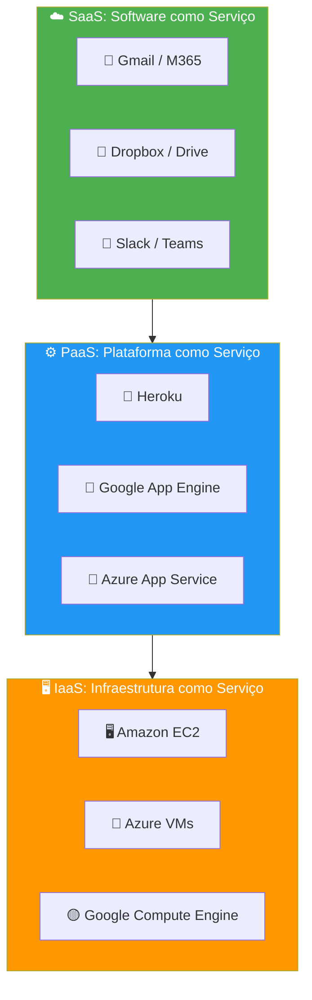
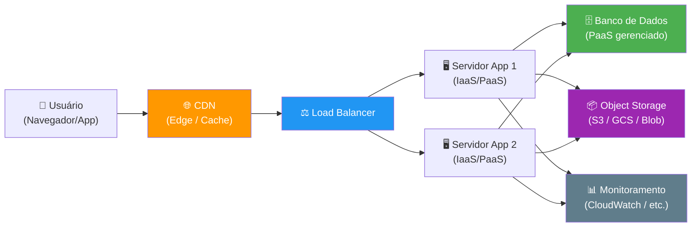
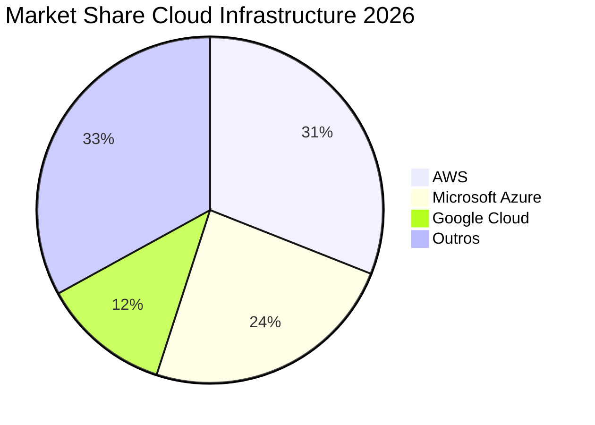
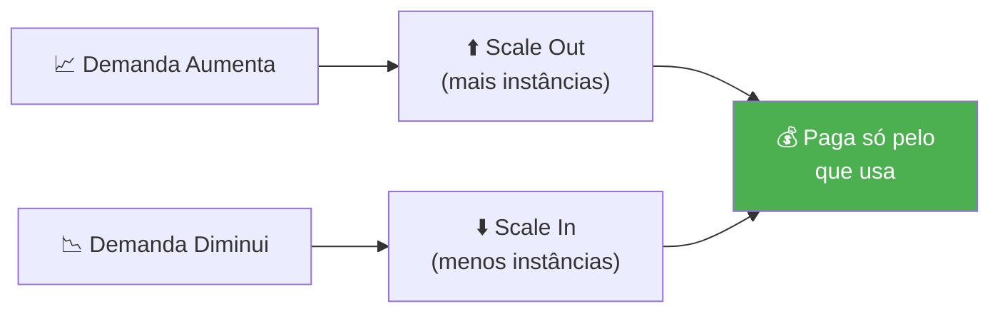

# Computação em Nuvem

> [!quote] A Nova Era da Infraestrutura
> *Computação em nuvem (Cloud computing) é o fornecimento de serviços de computação como software, servidores, banco de dados, redes, tudo na **nuvem**.*

---

## 📖 Visão Geral

> [!info] Recurso Relacionado
> [[Glossário de computação em nuvem]]

![[Recursos/Redes de Computadores/Computação em nuvem/cloud-servicos-conectados.png|Cloud Computing Overview]]

A computação em nuvem transformou a forma como empresas e indivíduos acessam recursos de TI. Em vez de comprar e manter servidores físicos localmente, você aluga capacidade computacional de grandes datacenters distribuídos ao redor do mundo, pagando apenas pelo que usa. Esse modelo eliminou a necessidade de grandes investimentos iniciais em infraestrutura e democratizou o acesso à tecnologia de ponta.

---

## ✨ Principais Benefícios

> [!success] Por que adotar a nuvem?

| Benefício | Descrição |
|-----------|-----------|
| **💰 Custo** | Elimina gastos com hardware, software e datacenters locais |
| **⚡ Velocidade** | Recursos provisionados em minutos, sob demanda |
| **🌍 Escala Global** | Infraestrutura distribuída mundialmente |
| **📈 Produtividade** | Equipes focam em metas de negócio, não em infraestrutura |
| **🚀 Desempenho** | Hardware de última geração e baixa latência |
| **🔄 Confiabilidade** | Backup fácil e recuperação de desastres |
| **🔐 Segurança** | Políticas e controles avançados dos provedores |

> [!tip] Modelo de Custo: CapEx vs OpEx
> Antes da nuvem, empresas usavam **CapEx** (Capital Expenditure): compravam servidores caros e os depreciavam ao longo de anos. Com a nuvem, o modelo é **OpEx** (Operational Expenditure): paga-se mensalmente pelo uso real, como uma conta de luz. Isso libera capital para investimento em produto e inovação.

---

## ☁️ Tipos de Computação em Nuvem

> [!info] Modelos de Implantação

![[Recursos/Redes de Computadores/Computação em nuvem/cloud-infraestrutura-dados.png|Tipos de nuvem]]

### 📊 Comparativo dos Modelos

| Tipo | Proprietário | Acesso | Ideal Para |
|------|-------------|--------|------------|
| **Nuvem Pública** | Provedor terceirizado | Internet | Empresas que buscam escalabilidade |
| **Nuvem Privada** | Própria organização | Rede privada | Empresas com requisitos de segurança |
| **Nuvem Híbrida** | Combinação | Ambos | Flexibilidade e conformidade |
| **Multinuvem** | Múltiplos provedores | Internet | Evitar lock-in e otimizar custos |

---

### ☁️ Nuvem Pública

> [!tip] Características
> - Pertence a provedores terceirizados (Azure, AWS, GCP)
> - Hardware e software gerenciados pelo provedor
> - Acesso via navegador web
> - Pagamento conforme o uso

A nuvem pública é o modelo mais adotado no mundo. Toda a infraestrutura física fica sob responsabilidade do provedor: servidores, refrigeração, energia, segurança física e conectividade. O cliente acessa os recursos pela internet e paga pelo consumo real, sem contratos de longo prazo obrigatórios.

---

### 🏢 Nuvem Privada

> [!tip] Características
> - Recursos exclusivos para uma organização
> - Pode estar no datacenter local ou hospedada
> - Maior controle sobre segurança e conformidade
> - Infraestrutura em rede privada

A nuvem privada oferece o mesmo nível de abstração e automação da nuvem pública, mas com recursos dedicados a uma única organização. É muito usada por bancos, hospitais e órgãos governamentais que precisam manter controle total sobre dados sensíveis e cumprir regulamentações rígidas como a LGPD no Brasil.

---

### 🔀 Nuvem Híbrida

> [!tip] Características
> - Combina nuvens públicas e privadas
> - Dados e aplicativos transitam entre elas
> - Maior flexibilidade de implantação
> - Otimiza infraestrutura existente

Na nuvem híbrida, cargas de trabalho sensíveis ficam na nuvem privada, enquanto cargas de pico ou menos críticas rodam na nuvem pública. Isso permite que a empresa use seu datacenter para o dia a dia e "exploda" para a nuvem pública em momentos de alta demanda, como a Black Friday ou lançamento de um produto.

---

### 🌐 Multinuvem

> [!info] Tendência Atual
> Em 2026, **89% das grandes empresas adotam estratégia multinuvem** (múltiplos provedores simultaneamente), ante 76% em 2024. A principal motivação é evitar dependência de um único fornecedor (vendor lock-in) e escolher o melhor serviço de cada provedor.

---

## 🏗️ Tipos de Serviços de Nuvem

> [!info] A Pilha de Cloud Computing
> Os serviços se complementam, construídos uns sobre os outros.

![[Recursos/Redes de Computadores/Computação em nuvem/piramide-iaas-paas-saas.png|IaaS, PaaS, SaaS]]

O diagrama abaixo mostra a relação entre os modelos de serviço e quem gerencia cada camada:

### 📊 Comparativo de Serviços

| Serviço | O que você gerencia | O que o provedor gerencia | Público-alvo |
|---------|---------------------|---------------------------|--------------|
| **IaaS** | Apps, Dados, Runtime, Middleware, OS | Virtualização, Servidores, Storage, Rede | Sysadmins, DevOps |
| **PaaS** | Apps, Dados | Runtime, Middleware, OS, Infraestrutura | Desenvolvedores |
| **SaaS** | Nada (apenas usa) | Tudo | Usuários finais |
| **Serverless** | Código da função | Tudo, inclusive execução | Devs que querem foco total no código |

---

### 🖥️ IaaS (Infrastructure as a Service)

> [!info] Infraestrutura como Serviço
> Alugue infraestrutura de TI (servidores, VMs, storage, redes) com pagamento conforme o uso.

**Exemplos**: Amazon EC2, Azure VMs, Google Compute Engine

O IaaS é o modelo mais flexível: você tem acesso a uma máquina virtual completa e instala o sistema operacional e os softwares que quiser. É equivalente a ter um servidor físico, mas sem precisar comprá-lo ou mantê-lo. Você controla tudo a partir do sistema operacional, mas a camada física (hardware, rede, energia) é responsabilidade do provedor.

**Quando usar IaaS:**
- Migrar servidores físicos existentes para a nuvem (lift-and-shift)
- Precisa de controle total sobre o sistema operacional
- Cargas de trabalho com requisitos específicos de configuração
- Ambientes de desenvolvimento e testes com configurações variadas

---

### ⚙️ PaaS (Platform as a Service)

> [!info] Plataforma como Serviço
> Ambiente sob demanda para desenvolvimento, teste e deploy de aplicações, sem gerenciar infraestrutura.

**Exemplos**: Heroku, Google App Engine, Azure App Service

O PaaS abstrai a camada de sistema operacional. O desenvolvedor faz o upload do código e a plataforma cuida de instalar dependências, escalar automaticamente, balancear carga e monitorar. É ideal para equipes que querem entregar software rapidamente sem se preocupar com operações de infraestrutura.

**Quando usar PaaS:**
- Startups e equipes pequenas que precisam de velocidade
- Apps web e APIs sem requisitos especiais de infraestrutura
- Pipelines de CI/CD automatizados
- Projetos onde o foco é o produto, não a operação

---

### 🌐 Serverless (Computação sem Servidor)

> [!info] Foco na Aplicação
> Crie funcionalidades sem gerenciar servidores. O provedor cuida de tudo. Pagamento por execução.

**Exemplos**: AWS Lambda, Azure Functions, Google Cloud Functions

No modelo serverless, você escreve funções individuais (pequenos trechos de código) e o provedor as executa apenas quando são chamadas. Você paga somente pelo tempo de execução real, com granularidade de milissegundos. Se ninguém chamar sua função, o custo é zero.

> [!warning] Limitação do Serverless
> Funções serverless têm tempo máximo de execução (geralmente 15 minutos no AWS Lambda). Para processamentos longos, prefira containers ou VMs.

---

### 📱 SaaS (Software as a Service)

> [!info] Software como Serviço
> Aplicativos de software entregues pela Internet sob demanda, geralmente por assinatura.

**Exemplos**: Microsoft 365, Google Workspace, Salesforce, Dropbox

O SaaS é o modelo que você já usa no dia a dia: abrir o Gmail no navegador, editar um documento no Google Docs, acessar o Spotify. Toda a complexidade de servidores, atualizações e backups está escondida. Você simplesmente usa o software.

---

## 🗺️ Arquitetura de uma Aplicação em Nuvem

O diagrama abaixo mostra como os componentes de uma aplicação web típica se organizam na nuvem pública:

---

## 💼 Usos da Computação em Nuvem

> [!success] Aplicações Práticas

| Uso | Descrição | Exemplo Real |
|-----|-----------|--------------|
| **Apps Nativos da Nuvem** | Containers, Kubernetes, microsserviços, DevOps | Netflix, Spotify, Nubank |
| **Desenvolvimento/Teste** | Infraestrutura escalável para criar e testar apps | GitHub Actions, GitLab CI |
| **Backup e Recuperação** | Armazenamento seguro e recuperação de desastres | Veeam Cloud, AWS Backup |
| **Análise de Dados** | Machine Learning e IA para insights | Google BigQuery, AWS SageMaker |
| **Streaming** | Áudio e vídeo em alta definição globalmente | Prime Video, Disney+ |
| **SaaS** | Software sob demanda sempre atualizado | Microsoft 365, Notion |
| **IoT** | Processamento de dados de dispositivos conectados | AWS IoT Core, Azure IoT Hub |
| **IA Generativa** | Modelos de linguagem e geração de conteúdo | OpenAI via Azure, Bedrock |

---

## 🏆 Mercado Global em 2026: Quem Lidera?

> [!tip] Provedores Líderes

Em Q1 de 2026, o mercado global de infraestrutura em nuvem cresceu **35% em relação ao mesmo período de 2025**, movimentando **US\$ 129 bilhões** em um único trimestre. Os "Três Grandes" (AWS, Azure e GCP) concentram mais de 60% desse mercado.

### 📊 Market Share: Big Three (2026)

| Provedor | Market Share (2026) | Receita Anual (FY2025) | Crescimento YoY | Link |
|----------|--------------------|-----------------------|----------------|------|
| **Amazon Web Services (AWS)** | ~31% | ~US\$ 115 bi | ~18% | [aws.amazon.com](https://aws.amazon.com/pt/) |
| **Microsoft Azure** | ~24% | ~US\$ 100 bi | ~25% | [azure.microsoft.com](https://azure.microsoft.com/pt-br/) |
| **Google Cloud (GCP)** | ~12% | ~US\$ 48 bi | ~28% | [cloud.google.com](https://cloud.google.com/) |
| **IBM Cloud** | ~3% | N/D | N/D | [ibm.com/cloud](https://www.ibm.com/br-pt/cloud) |
| **Oracle Cloud** | ~2% | N/D | N/D | [oracle.com/cloud](https://www.oracle.com/br/cloud/) |

> [!info] 📌 Tendência
> Embora a AWS mantenha a liderança, o **Google Cloud** cresce mais rápido (28% YoY) e o **Azure** está fechando a diferença. A disputa é acirrada principalmente no segmento de IA e Machine Learning, onde as três empresas investem bilhões de dólares anualmente.

---

## 🧪 Atividades Práticas

> [!example] 🧪 Atividade 1: Crie sua conta gratuita na nuvem e explore o console
>
> **Objetivo:** Ter acesso real a uma nuvem pública e navegar pela interface de gerenciamento.
>
> **Escolha UMA das opções abaixo (todas gratuitas):**
>
> | Provedor | Oferta Gratuita | Link |
> |----------|----------------|------|
> | **AWS Free Tier** | 750h/mês de EC2 t2.micro por 12 meses | [aws.amazon.com/free](https://aws.amazon.com/free/) |
> | **Google Cloud** | US\$ 300 em créditos por 90 dias + e2-micro sempre gratuito | [cloud.google.com/free](https://cloud.google.com/free) |
> | **Oracle Cloud** | 4 OCPUs + 24 GB RAM ARM (sempre gratuito, sem cartão de crédito) | [oracle.com/cloud/free](https://www.oracle.com/cloud/free/) |
>
> **Passo a passo:**
> 1. Acesse o link do provedor escolhido e crie sua conta (e-mail pessoal).
> 2. Complete a verificação de identidade (cartão de crédito pode ser solicitado como verificação, mas NÃO será cobrado no free tier).
> 3. Acesse o **painel de controle** (console) após o login.
> 4. Navegue pelo menu lateral e identifique ao menos 5 serviços diferentes oferecidos.
> 5. Tire um print do console mostrando a tela inicial com seu nome/e-mail visível.
>
> **Resultado observável:** print do console do provedor escolhido com pelo menos 3 serviços identificados e anotados com suas categorias (IaaS, PaaS ou SaaS).

---

> [!example] 🧪 Atividade 2: Estime o custo de um servidor real na calculadora AWS
>
> **Objetivo:** Compreender o modelo de precificação por consumo (pay-as-you-go) e comparar com o custo de hardware físico.
>
> **Ferramenta:** [calculator.aws](https://calculator.aws/pricing/2/home)
>
> **Passo a passo:**
> 1. Acesse [calculator.aws](https://calculator.aws/pricing/2/home).
> 2. Clique em **"Create estimate"**.
> 3. Adicione o serviço **Amazon EC2**.
> 4. Configure: região **South America (São Paulo)**, instância **t3.medium** (2 vCPU, 4 GB RAM), sistema operacional **Linux**, uso **100% do mês** (720 horas).
> 5. Adicione também **20 GB de armazenamento SSD (EBS gp3)**.
> 6. Anote o custo mensal estimado em dólares e converta para reais (use a cotação do dia).
> 7. Pesquise quanto custaria comprar um servidor físico com configuração equivalente (ex.: Dell PowerEdge T140) e calcule em quantos meses o servidor físico amortizaria seu custo.
>
> **Resultado observável:** tabela comparando custo mensal do servidor em nuvem (USD e BRL) com o custo de aquisição do servidor físico equivalente, com conclusão sobre quando cada opção é mais vantajosa.

---

> [!example] 🧪 Atividade 3: Classifique os serviços que você usa no dia a dia
>
> **Objetivo:** Reconhecer que você já usa computação em nuvem no cotidiano e saber classificar os serviços pelo modelo correto.
>
> **Passo a passo:**
> 1. Liste pelo menos **8 serviços digitais** que você usa regularmente (apps, plataformas, ferramentas, jogos online, streaming, etc.).
> 2. Para cada serviço, pesquise se ele usa infraestrutura da AWS, Azure ou GCP (dica: busque "qual nuvem usa [nome do serviço]" no Google).
> 3. Classifique cada serviço na tabela abaixo como **IaaS**, **PaaS** ou **SaaS** do ponto de vista do usuário final.
>
> **Modelo de tabela para preencher:**
>
> | Serviço | Provedor de Nuvem | Classificação | Justificativa |
> |---------|------------------|---------------|---------------|
> | Exemplo: Netflix | AWS | SaaS | Usuário só assiste, não gerencia nada |
> | Exemplo: GitHub | Azure | PaaS | Desenvolvedor faz deploy de código |
> | ... | ... | ... | ... |
>
> **Resultado observável:** tabela completa com 8 serviços classificados corretamente e justificativa de uma linha para cada classificação.

---

## 🔐 Segurança e Responsabilidade Compartilhada

> [!warning] Modelo de Responsabilidade Compartilhada
> Um equívoco comum é achar que contratar um serviço em nuvem significa terceirizar toda a responsabilidade pela segurança. Na prática, existe um **modelo de responsabilidade compartilhada**: o provedor cuida da segurança **DA** nuvem (hardware, rede física, datacenters) e o cliente cuida da segurança **NA** nuvem (configurações, dados, acessos, aplicações).

| Responsabilidade | IaaS | PaaS | SaaS |
|-----------------|------|------|------|
| Segurança física do datacenter | Provedor | Provedor | Provedor |
| Virtualização e hipervisor | Provedor | Provedor | Provedor |
| Sistema operacional | **Cliente** | Provedor | Provedor |
| Middleware e runtime | **Cliente** | **Cliente** (parcial) | Provedor |
| Dados e aplicações | **Cliente** | **Cliente** | **Cliente** |
| Controle de acesso (IAM) | **Cliente** | **Cliente** | **Cliente** |

> [!danger] Erros de Segurança Comuns na Nuvem
> - Deixar buckets de armazenamento (S3, GCS, Blob) públicos sem querer
> - Usar credenciais padrão ou fracas
> - Não habilitar autenticação multifator (MFA) na conta raiz
> - Não monitorar logs de acesso (CloudTrail, Cloud Logging)
> - Esquecer recursos provisionados acumulando custo e risco

---

## 💡 Conceitos Complementares

### Elasticidade vs Escalabilidade

> [!info] Diferença Importante
> **Escalabilidade** é a capacidade de crescer conforme a demanda aumenta. **Elasticidade** vai além: é a capacidade de crescer E diminuir automaticamente conforme a demanda varia. A nuvem oferece elasticidade real, ou seja, você paga mais no pico e menos na calmaria.

### Regiões e Zonas de Disponibilidade

| Conceito | Definição | Exemplo AWS |
|----------|-----------|-------------|
| **Região** | Localização geográfica com datacenters | sa-east-1 (São Paulo) |
| **Zona de Disponibilidade (AZ)** | Datacenter isolado dentro de uma região | sa-east-1a, sa-east-1b, sa-east-1c |
| **Edge Location** | Ponto de presença para CDN e cache | Fortaleza, Rio de Janeiro, Porto Alegre |

> [!tip] Por que importa para o Brasil?
> A AWS tem região em São Paulo (sa-east-1) desde 2011. A Azure tem datacenters no Brasil desde 2014 (Brazil South, em Campinas). O Google Cloud tem a região southamerica-east1 também em São Paulo. Isso significa que dados de empresas brasileiras podem ficar no Brasil, o que é crucial para conformidade com a **LGPD**.

---

## 📚 Referências

> [!info] Fonte
> [O que é Computação em Nuvem? (Microsoft Azure)](https://azure.microsoft.com/pt-br/overview/what-is-cloud-computing/)

🔗 [Dicionário de termos de cloud computing](https://azure.microsoft.com/pt-br/overview/cloud-computing-dictionary/)

---

> [!note] 📚 Fontes (2026)
> Dados de mercado verificados em junho de 2026:
> - [AWS vs Azure vs Google Cloud 2026 (Tech Insider)](https://tech-insider.org/aws-vs-azure-vs-google-cloud-2026/)
> - [Cloud Market Share 2026: Revenue & Full Stats (Businesstats)](https://businesstats.com/big-three-hold-dominant-lead-in-accelerating-cloud-market/)
> - [Cloud Computing Market Share 2026 (Programming Helper Tech)](https://www.programming-helper.com/tech/cloud-computing-market-share-2026-aws-azure-google-cloud-analysis/)
> - [Cloud Market Share Trends 2026 (emma Blog)](https://www.emma.ms/blog/cloud-market-share-trends)
> - [Statista: Worldwide Market Share of Cloud Infrastructure](https://www.statista.com/chart/18819/worldwide-market-share-of-leading-cloud-infrastructure-service-providers/)
> - [Oracle Cloud Free Tier](https://www.oracle.com/cloud/free/)
> - [Google Cloud Free Tier](https://cloud.google.com/free)
> - [AWS Free Tier](https://aws.amazon.com/free/)
> - [AWS Pricing Calculator](https://calculator.aws/pricing/2/home)
