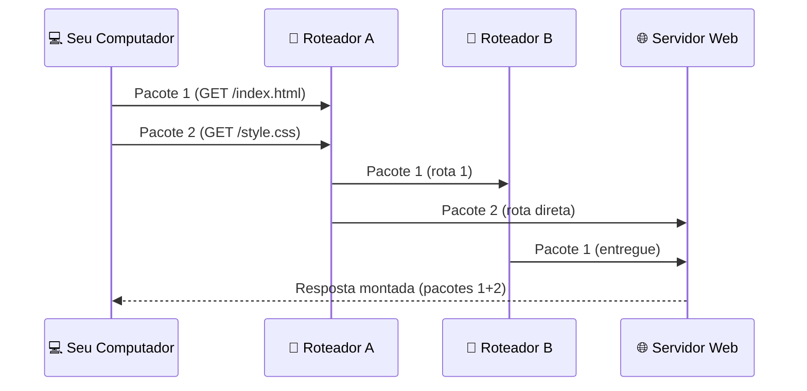
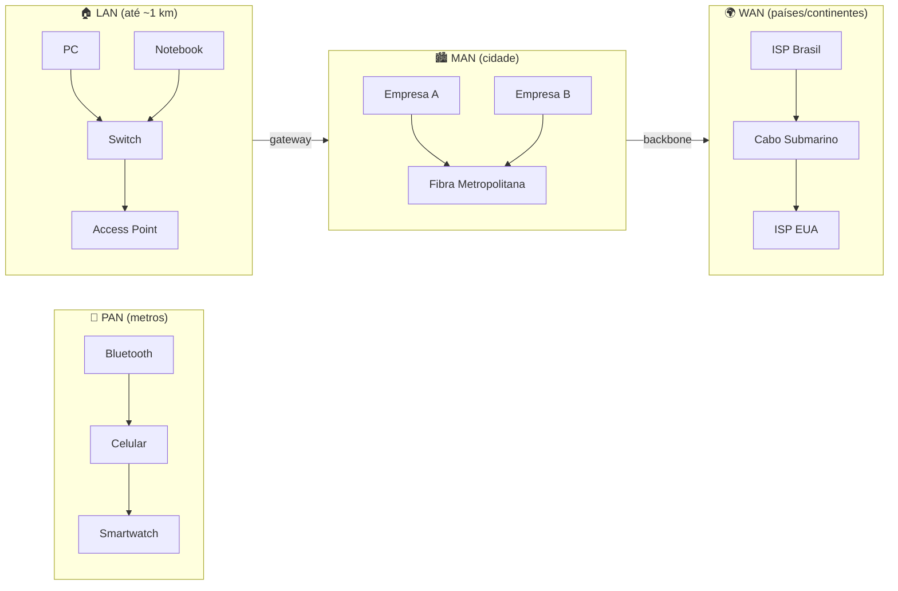
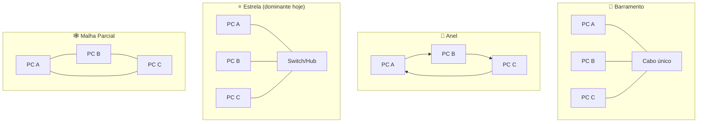
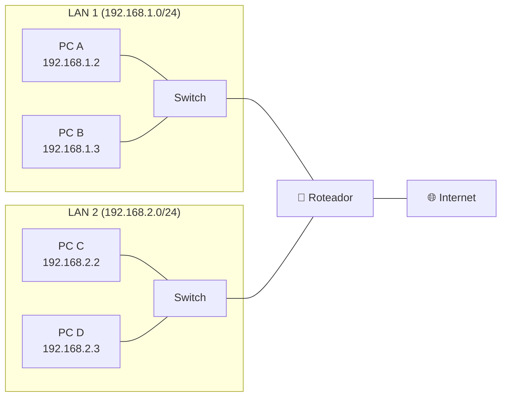
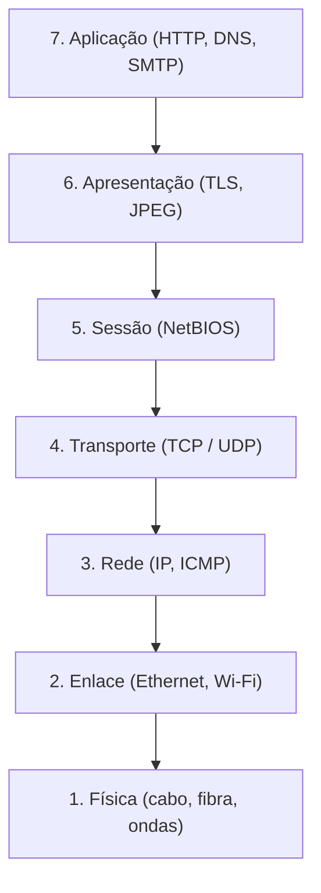

# Conceitos Básicos de Redes

> [!quote] O Início de Tudo
> *Entender os conceitos fundamentais de redes é o primeiro passo para dominar a comunicação digital.*

---

## 🎬 Vídeos Introdutórios

> [!tip] Comece por Aqui
> Assista estes vídeos para uma introdução visual aos conceitos de redes.

| Vídeo | Descrição |
|-------|-----------|
| [A História da Internet](https://www.youtube.com/watch?v=pKxWPo73pX0) | História da Tecnologia |
| [Da web "cringe" à web 3.0](https://www.youtube.com/watch?v=_nxiWws7CpA) | Nerdologia Tech |
| [Internet em Tudo](https://www.youtube.com/watch?v=iI4ZPZjPM5c) | Nerdologia |

---

## 📖 Conceituação

> [!info] O que são Redes de Computadores?
> Sistemas de **dispositivos interligados** que compartilham recursos e informações.

### Principais Usos

- Compartilhamento de dados e arquivos
- Comunicação (email, chat, videoconferência)
- Colaboração em tempo real
- Serviços da Internet
- Acesso a recursos compartilhados (impressoras, storage)

### Componentes Principais

| Componente | Descrição |
|------------|-----------|
| **Nós** | Computadores e dispositivos conectados |
| **Conexões** | Cabos, Wi-Fi, fibra óptica |
| **Dispositivos de rede** | Switches, roteadores, access points |

> [!tip] Exemplo Prático
> Use o **Wireshark** para análise básica de pacotes na rede local.

![[Recursos/Redes de Computadores/Conceitos básicos/diagrama-estrutura-rede.png|Estrutura de rede]]

### 📦 Como os Dados Trafegam: Comutação de Pacotes

Quando você acessa um site, a mensagem não viaja inteira de uma vez. Ela é dividida em pequenas partes chamadas **pacotes**. Cada pacote carrega:

- Um pedaço dos dados originais
- O endereço de destino (IP de quem vai receber)
- O endereço de origem (IP de quem enviou)
- Um número de sequência (para remontar na ordem certa)

Cada pacote pode percorrer um caminho diferente pela rede e os fragmentos são remontados no destino. Essa abordagem se chama **comutação de pacotes** (packet switching) e é a base de toda a internet moderna.

> [!info] Comutação de Pacotes vs. Comutação de Circuitos
>
> | Característica | Comutação de Pacotes | Comutação de Circuitos |
> |----------------|----------------------|-----------------------|
> | Canal dedicado? | Não | Sim (reserva rota exclusiva) |
> | Exemplo | Internet | Telefonia analógica antiga |
> | Aproveitamento da banda | Alto (compartilhado) | Baixo (canal ocioso desperdiça) |
> | Latência variável? | Sim | Não |
> | Tolerante a falhas? | Sim (re-roteamento) | Não |



### 📏 Métricas Fundamentais de Rede

Para avaliar a qualidade de uma rede, usamos três métricas principais:

| Métrica | Definição | Unidade | Exemplo típico |
|---------|-----------|---------|----------------|
| **Largura de banda** (bandwidth) | Quantidade máxima de dados por segundo | Mbps, Gbps | Fibra óptica: 1 Gbps |
| **Latência** | Tempo para um pacote ir da origem ao destino | ms (milissegundos) | Ping local: 1ms; intercontinental: 150ms |
| **Jitter** | Variação da latência entre pacotes consecutivos | ms | Aceitável para VoIP: abaixo de 30ms |
| **Taxa de perda de pacotes** | Percentual de pacotes que não chegam ao destino | % | Boa rede: abaixo de 0,1% |

> [!warning] ⚠️ Atenção
> Velocidade alta de download não garante boa experiência em videochamadas. O que importa mais nesse caso é a **latência baixa** e o **jitter estável**.

---

## 🌐 Tipos de Redes

> [!info] Classificação por Abrangência

| Tipo | Nome | Descrição | Exemplo |
|------|------|-----------|---------|
| **PAN** | Personal Area Network | Pequena escala, único usuário | Bluetooth, USB |
| **LAN** | Local Area Network | Escritórios, residências | Rede doméstica |
| **MAN** | Metropolitan Area Network | Área metropolitana | Provedor de internet |
| **WAN** | Wide Area Network | Cidades, países, mundo | Internet |
| **VPN** | Virtual Private Network | Rede privada sobre rede pública | Túnel corporativo |

> [!tip] Exemplo Prático
> Uso da VPN Kaspersky e redes Tor com Kali Linux.

![[Recursos/Redes de Computadores/Conceitos básicos/tipos-redes-wireless-ieee.png|Tipos de redes]]

### 🗺️ Abrangência Visual: PAN, LAN, MAN e WAN



### Características Técnicas por Tipo

| Tipo | Velocidade típica | Quem opera | Tecnologia comum |
|------|------------------|-----------|-----------------|
| PAN | até 3 Mbps (BT Classic) / até 2 Gbps (BT 5.x) | Usuário | Bluetooth, Zigbee, NFC |
| LAN | 100 Mbps a 10 Gbps | Empresa/residência | Ethernet (Cat6), Wi-Fi 6/7 |
| MAN | 1 Gbps a 100 Gbps | Operadoras | Fibra óptica, Metro Ethernet |
| WAN | variável (depende do link) | Operadoras, ISPs | MPLS, DWDM, cabos submarinos |

---

## 🔗 Topologias de Rede

> [!info] Como os Dispositivos se Conectam

| Topologia | Descrição | Vantagens | Desvantagens |
|-----------|-----------|-----------|--------------|
| **Barramento** | Todos conectados a um único cabo | Simples, barato | Falha única afeta toda rede |
| **Anel** | Dispositivos em círculo | Fácil detecção de falhas | Difícil adicionar nós |
| **Estrela** | Todos conectados a um hub central | Fácil manutenção | Hub é ponto único de falha |
| **Malha** | Cada dispositivo conectado a todos | Alta redundância | Alto custo |
| **Árvore** | Combinação de estrela e barramento | Escalável | Complexa |

> [!tip] Exemplo Prático
> Criar topologias usando o **Packet Tracer**.

![[Recursos/Redes de Computadores/Conceitos básicos/topologias-de-rede.png|Topologias de rede]]

### Diagrama Comparativo de Topologias



> [!info] 💡 Qual topologia é usada hoje?
> A topologia **estrela** domina as redes locais (LANs) modernas, pois facilita a adição de novos dispositivos e o isolamento de falhas. A topologia **malha parcial** é comum em backbones de internet e data centers, onde a redundância é crítica.

### Onde Cada Topologia Aparece na Prática

| Topologia | Onde ainda é usada |
|-----------|-------------------|
| Barramento | Redes CAN (veículos), sistemas industriais legados |
| Anel | Redes de fibra óptica (SONET/SDH, FDDI, Token Ring legado) |
| Estrela | LANs domésticas, corporativas e escolares |
| Malha | Backbone da internet, redes militares, data centers |
| Árvore | Campus universitário, prédios corporativos (hierárquica) |

---

## 📜 Evolução e História das Redes

> [!info] Timeline da Internet

### 1960s: Os Primórdios
- **1962**: J.C.R. Licklider propõe uma "Rede Galáctica" global
- **1965**: Primeira conexão remota via linha telefônica (TX-2 e Q-32)

### 1970s: Nasce a ARPANET
- **1970**: ARPANET conecta 4 universidades nos EUA
- **1973**: Primeira conexão internacional (EUA e Londres)
- **1974**: Termo "Internet" usado pela primeira vez
- **1979**: Usenet é criada

### 1980s: TCP/IP e WWW
- **1982**: TCP/IP torna-se o protocolo padrão
- **1983**: ARPANET divide-se em ARPANET e MILNET
- **1985**: NSFNET forma a espinha dorsal dos EUA
- **1989**: Tim Berners-Lee propõe a World Wide Web

### 1990s: Explosão da Internet
- **1990**: ARPANET desativada
- **1991**: WWW lançada ao público
- **1994**: Netscape Navigator
- **1998**: Google fundado

### 2000s: Web 2.0
- **2001**: Wikipedia
- **2004**: Facebook
- **2005**: YouTube
- **2007**: iPhone acelera a Internet móvel

### 2010s-2020s: Era Moderna
- **2010**: Instagram
- **2015**: Maioria do tráfego criptografado
- **2019**: Internet atinge 56% de penetração global
- **2020s**: IoT, 5G e IA impulsionam a evolução

> [!tip] Exemplo Prático
> Explore o [Internet Archive](https://archive.org/) para ver como sites evoluíram.

---

## 🖥️ Equipamentos de Rede

> [!info] Hardware Essencial

| Equipamento | Camada OSI | Função |
|-------------|------------|--------|
| **Switch** | Camada 2 | Conecta dispositivos na LAN usando MAC |
| **Roteador** | Camada 3 | Conecta redes usando IP |
| **Access Point** | Camada 1-2 | Permite conexão Wi-Fi |
| **Modem** | Camada 1 | Modula/demodula sinais |
| **Firewall** | Camada 3-7 | Filtra tráfego de rede |
| **Servidor** | Todas | Fornece serviços e recursos |

![[Recursos/Redes de Computadores/Conceitos básicos/equipamentos-de-rede.png|Equipamentos de rede]]

> [!tip] Exemplo Prático
> Descoberta de roteadores e clientes com **aircrack-ng** no Kali Linux.

### Como o Switch Difere do Roteador



> **Switch:** decide para qual porta enviar o dado com base no **endereço MAC** (físico).
> **Roteador:** decide para qual rede encaminhar o pacote com base no **endereço IP** (lógico).

---

## 📡 Meios de Comunicação

> [!info] Como os Dados Viajam

### 1. Cabo de Par Trançado

| Característica | Descrição |
|----------------|-----------|
| **Estrutura** | Pares de fios de cobre trançados |
| **Uso** | LANs e telefonia |
| **Categorias** | Cat5e, Cat6, Cat6a, Cat7 |

![[Recursos/Redes de Computadores/Conceitos básicos/cabo-par-trancado.png|Cabo par trançado]]

#### Tabela de Categorias de Cabos

| Categoria | Velocidade máxima | Distância máxima | Uso típico |
|-----------|------------------|-----------------|-----------|
| Cat5e | 1 Gbps | 100 m | Redes domésticas antigas |
| Cat6 | 10 Gbps | 55 m (10G) / 100 m (1G) | Redes corporativas |
| Cat6a | 10 Gbps | 100 m | Data centers, hospitais |
| Cat7 | 10 Gbps | 100 m | Instalações profissionais |
| Cat8 | 40 Gbps | 30 m | Data centers modernos |

### 2. Cabo Coaxial

| Característica | Descrição |
|----------------|-----------|
| **Estrutura** | Núcleo de cobre + isolante + blindagem |
| **Uso** | TV a cabo, redes antigas |

![[Recursos/Redes de Computadores/Conceitos básicos/cabo-coaxial-conectores.png|Cabo coaxial]]

![[Recursos/Redes de Computadores/Conceitos básicos/cabo-coaxial-estrutura.png|Estrutura do coaxial]]

### 3. Fibra Óptica

| Característica | Descrição |
|----------------|-----------|
| **Estrutura** | Filamentos de vidro/plástico |
| **Uso** | Backbones, alta velocidade |
| **Vantagem** | Imune a interferência eletromagnética |

![[Recursos/Redes de Computadores/Conceitos básicos/fibra-optica.png|Fibra óptica]]

#### Monomodo vs. Multimodo

| Tipo | Núcleo | Distância | Custo | Uso |
|------|--------|-----------|-------|-----|
| **Multimodo (MMF)** | 50 ou 62,5 µm | até 2 km | Menor | Redes locais de campus |
| **Monomodo (SMF)** | 8 a 10 µm | centenas de km | Maior | Backbones e cabos submarinos |

### 4. Comunicação Sem Fio

| Característica | Descrição |
|----------------|-----------|
| **Tecnologias** | Wi-Fi, Bluetooth, infravermelho |
| **Uso** | Redes domésticas, dispositivos móveis |

![[Recursos/Redes de Computadores/Conceitos básicos/roteador-wireless.png|Comunicação sem fio]]

#### Evolução do Wi-Fi

| Padrão | Geração | Frequência | Velocidade teórica | Lançamento |
|--------|---------|------------|-------------------|-----------|
| 802.11n | Wi-Fi 4 | 2,4 / 5 GHz | até 600 Mbps | 2009 |
| 802.11ac | Wi-Fi 5 | 5 GHz | até 3,5 Gbps | 2014 |
| 802.11ax | Wi-Fi 6/6E | 2,4 / 5 / 6 GHz | até 9,6 Gbps | 2019 |
| 802.11be | Wi-Fi 7 | 2,4 / 5 / 6 GHz | até 46 Gbps | 2024 |

---

## 🧱 O Modelo OSI e o TCP/IP: Camadas de uma Rede

Uma das formas mais importantes de entender como as redes funcionam é pelo conceito de **camadas**. Cada camada tem uma responsabilidade específica e se comunica com as camadas vizinhas.

> [!info] Por que camadas?
> Dividir a comunicação em camadas permite que cada parte do sistema seja desenvolvida, testada e substituída de forma independente. É como montar um sanduíche: cada ingrediente tem seu papel sem precisar saber como o outro é produzido.

### Comparação: Modelo OSI vs. TCP/IP

| # | Camada OSI | Camada TCP/IP | Protocolo exemplo | Função resumida |
|---|-----------|--------------|------------------|----------------|
| 7 | Aplicação | Aplicação | HTTP, FTP, DNS, SMTP | Interface com o usuário |
| 6 | Apresentação | Aplicação | TLS/SSL, JPEG | Formatação e criptografia |
| 5 | Sessão | Aplicação | NetBIOS, RPC | Controle de sessões |
| 4 | Transporte | Transporte | TCP, UDP | Entrega confiável (ou rápida) |
| 3 | Rede | Internet | IP, ICMP, ARP | Endereçamento e roteamento |
| 2 | Enlace | Acesso à rede | Ethernet, Wi-Fi (802.11) | Quadros e endereços MAC |
| 1 | Física | Acesso à rede | Cabo, fibra, rádio | Bits no meio físico |



> [!tip] 💡 Mnemônico para lembrar as camadas OSI (de cima para baixo)
> **A**ll **P**eople **S**eem **T**o **N**eed **D**ata **P**rocessing
> (Application, Presentation, Session, Transport, Network, Data Link, Physical)

---

## 🛠️ Aulas Práticas

> [!success] Atividades Hands-on

| Prática | Descrição |
|---------|-----------|
| **Aula 1** | Crimpagem de cabo de rede (par trançado) |
| **Aula 2** | Configuração de roteador sem fio simples |

---

## 🧪 Atividades Mão na Massa

> [!example] 🧪 Atividade 1: Descubra sua rede e desenhe a topologia
>
> **Objetivo:** identificar o tipo de rede em que você está (LAN, WAN) e mapear os dispositivos conectados.
>
> **Passo a passo:**
> 1. Acesse o painel do seu roteador doméstico. O endereço costuma ser `192.168.0.1` ou `192.168.1.1`. Digite no navegador e faça login (a senha padrão está geralmente na etiqueta do roteador).
> 2. Navegue até a seção de dispositivos conectados (nomes como "Clientes DHCP", "Dispositivos na rede" ou "Connected devices").
> 3. Anote quantos e quais dispositivos estão conectados (computadores, celulares, TVs, câmeras, etc.).
> 4. Abra o [draw.io](https://app.diagrams.net/) no navegador, escolha ícones de rede e desenhe a topologia da sua rede doméstica.
>
> **Resultado observável:** um diagrama com o roteador no centro (topologia estrela), cada dispositivo conectado a ele, e a etiqueta com o IP de cada um. Você consegue identificar qual é o gateway da rede? Quantos IPs estão em uso?
>
> **Pergunta para reflexão:** sua rede doméstica é uma LAN. Qual parte da conexão representa a WAN?

---

> [!example] 🧪 Atividade 2: Rastreie o caminho de um pacote com ping e traceroute
>
> **Objetivo:** observar latência, perda de pacotes e o caminho que seus dados percorrem até um servidor na internet.
>
> **Comandos (escolha seu sistema operacional):**
>
> **Windows (cmd ou PowerShell):**
> ```
> ping google.com
> tracert google.com
> ```
>
> **Linux / macOS (terminal):**
> ```
> ping -c 10 google.com
> traceroute google.com
> ```
>
> **O que observar no `ping`:**
> - `tempo=Xms` é a latência de ida e volta (RTT). Abaixo de 20ms em redes locais é ótimo. Acima de 100ms em servidores nacionais indica problema.
> - `Perdidos = X%` indica perda de pacotes. Qualquer valor acima de 0% merece investigação.
>
> **O que observar no `tracert`/`traceroute`:**
> - Cada linha é um **salto** (hop), ou seja, um roteador pelo qual o pacote passou.
> - Os três tempos em cada linha (ex: `12ms 11ms 13ms`) são três medições de ida e volta naquele salto.
> - Saltos com `* * *` indicam roteadores que bloqueiam respostas ICMP (comum em provedores).
> - Os primeiros saltos costumam ser sua rede local e o roteador do provedor. Os últimos chegam ao destino final.
>
> **Resultado observável:** você verá quantos roteadores seu pacote atravessa para chegar ao Google, em quais países eles estão (use [ipinfo.io](https://ipinfo.io) para consultar IPs do traceroute) e qual o tempo médio de cada salto.

---

> [!example] 🧪 Atividade 3: Simule uma rede no Packet Tracer
>
> **Objetivo:** montar uma rede simples com switch, roteador e PCs, e verificar conectividade com `ping` dentro do simulador.
>
> **Passo a passo:**
> 1. Abra o **Cisco Packet Tracer** (download gratuito em [netacad.com](https://www.netacad.com/)).
> 2. Arraste dois PCs e um Switch para a área de trabalho.
> 3. Use o cabo "Copper Straight-Through" para conectar cada PC ao switch (porta FastEthernet).
> 4. Clique no PC 0, vá em "Desktop" e depois "IP Configuration". Defina o IP `192.168.1.1` e máscara `255.255.255.0`.
> 5. No PC 1, defina `192.168.1.2` com a mesma máscara.
> 6. No PC 0, acesse "Desktop" > "Command Prompt" e execute: `ping 192.168.1.2`
>
> **Resultado observável:** quatro respostas com tempo próximo a 0ms confirmam que a rede local está funcionando. Tente depois desconectar o cabo de um PC e repetir o ping. O que acontece?

---

## 📚 Leituras e Recursos Complementares

> [!info] Para se Aprofundar

| Recurso | Tipo | Link |
|---------|------|------|
| Kurose & Ross, "Computer Networking: A Top-Down Approach" | Livro referência mundial | ISBN: 978-0135928608 |
| Tanenbaum, "Redes de Computadores" | Livro clássico completo | ISBN: 978-8576052005 |
| GeeksforGeeks: Packet Switching | Artigo técnico | [Ver artigo](https://www.geeksforgeeks.org/computer-networks/packet-switching-and-delays-in-computer-network/) |
| GeeksforGeeks: Switching | Artigo técnico | [Ver artigo](https://www.geeksforgeeks.org/computer-networks/what-is-switching/) |
| Wikipedia: Packet Switching | Referência geral | [Ver artigo](https://en.wikipedia.org/wiki/Packet_switching) |
| Baeldung CS: Latência e Banda | Cálculo de tempo de pacote | [Ver artigo](https://www.baeldung.com/cs/packet-time-latency-bandwidth) |
| Livro Redes (eduCAPES, CAPES) | Material gratuito em PT-BR | [Baixar PDF](https://educapes.capes.gov.br/bitstream/capes/432642/2/Livro%20%20Redes%20de%20Computadores.pdf) |
| Introdução a Redes (UNESP/IBILCE) | Slides acadêmicos PT-BR | [Ver PDF](https://www.dcce.ibilce.unesp.br/~aleardo/cursos/fsc/1-introducao_redes-topologias.pdf) |
| NPTEL: Computer Networks and Internet Protocol (2026) | Curso internacional gratuito | [Ver curso](https://onlinecourses.nptel.ac.in/noc26_cs35/preview) |

> [!note] 📚 Fontes (2026)
> - [GeeksforGeeks: Packet Switching and Delays](https://www.geeksforgeeks.org/computer-networks/packet-switching-and-delays-in-computer-network/)
> - [GeeksforGeeks: What is Switching?](https://www.geeksforgeeks.org/computer-networks/what-is-switching/)
> - [GeeksforGeeks: Circuit vs Packet Switching](https://www.geeksforgeeks.org/computer-networks/difference-between-circuit-switching-and-packet-switching/)
> - [Wikipedia: Packet Switching](https://en.wikipedia.org/wiki/Packet_switching)
> - [Baeldung CS: Packet Time from Latency and Bandwidth](https://www.baeldung.com/cs/packet-time-latency-bandwidth)
> - [Fiveable: Packet Switching Principles](https://fiveable.me/computer-networks-a-systems-approach/unit-3/packet-switching-principles/study-guide/yELDUF8CKv4MmfwO)
> - [eduCAPES/CAPES: Livro Redes de Computadores (PT-BR)](https://educapes.capes.gov.br/bitstream/capes/432642/2/Livro%20%20Redes%20de%20Computadores.pdf)
> - [UNESP IBILCE: Introdução a Redes (slides)](https://www.dcce.ibilce.unesp.br/~aleardo/cursos/fsc/1-introducao_redes-topologias.pdf)
> - [NPTEL: Computer Networks and Internet Protocol (2026)](https://onlinecourses.nptel.ac.in/noc26_cs35/preview)
> - [Estratégia Concursos: Tipos de Redes LAN/MAN/WAN](https://www.estrategiaconcursos.com.br/blog/tipos-redes-concurso-pf/)
