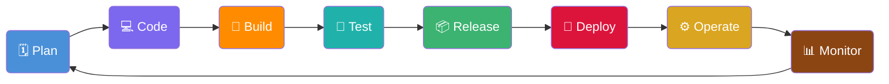
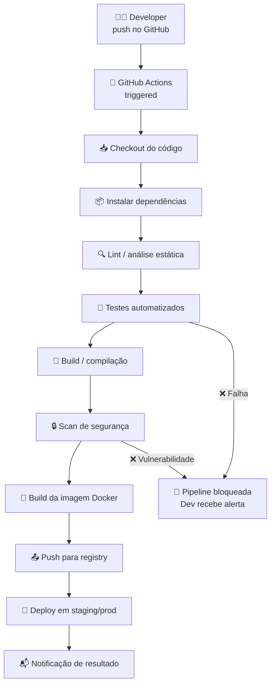
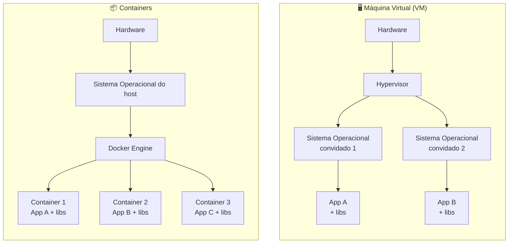
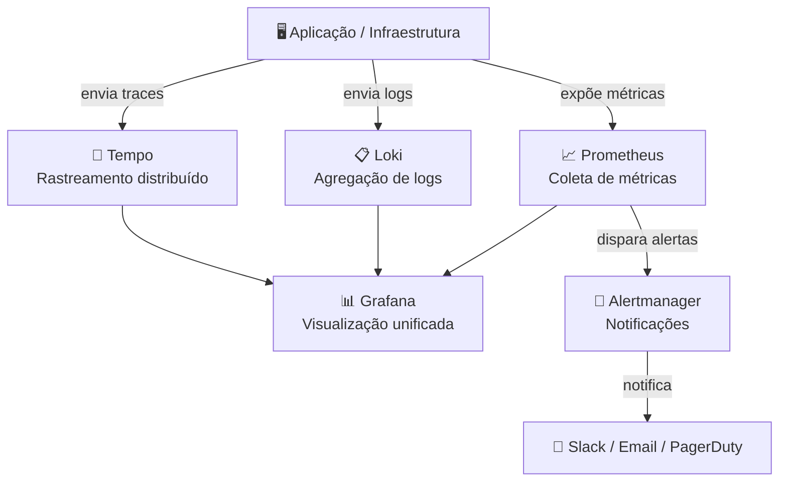

# DevOps

> [!quote] Unindo Desenvolvimento e Operações
> *DevOps é uma cultura e conjunto de práticas que une desenvolvimento (Dev) e operações (Ops) para entregar software de forma mais rápida, confiável e frequente.*

---

## 🎯 O que é DevOps?

> [!info] Definição
> DevOps não é apenas uma ferramenta ou tecnologia, mas uma **cultura** que promove colaboração, automação e integração contínua entre equipes de desenvolvimento e infraestrutura.

O termo surgiu da junção das palavras *Development* (Desenvolvimento) e *Operations* (Operações). Antes do DevOps, essas duas equipes trabalhavam de forma isolada: os desenvolvedores escreviam o código e "jogavam por cima do muro" para a equipe de operações implantar. Esse modelo causava lentidão, conflitos e falhas frequentes em produção.

Com o DevOps, as equipes compartilham responsabilidades, usam automação para reduzir erros manuais e entregam valor ao cliente com muito mais frequência. Em 2026, organizações maduras em DevOps chegam a fazer dezenas de deploys por dia com alta confiabilidade.

> [!tip] Por que DevOps importa para Redes?
> Profissionais de redes e infraestrutura são cada vez mais impactados pelo DevOps: roteadores, firewalls e switches passam a ser configurados via código (NetOps/NetDevOps), monitoramento é automatizado e a entrega de serviços de rede segue pipelines CI/CD.

---

## 🔄 Ciclo DevOps

O ciclo DevOps é representado como um loop infinito (símbolo do infinito), simbolizando que o processo nunca para: sempre há feedback, melhoria e nova entrega.



| Fase | Atividades | Exemplo de ferramenta |
|------|------------|-----------------------|
| **Plan** | Planejamento e definição de requisitos | Jira, GitHub Issues, Notion |
| **Code** | Desenvolvimento do código | VS Code, Git, GitHub |
| **Build** | Compilação e empacotamento | Maven, npm, Docker build |
| **Test** | Testes automatizados | Jest, Pytest, JUnit |
| **Release** | Preparação para deploy | GitHub Releases, Semantic Release |
| **Deploy** | Implantação em produção | GitHub Actions, ArgoCD, Flux |
| **Operate** | Operação e manutenção | Kubernetes, Docker Compose |
| **Monitor** | Monitoramento e feedback | Prometheus, Grafana, Datadog |

---

## ⚙️ CI/CD: Integração e Entrega Contínua

**CI (Continuous Integration)** é a prática de integrar código ao repositório principal com frequência, geralmente várias vezes ao dia. A cada integração, uma série de testes e verificações é executada automaticamente.

**CD (Continuous Delivery / Continuous Deployment)** estende a CI: após os testes passarem, o código é automaticamente preparado para entrega (Delivery) ou até implantado em produção sem intervenção humana (Deployment).

> [!info] CI vs CD
> - **CI** cuida de: build automatizado, testes unitários, análise de código.
> - **CD (Delivery)** adiciona: empacotamento, testes de integração, preparação do release.
> - **CD (Deployment)** vai além: deploy automático em produção após todos os gates passarem.

### Pipeline CI/CD: fluxo visual



Em 2026, o GitHub Actions executa mais de **6 milhões de workflows por dia**, com crescimento de 40 a 55% ao ano. Isso demonstra a consolidação do CI/CD como prática padrão na indústria.

### Anatomia de um workflow GitHub Actions

Um arquivo `.yml` dentro de `.github/workflows/` define o pipeline. Veja a estrutura básica:

```yaml
name: CI Pipeline

on:
  push:
    branches: [main]
  pull_request:
    branches: [main]

jobs:
  build-and-test:
    runs-on: ubuntu-latest

    steps:
      - name: Checkout do código
        uses: actions/checkout@v4

      - name: Configurar Python
        uses: actions/setup-python@v5
        with:
          python-version: '3.12'

      - name: Instalar dependências
        run: pip install -r requirements.txt

      - name: Rodar testes
        run: pytest tests/

      - name: Build da imagem Docker
        run: docker build -t minha-app:latest .
```

> [!warning] Conceitos-chave do GitHub Actions
> - **workflow**: o arquivo `.yml` inteiro, define o processo.
> - **trigger (on)**: evento que dispara o workflow (push, pull_request, schedule).
> - **job**: unidade de trabalho; pode haver vários em paralelo.
> - **step**: cada passo dentro de um job.
> - **runner**: máquina que executa o job (`ubuntu-latest`, `windows-latest`, `macos-latest`).
> - **action**: bloco reutilizável (ex.: `actions/checkout@v4`).

---

> [!example] 🧪 Atividade 1: Seu primeiro workflow no GitHub Actions
>
> **Objetivo:** criar um pipeline CI real que roda automaticamente a cada push e ver o resultado na aba Actions do GitHub.
>
> **Pré-requisitos:** conta no GitHub (gratuita), Git instalado.
>
> **Passo a passo:**
>
> 1. Crie um repositório público no GitHub chamado `devops-lab`.
> 2. Clone localmente: `git clone https://github.com/SEU_USER/devops-lab.git`
> 3. Crie a estrutura de diretórios: `mkdir -p .github/workflows`
> 4. Crie o arquivo `.github/workflows/ci.yml` com o conteúdo abaixo:
>
> ```yaml
> name: Meu Primeiro CI
>
> on:
>   push:
>     branches: [main]
>
> jobs:
>   hello-devops:
>     runs-on: ubuntu-latest
>     steps:
>       - uses: actions/checkout@v4
>
>       - name: Exibir info do sistema
>         run: |
>           echo "=== Sistema ==="
>           uname -a
>           echo "=== Data/Hora ==="
>           date
>           echo "=== Arquivos do repo ==="
>           ls -la
>
>       - name: Simular teste passando
>         run: |
>           echo "Rodando testes..."
>           echo "Teste 1: OK"
>           echo "Teste 2: OK"
>           echo "Todos os testes passaram!"
> ```
>
> 5. Faça commit e push:
>    ```bash
>    git add .
>    git commit -m "feat: adiciona primeiro workflow CI"
>    git push origin main
>    ```
>
> 6. Vá para `github.com/SEU_USER/devops-lab` e clique na aba **Actions**.
>
> **Resultado observável:** você verá o workflow `Meu Primeiro CI` listado com um circulo verde (sucesso). Clique nele para ver cada step executado com logs detalhados, incluindo a data/hora do runner e a lista de arquivos do seu repositório. Tente editar qualquer arquivo, fazer push novamente e observe o novo run aparecer automaticamente.

---

## 🐳 Containers e Docker

### O problema que os containers resolvem

Antes dos containers, o clássico problema era: "funciona na minha máquina!". Um código que rodava perfeitamente no notebook do desenvolvedor falhava em produção por diferença de versão de biblioteca, sistema operacional ou variável de ambiente.

Containers resolvem isso ao empacotar o código junto com **todas as suas dependências**: runtime, bibliotecas, variáveis de ambiente e arquivos de configuração. O resultado é uma unidade portátil que roda de forma idêntica em qualquer lugar.

### Container vs Máquina Virtual



| Característica | VM | Container |
|----------------|----|-----------|
| **Tamanho** | GBs (inclui SO completo) | MBs (só o necessário) |
| **Inicialização** | Minutos | Segundos ou menos |
| **Isolamento** | Completo (SO separado) | Processos isolados, kernel compartilhado |
| **Portabilidade** | Limitada (depende do hypervisor) | Alta (roda em qualquer Docker Engine) |
| **Overhead** | Alto | Muito baixo |
| **Caso de uso ideal** | Isolamento total, SO diferente | Microserviços, CI/CD, escalabilidade |

> Em 2026, mais de **75% das organizações** rodam workloads containerizados em produção.

### Conceitos fundamentais do Docker

| Conceito | Definição |
|----------|-----------|
| **Imagem** | Blueprint imutável do container: código + dependências + configuração. Criada a partir de um `Dockerfile`. |
| **Container** | Instância em execução de uma imagem. Pode haver vários containers da mesma imagem. |
| **Dockerfile** | Arquivo de texto com instruções para construir a imagem. Versionado junto com o código. |
| **Registry** | Repositório de imagens. O principal é o Docker Hub; empresas usam registries privados (ECR, GCR, GHCR). |
| **Volume** | Mecanismo para persistir dados fora do ciclo de vida do container. |
| **Rede Docker** | Camada de comunicação entre containers. Bridge, Host, Overlay são os principais modos. |

### Dockerfile: exemplo comentado

```dockerfile
# Imagem base: Python 3.12 slim (menor tamanho)
FROM python:3.12-slim

# Define o diretório de trabalho dentro do container
WORKDIR /app

# Copia e instala dependências primeiro (aproveitamento de cache do Docker)
COPY requirements.txt .
RUN pip install --no-cache-dir -r requirements.txt

# Copia o restante do código
COPY . .

# Expõe a porta que a aplicação usa
EXPOSE 8000

# Comando padrão para iniciar a aplicação
CMD ["python", "app.py"]
```

### Comandos Docker essenciais

| Comando | O que faz |
|---------|-----------|
| `docker pull nginx` | Baixa a imagem nginx do Docker Hub |
| `docker run -d -p 8080:80 nginx` | Sobe um container nginx mapeando porta 8080 do host para 80 do container |
| `docker ps` | Lista containers em execução |
| `docker ps -a` | Lista todos os containers (incluindo parados) |
| `docker images` | Lista imagens disponíveis localmente |
| `docker build -t minha-app:v1 .` | Constrói uma imagem a partir do Dockerfile no diretório atual |
| `docker logs <container>` | Exibe os logs do container |
| `docker exec -it <container> bash` | Abre terminal interativo dentro do container |
| `docker stop <container>` | Para um container em execução |
| `docker rm <container>` | Remove um container parado |
| `docker rmi <imagem>` | Remove uma imagem local |

---

> [!example] 🧪 Atividade 2: Rodando seu primeiro container Docker e acessando via navegador
>
> **Objetivo:** subir um container com servidor web nginx e acessá-lo no navegador, comprovando que o Docker funciona como ambiente isolado e portátil.
>
> **Pré-requisitos:** Docker instalado (`docker --version` para verificar). No Linux: `sudo apt install docker.io` ou seguir docs.docker.com.
>
> **Passo 1:** baixar a imagem e verificar se chegou:
> ```bash
> docker pull nginx:latest
> docker images | grep nginx
> ```
>
> **Passo 2:** subir o container mapeando a porta 8080 do seu computador para a porta 80 do container:
> ```bash
> docker run -d --name meu-nginx -p 8080:80 nginx:latest
> ```
> A flag `-d` roda em background (detached). `--name` dá um nome ao container.
>
> **Passo 3:** verificar se está rodando:
> ```bash
> docker ps
> ```
> Você deve ver uma linha com `meu-nginx` e status `Up`.
>
> **Passo 4:** acessar no navegador: abra `http://localhost:8080`. Você verá a página de boas-vindas do nginx.
>
> **Passo 5:** ver os logs de acesso em tempo real enquanto recarrega a página:
> ```bash
> docker logs -f meu-nginx
> ```
> Pressione `Ctrl+C` para sair.
>
> **Passo 6:** parar e remover o container:
> ```bash
> docker stop meu-nginx
> docker rm meu-nginx
> ```
>
> **Resultado observável:** a página do nginx abre no navegador a partir de um servidor que nunca foi instalado na sua máquina: ele só existe dentro do container. Após `docker rm`, o container desaparece completamente, sem deixar rastros no sistema operacional host.
>
> **Desafio extra:** rode `docker run hello-world` e leia a saída. Ela explica todo o processo de download e execução do container que acabou de acontecer.

---

## 🏗️ Infraestrutura como Código (IaC)

Infraestrutura como Código (Infrastructure as Code) é a prática de gerenciar e provisionar infraestrutura (servidores, redes, bancos de dados, load balancers) por meio de **arquivos de configuração versionados**, em vez de configuração manual via interfaces gráficas ou comandos ad hoc.

> [!info] Por que IaC?
> - **Reprodutibilidade:** o mesmo ambiente pode ser criado quantas vezes forem necessárias, sem variação.
> - **Versionamento:** toda mudança na infraestrutura fica registrada no Git, com autor, data e motivo.
> - **Revisão por pares:** infraestrutura passa por code review, como qualquer código.
> - **Rollback:** se algo der errado, basta reverter o commit.
> - **Documentação automática:** o arquivo IaC é a documentação viva da infraestrutura.

### Principais ferramentas de IaC

| Ferramenta | Tipo | Linguagem | Caso de uso principal |
|------------|------|-----------|----------------------|
| **Terraform** | Provisionamento | HCL | Multi-cloud: AWS, Azure, GCP, etc. |
| **Pulumi** | Provisionamento | Python, TS, Go | Mesmo que Terraform, mas com linguagens reais |
| **Ansible** | Configuração | YAML (Playbooks) | Configurar servidores já existentes |
| **Puppet** | Configuração | Puppet DSL | Gerenciamento de configuração em escala |
| **Chef** | Configuração | Ruby (Recipes) | Ambientes complexos com muita customização |
| **AWS CloudFormation** | Provisionamento | JSON/YAML | Exclusivo para AWS |
| **Bicep** | Provisionamento | Bicep DSL | Exclusivo para Azure |

> Em 2026, o **Terraform** consolidou-se como padrão de facto para provisionamento multi-cloud. O **Terragrunt** atingiu a versão 1.0 em março de 2026, com compromisso formal de retrocompatibilidade.

### Exemplo de Terraform: criando uma instância na AWS

```hcl
# Configuração do provider
provider "aws" {
  region = "us-east-1"
}

# Recurso: instância EC2
resource "aws_instance" "web_server" {
  ami           = "ami-0c55b159cbfafe1f0"  # Amazon Linux 2
  instance_type = "t3.micro"

  tags = {
    Name        = "devops-lab-server"
    Environment = "development"
    ManagedBy   = "terraform"
  }
}
```

### Exemplo de Ansible: instalando nginx em um servidor

```yaml
---
- name: Configurar servidor web
  hosts: web_servers
  become: yes  # executa como root

  tasks:
    - name: Instalar nginx
      apt:
        name: nginx
        state: present
        update_cache: yes

    - name: Iniciar e habilitar nginx
      service:
        name: nginx
        state: started
        enabled: yes

    - name: Copiar arquivo de configuração
      template:
        src: nginx.conf.j2
        dest: /etc/nginx/nginx.conf
      notify: Reiniciar nginx

  handlers:
    - name: Reiniciar nginx
      service:
        name: nginx
        state: restarted
```

---

## 📊 Observabilidade

Observabilidade é a capacidade de entender o estado interno de um sistema com base nas saídas que ele produz. Em DevOps, um sistema que não é observável não pode ser operado com confiança.

> [!info] Os 3 pilares da observabilidade (2026)
> 1. **Métricas (Metrics):** dados numéricos ao longo do tempo. Ex.: CPU, memória, requests/segundo, taxa de erros.
> 2. **Logs:** registros textuais de eventos. Ex.: erros de aplicação, requisições HTTP, ações do usuário.
> 3. **Traces (Rastreamento):** seguimento de uma requisição ao longo de múltiplos serviços. Essencial em arquiteturas de microserviços.

Em 2026, cresce o conceito de **Observabilidade como Código**: as configurações de alertas, dashboards e regras de monitoramento são gerenciadas em arquivos versionados no Git, aplicando os mesmos princípios do IaC.

### Stack de observabilidade mais adotada em 2026



### Ferramentas de monitoramento e observabilidade

| Ferramenta | Categoria | Descrição |
|------------|-----------|-----------|
| **Prometheus** | Métricas | Coleta e armazena métricas em formato time-series. Nativo em Kubernetes. |
| **Grafana** | Visualização | Dashboards ricos e flexíveis. Integra com Prometheus, Loki, Tempo e mais de 50 fontes. |
| **Loki** | Logs | Sistema de logs inspirado no Prometheus, desenvolvido pela Grafana Labs. |
| **Jaeger / Tempo** | Traces | Rastreamento distribuído de requisições em microserviços. |
| **Datadog** | All-in-one | SaaS de observabilidade completa, com IA para detecção de anomalias. Integra 400+ tecnologias. |
| **Zabbix** | Monitoramento | Open source, popular em ambientes on-premises e redes tradicionais. |
| **Alertmanager** | Alertas | Gerencia e roteia alertas do Prometheus para canais de notificação. |

---

## 🛠️ Ferramentas Populares

| Categoria | Ferramentas |
|-----------|-------------|
| **Controle de Versão** | Git, GitHub, GitLab |
| **CI/CD** | GitHub Actions, Jenkins, GitLab CI, CircleCI, ArgoCD |
| **Containerização** | Docker, Podman, Buildah |
| **Orquestração** | Kubernetes, Docker Swarm, Nomad |
| **Infraestrutura como Código** | Terraform, Pulumi, Ansible, Puppet |
| **Monitoramento / Observabilidade** | Prometheus, Grafana, Loki, Datadog, Zabbix |
| **Segurança (DevSecOps)** | Trivy, Grype, CodeQL, Dependabot, Gitleaks |
| **Registro de Imagens** | Docker Hub, GitHub Container Registry (GHCR), AWS ECR |
| **Gestão de Segredos** | HashiCorp Vault, AWS Secrets Manager, Doppler |

---

## 🔒 DevSecOps: Segurança no pipeline

DevSecOps é a integração de práticas de segurança em todas as fases do pipeline DevOps, em vez de tratá-la como etapa final. O princípio é "shift-left security": mover a verificação de segurança para o mais cedo possível no ciclo.

> [!warning] Práticas de DevSecOps em 2026
> - **SAST (Static Analysis):** CodeQL analisa o código em busca de vulnerabilidades antes do build.
> - **Scan de dependências:** Dependabot e Renovate atualizam bibliotecas automaticamente.
> - **Scan de containers:** Trivy e Grype verificam imagens Docker antes do push para o registry.
> - **SBOM (Software Bill of Materials):** inventário de todos os componentes usados na aplicação.
> - **Gestão de segredos:** nunca colocar senhas ou tokens no código. Usar Vault ou variáveis de ambiente criptografadas.

---

> [!example] 🧪 Atividade 3: Explorando um pipeline CI real em repo open-source
>
> **Objetivo:** analisar um workflow real de um projeto famoso no GitHub e entender como um pipeline de produção é estruturado, identificando cada seção e a lógica de triggers, jobs e steps.
>
> **Passo a passo:**
>
> 1. Acesse `https://github.com/tiangolo/fastapi` no navegador.
>
> 2. Clique na aba **Actions** no topo do repositório. Você verá todos os runs históricos de CI/CD do projeto.
>
> 3. Clique em um run recente com status verde (sucesso). Observe: quantos jobs rodaram? Em paralelo ou sequencialmente?
>
> 4. Agora vá para o arquivo de workflow: clique em **Code**, depois navegue até `.github/workflows/`. Abra o arquivo principal (geralmente `test.yml` ou `ci.yml`).
>
> 5. Identifique e anote:
>    - Quais eventos disparam o workflow (`on:`)
>    - Quais sistemas operacionais são testados (`runs-on:`)
>    - Se há **matrix strategy** (testa em múltiplas versões de Python ao mesmo tempo)
>    - Qual comando roda os testes
>    - Se há cache de dependências configurado
>
> 6. Alternativas de repos para explorar (escolha qualquer um):
>    - `https://github.com/django/django` (Python/Django)
>    - `https://github.com/vercel/next.js` (JavaScript/Next.js)
>    - `https://github.com/rust-lang/rust` (Rust, pipeline mais complexo)
>    - `https://github.com/python/cpython` (CPython, o interpretador Python)
>
> **Resultado observável:** ao final, você conseguirá ler um arquivo `.yml` de workflow desconhecido e entender o que acontece a cada push: quais testes rodam, em quais ambientes, com qual lógica de gates. Você também perceberá padrões recorrentes (checkout, setup da linguagem, instalar deps, rodar testes) que aparecem em praticamente todos os projetos.

---

## 🌐 DevOps e Redes

A conexão entre DevOps e Redes de Computadores é cada vez mais profunda:

**NetOps / NetDevOps:** aplicar princípios DevOps à gestão de redes. Configurações de switches, roteadores e firewalls passam a ser gerenciadas via código (Ansible, Nornir, Napalm), versionadas no Git e implantadas por pipelines CI/CD.

**Service Mesh:** em arquiteturas de microserviços, ferramentas como Istio e Linkerd gerenciam a comunicação de rede entre containers: load balancing, circuit breaking, criptografia mTLS e observabilidade, tudo de forma automática.

**SDN (Software-Defined Networking):** conceito que converge com DevOps: a rede é programável via APIs, e suas configurações podem ser gerenciadas como código.

| Conceito | Relação com Redes |
|----------|-------------------|
| **Container networking** | Cada container tem IP, e o Docker cria redes virtuais entre eles |
| **Kubernetes networking** | Pods se comunicam via rede interna; Services expõem para o exterior |
| **DNS interno** | Containers e pods se descobrem por nome, não por IP fixo |
| **Ingress / Load Balancer** | Roteamento de tráfego externo para os serviços corretos |
| **Firewall por namespace** | NetworkPolicies do Kubernetes definem regras de firewall entre pods |

---

## 🔗 Conceitos Relacionados

> [!tip] Para Aprofundar

- [[Computação em nuvem]]
- [[Glossário de computação em nuvem]]
- [[Segurança de Redes]]
- [[Ferramentas de rede]]
- **Kubernetes** (orquestração de containers)
- **SRE: Site Reliability Engineering** (evolução do DevOps para grandes escalas)
- **GitOps** (Git como fonte de verdade para estado da infraestrutura)
- **Platform Engineering** (times criando plataformas internas self-service para desenvolvedores)

---

> [!note] 📚 Fontes (2026)
>
> - [DevOps Engineering in 2026: Top CI/CD Tools, Trends, and Best Practices](https://www.refontelearning.com/blog/devops-engineering-in-2026-top-ci-cd-tools-trends-and-best-practices-github-actions-vs-jenkins), Refonte Learning
> - [Build a CI/CD Pipeline in 20 Min with GitHub Actions (2026)](https://tech-insider.org/github-actions-ci-cd-pipeline-tutorial-2026/), Tech Insider
> - [Best CI/CD Tools in 2026, Northflank](https://northflank.com/blog/best-ci-cd-tools), Northflank Blog
> - [Infrastructure as Code Tools for 2026](https://www.refontelearning.com/blog/devops-engineering-in-2026-infrastructure-as-code-tools-like-terraform-leading-the-way), Refonte Learning
> - [16 Most Useful IaC Tools for 2026](https://spacelift.io/blog/infrastructure-as-code-tools), Spacelift
> - [Observability Trends 2026](https://www.ibm.com/think/insights/observability-trends), IBM Think
> - [DevOps Monitoring and Observability Guide 2026](https://vettedoutsource.com/blog/devops-monitoring-observability/), Vetted Outsource
> - [Getting Started with Containers: Docker & DevOps](https://cloudnativenow.com/topics/containers/getting-started-with-containers-a-beginners-guide-to-docker-devops/), Cloud Native Now
> - [Exploring Docker for DevOps](https://www.docker.com/blog/docker-for-devops/), Docker Blog oficial
> - [6 Software Development and DevOps Trends Shaping 2026](https://dzone.com/articles/software-devops-trends-shaping-2026), DZone
