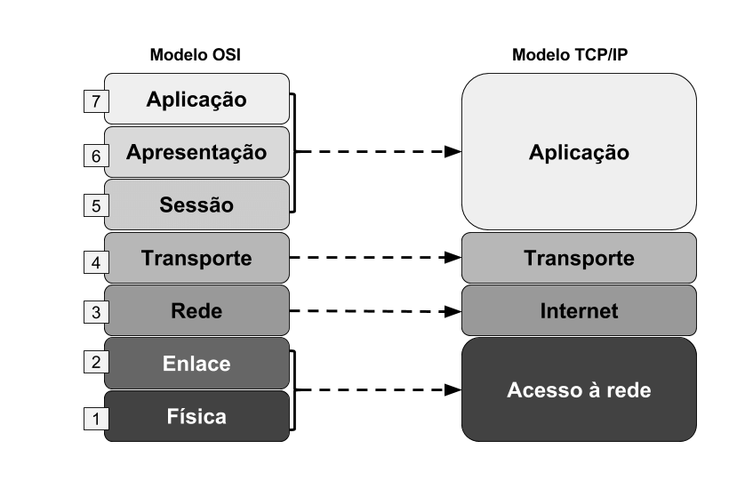

# Endereçamento IPv4

# **Introdução ao IPv4:**

- Definição: IPv4 (Internet Protocol version 4) é a quarta versão do Internet Protocol (IP). É um dos principais protocolos em que se baseia a internet.
- Foi o primeiro protocolo de rede a ser amplamente adotado e ainda é o protocolo dominante na Internet.

> [!INFO]
> Apresentar o Censys

# **Estrutura do endereço IPv4:**

- Os endereços IPv4 são compostos por 32 bits e são normalmente expressos como quatro números decimais de 8 bits, separados por pontos. Cada número pode variar de 0 a 255. Exemplo: 192.168.0.1.
- Os endereços IPv4 são divididos em duas partes: a identificação da rede e a identificação do host na rede.
- Para visualizar seu endereço IP:

```powershell
ifconfig // no linux
ipconfig // no windows
```


# **Classes de endereços IPv4:**

- Classe A: Endereços que começam com 0-127. Eles têm um grande número de endereços de host e poucos endereços de rede.
- Classe B: Endereços que começam com 128-191. Eles têm um número médio de endereços de rede e de host.
- Classe C: Endereços que começam com 192-223. Eles têm um grande número de endereços de rede e poucos endereços de host.
- Classe D: Usada para multicast.
- Classe E: Reservada para uso futuro ou pesquisa.




O esquema de classes foi descontinuado em 1993 e substituído pelo esquema CIDR. Porém ainda é utilizado em alguns casos.

# CIDR (Classless Inter-Domain Routing)

A CIDR (Classless Inter-Domain Routing) é uma metodologia usada para alocar endereços IP e rotear de maneira mais eficiente. Ela foi introduzida para melhorar o uso do espaço de endereçamento IPv4 e permitir roteamento mais flexível. Diferente do sistema anterior baseado em classes (A, B, C), onde cada classe tinha um número fixo de hosts, a CIDR permite a divisão de espaços de endereços IP em blocos de tamanhos variáveis. Isso é realizado através da notação de máscara de rede, onde o prefixo, seguido de uma barra ("/"), indica quantos bits são usados para o endereçamento da rede, permitindo assim um controle mais granular sobre a alocação de endereços IP e a agregação de rotas, o que reduz a sobrecarga nas tabelas de roteamento da internet.

# **Sub-redes e máscaras de sub-rede:**

- Sub-rede é uma divisão de uma rede. Isso é feito para melhorar o desempenho e a segurança da rede.
- A máscara de sub-rede é usada para dividir o endereço IP em endereço de rede e endereço de host.
- Por exemplo, uma máscara de sub-rede para uma classe C seria 255.255.255.0.


[Cálculo de sub-redes - Curso Redes #12](https://www.youtube.com/watch?v=wBUxveZAgco)

# **Endereços especiais:**

- Loopback (127.0.0.1): Usado para testar a própria rede do computador.
- Broadcast (255.255.255.255): Usado para enviar informações a todos os dispositivos na rede.
- Faixas de endereços privados: Não podem ser roteados na Internet, usados para redes internas.


Redes privadas

# **Notação CIDR:**

- A notação CIDR permite especificar a máscara de sub-rede juntamente com o endereço IP. Por exemplo, 192.168.0.1/24, onde /24 representa a máscara de sub-rede.

# **NAT (Network Address Translation):**

- NAT é usado para permitir que vários dispositivos em uma rede local compartilhem um único endereço IP público.
- Isso é feito traduzindo os endereços IP privados em um endereço IP público.

# **IPv4 vs IPv6:**

- IPv4 é baseado em 32 bits, enquanto IPv6 é baseado em 128 bits, o que significa que IPv6 tem uma capacidade muito maior de endereços.
- IPv4 usa endereços numéricos, enquanto IPv6 usa endereços alfanuméricos.
- IPv6 tem recursos de segurança integrados, enquanto IPv4 não.

# **Exercícios Práticos:**

- Exercício 1: Dado o endereço IP 192.168.1.5/24, qual é o endereço de rede e o endereço de broadcast?
- Exercício 2: Se você tem a sub-rede 192.168.1.0/26, quantos endereços de host estão disponíveis?
- Exercício 3: Usando o Wireshark ou similar, capture alguns pacotes e identifique os endereços IPv4 e suas respectivas partes da rede e do host.

# Testar conhecimentos com questões de concursos

[Questões de Concursos - Provas, Aulas e Questões | Qconcursos.com](https://www.qconcursos.com/)

# Lista de exercício completa

---

---

## **Questão 3**

**ID**: Q3032303

**Ano/Banca**: 2024, FGV

**Descrição**: Virgínia foi contratada para efetuar reparos na rede da empresa K. Ao fazer um estudo rápido sobre os problemas de conectividade existentes, notou que três máquinas tinham sido configuradas com o endereço de rede incorreto. A empresa tem disponível o range de IPs 192.168.0.0/24, que estava dividido em sub-redes com máscara 255.255.255.240/28. As máquinas incorretas tinham os IPs: 192.168.0.85, 192.168.0.86 e 192.168.0.87. Para que os hosts sejam configurados corretamente, Virgínia deverá atribuir os IPs à sub-rede:

**Alternativas**:

A) 192.168.0.32

B) 192.168.0.48

C) 192.168.0.64

D) 192.168.0.80

E) 192.168.0.96

---

## **Questão 4**

**ID**: Q3011899

**Ano/Banca**: 2024, CESPE/CEBRASPE

**Descrição**: Considere que tenham sido criadas oito sub-redes da rede classe C: 192.168.0.0 a partir da extensão de sua máscara de rede padrão, que é 255.255.255.0. Com base nessas informações, assinale a opção que corresponde à representação, em binário, da nova máscara de rede que foi utilizada para a criação das referidas sub-redes.

**Alternativas**:

A) 11111111.11111111.11111111.10000000

B) 11111111.11111111.11111111.11000000

C) 11111111.11111111.11111111.11100000

D) 11111111.11111111.11111111.11110000

E) 11111111.11111111.11111111.11111000

---

## **Questão 5**

**ID**: Q2794433

**Ano/Banca**: 2017, IBADE

**Descrição**: Se uma rede de computadores com acesso à Internet opera com o IP 192.168.5.64/26, de acordo com a notação CIDR, pode-se concluir que a máscara de sub-rede é:

**Alternativas**:

A) 255.255.255.224

B) 255.255.192.0

C) 255.255.255.240

D) 255.255.224.0

E) 255.255.255.192

---

## **Questão 6**

**ID**: Q2678187

**Ano/Banca**: 2021, FEPESE

**Descrição**: Qual o número máximo de sub-redes possível com CIDR 27?

**Alternativas**:

A) 4

B) 8

C) 16

D) 32

E) 64

---

## **Questão 7**

**ID**: Q2635540

**Ano/Banca**: 2023, FCC

**Descrição**: Considere uma rede classe C 192.168.15.0/24. Para criar 8 sub-redes com 32 IPs cada (30 hosts + 1 endereço de rede + 1 endereço de broadcast), a quantidade de bits da porção de host necessária para criar as sub-redes e para acomodar os IPs são, correta e respectivamente:

**Alternativas**:

A) 2 e 6

B) 3 e 5

C) 4 e 4

D) 6 e 2

E) 5 e 3

---

## **Questão 8**

**ID**: Q2554184

**Ano/Banca**: 2024, IBADE

**Descrição**: Considerando a sub-rede 200.144.224.0/20, qual endereço IP pertence a ela? (NÃO COLOCAREI NA PROVA)

**Alternativas**:

A) 200.144.214.5

B) 200.144.128.1

C) 200.144.255.254

D) 200.144.0.1

E) 200.144.235.23

---

## **Questão 9**

**ID**: Q2554178

**Ano/Banca**: 2024, IBADE

**Descrição**: No contexto de Redes de Computadores, o que significa o termo "subnetting"?

**Alternativas**:

A) Criptografia de dados transmitidos em uma rede.

B) Divisão de uma rede IP em sub-redes menores.

C) Roteamento dinâmico de pacotes.

D) Modulação de sinais para transmissão sem fio.

E) Filtragem de pacotes indesejados em um firewall.

---

## **Questão 11**

**ID**: Q2493756

**Ano/Banca**: 2024, UERJ

**Descrição**: Uma forma de indicar a quantidade de endereços IP disponíveis vem da configuração de máscara de rede. Considerando que a Rede 1 deve conter 60 endereços IP disponíveis e que a Rede 2 deve conter 200 endereços IP disponíveis, a configuração das máscaras de rede que permite a quantidade necessária com o menor desperdício de endereços IP, respectivamente, é:

**Alternativas**:

A) 255.255.255.0 / 255.255.254.0

B) 255.255.255.192 / 255.255.255.0

C) 255.255.255.252 / 255.255.255.0

D) 255.255.255.254 / 255.255.254.0

---

## **Questão 12**

**ID**: Q2491067

**Ano/Banca**: 2024, SELECON

**Descrição**: Em uma grande rede de computadores, o endereço IPv4 usado pelos computadores de todas as sub-redes é definido como 10.10.X.Y, sendo X qualquer valor entre 0 e 25 e Y qualquer valor entre 0 e 254. A máscara de sub-rede nessa grande rede é 255.255.240.0. Com essa máscara e essa sintaxe de endereço IPv4, a quantidade possível de sub-redes nessa grande rede é de:

**Alternativas**:

A) 16

B) 32

C) 240

D) 255

---

## **Questão 13**

**ID**: Q2467556

**Ano/Banca**: 2024, SELECON

**Descrição**: Uma sub-rede de computadores com acesso à Internet está configurada por meio do IP 197.234.155.32/27, de acordo com a notação CIDR. Um endereço IP válido para uma máquina que está fisicamente conectada a essa sub-rede e a máscara que ela está utilizando são, respectivamente:

**Alternativas**:

A) 197.234.155.80 e 255.255.255.224

B) 197.234.155.60 e 255.255.255.224

C) 197.234.155.80 e 255.255.255.0

D) 197.234.155.60 e 255.255.255.0

---

## **Questão 14**

**ID**: Q2464108

**Ano/Banca**: 2024, CESPE/CEBRASPE

**Descrição**: Uma organização recebeu o seguinte bloco de endereços IPv4 da classe B: 172.16.0.0/16. A organização deseja criar sub-redes que possam acomodar até 1.000 hosts em cada uma, minimizando o desperdício de endereços IP. Nessa situação, assinale a opção em que é apresentada a máscara de sub-rede mais apropriada para atender à exigência citada. (NÃO COLOCAREI NA PROVA)

**Alternativas**:

A) 255.255.254.0

B) 255.255.255.240

C) 255.255.255.0

D) 255.255.255.128

E) 255.255.252.0

---

## **Questão 16**

**ID**: Q2446171

**Ano/Banca**: 2024, IV - UFG

**Descrição**: Uma organização foi atribuída o endereço IP 192.168.100.0/24 e deseja criar sub-redes com capacidade para pelo menos 30 hosts cada. Qual é a máscara de sub-rede mais apropriada para atender a essa necessidade, maximizando o número de sub-redes disponíveis?

**Alternativas**:

A) 255.255.255.224

B) 255.255.255.240

C) 255.255.255.248

D) 255.255.255.0

---

## **Questão 17**

**ID**: Q2425453

**Ano/Banca**: 2020, Marinha

**Descrição**: Assinale a opção que apresenta a máscara de rede que comporta exatamente blocos de 8 hosts.

**Alternativas**:

A) 255.255.255.248

B) 255.255.255.128

C) 255.255.255.240

D) 255.255.255.192

E) 255.255.255.224

---

## **Questão 18**

**ID**: Q2425430

**Ano/Banca**: 2020, Marinha

**Descrição**: Assinale a opção que apresenta a forma alternativa de representar a máscara de rede 255.255.255.192.

**Alternativas**:

A) /29

B) /28

C) /26

D) /25

E) /22

---

## **Questão 19**

**ID**: Q2411822

**Ano/Banca**: 2021, CETAP

**Descrição**: A máscara de sub-rede de uma rede IPv4 é 255.255.255.128. O número de hosts possíveis dentro desta sub-rede é de:

**Alternativas**:

A) 256

B) 254

C) 128

D) 126

---

###