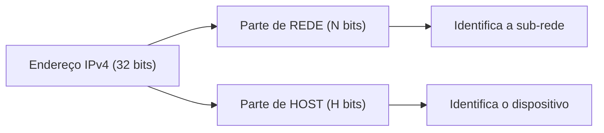
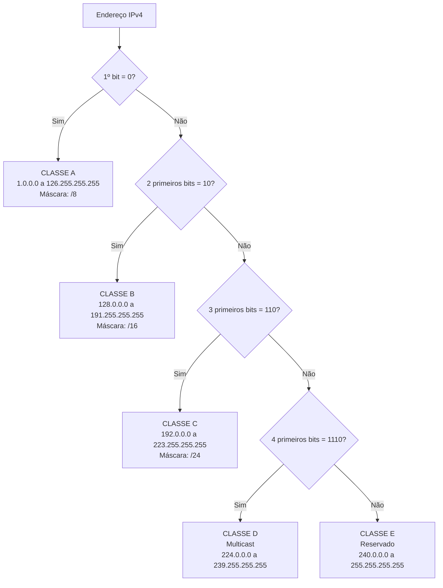
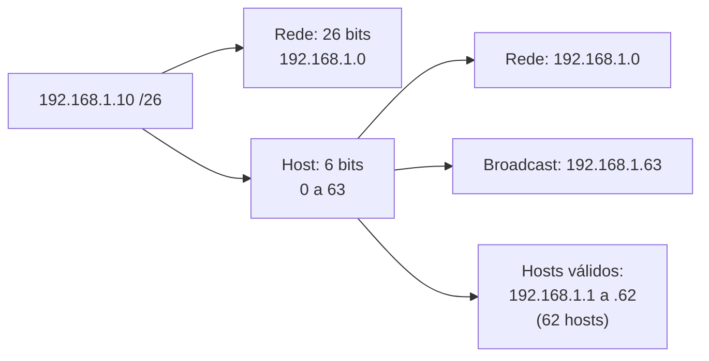
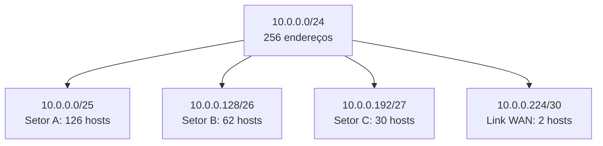

# Endereçamento IPv4

> [!quote] O Alicerce da Internet
> *O IPv4 foi o primeiro protocolo de rede amplamente adotado e ainda é o protocolo dominante na Internet, sendo essencial para qualquer profissional de redes.*

---

## 📖 Introdução ao IPv4

> [!info] Definição
> IPv4 (Internet Protocol version 4) é a quarta versão do Internet Protocol (IP). É um dos principais protocolos em que se baseia a internet.

| Característica | Valor |
|----------------|-------|
| **Bits** | 32 bits |
| **Formato** | Quatro octetos decimais (0-255) |
| **Exemplo** | 192.168.0.1 |
| **Total de endereços** | ~4,3 bilhões |

> [!tip] Recurso Útil
> Explore o [Censys](https://censys.io/) para visualizar dispositivos conectados à internet.

### Por que 32 bits?

Cada octeto do endereço IPv4 representa 8 bits em notação binária. O endereço `192.168.1.10`, por exemplo, em binário é:

```
11000000.10101000.00000001.00001010
```

Esse formato binário é a linguagem nativa dos roteadores ao tomarem decisões de encaminhamento de pacotes. Entender a conversão entre decimal e binário é, portanto, habilidade fundamental para qualquer técnico de redes.

### Esgotamento do IPv4

Com ~4,3 bilhões de endereços e mais de 8 bilhões de dispositivos conectados no mundo, o espaço IPv4 se esgotou formalmente na IANA (Internet Assigned Numbers Authority) em fevereiro de 2011. As soluções adotadas foram: NAT (Network Address Translation), CIDR (uso mais eficiente dos blocos) e, no longo prazo, a migração para IPv6. Mesmo assim, o IPv4 permanece dominante no tráfego global em 2026.

---

## 🔢 Estrutura do Endereço IPv4

> [!info] Composição
> Os endereços IPv4 são divididos em duas partes: **identificação da rede** e **identificação do host**.


```mermaid
graph LR
    A["Endereço IPv4 (32 bits)"] --> B["Parte de REDE (N bits)"]
    A --> C["Parte de HOST (H bits)"]
    B --> D["Identifica a sub-rede"]
    C --> E["Identifica o dispositivo"]
```

A quantidade de bits dedicada a cada parte depende da máscara de sub-rede aplicada. Quanto mais bits para a rede, menos hosts possíveis por sub-rede e mais sub-redes disponíveis.

### 🔁 Conversão Decimal ↔ Binário

| Decimal | 128 | 64 | 32 | 16 | 8 | 4 | 2 | 1 |
|---------|-----|----|----|----|---|---|---|---|
| **192** | 1   | 1  | 0  | 0  | 0 | 0 | 0 | 0 |
| **168** | 1   | 0  | 1  | 0  | 1 | 0 | 0 | 0 |
| **1**   | 0   | 0  | 0  | 0  | 0 | 0 | 0 | 1 |
| **10**  | 0   | 0  | 0  | 0  | 1 | 0 | 1 | 0 |

**Regra prática:** some as potências de 2 cujas posições têm valor 1.
Exemplo: 192 = 128 + 64 = `11000000`.

### Visualizar seu IP

```bash
# Linux
ip a
# ou forma antiga:
ifconfig

# Windows
ipconfig /all
```

![[Recursos/Redes de Computadores/Endereçamento IPv4/ipv4-formato-octetos-binario.png|Estrutura do IPv4]]

![[Recursos/Redes de Computadores/Endereçamento IPv4/ipv4-classe-b-exemplo.png|Exemplo de configuração IP]]

---

## 📊 Classes de Endereços IPv4

> [!warning] Nota Histórica
> O esquema de classes foi descontinuado em 1993 e substituído pelo CIDR, mas ainda é cobrado em concursos e é importante para entender a evolução histórica do protocolo.

### Tabela de Classes

| Classe | Primeiro Octeto | Máscara Padrão | Redes | Hosts por Rede | Uso |
|--------|-----------------|----------------|-------|----------------|-----|
| **A** | 1-126 | /8 (255.0.0.0) | 126 | ~16,7 milhões | Grandes organizações |
| **B** | 128-191 | /16 (255.255.0.0) | 16.384 | ~65.534 | Organizações médias |
| **C** | 192-223 | /24 (255.255.255.0) | ~2 milhões | 254 | Pequenas redes |
| **D** | 224-239 | N/A | N/A | N/A | Multicast |
| **E** | 240-255 | N/A | N/A | N/A | Reservado/Pesquisa |

> [!note] Observação sobre a Classe A
> O endereço `127.x.x.x` é reservado para loopback e fica fora do intervalo utilizável da Classe A (por isso começa em 1, não em 0).

### Diagrama de Classes


```mermaid
graph TD
    IP["Endereço IPv4"] --> bit0{"1º bit = 0?"}
    bit0 -->|Sim| A["CLASSE A\n1.0.0.0 a 126.255.255.255\nMáscara: /8"]
    bit0 -->|Não| bit1{"2 primeiros bits = 10?"}
    bit1 -->|Sim| B["CLASSE B\n128.0.0.0 a 191.255.255.255\nMáscara: /16"]
    bit1 -->|Não| bit2{"3 primeiros bits = 110?"}
    bit2 -->|Sim| C["CLASSE C\n192.0.0.0 a 223.255.255.255\nMáscara: /24"]
    bit2 -->|Não| bit3{"4 primeiros bits = 1110?"}
    bit3 -->|Sim| D["CLASSE D\nMulticast\n224.0.0.0 a 239.255.255.255"]
    bit3 -->|Não| E["CLASSE E\nReservado\n240.0.0.0 a 255.255.255.255"]
```

![[Recursos/Redes de Computadores/Endereçamento IPv4/ipv4-classes-ranges-mascaras.png|Classes IPv4]]

![[Recursos/Redes de Computadores/Endereçamento IPv4/ipv4-classes-detalhes-redes.png|Detalhamento das classes]]

### Como identificar a classe rapidamente

O primeiro octeto do endereço revela a classe:

| Primeiro Octeto | Classe | Exemplo |
|-----------------|--------|---------|
| 1 a 126 | A | 10.0.0.1 |
| 128 a 191 | B | 172.16.0.1 |
| 192 a 223 | C | 192.168.1.1 |
| 224 a 239 | D | 224.0.0.5 (OSPF) |
| 240 a 255 | E | 240.0.0.1 |

---

## 🎯 CIDR (Classless Inter-Domain Routing)

> [!success] Solução Moderna
> A CIDR permite a divisão de espaços de endereços IP em blocos de tamanhos variáveis, proporcionando uso mais eficiente dos endereços. Introduzida pelo RFC 1519 em 1993, o CIDR eliminou a rigidez do sistema de classes.

### Como funciona o CIDR

A notação `/X` indica quantos bits do endereço de 32 bits são usados para identificar a **rede**. Os bits restantes (32 - X) identificam os **hosts**.

**Fórmula de hosts utilizáveis:**
```
hosts = 2^(32 - prefixo) - 2
```
(Subtraem-se 2: endereço de rede e endereço de broadcast.)

### Notação CIDR: tabela completa

| Notação | Máscara | Hosts Utilizáveis | Bloco (total IPs) |
|---------|---------|-------------------|-------------------|
| /8 | 255.0.0.0 | 16.777.214 | 16.777.216 |
| /16 | 255.255.0.0 | 65.534 | 65.536 |
| /24 | 255.255.255.0 | 254 | 256 |
| /25 | 255.255.255.128 | 126 | 128 |
| /26 | 255.255.255.192 | 62 | 64 |
| /27 | 255.255.255.224 | 30 | 32 |
| /28 | 255.255.255.240 | 14 | 16 |
| /29 | 255.255.255.248 | 6 | 8 |
| /30 | 255.255.255.252 | 2 | 4 |
| /31 | 255.255.255.254 | 2 (ponto-a-ponto) | 2 |
| /32 | 255.255.255.255 | 1 (host único) | 1 |

**Exemplo**: `192.168.0.1/24` indica que os primeiros 24 bits são a rede (`192.168.0`) e os últimos 8 bits identificam hosts (`.1` a `.254`).

### Diagrama CIDR: divisão dos bits


```mermaid
graph LR
    A["192.168.1.10 /26"] --> B["Rede: 26 bits\n192.168.1.0"]
    A --> C["Host: 6 bits\n0 a 63"]
    C --> D["Rede: 192.168.1.0"]
    C --> E["Broadcast: 192.168.1.63"]
    C --> F["Hosts válidos:\n192.168.1.1 a .62\n(62 hosts)"]
```

---

## 🔀 Sub-redes e Máscaras

> [!info] Conceito
> Sub-rede é uma divisão de uma rede maior, feita para melhorar o desempenho, a segurança e o gerenciamento dos recursos de endereçamento.

A **máscara de sub-rede** divide o endereço IP em:
- Parte de **rede**
- Parte de **host**

**Exemplo Classe C**: Máscara `255.255.255.0`

### Como calcular sub-redes: método passo a passo

Dada a rede `192.168.10.0/24`, dividir em 4 sub-redes iguais:

**Passo 1:** quantos bits adicionais são necessários?
```
2^n >= número de sub-redes desejadas
2^2 = 4 → precisamos de 2 bits emprestados
```

**Passo 2:** nova máscara: `/24 + 2 = /26` (255.255.255.192)

**Passo 3:** tamanho do bloco: `256 - 192 = 64`

**Passo 4:** listar as sub-redes:

| Sub-rede | Endereço de Rede | Broadcast | Hosts Válidos | Hosts Disponíveis |
|----------|------------------|-----------|---------------|-------------------|
| 1ª | 192.168.10.0 | 192.168.10.63 | .1 a .62 | 62 |
| 2ª | 192.168.10.64 | 192.168.10.127 | .65 a .126 | 62 |
| 3ª | 192.168.10.128 | 192.168.10.191 | .129 a .190 | 62 |
| 4ª | 192.168.10.192 | 192.168.10.255 | .193 a .254 | 62 |

**Regra do broadcast:** o broadcast é sempre o último endereço antes da próxima sub-rede começar.

📺 [Vídeo: Cálculo de sub-redes](https://www.youtube.com/watch?v=wBUxveZAgco)

![[Recursos/Redes de Computadores/Endereçamento IPv4/ipv4-subnetting-tabela.png|Máscaras de sub-rede]]

---

## 🧩 VLSM (Variable Length Subnet Mask)

> [!info] O que é VLSM
> VLSM (Máscara de Sub-rede de Comprimento Variável) é uma extensão do CIDR que permite atribuir máscaras de tamanhos diferentes para sub-redes distintas dentro de uma mesma rede maior. O objetivo é eliminar o desperdício de endereços ao alocar blocos proporcionais às necessidades reais de cada segmento.

### Por que o VLSM surgiu

No subnetting clássico de comprimento fixo, todas as sub-redes têm o mesmo tamanho, mesmo que um segmento precise de 100 hosts e outro precise de apenas 2. Com VLSM, cada sub-rede recebe exatamente o bloco mínimo suficiente para seus hosts.

### Exemplo prático de VLSM

Rede base: `10.0.0.0/24`. Necessidades:

| Segmento | Hosts necessários | Sub-rede atribuída | Bloco |
|----------|------------------|--------------------|-------|
| Setor A | 100 hosts | 10.0.0.0/25 | 128 IPs (126 utilizáveis) |
| Setor B | 50 hosts | 10.0.0.128/26 | 64 IPs (62 utilizáveis) |
| Setor C | 25 hosts | 10.0.0.192/27 | 32 IPs (30 utilizáveis) |
| Link WAN | 2 hosts | 10.0.0.224/30 | 4 IPs (2 utilizáveis) |

**IPs totais usados:** 128 + 64 + 32 + 4 = 228 de 256. Desperdício mínimo.

Sem VLSM, com 4 sub-redes /25 fixas: cada bloco teria 126 hosts, mas os segmentos B, C e WAN desperdiçariam dezenas de endereços.


```mermaid
graph TD
    R["10.0.0.0/24\n256 endereços"] --> A["10.0.0.0/25\nSetor A: 126 hosts"]
    R --> B["10.0.0.128/26\nSetor B: 62 hosts"]
    R --> C["10.0.0.192/27\nSetor C: 30 hosts"]
    R --> W["10.0.0.224/30\nLink WAN: 2 hosts"]
```

> [!tip] Dica de prova
> Em questões de VLSM, sempre comece alocando o bloco para o segmento com MAIS hosts. Isso evita sobreposição de endereços.

---

## ⚡ Endereços Especiais

> [!tip] Endereços Reservados
> Alguns endereços têm funções específicas e não podem ser atribuídos a hosts comuns.

| Endereço | Função |
|----------|--------|
| **127.0.0.1** | Loopback (teste local, pilha TCP/IP) |
| **255.255.255.255** | Broadcast limitado (todos na rede local) |
| **0.0.0.0** | Endereço de rede sem definição/rota padrão |
| **169.254.x.x** | APIPA (link-local, quando DHCP falha) |

### 🔒 Faixas de Endereços Privados (RFC 1918)

![[Recursos/Redes de Computadores/Endereçamento IPv4/ipv4-blocos-privados-cidr.png|Redes privadas]]

| Classe Histórica | Faixa | CIDR | Total de endereços |
|-----------------|-------|------|--------------------|
| **A** | 10.0.0.0 a 10.255.255.255 | 10.0.0.0/8 | ~16,7 milhões |
| **B** | 172.16.0.0 a 172.31.255.255 | 172.16.0.0/12 | ~1 milhão |
| **C** | 192.168.0.0 a 192.168.255.255 | 192.168.0.0/16 | ~65 mil |

> [!warning] Importante
> Endereços privados **não podem** ser roteados na Internet pública. Para que dispositivos com IPs privados acessem a internet, é necessário o NAT.

### Outros endereços reservados relevantes

| Bloco | Uso |
|-------|-----|
| 100.64.0.0/10 | Shared Address Space (ISPs, RFC 6598) |
| 192.0.2.0/24 | Documentação e exemplos (RFC 5737) |
| 198.51.100.0/24 | Documentação e exemplos (RFC 5737) |
| 203.0.113.0/24 | Documentação e exemplos (RFC 5737) |
| 224.0.0.0/4 | Multicast (Classe D) |
| 240.0.0.0/4 | Reservado/Futuro (Classe E) |

---

## 🔄 NAT (Network Address Translation)

> [!info] Conceito
> NAT permite que vários dispositivos em uma rede local compartilhem um único endereço IP público, traduzindo endereços privados para públicos na saída e realizando o processo inverso na entrada das respostas.

### Tipos de NAT

| Tipo | Descrição | Uso comum |
|------|-----------|-----------|
| **NAT Estático** | 1 IP privado mapeado para 1 IP público fixo | Servidores internos expostos |
| **NAT Dinâmico** | Pool de IPs públicos compartilhados | Empresas com vários IPs públicos |
| **PAT/Overload** | Muitos IPs privados para 1 IP público (usa portas) | Roteador doméstico |

O tipo mais comum nas residências e empresas pequenas é o **PAT (Port Address Translation)**, também chamado de NAT overload. O roteador rastreia cada conexão pela combinação IP:porta, permitindo que dezenas de dispositivos compartilhem um único IP público.

---

## ⚔️ IPv4 vs IPv6

| Característica | IPv4 | IPv6 |
|----------------|------|------|
| **Bits** | 32 bits | 128 bits |
| **Formato** | Numérico (decimal) | Alfanumérico (hexadecimal) |
| **Endereços** | ~4,3 bilhões | ~340 undecilhões |
| **Segurança** | Não integrada | IPSec nativo |
| **Configuração de endereço** | Manual ou DHCP | SLAAC, DHCPv6 ou manual |
| **Broadcast** | Sim | Não (usa multicast/anycast) |
| **Cabeçalho** | Variável (20-60 bytes) | Fixo (40 bytes) |
| **Fragmentação** | Roteadores e hosts | Apenas hosts de origem |

> [!note] Coexistência
> Na prática atual (2026), a maioria das redes opera em **dual-stack**: os dispositivos têm simultaneamente um endereço IPv4 e um IPv6, garantindo compatibilidade com toda a internet.

---

## 📝 Exercícios Práticos

> [!tip] Pratique!

1. **Exercício 1**: Dado o IP `192.168.1.5/24`, qual é o endereço de rede e o de broadcast?

2. **Exercício 2**: Na sub-rede `192.168.1.0/26`, quantos endereços de host estão disponíveis?

3. **Exercício 3**: Use o Wireshark para capturar pacotes e identificar endereços IPv4.

---

> [!example] 🧪 Atividade 1: Descobrir seu IP e identificar a classe
> **Objetivo:** descobrir seu endereço IP, máscara e gateway, e identificar a classe do endereço.
>
> **Ferramentas:** terminal do próprio computador.
>
> **No Windows, abra o Prompt de Comando (`cmd`) e execute:**
> ```
> ipconfig /all
> ```
>
> **No Linux, abra o terminal e execute:**
> ```
> ip a
> ```
>
> **O que anotar:**
> - Endereço IPv4 (ex: `192.168.1.45`)
> - Máscara de sub-rede (ex: `255.255.255.0` ou `/24`)
> - Gateway padrão
>
> **O que responder:**
> 1. Qual o endereço IP da sua máquina?
> 2. Esse IP pertence a qual classe (A, B ou C)?
> 3. O IP é público ou privado? Por quê?
> 4. Quantos hosts cabem na sua sub-rede com a máscara que você encontrou?
>
> **Resultado esperado:** cada aluno identifica seu IP, classifica corretamente e calcula a capacidade de hosts da rede local.

---

> [!example] 🧪 Atividade 2: Usar calculadora de sub-redes online
> **Objetivo:** usar uma ferramenta profissional para decompor um bloco CIDR e entender todos os campos de uma sub-rede.
>
> **Ferramenta:** [https://jodies.de/ipcalc](https://jodies.de/ipcalc) ou [https://www.subnet-calculator.com/](https://www.subnet-calculator.com/)
>
> **Dado de entrada:** `172.20.50.0/27`
>
> **O que fazer:**
> 1. Acesse um dos links acima.
> 2. Digite `172.20.50.0` e a máscara `/27` (ou `255.255.255.224`).
> 3. Anote os campos retornados pela calculadora.
>
> **O que registrar na folha:**
> | Campo | Valor encontrado |
> |-------|-----------------|
> | Endereço de rede | |
> | Broadcast | |
> | Primeiro host válido | |
> | Último host válido | |
> | Quantidade de hosts utilizáveis | |
> | Máscara em binário | |
>
> **Bônus:** mude o prefixo para `/28` e repita. Que diferença isso faz no número de hosts?
>
> **Resultado esperado:** preencher a tabela corretamente e perceber que cada bit a mais no prefixo corta o bloco de hosts pela metade.

---

> [!example] 🧪 Atividade 3: Dividir uma rede /24 em 4 sub-redes na mão e conferir
> **Objetivo:** praticar o cálculo manual de sub-redes e validar o resultado com a calculadora.
>
> **Rede inicial:** `10.10.0.0/24`
> **Tarefa:** divida essa rede em exatamente 4 sub-redes iguais.
>
> **Passo a passo manual:**
> 1. Quantos bits preciso emprestar? `2^n >= 4` → `n = 2` bits.
> 2. Nova máscara: `/24 + 2 = /26`.
> 3. Tamanho do bloco: `256 - 192 = 64`.
> 4. Preencha a tabela abaixo:
>
> | Sub-rede | Endereço de Rede | Broadcast | 1º Host | Último Host | Hosts úteis |
> |----------|-----------------|-----------|---------|-------------|-------------|
> | 1ª | | | | | |
> | 2ª | | | | | |
> | 3ª | | | | | |
> | 4ª | | | | | |
>
> **Conferência:** acesse [https://www.subnet-calculator.com/subnet.php?net_class=C](https://www.subnet-calculator.com/subnet.php?net_class=C) e insira `10.10.0.0/26` para verificar cada sub-rede.
>
> **Pergunta extra:** se você precisasse de 8 sub-redes em vez de 4, qual seria a nova máscara? Quantos hosts sobraria por sub-rede?
>
> **Resultado esperado:** tabela preenchida corretamente com as 4 sub-redes, broadcast e hosts, confirmada pela calculadora online.

---

## 🎯 Questões de Concursos

> [!success] Teste seus Conhecimentos
> 🔗 [QConcursos](https://www.qconcursos.com/) : Pratique com questões reais

---

### 📋 Questão 1 : FGV 2024

> [!info] Q3032303
> Virgínia foi contratada para efetuar reparos na rede da empresa K. A empresa tem o range 192.168.0.0/24, dividido em sub-redes /28. As máquinas incorretas tinham os IPs: 192.168.0.85, 192.168.0.86 e 192.168.0.87. A sub-rede correta é:

| Alternativa | Valor |
|-------------|-------|
| A | 192.168.0.32 |
| B | 192.168.0.48 |
| C | 192.168.0.64 |
| D | 192.168.0.80 ✓ |
| E | 192.168.0.96 |

---

### 📋 Questão 2 : CESPE 2024

> [!info] Q3011899
> Foram criadas 8 sub-redes da rede classe C 192.168.0.0 com máscara 255.255.255.0. A nova máscara em binário é:

| Alternativa | Máscara |
|-------------|---------|
| A | 11111111.11111111.11111111.10000000 |
| B | 11111111.11111111.11111111.11000000 |
| C | 11111111.11111111.11111111.11100000 ✓ |
| D | 11111111.11111111.11111111.11110000 |
| E | 11111111.11111111.11111111.11111000 |

---

### 📋 Questão 3 : IBADE 2017

> [!info] Q2794433
> Se uma rede opera com IP 192.168.5.64/26, a máscara de sub-rede é:

| Alternativa | Máscara |
|-------------|---------|
| A | 255.255.255.224 |
| B | 255.255.192.0 |
| C | 255.255.255.240 |
| D | 255.255.224.0 |
| E | 255.255.255.192 ✓ |

---

### 📋 Questão 4 : FEPESE 2021

> [!info] Q2678187
> Qual o número máximo de sub-redes possível com CIDR /27?

| Alternativa | Valor |
|-------------|-------|
| A | 4 |
| B | 8 ✓ |
| C | 16 |
| D | 32 |
| E | 64 |

---

### 📋 Questão 5 : FCC 2023

> [!info] Q2635540
> Para criar 8 sub-redes com 32 IPs cada (30 hosts) na rede 192.168.15.0/24, a quantidade de bits para sub-redes e hosts são:

| Alternativa | Bits |
|-------------|------|
| A | 2 e 6 |
| B | 3 e 5 ✓ |
| C | 4 e 4 |
| D | 6 e 2 |
| E | 5 e 3 |

---

### 📋 Questão 6 : IBADE 2024

> [!info] Q2554178
> O que significa o termo "subnetting"?

| Alternativa | Resposta |
|-------------|----------|
| A | Criptografia de dados |
| B | Divisão de uma rede IP em sub-redes menores ✓ |
| C | Roteamento dinâmico |
| D | Modulação de sinais |
| E | Filtragem de pacotes |

---

### 📋 Questão 7 : UERJ 2024

> [!info] Q2493756
> Rede 1 precisa de 60 IPs, Rede 2 precisa de 200 IPs. As máscaras com menor desperdício são:

| Alternativa | Máscaras |
|-------------|----------|
| A | 255.255.255.0 / 255.255.254.0 |
| B | 255.255.255.192 / 255.255.255.0 ✓ |
| C | 255.255.255.252 / 255.255.255.0 |
| D | 255.255.255.254 / 255.255.254.0 |

---

### 📋 Questão 8 : SELECON 2024

> [!info] Q2467556
> Sub-rede 197.234.155.32/27. Um IP válido e a máscara são:

| Alternativa | IP / Máscara |
|-------------|--------------|
| A | 197.234.155.80 / 255.255.255.224 |
| B | 197.234.155.60 / 255.255.255.224 ✓ |
| C | 197.234.155.80 / 255.255.255.0 |
| D | 197.234.155.60 / 255.255.255.0 |

---

### 📋 Questão 9 : Marinha 2020

> [!info] Q2425453
> Máscara que comporta exatamente blocos de 8 hosts:

| Alternativa | Máscara |
|-------------|---------|
| A | 255.255.255.248 ✓ |
| B | 255.255.255.128 |
| C | 255.255.255.240 |
| D | 255.255.255.192 |
| E | 255.255.255.224 |

---

### 📋 Questão 10 : Marinha 2020

> [!info] Q2425430
> Forma alternativa de representar 255.255.255.192:

| Alternativa | CIDR |
|-------------|------|
| A | /29 |
| B | /28 |
| C | /26 ✓ |
| D | /25 |
| E | /22 |

---

### 📋 Questão 11 : CETAP 2021

> [!info] Q2411822
> Com máscara 255.255.255.128, o número de hosts possíveis é:

| Alternativa | Hosts |
|-------------|-------|
| A | 256 |
| B | 254 |
| C | 128 |
| D | 126 ✓ |

---

> [!note] 📚 Fontes (2026)
> - [Understanding Subnetting, CIDR, and VLSM in IPv4 (FirewallFlow)](https://www.firewallflow.com/understanding-subnetting-cidr-and-vlsm/)
> - [IP Addresses, Subnets, and CIDR Notation Explained (DigitalOcean)](https://www.digitalocean.com/community/tutorials/understanding-ip-addresses-subnets-and-cidr-notation-for-networking)
> - [Introduction to Subnetting (GeeksforGeeks)](https://www.geeksforgeeks.org/computer-networks/introduction-to-subnetting/)
> - [Introduction to Subnetting: CIDR, VLSM (ITTSystems)](https://www.ittsystems.com/introduction-to-subnetting/)
> - [What is VLSM? (NetworkAcademy.IO)](https://www.networkacademy.io/ccna/ip-subnetting/what-is-vlsm)
> - [VLSM in Networking (PyNetLabs)](https://www.pynetlabs.com/what-is-vlsm-variable-length-subnet-mask/)
> - [Guia Resumido Avançado de IPv4 (DevData)](https://blog.devdata.com.br/guia-resumido-avancado-de-ipv4-enderecamento-subnetting-e-roteamento-profissional-artigo/)
> - [Endereçamento IPv4: Dominando a Espinha Dorsal da Internet (RCBrasil, ago/2025)](https://www.rcbrasil.com.br/enderecamento-ipv4-dominando-a-espinha-dorsal-da-internet/)
> - [ipcalc: IP subnet calculator (Jodies.de)](https://jodies.de/ipcalc)
> - [Subnet Calculator (subnet-calculator.com)](https://www.subnet-calculator.com/)
