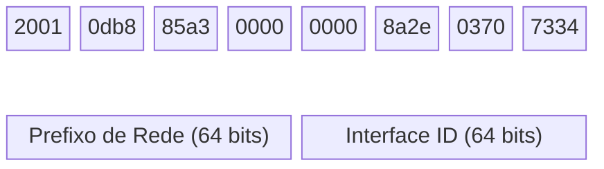
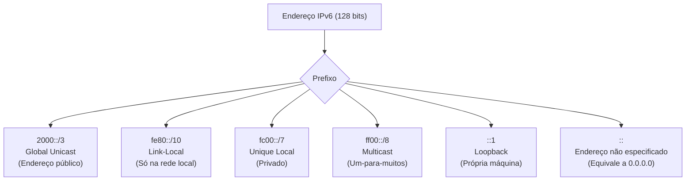
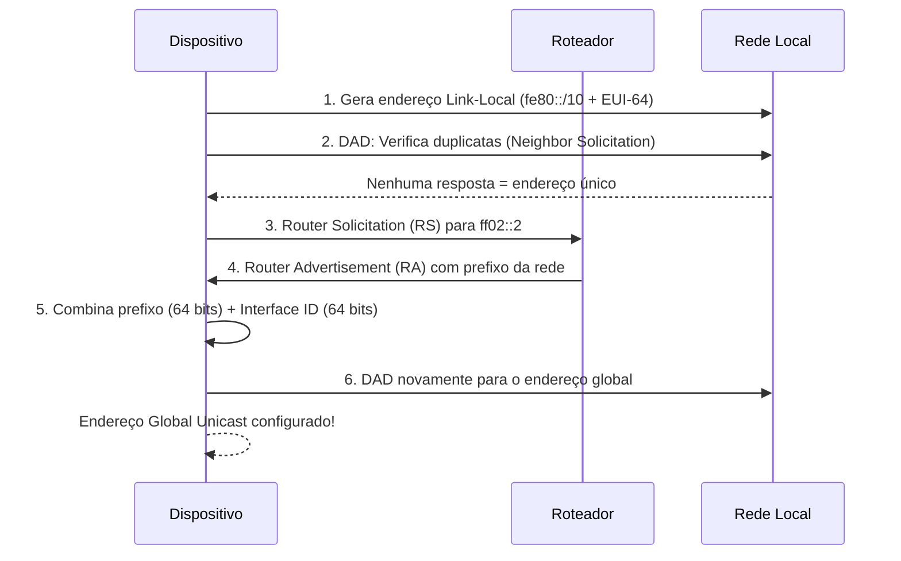

# Endereçamento IPv6

> [!quote] O Futuro da Internet
> *Com o esgotamento dos endereços IPv4, o IPv6 surge como a solução definitiva, oferecendo trilhões de endereços únicos para conectar todos os dispositivos do mundo.*

---

## 📖 Visão Geral

![[Recursos/Redes de Computadores/Endereçamento IPv6/comparativo-ipv4-ipv6.png|IPv6 Overview]]

> [!info] Por que IPv6?
> O IPv4 oferece aproximadamente 4,3 bilhões de endereços. Com a explosão de dispositivos conectados (IoT, smartphones, etc.), esses endereços se esgotaram. O IPv6 resolve esse problema com **340 undecilhões** de endereços possíveis.

---

## 📊 Comparativo IPv4 vs IPv6

| Característica | IPv4 | IPv6 |
|----------------|------|------|
| **Tamanho** | 32 bits | 128 bits |
| **Formato** | Decimal (192.168.0.1) | Hexadecimal (2001:db8::1) |
| **Endereços** | ~4,3 bilhões | ~340 undecilhões |
| **Configuração** | Manual/DHCP | Autoconfiguração (SLAAC) |
| **Segurança** | Opcional (IPSec) | Nativo (IPSec obrigatório) |
| **NAT** | Necessário | Desnecessário |
| **Broadcast** | Sim | Não (usa Multicast) |

---

## 🌍 Adoção Global do IPv6 (2025-2026)

> [!warning] Dado Histórico: Marco de 50%
> Em **28 de março de 2026**, o acesso via IPv6 nativo ultrapassou **50%** do tráfego global pela primeira vez. Isso marca um ponto de virada: o IPv6 deixou de ser "o futuro" e passou a ser o presente da internet.

### Adoção por País (Google IPv6 Statistics, 2026)

| País | Adoção IPv6 |
|------|-------------|
| 🇫🇷 França | ~73% |
| 🇮🇳 Índia | ~72% |
| 🇸🇦 Arábia Saudita | ~65% |
| 🇺🇸 Estados Unidos | ~50% |
| 🇧🇷 **Brasil** | ~50-54% |
| 🇪🇸 Espanha | ~10% |
| 🇪🇬 Egito | ~4% |

### Brasil: um destaque regional 🇧🇷

O Brasil atingiu cerca de **50% de adoção do IPv6** em 2025, sendo o segundo país com maior utilização na América Latina (atrás apenas do Uruguai). Em um ano, a participação do protocolo no tráfego medido pelo Registro.br passou de 50% para **54%**. Dados do NIC.br indicam que **98% dos sistemas autônomos (ASNs)** brasileiros já possuem alocação de bloco IPv6, incluindo mais de 95% dos provedores de pequeno e médio porte.

Em outubro de 2025, o Ministério da Gestão implementou IPv6 no **GOV.BR**, beneficiando mais de 160 sites do governo federal, o que representa um avanço relevante para a infraestrutura pública nacional.

> [!tip] Contexto para a aula
> Quando você se conecta hoje à internet pelo celular via 4G/5G, é muito provável que já esteja usando IPv6. As operadoras móveis são as maiores impulsionadoras dessa adoção no Brasil.

---

## 🎬 Recursos de Aprendizado

> [!success] Vídeos Recomendados

| Recurso | Link |
|---------|------|
| **IPv6 em português claro** | [YouTube](https://www.youtube.com/watch?v=_JbLr_C-HLk&t=10s) |
| **Como o IPv6 está mudando a Internet** | [YouTube](https://www.youtube.com/watch?v=H_a_woBKfpU) |

---

## 🔧 Ferramentas Úteis

> [!tip] Teste e Aprenda

| Ferramenta | Descrição | Link |
|------------|-----------|------|
| **Test your IPv6** | Verifica se sua conexão suporta IPv6 | [test-ipv6.com](https://test-ipv6.com/) |
| **IPv6.br** | Portal brasileiro sobre IPv6 | [ipv6.br](https://ipv6.br/) |
| **IPv6 Buddy** | Compressor/expansor de endereços IPv6 online | [ipv6buddy.com](https://www.ipv6buddy.com/) |
| **Online IP Calculator** | Calculadora de sub-redes IPv6 | [calculator.net/ip-subnet](https://www.calculator.net/ip-subnet-calculator.html) |
| **ip a / ipconfig** | Comando de terminal para ver endereços da máquina | (local) |

---

## 📝 Estrutura do Endereço IPv6

> [!info] Formato
> Um endereço IPv6 consiste em 8 grupos de 4 dígitos hexadecimais, separados por dois-pontos.

**Exemplo completo**: `2001:0db8:85a3:0000:0000:8a2e:0370:7334`

**Forma abreviada**: `2001:db8:85a3::8a2e:370:7334`

### Regras de Abreviação

1. Zeros à esquerda podem ser omitidos: `0db8` → `db8`
2. Grupos consecutivos de zeros podem ser substituídos por `::` (apenas uma vez)

### Diagrama: Anatomia de um Endereço IPv6



> [!note] Interpretação do diagrama
> Os primeiros 64 bits (grupos 1 a 4) identificam a **rede**. Os últimos 64 bits (grupos 5 a 8) identificam o **dispositivo** dentro dessa rede. Essa divisão fixa em 64+64 é uma das diferenças fundamentais em relação ao IPv4, que permite tamanhos variáveis de máscara.

### Diagrama: Tipos de Endereço por Prefixo



---

## 🔑 Tipos de Endereços IPv6

| Tipo | Prefixo | Uso |
|------|---------|-----|
| **Global Unicast** | 2000::/3 | Endereços públicos roteáveis |
| **Link-Local** | fe80::/10 | Comunicação local (não roteável) |
| **Unique Local** | fc00::/7 | Equivalente ao IP privado do IPv4 |
| **Multicast** | ff00::/8 | Comunicação um-para-muitos |
| **Loopback** | ::1 | Equivalente ao 127.0.0.1 |
| **Não especificado** | :: | Usado antes da configuração do endereço |

> [!info] Fim do Broadcast
> O IPv6 **elimina o broadcast**. Em vez de enviar pacotes para todos os dispositivos da rede (broadcast), ele usa **multicast** direcionado para grupos específicos. Isso reduz o tráfego desnecessário e melhora a eficiência da rede.

---

## ⚙️ Autoconfiguração: SLAAC e EUI-64

Uma das funcionalidades mais elegantes do IPv6 é a capacidade de um dispositivo **configurar seu próprio endereço automaticamente**, sem precisar de um servidor DHCP.

### O Processo SLAAC (Stateless Address Autoconfiguration)



### Como o EUI-64 Gera a Interface ID a partir do MAC

O EUI-64 transforma um endereço MAC de 48 bits em um identificador de 64 bits seguindo três passos:

1. **Inserir `FF:FE`** no meio do MAC address
2. **Inverter o 7º bit** (bit Universal/Local) do primeiro octeto

**Exemplo:**

| Etapa | Valor |
|-------|-------|
| MAC original | `00:1A:2B:3C:4D:5E` |
| Após inserir FF:FE | `00:1A:2B:FF:FE:3C:4D:5E` |
| Inverter 7º bit (00 → 02) | `02:1A:2B:FF:FE:3C:4D:5E` |
| Interface ID final | `021a:2bff:fe3c:4d5e` |

> [!warning] Privacidade e EUI-64
> Porque o EUI-64 embute o MAC address no IPv6, qualquer pessoa que monitore a rede pode **rastrear o dispositivo** entre redes diferentes (o MAC não muda). Por isso, sistemas operacionais modernos (Windows, Linux, Android, iOS) usam **endereços temporários e aleatórios** (RFC 4941 / RFC 8064) no lugar do EUI-64 puro. O EUI-64 ainda é amplamente usado em **roteadores e equipamentos de rede**, onde a estabilidade do endereço é importante.

---

## 🧩 Diferenças no Cabeçalho IPv6

O cabeçalho do IPv6 foi **simplificado** em relação ao IPv4, apesar do endereço ser quatro vezes maior. Isso melhora a eficiência no processamento por roteadores.

| Campo | IPv4 | IPv6 |
|-------|------|------|
| Comprimento do cabeçalho | Variável (20-60 bytes) | Fixo (40 bytes) |
| Campos totais | 12 | 8 |
| Fragmentação | Pelo roteador | Apenas pela origem |
| Checksum | Presente | Removido (delegado às camadas acima) |
| Opções | No cabeçalho | Em cabeçalhos de extensão separados |

> [!tip] Por que cabeçalho fixo?
> Com tamanho fixo de 40 bytes, roteadores podem processar pacotes IPv6 **muito mais rápido**, pois não precisam calcular o tamanho do cabeçalho a cada pacote. Isso é especialmente importante em backbones de alta velocidade (100 Gbps+).

---

## 🏃 Atividades Mão na Massa

> [!example] 🧪 Atividade 1: Teste a sua conexão IPv6
>
> **Objetivo:** Descobrir se a sua conexão atual suporta IPv6 e qual a qualidade desse suporte.
>
> **Passos:**
> 1. Abra o navegador e acesse **https://test-ipv6.com**
> 2. Aguarde o teste terminar (cerca de 30 segundos)
> 3. Anote a **nota** exibida (de 0 a 10) e o status de cada teste
> 4. Veja se aparece um endereço IPv6 real na seção "Seu endereço IPv6"
>
> **Resultado observável:** O site mostra uma nota de 0 a 10. Nota 10 = conexão IPv6 nativa completa. Nota 0 = sem IPv6, apenas IPv4. Compare sua nota com a dos colegas e discuta: quais operadoras/ISPs têm melhor suporte?
>
> **Bonus:** Se você estiver na rede do IFF, anote a nota e compare com a rede do celular (dados móveis). Qual tem melhor suporte IPv6?

---

> [!example] 🧪 Atividade 2: Encontre seu endereço IPv6 real
>
> **Objetivo:** Localizar os endereços IPv6 configurados na sua máquina e identificar os tipos (Link-Local vs Global Unicast).
>
> **No Windows (Prompt de Comando ou PowerShell):**
> ```
> ipconfig /all
> ```
> Procure por linhas com "IPv6 Address" e "Link-local IPv6 Address".
>
> **No Linux/macOS (Terminal):**
> ```
> ip -6 addr show
> ```
> ou
> ```
> ifconfig
> ```
>
> **No celular Android:** Configurações, Wi-Fi, toque na rede conectada, "Avançado" e procure por "Endereço IPv6".
>
> **Resultado observável:** Você verá pelo menos um endereço começando com `fe80::` (Link-Local, sempre presente). Se sua rede suporta IPv6, verá também um endereço começando com `2` ou `2001:` (Global Unicast). Identifique qual tipo é cada endereço encontrado com base na tabela de tipos desta aula.

---

> [!example] 🧪 Atividade 3: Comprimir e expandir endereços IPv6
>
> **Objetivo:** Praticar as regras de abreviação e verificar respostas com uma ferramenta online.
>
> **Ferramenta:** Acesse **https://www.ipv6buddy.com/** (campo "Compress/Expand IPv6 Address")
>
> **Parte A: Comprima os endereços abaixo manualmente e confira na ferramenta:**
>
> | Endereço completo | Sua resposta | Ferramenta confirma? |
> |-------------------|--------------|----------------------|
> | `2001:0db8:0000:0000:0000:0000:0000:0001` | | |
> | `fe80:0000:0000:0000:0a00:27ff:fe8e:d5b8` | | |
> | `0000:0000:0000:0000:0000:0000:0000:0001` | | |
>
> **Parte B: Expanda os endereços abaixo e confira:**
>
> | Endereço abreviado | Sua resposta | Ferramenta confirma? |
> |-------------------|--------------|----------------------|
> | `2001:db8::1` | | |
> | `::1` | | |
> | `ff02::1` | | |
>
> **Resultado observável:** Para cada endereço, a ferramenta mostra a forma comprimida e a expandida. Se sua resposta manual bater com a ferramenta, você dominou as regras. Atenção: o `::` só pode aparecer **uma vez** no endereço.

---

## 📚 IPv6 e o 5G: por que isso importa agora

O 5G e a IoT (Internet das Coisas) tornam o IPv6 indispensável. Com bilhões de dispositivos novos se conectando (sensores industriais, veículos autônomos, dispositivos médicos), o IPv4 simplesmente não comporta esse volume. No Brasil, as operadoras móveis já operam **100% em IPv6** em suas redes core 5G.

> [!info] Dado real: 5G e IPv6
> A arquitetura 5G Standalone (SA) foi projetada assumindo IPv6 como padrão. Dispositivos 5G obtêm endereços IPv6 nativos da operadora, sem NAT, o que reduz latência e melhora a qualidade de aplicações em tempo real como telemedicina e veículos conectados.

---

> [!note] 📚 Fontes (2026)
>
> - [The State of IPv6 Adoption in 2025 (DNS Made Easy)](https://dnsmadeeasy.com/resources/the-state-of-ipv6-adoption-in-2025-progress-pitfalls-and-pathways-forward)
> - [IPv6 Reaches Majority (50%+), Internet Society Pulse, abr. 2026](https://pulse.internetsociety.org/en/blog/2026/04/18-years-later-ipv6-reaches-majority/)
> - [IPv6 Surpasses IPv4 (Hogg Networking)](https://hoggnet.com/blogs/news/ipv6-surpasses-ipv4-becoming-the-most-popular-internet-protocol)
> - [A revolução silenciosa do IPv6 no Brasil: 50% de adoção (ipv6.br)](https://ipv6.br/post/a-revolucao-silenciosa-do-ipv6-no-brasil-50-de-adocao-alcancados/)
> - [Ministério da Gestão implementa IPv6 no GOV.BR (gov.br, out. 2025)](https://www.gov.br/gestao/pt-br/assuntos/noticias/2025/outubro/ministerio-da-gestao-implementa-ipv6-no-gov-br-e-beneficia-160-sites-do-governo-federal)
> - [NIC.br: IPv6 move 45%+ da Internet no Brasil](https://nic.br/noticia/na-midia/ipv6-move-45-da-internet-no-brasil-mas-faltam-roteadores-e-conteudos/)
> - [IPv6 SLAAC Autoconfiguration Explained (NetworkAcademy.IO)](https://www.networkacademy.io/ccna/ipv6/stateless-address-autoconfiguration-slaac)
> - [Google IPv6 Adoption Statistics](https://www.google.com/intl/en/ipv6/)
> - [IPv6 Deployment (Wikipedia)](https://en.wikipedia.org/wiki/IPv6_deployment)
