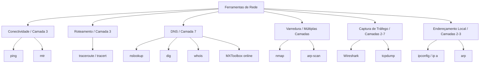

# Ferramentas de Rede

> [!quote] O Arsenal do Administrador
> *Conhecer as ferramentas certas é essencial para diagnosticar e resolver problemas de rede com eficiência.*

---

## 🐧 Linux no Windows (WSL)

> [!tip] Windows Subsystem for Linux
> O WSL permite rodar um ambiente Linux diretamente no Windows, ideal para usar ferramentas baseadas em Linux.

### Instalação do WSL

```powershell
# Abra o PowerShell como administrador
wsl --install
```

```powershell
# Caso haja problemas, instale uma distribuição específica
wsl --install ubuntu
```

> [!warning] Atenção
> É necessário reiniciar o Windows após a instalação para reconhecimento da máquina virtual.

### Atualização de Pacotes

```bash
sudo apt update && sudo apt install programa_que_voce_quer
```

---

## 🔧 Ferramentas de Diagnóstico

> [!info] Visão Geral
> As ferramentas de diagnóstico de rede são usadas para identificar problemas de conectividade, medir desempenho, rastrear rotas de pacotes e verificar configurações. Elas formam o núcleo do trabalho diário de qualquer administrador de redes.

### Mapa: Ferramenta por Camada OSI e Finalidade



---

### Ping

> [!info] Teste de Conectividade
> Verifica se um host está ativo e mede o tempo de resposta usando mensagens ICMP Echo Request e Echo Reply. É a primeira ferramenta a usar quando suspeita de problema de conectividade.

```powershell
# Windows: envia 4 pacotes por padrão
ping google.com
```

```bash
# Linux: envia continuamente até Ctrl+C
ping google.com

# Linux: limitar a 4 pacotes (comportamento igual ao Windows)
ping -c 4 google.com
```

| Função | Descrição |
|--------|-----------|
| **Verificar atividade** | Confirma se um IP ou hostname está respondendo |
| **Medir latência** | Mostra o tempo de ida e volta do pacote (RTT, em ms) |
| **Detectar perda de pacotes** | Informa quantos pacotes foram enviados vs. recebidos |
| **Testar resolução DNS** | Ao usar um nome de domínio, também confirma que o DNS funciona |

> [!tip] Interpretando a Saída
> Na saída do ping, procure por: `time=` (latência em ms), `TTL=` (saltos restantes até expirar) e `% packet loss` (perda de pacotes). Latência abaixo de 50 ms é boa para redes locais; acima de 200 ms já indica problemas.

![[Recursos/Redes de Computadores/Ferramentas de rede/comando-ping-windows.png|Exemplo de ping]]

---

> [!example] 🧪 Atividade: Analisando Conectividade com Ping
> **Objetivo:** Medir latência e identificar perda de pacotes para dois destinos distintos.
>
> **Passo 1:** Execute os dois comandos abaixo e compare as saídas:
> ```bash
> ping -c 4 google.com
> ping -c 4 www.iff.edu.br
> ```
>
> **Resultado Observável:** Para cada comando você verá 4 linhas com `icmp_seq=1`, `icmp_seq=2`, etc., cada uma mostrando `time=XX ms`. Ao final, uma linha de estatísticas: `4 packets transmitted, 4 received, 0% packet loss`. Anote a latência média (`avg`) de cada destino e responda: qual dos dois está mais próximo geograficamente? Qual tem maior variação de latência (diferença entre `min` e `max`)?

---

### Traceroute / Tracert

> [!info] Rastreamento de Rota
> Mostra o caminho que os pacotes percorrem até o destino, listando cada roteador (hop) intermediário com sua latência. Usa pacotes com TTL crescente: o primeiro pacote tem TTL=1 e expira no primeiro roteador, forçando-o a responder com uma mensagem ICMP Time Exceeded, revelando seu endereço IP.

```powershell
# Windows
tracert www.iff.edu.br
```

```bash
# Linux
traceroute www.iff.edu.br

# Linux: usar TCP em vez de UDP (útil quando UDP é bloqueado por firewall)
traceroute -T www.iff.edu.br
```

| Coluna na Saída | Significado |
|-----------------|-------------|
| **Número do hop** | Posição do roteador na rota (1 = mais próximo de você) |
| **Latência (3 medições)** | Tempo de ida e volta em cada tentativa (ms) |
| **Endereço IP / hostname** | Identificação do roteador naquele salto |
| **`* * *`** | Roteador não responde (timeout, possivelmente bloqueado por firewall) |

> [!tip] Uso Prático
> Identifica onde estão ocorrendo atrasos ou perdas na rota até um servidor. Se os primeiros hops são rápidos e de repente um deles tem latência alta, o problema está naquele trecho da rede.

---

### MTR (My Traceroute)

> [!info] Traceroute Contínuo e Interativo
> O MTR combina as funcionalidades do `ping` e do `traceroute` em uma única ferramenta, atualizando as estatísticas em tempo real. Ele revela não apenas a rota, mas também a perda de pacotes e variação de latência (jitter) em cada hop ao longo do tempo, algo que o traceroute tradicional não faz por ser uma captura única.

```bash
# Linux: instalar e usar
sudo apt install mtr
mtr google.com
```

```powershell
# Windows: baixar WinMTR (https://winmtr.net/)
# Após instalação, abrir o programa e digitar o hostname no campo Host
```

| Coluna na Saída do MTR | Significado |
|------------------------|-------------|
| **Host** | IP ou hostname do roteador naquele hop |
| **Loss%** | Percentual de perda de pacotes naquele ponto |
| **Snt** | Total de pacotes enviados |
| **Last** | Latência do último pacote enviado |
| **Avg** | Latência média |
| **Best / Wrst** | Melhor e pior latência registrada |
| **StDev** | Desvio padrão (variação, ou jitter) |

> [!tip] Vantagem sobre o Traceroute
> O MTR é superior ao `traceroute` para diagnóstico de problemas intermitentes, pois monitora continuamente. Um hop com `Loss%` alto mas hops subsequentes sem perda geralmente indica que aquele roteador simplesmente não responde a ICMP (prioridade baixa), não que seja o causador do problema.

---

### Whois

> [!info] Consulta de Registro de Domínio
> Obtém informações sobre o proprietário de um domínio ou IP: quem registrou, quando, quando expira e quais os servidores DNS autoritativos. Útil para rastrear a origem de um IP suspeito ou verificar registros de um domínio.

```bash
whois iff.edu.br
```

```bash
# Consulta por IP (descobrir o dono do bloco de endereços)
whois 200.137.64.1
```

| Informação | Descrição |
|------------|-----------|
| **Registrante** | Nome do proprietário do domínio |
| **Contato** | Email/telefone de administração |
| **Datas** | Criação e expiração do registro |
| **Name Servers** | Servidores DNS autoritativos do domínio |
| **Status** | Estado atual do registro (ativo, em quarentena, etc.) |

🔗 [Whois Registro.br](https://registro.br/tecnologia/ferramentas/whois/)

---

### Nmap

> [!info] Scanner de Rede
> Descobre hosts e serviços ativos em uma rede, identifica portas abertas, detecta versões de serviços e sistemas operacionais. É a ferramenta de varredura de rede mais usada no mundo, tanto por administradores para inventário quanto por equipes de segurança para auditorias.

> [!warning] Uso Legal e Ético
> Usar o Nmap em redes ou sistemas sem autorização explícita do responsável é crime no Brasil, tipificado no **Art. 154-A do Código Penal** (Lei 12.737/2012, conhecida como "Lei Carolina Dieckmann"). A pena prevista é de 1 a 4 anos de reclusão mais multa. **Use sempre apenas em: sua própria rede, seu próprio computador, ou o alvo autorizado `scanme.nmap.org`** (servidor mantido pelo projeto Nmap especificamente para testes educacionais).

```bash
# Ping sweep: descobre hosts ativos na rede sem escanear portas
nmap -sn 192.168.1.0/24

# Scan básico de portas no alvo autorizado para testes
nmap scanme.nmap.org

# Descobrir serviços e versões nas portas abertas
nmap -sV scanme.nmap.org

# Scan nas portas mais comuns com detecção de SO (requer root/admin)
sudo nmap -A scanme.nmap.org

# Escanear a própria máquina (sempre autorizado)
nmap localhost
```

> [!tip] Como Funciona
> Com o parâmetro `-sn`, o Nmap envia:
> - Pacotes ICMP Echo Requests (ping)
> - Pacotes TCP com flag SYN para porta 443
> - Pacotes ARP para redes locais

| Parâmetro | Função |
|-----------|--------|
| `-sn` | Ping sweep (sem varredura de portas) |
| `-sV` | Detecta versão dos serviços nas portas abertas |
| `-A` | Agressivo: SO + versão + scripts + traceroute |
| `-p 80,443` | Escaneia apenas as portas especificadas |
| `-p 1-1024` | Escaneia faixa de portas |
| `-oN saida.txt` | Salva resultado em arquivo de texto |

**Estados de porta reportados pelo Nmap:**
- **open:** porta aceitando conexões (serviço ativo)
- **closed:** porta acessível, mas sem serviço escutando
- **filtered:** firewall ou filtro impedindo o acesso (sem resposta)

---

> [!example] 🧪 Atividade: Varredura no Alvo Autorizado scanme.nmap.org
> **Objetivo:** Descobrir quais portas e serviços estão ativos no servidor de testes do Nmap.
>
> **Passo 1:** Execute o scan básico:
> ```bash
> nmap scanme.nmap.org
> ```
>
> **Passo 2:** Execute o scan com detecção de versão:
> ```bash
> nmap -sV scanme.nmap.org
> ```
>
> **Resultado Observável:** O primeiro comando retorna uma tabela com colunas `PORT`, `STATE`, `SERVICE`, listando portas abertas como `22/tcp open ssh` e `80/tcp open http`. O segundo comando adiciona a coluna `VERSION`, mostrando por exemplo `OpenSSH 6.6.1p1 Ubuntu` ou `Apache httpd 2.4`. Anote todas as portas abertas encontradas e pesquise para que serve cada serviço listado.
>
> **Reflexão Técnica:** Por que o servidor `scanme.nmap.org` deixa a porta 22 (SSH) aberta? Quais riscos isso representa e como o administrador pode mitigá-los?

---

### NSLookup / DNSLookup

> [!info] Consulta DNS
> Resolve nomes de domínio para endereços IP e vice-versa, além de consultar registros específicos de DNS como MX (email), TXT (SPF/DMARC), CNAME (alias) e NS (servidores autoritativos). É a ferramenta padrão de diagnóstico de DNS disponível em todos os sistemas operacionais.

```powershell
# Consulta básica: resolve o nome para IP
nslookup www.uenf.br
```

```powershell
# Consultar registro MX (servidores de email do domínio)
nslookup -type=MX iff.edu.br
```

```powershell
# Usar um servidor DNS específico (ex: DNS público do Google)
nslookup www.iff.edu.br 8.8.8.8
```

```bash
# Linux: alternativa mais detalhada com dig
dig www.iff.edu.br
dig MX iff.edu.br
dig TXT iff.edu.br
```

| Tipo de Registro | O que revela |
|------------------|-------------|
| **A** | Endereço IPv4 associado ao nome |
| **AAAA** | Endereço IPv6 associado ao nome |
| **MX** | Servidor de email responsável pelo domínio |
| **CNAME** | Alias: nome que aponta para outro nome |
| **TXT** | Texto livre, usado para SPF e DMARC (anti-spam) |
| **NS** | Servidores DNS autoritativos do domínio |

> [!tip] Uso Prático
> Encontra o endereço IP associado a um site, diagnostica problemas de DNS (nome não resolve), verifica se registros MX estão corretos (problemas de recebimento de email) e confere se um DNS está propagado após uma mudança.

---

> [!example] 🧪 Atividade: Diagnóstico DNS com Ferramentas de Linha de Comando e Online
> **Objetivo:** Investigar a infraestrutura DNS de dois domínios distintos usando `nslookup` e a ferramenta online MXToolbox.
>
> **Parte 1: Linha de Comando**
> Execute os comandos abaixo e registre os resultados:
> ```powershell
> nslookup iff.edu.br
> nslookup -type=MX iff.edu.br
> nslookup -type=NS iff.edu.br
> ```
>
> **Parte 2: Ferramenta Online**
> Acesse [https://mxtoolbox.com/SuperTool.aspx](https://mxtoolbox.com/SuperTool.aspx), digite `iff.edu.br` no campo e escolha "MX Lookup". Depois repita com `uenf.br`.
>
> **Resultado Observável:** O `nslookup` retorna linhas como `Address: 200.137.64.X` (IP do servidor) e, para MX, `mail exchanger = 10 mail.iff.edu.br`. O MXToolbox exibe uma tabela com os registros MX em ordem de prioridade, indicando se estão respondendo corretamente (ícone verde) ou com problemas (ícone vermelho). Compare os resultados: são os mesmos? A prioridade MX mais baixa numericamente é o servidor preferencial.

---

### Wireshark

> [!info] Analisador de Protocolos
> Captura e exibe pacotes de dados em tempo real, decodificando centenas de protocolos de rede. Permite ver exatamente o que trafega na rede: cabeçalhos, payloads, handshakes TCP, requisições HTTP, respostas DNS, e muito mais. É a ferramenta definitiva para análise profunda de protocolos.

```bash
# Instalar no Linux
sudo apt install wireshark

# Capturar tráfego da interface eth0 (requer permissões)
sudo wireshark
```

**Filtros de captura mais usados no Wireshark:**

| Filtro | O que mostra |
|--------|-------------|
| `ip.addr == 8.8.8.8` | Apenas pacotes de/para o IP especificado |
| `tcp.port == 80` | Apenas tráfego HTTP (porta 80) |
| `dns` | Apenas consultas e respostas DNS |
| `icmp` | Apenas pacotes ICMP (ping) |
| `http` | Apenas tráfego HTTP (como protocolo) |
| `tcp.flags.syn == 1` | Apenas pacotes de início de conexão TCP (SYN) |

| Função | Descrição |
|--------|-----------|
| **Captura** | Grava todo o tráfego de uma interface de rede |
| **Filtros** | Isola protocolos, IPs ou portas específicos em tempo real |
| **Análise** | Visualiza cada campo de cada cabeçalho de protocolo |
| **Follow Stream** | Reconstrói a conversa completa de uma conexão TCP |
| **Salvar .pcap** | Exporta a captura para análise posterior |

> [!warning] Uso Ético e Legal
> Use o Wireshark apenas em redes sobre as quais você tem autorização explícita de análise. Capturar pacotes de terceiros sem autorização é crime (Art. 154-A do Código Penal). Em ambiente de laboratório, capture apenas o tráfego gerado pela sua própria máquina.

---

### tcpdump

> [!info] Captura de Pacotes em Linha de Comando
> O `tcpdump` é o equivalente ao Wireshark para uso em terminal, ideal para servidores sem interface gráfica. Captura pacotes diretamente da interface de rede e exibe ou salva para análise posterior. É possível capturar com tcpdump e abrir o arquivo resultante no Wireshark para visualização gráfica.

```bash
# Instalar
sudo apt install tcpdump

# Listar interfaces de rede disponíveis
tcpdump -D

# Capturar tráfego da interface eth0 (mostrar na tela)
sudo tcpdump -i eth0

# Filtrar apenas tráfego DNS (porta 53)
sudo tcpdump -i eth0 port 53

# Capturar apenas pacotes de/para um IP específico
sudo tcpdump -i eth0 host 8.8.8.8

# Salvar captura em arquivo para análise no Wireshark
sudo tcpdump -i eth0 -w captura.pcap
```

| Parâmetro | Função |
|-----------|--------|
| `-i eth0` | Define a interface a capturar |
| `-n` | Não resolve nomes (mostra IPs, mais rápido) |
| `-v` ou `-vv` | Aumenta o detalhe na saída |
| `-c 100` | Para após capturar 100 pacotes |
| `-w arquivo.pcap` | Salva para arquivo |
| `-r arquivo.pcap` | Lê de um arquivo salvo |

---

### ipconfig / ip addr

> [!info] Configuração de Interface de Rede
> Exibe as configurações atuais das interfaces de rede do computador: endereço IP, máscara de sub-rede, gateway padrão e endereço MAC. É o ponto de partida para qualquer diagnóstico de rede local.

```powershell
# Windows: exibe configuração resumida
ipconfig

# Windows: exibe tudo, incluindo DNS e MAC
ipconfig /all

# Windows: liberar e renovar IP via DHCP
ipconfig /release
ipconfig /renew

# Windows: limpar cache DNS local
ipconfig /flushdns
```

```bash
# Linux (moderno): exibir todas as interfaces e endereços
ip addr show
# Ou o alias curto:
ip a

# Linux: exibir apenas uma interface específica
ip addr show eth0

# Linux: ver tabela de roteamento
ip route show
```

| Campo na Saída | Significado |
|----------------|-------------|
| **IPv4 Address** | Seu endereço IP na rede local |
| **Subnet Mask** | Define o tamanho da rede local |
| **Default Gateway** | IP do roteador para saída para a internet |
| **DNS Servers** | Servidores usados para resolver nomes de domínio |
| **Physical Address / ether** | Endereço MAC da interface (identificador único de hardware) |

---

> [!example] 🧪 Atividade: Mapeando Sua Própria Configuração de Rede
> **Objetivo:** Coletar e interpretar as informações de rede da sua máquina e traçar o caminho até a internet.
>
> **Passo 1:** Execute o comando de configuração de rede:
> ```powershell
> # Windows
> ipconfig /all
> ```
> ```bash
> # Linux
> ip a && ip route show
> ```
>
> **Passo 2:** Com o IP do gateway que você encontrou, execute o traceroute:
> ```powershell
> # Substitua 192.168.1.1 pelo gateway da sua rede
> tracert 192.168.1.1
> tracert 8.8.8.8
> ```
>
> **Resultado Observável:** O `ipconfig /all` (ou `ip a`) lista cada interface com seu IP, máscara, gateway e servidores DNS. O `tracert 8.8.8.8` mostra tipicamente entre 8 e 20 hops: os primeiros são dentro da sua rede local (latência abaixo de 5 ms), depois passam pelos roteadores do provedor de internet, e finalmente chegam nos servidores do Google. Documente: quantos hops totais? Em qual hop a latência deu um salto grande?

---

### Arp-scan

> [!info] Scanner ARP
> Lista dispositivos na rede local usando o protocolo ARP (Address Resolution Protocol). O ARP opera na camada 2 (enlace), portanto descobre todos os dispositivos na mesma rede local, incluindo aqueles que bloqueiam ping (ICMP). Retorna o endereço IP e o endereço MAC de cada dispositivo encontrado.

```bash
# Instalar
sudo apt install arp-scan

# Escanear a rede local inteira (detecta automaticamente a interface e a sub-rede)
sudo arp-scan -l

# Escanear uma rede específica via uma interface específica
sudo arp-scan --interface=eth0 192.168.1.0/24
```

| Campo na Saída | Significado |
|----------------|-------------|
| **IP** | Endereço IPv4 do dispositivo encontrado |
| **MAC** | Endereço físico (hardware) da interface de rede |
| **Fabricante** | Nome do fabricante identificado pelo prefixo do MAC (OUI) |

> [!tip] Diferença do Nmap
> O `arp-scan` é mais rápido e confiável que `nmap -sn` para descoberta na rede local porque o ARP não pode ser bloqueado por firewalls na mesma sub-rede (diferente do ICMP). Se um dispositivo está na rede local, o ARP encontra.

---

### Aircrack-ng

> [!info] Suite para Redes Sem Fio
> Conjunto de ferramentas para auditoria de redes Wi-Fi. Inclui utilitários para captura de pacotes wireless, análise de protocolos de autenticação e testes de segurança em redes sem fio 802.11. Deve ser usado exclusivamente em redes próprias ou com autorização expressa do responsável.

---

### WiGLE

> [!info] Mapeamento de Redes Wi-Fi
> Banco de dados colaborativo de redes sem fio ao redor do mundo. Permite visualizar a distribuição geográfica de redes Wi-Fi, verificar se uma rede está no banco de dados e contribuir com dados de wardriving.

🔗 [WiGLE: Wireless Network Mapping](https://www.wigle.net/)

---

## 🛠️ Outras Ferramentas

> [!tip] Arsenal Adicional
> Além das ferramentas interativas abordadas acima, o ecossistema de redes conta com utilitários especializados para cenários específicos de análise, monitoramento e geração de tráfego.

| Ferramenta | Tipo | Descrição |
|------------|------|-----------|
| **Netcat** | Utilitário | Leitura/escrita de dados via conexões de rede TCP/UDP; chamado de "canivete suíço" do networking |
| **tcpdump** | Sniffer | Analisador de pacotes em linha de comando, ideal para servidores sem interface gráfica |
| **NetFlow/Sflow** | Análise | Coleta e análise de fluxo de tráfego para monitoramento de consumo por aplicação |
| **EtherApe** | Gráfico | Monitoramento visual de rede com representação em grafo dos fluxos ativos |
| **Ostinato** | Gerador | Gerador de tráfego e analisador de protocolos para testes de carga e estresse |
| **Network Miner** | Forense | Análise forense de tráfego: extrai arquivos, senhas e dados de capturas .pcap |
| **Kismet** | Wireless | Detector e sniffer de redes sem fio passivo (modo monitor) |
| **dig** | DNS | Alternativa ao nslookup no Linux, com saída mais completa e controle granular |
| **ss / netstat** | Sockets | Lista conexões ativas, portas em escuta e processos associados na máquina local |
| **curl / wget** | HTTP | Testa requisições HTTP/HTTPS pela linha de comando, útil para diagnosticar APIs e sites |

---

## ⚠️ Marco Legal: Uso Responsável das Ferramentas

> [!warning] Art. 154-A do Código Penal Brasileiro (Lei 12.737/2012)
> A Lei 12.737, de novembro de 2012, conhecida como "Lei Carolina Dieckmann", tipificou como crime a **invasão de dispositivo informático**:
>
> *"Invadir dispositivo informático alheio, conectado ou não à rede de computadores, mediante violação indevida de mecanismo de segurança e com o fim de obter, adulterar ou destruir dados ou informações sem autorização expressa ou tácita do titular do dispositivo ou instalar vulnerabilidades para obter vantagem ilícita."*
>
> **Pena:** Reclusão de 1 a 4 anos, mais multa. A pena aumenta de 1/3 a 2/3 se resultar em dano econômico, e pode aumentar mais ainda se dados confidenciais forem obtidos.
>
> **Regra prática:** Só execute scans, capturas ou testes em sistemas para os quais você tem autorização explícita. Varreduras não autorizadas em redes de terceiros configuram o crime previsto neste artigo, mesmo que sem intenção de causar dano.

---

## 📊 Resumo de Comandos

> [!success] Quick Reference

| Comando | Sistema | Função |
|---------|---------|--------|
| `ping [host]` | Win/Linux | Testa conectividade e mede latência |
| `ping -c 4 [host]` | Linux | Ping com 4 pacotes (equivale ao Windows) |
| `tracert [host]` | Windows | Rastreia rota hop a hop |
| `traceroute [host]` | Linux | Rastreia rota hop a hop |
| `mtr [host]` | Linux | Traceroute contínuo com estatísticas em tempo real |
| `nslookup [host]` | Win/Linux | Consulta DNS básica |
| `nslookup -type=MX [dom]` | Win/Linux | Consulta registros MX (servidores de email) |
| `dig [host]` | Linux | Consulta DNS detalhada |
| `nmap -sn [rede]` | Linux | Descoberta de hosts ativos (ping sweep) |
| `nmap [host]` | Linux | Scan de portas abertas |
| `nmap -sV [host]` | Linux | Scan + detecção de versões de serviços |
| `arp-scan -l` | Linux | Lista dispositivos na rede local via ARP |
| `whois [domínio]` | Linux | Info de registro do domínio |
| `ipconfig /all` | Windows | Exibe configuração completa de rede |
| `ip addr show` ou `ip a` | Linux | Exibe interfaces e endereços IP |
| `ip route show` | Linux | Exibe tabela de rotas |
| `tcpdump -i eth0` | Linux | Captura pacotes da interface em tempo real |
| `tcpdump -w arq.pcap` | Linux | Salva captura para análise no Wireshark |

---

## 🌐 Ferramentas Online

> [!info] Diagnóstico Sem Instalar Nada
> Quando não for possível usar ferramentas locais, estas plataformas online oferecem diagnóstico DNS, verificação de lista negra e rastreamento de rotas diretamente no navegador.

| Ferramenta | URL | Função Principal |
|------------|-----|-----------------|
| **MXToolbox SuperTool** | [mxtoolbox.com/SuperTool.aspx](https://mxtoolbox.com/SuperTool.aspx) | DNS, MX, blacklist, ping, traceroute online |
| **DNSChecker** | [dnschecker.org](https://dnschecker.org) | Propagação de DNS em múltiplos servidores ao redor do mundo |
| **Whois Registro.br** | [registro.br/tecnologia/ferramentas/whois](https://registro.br/tecnologia/ferramentas/whois/) | WHOIS de domínios .br |
| **WiGLE** | [wigle.net](https://www.wigle.net/) | Mapeamento global de redes Wi-Fi |

---

> [!note] 📚 Fontes (2026)
> - [Ping e Traceroute: Ferramentas de Diagnóstico de Redes](https://conceitos.tech/redes-e-infraestrutura/testes-e-diagnostico/ping-e-traceroute/) - conceitos.tech
> - [NMAP Network Scanning: um guia completo para iniciantes](https://www.tracenetsolutions.com/2025/04/04/nmap-network-scanning-um-guia-completo-para-iniciantes/) - TraceNet Solutions (2025)
> - [Nmap para Iniciantes: Escaneamento de Redes](https://hispy.io/blog/nmap-para-iniciantes-escaneamento-de-redes-na-investigacao-digital) - HI SPY (2025)
> - [O Que é MTR? Teste Sua Rede No Windows, Linux e Mac](https://serversp.com.br/blog/informacoes/mtr-teste-rede-windows-linux/) - ServerSP
> - [What Is MTR? (Cloudflare Learning)](https://www.cloudflare.com/learning/network-layer/what-is-mtr/) - Cloudflare
> - [MXToolbox SuperTool: Network Tools DNS, IP, Email](https://mxtoolbox.com/SuperTool.aspx) - MXToolbox
> - [DNSChecker: DNS Propagation Check](https://dnschecker.org) - DNSChecker
> - [The Ultimate tcpdump Cheat Sheet 2026](https://www.stationx.net/tcpdump-cheat-sheet/) - StationX
> - [tcpdump Cheatsheet](https://linuxize.com/cheatsheet/tcpdump/) - Linuxize (atualizado mar/2026)
> - [Art. 154-A do Código Penal: Crime de Invasão de Dispositivo Informático](https://www.jusbrasil.com.br/artigos/crime-de-invasao-de-dispositivo-informatico-artigo-154-a-cp/153070617) - Jusbrasil
> - [Comandos Linux para Análise de Redes por Camada OSI](https://esli.blog/posts/comandos-linux-para-analise-de-redes-guia-completo-por-camada-da-tabela-osi/) - esli.blog
