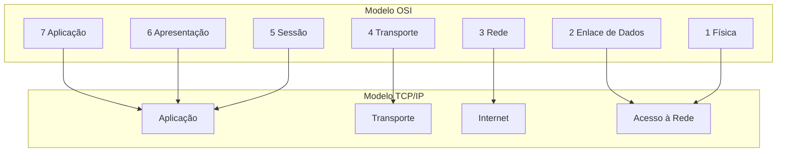
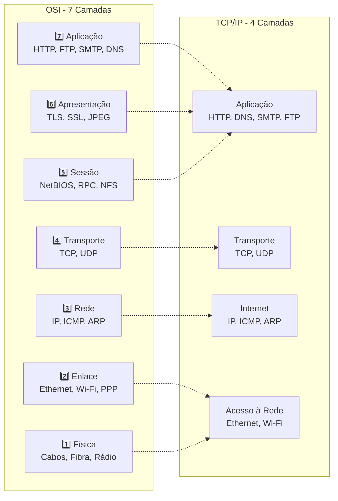
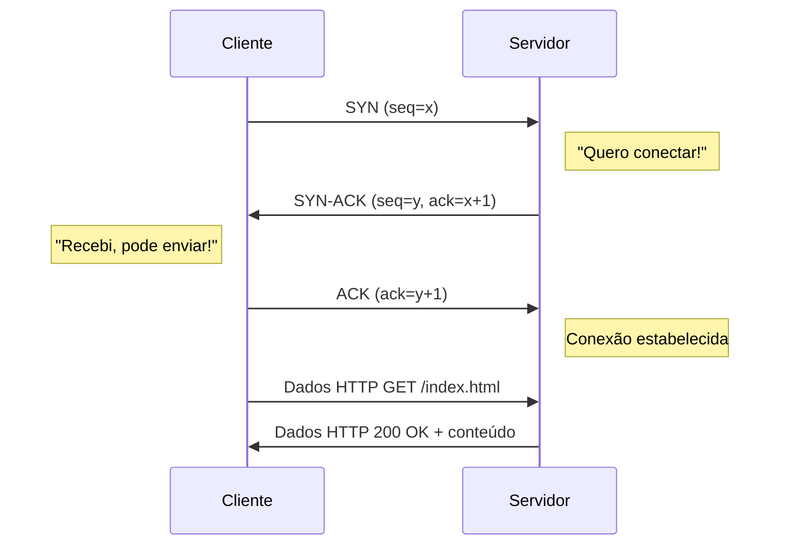
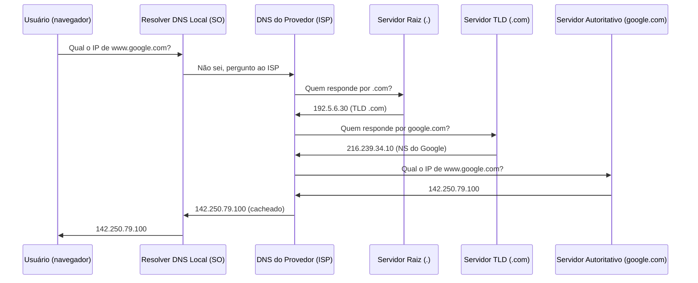
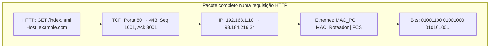

# Modelos OSI e TCP/IP

> [!quote] Fundamentos da Comunicação em Rede
> *Entender os modelos OSI e TCP/IP é essencial para compreender como os dados trafegam pela rede, desde a aplicação até o meio físico.*

---

## 🌐 Modelo OSI (Open Systems Interconnection)

> [!info] Modelo Conceitual
> O modelo OSI é um modelo **conceitual** usado para entender e descrever como diferentes aplicações e protocolos de rede interagem e se comunicam entre si.

![[Recursos/Redes de Computadores/Modelos OSI e TCP IP/modelo-osi-7-camadas.png|Modelo OSI]]

### 📊 As Sete Camadas do Modelo OSI

| Camada | Nome | Função | Protocolos/Exemplos |
|--------|------|--------|---------------------|
| **7** | Aplicação | Interface com o usuário e serviços de rede | HTTP, FTP, SMTP |
| **6** | Apresentação | Tradução, criptografia e compressão | SSL, TLS |
| **5** | Sessão | Gerencia conexões entre aplicações | NFS, NetBIOS, RPC |
| **4** | Transporte | Entrega confiável de dados | TCP, UDP |
| **3** | Rede | Endereçamento e roteamento | IP, ICMP |
| **2** | Enlace de Dados | Transferência confiável entre dispositivos | Ethernet, PPP |
| **1** | Física | Transmissão de bits brutos | Cabos, Wi-Fi, Fibra |

---

### 🔍 Detalhamento das Camadas

> [!tip] Camada 1: Física
> - **Função**: Transmissão e recepção de bits brutos através de um meio físico
> - **Exemplos**: Cabos Ethernet, fibra óptica, Wi-Fi
> - **Utilização**: Transmite dados como sinais elétricos, ópticos ou de rádio

> [!tip] Camada 2: Enlace de Dados
> - **Função**: Transferência confiável entre dois dispositivos conectados diretamente
> - **Exemplos**: Ethernet, PPP
> - **Utilização**: Controla formatação para transmissão e acesso ao meio físico

> [!tip] Camada 3: Rede
> - **Função**: Endereçamento, roteamento e encaminhamento de pacotes
> - **Exemplos**: IP, ICMP
> - **Utilização**: Define rotas para enviar pacotes entre redes diferentes

> [!tip] Camada 4: Transporte
> - **Função**: Transmissão confiável e controle de fluxo entre pontos finais
> - **Exemplos**: TCP, UDP
> - **Utilização**: Garante entrega sem erros e na sequência correta

> [!tip] Camada 5: Sessão
> - **Função**: Gerencia sessões de comunicação entre dispositivos
> - **Exemplos**: NFS, NetBIOS, RPC
> - **Utilização**: Estabelece e gerencia conexões entre máquinas

> [!tip] Camada 6: Apresentação
> - **Função**: Tradução de dados entre formatos de rede e aplicação
> - **Exemplos**: SSL, TLS
> - **Utilização**: Criptografa dados e traduz diferentes formatos

> [!tip] Camada 7: Aplicação
> - **Função**: Interface entre o usuário e os serviços de rede
> - **Exemplos**: HTTP, FTP, SMTP
> - **Utilização**: Fornece interfaces para navegadores, email, etc.

![[Recursos/Redes de Computadores/Modelos OSI e TCP IP/modelo-osi-pdu-protocolos.png|Fluxo de dados no modelo OSI]]

📺 [Vídeo: Modelo OSI](https://www.youtube.com/watch?v=7sW8CXVx7IU)

---

## 🌍 Modelo TCP/IP

> [!info] Modelo Prático
> O modelo TCP/IP (Transmission Control Protocol/Internet Protocol) é o conjunto de protocolos usado para interconectar dispositivos na Internet. É mais prático que o OSI, com menos camadas.

![[Recursos/Redes de Computadores/Modelos OSI e TCP IP/comparativo-osi-tcpip.png|Modelo TCP/IP]]

### 📊 As Quatro Camadas do TCP/IP

| Camada | Função | Protocolos |
|--------|--------|------------|
| **Aplicação** | Comunicação de alto nível | HTTP, HTTPS, FTP, SMTP, DNS |
| **Transporte** | Gerencia transmissão entre sistemas | TCP, UDP |
| **Internet** | Roteamento de pacotes | IP, ICMP, ARP |
| **Acesso à Rede** | Transmissão física dos dados | Ethernet, Wi-Fi, PPP |

---

### 🔄 Comparativo OSI vs TCP/IP

![[Recursos/Redes de Computadores/Modelos OSI e TCP IP/encapsulamento-dados-camadas.png|Encapsulamento de dados]]

| Aspecto | Modelo OSI | Modelo TCP/IP |
|---------|-----------|---------------|
| **Camadas** | 7 camadas | 4 camadas |
| **Natureza** | Teórico/Conceitual | Prático |
| **Uso** | Referência educacional | Internet real |
| **Protocolos** | Independente | Suite específica |

> [!success] Exemplo Prático
> Use o Wireshark para visualizar as camadas do modelo TCP/IP em ação durante uma captura de pacotes.

---

## 📡 Protocolos de Rede

![[Recursos/Redes de Computadores/Modelos OSI e TCP IP/protocolos-por-camada-tcpip.png|Protocolos por camada]]

> [!info] Definição
> Os protocolos de rede definem regras e convenções para a comunicação entre dispositivos. Cada um tem uma função específica.

### 📋 Principais Protocolos

| Protocolo | Descrição |
|-----------|-----------|
| **HTTP/HTTPS** | Transferência de documentos web (seguro com HTTPS) |
| **FTP/SFTP** | Transferência de arquivos (seguro com SFTP) |
| **TCP** | Protocolo orientado à conexão, entrega confiável |
| **UDP** | Protocolo de datagramas, mais rápido, sem garantia |
| **IP** | Encaminhamento de pacotes através de redes |
| **ICMP** | Relatórios de erros e informações operacionais |
| **SSH** | Gerenciamento seguro de sistemas remotos |
| **Telnet** | Interação com servidores remotos (inseguro) |
| **SMTP** | Transferência de e-mails entre servidores |
| **POP3/IMAP** | Recuperação de mensagens de e-mail |
| **DNS** | Tradução de nomes de domínio para IPs |
| **DHCP** | Atribuição automática de endereços IP |
| **ARP** | Mapeamento de IP para endereço MAC |
| **RDP** | Conexão e controle de desktop remoto |

---

## 🔬 Exemplos Práticos

### 1️⃣ Camada de Aplicação: Transferência FTP/SSH

> [!tip] Objetivo
> Transferir um arquivo usando FTP ou SSH.

**Via SSH (SCP):**

```bash
# Enviar arquivo para servidor
scp /caminho/local/arquivo usuario@servidor:/caminho/remoto/destino

# Baixar arquivo do servidor
scp usuario@servidor:/caminho/remoto/arquivo /caminho/local/destino
```

---

### 2️⃣ Camada de Transporte: Netcat

> [!tip] Objetivo
> Criar uma conexão TCP simples entre dois computadores.

```bash
# No servidor (escutar na porta 1234)
nc -l 1234

# No cliente (conectar ao servidor)
nc [IP do Servidor] 1234
```

> [!success] Resultado
> As mensagens digitadas em um terminal aparecem no outro.

---

### 3️⃣ Camada de Internet: Traceroute

> [!tip] Objetivo
> Analisar a rota percorrida pelos pacotes até um destino.

```bash
# Linux/macOS
traceroute google.com

# Windows
tracert google.com
```

---

### 4️⃣ Camada de Acesso à Rede: ARP

> [!tip] Objetivo
> Observar o mapeamento de IP para MAC.

```bash
# Limpar tabela ARP
arp -d

# Visualizar tabela ARP
arp -a
```

> [!info] Análise com Wireshark
> Use o filtro `arp` para visualizar solicitações e respostas ARP.

---

## 🎯 Filtros Úteis do Wireshark

> [!success] Para Análise de Protocolos

| Filtro | Descrição |
|--------|-----------|
| `ip.addr == x.x.x.x` | Filtrar por IP específico |
| `dns.qry.name == "dominio.com"` | Consultas DNS para um domínio |
| `http.request.full_uri contains "site"` | Requisições HTTP para um site |
| `ip.addr == x.x.x.x && tcp.port == 80` | IP específico na porta HTTP |
| `arp` | Pacotes ARP |

---

## 🧱 Encapsulamento de Dados

> [!info] O que é encapsulamento?
> Encapsulamento é o processo pelo qual cada camada do modelo OSI/TCP/IP adiciona um cabeçalho (e às vezes um trailer) ao dado recebido da camada superior, antes de passá-lo para a camada de baixo. No destino, o processo inverso, chamado desencapsulamento, remove esses cabeçalhos camada por camada.

Cada camada usa um nome específico para a sua unidade de dados, chamada de **PDU (Protocol Data Unit)**:

| Camada OSI | Nome da PDU | O que é adicionado |
|------------|-------------|-------------------|
| 7 Aplicação | Dados (Data) | Conteúdo gerado pelo usuário/aplicação |
| 6 Apresentação | Dados (Data) | Formatação, criptografia |
| 5 Sessão | Dados (Data) | Controle de sessão |
| 4 Transporte | Segmento (TCP) / Datagrama (UDP) | Porta de origem/destino, número de sequência |
| 3 Rede | Pacote (Packet) | IP de origem e destino |
| 2 Enlace | Quadro (Frame) | MAC de origem e destino, FCS (verificação) |
| 1 Física | Bits | Sinais elétricos, ópticos ou de rádio |

### 🔁 Diagrama de Encapsulamento OSI vs TCP/IP



> [!tip] Como ler o diagrama
> As camadas 7, 6 e 5 do OSI são agrupadas na camada de Aplicação do TCP/IP. As camadas 2 e 1 formam o Acesso à Rede. As camadas 4 e 3 têm correspondência direta.

---

## 📌 Mapeamento de Protocolos por Camada

> [!abstract] Tabela de Referência Rápida
> Esta tabela responde à pergunta: "Em qual camada cada protocolo opera?"

| Protocolo | Camada OSI | Camada TCP/IP | PDU | Função resumida |
|-----------|-----------|--------------|-----|----------------|
| **HTTP** | 7 Aplicação | Aplicação | Dados | Transferência de páginas web |
| **DNS** | 7 Aplicação | Aplicação | Dados | Resolução de nomes para IPs |
| **SMTP** | 7 Aplicação | Aplicação | Dados | Envio de e-mails |
| **TLS/SSL** | 6 Apresentação | Aplicação | Dados | Criptografia e autenticação |
| **TCP** | 4 Transporte | Transporte | Segmento | Entrega confiável, orientado à conexão |
| **UDP** | 4 Transporte | Transporte | Datagrama | Entrega rápida, sem garantia |
| **IP** | 3 Rede | Internet | Pacote | Endereçamento e roteamento |
| **ICMP** | 3 Rede | Internet | Pacote | Mensagens de erro e diagnóstico |
| **ARP** | 2/3 (híbrido) | Acesso à Rede/Internet | Frame | Mapeia IP para MAC na LAN |
| **Ethernet** | 2 Enlace | Acesso à Rede | Quadro | Transmissão local via cabo |
| **Wi-Fi (802.11)** | 2 Enlace | Acesso à Rede | Quadro | Transmissão local via rádio |

> [!warning] ARP: protocolo híbrido
> O ARP opera na fronteira entre as camadas 2 e 3. Ele usa endereços IP (camada 3) para descobrir endereços MAC (camada 2). Por isso, aparece em ambas as colunas dependendo da fonte consultada.

---

## 🌐 O que Acontece ao Carregar um Site

> [!abstract] Jornada de uma requisição HTTP nas camadas OSI
> Quando você digita `https://www.google.com` no navegador e pressiona Enter, uma série de eventos acontece em cada camada:

| Camada | O que acontece | Protocolo envolvido |
|--------|---------------|-------------------|
| **7 Aplicação** | O navegador cria a requisição HTTP GET para `www.google.com` | HTTP/HTTPS |
| **6 Apresentação** | O TLS cifra o conteúdo da requisição (HTTPS) | TLS 1.3 |
| **5 Sessão** | O TLS handshake estabelece a sessão segura | TLS |
| **4 Transporte** | O TCP divide em segmentos, define porta 443, controla entrega | TCP |
| **3 Rede** | O IP adiciona endereço de origem (seu IP) e destino (IP do Google) e define a rota | IP, DNS (para descobrir o IP) |
| **2 Enlace** | O quadro Ethernet é criado com o MAC do roteador como destino | Ethernet/ARP |
| **1 Física** | Os bits são convertidos em sinais elétricos ou Wi-Fi e transmitidos | Cabo, Wi-Fi |

Ao chegar no servidor do Google, o processo se inverte: o servidor desencapsula camada por camada, processa a requisição, e devolve a resposta HTTP pelo mesmo caminho.

---

## 🧪 Atividades Práticas

> [!example] 🧪 Atividade 1: Capture seu próprio tráfego no Wireshark e identifique as camadas
>
> **Ferramenta**: [Wireshark](https://www.wireshark.org/) (gratuito, Windows/Linux/macOS)
>
> **Passos:**
> 1. Instale o Wireshark e abra-o.
> 2. Selecione sua interface de rede ativa (ex: Wi-Fi ou Ethernet).
> 3. Clique em **Start Capture** (ícone de tubarão azul).
> 4. No navegador, acesse `http://example.com` (HTTP sem criptografia para facilitar a leitura).
> 5. Volte ao Wireshark e pare a captura (ícone quadrado vermelho).
> 6. Na caixa de filtro, digite `http` e pressione Enter.
> 7. Clique em um pacote HTTP GET e expanda o painel **Packet Details**.
>
> **O que observar:**
> - **Frame**: dados da camada Física/Enlace (tamanho do quadro, interface)
> - **Ethernet II**: camada 2 (MAC de origem e destino)
> - **Internet Protocol**: camada 3 (IP de origem e destino)
> - **Transmission Control Protocol**: camada 4 (portas, número de sequência)
> - **Hypertext Transfer Protocol**: camada 7 (método GET, Host, User-Agent)
>
> **Resultado observável**: você verá cada camada OSI representada como uma "gaveta" expansível no Wireshark. Para cada protocolo identificado, anote em qual camada OSI ele aparece e qual é o nome da sua PDU.
>
> **Filtros adicionais para explorar:**
> ```
> dns          -> consultas DNS (camada 7)
> tcp          -> segmentos TCP (camada 4)
> arp          -> resolução ARP (camada 2/3)
> icmp         -> pings e erros (camada 3)
> ```

---

> [!example] 🧪 Atividade 2: Mapeie um carregamento de site nas 7 camadas OSI
>
> **Ferramentas**: Wireshark + navegador com DevTools (F12)
>
> **Passos:**
> 1. Abra o Wireshark e inicie a captura na sua interface.
> 2. No navegador, abra o DevTools (F12) e vá na aba **Network**.
> 3. Acesse `http://httpbin.org/get` (retorna JSON, sem redirecionamento HTTPS).
> 4. Pare a captura no Wireshark.
> 5. Preencha a tabela abaixo com o que você observou em cada camada:
>
> | Camada OSI | Nome | O que você identificou na captura | Protocolo/PDU |
> |-----------|------|----------------------------------|--------------|
> | 7 | Aplicação | | |
> | 6 | Apresentação | | |
> | 5 | Sessão | | |
> | 4 | Transporte | | |
> | 3 | Rede | | |
> | 2 | Enlace | | |
> | 1 | Física | | |
>
> **Dica para a camada 1**: no painel Frame do Wireshark, olhe o campo "Interface id" e "Encapsulation type" para identificar o meio físico.
>
> **Resultado observável**: ao final, a tabela preenchida mapeia cada detalhe visível na captura para a camada OSI correspondente. Compare com a tabela do colega: os IPs de origem/destino diferem, mas a estrutura de camadas é idêntica para todos.

---

> [!example] 🧪 Atividade 3: Classifique 6 protocolos por camada OSI e TCP/IP
>
> **Ferramenta**: papel e caneta (ou planilha). Sem internet permitida durante a atividade.
>
> **Protocolos para classificar**: HTTP, TCP, IP, Ethernet, DNS, ARP
>
> Complete a tabela:
>
> | Protocolo | Camada OSI (número + nome) | Camada TCP/IP | PDU (nome da unidade) |
> |-----------|--------------------------|--------------|----------------------|
> | HTTP | | | |
> | TCP | | | |
> | IP | | | |
> | Ethernet | | | |
> | DNS | | | |
> | ARP | | | |
>
> **Verificação:** após preencher, abra o Wireshark, capture qualquer tráfego e confirme cada protocolo no painel Packet Details. Para cada protocolo que aparece na captura, compare com sua resposta.
>
> **Resultado observável**: gabarito gerado pelo próprio Wireshark (cada linha do painel Packet Details corresponde a uma camada). Se a sua classificação divergiu, identifique em qual ponto errou e corrija.
>
> **Gabarito** (abrir só depois de tentar):
>
> | Protocolo | Camada OSI | Camada TCP/IP | PDU |
> |-----------|-----------|--------------|-----|
> | HTTP | 7 Aplicação | Aplicação | Dados |
> | TCP | 4 Transporte | Transporte | Segmento |
> | IP | 3 Rede | Internet | Pacote |
> | Ethernet | 2 Enlace | Acesso à Rede | Quadro |
> | DNS | 7 Aplicação | Aplicação | Dados |
> | ARP | 2/3 (híbrido) | Acesso à Rede | Quadro/Pacote |

---

## 🔄 Diagrama: 7 Camadas OSI vs 4 Camadas TCP/IP



---

## 📦 Diagrama: Encapsulamento de Dados (de cima para baixo)

```mermaid
sequenceDiagram
    participant App as 7 Aplicação
    participant Trans as 4 Transporte
    participant Net as 3 Rede
    participant Link as 2 Enlace
    participant Phys as 1 Física

    App->>Trans: Dados HTTP (GET /index.html)
    Note over Trans: Adiciona cabeçalho TCP\n(porta, seq, ack)
    Trans->>Net: Segmento TCP
    Note over Net: Adiciona cabeçalho IP\n(IP origem/destino)
    Net->>Link: Pacote IP
    Note over Link: Adiciona cabeçalho Ethernet\n(MAC origem/destino) + FCS
    Link->>Phys: Quadro Ethernet
    Note over Phys: Converte em sinais\nelétricos ou Wi-Fi
    Phys-->>Phys: 01001101 00110101...
```

> [!tip] Desencapsulamento
> No destino, o processo se inverte: a camada Física recebe os bits, a camada de Enlace remove o cabeçalho Ethernet, a Rede remove o cabeçalho IP, o Transporte remove o cabeçalho TCP, e a Aplicação recebe os dados originais.

---

## 🆚 TCP vs UDP: Quando Usar Cada Um?

> [!abstract] Comparativo TCP e UDP

| Característica | TCP | UDP |
|---------------|-----|-----|
| **Orientação** | Conexão (3-way handshake) | Sem conexão |
| **Confiabilidade** | Entrega garantida com retransmissão | Sem garantia de entrega |
| **Ordem** | Mantém ordem dos pacotes | Pode chegar fora de ordem |
| **Velocidade** | Mais lento (overhead de controle) | Mais rápido (menos overhead) |
| **Uso típico** | HTTP, HTTPS, FTP, SMTP, SSH | DNS, streaming, jogos online, VoIP |
| **PDU** | Segmento | Datagrama |

> [!warning] Por que o DNS usa UDP?
> O DNS usa UDP por padrão porque as consultas são pequenas e a velocidade importa mais que a confiabilidade. Se a resposta não chegar, o cliente simplesmente reenvia a consulta. Porém, transferências de zona DNS entre servidores usam TCP porque os dados são grandes e precisam ser completos.

---

## 🔧 Diagnóstico de Rede por Camada

> [!info] Quando algo não funciona, saber em qual camada está o problema acelera o diagnóstico.

| Sintoma | Camada suspeita | Ferramenta de diagnóstico |
|---------|----------------|--------------------------|
| Cabo desconectado, sem link | 1 Física | `ip link show`, luzes do switch |
| MAC inválido, colisão | 2 Enlace | `arp -a`, Wireshark filtro `eth` |
| Sem rota, IP errado | 3 Rede | `ping`, `traceroute`, `ip route` |
| Porta bloqueada, timeout TCP | 4 Transporte | `netstat`, `ss`, `nc` |
| DNS não resolve | 7 Aplicação | `nslookup`, `dig`, Wireshark filtro `dns` |
| Site carrega mas imagem não | 7 Aplicação | DevTools do navegador (aba Network) |

```bash
# Exemplos de comandos de diagnóstico por camada

# Camada 1 e 2: verificar interface e link
ip link show
ip addr show

# Camada 3: testar conectividade IP
ping 8.8.8.8
traceroute 8.8.8.8

# Camada 4: verificar portas abertas
ss -tlnp          # Linux
netstat -an       # Windows/Linux

# Camada 7: testar DNS
nslookup google.com
dig google.com
```

---

## 🔁 3-Way Handshake do TCP

> [!info] Como o TCP estabelece uma conexão
> Antes de transmitir dados, o TCP realiza um aperto de mão em 3 etapas para garantir que ambos os lados estejam prontos:



> [!tip] SYN, SYN-ACK, ACK
> **SYN** (synchronize): inicia a conexão. **ACK** (acknowledge): confirma recebimento. O SYN-ACK combina os dois: confirma o SYN do cliente e ao mesmo tempo envia o próprio SYN do servidor.

---

## 🌐 Como o DNS Funciona

> [!info] A resolução de nomes é uma das operações mais frequentes na rede.



> [!tip] Cache DNS
> Para evitar repetir esse caminho em cada consulta, o resolver e o ISP armazenam a resposta por um tempo definido pelo campo **TTL** (Time To Live). Por isso, mudanças de DNS levam horas para se propagar.

---

## 📖 Resumo Visual: Protocolos no Pacote OSI



---

## 💡 Curiosidades e Contexto Histórico

> [!info] Origem do Modelo OSI
> O modelo OSI foi desenvolvido pela ISO (International Organization for Standardization) em 1984, durante a chamada "guerra dos protocolos", quando diferentes fabricantes (IBM, DEC, Xerox) tinham protocolos incompatíveis. O objetivo era criar um padrão universal. Na prática, o TCP/IP venceu a batalha por ser mais simples e já estar em uso na ARPANET (precursora da Internet).

> [!info] IPv4 vs IPv6
> O protocolo IP na camada de Rede existe em duas versões:
> - **IPv4**: endereços de 32 bits (ex: 192.168.1.1). Esgotou em 2011.
> - **IPv6**: endereços de 128 bits (ex: 2001:0db8:85a3::8a2e:0370:7334). Permite 340 undecilhões de endereços. A transição ainda está em curso em 2026.

> [!info] HTTPS e TLS
> Desde 2018, o Google Chrome marca como "Não seguro" qualquer site HTTP sem TLS. O protocolo TLS 1.3 (lançado em 2018) é a versão atual e opera na camada de Apresentação (6) do OSI, cifrando os dados antes que o TCP os envie.

---

> [!note] 📚 Fontes (2026)
>
> - [OSI Model Explained: All 7 Layers with Real-World Examples](https://www.networkershome.com/fundamentals/networking/osi-model-explained-all-7-layers/): Networkers Home
> - [TCP/IP and OSI Models: A Review](https://k21academy.com/azure-cloud/tcp-ip-and-osi-models-a-review-of-the-fundamental-of-modern-networking/): K21 Academy
> - [TCP/IP Model: GeeksforGeeks](https://www.geeksforgeeks.org/tcp-ip-model/)
> - [OSI and TCP/IP Model Differences Explained](https://www.a1.digital/knowledge-hub/osi-and-tcp-ip-model-differences-explained/): A1 Digital
> - [OSI Model in Practice: NetworkAcademy.IO](https://www.networkacademy.io/ccna/network-fundamentals/osi-model-in-practice)
> - [Wireshark Tutorial: GoLinuxCloud](https://www.golinuxcloud.com/wireshark-tutorial/) (atualizado jun/2026)
> - [OSI Model: Hands-On Guide with Wireshark Captures](https://medium.com/@melocorkscrew/the-osi-model-a-hands-on-guide-with-real-world-examples-and-wireshark-packet-captures-2487fa6140cf): Medium, fev/2026
> - [Day 32: OSI & TCP/IP Models with Wireshark](https://medium.com/@agarwaldaksh18/day-32-osi-tcp-ip-models-understand-the-layers-with-wireshark-08e0a9bbdacd): Medium
> - [Protocol Data Unit (PDU) Explained](https://www.link-pp.com/knowledge/what-is-pdu-protocol-data-unit-networking.html): LINK-PP
> - [Encapsulamento de Dados: CCNA.Network](https://ccna.network/encapsulamento-de-dados/)
> - [OSI Model vs TCP/IP: Differences and Layer Mapping](https://netalith.com/blogs/networking-fundamentals/osi-model-vs-tcp-ip-model-differences-similarities): Netalith
> - [ARP: Wikipedia](https://en.wikipedia.org/wiki/Address_Resolution_Protocol)
