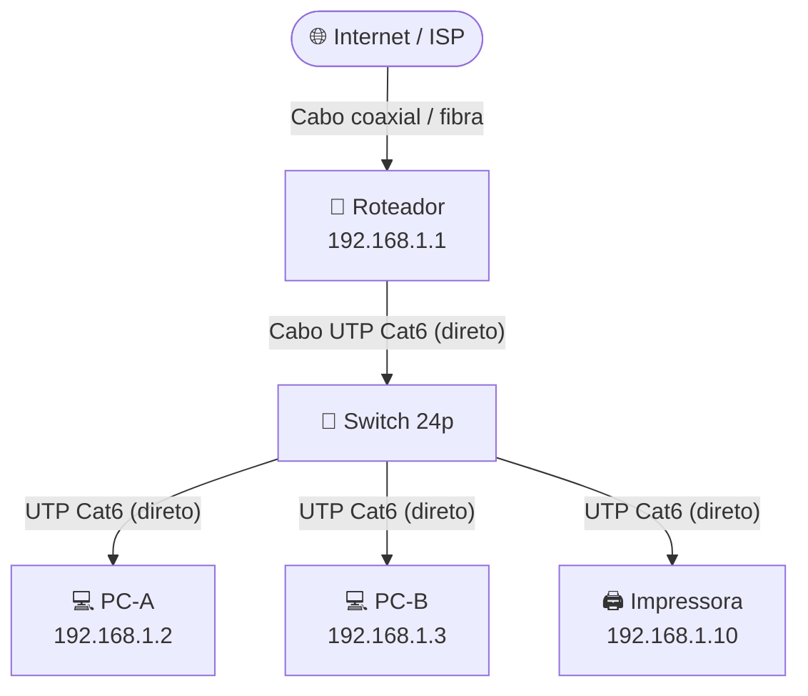
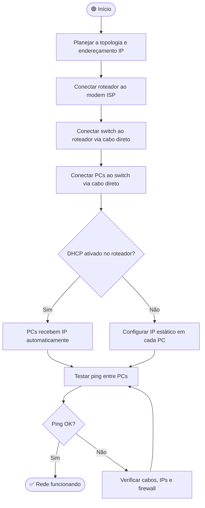
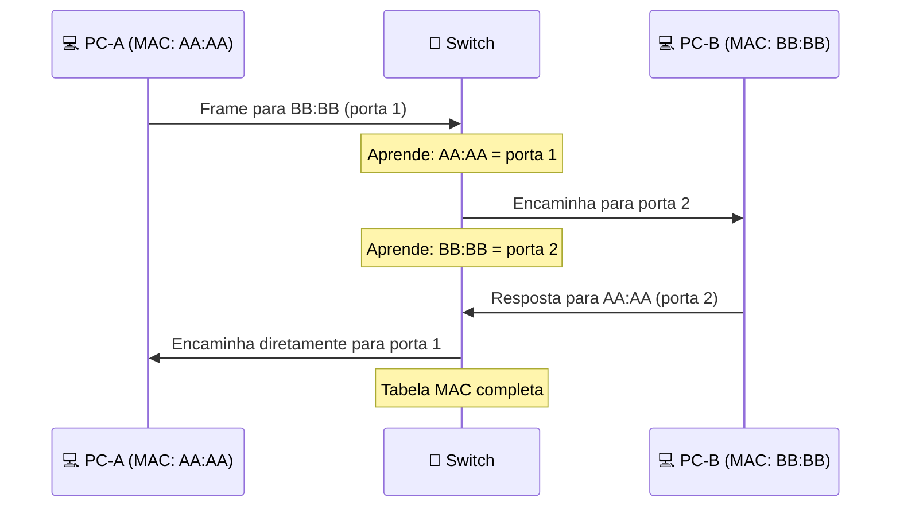

# Montagem e Configuração de Rede

> [!quote] Mãos na Massa
> *A prática é fundamental para consolidar o conhecimento em redes. Aqui você aprenderá desde a crimpagem de cabos até a configuração de equipamentos.*

---

## 🎯 Objetivos da Aula

> [!success] Competências a Desenvolver

- **Compreender** os padrões de cabeamento estruturado (T568A e T568B)
- **Aprender** a preparar e crimpar cabos Ethernet (UTP) com conectores RJ-45
- **Identificar** as diferenças entre cabos diretos e crossover
- **Realizar** testes de conectividade e solucionar problemas
- **Simular** uma rede com o Cisco Packet Tracer e validar comunicação por ping
- **Explorar** a interface de administração de um roteador doméstico real
- **Desenhar** a topologia de uma rede usando ferramentas online

---

## 🧰 Materiais Necessários

| Material | Especificação |
|----------|---------------|
| **Cabos UTP** | Categoria 5e ou 6 (par trançado) |
| **Conectores RJ-45** | Para cabos sólidos ou flexíveis |
| **Alicate de crimpagem** | Para conectores RJ-45 |
| **Decapador** | Ou estilete |
| **Testador de cabos** | Cabo LAN tester |
| **Equipamentos de teste** | Computadores ou switch |
| **EPI** | Óculos de proteção (opcional) |
| **Cisco Packet Tracer** | Grátis via NetAcad (simulador virtual) |
| **Navegador web** | Para acessar a interface do roteador |
| **draw.io** | Grátis em app.diagrams.net (diagramas de topologia) |

---

![[Recursos/Redes de Computadores/Montagem e configuração de rede/pinagem-rj45-t568a.png|Pinagem RJ-45 T568A]]

---

## 📋 Conteúdo Programático

> [!info] Estrutura da Aula

1. **Introdução aos Cabos de Rede**: Tipos (UTP, STP, coaxial, fibra) e categorias
2. **Padrões de Cabeamento**: TIA/EIA-568A e 568B
3. **Ferramentas e Materiais**: Função de cada ferramenta
4. **Procedimentos de Crimpagem**: Passo a passo detalhado
5. **Testes e Solução de Problemas**: Identificação de falhas
6. **Simulação no Packet Tracer**: Rede virtual com ping entre PCs
7. **Configuração real do roteador**: Acesso à interface web
8. **Topologia da sua rede de casa**: Diagrama no draw.io

---

## 🔌 Padrões de Cabeamento

### Padrão T568A

| Pino | Cor do Fio |
|------|------------|
| 1 | Branco e Verde |
| 2 | Verde |
| 3 | Branco e Laranja |
| 4 | Azul |
| 5 | Branco e Azul |
| 6 | Laranja |
| 7 | Branco e Marrom |
| 8 | Marrom |

### Padrão T568B

| Pino | Cor do Fio |
|------|------------|
| 1 | Branco e Laranja |
| 2 | Laranja |
| 3 | Branco e Verde |
| 4 | Azul |
| 5 | Branco e Azul |
| 6 | Verde |
| 7 | Branco e Marrom |
| 8 | Marrom |

> [!tip] Na Prática
> O **padrão T568B é o mais usado** por ser historicamente adotado pelas empresas de telecomunicações.

---

## 🔀 Tipos de Cabos

| Tipo | Padrão | Uso |
|------|--------|-----|
| **Cabo Direto** | Mesmo padrão nas duas pontas (B/B ou A/A) | PC ↔ Switch, PC ↔ Roteador |
| **Cabo Crossover** | T568A em uma ponta, T568B na outra | PC ↔ PC, Switch ↔ Switch |

> [!info] Nota
> Equipamentos modernos com Auto-MDIX detectam automaticamente o tipo de cabo.

---

## 🛠️ Passo a Passo da Crimpagem

### 1️⃣ Preparação do Cabo

1. **Medir e cortar** o comprimento necessário
2. **Remover a capa externa** (~2 cm com decapador)
3. **Cuidado**: Não danificar os fios internos

### 2️⃣ Organização dos Fios

1. **Desembaraçar** os pares trançados
2. **Alinhar** conforme o padrão escolhido (T568B)
3. **Endireitar** os fios com os dedos

### 3️⃣ Corte Uniforme

- Cortar as pontas para ficarem **niveladas** (~1,5 cm)

### 4️⃣ Inserção no Conector

1. **Verificar orientação**: Trava voltada para baixo
2. **Inserir os fios**: Cada fio em sua posição
3. **Capa externa**: Deve entrar no conector

### 5️⃣ Crimpagem

1. **Posicionar** conector no alicate
2. **Apertar firmemente** até o fim

### 6️⃣ Teste

1. Conectar no **testador de cabos**
2. Verificar se todos os **pares estão corretos**

---

## ⚠️ Erros Comuns e Dicas

> [!warning] Problemas Frequentes

| Erro | Solução |
|------|---------|
| Fios na ordem incorreta | Verificar sequência antes de crimpar |
| Fios não totalmente inseridos | Empurrar até o fim do conector |
| Má crimpagem | Apertar firmemente o alicate |
| Capa muito decapada | Manter ~2 cm de exposição |

---

## 🌐 Topologia de uma Rede Pequena

Uma rede pequena (residencial ou de laboratório) segue tipicamente a **topologia em estrela**: todos os dispositivos ligam a um ponto central (switch ou roteador). O diagrama abaixo representa uma rede com dois computadores, um switch e um roteador conectado à internet.



> [!info] Por que estrela?
> A topologia em estrela é a mais usada em ambientes modernos porque um cabo com defeito afeta apenas o dispositivo que ele conecta, sem derrubar toda a rede.

---

## 🔢 Endereçamento IP Básico em Rede Local

Antes de configurar qualquer equipamento, é preciso entender como os endereços IP são distribuídos na rede local.

| Conceito | Exemplo | Explicação |
|----------|---------|------------|
| **Endereço de rede** | 192.168.1.0/24 | Identifica a rede inteira |
| **Gateway padrão** | 192.168.1.1 | Normalmente o roteador |
| **Máscara de sub-rede** | 255.255.255.0 | Define quantos hosts cabem |
| **Faixa de hosts** | 192.168.1.2 a 192.168.1.254 | Endereços disponíveis para dispositivos |
| **DHCP** | Automático | Roteador distribui IPs automaticamente |

> [!tip] Dica de diagnóstico
> Para descobrir o IP do seu gateway (roteador) em qualquer sistema, abra o terminal e digite `ipconfig` (Windows) ou `ip route` (Linux/Mac). O valor ao lado de "Gateway Padrão" é o endereço da interface web do roteador.

---

## 🗺️ Passos para Configurar uma Rede do Zero

O fluxograma abaixo mostra a sequência lógica para montar e configurar uma rede local simples:



---

## 📡 Configuração de Roteadores

### Conceitos Básicos

| Termo | Definição |
|-------|-----------|
| **Roteador** | Encaminha pacotes entre redes diferentes |
| **Camada** | Opera na camada 3 (Rede) |
| **Função** | Conectar redes, gerenciar tráfego, definir rotas |

### Tipos de Roteadores

| Tipo | Uso |
|------|-----|
| **Doméstico** | Residências, funcionalidades simples |
| **Empresarial** | Alta carga, mais configurações |
| **De Borda** | Conexão empresa ↔ internet |
| **De Núcleo** | Coração de grandes redes |

### Gateways Padrão mais Comuns por Fabricante

| Fabricante | IP padrão | Login padrão |
|------------|-----------|--------------|
| TP-Link | 192.168.0.1 ou 192.168.1.1 | admin / admin |
| Intelbras | 192.168.0.1 | admin / admin |
| D-Link | 192.168.0.1 | admin / (em branco) |
| Cisco (doméstico) | 192.168.1.1 | admin / password |
| Multilaser | 192.168.0.1 | admin / admin |

> [!warning] Segurança importante
> Nunca deixe a senha padrão do roteador. Troque para uma senha forte logo após o primeiro acesso. Credenciais padrão são públicas e qualquer pessoa na mesma rede pode acessar o painel de administração.

### Comandos Básicos (Cisco IOS)

```cisco
! Definir hostname
Router(config)# hostname MeuRoteador

! Configurar interface
Router(config)# interface GigabitEthernet0/0
Router(config-if)# ip address 192.168.1.1 255.255.255.0
Router(config-if)# no shutdown

! Rota estática
Router(config)# ip route 10.0.0.0 255.0.0.0 192.168.1.254
```

---

## 🔄 Configuração de Switches

### Conceitos Básicos

| Termo | Definição |
|-------|-----------|
| **Switch** | Conecta dispositivos na mesma rede |
| **Camada** | Opera na camada 2 (Enlace) |
| **Função** | Filtra e encaminha por endereço MAC |

### Switch vs Hub

| Dispositivo | Comportamento | Eficiência |
|-------------|---------------|-----------|
| **Switch** | Envia apenas para o destino correto | Alta: reduz colisões |
| **Hub** | Envia para todos os dispositivos | Baixa: gera colisões |

### Tipos de Switches

| Tipo | Características |
|------|-----------------|
| **Gerenciável** | VLANs, QoS, segurança, configuração avançada |
| **Não Gerenciável** | Plug-and-play, sem configuração |
| **Camada 2** | Usa endereços MAC |
| **Camada 3** | Também faz roteamento |

### Tabela MAC: Como o Switch Aprende



### Comandos Básicos (Cisco IOS)

```cisco
! Definir hostname
Switch(config)# hostname MeuSwitch

! Senha de console
Switch(config)# line console 0
Switch(config-line)# password minhasenha
Switch(config-line)# login

! Criar VLAN
Switch(config)# vlan 10
Switch(config-vlan)# name Vendas

! Atribuir porta à VLAN
Switch(config)# interface FastEthernet0/1
Switch(config-if)# switchport access vlan 10

! Salvar configuração
Switch# copy running-config startup-config
```

---

## 🔐 Segurança de Porta (Port Security)

```cisco
! Ativar port security
Switch(config-if)# switchport port-security
Switch(config-if)# switchport port-security maximum 2
Switch(config-if)# switchport port-security violation shutdown
```

> [!info] Por que usar Port Security?
> Esse recurso impede que dispositivos não autorizados se conectem a uma porta do switch. Se um invasor plugar um notebook desconhecido na porta, ela é desativada automaticamente. Isso é especialmente útil em empresas e laboratórios.

---

## 🧪 Atividades Práticas

> [!example] 🧪 Atividade 1: Rede com 2 PCs e 1 Switch no Cisco Packet Tracer
>
> **Ferramenta:** Cisco Packet Tracer (grátis em [netacad.com](https://www.netacad.com/courses/packet-tracer))
>
> **Passos:**
> 1. Abra o Packet Tracer e crie um novo projeto vazio.
> 2. No painel inferior, vá em **Network Devices > Switches** e arraste um **Switch 2960** para a área de trabalho.
> 3. Vá em **End Devices** e arraste dois **PCs** (PC0 e PC1) para a área.
> 4. Selecione a ferramenta **Copper Straight-Through** (cabo direto, ícone de raio laranja).
> 5. Conecte **PC0** à porta **FastEthernet0/1** do switch e **PC1** à porta **FastEthernet0/2**.
> 6. Clique em **PC0 > Desktop > IP Configuration** e defina:
>    - IP: `192.168.1.2`, Máscara: `255.255.255.0`
> 7. Clique em **PC1 > Desktop > IP Configuration** e defina:
>    - IP: `192.168.1.3`, Máscara: `255.255.255.0`
> 8. No **PC0**, vá em **Desktop > Command Prompt** e execute:
>    ```
>    ping 192.168.1.3
>    ```
>
> **Resultado esperado:** Você deve ver 4 respostas com tempo de resposta (ex.: `Reply from 192.168.1.3: bytes=32 time=1ms TTL=128`). Isso confirma que os dois PCs se comunicam através do switch. Caso apareça "Request timed out", verifique se os cabos estão conectados (indicador verde nas portas) e se os IPs estão corretos.

---

> [!example] 🧪 Atividade 2: Acessar as Configurações do Seu Roteador Real
>
> **Ferramenta:** Qualquer navegador web (Chrome, Firefox, Edge)
>
> **Passos:**
> 1. Conecte seu computador ou celular à rede Wi-Fi ou cabo do roteador de casa (ou da escola).
> 2. Descubra o endereço do gateway:
>    - **Windows:** Abra o Prompt de Comando (`Win + R` → `cmd`) e digite `ipconfig`. Anote o valor de **Gateway Padrão** (geralmente `192.168.0.1` ou `192.168.1.1`).
>    - **Linux/Mac:** Abra o terminal e digite `ip route | grep default`. O IP após "via" é o gateway.
>    - **Celular:** Vá em Configurações > Wi-Fi > toque na rede conectada > veja o campo "Gateway".
> 3. Abra o navegador e digite o endereço do gateway na barra de endereços (ex.: `http://192.168.0.1`).
> 4. Faça login com as credenciais (geralmente impressas na etiqueta do roteador).
> 5. Navegue até a seção de **dispositivos conectados** (pode se chamar "Clientes DHCP", "Dispositivos na rede", "Connected Devices" ou similar).
>
> **Resultado esperado:** Você deve ver uma lista com o nome e o endereço IP de todos os dispositivos conectados à sua rede naquele momento (celulares, computadores, smart TVs, etc.). Anote quantos dispositivos apareceram e compare com os que você conhece. Algum dispositivo estranho apareceu?

---

> [!example] 🧪 Atividade 3: Desenhar a Topologia da Sua Rede de Casa no draw.io
>
> **Ferramenta:** [app.diagrams.net](https://app.diagrams.net) (draw.io, gratuito, sem necessidade de cadastro)
>
> **Passos:**
> 1. Acesse [app.diagrams.net](https://app.diagrams.net) e escolha **"Create new diagram"**.
> 2. Selecione o modelo **"Network"** ou comece com uma página em branco.
> 3. No painel esquerdo, busque por formas de rede: clique em **"Search Shapes"** e pesquise por `router`, `switch`, `PC`, `wireless`.
> 4. Monte o diagrama com todos os equipamentos da sua rede de casa:
>    - Modem/ONT da operadora
>    - Roteador Wi-Fi
>    - Switch (se houver)
>    - Computadores e notebooks conectados
>    - Celulares, smart TVs e outros dispositivos sem fio
> 5. Conecte os equipamentos com linhas e escreva o endereço IP de cada um (se souber).
> 6. Exporte o diagrama em **PNG** (File > Export as > PNG).
>
> **Resultado esperado:** Um diagrama visual da topologia da sua rede doméstica, com pelo menos 3 dispositivos identificados e suas conexões representadas corretamente. O arquivo PNG exportado será entregue como evidência da atividade.

---

## 🔍 Verificando a Conectividade: Comandos Essenciais

Após montar a rede (física ou simulada), use estes comandos para testar e diagnosticar problemas:

| Comando | Sistema | O que faz |
|---------|---------|-----------|
| `ping 192.168.1.1` | Windows/Linux | Testa alcance do roteador (gateway) |
| `ping 8.8.8.8` | Windows/Linux | Testa acesso à internet (DNS Google) |
| `ipconfig /all` | Windows | Mostra IPs, MAC, gateway, DNS |
| `ip addr` | Linux | Mostra interfaces e IPs |
| `tracert 8.8.8.8` | Windows | Mostra o caminho dos pacotes até a internet |
| `traceroute 8.8.8.8` | Linux/Mac | Equivalente ao tracert |
| `arp -a` | Windows/Linux | Mostra tabela ARP (IPs e MACs conhecidos) |
| `nslookup google.com` | Windows/Linux | Testa resolução de nomes DNS |

> [!tip] Sequência de diagnóstico recomendada
> Quando a rede não funcionar, siga esta ordem:
> 1. `ping 127.0.0.1` (testa a própria placa de rede)
> 2. `ping IP_DO_SEU_PC` (testa o IP local)
> 3. `ping 192.168.1.1` (testa o gateway)
> 4. `ping 8.8.8.8` (testa a internet sem DNS)
> 5. `ping google.com` (testa DNS + internet)
> Se um passo falha, o problema está entre ele e o passo anterior.

---

## 🔐 Segurança de Porta (Port Security)

```cisco
! Ativar port security
Switch(config-if)# switchport port-security
Switch(config-if)# switchport port-security maximum 2
Switch(config-if)# switchport port-security violation shutdown
```

---

## 📊 Comparativo: Simulação x Rede Real

| Aspecto | Cisco Packet Tracer | Rede Real |
|---------|---------------------|-----------|
| **Custo** | Gratuito | Requer hardware |
| **Erros físicos** | Não simula falhas de cabo | Cabos podem estar rompidos |
| **IOS** | Simulado (limitado) | Completo |
| **Aprendizado** | Ideal para conceitos e protocolos | Essencial para prática profissional |
| **Velocidade** | Sempre "perfeita" | Depende do cabeamento e interferências |
| **VLANs** | Suportado | Suportado (switch gerenciável) |

> [!success] Recomendação
> Use o Packet Tracer para **aprender e testar conceitos** sem risco. Depois, reproduza o mesmo cenário em hardware real para sentir as diferenças: cabos tortos, LEDs piscando, ruídos e latência variam em ambientes físicos.

---

> [!note] 📚 Fontes (2026)
> - [Laboratório 1: Confecção de Cabos UTP (UFES)](https://www.inf.ufes.br/~zegonc/material/Redes_de_Computadores/Lab1%20-%20Confeccao%20de%20Cabos%20UTP.pdf)
> - [Como criar cabo crossover e cabo direto (InfoWester)](https://www.infowester.com/tutcabosredes.php)
> - [Como configurar um switch de rede em 6 etapas (Cisco)](https://www.cisco.com/c/pt_br/solutions/small-business/resource-center/networking/how-to-setup-network-switch.html)
> - [Como criar uma rede com switch no Packet Tracer (Simplificando Redes)](https://simplificandoredes.com/en/create-network-switch-packet-tracer/)
> - [Packet Tracer para iniciantes: rede com 2 PCs (Simplificando Redes)](https://simplificandoredes.com/en/packet-tracer-first-network-2-pcs/)
> - [Como conectar computadores em rede usando o Packet Tracer (Revelo)](https://community.revelo.com.br/como-conectar-computadores-em-rede-usando-o-simulador-packet-tracer/)
> - [Como configurar uma rede local em 5 passos (Dominando Redes)](https://dominandoredes.com.br/como-configurar-uma-rede-local-em-5-passos/)
> - [Guia de acesso: como acessar configurações do roteador (Avast)](https://www.avast.com/pt-br/c-how-to-log-into-your-router)
> - [O que é o endereço IP 192.168.1.1 do roteador? (NetSpot)](https://www.netspotapp.com/blog/ip-addresses/192-168-1-1.html)
> - [Guia de Diagramas de Rede (Creately)](https://creately.com/blog/pt/diagrama/guia-de-diagrama-de-rede/)
