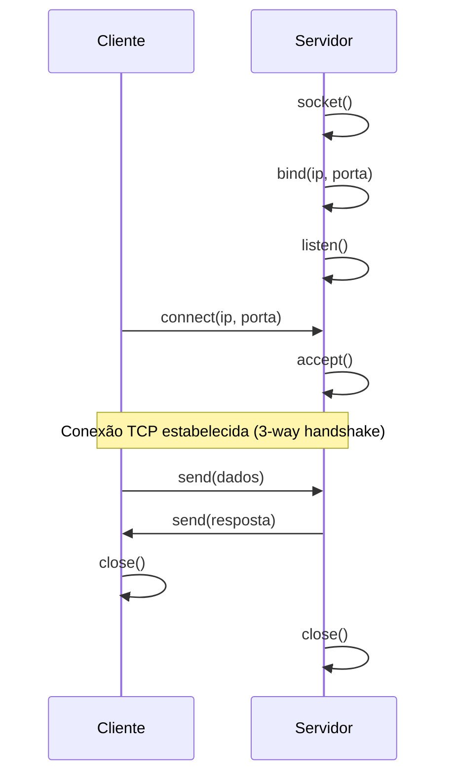
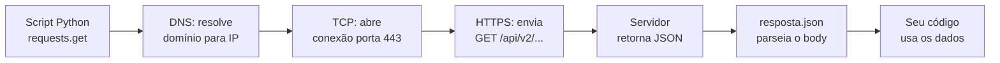
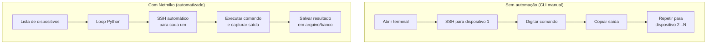
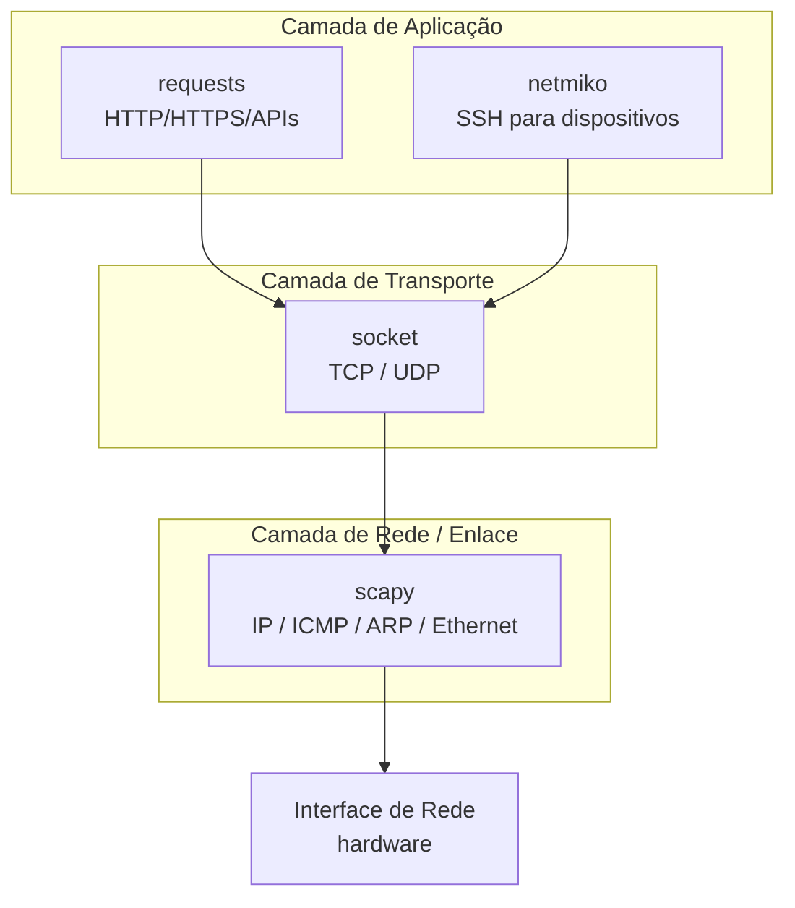

# Python para Redes de Computadores

> [!quote] Automatizando a Rede
> *Python é uma das linguagens mais utilizadas para automação de redes, criação de ferramentas de diagnóstico e desenvolvimento de aplicações cliente-servidor.*

---

## 🎯 Desafios Práticos

> [!success] O que vamos aprender

| Desafio | Descrição |
|---------|-----------|
| **Hello World de Redes** | Primeiro contato com programação de redes |
| **Automação para Redes** | Scripts para tarefas repetitivas |
| **Módulo Socket** | Entendimento profundo de sockets |
| **Scanner de Rede** | Criar scanner de portas com Python |
| **Cliente e Servidor** | Scripts de comunicação TCP/UDP |

---

## 📚 Módulo Socket

> [!info] Fundamento da Comunicação
> O módulo `socket` permite criar conexões de rede de baixo nível.

```python
import socket

# Criar um socket TCP
s = socket.socket(socket.AF_INET, socket.SOCK_STREAM)

# Conectar a um servidor
s.connect(('exemplo.com', 80))
```

### Como funciona o socket TCP

O socket TCP segue o ciclo de vida abaixo. No lado do servidor: `socket()` cria o endpoint, `bind()` associa ao endereço/porta, `listen()` coloca em modo de espera e `accept()` aguarda uma conexão. No lado do cliente: `socket()` cria o endpoint e `connect()` inicia a conexão com o servidor. Após a comunicação, ambos chamam `close()`.



### Resolvendo nomes com socket

Uma função muito útil é `gethostbyname()`, que consulta o DNS e devolve o endereço IP de um nome de domínio. Isso é o que acontece por baixo dos panos toda vez que você digita um endereço no navegador:

```python
import socket

dominio = "www.google.com"
ip = socket.gethostbyname(dominio)
print(f"IP de {dominio}: {ip}")
# Saída esperada: IP de www.google.com: 142.250.X.X
```

> [!example] 🧪 Atividade 1: Resolver IP de domínios com Python
>
> **Objetivo:** descobrir o endereço IP de diferentes domínios usando o módulo `socket`.
>
> **Pré-requisito:** Python 3.x instalado localmente ou [Google Colab](https://colab.research.google.com) (sem instalação).
>
> **Código para rodar:**
>
> ```python
> import socket
>
> dominios = [
>     "www.google.com",
>     "www.iff.edu.br",
>     "www.python.org",
>     "www.cloudflare.com",
>     "www.github.com",
> ]
>
> print(f"{'Domínio':<30} {'IP resolvido'}")
> print("-" * 50)
> for dominio in dominios:
>     try:
>         ip = socket.gethostbyname(dominio)
>         print(f"{dominio:<30} {ip}")
>     except socket.gaierror as e:
>         print(f"{dominio:<30} ERRO: {e}")
> ```
>
> **Resultado observável esperado (os IPs variam por localização e por dia):**
>
> ```
> Domínio                        IP resolvido
> --------------------------------------------------
> www.google.com                 142.250.79.36
> www.iff.edu.br                 200.130.XX.XX
> www.python.org                 151.101.XX.XX
> www.cloudflare.com             104.21.XX.XX
> www.github.com                 140.82.XX.XX
> ```
>
> **O que observar:** cada execução pode retornar um IP diferente para o mesmo domínio (balanceamento de carga e CDN). Compare os resultados com os colegas ao lado: provavelmente serão iguais para sites brasileiros e diferentes para CDNs globais.
>
> **Pergunta para discussão:** por que `www.iff.edu.br` e `www.cloudflare.com` retornam IPs diferentes dependendo de onde você roda o código?

---

## 🔧 Bibliotecas Úteis

| Biblioteca | Instalação | Uso Principal | Versão estável (2026) |
|------------|------------|---------------|----------------------|
| **socket** | já incluída | Comunicação TCP/UDP de baixo nível | stdlib (Python 3.x) |
| **requests** | `pip install requests` | Requisições HTTP/HTTPS com alto nível | 2.32.x |
| **paramiko** | `pip install paramiko` | SSH e SFTP | 3.x |
| **netmiko** | `pip install netmiko` | Automação de equipamentos de rede (multi-vendor) | 4.x |
| **scapy** | `pip install scapy` | Criação e análise de pacotes de rede | 2.7.x |
| **nmap** | `pip install python-nmap` | Interface Python para o Nmap | 0.7.x |

> [!tip] 💡 Dica de ambiente
> Em laboratório, prefira o Google Colab para testes que não precisam de acesso à rede local (HTTP, DNS, APIs). Para testes com sockets locais (cliente-servidor na mesma máquina), use o terminal do seu computador.

---

## 🌐 Requisições HTTP com `requests`

A biblioteca `requests` abstrai toda a complexidade do protocolo HTTP. Com ela, consumir uma API pública exige apenas três linhas de código.

```python
import requests

# Buscar dados em uma API pública de fato aleatório (em inglês)
resposta = requests.get("https://uselessfacts.jsph.pl/api/v2/facts/random")

# Checar se a requisição foi bem-sucedida (código 200)
if resposta.status_code == 200:
    dados = resposta.json()
    print(dados["text"])
else:
    print(f"Erro: código HTTP {resposta.status_code}")
```

### Anatomia de uma resposta HTTP



> [!example] 🧪 Atividade 2: Consultar seu IP público via API com Python
>
> **Objetivo:** usar `requests` para consultar uma API pública e obter dados geográficos do IP da sua conexão atual. Tudo dentro da sua máquina ou do Colab, sem varredura de terceiros.
>
> **Pré-requisito:** `pip install requests` (já disponível no Colab).
>
> **Código para rodar:**
>
> ```python
> import requests
> import json
>
> # A API ipinfo.io retorna dados do IP que faz a requisição
> # Plano gratuito: 50.000 req/mês
> url = "https://ipinfo.io/json"
>
> try:
>     resposta = requests.get(url, timeout=5)
>     resposta.raise_for_status()  # lança exceção se status != 2xx
>
>     dados = resposta.json()
>
>     print("=== Dados do seu IP público ===")
>     print(f"IP:        {dados.get('ip', 'N/A')}")
>     print(f"Cidade:    {dados.get('city', 'N/A')}")
>     print(f"Região:    {dados.get('region', 'N/A')}")
>     print(f"País:      {dados.get('country', 'N/A')}")
>     print(f"Org (ASN): {dados.get('org', 'N/A')}")
>     print(f"Timezone:  {dados.get('timezone', 'N/A')}")
>
>     print("\n=== JSON completo ===")
>     print(json.dumps(dados, indent=2, ensure_ascii=False))
>
> except requests.exceptions.Timeout:
>     print("Timeout: a API não respondeu em 5 segundos.")
> except requests.exceptions.RequestException as e:
>     print(f"Erro na requisição: {e}")
> ```
>
> **Resultado observável esperado (exemplo rodando no campus IFF):**
>
> ```
> === Dados do seu IP público ===
> IP:        200.130.XX.XX
> Cidade:    Bom Jesus do Itabapoana
> Região:    Rio de Janeiro
> País:      BR
> Org (ASN): AS1916 Rede Nacional de Ensino e Pesquisa
> Timezone:  America/Sao_Paulo
>
> === JSON completo ===
> {
>   "ip": "200.130.XX.XX",
>   "hostname": "...",
>   "city": "Bom Jesus do Itabapoana",
>   ...
> }
> ```
>
> **O que observar:** quando rodado no Colab, o IP será de um datacenter do Google (nos EUA ou Brasil). Quando rodado no campus, o IP pertencerá à RNEP (Rede Nacional de Ensino e Pesquisa). Isso mostra como o mesmo código produz saídas distintas dependendo de onde está sendo executado, o que é um conceito central em redes.
>
> **Desafio extra:** modifique o código para consultar o IP de um amigo (peça para ele rodar `curl ifconfig.me` no terminal e te passar o resultado). Substitua `https://ipinfo.io/json` por `https://ipinfo.io/SEU_IP_AQUI/json`.

---

## 🤖 Automação com Netmiko

> [!info] Para que serve o Netmiko?
> Netmiko é uma biblioteca Python construída sobre o Paramiko (SSH) que simplifica a automação de dispositivos de rede de múltiplos fabricantes: Cisco IOS, IOS-XE, NX-OS, Juniper Junos, Arista EOS, Mikrotik, Huawei, entre outros. Em vez de abrir um terminal, digitar comandos manualmente e copiar a saída, você escreve um script que faz tudo isso em segundos, em dezenas de dispositivos ao mesmo tempo.

```python
from netmiko import ConnectHandler

# Dicionário com dados de acesso ao dispositivo
dispositivo = {
    "device_type": "cisco_ios",
    "ip": "192.168.1.1",
    "username": "admin",
    "password": "senha_secreta",
}

# Abre a conexão SSH
conexao = ConnectHandler(**dispositivo)

# Envia um comando e captura a saída como string
saida = conexao.send_command("show ip interface brief")
print(saida)

# Fecha a conexão
conexao.disconnect()
```

> [!warning] ⚠️ Atenção ao uso em redes reais
> Comandos de configuração (`send_config_set`) alteram permanentemente o dispositivo. Em laboratório com equipamentos reais, sempre revise o script com o professor antes de executar. Nunca teste scripts de automação em dispositivos de produção sem autorização explícita do responsável pela rede.

### Comparação: CLI manual versus automação com Netmiko



---

## 🔍 Manipulação de Pacotes com Scapy

> [!warning] ⚠️ Uso ético e legal obrigatório
> Scapy permite criar e injetar pacotes de rede arbitrários. Use **apenas** em redes sob sua própria administração ou em laboratório com autorização explícita. Varreduras, injeção de pacotes ou captura de tráfego em redes alheias sem permissão são condutas ilegais no Brasil (Lei 12.737/2012, Lei Carolina Dieckmann, e o Marco Civil da Internet).

Scapy é usado para aprender como protocolos funcionam na prática, construindo e dissecando pacotes camada por camada:

```python
from scapy.all import IP, ICMP, sr1

# Monta um pacote ICMP (ping) para um host local
pacote = IP(dst="127.0.0.1") / ICMP()

# Envia e aguarda a resposta (timeout de 2 segundos)
resposta = sr1(pacote, timeout=2, verbose=False)

if resposta:
    print(f"Resposta de: {resposta[IP].src} | TTL: {resposta[IP].ttl}")
else:
    print("Sem resposta (host inacessível ou firewall bloqueou)")
```

> [!note] 📌 Por que usar 127.0.0.1?
> O endereço `127.0.0.1` (loopback) refere-se à própria máquina. Testes com Scapy para o loopback não geram tráfego para a rede externa, portanto são completamente seguros e permitidos em qualquer ambiente.

---

## 🚀 Projetos Sugeridos

> [!tip] Ideias para Praticar

1. **Port Scanner**: Varredura de portas em um host
2. **Chat TCP**: Cliente e servidor de mensagens
3. **Ping Sweeper**: Descoberta de hosts ativos
4. **Backup Automatizado**: Via SSH/SFTP
5. **Monitor de Rede**: Alertas de disponibilidade

---

## 🔗 Arquitetura: Python como Cola entre Camadas de Rede

O diagrama abaixo mostra como as bibliotecas Python se encaixam nas camadas do modelo TCP/IP. Cada biblioteca atua em um nível de abstração diferente:



---

> [!note] 📚 Fontes (2026)
> Referências consultadas na elaboração desta aula:
>
> - [Real Python: Socket Programming in Python (Guide)](https://realpython.com/python-sockets/): guia completo de sockets TCP/UDP com threading e selectors
> - [Python Docs: Socket Programming HOWTO](https://docs.python.org/3/howto/sockets.html): documentação oficial do módulo socket
> - [DataCamp: A Complete Guide to Socket Programming in Python](https://www.datacamp.com/tutorial/a-complete-guide-to-socket-programming-in-python): exemplos práticos de cliente-servidor
> - [DigitalOcean: Python Socket Programming: Server and Client Guide](https://www.digitalocean.com/community/tutorials/python-socket-programming-server-client): tutorial com múltiplos clientes e threading
> - [Scapy 2.7.1 Documentation](https://scapy.readthedocs.io/en/latest/introduction.html): referência oficial da biblioteca Scapy
> - [freeCodeCamp: How to Use Scapy](https://www.freecodecamp.org/news/how-to-use-scapy-python-networking/): tutorial prático de Scapy
> - [Netmiko.org: Simplified Network Device Automation](https://netmiko.org/): documentação oficial do Netmiko
> - [SaifwayTech: Python Network Automation with Netmiko: Multi-Vendor (2025)](https://saifwaytech.com/2025/05/18/python-network-automation-with-netmiko.html): exemplos multi-vendor
> - [IPinfo.io Developers](https://ipinfo.io/developers): API de geolocalização de IP (plano gratuito: 50.000 req/mês)
> - [GeeksForGeeks: Python Network Programming](https://www.geeksforgeeks.org/python/python-network-programming/): referência de conceitos e exemplos variados
