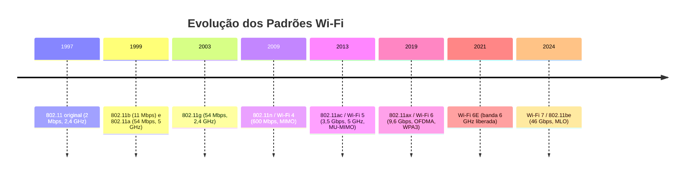
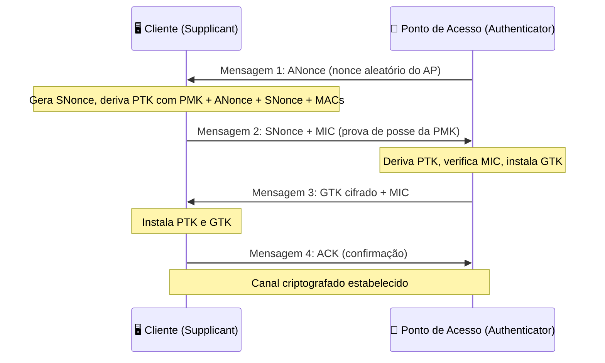
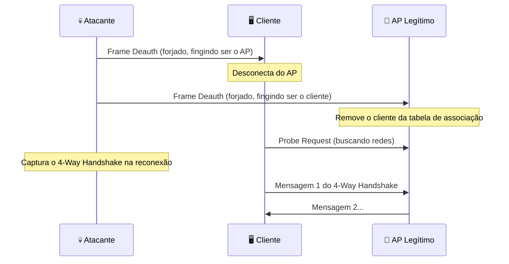
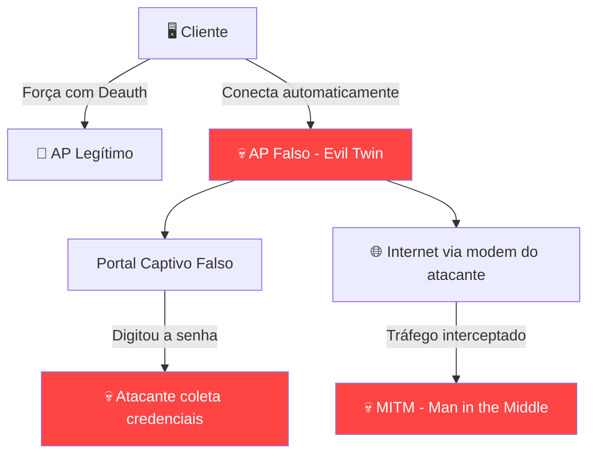

# Redes Sem Fio e sua Segurança

> [!quote] Conectividade Sem Cabos
> *As redes sem fio revolucionaram a forma como nos conectamos, mas também trouxeram novos desafios de segurança que precisam ser compreendidos e mitigados.*

---

## 📶 Visão Geral

> [!info] Aula Prática
> Aula prática sobre redes sem fio utilizando aircrack-ng e wifite para análise e auditoria de segurança Wi-Fi.

---

## 🔐 Tópicos Abordados

| Tópico | Descrição |
|--------|-----------|
| **Padrão 802.11** | Família de protocolos para redes Wi-Fi |
| **Criptografia** | WEP, WPA, WPA2, WPA3 |
| **Ferramentas** | Aircrack-ng, Wifite, Wireshark |
| **Auditoria** | Testes de segurança em redes sem fio |

---

## 🛠️ Ferramentas Práticas

> [!tip] Suite Aircrack-ng
> Conjunto de ferramentas para auditoria de redes Wi-Fi.

| Ferramenta | Função |
|------------|--------|
| **airmon-ng** | Habilita modo monitor na interface |
| **airodump-ng** | Captura pacotes de redes Wi-Fi |
| **aireplay-ng** | Injeta pacotes para testes |
| **aircrack-ng** | Análise de chaves de criptografia |

---

## ⚠️ Padrões de Criptografia

| Padrão | Segurança | Status |
|--------|-----------|--------|
| **WEP** | Fraca | ❌ Obsoleto |
| **WPA** | Moderada | ⚠️ Legado |
| **WPA2** | Boa | ✅ Recomendado |
| **WPA3** | Excelente | ✅ Mais recente |

> [!warning] Atenção
> WEP e WPA são considerados inseguros. Sempre utilize WPA2 ou WPA3 em suas redes.

---

## 📡 Padrões 802.11: A Evolução do Wi-Fi

O Wi-Fi não é um protocolo único, mas uma família de padrões definidos pelo IEEE sob o número **802.11**. Cada geração trouxe maior velocidade, maior alcance e, eventualmente, melhorias de segurança. Entender essa evolução ajuda a compreender por que dispositivos mais antigos são mais vulneráveis.



| Geração | Nome Comercial | Freq. (GHz) | Velocidade Máx. | Segurança típica |
|---------|---------------|-------------|-----------------|-----------------|
| 802.11b | Wi-Fi 1 | 2,4 | 11 Mbps | WEP |
| 802.11g | Wi-Fi 3 | 2,4 | 54 Mbps | WEP/WPA |
| 802.11n | Wi-Fi 4 | 2,4 e 5 | 600 Mbps | WPA2 |
| 802.11ac | Wi-Fi 5 | 5 | 3,5 Gbps | WPA2 |
| 802.11ax | Wi-Fi 6/6E | 2,4, 5 e 6 | 9,6 Gbps | WPA3 |
| 802.11be | Wi-Fi 7 | 2,4, 5 e 6 | 46 Gbps | WPA3 obrigatório |

> [!info] 💡 Frequência e alcance
> A banda **2,4 GHz** penetra melhor paredes (mais alcance), mas é mais congestionada. A banda **5 GHz** oferece maior velocidade, mas menor alcance. A banda **6 GHz** (Wi-Fi 6E) praticamente zera a interferência por ser nova, mas exige hardware moderno.

---

## 🔒 Criptografia Wi-Fi em Profundidade

### WEP (Wired Equivalent Privacy, 1997)

O WEP foi o primeiro protocolo de criptografia para Wi-Fi. Usava o algoritmo RC4 com chave de 40 ou 104 bits e um vetor de inicialização (IV) de apenas 24 bits transmitido em texto claro. O problema crítico: com tráfego suficiente, o IV se repete e o RC4 pode ser completamente quebrado por análise estatística. Ferramentas como **aircrack-ng** recuperam a chave WEP em minutos, coletando entre 20.000 e 40.000 IVs únicos. O WEP foi oficialmente aposentado pelo IEEE em 2004, mas ainda aparece em dispositivos legados.

### WPA (Wi-Fi Protected Access, 2003)

O WPA foi uma resposta emergencial à quebra do WEP, mantendo compatibilidade com hardware antigo via atualização de firmware. Introduziu o **TKIP** (Temporal Key Integrity Protocol): chave por pacote, contador de sequência e MIC (Message Integrity Check). Porém, o TKIP ainda usava RC4 como base e se mostrou vulnerável a ataques como o **Beck-Tews** (2008) e **TKIP MIC** (2009). Hoje, WPA-TKIP é considerado inseguro.

### WPA2 (2004) e o 4-Way Handshake

O WPA2 substituiu o TKIP pelo **CCMP**, baseado no AES-128 em modo CCM. É o padrão dominante até hoje. O processo de autenticação usa o **4-Way Handshake**:



A **PTK** (Pairwise Transient Key) é derivada da **PMK** (Pairwise Master Key) que, em modo pessoal (WPA2-PSK), vem da senha. Quem captura esse handshake pode tentar ataques de força bruta offline contra a PMK, sem nunca interagir com a rede novamente.

### KRACK (Key Reinstallation Attack, 2017)

Em 2017, Mathy Vanhoef descobriu o **KRACK**: uma falha no processo de reinstalação de chaves do 4-Way Handshake. O atacante podia forçar a reinstalação de chaves já utilizadas, quebrando a confidencialidade do tráfego em certas condições. Todos os sistemas operacionais modernos foram corrigidos, mas dispositivos IoT antigos e sem atualização ainda podem ser vulneráveis.

### WPA3 (2018): Proteções Novas

O WPA3 introduziu mudanças fundamentais para endereçar as fraquezas do WPA2:

**SAE (Simultaneous Authentication of Equals), também chamado Dragonfly:** substitui o PSK simples. A senha nunca trafega na rede nem deriva diretamente a PTK. Em vez disso, um protocolo de troca de chave Diffie-Hellman baseado em senha garante que cada sessão gere uma chave diferente, mesmo que a senha seja a mesma. Isso implementa o **Forward Secrecy**: mesmo que a senha seja descoberta no futuro, sessões passadas não podem ser decriptadas.

**OWE (Opportunistic Wireless Encryption):** permite que redes abertas (sem senha, como as de café ou aeroporto) usem criptografia individual por cliente, sem autenticação. Isso impede sniffing passivo mesmo em redes públicas.

**PMF (Protected Management Frames) obrigatório:** no WPA2, os frames de gerenciamento (como deauthentication e disassociation) são enviados sem criptografia. Qualquer um pode forjá-los. O WPA3 torna o PMF obrigatório, bloqueando ataques de deautenticação forçada.

**Proteção contra força bruta offline:** no WPA2, capturado o handshake, o ataque é offline e ilimitado. No WPA3-SAE, cada tentativa de autenticação exige interação com o AP, limitando a velocidade de tentativas.

---

## 🎯 Anatomia dos Principais Ataques Wi-Fi

> [!danger] ⚠️ Atenção Legal
> Atacar redes de terceiros sem autorização é crime no Brasil pelo **Art. 154-A do Código Penal** (invasão de dispositivo informático), com pena de 1 a 4 anos de reclusão mais multa, agravada se houver obtenção de dados ou prejuízo econômico. **Todo conteúdo desta seção é educacional.** A prática SOMENTE é lícita em sua própria rede, em ambiente de laboratório controlado ou com autorização escrita do proprietário. Conhecer os ataques é essencial para se defender.

### 1. Ataque de Deautenticação (Deauth)

O padrão 802.11 original permite que qualquer dispositivo envie um frame de **deauthentication** sem criptografia e sem autenticação. O AP simplesmente obedece. Um atacante pode usar isso para:

- Desconectar clientes temporariamente (DoS).
- Forçar a reconexão e capturar o 4-Way Handshake do WPA2.
- Criar abertura para um ataque Evil Twin.



**Ferramenta:** `aireplay-ng --deauth <count> -a <BSSID_AP> -c <MAC_cliente> <interface>`

**Proteção:** WPA3 com PMF obrigatório torna os frames de deauth autenticados, invalidando este ataque.

### 2. Captura do Handshake WPA2 e Ataque Offline

Após a deautenticação, o cliente tenta reconectar e executa o 4-Way Handshake. O atacante captura esse handshake com o `airodump-ng`. O handshake contém informações suficientes para verificar, offline, se uma senha candidata é a correta:

```
PMK = PBKDF2(HMAC-SHA1, password, SSID, 4096, 256)
PTK = PRF(PMK, "Pairwise key expansion", min(MACs)||max(MACs)||min(nonces)||max(nonces))
MIC = HMAC-MD5(KCK, EAPOL frame)
```

O atacante testa milhares de senhas candidatas por segundo (via CPU ou GPU) contra o MIC capturado. Com uma placa de vídeo moderna (RTX 4090), é possível testar mais de **1,5 milhão de senhas WPA2 por segundo** usando hashcat. Senhas curtas e palavras de dicionário caem rapidamente. Senhas de 12 caracteres aleatórios levam anos.

**Proteção:** senhas longas e aleatórias (20+ caracteres) tornam o ataque computacionalmente inviável. Migrar para WPA3.

### 3. Ataque Evil Twin (Gêmeo do Mal)

O Evil Twin cria um ponto de acesso falso com o mesmo SSID e BSSID (ou similar) de uma rede legítima, com sinal mais forte. O objetivo é capturar credenciais ou interceptar tráfego:



O fluxo típico de um Evil Twin avançado:
1. Escanear redes próximas e escolher um alvo.
2. Criar um AP falso com o mesmo SSID (e opcionalmente clonar o BSSID).
3. Lançar frames de deauth contra o AP legítimo para expulsar clientes.
4. Clientes se conectam ao AP falso (mais forte, mesmo nome).
5. Exibir um portal captivo pedindo a senha Wi-Fi "para confirmar identidade".
6. Verificar se a senha informada é correta (testando contra o handshake capturado).
7. Revelar a senha correta e devolver a conexão ao cliente (que não percebe nada).

**Ferramentas usadas em labs:** Airgeddon, Fluxion, hostapd-wpe.

**Proteção:** verificar o certificado em redes corporativas (WPA2-Enterprise / EAP-TLS). Em redes pessoais, nunca digitar a senha Wi-Fi em portal captivo inesperado. WPA3 com SAE dificulta, mas não elimina o Evil Twin.

### 4. Ataque WPS (Wi-Fi Protected Setup): Pixie Dust e Brute Force

O WPS foi criado para facilitar a conexão de dispositivos via PIN de 8 dígitos em vez da senha completa. O problema é duplo:

**Brute force:** o PIN é validado em duas metades (4+4 dígitos), reduzindo o espaço de busca de 10⁸ para 10⁴ + 10⁴ = 20.000 tentativas no máximo. Ferramentas como **Reaver** exploram isso.

**Pixie Dust:** ataque muito mais rápido, descoberto em 2014. Alguns chipsets Wi-Fi geram nonces (números aleatórios usados no WPS handshake) com entropia insuficiente ou até estática. Com apenas uma troca de WPS, o atacante pode recuperar o PIN e a senha WPA em segundos. Em 2025, pesquisadores da NetRise confirmaram que **83% dos dispositivos afetados nunca receberam patch**, com a correção chegando em média 9,6 anos após a divulgação da vulnerabilidade.

**Proteção:** desabilitar o WPS no roteador. Verificar se o roteador possui a correção do Pixie Dust.

### 5. Ataque Dragonblood contra WPA3-SAE

O WPA3 não é invulnerável. Em 2019, Mathy Vanhoef (o mesmo do KRACK) publicou o **Dragonblood**: um conjunto de ataques de canal lateral (timing e cache) contra a implementação do SAE. O ataque explora variações de tempo na operação de mapeamento de senha para ponto de curva elíptica, permitindo deduzir informações sobre a senha bit a bit.

O IEEE respondeu com o método **Hash-to-Element (H2E)**, que elimina as variações de tempo sendo computacionalmente constante. Dispositivos modernos com WPA3 e H2E são resistentes ao Dragonblood original. Pesquisas de 2025 continuam analisando implementações SAE em dispositivos COTS (Consumer Off-The-Shelf) buscando bugs de parsing, indicando que o WPA3 ainda é alvo ativo de pesquisa de segurança.

**Proteção:** manter firmware do roteador atualizado. Verificar se o roteador suporta H2E (configurável em alguns modelos).

---

## 🧪 Atividades Práticas na Sua Própria Rede

> [!warning] Lembrete Legal
> Todas as atividades abaixo devem ser realizadas **exclusivamente** na sua própria rede Wi-Fi doméstica, em um laboratório com equipamentos de sua propriedade ou com autorização escrita do responsável. Executar qualquer uma dessas ações em redes de terceiros configura crime (Art. 154-A CP).

> [!example] 🧪 Atividade 1: Verificar a Segurança do Seu Roteador
>
> **Objetivo:** identificar o protocolo de segurança, canal, potência e configurações vulneráveis do seu roteador doméstico.
>
> **Ferramentas:** navegador web (acesso ao painel do roteador) + app **WiFi Analyzer** (Android/Windows).
>
> **Passo a passo:**
>
> 1. Acesse o painel do seu roteador. O endereço padrão é geralmente `192.168.0.1` ou `192.168.1.1` (verifique no adesivo do roteador ou rode `ip route` no Linux / `ipconfig` no Windows e observe o "Gateway Padrão").
> 2. Navegue até a seção de **configurações wireless** ou **segurança**.
> 3. Registre: qual protocolo está ativo (WEP/WPA/WPA2/WPA3)? O WPS está habilitado?
> 4. Instale o app **WiFi Analyzer** (gratuito no Android/Windows). Abra e observe:
>    - Quantas redes Wi-Fi estão visíveis na sua área?
>    - Quais usam WPA2 e quais ainda usam WEP ou estão abertas?
>    - Em quais canais estão operando? Há congestionamento?
>    - Qual rede tem o sinal mais forte? E a mais fraca?
> 5. Volte ao painel do roteador e **desabilite o WPS** se estiver ativo.
>
> **Resultado esperado:** você consegue identificar o protocolo exato de segurança da sua rede, verificar se há redes abertas vulneráveis próximas, e desabilitar o WPS como medida de proteção. Registre uma captura de tela do painel do roteador antes e depois da mudança.

> [!example] 🧪 Atividade 2: Escanear Redes Próximas com WiFi Analyzer
>
> **Objetivo:** praticar o reconhecimento passivo de redes (equivalente ao que um atacante faz antes de qualquer ataque), observando SSID, BSSID, canal, potência e protocolo de segurança.
>
> **Ferramenta:** **WiFi Analyzer** (Android, gratuito) ou **Kismet** (Linux) ou `nmcli` / `iwlist` (Linux terminal).
>
> **Passo a passo no Linux:**
>
> ```bash
> # Listar interfaces de rede
> ip link show
>
> # Escanear redes visíveis (substitua wlan0 pela sua interface)
> sudo iwlist wlan0 scan | grep -E "ESSID|Address|Encryption|Channel|Quality"
>
> # Alternativa mais amigável com nmcli
> nmcli device wifi list
> ```
>
> **O que observar:**
> - Campos `ESSID` (nome da rede), `Address` (BSSID do AP), `Encryption key: on/off`, `IE: IEEE 802.11i/WPA2` ou `WPA3`.
> - Qualidade do sinal (Quality=XX/70) e força (Signal level).
> - Redes com `Encryption key: off` são abertas (sem senha), portanto sem criptografia no tráfego.
>
> **Resultado esperado:** uma lista com pelo menos 5 redes visíveis, indicando para cada uma o nome, protocolo de segurança e canal. Identifique se alguma ainda usa WEP ou está aberta.

> [!example] 🧪 Atividade 3: Capturar o Handshake WPA2 da SUA Rede (Lab Kali Linux)
>
> **Objetivo:** entender na prática como o 4-Way Handshake é capturado, processo fundamental para compreender por que senhas fracas são perigosas no WPA2.
>
> **Pré-requisito:** Kali Linux (VM ou live USB), adaptador Wi-Fi com suporte ao **modo monitor** (ex.: Alfa AWUS036ACH, TP-Link TL-WN722N v1), e um roteador de sua propriedade para ser o alvo.
>
> **Passo a passo:**
>
> ```bash
> # 1. Identificar a interface Wi-Fi
> iwconfig
>
> # 2. Habilitar modo monitor (substitua wlan0 pela sua interface)
> sudo airmon-ng start wlan0
> # A interface passa a se chamar wlan0mon (ou similar)
>
> # 3. Escanear redes próximas para identificar o seu alvo
> sudo airodump-ng wlan0mon
> # Pressione Ctrl+C quando encontrar sua rede
> # Anote o BSSID (ex: AA:BB:CC:DD:EE:FF) e o canal (CH)
>
> # 4. Monitorar SOMENTE a sua rede e salvar a captura
> sudo airodump-ng -c <CANAL> --bssid <SEU_BSSID> -w captura wlan0mon
> # Deixe rodando em um terminal
>
> # 5. Em outro terminal, forçar a reconexão de um cliente da SUA rede
> # (pode ser seu celular ou outro dispositivo seu conectado à rede)
> sudo aireplay-ng --deauth 5 -a <SEU_BSSID> -c <MAC_DO_SEU_DISPOSITIVO> wlan0mon
>
> # 6. Observar no terminal do airodump-ng a mensagem:
> # WPA handshake: AA:BB:CC:DD:EE:FF
>
> # 7. Parar a captura (Ctrl+C no airodump-ng)
> # O arquivo captura-01.cap contém o handshake
>
> # 8. Verificar se o handshake foi capturado
> aircrack-ng captura-01.cap
> ```
>
> **O que você NÃO vai fazer nesta atividade:** tentar quebrar a senha (o objetivo é entender o processo de captura, não o ataque completo). O arquivo `.cap` é suficiente para demonstrar que o handshake foi coletado.
>
> **Resultado esperado:** mensagem `WPA handshake: <seu BSSID>` visível no airodump-ng, e o arquivo `.cap` gerado. O `aircrack-ng` deve mostrar `1 handshake` ao abrir o arquivo. Isso demonstra concretamente o que um atacante obtém ao monitorar uma rede, mesmo sem conhecer a senha.

---

## 🛡️ Boas Práticas de Segurança Wi-Fi

> [!success] ✅ Checklist de Segurança para sua Rede Wi-Fi

| Medida | Impacto | Como Fazer |
|--------|---------|------------|
| **Usar WPA3 ou WPA2 com senha forte** | Alto | Painel do roteador, seção Wireless |
| **Desabilitar WPS** | Alto | Painel do roteador, seção WPS |
| **Senha de 20+ caracteres aleatórios** | Alto | Gerenciador de senhas (Bitwarden, KeePass) |
| **Atualizar firmware do roteador** | Alto | Painel > Administração > Atualização |
| **Habilitar PMF (Protected Management Frames)** | Médio | Painel > Wireless Avançado |
| **Rede separada para IoT** | Médio | Criar SSID guest/isolado para câmeras, smart TVs |
| **Desabilitar SSID broadcast** | Baixo | Segurança por obscuridade (não é substituto) |
| **Filtro MAC** | Baixo | Fácil de burlar (spoofing de MAC) |
| **Trocar senha padrão do painel admin** | Alto | Painel > Administração > Senha |

> [!warning] Filtro MAC não é segurança real
> O MAC address é transmitido em texto claro em todo frame Wi-Fi. Um atacante pode capturar o MAC de um cliente autorizado com `airodump-ng` e cloná-lo com `macchanger`. Filtro MAC é um obstáculo trivial, não uma defesa real.

---

## ⚖️ Ética, Lei e Hacking Autorizado

### Art. 154-A do Código Penal Brasileiro

Inserido pela **Lei Carolina Dieckmann (12.737/2012)** e ampliado pela **Lei 14.155/2021**:

> *"Invadir dispositivo informático alheio, conectado ou não à rede de computadores, mediante violação indevida de mecanismo de segurança e com o fim de obter, adulterar ou destruir dados ou informações sem autorização expressa ou tácita do titular do dispositivo ou instalar vulnerabilidades para obter vantagem ilícita."*
>
> Pena: reclusão de 1 a 4 anos, e multa.

**Agravantes (Art. 154-A, §3° e §4°):**
- Se houver divulgação de dados obtidos: pena aumentada de 1/3 a 2/3.
- Se a vítima for servidor público ou a infração afetar serviços essenciais: pena dobrada.

### O que é Permitido

- Testar sua **própria** rede Wi-Fi.
- Testar redes de **laboratório com equipamentos próprios**.
- Participar de programas de **Bug Bounty** que autorizam testes de Wi-Fi.
- Realizar testes com **autorização escrita** do proprietário (pentest profissional).

### Carreira em Segurança Ofensiva

Há um mercado crescente para profissionais de **pentest wireless**. Certificações relevantes:
- **CompTIA Security+** e **CompTIA PenTest+**
- **CEH** (Certified Ethical Hacker)
- **OSCP** (Offensive Security Certified Professional)
- **CWSP** (Certified Wireless Security Professional)

---

## 📚 Recursos Complementares

> [!success] Para Aprofundar
> Veja a página de **Segurança de Redes** para conceitos gerais de segurança.

---

> [!note] 📚 Fontes (2025-2026)
> - [WPA3: novidades de segurança (gabrieldevs.com.br, maio 2026)](https://www.gabrieldevs.com.br/2026/05/wpa3-as-novas-melhorias-de-seguranca.html)
> - [WPA3 no Wi-Fi 6: guia de implementação (todasolucao.com.br)](https://todasolucao.com.br/blog/seguranca-wpa3-protecao-real-no-wifi-6/)
> - [Dragonblood: análise do handshake SAE do WPA3 (paper original, Mathy Vanhoef)](https://papers.mathyvanhoef.com/dragonblood.pdf)
> - [Dragonblood: Bleeping Computer (novas vulnerabilidades WPA3)](https://www.bleepingcomputer.com/news/security/wpa3-wi-fi-standard-affected-by-new-dragonblood-vulnerabilities/)
> - [Pixie Dust ainda afeta 83% dos dispositivos vulneráveis (Help Net Security, 2025)](https://www.helpnetsecurity.com/2025/09/17/many-networking-devices-are-still-vulnerable-to-pixie-dust-attack/)
> - [Pixie Dust persiste uma década depois (Industrial Cyber, 2025)](https://industrialcyber.co/threats-attacks/pixie-dust-vulnerability-persists-a-decade-on-exposing-systemic-iot-and-networking-risks/)
> - [Evil Twin WiFi Attack: guia passo a passo (StationX)](https://www.stationx.net/evil-twin-wifi-attack/)
> - [Deauthentication Attack usando Kali Linux (Sudorealm)](https://sudorealm.com/blog/deauthentication-attack-using-kali-linux)
> - [Wireless Penetration Testing 2025: Wi-Fi e IoT Security (DeepStrike)](https://deepstrike.io/blog/wireless-penetration-testing)
> - [Força handshake WPA com aireplay-ng deauth (LabEx/Kali)](https://labex.io/tutorials/kali-force-a-wpa-handshake-with-an-aireplay-ng-deauth-attack-594440)
> - [Execute WPS Pixie-Dust Attack com Reaver (LabEx/Kali)](https://labex.io/tutorials/kali-execute-a-wps-pixie-dust-attack-using-reaver-594439)
> - [aircrack-ng: documentação oficial (Kali Linux Tools)](https://www.kali.org/tools/aircrack-ng/)
