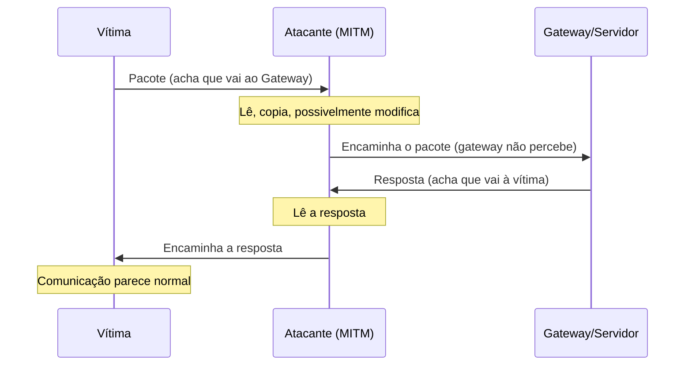
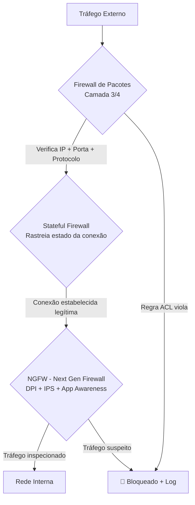
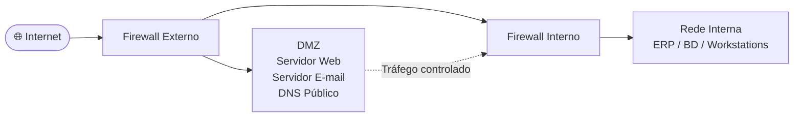
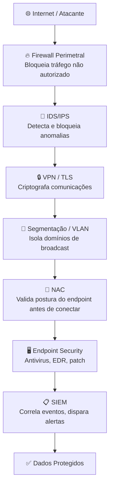

# Segurança de Redes

> [!quote] Protegendo a Infraestrutura
> *A segurança de redes é um componente essencial da segurança da informação, focada na proteção dos dados em trânsito e da infraestrutura que os transporta.*

---

## 🔐 Segurança da Informação

### 🎯 Objetivos (Tríade CID)

| Objetivo | Descrição |
|----------|-----------|
| **Confidencialidade** | Garantir que informações sejam acessadas apenas por autorizados |
| **Integridade** | Assegurar que dados não sejam alterados indevidamente |
| **Disponibilidade** | Manter sistemas e dados acessíveis quando necessário |

---

### ⚠️ Principais Ameaças

| Ameaça | Descrição |
|--------|-----------|
| **Malware** | Software malicioso (vírus, trojans, ransomware) |
| **Phishing** | Engenharia social para roubo de credenciais |
| **Força Bruta** | Tentativas repetidas de adivinhar senhas |

---

### 🛡️ Controles de Segurança

| Controle | Finalidade |
|----------|------------|
| **Políticas de Segurança** | Diretrizes e procedimentos |
| **Educação e Treinamento** | Conscientização dos usuários |
| **Auditorias** | Verificação de conformidade |

---

### 🔑 Criptografia

| Conceito | Descrição |
|----------|-----------|
| **Chave Pública** | Criptografia assimétrica para troca segura |
| **Chave Privada** | Descriptografia de dados |
| **Certificados Digitais** | Validação de identidade |

---

### 👤 Gestão de Identidade

| Componente | Função |
|------------|--------|
| **Autenticação** | Verificar quem é o usuário |
| **Autorização** | Definir o que o usuário pode fazer |
| **Gerenciamento de Acesso** | Controlar permissões |

---

## 🌐 Segurança de Redes

### 🔧 Dispositivos de Segurança

| Dispositivo | Função |
|-------------|--------|
| **Firewall** | Filtra tráfego entre redes |
| **IDS** (Intrusion Detection System) | Detecta atividades suspeitas |
| **IPS** (Intrusion Prevention System) | Detecta e bloqueia ameaças |

---

### 📡 Protocolos de Segurança

| Protocolo | Uso |
|-----------|-----|
| **SSL/TLS** | Comunicação web segura (HTTPS) |
| **IPSec** | Segurança na camada de rede |
| **SSH** | Acesso remoto seguro |

---

### 🛠️ Técnicas de Segurança

| Técnica | Descrição |
|---------|-----------|
| **VPN** | Túnel criptografado entre redes |
| **Filtragem de Pacotes** | Análise e bloqueio de tráfego |
| **NAC** (Network Access Control) | Controle de acesso à rede |

---

### 📊 Monitoramento de Rede

| Ferramenta | Função |
|------------|--------|
| **SIEM** | Correlação de eventos de segurança |
| **Análise de Tráfego** | Identificação de anomalias |
| **Log Management** | Registro e análise de eventos |

---

## ⚖️ Diferença: Segurança da Informação vs Segurança de Redes

> [!info] Comparativo

| Aspecto | Segurança da Informação | Segurança de Redes |
|---------|------------------------|-------------------|
| **Escopo** | Proteção de dados em todas as formas | Proteção de dados em trânsito |
| **Abrangência** | Aspectos físicos e digitais | Infraestrutura de rede |
| **Foco** | Acesso, uso, divulgação | Transmissão segura de dados |
| **Relação** | Conceito mais amplo | Subconjunto da segurança da informação |

---

## 💻 Segurança de Sistemas

> [!info] Definição
> Medidas e processos que protegem os dados e recursos de um sistema de computador.

### Componentes Protegidos

- Sistemas operacionais
- Aplicações e softwares
- Bases de dados

### Ameaças Específicas

| Ameaça | Descrição |
|--------|-----------|
| **Exploits de Software** | Exploração de vulnerabilidades |
| **Acesso Físico** | Invasão presencial não autorizada |
| **Engenharia Social** | Manipulação de pessoas |

### Controles

| Controle | Ação |
|----------|------|
| **Atualizações/Patches** | Correção de vulnerabilidades |
| **Controle de Acesso** | Restrição de permissões |
| **Antimalware** | Prevenção contra software malicioso |

### Testes de Segurança

| Teste | Objetivo |
|-------|----------|
| **Penetration Testing** | Simular ataques reais |
| **Análise de Vulnerabilidade** | Identificar pontos fracos |

---

## 📶 Segurança em Redes Sem Fio

> [!tip] Tópicos Importantes

| Aspecto | Descrição |
|---------|-----------|
| **Autenticação** | Controle de quem acessa a rede |
| **Criptografia** | WEP (obsoleto), WPA2, WPA3 |
| **Configuração Segura** | Boas práticas para redes domésticas |

> [!success] Saiba Mais
> [[Redes sem fio e sua segurança]]

---

## ⚔️ Ataques de Rede: Perspectiva Ofensiva (Como Funcionam)

> [!warning] Finalidade Educacional
> Entender como os ataques funcionam é o primeiro passo para se defender. O estudo da perspectiva ofensiva é parte essencial da formação em segurança de redes. A **prática** de qualquer técnica ofensiva é permitida SOMENTE em equipamentos e redes próprias ou em laboratórios legais (ex.: TryHackMe, máquina virtual local). Atacar sistemas de terceiros sem autorização expressa é crime no Brasil.

### 🧱 Cenário Geral: por que atacar redes?

O atacante tem dois objetivos principais ao mirar a camada de rede: **interceptar informação** (quebrar confidencialidade) ou **interromper serviço** (quebrar disponibilidade). Quase todos os ataques de rede se encaixam em uma dessas categorias. Compreender essa lógica ajuda a escolher a defesa correta para cada ameaça.

---

### 🕵️ Sniffing (Interceptação de Pacotes)

**O que é:** o atacante posiciona sua interface de rede em modo promíscuo, capturando todos os pacotes que trafegam no segmento, mesmo aqueles endereçados a outras máquinas.

**Por que funciona:** em redes legadas com hub (topologia barramento compartilhado), todos os pacotes chegam a todas as portas. Em redes com switch, o ataque precisa de um passo adicional, como ARP Spoofing, para redirecionar o tráfego.

**O que o atacante consegue capturar em protocolos sem criptografia:**
- Credenciais enviadas via HTTP, FTP, Telnet ou SMTP sem TLS
- Cookies de sessão
- Conteúdo de e-mails
- Consultas DNS (para onde o alvo está navegando)

**Ferramenta típica:** Wireshark, tcpdump, tshark.

**Defesas:**

| Mecanismo | Como protege |
|-----------|-------------|
| Usar HTTPS em vez de HTTP | Dados em trânsito ficam cifrados: o sniffer captura bytes sem sentido |
| TLS em todos os serviços (SMTP/IMAP/FTP) | Mesma lógica: criptografia de transporte |
| Switches gerenciados com port security | Limita quais MACs podem se comunicar por porta; dificulta sniffing |
| VPN | Todo tráfego sai cifrado da máquina antes de entrar na rede local |
| VLAN | Segmenta o tráfego: hosts em VLANs diferentes não compartilham o mesmo domínio de broadcast |

---

### 🎭 ARP Spoofing (Envenenamento ARP)

**O que é:** o protocolo ARP (Address Resolution Protocol) mapeia endereços IP para endereços MAC na rede local. Ele não tem autenticação: qualquer host pode enviar uma resposta ARP não solicitada (Gratuitous ARP) associando seu próprio MAC ao IP de outra máquina.

**Passo a passo do ataque:**

1. Atacante envia ARP Reply para a vítima dizendo: "o IP do gateway (ex.: 192.168.1.1) tem o meu MAC".
2. A vítima atualiza sua tabela ARP com a informação falsa.
3. O atacante também envia ARP Reply para o gateway dizendo: "o IP da vítima tem o meu MAC".
4. Todo o tráfego entre vítima e gateway passa agora pela máquina do atacante.
5. O atacante encaminha o tráfego normalmente (modo proxy), tornando o ataque invisível.

Este processo é chamado de **ARP Cache Poisoning** e é o pré-requisito mais comum para ataques MITM em redes locais.

---

### 🔴 MITM: Man-in-the-Middle (Homem no Meio)

> [!danger] Alta Severidade
> O MITM combina interceptação e, muitas vezes, modificação ativa do tráfego. É considerado um dos ataques mais graves em redes locais porque pode comprometer qualquer protocolo que não use criptografia de ponta a ponta robusta.

**Como funciona (fluxo completo via ARP Spoofing):**

**O que o atacante pode fazer no meio:**
- Ler credenciais em claro (login/senha via HTTP)
- Injetar conteúdo malicioso em páginas HTTP (ex.: adicionar script de keylogger)
- Realizar SSL Stripping: rebaixar conexão HTTPS para HTTP sem o usuário perceber (em sites sem HSTS)
- Capturar cookies de sessão e realizar session hijacking

**Defesas contra MITM:**

| Defesa | Mecanismo |
|--------|-----------|
| HTTPS com certificado válido | Criptografa o canal; o atacante vê texto cifrado |
| HSTS (HTTP Strict Transport Security) | O navegador recusa conexão HTTP mesmo se o site aceitar |
| Certificate Pinning | O cliente só aceita o certificado esperado, rejeitando certificados falsos |
| Dynamic ARP Inspection (DAI) | Switch valida respostas ARP contra tabela DHCP snooping; descarta spoofing |
| Segmentação com VLAN | Reduz o raio de alcance do ataque ao domínio de broadcast |

---

### 🌊 DoS e DDoS (Negação de Serviço)

**DoS (Denial of Service):** uma única origem envia volume massivo de tráfego ou requisições malformadas para exaurir recursos do alvo (CPU, memória, largura de banda, conexões TCP).

**DDoS (Distributed DoS):** o ataque parte de milhares de máquinas comprometidas (botnet) simultaneamente, tornando a filtragem por IP de origem ineficaz.

**Variantes comuns:**

| Tipo | Como funciona |
|------|--------------|
| **SYN Flood** | Envia milhares de pacotes TCP SYN sem completar o handshake; esgota a tabela de conexões semiabertas do servidor |
| **UDP Flood** | Envia pacotes UDP para portas aleatórias; servidor responde com ICMP "unreachable" para cada um, consumindo banda |
| **HTTP Flood** | Requisições HTTP GET/POST legítimas em volume absurdo; difícil de distinguir de tráfego real |
| **Amplification (ex.: DNS, NTP)** | Envia requisição pequena com IP de origem falsificado (IP da vítima); servidor responde com resposta grande para a vítima (fator de amplificação pode ser 50x) |
| **Slowloris** | Abre muitas conexões HTTP e as mantém abertas enviando cabeçalhos parciais; esgota conexões disponíveis do servidor |

**Contexto atual (2026):** segundo a Fortinet Global Threat Landscape 2026, os ataques globais de rede cresceram 18% ao ano. Volumes de DDoS de terabits por segundo já foram registrados contra infraestruturas financeiras e governamentais.

**Defesas:**

| Defesa | Aplicação |
|--------|-----------|
| Rate Limiting | Limita requisições por IP por segundo no firewall ou load balancer |
| SYN Cookies | Servidor não aloca recurso antes do handshake completo; neutraliza SYN Flood |
| Anycast + CDN | Distribui o tráfego de ataque entre múltiplos PoPs globais (ex.: Cloudflare, Akamai) |
| BCP38 / Unicast RPF | Filtragem de pacotes com IP de origem falso na borda da rede do ISP |
| IPS com detecção de anomalia | Detecta e bloqueia padrões de flood automaticamente |

---

### 🔍 Port Scanning (Varredura de Portas)

**O que é:** o atacante envia pacotes de sondagem para descobrir quais portas estão abertas em um host, identificando os serviços ativos e potenciais vetores de ataque.

**Por que isso importa na fase de reconhecimento:** antes de explorar uma vulnerabilidade, o atacante precisa saber o que está rodando. Um servidor com porta 22 (SSH) aberta pode ser alvo de força bruta de credenciais; porta 3306 (MySQL) exposta sem firewall é um vetor clássico de invasão.

**Tipos de scan mais comuns (Nmap):**

| Tipo de Scan | Flag Nmap | Comportamento |
|-------------|-----------|--------------|
| TCP Connect | `-sT` | Completa o three-way handshake; mais detectável |
| SYN Stealth | `-sS` | Envia SYN, recebe SYN-ACK, manda RST sem completar; mais silencioso |
| UDP Scan | `-sU` | Sonda serviços UDP (DNS, SNMP, NTP); mais lento |
| Version Detection | `-sV` | Identifica versão do serviço (ex.: Apache 2.4.51) |
| OS Detection | `-O` | Tenta identificar o sistema operacional pelo fingerprint TCP/IP |
| Script Scan | `-sC` | Roda scripts NSE para verificar vulnerabilidades conhecidas |

**Defesas:**
- Fechar portas desnecessárias no firewall (princípio do menor privilégio)
- Usar IDS/IPS para detectar varreduras (ex.: Snort, Suricata)
- Fail2ban: bloquear IP após X tentativas de conexão em intervalo curto
- Mover SSH para porta não padrão (segurança por obscuridade, não suficiente sozinha)
- Responder com "port closed" em vez de "port filtered" só para portas em uso legítimo

---

### 📊 Resumo: Ataques vs. Defesas

| Ataque | Camada OSI | Como funciona (resumo) | Defesa principal |
|--------|-----------|------------------------|-----------------|
| Sniffing | Enlace/Rede | Captura pacotes em modo promíscuo | Criptografia de transporte (TLS/HTTPS) |
| ARP Spoofing | Enlace | Envia ARP Reply falso para envenenar cache | Dynamic ARP Inspection (DAI) no switch |
| MITM | Enlace/Rede/Transporte | Posiciona-se entre vítima e gateway | HTTPS + HSTS + VLAN + DAI |
| SYN Flood | Transporte | Esgota tabela de conexões semiabertas | SYN Cookies + Rate Limiting |
| DDoS HTTP Flood | Aplicação | Volume massivo de requisições legítimas | CDN + WAF + Rate Limiting |
| Port Scan | Rede/Transporte | Sonda portas para mapear serviços | Firewall + IDS + Fail2ban |
| DNS Amplification | Rede | Usa servidores DNS abertos para amplificar ataque | BCP38 + desabilitar recursão aberta |
| SSL Stripping | Aplicação | Rebaixa HTTPS para HTTP | HSTS preloaded + certificado válido |

---

## 🔥 Firewall em Profundidade

### Tipos e Gerações

**Firewall de Pacotes (Stateless):** analisa cada pacote de forma independente, verificando IP de origem, IP de destino, porta e protocolo. Não tem memória de conexões anteriores. Simples e rápido, mas não detecta ataques que abusam do estado da conexão.

**Firewall Stateful:** mantém tabela de estado das conexões TCP ativas. Só permite pacotes de entrada que correspondam a uma conexão iniciada internamente. Bloqueia pacotes TCP com flag ACK que não correspondam a nenhuma conexão conhecida.

**NGFW (Next-Generation Firewall):** acrescenta ao stateful a inspeção profunda de pacotes (DPI), identificação de aplicação independente de porta (ex.: reconhece tráfego BitTorrent mesmo na porta 443), sistema de prevenção de intrusão (IPS) integrado e integração com inteligência de ameaças (threat feeds).

---

### Zonas de Segurança e DMZ

**DMZ (Zona Desmilitarizada):** rede intermediária onde ficam serviços acessíveis da internet (web, e-mail, DNS público). Se um servidor na DMZ for comprometido, o atacante ainda enfrenta o firewall interno para acessar a rede corporativa. É defesa em profundidade (defense-in-depth).

**Regra de ouro:** tráfego da internet pode chegar à DMZ; tráfego da DMZ NUNCA deve chegar à rede interna sem inspeção.

---

## 🧅 Defesa em Camadas (Defense in Depth)

> [!tip] Princípio Fundamental
> Nenhum controle de segurança é perfeito. A estratégia de defesa em profundidade assume que qualquer camada pode falhar e projeta múltiplos controles independentes. O atacante precisa comprometer todas as camadas; defender bem uma já eleva o custo do ataque.

| Camada | Controle | O que falha se só ela existir |
|--------|----------|-------------------------------|
| Perímetro | Firewall | Não detecta ataques internos (lateral movement) |
| Rede | IDS/IPS | Falsos positivos; não criptografa |
| Transporte | TLS/VPN | Não protege endpoints comprometidos |
| Host | Antivirus/EDR | Não vê tráfego de rede malicioso |
| Identidade | MFA | Não impede exploração de vulnerabilidade de software |
| Dados | Criptografia em repouso | Não protege dados em trânsito |

---

## 🚨 Aspectos Legais: O que você NÃO pode fazer

> [!danger] Lei Brasileira: Art. 154-A do Código Penal (Lei 12.737/2012, alterada pela Lei 14.155/2021)
> **"Invadir dispositivo informático alheio, conectado ou não à rede de computadores, com o fim de obter, adulterar ou destruir dados ou informações sem autorização expressa ou tácita do usuário do dispositivo ou de instalar vulnerabilidades para obter vantagem ilícita."**
>
> **Pena:** reclusão de 1 a 4 anos + multa. Agravada para 2 a 5 anos se houver obtenção de comunicações privadas, segredos comerciais ou controle remoto do dispositivo. Agravada em 1/3 a 2/3 se houver prejuízo econômico.
>
> Fazer port scan, sniffing, ARP spoofing ou qualquer técnica ofensiva em rede ou dispositivo de terceiro **sem autorização expressa** configura crime. "A rede era aberta" ou "eu só estava olhando" não são defesas válidas.

### O que é legal praticar:

| Ambiente | Exemplos |
|----------|---------|
| **Sua própria máquina** | Nmap no localhost, Wireshark na sua interface, testar firewall local |
| **Sua própria rede** | Auditoria da rede doméstica com autorização de todos os usuários |
| **Plataformas de CTF/lab legal** | TryHackMe, Hack The Box, PicoCTF, RootMe, VulnHub (VMs locais) |
| **Ambiente corporativo** | Com contrato de pentest assinado e escopo definido |

### O que NÃO é legal:

| Ação | Por quê é crime |
|------|----------------|
| Escanear portas de servidor de terceiro sem autorização | Art. 154-A: "instalar vulnerabilidades" e "obter dados sem autorização" |
| Fazer sniffing em rede pública (café, escola) | Captura dados alheios sem autorização |
| Executar ARP spoofing em rede da instituição | Interceptação de comunicações alheias |
| Usar Wireshark em rede corporativa sem permissão | Mesmo dentro da empresa, exige autorização formal |

---

## 🧪 Atividades Práticas (Somente Alvo Próprio ou Lab Legal)

> [!example] 🧪 Atividade 1: Mapeamento de Portas da Sua Própria Máquina com Nmap
>
> **Objetivo:** descobrir quais serviços estão expostos na sua máquina e avaliar se fazem sentido estar abertos.
>
> **Ferramenta:** Nmap (instalar via `sudo apt install nmap` no Linux ou baixar em nmap.org)
>
> **Procedimento:**
>
> 1. Descubra seu IP local: `ip a` (Linux) ou `ipconfig` (Windows).
> 2. Execute um scan básico no localhost: `nmap -sV localhost`
> 3. Execute um scan com detecção de SO e scripts padrão: `sudo nmap -sS -sV -sC -O localhost`
> 4. Execute um scan UDP nas portas mais comuns: `sudo nmap -sU --top-ports 20 localhost`
>
> **Resultado observável:** lista de portas abertas com o serviço identificado (ex.: `22/tcp open ssh OpenSSH 9.3`). Compare com o que você sabe que está rodando. Alguma porta aberta que você não esperava?
>
> **Análise:** para cada porta aberta, responda: eu sei por quê esse serviço está rodando? Ele precisa estar acessível externamente? Se não, como posso fechá-lo (firewall local ou parar o serviço)?
>
> **Variação:** substitua `localhost` pelo seu IP real na rede doméstica (ex.: `192.168.1.10`) para ver se a visibilidade muda a partir de outra perspectiva na mesma rede.

> [!example] 🧪 Atividade 2: Auditoria de Cabeçalhos de Segurança HTTP com securityheaders.com
>
> **Objetivo:** verificar se um site público configura corretamente os cabeçalhos de segurança que protegem os usuários contra ataques como XSS, clickjacking e SSL Stripping.
>
> **Ferramenta:** navegador + [securityheaders.com](https://securityheaders.com)
>
> **Procedimento:**
>
> 1. Acesse [securityheaders.com](https://securityheaders.com).
> 2. Insira o endereço de um site público (ex.: gov.br, iff.edu.br, g1.globo.com).
> 3. Analise o relatório gerado, prestando atenção em:
>    - **Strict-Transport-Security (HSTS):** o site força HTTPS? Por quanto tempo? Inclui subdomínios?
>    - **Content-Security-Policy (CSP):** o site restringe quais origens podem executar scripts?
>    - **X-Frame-Options:** o site proíbe ser embutido em iframes (proteção contra clickjacking)?
>    - **Referrer-Policy:** quanta informação o site vaza no cabeçalho Referer ao navegar para outros sites?
>
> **Resultado observável:** nota de A+ a F para o site analisado. Sites com nota D ou F estão desprotegidos contra ataques bem documentados.
>
> **Análise:** escolha dois sites com notas diferentes (ex.: um A+ e um D). O que o site com nota alta configurou que o com nota baixa não configurou? Qual ataque concreto o cabeçalho ausente permite?

> [!example] 🧪 Atividade 3: Captura e Análise de Tráfego com Wireshark (Sua Rede)
>
> **Objetivo:** identificar a diferença concreta entre tráfego cifrado (HTTPS) e em claro (HTTP) e compreender o que um atacante veria em uma rede sem criptografia.
>
> **Ferramenta:** Wireshark (download em wireshark.org, gratuito e open source)
>
> **Procedimento:**
>
> 1. Abra o Wireshark e selecione a interface de rede ativa (ex.: `eth0`, `wlan0`).
> 2. Inicie a captura clicando no ícone de barbatana de tubarão azul.
> 3. No navegador, acesse um site HTTP (sem HTTPS). Exemplo: `http://neverssl.com` (site criado exatamente para este fim educacional).
> 4. No filtro do Wireshark, digite: `http` e pressione Enter.
> 5. Observe os pacotes HTTP capturados. Clique em um pacote GET ou POST e expanda as camadas.
> 6. Agora acesse `https://www.google.com` e observe a diferença: com o filtro `tls`, você vê apenas handshakes e dados cifrados (Application Data), sem conseguir ler o conteúdo.
>
> **Resultado observável:** no tráfego HTTP você consegue ler URLs, cabeçalhos, e em formulários POST sem HTTPS até os campos enviados. No tráfego TLS você vê apenas bytes cifrados.
>
> **Análise:** use o filtro `dns` para ver as consultas DNS geradas enquanto navega. O DNS não é criptografado por padrão. O que isso revela sobre seus hábitos de navegação mesmo quando usa HTTPS? (Resposta: o destino fica visível, só o conteúdo é cifrado. Defesa: DNS over HTTPS ou DNS over TLS.)

---

## 📈 Panorama de Ameaças 2025-2026

> [!warning] Dados Recentes (Fontes 2025-2026)
> O cenário de ameaças evolui rapidamente. Os dados abaixo contextualizam por que segurança de redes é uma disciplina essencial e urgente.

- **+21%** de ataques cibernéticos globais no segundo trimestre de 2025 em relação ao mesmo período de 2024 (Check Point Research).
- **+18%** de volume semanal de ataques em 2026 versus 2025, com média de 1.968 ataques por semana por organização (SentinelOne, 2026).
- **7.831** vítimas confirmadas de ransomware em 2025, alta de **389%** em relação ao ano anterior (Fortinet Global Threat Landscape Report 2026).
- **80%** das atividades de engenharia social em 2025 foram assistidas por IA generativa, tornando phishing mais convincente e personalizado (IBM X-Force, 2025).
- Ataques MITM crescem em ambientes IoT: câmeras, roteadores domésticos e dispositivos industriais são alvos frequentes por terem firmware desatualizado e credenciais padrão.
- **40%** das invasões investigadas em resposta a incidentes tiveram phishing como vetor inicial (IBM X-Force Threat Intelligence Index 2025).

---

> [!note] 📚 Fontes (2025-2026)
>
> - [Cibersegurança em 2025: As Principais Ameaças e Como se Proteger (Skills Tecnologias)](https://skillstecnologicas.com/ciberseguranca/)
> - [Principais tendências em cibersegurança para 2025 e 2026 (RNP/ESR)](https://esr.rnp.br/seguranca/tendencias-de-ciberseguranca-2/)
> - [O Perigo dos Ataques Man-in-the-Middle (GabrielDevs, 2026)](https://www.gabrieldevs.com.br/2026/05/o-perigo-dos-ataques-man-in-middle-mitm.html)
> - [Tendências de Cibersegurança para 2026: Guia Completo (NovaRed)](https://novared.com.br/tendencias-da-ciberseguranca-para-2026/)
> - [MITM Attacks in 2026: Techniques, Risks & Prevention (EC-Council University)](https://www.eccu.edu/blog/mitm-attacks-2026-explained/)
> - [Top 10 Network Security Threats in 2026 (Faddom)](https://faddom.com/top-10-network-security-threats-in-2026-and-how-to-mitigate-them/)
> - [Key Cyber Security Statistics for 2026 (SentinelOne)](https://www.sentinelone.com/cybersecurity-101/cybersecurity/cyber-security-statistics/)
> - [90+ 2025 Cybersecurity Statistics and Trends (JumpCloud)](https://jumpcloud.com/blog/cyber-attack-statistics-trends)
> - [Firewall-Based Defense Strategies Against MITM (MESTE Journal)](https://mest.meste.org/MEST_Najava/XXVII_Cekerevac_Firewall.pdf)
> - [Aprenda a usar Nmap de forma ética (GabrielDevs, 2026)](https://www.gabrieldevs.com.br/2026/03/aprenda-usar-nmap-para-fazer-scanning.html)
> - [Art. 154-A do Código Penal (Planalto.gov.br)](https://www.planalto.gov.br/ccivil_03/_ato2019-2022/2021/lei/l14155.htm)
> - [Network Security in 2025: Threats, Security Models and Technologies (Faddom)](https://faddom.com/network-security-in-2025-threats-security-models-and-technologies/)
