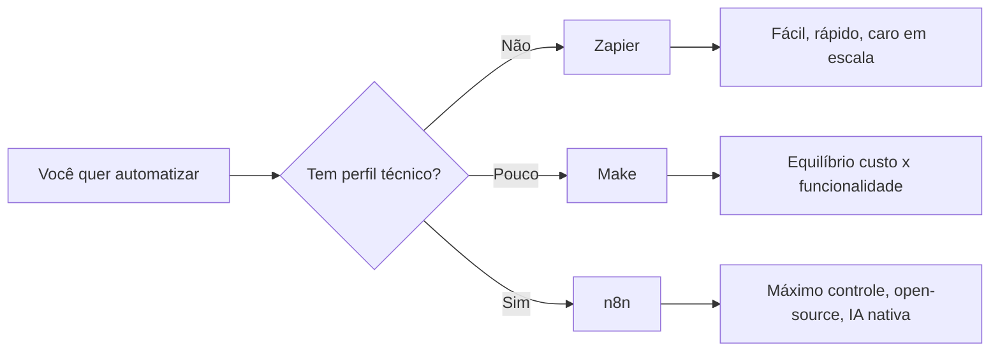
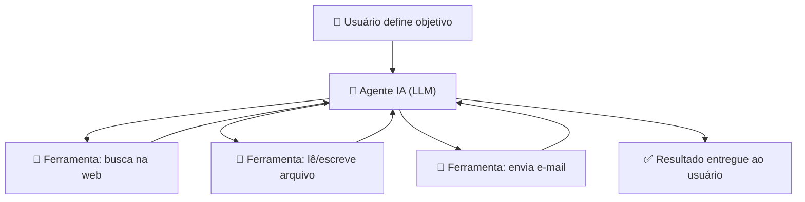
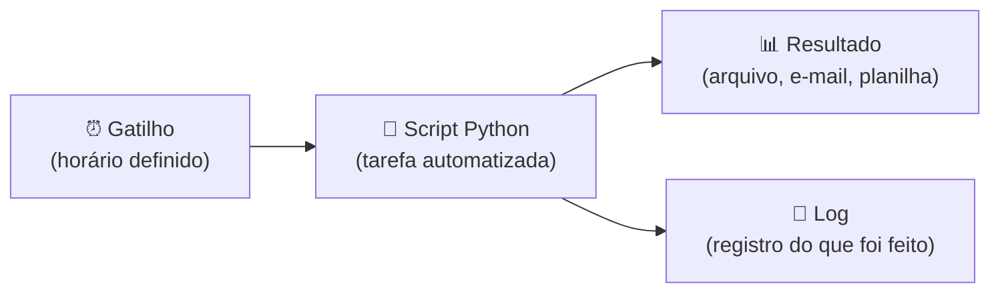
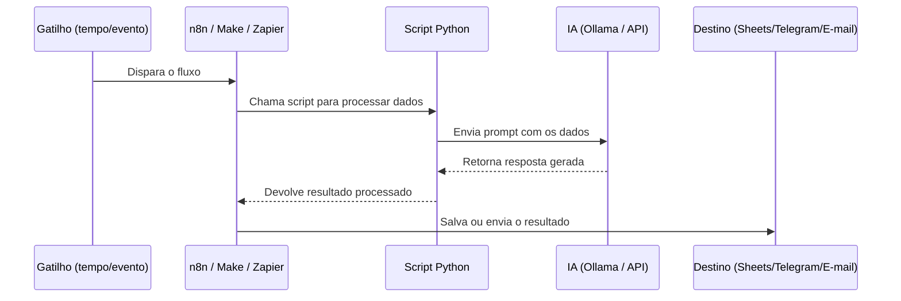
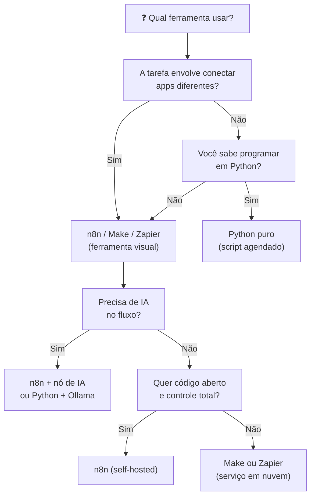

# Automações

> [!quote] Trabalhe Menos, Produza Mais
> *Automatizar tarefas é fazer com que o computador execute processos repetitivos sem intervenção humana.*

---

## 🎯 Objetivo Geral

> [!info] Meta da Disciplina
> Criar automações pessoais e profissionais combinando ferramentas visuais (n8n) com programação Python e inteligência artificial local (DeepSeek via Ollama ou outras IAs), formando um sistema eficiente, seguro e sem dependência de serviços pagos.

---

## 🔥 Conceitos Centrais

### 1. O que é Automação

> [!info] Definição
> Automatizar é fazer com que o computador execute processos repetitivos sem intervenção humana.

**Exemplos de automações:**
- Ler e-mails e extrair informações
- Gerar relatórios automáticos
- Enviar respostas automáticas
- Usar Inteligência Artificial para criar conteúdos

---

### 2. Ferramentas Principais

| Ferramenta | Função | Característica Principal |
|------------|--------|-------------------------|
| **n8n** | Criar fluxos visuais de automação | Interface fácil, open-source, sem limites |
| **Python** | Resolver tarefas complexas ou personalizadas | Linguagem poderosa e flexível |
| **Ollama** | Gerenciar modelos de IA localmente | IA privada, sem custo por uso |
| **DeepSeek R1 14B** | Modelo de linguagem para gerar texto | Responde como ChatGPT, mas local |
| **ChatGPT ou Cursor** | Auxiliar na criação de código | Planejamento e programação |

---

### 3. Como as Tecnologias se Conectam

> [!tip] Fluxo de Integração

- **n8n** coordena tudo: cria os fluxos de automação visualmente
- **Python** entra onde o n8n não consegue resolver sozinho
- **Ollama** disponibiliza o modelo de IA local
- **DeepSeek** é o "cérebro" que escreve, responde e gera relatórios

🔗 **Resumo do fluxo:**
```
n8n → (dispara ação) → Python → (se precisar) → Ollama/DeepSeek → (resposta) → Salvamento
```

---

## 🛠️ Habilidades a Desenvolver

- Criar **Workflows automáticos** usando n8n
- Integrar APIs e bancos de dados nos fluxos
- Usar **Python** para resolver limitações e criar módulos personalizados
- Rodar modelos de **Inteligência Artificial localmente**, com controle total
- Projetar sistemas de automação **escaláveis** e **offline**, sem depender de nuvem paga
- Entender boas práticas de orquestração e modularização de automações

---

## 🧠 Primeiros Projetos Práticos

| # | Projeto | Descrição |
|---|---------|-----------|
| 1 | **Primeiro Workflow** | Criar um fluxo que recebe texto e salva em arquivo |
| 2 | **Chamando Python** | Rodar script Python dentro do n8n |
| 3 | **Usando IA Local** | Enviar perguntas para DeepSeek via n8n |
| 4 | **Automatizar Emails** | Ler caixa de e-mail e gerar resumos diários |
| 5 | **Relatórios Automáticos** | Gerar relatórios Markdown com IA |

---

## 📢 Pontos Importantes

> [!success] Lembre-se

- **Não é preciso saber tudo de programação** para usar n8n
- **Com Python**, é possível desbloquear qualquer limitação do n8n
- **Usar IA local** garante segurança, privacidade e custo zero
- **Automação bem feita libera tempo** para focar em coisas importantes

---

## 🌐 O Cenário em 2025-2026: Automação com IA

O campo de automação passou por uma transformação profunda a partir de 2025. Ferramentas visuais como n8n, Make e Zapier incorporaram inteligência artificial como componente nativo dos fluxos: hoje não é mais preciso saber programar para criar um agente que lê e-mails, toma decisões e executa ações de forma autônoma.

> [!warning] Por que isso importa agora?
> Em 2024, menos de 1% dos softwares empresariais usavam agentes IA autônomos. Para 2028, a Gartner projeta que 33% das aplicações corporativas terão algum nível de automação agêntica. Quem aprender hoje já estará à frente.

### O que mudou na prática

- **n8n 2.0 (2025):** suporte nativo a LLMs, integração com MCP (Model Context Protocol), workflows ilimitados em todos os planos cloud, e o pacote `@n8n/ai-agent` (março de 2026) para criar agentes com memória e ferramentas customizadas.
- **Make com IA (outubro de 2025):** lançou seus próprios AI Agents com integração a OpenAI, Anthropic e Google.
- **Zapier AI:** adicionou IA como add-on pago, mas mantém o foco na simplicidade para usuários não técnicos.
- **Python + frameworks de agentes:** LangChain, CrewAI, LangGraph e AutoGen permitem construir agentes IA totalmente customizados diretamente em código.

---

## ⚖️ Comparando as Plataformas Visuais



| Ferramenta | Modelo de Preço | Suporte a IA | Curva de Aprendizado | Ideal para |
|------------|-----------------|--------------|----------------------|------------|
| **Zapier** | Por tarefa (task), plano starter ~US\$30/mês | Add-on pago | Baixa: 2h para o 1º fluxo | Equipes sem perfil técnico |
| **Make** | Por operação, ~US\$9/mês até 10k ops | AI Agents desde out/2025 | Média: 1-2 semanas | Equilíbrio entre preço e recursos |
| **n8n** | Self-hosted grátis, cloud a partir de ~€20/mês | Nativo: OpenAI, Anthropic, Ollama, Hugging Face | Média-alta, mas documentação excelente | Desenvolvedores e quem quer controle total |
| **Python puro** | Gratuito (só infra) | Total: qualquer API ou modelo local | Alta: precisa saber programar | Automações customizadas e complexas |

> [!tip] Dica para iniciantes
> Comece com n8n (versão gratuita self-hosted ou conta cloud no plano free). A interface visual acelera o aprendizado. Quando o fluxo precisar de lógica que o n8n não resolve sozinho, você escreve um script Python e o n8n chama esse script como um nó.

---

## 🤖 Agentes IA: Automação de Nova Geração

Um **agente IA** é uma automação que não apenas executa passos fixos: ele recebe um objetivo, toma decisões, usa ferramentas (busca na web, acessa APIs, lê arquivos) e age de forma autônoma até concluir a tarefa.



### Frameworks de Agentes IA (2026)

| Framework | Linguagem | Ponto Forte | Quando Usar |
|-----------|-----------|-------------|-------------|
| **LangGraph** | Python | Workflows com estado complexo, grafos de agentes | Produção empresarial, fluxos com muitas ramificações |
| **CrewAI** | Python | Crews multi-agente com papéis definidos | Equipes de agentes colaborando (ex.: pesquisador + redator) |
| **AutoGen** | Python | Conversas entre múltiplos agentes | Prototipagem rápida de sistemas multi-agente |
| **n8n AI Agent** | Visual | Agente dentro de fluxo visual, com memória | Quem quer agente sem escrever código Python |

> [!warning] Cuidado com loops infinitos
> Frameworks como AutoGen permitem que agentes "conversem entre si" sem parar. Sem uma condição de término clara, um loop pode consumir 5 a 10 vezes mais tokens (e dinheiro) do que o esperado. Sempre defina um número máximo de iterações.

---

## ⚙️ Automação com Python: Agendando Tarefas

Além das ferramentas visuais, é possível automatizar qualquer tarefa diretamente com Python e agendá-la para rodar sem intervenção. Há duas abordagens principais: o **cron** no Linux/macOS e o **Agendador de Tarefas** no Windows.

### Como funciona o Cron (Linux/macOS)

O cron usa uma tabela de horários chamada **crontab**. Cada linha define: quando rodar + o que rodar.

```
# Formato:
# minuto  hora  dia-do-mês  mês  dia-da-semana  comando
    0      9       *          *        *          python3 /home/usuario/relatorio.py
```

**Leitura da linha acima:** todo dia, às 9h00, rodar o script `relatorio.py`.

#### Atalhos úteis do crontab

| Expressão | Significado |
|-----------|-------------|
| `* * * * *` | A cada minuto |
| `0 9 * * *` | Todo dia às 9h |
| `0 9 * * 1` | Toda segunda-feira às 9h |
| `0 9 1 * *` | Todo dia 1 do mês às 9h |
| `*/15 * * * *` | A cada 15 minutos |

**Comandos do terminal:**
```bash
crontab -e    # abre o editor para adicionar/editar tarefas
crontab -l    # lista todas as tarefas agendadas
crontab -r    # remove todas as tarefas (cuidado!)
```

### Como funciona o Agendador de Tarefas (Windows)

No Windows, o equivalente ao cron é o **Agendador de Tarefas** (Task Scheduler). O caminho para acessá-lo é: Menu Iniciar, depois buscar "Agendador de Tarefas". Dentro dele, você cria uma "Tarefa Básica", define o gatilho (diário, semanal, ao iniciar o PC) e aponta para o script Python. Não é preciso nenhum código adicional.



---

## 🔄 Fluxo Completo de uma Automação Moderna



---

## 🧪 Atividades Mão na Massa

> [!example] 🧪 Atividade 1: Formulário que vira linha no Google Sheets via n8n
>
> **Ferramenta:** n8n (conta gratuita em n8n.io ou instalação local via Docker)
>
> **O que você vai fazer:**
> 1. Crie uma conta gratuita no n8n.io (ou rode localmente com `docker run -it --rm -p 5678:5678 n8nio/n8n`).
> 2. Crie um novo workflow e adicione o nó **Webhook** como gatilho. Copie a URL gerada.
> 3. Adicione o nó **Google Sheets** (ou **Airtable** como alternativa gratuita). Configure para adicionar uma nova linha.
> 4. Conecte o Webhook ao Google Sheets.
> 5. Abra o terminal (ou o Postman) e envie uma requisição POST para a URL do Webhook com um JSON de exemplo: `{"nome": "Maria", "curso": "TI", "nota": 9}`.
> 6. Ative o workflow e envie novamente o JSON.
>
> **Resultado observável:** Uma nova linha aparece automaticamente na sua planilha com os dados enviados, sem nenhuma intervenção manual. Repita o envio com dados diferentes e veja as linhas sendo criadas em tempo real.

---

> [!example] 🧪 Atividade 2: Script Python que renomeia arquivos automaticamente
>
> **Ferramenta:** Python 3 + módulo `os` (já vem instalado) + cron (Linux/macOS) ou Agendador de Tarefas (Windows)
>
> **O que você vai fazer:**
>
> 1. Crie uma pasta chamada `organizar/` no seu computador e coloque alguns arquivos com nomes aleatórios (ex.: `IMG_001.jpg`, `arquivo_final_v3.docx`, `notas.txt`).
>
> 2. Crie o arquivo `renomear.py` com o código abaixo:
>
> ```python
> import os
> from datetime import datetime
>
> pasta = "/caminho/para/organizar"  # troque pelo caminho real
> data_hoje = datetime.now().strftime("%Y-%m-%d")
>
> for arquivo in os.listdir(pasta):
>     if os.path.isfile(os.path.join(pasta, arquivo)):
>         nome, extensao = os.path.splitext(arquivo)
>         novo_nome = f"{data_hoje}_{nome}{extensao}"
>         os.rename(
>             os.path.join(pasta, arquivo),
>             os.path.join(pasta, novo_nome)
>         )
>         print(f"Renomeado: {arquivo} -> {novo_nome}")
> ```
>
> 3. Rode o script uma vez no terminal com `python3 renomear.py` e veja os arquivos serem renomeados com a data atual no início do nome.
>
> 4. Agende o script para rodar todo dia às 8h:
>    - **Linux/macOS:** abra o terminal, digite `crontab -e` e adicione a linha `0 8 * * * python3 /caminho/para/renomear.py >> /tmp/renomear.log 2>&1`
>    - **Windows:** abra o Agendador de Tarefas, crie uma tarefa básica com gatilho diário às 8h apontando para `python.exe renomear.py`
>
> **Resultado observável:** No dia seguinte às 8h, todos os arquivos novos na pasta terão sido renomeados automaticamente com o prefixo da data. No Linux, o arquivo `/tmp/renomear.log` mostrará o registro de cada arquivo processado.

---

> [!example] 🧪 Atividade 3: Agente IA simples que responde perguntas sobre um arquivo
>
> **Ferramenta:** Python 3 + Ollama (com modelo DeepSeek ou Llama 3 instalado)
>
> **Pré-requisito:** Ollama instalado e rodando localmente (`ollama run deepseek-r1:14b` ou `ollama run llama3`).
>
> **O que você vai fazer:**
>
> 1. Instale a biblioteca do Ollama para Python: `pip install ollama`
>
> 2. Crie o arquivo `agente_leitor.py`:
>
> ```python
> import ollama
>
> # Lê um arquivo de texto qualquer
> with open("notas.txt", "r", encoding="utf-8") as f:
>     conteudo = f.read()
>
> pergunta = input("Faça uma pergunta sobre o arquivo: ")
>
> resposta = ollama.chat(
>     model="deepseek-r1:14b",  # ou "llama3"
>     messages=[
>         {
>             "role": "user",
>             "content": f"Com base no texto a seguir, responda: {pergunta}\n\nTexto:\n{conteudo}"
>         }
>     ]
> )
>
> print("\nResposta do agente:")
> print(resposta["message"]["content"])
> ```
>
> 3. Crie um arquivo `notas.txt` com qualquer conteúdo (anotações de aula, uma receita, um resumo de disciplina).
>
> 4. Rode o script: `python3 agente_leitor.py` e faça uma pergunta sobre o conteúdo do arquivo.
>
> **Resultado observável:** O modelo de IA lê o arquivo localmente (sem enviar dados para a nuvem) e responde à sua pergunta com base no conteúdo. Troque o arquivo por uma ata de reunião, uma lista de tarefas ou um relatório e veja o agente responder perguntas diferentes.

---

## 📐 Quando Usar Cada Abordagem



---

## 📦 Boas Práticas de Automação

> [!tip] 5 Regras de Ouro

1. **Comece simples:** automatize uma única etapa antes de construir um fluxo complexo.
2. **Documente seu fluxo:** anote o que cada nó ou função faz. Em 3 meses você pode ter esquecido.
3. **Trate erros:** todo fluxo precisa de um caminho alternativo para quando algo falha (ex.: API fora do ar, arquivo não encontrado).
4. **Salve logs:** sempre registre o que foi executado, com data e hora. Isso facilita a depuração.
5. **Teste antes de agendar:** rode a automação manualmente pelo menos uma vez antes de colocá-la no cron ou no agendador.

> [!danger] Erros Comuns de Iniciantes
> - Agendar um script sem testar: o cron roda em um ambiente diferente do terminal, com menos variáveis de ambiente. Sempre especifique o **caminho completo** do Python e dos arquivos.
> - Não salvar logs: sem log, quando algo falha às 3h da manhã você não tem como saber o que aconteceu.
> - Automatizar sem entender: automatizar um processo errado apenas produz erros mais rápido. Mapeie o processo manual primeiro.

---

## 🔭 Tendências para Ficar de Olho

> [!abstract] O que vem por aí

- **MCP (Model Context Protocol):** padrão criado pela Anthropic (empresa do Claude) que permite que LLMs se conectem a ferramentas externas de forma padronizada. O n8n 2.0 já tem suporte nativo.
- **Agentes multi-step:** em vez de automações lineares (gatilho, ação, fim), os novos sistemas tomam múltiplas decisões antes de concluir uma tarefa.
- **IA local cada vez mais acessível:** modelos como DeepSeek R1, Llama 3 e Mistral rodam em notebooks comuns. Privacidade e custo zero são as grandes vantagens.
- **Low-code agêntico:** ferramentas como n8n estão convergindo para um modelo em que você descreve o objetivo em linguagem natural e o próprio sistema monta o fluxo.

---

> [!note] 📚 Fontes (2026)
> - [n8n como Sistema Operacional de Agentes de IA em 2026 (StayCloud)](https://staycloud.com.br/blog/alem-da-automacao-o-n8n-como-sistema-operacional-de-agentes-de-ia-em-2026/)
> - [Make vs n8n vs Zapier: comparativo 2026 (IBE IA)](https://blog.ibe.ia.br/blog/make-vs-n8n-vs-zapier-2/)
> - [n8n vs Make vs Zapier para agente IA em 2026 (IBE IA)](https://blog.ibe.ia.br/blog/n8n-vs-make-vs-zapier-pra-agente-ia/)
> - [Zapier, n8n e AI Agents: automação low-code (Método Viral)](https://metodoviral.com/en/blog/ai/zapier-n8n-and-ai-agents-low-code-automation-2/)
> - [Melhores Frameworks de Agentes de IA em 2026 (FlowHunt)](https://www.flowhunt.io/pt/blog/ai-agent-frameworks/)
> - [Cron no Linux: como agendar tarefas automáticas com Python (Asimov Academy)](https://hub.asimov.academy/blog/cron-no-linux/)
> - [Crontabs do Linux: Guia para Iniciantes em Python (Asimov Academy)](https://hub.asimov.academy/tutorial/crontabs-do-linux-o-guia-definitivo-para-iniciantes-em-python/)
> - [Automações IA: n8n, Zapier, Make e Agents Builder (Udemy)](https://www.udemy.com/course/automacoes-ia-n8n-zapier-make-e-agents-builder/)
