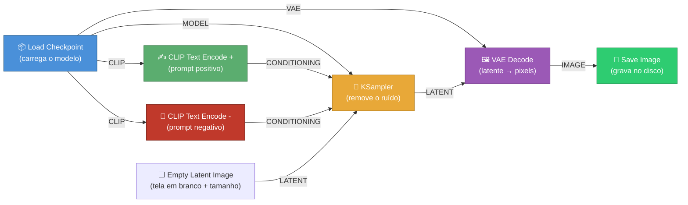
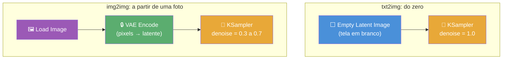
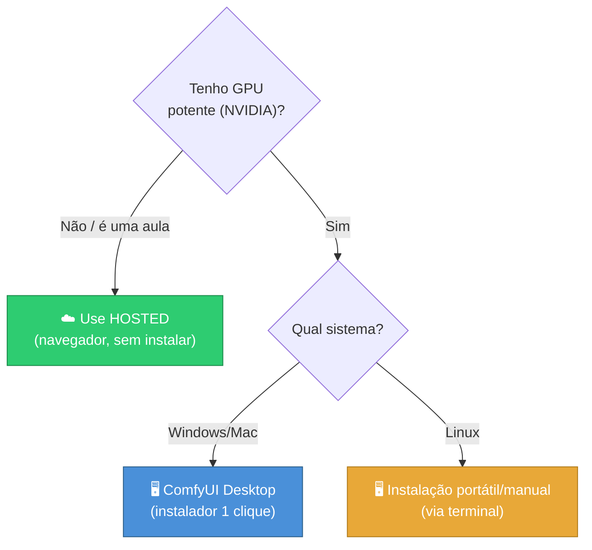

# ComfyUI - Automações com Imagens e Vídeos

> [!quote] Cada nó é uma decisão
> *Onde outras ferramentas escondem a geração de imagem atrás de um único botão, o ComfyUI abre a caixa-preta: você vê (e controla) cada etapa do caminho do ruído até a imagem final.*

![[comfyui-logo.png|160]]

---

## 🧩 O que é o ComfyUI?

O **ComfyUI** é um editor visual, gratuito e open-source, para rodar **modelos de difusão** (os modelos de IA que geram imagens, como Stable Diffusion, SDXL e Flux). Em vez de digitar só um prompt num campo, você monta um **grafo de nós**: cada caixinha (nó) faz uma tarefa, e você liga a saída de uma na entrada da outra.

> [!info] Analogia: a cozinha vs o micro-ondas
> Outras interfaces são como um **micro-ondas**: aperta um botão, sai a comida, você não vê o processo. O ComfyUI é a **cozinha profissional**: você escolhe o ingrediente (modelo), tempera (prompt), define o tempo de cozimento (passos), e cada panela é uma etapa visível. Dá mais trabalho, mas você controla (e repete) exatamente o prato.

> [!success] Por que isso importa em 2026
> Em 2025-2026, praticamente **todo modelo novo** (Flux.1, Stable Diffusion 3.5, modelos de vídeo estilo Wan) é lançado já com o seu **workflow de referência em formato ComfyUI**, não como um botão pronto. O repositório oficial passou de ~114 mil estrelas no GitHub e recebe uma nova versão a cada ~2 semanas. Saber ler um grafo virou requisito pra acompanhar a área.

---

## 🔌 Por que o modelo de nós é tão poderoso?

> [!tip] Vantagens do paradigma node-based

| Vantagem | O que significa na prática |
|----------|-----------------------------|
| **Transparência** | Você enxerga onde o ruído vira imagem; nada de mágica escondida |
| **Reuso** | Um workflow é um arquivo (`.json`); você salva, compartilha e reabre exatamente igual |
| **Modularidade** | Troca o nó do modelo sem refazer o resto; "pluga" inpainting, LoRA, ControlNet |
| **Reprodutibilidade** | Com a mesma *seed* e os mesmos nós, a mesma imagem sai de novo |
| **Branching** | Um mesmo prompt pode seguir dois caminhos (ex: uma imagem em alta e outra de preview) |

> [!info] Conexão com programação
> Se você já viu [[Conceitos gerais de programação]], o grafo de nós é um **dataflow**: dados (modelo, texto, imagem latente) "fluem" pelas conexões. Cada nó é como uma **função** com entradas e saídas tipadas, parecido com encaixar funções pequenas para formar um programa maior. A diferença é que aqui você programa **arrastando e ligando**, sem escrever código.

---

## 🗺️ Anatomia de um Workflow txt2img

O fluxo padrão de **texto para imagem** (txt2img) tem 6 nós. O diagrama mostra como os dados andam da esquerda (modelo) até a direita (imagem salva):

> [!info] Lendo o diagrama
> O **Load Checkpoint** alimenta quase tudo: manda o `MODEL` para o sampler, o `CLIP` para os dois encoders de texto, e o `VAE` para o decoder. O **KSampler** é o coração: recebe o modelo, os dois prompts e uma tela em branco, e devolve uma imagem ainda "comprimida" (latente). O **VAE Decode** traduz esse latente em pixels de verdade, e o **Save Image** grava o arquivo.

### Os nós, um por um

> [!example] 📦 Load Checkpoint
> Carrega o arquivo do modelo (`.safetensors`). Ele contém **três peças** que saem como saídas separadas: o **MODEL** (a rede que "imagina" a imagem, chamada UNet), o **CLIP** (o tradutor que entende seu texto) e o **VAE** (o conversor entre o mundo comprimido e os pixels).

> [!example] ✍️ CLIP Text Encode (prompt)
> Pega o seu texto e o transforma em **números que o modelo entende** (um vetor semântico). Há sempre dois: o **positivo** (o que você quer ver) e o **negativo** (o que você quer evitar, ex: "blurry, extra fingers").

> [!example] 🎲 KSampler (o motor)
> É onde a **difusão** acontece de fato. Ele parte de puro ruído e, passo a passo, "limpa" esse ruído guiando-se pelos prompts, até formar a imagem (ainda no espaço latente).

> [!example] ⬜ Empty Latent Image
> Define o **tamanho** da imagem (ex: 1024x1024) e cria a "tela em branco" latente onde o sampler vai trabalhar. Mudar largura/altura aqui muda a resolução final.

> [!example] 🖼️ VAE Decode
> Converte a imagem **latente** (a "linguagem interna" do modelo) em uma imagem de **pixels** que você consegue ver.

> [!example] 💾 Save Image
> Grava o resultado em disco (PNG) e mostra na tela. Surpresa útil: o PNG salvo guarda o **workflow inteiro embutido** nos metadados, então arrastar essa imagem de volta para o ComfyUI **reconstrói o grafo** que a gerou.

---

## 🎛️ Os botões do KSampler

O KSampler é o nó que mais muda o resultado. Vale conhecer seus parâmetros:

> [!tip] Parâmetros principais (e valores típicos em 2026)

| Parâmetro | O que faz | Dica prática |
|-----------|-----------|--------------|
| **seed** | Semente aleatória do ruído inicial | Fixe para **reproduzir** a mesma imagem; mude para variar |
| **steps** | Quantos passos de "limpeza" do ruído | Mais passos = mais refino, mas o ganho some acima de ~50 |
| **cfg** | O quanto o modelo "obedece" ao prompt | 7-12 funciona na maioria; alto demais distorce a imagem |
| **sampler** | O algoritmo de denoising | `euler` (rápido/criativo), `dpmpp_2m` (suave/fotorrealista) |
| **scheduler** | Como o ruído é distribuído nos passos | `karras` é a escolha segura por padrão |
| **denoise** | Quanto ruído remover (0.0 a 1.0) | **1.0** no txt2img; **abaixo de 1.0** no img2img (veja a seguir) |

---

## 🔄 txt2img vs img2img

A diferença entre gerar do zero e transformar uma imagem existente está em **um nó e um número**:

> [!info] A regra do denoise
> No **txt2img**, o sampler começa do ruído puro (`denoise = 1.0`). No **img2img**, você carrega uma imagem, converte para latente (**VAE Encode**) e usa um `denoise` **menor** (ex: 0.5): quanto mais baixo, mais o resultado **preserva** a imagem original; quanto mais alto, mais liberdade o modelo tem para reinventá-la.

> [!example] Caso de uso real
> img2img é como pedir a um ilustrador: "use **este rascunho** como base e finalize no seu estilo". Ótimo para: transformar um esboço em arte acabada, mudar o estilo de uma foto, ou refinar uma geração anterior.

---

## 🎬 E vídeo? (visão geral)

Gerar vídeo no ComfyUI segue a **mesma lógica de grafo**, só que com nós que entendem **movimento entre quadros**. Em 2026, três abordagens dominam:

> [!info] Famílias de geração de vídeo

| Abordagem | Tipo | Em uma frase |
|-----------|------|--------------|
| **AnimateDiff** | texto/imagem → vídeo curto | Adiciona "módulos de movimento" sobre o Stable Diffusion; clipes de ~2 a 16s |
| **SVD** (Stable Video Diffusion) | imagem → vídeo | Você dá o **primeiro quadro**, ele anima a partir dele (img2vid) |
| **Wan 2.2** | texto/imagem → vídeo | Modelo mais novo, voltado a movimento "cinematográfico" e maior coerência entre quadros |

> [!warning] Vídeo é pesado
> Gerar vídeo exige **muito mais VRAM** e tempo que imagem (cada vídeo é dezenas de quadros). Para uma primeira experiência, comece com **imagem** (txt2img). Vídeo costuma valer a pena depois que o fluxo de imagem já está confortável, e idealmente numa instância hosted com GPU forte.

---

## 💻 Instalar localmente vs usar hosted

> [!tip] Dois caminhos para começar

| Critério | 🖥️ Local (sua máquina) | ☁️ Hosted (na nuvem) |
|----------|------------------------|----------------------|
| **Custo** | Grátis (já tem o PC), mas precisa de GPU boa | Grátis com limite, ou pago por uso |
| **Hardware** | Exige GPU forte (NVIDIA com bastante VRAM) | Roda no servidor deles, você só usa o navegador |
| **Setup** | Baixar, instalar, configurar modelos | Abrir o link e começar |
| **Privacidade** | Tudo fica no seu PC | Imagens passam pelo servidor do provedor |
| **Ideal para** | Uso intenso, sem limite de tempo | Aula, teste rápido, quem não tem GPU |

### Opções de instalação local (2026)

> [!info] ComfyUI Desktop (recomendado para iniciantes)
> Instalador "um clique" (`.exe` no Windows). Configura sozinho o Python e as dependências.
> - **Windows:** Windows 10+ com **placa NVIDIA** (não suporta AMD no Desktop).
> - **macOS:** exige **Apple Silicon** (M1/M2/M3...).
> - **Linux:** o Desktop **ainda não é suportado**; use a instalação manual (ideal para quem tem GPU em servidor Linux).

> [!info] Versão portátil / manual
> Pacote que você descompacta e roda, sem instalador. Mais flexível e a forma padrão de rodar no **Linux**, porém pede mais familiaridade com terminal. É a rota dos usuários avançados e de quem roda em servidor.

---

## 🧱 Ecossistema de Custom Nodes

A força real do ComfyUI vem da **comunidade**: além dos nós nativos, existem **mais de 1.000 pacotes** de nós extras (custom nodes) que adicionam recursos novos (ControlNet, upscalers, integração com modelos específicos, ferramentas de vídeo, etc).

> [!info] ComfyUI Manager
> O **ComfyUI Manager** é o "gerenciador de extensões" do ecossistema (mantido pela comunidade, repo do `ltdrdata`). Ele permite **instalar, atualizar, desativar e remover** custom nodes por dentro da própria interface, sem mexer em arquivos manualmente. Já vem embutido na maioria das versões atuais.

> [!tip] O recurso que salva o dia: "Install Missing Custom Nodes"
> Você baixa um workflow incrível da internet, abre, e aparecem **nós vermelhos/triângulos amarelos**? Significa que faltam custom nodes. O Manager tem o botão **"Install Missing Custom Nodes"**, que detecta o que falta e instala de uma vez. É por isso que workflows da comunidade "simplesmente funcionam" depois de um clique.

---

## 🧪 Atividades Mão na Massa

> [!example] 🧪 Atividade 1: Sua primeira imagem (ComfyUI hosted, sem instalar nada)
>
> **Ferramenta:** [comfyai.run](https://comfyai.run/) (ComfyUI online com GPU grátis, link compartilhável, sem instalação).
> *Alternativa hosted:* [RunComfy](https://www.runcomfy.com/comfyui-web) ou [Comfy Cloud](https://cloud.comfy.org) (tem tier grátis com créditos mensais).
>
> **O que fazer:**
> 1. Abra o [comfyai.run](https://comfyai.run/) e inicie uma instância (procure um exemplo **"Stable Diffusion (SD)"** ou **"Flux"** na galeria de workflows).
> 2. O **workflow padrão txt2img** já vem montado na tela (você vai reconhecer os 6 nós do diagrama acima).
> 3. **Identifique** visualmente: Load Checkpoint, os dois CLIP Text Encode, o Empty Latent Image, o KSampler, o VAE Decode e o Save Image.
> 4. Clique no nó **CLIP Text Encode positivo** e troque o texto por: `a cute robot teaching a class, digital art, vibrant colors`.
> 5. Clique em **Queue** (Executar) e aguarde a geração.
>
> **Resultado observável:** uma **imagem nova** aparece no nó Save Image. Baixe/exporte o PNG.
>
> **Entregável:** o **arquivo PNG gerado** + um print da tela mostrando o grafo de nós com o seu prompt visível no CLIP Text Encode.

---

> [!example] 🧪 Atividade 2: O poder da seed (reprodutibilidade)
>
> **Ferramenta:** a mesma instância hosted da Atividade 1.
>
> **O que fazer:**
> 1. Mantenha o mesmo prompt da Atividade 1.
> 2. No **KSampler**, anote o valor atual de **seed**. Se estiver em modo "randomize", troque para **fixed** (fixo).
> 3. Gere a imagem (Queue) **duas vezes** com a **mesma seed**. Compare as duas saídas.
> 4. Agora **mude a seed** (qualquer outro número) e gere de novo.
>
> **Resultado observável:**
> - Mesma seed + mesmo prompt = imagens **idênticas** (prova da reprodutibilidade).
> - Seed diferente = imagem **diferente**, mesmo com o prompt igual.
>
> **Entregável:** as **3 imagens** (duas idênticas + uma diferente) e os respectivos valores de seed anotados.

---

> [!example] 🧪 Atividade 3: Mexa no motor (steps e cfg)
>
> **Ferramenta:** a mesma instância hosted.
>
> **O que fazer:**
> 1. Fixe a **seed** (para isolar o efeito dos parâmetros) e mantenha o prompt.
> 2. Gere uma imagem com **steps = 8** e outra com **steps = 30**. Observe a diferença de refino.
> 3. Agora volte os steps a um valor normal (ex: 20) e gere duas: uma com **cfg = 3** e outra com **cfg = 15**.
>
> **Resultado observável:**
> - Poucos steps tendem a sair mais "cru"/borrado; mais steps refinam (até saturar).
> - cfg baixo = imagem mais "solta" e às vezes fora do prompt; cfg alto = mais colada ao prompt, mas pode ficar saturada/artificial.
>
> **Entregável:** uma pequena **grade comparativa** (4 imagens) com a legenda dos parâmetros usados em cada uma.

---

> [!example] 🧪 Atividade 4 (opcional, avançado): Reconstruir um workflow a partir do PNG
>
> **Ferramenta:** ComfyUI hosted (Atividade 1) **ou** ComfyUI local instalado.
>
> **O que fazer:**
> 1. Pegue a imagem PNG que **você gerou** na Atividade 1 (não vale imagem baixada de outro lugar que não seja do ComfyUI).
> 2. **Arraste o arquivo PNG** para dentro da tela do ComfyUI.
>
> **Resultado observável:** o **grafo inteiro que gerou aquela imagem se reconstrói sozinho** na tela (prompt, seed, parâmetros, tudo), porque o workflow fica embutido nos metadados do PNG.
>
> **Entregável:** print mostrando o workflow reconstruído a partir do arrasto do PNG.

---

## ❓ Quiz Conceitual (opcional)

> [!question] Teste seu entendimento
> 1. Quais **três peças** saem do nó Load Checkpoint, e para onde cada uma vai?
> 2. Qual nó é o "motor" onde a difusão (remoção de ruído) acontece?
> 3. Por que o **VAE Decode** é necessário no fim do fluxo?
> 4. Para transformar uma foto existente (img2img) em vez de gerar do zero, qual nó você adiciona e qual parâmetro do KSampler você reduz?
> 5. Você abriu um workflow da internet e vários nós estão em vermelho. Qual ferramenta resolve, e com qual botão?

> [!success] Respostas
> 1. **MODEL** (→ KSampler), **CLIP** (→ os dois CLIP Text Encode), **VAE** (→ VAE Decode).
> 2. O **KSampler**.
> 3. Porque o KSampler entrega a imagem no **espaço latente** (comprimido); o VAE Decode converte para **pixels** visíveis.
> 4. Adiciona o **VAE Encode** (a partir de um Load Image) e reduz o **denoise** (abaixo de 1.0).
> 5. O **ComfyUI Manager**, botão **"Install Missing Custom Nodes"**.

---

## 📎 Veja Também

- [[Tópicos/Roadmap do futuro/Inteligência artificial|Inteligência artificial]]
- [[Conceitos gerais de programação]]
- [[Automações]]

---

> [!note] 📚 Fontes (2026)
> - [ComfyUI Text to Image Workflow (documentação oficial)](https://docs.comfy.org/tutorials/basic/text-to-image)
> - [KSampler (documentação oficial de nós built-in)](https://docs.comfy.org/built-in-nodes/sampling/ksampler)
> - [System Requirements (documentação oficial ComfyUI)](https://docs.comfy.org/installation/system_requirements)
> - [Beginner's Guide to ComfyUI | Stable Diffusion Art](https://stable-diffusion-art.com/comfyui/)
> - [ComfyUI Tutorial: SDXL & FLUX in 13 Steps (2026)](https://tech-insider.org/comfyui-tutorial-sdxl-flux-workflow-13-steps-2026/)
> - [ComfyUI Desktop Installation Guide | ComfyUI Wiki](https://comfyui-wiki.com/en/install/install-comfyui/comfyui-desktop-installation-guide)
> - [Install ComfyUI On Mac | ComfyUI Wiki](https://comfyui-wiki.com/en/install/install-comfyui/install-comfyui-on-mac)
> - [How to Install ComfyUI Custom Nodes | ComfyUI Wiki](https://comfyui-wiki.com/en/install/install-custom-nodes)
> - [ComfyUI Manager (repositório oficial, ltdrdata)](https://github.com/ltdrdata/ComfyUI-Manager)
> - [ComfyUI Animation Workflow Guide 2026 | Apatero](https://apatero.com/blog/comfyui-animation-workflow-video-generation-2026)
> - [How to run Stable Video Diffusion img2vid | Stable Diffusion Art](https://stable-diffusion-art.com/stable-video-diffusion-img2vid/)
> - [Free ComfyUI Online Cloud by ComfyAI.run](https://comfyai.run/)
> - [Comfy Cloud (tier grátis com créditos)](https://comfy.org/cloud/)
