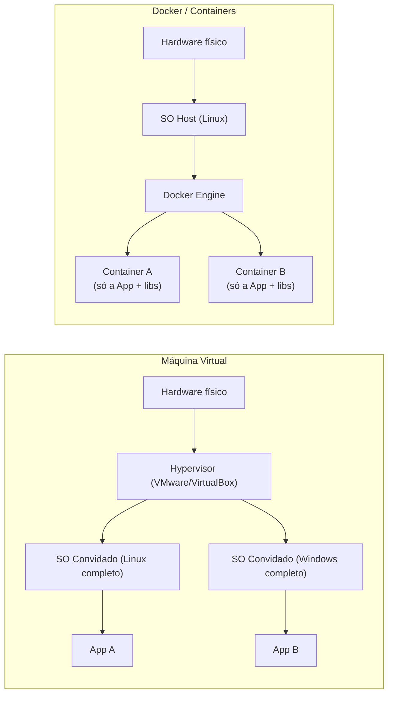
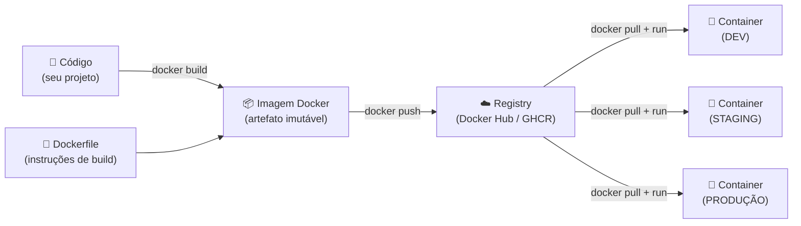

# Docker - Gerenciamento de Containers

> [!quote] Containerização
> *Docker permite empacotar aplicações com todas as suas dependências, garantindo que rodem de forma consistente em qualquer ambiente.*

---

## 🤔 O que são Containers?

> [!info] Conceito
> Containers são como "caixas" que encapsulam uma aplicação e todas as suas dependências (bibliotecas, configurações, etc.). Servem para garantir que uma aplicação seja executada de forma consistente em diferentes ambientes.

- Resolve o problema: **"Na minha máquina funciona!"**
- Não é máquina virtual!
- Única missão de um container é fazer uma aplicação específica funcionar!

![[Recursos/Roadmap do futuro/Docker - gerenciamento de containers/image.png|Conceito de containers]]

---

## 📊 Exemplo sem Container

![[Recursos/Roadmap do futuro/Docker - gerenciamento de containers/image 1.png|Exemplo sem container]]

---

## 📦 Exemplo com Container

![[Recursos/Roadmap do futuro/Docker - gerenciamento de containers/image 2.png|Exemplo com container]]

---

## ⚖️ Docker x VMs

![[Recursos/Roadmap do futuro/Docker - gerenciamento de containers/image 3.png|Comparação Docker vs VMs]]

A diferença fundamental entre Docker e uma Máquina Virtual (VM) está em onde cada um roda. Uma VM emula hardware completo, incluindo um sistema operacional inteiro. Um container compartilha o kernel do host e isola apenas o processo da aplicação. O resultado é um container que inicia em milissegundos e ocupa megabytes, enquanto uma VM demora minutos e ocupa gigabytes.



> [!tip] Por que containers são mais leves?
> Containers não carregam um sistema operacional inteiro: reaproveitam o kernel do host. Uma imagem Ubuntu no Docker tem cerca de 29 MB; uma VM Ubuntu completa exige 2 GB ou mais.

---

## 📜 Surgimento do Docker

| Década | Marco |
|--------|-------|
| **1990s** | Primeiras formas de isolamento de processos (chroot) |
| **2000s** | Surgimento de LXC (Linux Containers) |
| **2013** | Lançamento do Docker |

> [!example] Exemplo de chroot
> O conceito de isolamento surgiu com o `chroot`, que permite alterar o diretório raiz de um processo:

```bash
# Cria um diretório
sudo mkdir -p /mycontainer

# Copia binários essenciais e monta um sistemas de arquivos
sudo cp -R /bin /lib /lib64 /usr /mycontainer/
sudo mkdir -p /mycontainer/{dev,proc,sys}
sudo mount -t proc proc /mycontainer/proc
sudo mount -t sysfs sys /mycontainer/sys
sudo mount -o bind /dev /mycontainer/dev
sudo mount -t devpts devpts /mycontainer/dev/pts

# Usa chroot para mudar a raiz do sistema, criando um ambiente isolado.
sudo chroot /mycontainer /bin/bash
```

![[Recursos/Roadmap do futuro/Docker - gerenciamento de containers/image 4.png|Container nativo no Linux]]

---

## 🐳 O que é Docker?

> [!info] Definição
> Docker é uma plataforma de virtualização de containers que permite empacotar, distribuir e executar aplicações de forma isolada e consistente. Diferente das máquinas virtuais tradicionais, containers Docker compartilham o kernel do sistema operacional host, tornando-os mais leves e eficientes.

---

## 📈 Docker no Mercado (2025-2026)

Os números mostram que Docker saiu de tecnologia de nicho para infraestrutura padrão da indústria:

| Indicador | Valor (2025/2026) |
|-----------|------------------|
| Profissionais de TI que usam Docker | **92%** (era 80% em 2024) |
| Desenvolvedores profissionais com Docker | **71%** (alta de 17 pontos em 1 ano) |
| Participação no mercado de containerização | **87%** |
| Downloads mensais de containers no Docker Hub | **13 bilhões** |
| Tamanho do mercado (2026) | **USD 7,4 bilhões** |
| Crescimento anual projetado (CAGR) | **21%** ao ano até 2031 |

> [!info] Por que esses números importam?
> Docker não é mais uma "ferramenta opcional". Em 2026, saber Docker é tão esperado de um profissional de TI quanto saber Git. Empresas contratam esperando que o candidato já saiba criar e gerenciar containers.

**Novidades de 2025-2026:**
- Docker Hardened Images: mais de 1.000 imagens com segurança reforçada, gratuitas no Docker Hub
- Docker Model Runner: suporte nativo a modelos de IA (como Qwen) rodando em containers locais
- Docker MCP Toolkit: integração com servidores MCP para agentes de IA
- Containers com namespace de tempo privado (isolamento ainda mais forte no Linux)

---

## ✨ Principais Benefícios

| Benefício | Descrição |
|-----------|-----------|
| **Isolamento** | Cada container roda de forma isolada |
| **Portabilidade** | "Build once, run anywhere" |
| **Eficiência** | Mais leve que VMs tradicionais |
| **Escalabilidade** | Facilita múltiplas instâncias |

---

## 🧩 Componentes Principais

### Docker Engine

O mecanismo principal do Docker que cria e gerencia containers. É um daemon (processo em segundo plano) que responde a comandos via CLI ou API. Quando você digita `docker run`, é o Docker Engine que interpreta o comando, baixa a imagem necessária, cria o container e o executa.

### Docker Hub

> [!info] Repositório de Imagens
> 🔗 [hub.docker.com](https://hub.docker.com/search?badges=official)

O Docker Hub é o registro público oficial de imagens Docker:

- Repositório oficial de imagens base e populares
- Repositórios públicos e privados
- Integração com sistemas de CI/CD
- Controle de versões através de tags

Além do Docker Hub, existem outros registries: GitHub Container Registry (`ghcr.io`), Google Artifact Registry, Amazon ECR e registries privados auto-hospedados.

### Dockerfile

> [!info] Arquivo de Configuração
> Arquivo de texto que contém todas as instruções para criar uma imagem Docker.

```jsx
FROM node:14
WORKDIR /app
COPY package*.json ./
RUN npm install
COPY . .
EXPOSE 3000
CMD ["npm", "start"]
```

---

## 🏗️ Sobre Componentes e Camadas

### Imagens

- Templates imutáveis para criar containers
- Contêm código, runtime, bibliotecas e configurações
- Construídas em camadas (cada instrução cria uma nova camada)

![[Recursos/Roadmap do futuro/Docker - gerenciamento de containers/image 5.png|Camadas de imagens Docker]]

O sistema de camadas traz uma vantagem enorme: **reaproveitamento**. Se dois projetos usam `FROM python:3.11`, as camadas base são baixadas e armazenadas uma única vez no disco. Só as camadas que diferem entre as duas imagens precisam de espaço extra.

### Volumes

São espaços de armazenamento para persistir dados (como um HD virtual).

Por padrão, tudo que um container escreve no disco desaparece quando o container é removido. Volumes resolvem isso: os dados ficam no host e sobrevivem à exclusão do container. Isso é essencial para bancos de dados, uploads de usuários e qualquer dado que precise persistir.

```bash
# Criar um volume nomeado
docker volume create meus-dados

# Usar o volume ao rodar o container
docker run -v meus-dados:/app/data minha-imagem
```

### Redes

| Tipo | Descrição |
|------|-----------|
| **bridge** | Rede padrão para containers em um único host |
| **host** | Containers compartilham a rede do host |
| **none** | Desabilita a rede para o container |

Containers na mesma rede `bridge` personalizada podem se comunicar pelo **nome do container** como hostname, sem precisar de endereço IP fixo. É assim que o Flask encontra o MySQL no exemplo da prática: o host de conexão é simplesmente `db` (nome do serviço no Compose).

---

## 🔄 Fluxo: Código para Container em Produção

O diagrama abaixo mostra o ciclo completo, do código do desenvolvedor até o container rodando em produção:



> [!tip] "Build once, run anywhere" na prática
> A imagem publicada no registry é exatamente a mesma que roda em DEV, STAGING e PRODUÇÃO. Não há surpresa de ambiente: o que funciona no seu notebook é o que vai para o servidor.

---

## 💻 Instalação do Docker

### Windows

> [!info] Requisitos
> - Windows 10 ou superior atualizado
> - WSL versão 1.1.3 ou superior

🔗 [Instalação Docker Desktop](https://docs.docker.com/desktop/setup/install/windows-install/)

#### Instalando WSL

🔗 [Documentação WSL](https://learn.microsoft.com/pt-br/windows/wsl/install)

1. No PowerShell como administrador:

```bash
wsl --install
```

2. Reiniciar e abrir a aplicação "Ubuntu"
3. Criar usuário e senha para o sistema Linux

#### Docker Desktop

1. Baixar e instalar do [site oficial](https://docs.docker.com/desktop/setup/install/windows-install/)
2. Testar:

```bash
docker run hello-world
```

### Linux

🔗 [Instalação para Linux](https://docs.docker.com/desktop/setup/install/linux/)

---

## 🔧 Principais Comandos do Docker

### Gerenciamento de Imagens

| Comando | Descrição |
|---------|-----------|
| `docker build .` | Constrói uma imagem a partir de um Dockerfile |
| `docker pull [imagem]` | Baixa uma imagem do Docker Hub |
| `docker images` | Lista todas as imagens locais |
| `docker rmi [imagem]` | Remove uma imagem específica |

### Gerenciamento de Containers

| Comando | Descrição |
|---------|-----------|
| `docker run [imagem]` | Cria e inicia um novo container |
| `docker ps` | Lista containers em execução |
| `docker ps -a` | Lista todos os containers |
| `docker start [container]` | Inicia um container existente |
| `docker stop [container]` | Para um container em execução |
| `docker rm [container]` | Remove um container |

### Logs e Debugging

| Comando | Descrição |
|---------|-----------|
| `docker logs [container]` | Exibe logs do container |
| `docker exec -it [container] bash` | Acessa o terminal do container |

### Opções Comuns do docker run

| Flag | Descrição |
|------|-----------|
| `-d` | Executa em modo detached (background) |
| `-p [host]:[container]` | Mapeia portas |
| `-v [host]:[container]` | Monta volumes |
| `--name [nome]` | Define um nome para o container |
| `-t` | Define uma tag/nome para a imagem |

---

## 🧪 Atividades Mão na Massa

> [!example] 🧪 Atividade 1: Seu primeiro container
>
> **Objetivo:** verificar que o Docker está funcionando e observar o ciclo completo de uma execução.
>
> **Passo 1:** rode o container oficial de boas-vindas:
> ```bash
> docker run hello-world
> ```
> **Resultado esperado:** o Docker baixa a imagem `hello-world` do Docker Hub, cria um container, executa uma mensagem de confirmação e encerra. Você verá a linha `Hello from Docker!` no terminal.
>
> **Passo 2:** suba um servidor web Nginx em segundo plano:
> ```bash
> docker run -d -p 8080:80 --name meu-nginx nginx
> ```
> **Resultado esperado:** o terminal devolve apenas o ID do container (nada trava). Abra o navegador em `http://localhost:8080` e veja a página padrão do Nginx: `Welcome to nginx!`.
>
> **Passo 3:** inspecione os containers ativos e todas as imagens baixadas:
> ```bash
> docker ps -a
> docker images
> ```
> Identifique na saída: o nome `meu-nginx`, o status `Up`, a porta `0.0.0.0:8080->80/tcp` e as imagens `hello-world` e `nginx` listadas localmente.
>
> **Passo 4 (limpeza):** pare e remova o container:
> ```bash
> docker stop meu-nginx
> docker rm meu-nginx
> ```

---

> [!example] 🧪 Atividade 2: Escreva e empacote sua própria aplicação
>
> **Objetivo:** criar um Dockerfile do zero, construir uma imagem personalizada e rodar sua própria aplicação em container.
>
> **Passo 1:** crie uma pasta para o projeto e entre nela:
> ```bash
> mkdir meu-app && cd meu-app
> ```
>
> **Passo 2:** crie o arquivo `app.py` com o conteúdo abaixo (aplicação Flask mínima):
> ```python
> from flask import Flask
> app = Flask(__name__)
>
> @app.route("/")
> def home():
>     return "<h1>Olá do meu container Docker!</h1>"
>
> if __name__ == "__main__":
>     app.run(host="0.0.0.0", port=5000)
> ```
>
> **Passo 3:** crie o arquivo `requirements.txt`:
> ```
> flask
> ```
>
> **Passo 4:** crie o `Dockerfile`:
> ```dockerfile
> FROM python:3.11-slim
> WORKDIR /app
> COPY requirements.txt .
> RUN pip install --no-cache-dir -r requirements.txt
> COPY . .
> EXPOSE 5000
> CMD ["python", "app.py"]
> ```
>
> **Passo 5:** construa a imagem com a tag `meu-app:v1`:
> ```bash
> docker build -t meu-app:v1 .
> ```
> **Resultado esperado:** o Docker executa cada instrução do Dockerfile em sequência e exibe `Successfully built` ao final.
>
> **Passo 6:** rode o container mapeando a porta:
> ```bash
> docker run -d -p 5000:5000 --name minha-app meu-app:v1
> ```
> Abra `http://localhost:5000` no navegador. Você verá: **Olá do meu container Docker!**
>
> **Passo 7:** confirme que a imagem está listada localmente:
> ```bash
> docker images
> ```
> Localize `meu-app` com a tag `v1` e o tamanho em MB.

---

## 🎼 Docker Compose

> [!info] Orquestração Multi-Container
> Docker Compose permite definir e executar múltiplos containers de forma declarativa através de um único arquivo YAML.

Quando uma aplicação cresce, ela passa a depender de vários serviços: banco de dados, cache, fila de mensagens, servidor web. Gerenciar cada container manualmente com `docker run` vira um pesadelo. O Compose resolve isso com um único arquivo `docker-compose.yml` que descreve todos os serviços, redes e volumes do projeto, e um único comando para subir tudo:

```bash
docker compose up -d
```

A diferença entre `docker-compose` (V1, Python, instalado separado) e `docker compose` (V2, Go, integrado ao Docker Engine) é que a V1 foi descontinuada. Em instalações modernas (Docker Engine 20.10+), use sempre `docker compose` sem hífen.

---

## 🎯 Prática: Dockerizando uma Aplicação Flask-Login

🔗 [Repositório do Projeto](https://github.com/devmoreir4/sample-flask-auth)

### Parte I: Banco de Dados em Container

#### 1. Criar docker-compose.yml

```yaml
services:
  db:
    image: mysql:latest
    container_name: mysql-container
    restart: always
    environment:
      MYSQL_USER: ${MYSQL_USER}
      MYSQL_PASSWORD: ${MYSQL_PASSWORD}
      MYSQL_DATABASE: ${MYSQL_DATABASE}
      MYSQL_ROOT_PASSWORD: ${MYSQL_ROOT_PASSWORD}
    ports:
      - "3306:3306"
    expose:
      - '3306'
    volumes:
      - ../flask-files/mysql:/var/lib/mysql
```

#### 2. Criar arquivo .env

```bash
MYSQL_USER=admin
MYSQL_PASSWORD=admin123
MYSQL_DATABASE=flask-crud
MYSQL_ROOT_PASSWORD=admin123
SECRET_KEY = 'secretkeytest'
```

#### 3. Executar e buildar

```bash
docker-compose up --build
```

#### 4. Executar a aplicação

```bash
python app.py
```

#### 5. Verificar dados no container MySQL

```bash
# Acessar o container
docker exec -it mysql-container bash

# Conectar ao MySQL
mysql -u admin -p

# Selecionar banco e listar dados
USE flask-crud;
SHOW TABLES;
SELECT * FROM user;

# Sair
EXIT;
exit
```

---

### Parte II: Dockerizando 100% do Projeto

#### 1. Criar Dockerfile

```dockerfile
# Usa uma imagem oficial do Python como base
FROM python:3.11

# Define o diretório de trabalho dentro do contêiner
WORKDIR /app

# Copia os arquivos do projeto para o contêiner
COPY . .

# Instala as dependências
RUN pip install --no-cache-dir -r requirements.txt

# Define a variável de ambiente para evitar buffer no output
ENV PYTHONUNBUFFERED=1

# Expõe a porta 5000
EXPOSE 5000

# Comando para rodar a aplicação
CMD ["python", "app.py"]
```

#### 2. Atualizar docker-compose.yml

```yaml
services:
  app:
    build:
      context: .
      dockerfile: Dockerfile
    container_name: flask-container
    environment:
      - SECRET_KEY=${SECRET_KEY}
      - MYSQL_USER=${MYSQL_USER}
      - MYSQL_PASSWORD=${MYSQL_PASSWORD}
      - MYSQL_DATABASE=${MYSQL_DATABASE}
    depends_on:
      db:
        condition: service_healthy
    ports:
      - "5000:5000"

  db:
    image: mysql:latest
    container_name: mysql-container
    restart: always
    environment:
      MYSQL_USER: ${MYSQL_USER}
      MYSQL_PASSWORD: ${MYSQL_PASSWORD}
      MYSQL_DATABASE: ${MYSQL_DATABASE}
      MYSQL_ROOT_PASSWORD: ${MYSQL_ROOT_PASSWORD}
    ports:
      - "3306:3306"
    expose:
      - "3306"
    volumes:
      - ../flask-files/mysql:/var/lib/mysql
    healthcheck:
      test: ["CMD", "mysqladmin", "ping", "-h", "localhost"]
      interval: 10s
      timeout: 5s
      retries: 5
```

#### 3. Criar .dockerignore

```bash
__pycache__/
*.pyc
.env
venv
```

#### 4. Atualizar app.py com URI dinâmica

> [!info] O que é URI?
> Uniform Resource Identifier: string de conexão que descreve onde e como conectar a um banco de dados.

```python
app.config['SQLALCHEMY_DATABASE_URI'] = (
    f"mysql+pymysql://{os.getenv('MYSQL_USER')}:{os.getenv('MYSQL_PASSWORD')}"
    f"@db:3306/{os.getenv('MYSQL_DATABASE')}"
)
```

#### 5. Buildar novamente

```bash
docker-compose up --build
```

---

## 📚 EXTRA: Comandos Docker Compose

### Comandos Principais

| Comando | Descrição |
|---------|-----------|
| `docker-compose up` | Inicia todos os serviços |
| `docker-compose up --build` | Força rebuild antes de iniciar |
| `docker-compose build [serviço]` | Constrói imagem sem executar |
| `docker-compose down` | Para e remove containers/redes/volumes |
| `docker-compose ps` | Lista containers em execução |
| `docker-compose logs` | Exibe logs de todos os serviços |
| `docker-compose logs [serviço]` | Logs de um serviço específico |
| `docker-compose stop` | Para serviços sem remover |
| `docker-compose start` | Inicia serviços parados |
| `docker-compose restart` | Reinicia todos os serviços |
| `docker-compose exec [serviço] [cmd]` | Executa comando em um serviço |
| `docker-compose run [serviço] bash` | Acessa terminal de um serviço |

### Flags Comuns

| Flag | Descrição |
|------|-----------|
| `-d` | Executa em modo detached (background) |
| `--build` | Força rebuild das imagens |
| `--force-recreate` | Força recriação dos containers |
| `-f` | Especifica arquivo compose alternativo |

> [!tip] Contribuição
> Essa página foi criada pelos alunos: **Kauã Gonçalves** e **Carlos Armando**

---

> [!note] 📚 Fontes (2026)
> - [Docker 2026: 92% Adoption and the Container Tipping Point](https://www.programming-helper.com/tech/docker-2026-container-adoption-enterprise-kubernetes-python)
> - [Docker Adoption Hits 92%: 2025's Biggest Tech Surge](https://byteiota.com/docker-adoption-hits-92-2025s-biggest-tech-surge/)
> - [Docker Container Market Size, Report, Share & Growth Forecast 2031](https://www.mordorintelligence.com/industry-reports/docker-container-market)
> - [Docker Engine version 28 release notes](https://docs.docker.com/engine/release-notes/28/)
> - [Docker Engine version 29 release notes](https://docs.docker.com/engine/release-notes/29/)
> - [Docker in 2026: Top 10 Must-See Innovations](https://medium.com/devops-ai-decoded/docker-in-2026-top-10-must-see-innovations-and-best-practices-for-production-success-30a5e090e5d6)
> - [Docker Hardened Images: 1000+ free secure images](https://cloudnativenow.com/features/docker-inc-adds-more-than-a-thousand-free-hardened-container-images/)
> - [Docker Desktop release notes](https://docs.docker.com/desktop/release-notes/)

---

## 📎 Veja Também

- [[Python - principal linguagem]]
- [[GitHub - gerenciamento de código]]
