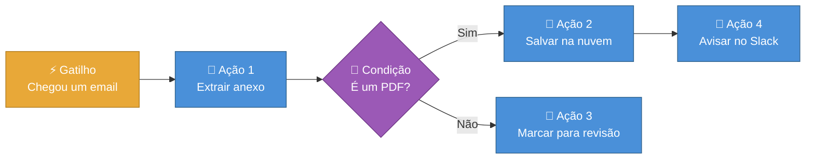
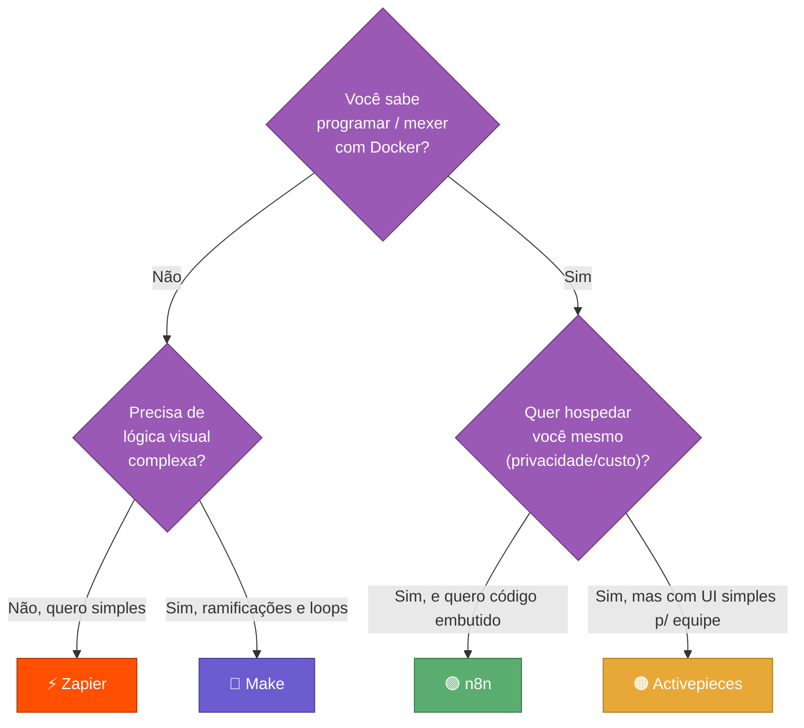
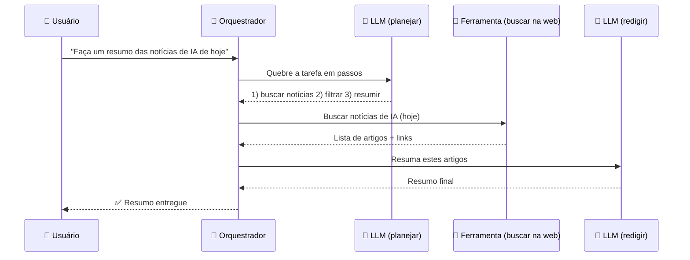
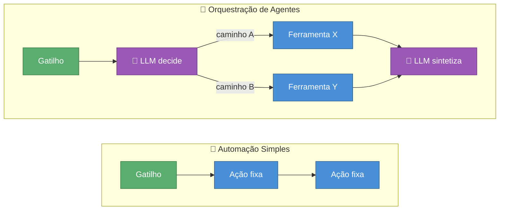
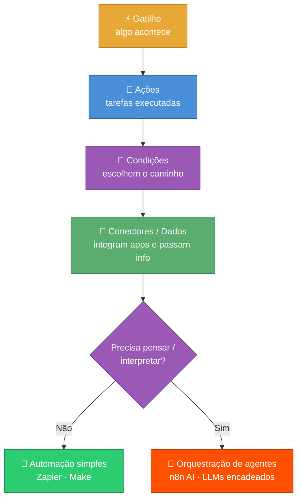

# Fluxos e Orquestração

> [!quote] A Máquina que Trabalha por Você
> *Automatizar é ensinar o computador a executar uma sequência de passos sozinho. Orquestrar é coordenar várias dessas peças (e, hoje, vários agentes de IA) para que trabalhem juntas em harmonia.*

---

## 🎯 O que é um Fluxo Automatizado (Workflow)

![[linha-de-montagem.png|Linha de montagem: cada estação faz uma tarefa e passa o resultado adiante]]

> [!info] Definição
> Um **workflow** (fluxo de trabalho automatizado) é uma sequência de passos que o computador executa **sozinho**, do início ao fim, sempre que algo o dispara. Você descreve a sequência **uma vez**; ela roda quantas vezes for preciso, sem você no meio.

A melhor analogia é a **linha de montagem** de uma fábrica:

| Linha de montagem | Workflow automatizado |
|-------------------|------------------------|
| Esteira começa a andar quando chega uma peça | **Gatilho** dispara quando chega um evento (email, formulário) |
| Cada estação faz uma tarefa | Cada **ação** faz uma operação (salvar, enviar, calcular) |
| A peça passa de uma estação para a outra | Os **dados** fluem de um passo para o próximo |
| Inspetor decide se a peça vai pra linha A ou B | **Condição** (if/then) escolhe o caminho |

> [!tip] Por que automatizar?
> - Elimina tarefas repetitivas e chatas (copiar/colar, reenviar email)
> - Roda 24/7, sem cansar e sem esquecer
> - Reduz erro humano: a mesma regra é aplicada sempre igual
> - Libera seu tempo para o que exige criatividade e julgamento

---

## 🧩 Anatomia de um Workflow

> [!info] As 5 peças que todo fluxo tem
> Independente da ferramenta, todo workflow é montado a partir destes blocos. Aprender os 5 = saber ler qualquer automação.

| Peça | O que é | Exemplo |
|------|---------|---------|
| ⚡ **Gatilho** (trigger) | O evento que **dá a partida** | "Chegou um email", "alguém enviou o formulário", "são 8h da manhã" |
| 🔧 **Ações** | As tarefas que o fluxo **executa** | Salvar arquivo, enviar mensagem, criar linha numa planilha |
| 🔀 **Condições** | Regras **if/then/else** que escolhem o caminho | "Se o valor > 1000, avise o gerente; senão, só registre" |
| 🔌 **Conectores** | Pontes (APIs) entre apps diferentes | Gmail ↔ Planilhas ↔ Slack ↔ WhatsApp |
| 📦 **Dados entre passos** | A informação que **flui** de um passo ao próximo | O email do passo 1 vira o "nome do cliente" no passo 3 |

> [!info] Conector = API
> Lembra da [[Conceitos gerais de programação|API]]? É exatamente o que um conector usa por baixo. A ferramenta no-code só esconde o código: por trás do botão "enviar mensagem no Slack" há uma chamada à API do Slack. **Conector é uma API com cara amigável.**

> [!warning] Dados entre passos é o que mais confunde iniciante
> O grande "pulo do gato" de um workflow é referenciar o resultado de um passo anterior. Quase toda ferramenta usa uma sintaxe tipo `{{passo1.email}}` ou um menu de "campos disponíveis". Se a ação 3 não enxerga o dado da ação 1, o fluxo quebra silenciosamente.

---

> [!example] 🧪 Atividade 1: Seu Primeiro Fluxo (Manual Trigger → HTTP → ver resultado)
>
> **Ferramenta:** [Make.com](https://www.make.com) (plano gratuito, 1.000 operações/mês, sem cartão de crédito) ou [n8n.io](https://n8n.io) (trial cloud).
>
> **Meta:** disparar um fluxo na mão e ver dados reais voltando de uma API pública.
>
> **Passo a passo (Make):**
> 1. Crie uma conta gratuita em [make.com](https://www.make.com) e clique em **"Create a new scenario"**.
> 2. Adicione o módulo **HTTP → "Make a request"**.
> 3. Em **URL**, cole: `https://api.adviceslip.com/advice` (API pública, sem chave, devolve um conselho aleatório em JSON).
> 4. Em **Method**, deixe `GET`. Marque **"Parse response"** como **Yes**.
> 5. Clique em **"Run once"** (o botão de play). Esse clique é o seu **gatilho manual**.
>
> **Resultado observável:** a bolinha do módulo fica verde e, ao clicar nela, você vê o JSON retornado, com um campo `slip.advice` contendo a frase de conselho. **Se aparecer o conselho, seu primeiro fluxo executou de verdade.**
>
> **Entregável:** print da tela mostrando a execução verde + o campo `advice` com o texto retornado.

---

## ⚙️ Ferramentas No-Code / Low-Code

> [!info] No-code vs Low-code
> - **No-code:** você monta tudo arrastando blocos e preenchendo campos. Zero programação. (Zapier, Make)
> - **Low-code:** o visual cobre 90%, mas você pode injetar um trecho de código (JS/Python) quando precisa de algo fora do padrão. (n8n, Activepieces)

![[maestro.png|Maestro coordenando músicos: a ferramenta de orquestração rege os apps]]

### 🛠️ As 4 ferramentas principais (2026)

| Ferramenta | Estilo | Onde roda | Pontos fortes | Preço (entrada) |
|------------|--------|-----------|---------------|------------------|
| **Zapier** | No-code | Nuvem | 7.000+ integrações, UI simplíssima, setup em 5 min | ~US\$ 20/mês (750 tarefas) |
| **Make** | No-code visual | Nuvem | Editor em fluxograma, loops, tratamento de erro, barato por operação | ~US\$ 9/mês (10.000 operações) |
| **n8n** | Low-code | Nuvem **ou** self-hosted | Open source, código JS/Python embutido, nós de IA, execuções ilimitadas no self-hosted | Self-hosted grátis; nuvem ~US\$ 20/mês |
| **Activepieces** | Low-code | Nuvem **ou** self-hosted | Open source, UI simples (estilo Zapier), workflows de aprovação, colaboração | Self-hosted grátis; nuvem ~US\$ 15/mês |

> [!tip] Qual escolher? (guia rápido)
> - **Você não programa e quer o máximo de apps prontos** → **Zapier**
> - **Você quer lógica visual, ramificações e laços, pagando pouco** → **Make**
> - **Você é técnico, precisa de privacidade/volume alto ou quer hospedar você mesmo** → **n8n**
> - **Você quer o poder open source do n8n, mas com cara de Zapier e foco em equipe** → **Activepieces**

> [!info] Open source importa
> n8n e Activepieces são **open source**: o código é público e você pode rodar no seu próprio servidor de graça. Isso significa **sem limite de execuções** e **seus dados nunca saem da sua máquina**, ao custo de você administrar a infraestrutura (Linux, Docker). Zapier e Make são fechados e cobram por volume, mas você não administra nada.

---

> [!example] 🧪 Atividade 2: Fluxo de Duas Ações com Dado Passando Entre Elas
>
> **Ferramenta:** [Make.com](https://www.make.com) (gratuito).
>
> **Meta:** provar que você consegue **encadear** dois passos, com o dado do passo 1 alimentando o passo 2.
>
> **Passo a passo:**
> 1. Novo scenario. Módulo 1: **HTTP → "Make a request"** com URL `https://catfact.ninja/fact` (devolve um fato aleatório sobre gatos em JSON, sem chave). Marque **Parse response = Yes**.
> 2. Módulo 2: adicione **Tools → "Set variable"** (ou **"Text aggregator"**).
> 3. No campo de valor do módulo 2, **clique no campo `fact`** que aparece no menu de dados do módulo 1 (isso cria a referência `{{1.fact}}`). Prefixe com o texto: `Fato do dia: `.
> 4. Clique em **"Run once"**.
>
> **Resultado observável:** o módulo 2 produz uma string como `Fato do dia: Cats sleep 70% of their lives.` **O texto só aparece se o dado realmente passou do módulo 1 para o módulo 2**: é a prova de que você dominou o "dados entre passos".
>
> **Desafio extra:** adicione um terceiro módulo com uma **condição (Router/Filter)**: só siga adiante se o tamanho do fato for maior que 50 caracteres.

---

## 🤖 Orquestração de Agentes de IA

> [!info] De automação para orquestração
> Até aqui, os fluxos eram **determinísticos**: gatilho → ação → ação, sempre o mesmo caminho. **Orquestrar agentes de IA** é coordenar um ou mais **LLMs** (modelos de linguagem, como o ChatGPT/Claude) que **raciocinam, usam ferramentas e decidem o próximo passo** dentro do fluxo.

A analogia agora é o **maestro de orquestra**: cada músico (agente/ferramenta) é especialista no seu instrumento; o maestro (o orquestrador) decide quem toca, quando, e junta tudo numa peça coerente.

### 🔗 Encadeando LLMs e ferramentas (pipeline de múltiplos passos)

Um agente de IA não é só "uma chamada ao ChatGPT". Ele costuma seguir um **pipeline**: a saída de uma etapa de IA vira a entrada da próxima, e no meio ele pode **chamar ferramentas** (buscar na web, rodar código, consultar um banco de dados).

> [!tip] Padrões clássicos de orquestração de agentes (2026)
> - **Prompt chaining (encadeamento):** quebra a tarefa em etapas fixas; a saída de uma vira entrada da próxima. (Ex.: rascunhar → revisar → formatar)
> - **Routing (roteamento):** um classificador olha a entrada e manda para o agente especialista certo (e pode usar modelo barato p/ tarefa fácil, caro p/ tarefa difícil).
> - **Orchestrator-workers:** um agente central divide a tarefa e delega a vários "trabalhadores" especializados, depois junta os resultados.
> - **Evaluator-optimizer:** um agente gera, outro critica; repete até a qualidade passar no critério.
> - **ReAct (Reason + Act):** o agente alterna entre **raciocinar** ("o que sei? o que falta?") e **agir** (chamar uma ferramenta), adaptando-se a cada passo.

> [!success] Ferramentas já trazem IA embutida
> Em 2026, as próprias plataformas no-code viraram orquestradores de IA. O **n8n 2.0** (jan/2026) adicionou o **AI Agent Node**, integração nativa com LangChain (70+ nós de IA), memória persistente entre execuções e suporte a banco vetorial para **RAG**. Ou seja: dá para montar um agente que raciocina e usa ferramentas **arrastando blocos**, sem escrever um framework do zero.

---

## ⚖️ Automação Simples vs Orquestração de Agentes

> [!info] A diferença que cai na prova
> **Automação simples segue regras. Orquestração de agentes toma decisões.**

| Aspecto | 🔁 Automação simples | 🤖 Orquestração de agentes |
|---------|----------------------|-----------------------------|
| **Caminho** | Fixo, definido por você | Dinâmico, o agente decide |
| **Decisão** | `if/then` que você escreveu | O LLM raciocina sobre o contexto |
| **Entrada inesperada** | Quebra ou ignora | Tenta se adaptar |
| **Previsibilidade** | Alta (sempre igual) | Menor (depende do raciocínio) |
| **Custo por execução** | Baixo e estável | Maior (cada chamada de LLM custa) |
| **Quando usar** | Tarefa repetível e bem definida | Tarefa aberta, que exige interpretação |
| **Exemplo** | "Chegou email → salve o anexo" | "Leia o email, decida se é urgente, redija a resposta e escolha quem notificar" |

> [!warning] Nem tudo precisa de IA
> Colocar um LLM onde um `if` resolveria é **caro, lento e imprevisível**. A regra de ouro: use automação determinística sempre que o caminho for conhecido; só traga agentes de IA quando a tarefa exigir **interpretação, raciocínio ou linguagem natural**. Os melhores sistemas de 2026 **misturam os dois**: o esqueleto é determinístico (com checkpoints e timeouts) e o "cérebro" de IA entra só nos pontos que precisam pensar.

---

> [!example] 🧪 Atividade 3: Pipeline com Passo de IA (encadear ferramenta → LLM)
>
> **Ferramenta:** [Make.com](https://www.make.com) gratuito. Você vai precisar conectar um módulo de IA. Use o módulo **OpenAI** com o crédito grátis de teste, **ou** (se não tiver chave) substitua o passo de IA por **"Text parser"** e siga o caminho alternativo no fim.
>
> **Meta:** montar um mini-pipeline de 2 estágios: **buscar dado real (ferramenta) → processar com IA (LLM)**, exatamente o padrão de orquestração de agentes.
>
> **Passo a passo:**
> 1. Módulo 1: **HTTP → "Make a request"**, URL `https://catfact.ninja/fact`, `Parse response = Yes`. (Sua "ferramenta" que traz dado do mundo real.)
> 2. Módulo 2: **OpenAI → "Create a Completion / Message"**. No prompt, escreva: `Traduza para português e explique para uma criança: {{1.fact}}`. Note que `{{1.fact}}` injeta a saída do passo 1 no LLM, isto é **encadeamento**.
> 3. Clique em **"Run once"**.
>
> **Resultado observável:** o módulo 2 devolve o fato sobre gatos **traduzido e simplificado** pela IA. Você acabou de orquestrar uma ferramenta + um LLM num pipeline. **Se o texto final estiver em português e mais simples que o original em inglês, o encadeamento funcionou.**
>
> **Caminho alternativo (sem chave de IA):** troque o módulo 2 por **"Text parser → Replace"** e transforme o texto (ex.: deixar tudo MAIÚSCULO). Você ainda pratica o encadeamento de dois passos; só não tem o "cérebro" de IA no meio.
>
> **Entregável:** print da execução completa (módulo 1 verde + módulo 2 verde) com o texto final visível.

---

## 🧠 Quiz Rápido (conceitual, opcional)

> [!question] Teste seu entendimento
> 1. Numa automação, o que é o **gatilho** e como ele difere de uma **ação**?
> 2. Por que dizemos que um **conector** "é uma API com cara amigável"?
> 3. Você precisa automatizar "quando chega um boleto por email, salve na nuvem e avise no grupo". Qual ferramenta você escolheria e por quê?
> 4. Dê um exemplo de tarefa que **NÃO** vale a pena resolver com agente de IA (um `if` bastaria).
> 5. No padrão **ReAct**, o que o agente faz entre "raciocinar" e "agir"?

---

## 🗺️ Resumo Visual: Do Gatilho ao Agente

> [!success] O que você levou desta aula
> - **Workflow** é uma linha de montagem digital: gatilho → ações, rodando sozinho
> - Todo fluxo se monta com **5 peças**: gatilho, ações, condições, conectores e dados entre passos
> - **Zapier/Make** (no-code) para o dia a dia; **n8n/Activepieces** (low-code, open source) para poder e privacidade
> - **Orquestrar agentes de IA** é encadear LLMs + ferramentas num pipeline onde a IA **decide**
> - **Automação segue regras; agentes tomam decisões**, e os melhores sistemas misturam os dois

---

> [!note] 📚 Fontes (2026)
> - [Self-Hosted vs Cloud: n8n, Zapier, Make e Activepieces Comparados (2026) | F3 Fund It](https://f3fundit.com/workflow-automation-n8n-zapier-make-activepieces-2026/)
> - [Best Workflow Automation Tools 2026: Zapier vs n8n vs Make | Flowgraph](https://flowgraph.in/blog/best-workflow-automation-tools-2026)
> - [n8n vs Make vs Zapier (2026 Comparison) | Digidop](https://www.digidop.com/blog/n8n-vs-make-vs-zapier)
> - [What Is No-Code Automation? | Activepieces](https://www.activepieces.com/blog/what-is-no-code-automation)
> - [No-code automation: A guide to building workflows | Zapier](https://zapier.com/blog/no-code-automation/)
> - [No-Code Workflow Automation: The Complete 2026 Guide | WeWeb](https://www.weweb.io/blog/no-code-workflow-automation-complete-guide)
> - [The AI Agentic Workflow Patterns That Actually Matter in 2026 | Medium](https://medium.com/@sathishkraju/the-ai-agentic-workflow-patterns-that-actually-matter-in-2026-08955ac6f398)
> - [LLM Orchestration in 2026: Frameworks + Best Practices | Orq.ai](https://orq.ai/blog/llm-orchestration)
> - [Agentic AI Explained: Workflows vs Agents | Orkes](https://orkes.io/blog/agentic-ai-explained-agents-vs-workflows/)
> - [AI Agents vs Traditional Automation | ezIntegrations](https://ezintegrations.ai/ai-agents-vs-traditional-automation/)
> - [Make.com Webhooks Tutorial | Use Apify](https://use-apify.com/blog/make-com-webhooks-tutorial)
> - [Big List of Free and Open Public APIs (No Auth Needed) 2026 | Mixed Analytics](https://mixedanalytics.com/blog/list-actually-free-open-no-auth-needed-apis/)
