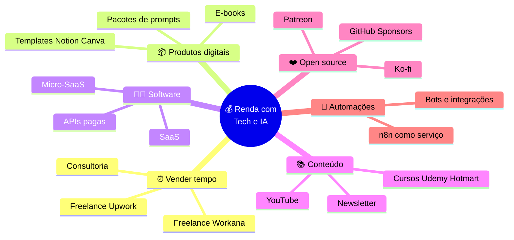
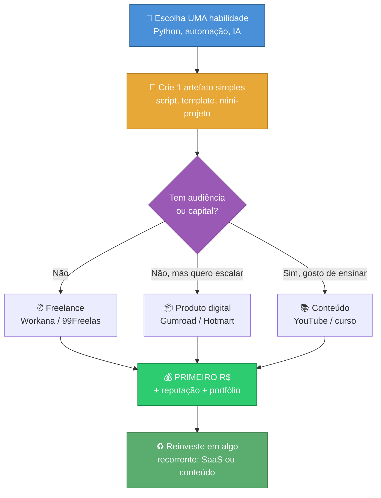
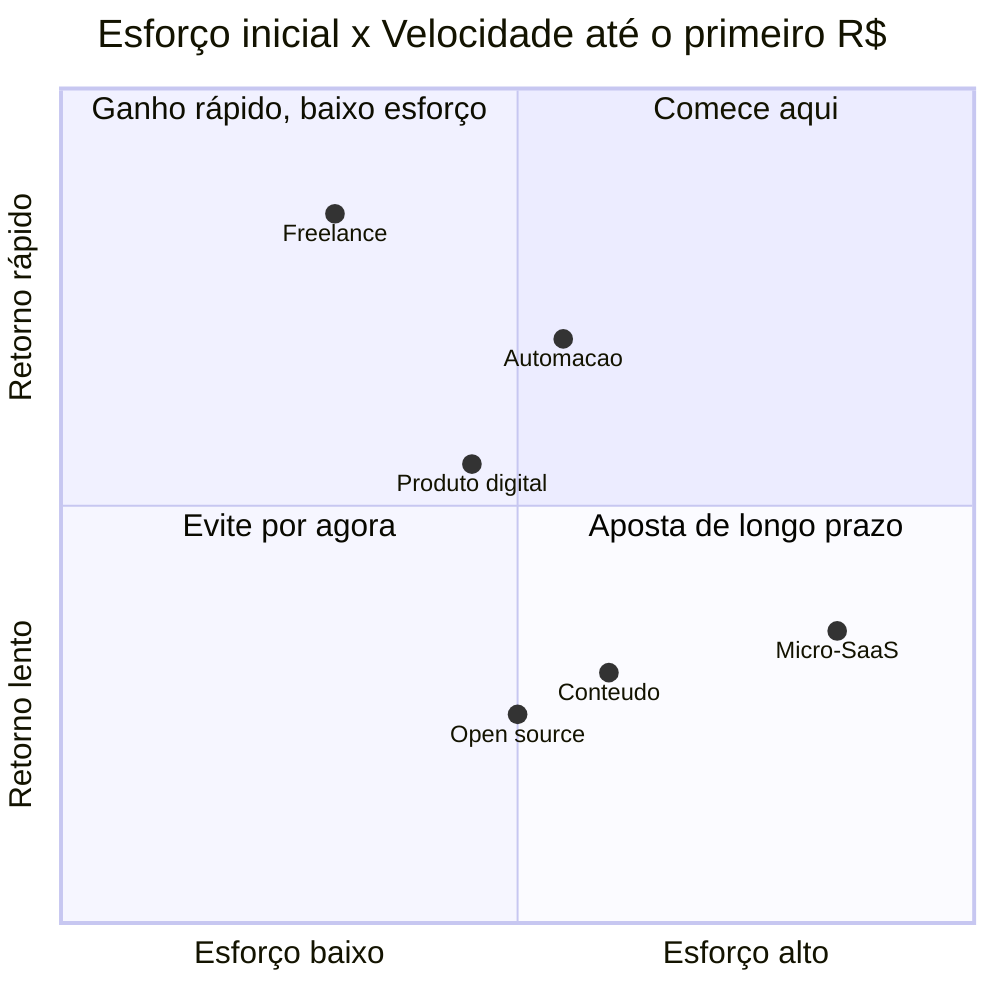

# Formas de Ganhar Dinheiro com Tecnologia e IA

> [!quote] Múltiplas Fontes de Renda
> *Em 2026, ganhar dinheiro com tecnologia deixou de ser novidade e virou execução. Quem sabe programar (ou pelo menos sabe usar IA bem) tem mais formas de gerar renda do que em qualquer momento da história.*

---

## 📊 Visão Geral

![[Recursos/Roadmap do futuro/Formas de ganhar dinheiro/image.png|Formas de ganhar dinheiro]]

> [!info] Cinco grandes blocos
> Toda renda cai em um destes cinco modelos. Os três últimos (negócio, conteúdo e código) são os que mais escalam, porque não trocam **tempo por dinheiro** de forma linear.

| Modelo | O que você vende | Escala? | Esforço inicial |
|--------|------------------|---------|-----------------|
| ⏰ **Tempo** | Suas horas (freelance, consultoria) | Não (limite de horas) | Baixo |
| 💵 **Dinheiro** | Capital que rende (investimentos) | Sim | Precisa de capital |
| 💼 **Negócio** | Produto/serviço de outras pessoas | Sim | Médio |
| 📚 **Conteúdo** | Conhecimento empacotado (curso, livro, vídeo) | Sim | Médio/alto |
| 🧑‍💻 **Código** | Software que roda sozinho (SaaS, API, app) | Muito | Alto |

> [!tip] A grande mudança de 2026
> Ferramentas de IA (Claude Code, Cursor, Copilot) fazem um desenvolvedor entregar **3 a 5x mais rápido**. Isso derrubou a barreira de entrada: dá pra construir e lançar um micro-produto em um fim de semana. O gargalo deixou de ser "saber codar" e passou a ser **achar o problema certo e executar**.

---

## 🧠 Mapa das Formas de Renda



> [!info] Como ler o mapa
> Não escolha "o melhor". Escolha **por onde começar** dado o seu momento: sem audiência e sem dinheiro guardado, freelance e produtos digitais dão retorno mais rápido. Com tempo e disciplina, software e conteúdo constroem renda recorrente.

---

## ⏰ Freelance: a porta de entrada mais rápida

> [!info] O que é
> Você é contratado por projeto ou por hora para resolver um problema técnico de alguém (criar um site, um script, uma automação, corrigir um bug). É a forma mais rápida de chegar ao **primeiro R\$** porque a demanda já existe e você não precisa criar nada do zero.

### Principais plataformas (2026)

| Plataforma | Mercado | Comissão da plataforma | Indicada para |
|------------|---------|------------------------|---------------|
| **Workana** | Brasil / LatAm | 5% a 15% por projeto | Iniciante BR |
| **99Freelas** | Brasil | 5% a 20% (mín. R\$ 10) | Iniciante BR |
| **Upwork** | Internacional | ~10% por projeto | Quem tem inglês |
| **Fiverr** | Internacional | 20% | Serviços "de prateleira" |

> [!success] Prós
> - Começa **hoje**: cadastro grátis, paga só quando ganha.
> - Demanda real e constante (empresas precisam de IA mas não sabem aplicar).
> - Constrói portfólio e reputação que valem pra todo o resto.

> [!warning] Contras
> - Troca **tempo por dinheiro**: parou de trabalhar, parou de ganhar.
> - Concorrência alta no começo (preços baixos até ter avaliações).
> - Você é o "produto": não escala sem virar agência.

> [!tip] Faixa de ganho realista
> Iniciante bem posicionado: primeiros trabalhos em **1 a 2 semanas** enviando 5-10 propostas por dia. Freelancer consolidado usando IA: **US\$ 2.000 a US\$ 15.000/mês** segundo relatos de mercado em 2026.

---

> [!example] 🧪 Atividade 1: Montar seu perfil de freelancer
>
> **Plataforma:** [Workana](https://www.workana.com/) (ou [99Freelas](https://www.99freelas.com.br/) se preferir 100% Brasil)
>
> **O que fazer (passo a passo):**
> 1. Acesse a Workana e crie uma conta gratuita como **Freelancer**.
> 2. Preencha o perfil: foto, título (ex.: "Desenvolvedor Python e Automações com IA"), e uma descrição de 3-4 linhas com o que você sabe fazer.
> 3. Adicione pelo menos **uma habilidade** (skill tag), ex.: `Python`, `Automação`, `IA`.
> 4. Defina sua **categoria** e disponibilidade.
>
> **Resultado observável:** O perfil aparece publicado com a URL própria dele (algo como `workana.com/freelancer/seu-usuario`).
>
> **Entregável:** A **URL pública** do seu perfil + print da tela mostrando o perfil completo (foto, título e habilidades visíveis).

---

## 📦 Produtos Digitais: criar uma vez, vender várias

> [!info] O que é
> Um arquivo que você cria uma única vez e vende repetidas vezes sem custo adicional por venda: um template, um e-book, um pacote de prompts, uma planilha inteligente. É o primeiro degrau da **renda escalável**.

### Plataformas e taxas (2026)

| Plataforma | Taxa por venda | Forte em |
|------------|----------------|----------|
| **Gumroad** | 10% (plano grátis) | Internacional, simples |
| **Hotmart** | 9,9% + R\$ 0,50 | Brasil, e-books e cursos |
| **PromptBase** | comissão sobre prompts | Venda de prompts prontos |

> [!success] Prós
> - Escala: o esforço é fixo, a receita cresce com as vendas.
> - Custo de "estoque" zero (é só um arquivo).
> - Ótimo primeiro produto: um template ou e-book sai em poucos dias.

> [!warning] Contras
> - Sem audiência, ninguém descobre seu produto (precisa de marketing).
> - Mercado de prompts/templates já está cheio: tem que ser **específico**.
> - A primeira venda costuma demorar mais que o primeiro freelance.

> [!tip] Onde mora o dinheiro: especificidade
> "20 prompts de IA" não vende. "20 prompts de IA para dentistas captarem pacientes no Instagram" vende. Quanto mais nichado e mais real a dor que resolve, maior o preço que aguenta. Faixa típica de entrada: **R\$ 27 a R\$ 97**.

---

> [!example] 🧪 Atividade 2: Publicar um produto digital de rascunho
>
> **Plataforma:** [Gumroad](https://gumroad.com/) (conta grátis)
>
> **O que fazer (passo a passo):**
> 1. Crie uma conta gratuita no Gumroad.
> 2. Clique em **"New product"** → tipo **Digital product**.
> 3. Dê um nome **específico e nichado** (ex.: "Pacote de 15 Prompts para Estudar Programação com IA").
> 4. Crie um arquivo simples de verdade: um PDF ou `.txt` com 10-15 prompts que você mesmo usaria (pode gerar em poucos minutos).
> 5. Faça upload do arquivo, defina um preço (pode ser **R\$ 0** ou "pague quanto quiser"), e clique em **Publish**.
>
> **Resultado observável:** Uma página de venda funcional, pública, com botão de compra/download.
>
> **Entregável:** A **URL da página do produto** no Gumroad + print mostrando título, preço e o botão de compra ativos.

---

## 🧑‍💻 SaaS e Micro-SaaS: software que trabalha por você

> [!info] O que é
> **SaaS** (Software as a Service) é um software que o cliente acessa por assinatura mensal, hospedado na nuvem (ex.: Spotify, Netflix são SaaS). **Micro-SaaS** é a versão "solo": um produto pequeno, focado num nicho, mantido por uma pessoa só. É o modelo com **maior teto de ganho** e o mais difícil.

> [!success] Prós
> - Receita **recorrente** (MRR): o cliente paga todo mês.
> - Maior teto: fundadores solo chegam a **US\$ 5.000 a US\$ 50.000/mês**, mas leva 12-24 meses.
> - IA acelera muito a construção (dá pra lançar um MVP em dias).

> [!warning] Contras
> - Esforço inicial alto: além de codar, tem suporte, cobrança, marketing.
> - Maioria não decola; sucesso exige **resolver dor específica de um nicho**.
> - Tempo até o primeiro pagante é longo comparado a freelance.

> [!tip] O segredo do micro-SaaS
> Não tente competir com a IA genérica. Escolha um nicho onde **você entende a dor melhor que um modelo de IA genérico** (ex.: uma ferramenta só pra professores lançarem notas, ou só pra petshops agendarem banho). Especificidade vence generalidade.

---

## 📚 Criação de Conteúdo: conhecimento empacotado

> [!info] O que é
> Transformar o que você sabe em material que outras pessoas consomem: vídeos no **YouTube**, cursos na **Udemy/Hotmart**, uma **newsletter**. Monetiza por anúncios, vendas de curso, patrocínio ou assinatura.

| Canal | Como ganha | Ritmo até o 1º R\$ |
|-------|------------|-------------------|
| **YouTube** | Anúncios + patrocínio + venda própria | Lento (precisa de audiência) |
| **Udemy** | Venda de curso (marketplace traz alunos) | Médio |
| **Hotmart** | Venda de curso (você traz o tráfego) | Médio |
| **Newsletter** | Assinatura paga + patrocínio | Lento |

> [!success] Prós
> - Constrói **autoridade**: alimenta todas as outras formas de renda.
> - Escala enorme: um vídeo bom rende por anos.
> - Custo de produção baixíssimo (celular + edição).

> [!warning] Contras
> - Retorno **lento**: meses ou anos até virar dinheiro de verdade.
> - Exige consistência (a maioria desiste antes de colher).
> - Algoritmo manda: você depende da plataforma para ser descoberto.

> [!info] Atenção: Udemy, não "Hotmail"
> A plataforma de cursos é a **Udemy** (e a **Hotmart**, brasileira). "Hotmail" é um serviço de e-mail antigo, nada a ver. Confusão comum, mas o nome correto importa na hora de pesquisar.

---

## ❤️ Open Source com Doações: ser pago para construir

> [!info] O que é
> Você cria um projeto de código aberto útil (uma biblioteca, uma ferramenta) e as pessoas que o usam **doam** para apoiar a manutenção. O principal canal é o **GitHub Sponsors**, mas também existem **Ko-fi**, **Patreon** e **Open Collective**.

> [!success] Prós
> - Constrói portfólio e reputação técnica reais (visível no GitHub).
> - Renda alinhada com fazer o que você já gosta (escrever código aberto).
> - Funciona junto com tudo (um projeto OS atrai clientes de freela e SaaS).

> [!warning] Contras
> - Doações raramente pagam as contas sozinhas (é complemento, não salário).
> - Depende de o projeto **virar popular e útil** para muita gente.
> - Manter open source dá trabalho (issues, PRs, suporte gratuito).

> [!tip] Como funciona o FUNDING.yml
> Para mostrar o botão **"Sponsor"** no seu repositório, basta criar um arquivo `.github/FUNDING.yml` na branch principal. Ele lista para quais plataformas as pessoas podem doar:
>
> ```yaml
> github: [seu-usuario]
> ko_fi: seu-usuario
> patreon: seu-usuario
> custom: ["https://www.paypal.me/seu-usuario"]
> ```
>
> Plataformas aceitas incluem: `github`, `ko_fi`, `patreon`, `open_collective`, `liberapay`, `buy_me_a_coffee`, `polar`, `tidelift` e até 4 links `custom`.

---

> [!example] 🧪 Atividade 3: Habilitar doações em um repositório
>
> **Plataforma:** [GitHub](https://github.com/) (conta grátis)
>
> **O que fazer (passo a passo):**
> 1. Crie um repositório novo (público) ou use um que você já tenha.
> 2. Crie um arquivo no caminho exato: **`.github/FUNDING.yml`**.
> 3. Cole o conteúdo abaixo, trocando `seu-usuario` pelo seu (e ajustando os links que você realmente tem; pode deixar só o `ko_fi` ou só o `custom` se ainda não tiver GitHub Sponsors aprovado):
>
> ```yaml
> ko_fi: seu-usuario
> custom: ["https://www.paypal.me/seu-usuario"]
> ```
>
> 4. Faça o **commit** na branch principal.
>
> **Resultado observável:** Um botão **"Sponsor"** (❤️) aparece no topo da página do repositório.
>
> **Entregável:** A **URL do repositório** + print mostrando o botão "Sponsor" visível na interface do GitHub.

---

## 🤖 Automação como Serviço: vender o "robô" pronto

> [!info] O que é
> Você cria automações que economizam horas de trabalho repetitivo para empresas (responder WhatsApp, integrar planilhas com sistemas, gerar relatórios) usando ferramentas como **n8n**, **Make** ou **Zapier**. Vende o projeto pronto e, idealmente, uma **manutenção mensal recorrente**.

> [!success] Prós
> - Demanda explodindo em 2026 (empresas querem IA mas não sabem implementar).
> - Ferramentas no-code/low-code (n8n) reduzem a barreira de código.
> - Permite renda recorrente via plano de manutenção mensal.

> [!warning] Contras
> - Precisa entender o **processo do negócio** do cliente, não só a ferramenta.
> - Suporte pós-entrega consome tempo (a automação quebra, o cliente liga).
> - Vender exige mostrar **economia concreta** (horas/erros evitados).

> [!tip] Faixa de preço (2026)
> Projetos de automação no mercado BR ficam entre **R\$ 1.000 e R\$ 10.000** por projeto, conforme a complexidade. Modelos de cobrança: preço fixo (escopo fechado), por hora (ajustes frequentes) ou **plano mensal recorrente** (manutenção + melhorias). Esse último é o que dá renda estável.

---

## 🗺️ O Caminho do Iniciante: do zero ao primeiro R\$



> [!success] A regra de ouro do iniciante
> **Velocidade até o primeiro R\$ importa mais que o tamanho do potencial.** Um freelance de R\$ 200 fechado nesta semana ensina mais (e motiva mais) que um plano de SaaS milionário que nunca sai do papel. Comece pequeno, ganhe o primeiro real, e reinvista em algo que escale.

---

## ⚖️ Esforço x Retorno: onde cada modelo cai



> [!info] Lendo o gráfico
> **Freelance** está no canto ideal pra iniciante: esforço relativamente baixo e retorno rápido. **Micro-SaaS** e **conteúdo** ficam no quadrante de longo prazo: esforço alto, retorno lento, mas teto altíssimo. A estratégia esperta é financiar o longo prazo com o curto prazo.

---

## 📋 Resumo Comparativo

| Modelo | Velocidade 1º R\$ | Escala | Esforço | Renda recorrente? |
|--------|:----------------:|:------:|:-------:|:-----------------:|
| ⏰ Freelance | 🟢 Rápida | 🔴 Baixa | 🟢 Baixo | ❌ |
| 📦 Produto digital | 🟡 Média | 🟢 Alta | 🟡 Médio | 🟡 Parcial |
| 🤖 Automação | 🟡 Média | 🟡 Média | 🟡 Médio | ✅ (com plano) |
| 📚 Conteúdo | 🔴 Lenta | 🟢 Alta | 🟡 Médio | 🟡 Parcial |
| ❤️ Open source | 🔴 Lenta | 🟡 Média | 🟡 Médio | 🟡 Doações |
| 🧑‍💻 Micro-SaaS | 🔴 Lenta | 🟢 Muito alta | 🔴 Alto | ✅ |

> [!danger] Erro mais comum
> Querer começar pelo modelo de maior teto (SaaS, YouTube) sem nunca ter ganho o primeiro real. Resultado: meses de esforço, zero retorno, desistência. Inverta: **garanta o primeiro R\$ rápido**, depois suba a escada de escala.

---

## 🧩 Quiz Conceitual (opcional)

> [!question] Teste seu entendimento
> 1. Qual modelo de renda **não escala** porque troca tempo por dinheiro de forma linear?
> 2. Por que "20 prompts de IA" vende mal e "20 prompts de IA para dentistas" vende bem?
> 3. Qual arquivo, em qual pasta, ativa o botão "Sponsor" num repositório do GitHub?
> 4. Cite um motivo pelo qual a IA (Claude Code, Cursor) baixou a barreira para criar um micro-SaaS em 2026.
> 5. Para um iniciante sem audiência e sem capital, qual o caminho mais rápido até o primeiro R\$ e por quê?

---

> [!note] 📚 Fontes (2026)
> - [Como ganhar dinheiro com IA: 12 formas reais em 2026 | Algoritmo Diário](https://algoritmodiario.com/artigos/como-ganhar-dinheiro-com-ia-em-2026.php)
> - [Melhores Maneiras de Ganhar Dinheiro com IA em 2026 | Bitrue](https://www.bitrue.com/pt/blog/best-ways-to-make-money-with-ai-in-2026)
> - [7 AI Side Hustles That Pay Real Money in 2026 (For People Who Can Code) | Abhishek Gautam](https://www.abhs.in/blog/ai-side-hustles-for-developers-2026)
> - [50 Micro SaaS Ideas for 2026 That Actually Make Money | NxCode](https://www.nxcode.io/resources/news/micro-saas-ideas-2026)
> - [Onde encontrar freelance em 2026: sites confiáveis | TechTudo](https://www.techtudo.com.br/listas/2026/01/onde-encontrar-freelance-em-2026-sites-confiaveis-para-ganhar-dinheiro-edsoftwares.ghtml)
> - [Taxas das Plataformas em 2026: Hotmart, Upwork, Workana | FreelaSemCrise](https://www.freelasemcrise.com.br/blog/taxas-plataformas-hotmart-upwork-workana)
> - [Workana: como começar e conseguir o primeiro trabalho em 2026 | Ganhe Recompensa](https://ganherecompensa.com.br/blog/workana-como-comecar-conseguir-primeiro-trabalho-2026)
> - [Vender Prompts no PromptBase, Gumroad e Hotmart: Guia Prático | MinhasSkills](https://minhaskills.io/en/blog/vender-prompts-promptbase-gumroad-hotmart/)
> - [Displaying a sponsor button in your repository | GitHub Docs](https://docs.github.com/en/repositories/managing-your-repositorys-settings-and-features/customizing-your-repository/displaying-a-sponsor-button-in-your-repository)
> - [Getting started with GitHub Sponsors | The GitHub Blog](https://github.blog/open-source/maintainers/getting-started-with-github-sponsors/)
> - [Quanto cobrar por automação no n8n: guia 2026 | Hora de Codar](https://horadecodar.com.br/quanto-cobrar-automacao-whatsapp-n8n/)
